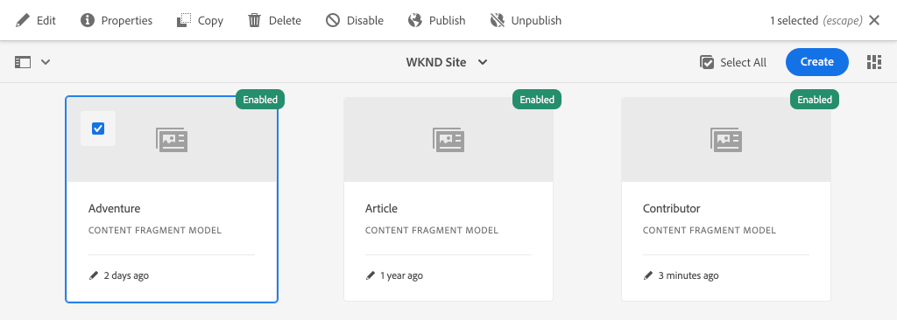
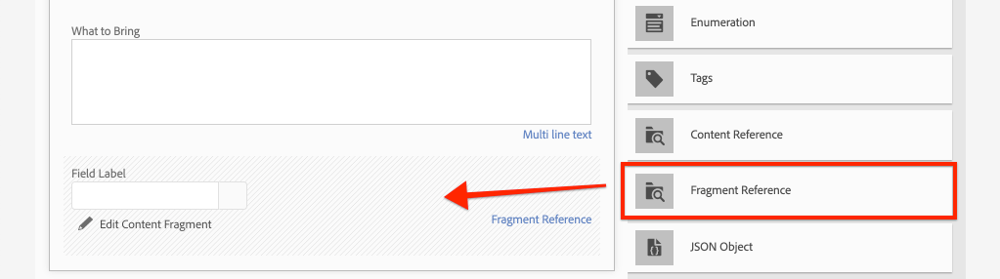
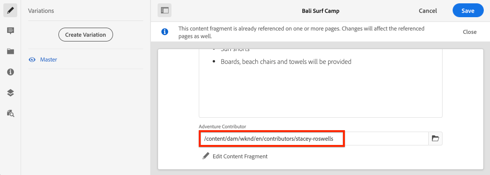

# Modelado de datos avanzado con referencias de fragmento

Es posible hacer referencia a un fragmento de contenido desde otro fragmento de contenido. Esto permite al usuario crear modelos de datos complejos con relaciones entre fragmentos.

En este capítulo, actualizará el modelo de aventura para incluir una referencia al modelo colaborador mediante el uso de la variable **Referencia de fragmento** campo . También aprenderá a modificar una consulta de GraphQL para incluir campos de un modelo al que se hace referencia.

## Requisitos previos

Se trata de un tutorial en varias partes y se da por hecho que se han completado los pasos descritos en las partes anteriores.

## Objetivos

En este capítulo, aprenderemos a:

* Actualizar un modelo de fragmento de contenido para utilizar el campo Referencia de fragmento
* Crear una consulta de GraphQL que devuelva campos de un modelo al que se hace referencia

## Agregar una referencia de fragmento {#add-fragment-reference}

Actualice el modelo de fragmento de contenido de aventura para añadir una referencia al modelo colaborador.

1. Abra un explorador nuevo y vaya a AEM.
1. En el **Inicio de AEM** vaya a **Herramientas** > **Recursos** > **Modelos de fragmento de contenido** > **Sitio WKND**.
1. Abra el **Aventura** Modelo de fragmento de contenido

   

1. En **Tipos de datos**, arrastre y suelte una **Referencia de fragmento** en el panel principal.

   

1. Actualice el **Propiedades** para este campo con lo siguiente:

   * Procesar como - `fragmentreference`
   * Etiqueta de campo - **Colaborador de aventura**
   * Nombre de propiedad - `adventureContributor`
   * Tipo de modelo: seleccione el **Colaborador** model
   * Ruta de acceso raíz - `/content/dam/wknd`

   

   El nombre de propiedad `adventureContributor` ahora se puede usar para hacer referencia a un fragmento de contenido de colaborador.

1. Guarde los cambios en el modelo.

## Asignar un colaborador a una aventura

Ahora que el modelo de fragmento de contenido de aventura se ha actualizado, podemos editar un fragmento existente y hacer referencia a un colaborador. Cabe señalar que la edición del modelo de fragmento de contenido *afecta* cualquier fragmento de contenido existente creado a partir de él.

1. Vaya a **Recursos** > **Archivos** > **Sitio WKND** > **Inglés** > **Aventuras** > **[Campo de surf de Bali](http://localhost:4502/assets.html/content/dam/wknd/en/adventures/bali-surf-camp)**.

   

1. Haga clic en **Campo de surf de Bali** fragmento de contenido para abrir el Editor de fragmentos de contenido.
1. Actualice el **Colaborador de aventura** y seleccione un colaborador haciendo clic en el icono de carpeta.

   

   *Seleccionar una ruta a un fragmento de colaborador*

   

   Observe que solo los fragmentos creados con la variable **Colaborador** se pueden seleccionar.

1. Guarde los cambios en el fragmento.

1. Repita los pasos anteriores para asignar un colaborador a aventuras como [Mochila yosemite](http://localhost:4502/editor.html/content/dam/wknd/en/adventures/yosemite-backpacking/yosemite-backpacking) y [Colorado Rock Climbing](http://localhost:4502/editor.html/content/dam/wknd/en/adventures/colorado-rock-climbing/colorado-rock-climbing)

## Consultar fragmento de contenido anidado con GraphiQL

A continuación, realice una consulta para una aventura y añada propiedades anidadas del modelo colaborador al que se hace referencia. Utilizaremos la herramienta GraphiQL para verificar rápidamente la sintaxis de la consulta.

1. Vaya a la herramienta GraphiQL en AEM: [http://localhost:4502/content/graphiql.html](http://localhost:4502/content/graphiql.html)

1. Introduzca la siguiente consulta:

   ```graphql
   {
     adventureByPath(_path:"/content/dam/wknd/en/adventures/bali-surf-camp/bali-surf-camp") {
        item {
          _path
          adventureTitle
          adventureContributor {
            fullName
            occupation
            pictureReference {
           ...on ImageRef {
             _path
           }
         }
       }
     }
    }
   }
   ```

   La consulta anterior es para una sola Aventura por su ruta. La variable `adventureContributor` hace referencia al modelo de colaborador y, a continuación, podemos solicitar propiedades desde el fragmento de contenido anidado.

1. Ejecute la consulta y debe obtener un resultado como el siguiente:

   ```json
   {
     "data": {
       "adventureByPath": {
           "item": {
               "_path": "/content/dam/wknd/en/adventures/bali-surf-camp/bali-surf-camp",
               "adventureTitle": "Bali Surf Camp",
               "adventureContributor": {
                   "fullName": "Stacey Roswells",
                   "occupation": "Photographer",
                   "pictureReference": {
                       "_path": "/content/dam/wknd/en/contributors/stacey-roswells.jpg"
                   }
               }
           }
        }
     }
   }
   ```

1. Experimente con otras consultas como `adventureList` y agregar propiedades para el fragmento de contenido al que se hace referencia en `adventureContributor`.

## Actualizar la aplicación React para mostrar el contenido del colaborador

A continuación, actualice las consultas utilizadas por la aplicación React para incluir el nuevo colaborador y mostrar información sobre el colaborador como parte de la vista de detalles de Aventura.

1. Abra la aplicación WKND GraphQL React en su IDE.

1. Abra el archivo `src/components/AdventureDetail.js`.

   

1. Buscar la función `adventureDetailQuery(_path)`. La variable `adventureDetailQuery(..)` simplemente ajusta una consulta GraphQL de filtrado, que usa AEM `<modelName>ByPath` para consultar un solo fragmento de contenido identificado por su ruta JCR.

1. Actualice la consulta para incluir información sobre el colaborador al que se hace referencia:

   ```javascript
   function adventureDetailQuery(_path) {
       return `{
           adventureByPath (_path: "${_path}") {
           item {
               _path
               adventureTitle
               adventureActivity
               adventureType
               adventurePrice
               adventureTripLength
               adventureGroupSize
               adventureDifficulty
               adventurePrice
               adventurePrimaryImage {
                   ... on ImageRef {
                   _path
                   mimeType
                   width
                   height
                   }
               }
               adventureDescription {
                   html
               }
               adventureItinerary {
                   html
               }
               adventureContributor {
                   fullName
                   occupation
                   pictureReference {
                       ...on ImageRef {
                           _path
                       }
                   }
               }
             }
          }
        }
       `;
   }
   ```

   Con esta actualización, propiedades adicionales sobre la variable `adventureContributor`, `fullName`, `occupation`y `pictureReference` se incluye en la consulta.

1. Inspect la variable `Contributor` componente incrustado en el `AdventureDetail.js` file at `function Contributor(...)`. Este componente renderizará el nombre, la ocupación y la imagen del colaborador si existen las propiedades.

   La variable `Contributor` se hace referencia al componente en la variable `AdventureDetail(...)` `return` método:

   ```javascript
   function AdventureDetail(props) {
       ...
       return (
           ...
            <h2>Itinerary</h2>
           <hr />
           <div className="adventure-detail-itinerary"
                dangerouslySetInnerHTML={{__html: adventureData.adventureItinerary.html}}></div>
           {/* Contributor component is instaniated and 
               is passed the adventureContributor object from the GraphQL Query results */}
           <Contributer {...adventureData.adventureContributor} />
           ...
       )
   }
   ```

1. Guarde los cambios en el archivo.
1. Inicie la aplicación React si aún no se está ejecutando:

   ```shell
   $ cd aem-guides-wknd-graphql/react-app
   $ npm start
   ```

1. Vaya a [http://localhost:3000](http://localhost:3000/) y haga clic en una aventura que tenga un colaborador al que se hace referencia. Ahora debería ver la información de colaborador que aparece a continuación del **Itinerario**:

   

## Felicitaciones!{#congratulations}

Felicitaciones! Ha actualizado un modelo de fragmento de contenido existente para que haga referencia a un fragmento de contenido anidado mediante la variable **Referencia de fragmento** campo . También ha aprendido a modificar una consulta de GraphQL para incluir campos de un modelo al que se hace referencia.

## Siguientes pasos {#next-steps}

En el capítulo siguiente, [Implementación de producción mediante un entorno de publicación de AEM](./production-deployment.md), obtenga información sobre los servicios de AEM Author y Publish y el patrón de implementación recomendado para aplicaciones sin encabezado. Actualizará una aplicación existente para utilizar variables de entorno para cambiar dinámicamente un extremo de GraphQL en función del entorno de destino. También aprenderá a configurar correctamente AEM para el uso compartido de recursos de origen cruzado (CORS).
