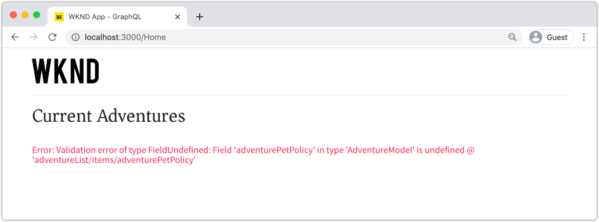

# Consulta AEM con GraphQL desde una aplicación externa

En este capítulo, analizamos cómo AEM API de GraphQL se pueden utilizar para impulsar la experiencia en una aplicación externa.

Este tutorial utiliza una aplicación React simple para consultar y mostrar contenido de Aventura expuesto por las API de AEM GraphQL. El uso de React no es muy importante, y la consumidora aplicación externa podría ser escrita en cualquier marco para cualquier plataforma.

## Requisitos previos

Se trata de un tutorial en varias partes y se da por hecho que se han completado los pasos descritos en las partes anteriores.

_Las capturas de pantalla IDE de este capítulo provienen del código de  [Visual Studio.](https://code.visualstudio.com/)_

Opcionalmente, instale una extensión del explorador como [Inspector de red de GraphQL](https://chrome.google.com/webstore/detail/graphql-network-inspector/ndlbedplllcgconngcnfmkadhokfaaln) para poder ver más detalles sobre una consulta de GraphQL.

## Objetivos

En este capítulo, aprenderemos a:

* Inicio y comprensión de la funcionalidad de la aplicación React de ejemplo
* Explore cómo se realizan llamadas desde la aplicación externa a AEM puntos finales de GraphQL
* Defina una consulta de GraphQL para filtrar una lista de fragmentos de contenido de aventuras por actividad
* Actualice la aplicación React para proporcionar controles para filtrar mediante GraphQL, la lista de aventuras por actividad

## Inicio de la aplicación React

Dado que este capítulo se centra en el desarrollo de un cliente para consumir fragmentos de contenido sobre GraphQL, el código fuente de la aplicación WKND GraphQL React de muestra debe descargarse y configurarse](./setup.md#react-app) en el equipo local, y el SDK de [AEM se está ejecutando como el servicio Autor](./setup.md#aem-sdk) con el [sitio WKND de muestra instalado](./setup.md#wknd-site).[

El inicio de la aplicación React se describe con más detalle en el capítulo [Quick Setup](./setup.md) , pero se pueden seguir las instrucciones abreviadas:

1. Si aún no lo ha hecho, clone la aplicación WKND GraphQL React de ejemplo de [Github.com](https://github.com/adobe/aem-guides-wknd-graphql)

   ```shell
   $ git clone --branch tutorial/react git@github.com:adobe/aem-guides-wknd-graphql.git
   ```

1. Abra la aplicación WKND GraphQL React en su IDE

   

1. Desde la línea de comandos, vaya a la carpeta `react-app`
1. Inicie la aplicación WKND GraphQL React ejecutando el siguiente comando desde la raíz del proyecto (la carpeta `react-app`)

   ```shell
   $ cd aem-guides-wknd-graphql/react-app
   $ npm start
   ```

1. Revise la aplicación en [http://localhost:3000/](http://localhost:3000/). La aplicación React de ejemplo tiene dos partes principales:

   * La experiencia principal actúa como un índice de WKND Adventures, consultando los __Fragmentos de contenido de aventura__ en AEM usando GraphQL. En este capítulo, modificaremos esta vista para admitir el filtrado de aventuras por actividad.

      

   * La experiencia de detalles de aventura, utiliza GraphQL para consultar el fragmento de contenido específico __Adventure__ y muestra más puntos de datos.

      

1. Utilice las herramientas de desarrollo del explorador y una extensión del explorador como [GraphQL Network Inspector](https://chrome.google.com/webstore/detail/graphql-network-inspector/ndlbedplllcgconngcnfmkadhokfaaln) para inspeccionar las consultas de GraphQL enviadas a AEM y sus respuestas JSON. Este método se puede utilizar para monitorizar las solicitudes y respuestas de GraphQL para garantizar que se formulen correctamente y que sus respuestas se correspondan con lo esperado.

   

   *Consulta de GraphQL enviada a AEM desde la aplicación React*

   

   *Respuesta JSON de AEM a la aplicación React*

   Las consultas y la respuesta deben coincidir con lo que se vio en el IDE de GraphiQL.

   >[!NOTE]
   >
   > Durante el desarrollo, la aplicación React se configura para peticiones HTTP proxy a través del servidor de desarrollo de webpack para AEM. La aplicación React está realizando solicitudes a `http://localhost:3000`, lo que los dirige al servicio Autor de AEM que se ejecuta en `http://localhost:4502`. Revise el archivo `src/setupProxy.js` y `env.development` para obtener más información.
   >
   > En escenarios que no sean de desarrollo, la aplicación React se configuraría directamente para realizar solicitudes a AEM.

## Explorar el código de GraphQL de la aplicación

1. En su IDE, abra el archivo `src/api/useGraphQL.js`.

   Se trata de un [React Effect Hook](https://reactjs.org/docs/hooks-overview.html#effect-hook) que escucha los cambios en la aplicación `query`, y al cambiar realiza una solicitud de POST HTTP al punto final de AEM GraphQL y devuelve la respuesta JSON a la aplicación.

   Cada vez que la aplicación React necesita realizar una consulta de GraphQL, invoca este enlace `useGraphQL(query)` personalizado, pasando GraphQL para enviarlo a AEM.

   Este enlace utiliza el módulo simple `fetch` para realizar la solicitud de HTTP POST GraphQL, pero otros módulos como el cliente [Apollo GraphQL](https://www.apollographql.com/docs/react/) pueden usarse de manera similar.

1. Abra `src/components/Adventures.js` en el IDE, que es responsable de la lista de aventuras de la vista principal, y revise la invocación del enlace `useGraphQL`.

   Este código establece el `query` predeterminado como `allAdventuresQuery` tal como se define más abajo en este archivo.

   ```javascript
   const [query, setQuery] = useState(allAdventuresQuery);
   ```

   ... y cada vez que la variable `query` cambia, se invoca el enlace `useGraphQL` , que a su vez ejecuta la consulta de GraphQL contra AEM, devolviendo el JSON a la variable `data` , que se utiliza para procesar la lista de aventuras.

   ```javascript
   const { data, errorMessage } = useGraphQL(query);
   ```

   El `allAdventuresQuery` es una consulta constante de GraphQL definida en el archivo, que consulta todos los fragmentos de contenido de aventura, sin ningún filtro, y devuelve solo los puntos de datos que necesitan para representar la vista de inicio.

   ```javascript
   const allAdventuresQuery = `
   {
       adventureList {
         items {
           _path
           adventureTitle
           adventurePrice
           adventureTripLength
           adventurePrimaryImage {
           ... on ImageRef {
               _path
               mimeType
               width
               height
             }
           }
         }
     }
   }
   `;
   ```

1. Abra `src/components/AdventureDetail.js`, el componente React responsable de mostrar la experiencia de detalles de aventura. Esta vista solicita un fragmento de contenido específico, utiliza su ruta JCR como su identificador único y procesa los detalles proporcionados.

   De forma similar a `Adventures.js`, el enlace `useGraphQL` React Hook personalizado se reutiliza para realizar esa consulta de GraphQL con AEM.

   La ruta del fragmento de contenido se recopila de la `props` parte superior del componente para especificar el fragmento de contenido para el que se va a realizar la consulta.

   ```javascript
   const contentFragmentPath = props.location.pathname.substring(props.match.url.length);
   ```

   ... y la consulta parametrizada de GraphQL se construye utilizando la función `adventureDetailQuery(..)` y se pasa a `useGraphQL(query)` , que ejecuta la consulta de GraphQL con AEM y devuelve los resultados a la variable `data` .

   ```javascript
   const { data, errorMessage } = useGraphQL(adventureDetailQuery(contentFragmentPath));
   ```

   La función `adventureDetailQuery(..)` simplemente ajusta una consulta GraphQL de filtrado, que utiliza AEM sintaxis `<modelName>ByPath` para consultar un solo fragmento de contenido identificado por su ruta JCR y devuelve todos los puntos de datos especificados necesarios para procesar los detalles de la aventura.

   ```javascript
   function adventureDetailQuery(_path) {
   return `{
       adventureByPath (_path: "${_path}") {
         item {
           _path
           adventureTitle
           adventureActivity
           adventureType
           adventurePrice
           adventureTripLength
           adventureGroupSize
           adventureDifficulty
           adventurePrice
           adventurePrimaryImage {
               ... on ImageRef {
               _path
               mimeType
               width
               height
               }
           }
           adventureDescription {
               html
           }
           adventureItinerary {
               html
           }
         }
       }
   }
   `;
   }
   ```

## Crear una consulta de GraphQL parametrizada

A continuación, vamos a modificar la aplicación React para realizar consultas parametrizadas y filtradas de GraphQL que restrinjan la vista principal por la actividad de las aventuras.

1. En su IDE, abra el archivo : `src/components/Adventures.js`. Este archivo representa el componente de aventuras de la experiencia principal, que consulta y muestra las tarjetas de aventuras.
1. Inspect utiliza la función `filterQuery(activity)`, que no se utiliza, pero que se ha preparado para formular una consulta de GraphQL que filtra las aventuras por `activity`.

   Observe que el parámetro `activity` se inserta en la consulta de GraphQL como parte de `filter` en el campo `adventureActivity`, lo que requiere que el valor de ese campo coincida con el valor del parámetro.

   ```javascript
   function filterQuery(activity) {
       return `
           {
           adventures (filter: {
               adventureActivity: {
               _expressions: [
                   {
                   value: "${activity}"
                   }
                 ]
               }
           }){
               items {
               _path
               adventureTitle
               adventurePrice
               adventureTripLength
               adventurePrimaryImage {
               ... on ImageRef {
                   _path
                   mimeType
                   width
                   height
               }
               }
             }
         }
       }
       `;
   }
   ```

1. Actualice la instrucción `return` del componente React Adventures para añadir botones que invoquen el nuevo `filterQuery(activity)` parametrizado para proporcionar las aventuras que desea enumerar.

   ```javascript
   function Adventures() {
       ...
       return (
           <div className="adventures">
   
           {/* Add these three new buttons that set the GraphQL query accordingly */}
   
           {/* The first button uses the default `allAdventuresQuery` */}
           <button onClick={() => setQuery(allAdventuresQuery)}>All</button>
   
           {/* The 2nd and 3rd button use the `filterQuery(..)` to filter by activity */}
           <button onClick={() => setQuery(filterQuery('Camping'))}>Camping</button>
           <button onClick={() => setQuery(filterQuery('Surfing'))}>Surfing</button>
   
           <ul className="adventure-items">
           ...
       )
   }
   ```

1. Guarde los cambios y vuelva a cargar la aplicación React en el navegador web. Los tres nuevos botones aparecen en la parte superior y, al hacer clic en ellos, se vuelven a consultar automáticamente AEM fragmentos de contenido de aventura con la actividad correspondiente.

   

1. Intente agregar más botones de filtrado para las actividades: `Rock Climbing`, `Cycling` y `Skiing`

## Gestión de errores de GraphQL

GraphQL tiene un tipo inflexible y, por lo tanto, puede devolver mensajes de error útiles si la consulta no es válida. A continuación, simulemos una consulta incorrecta para ver el mensaje de error devuelto.

1. Vuelva a abrir el archivo `src/api/useGraphQL.js`. Inspect muestra el siguiente fragmento de código para ver la gestión de errores:

   ```javascript
   //useGraphQL.js
   .then(({data, errors}) => {
           //If there are errors in the response set the error message
           if(errors) {
               setErrors(mapErrors(errors));
           }
           //Otherwise if data in the response set the data as the results
           if(data) {
               setData(data);
           }
       })
       .catch((error) => {
           setErrors(error);
       });
   ```

   La respuesta se inspecciona para ver si incluye un objeto `errors`. El objeto `errors` lo enviará AEM si hay problemas con la consulta de GraphQL, como un campo indefinido basado en el esquema. Si no hay ningún objeto `errors`, se establece el `data` y se devuelve.

   El `window.fetch` incluye una instrucción `.catch` para *catch* cualquier error común, como una solicitud HTTP no válida o si no se puede establecer la conexión con el servidor.

1. Abra el archivo `src/components/Adventures.js`.
1. Modifique `allAdventuresQuery` para incluir una propiedad no válida `adventurePetPolicy`:

   ```javascript
   /**
    * Query for all Adventures
    * adventurePetPolicy has been added beneath items
   */
   const allAdventuresQuery = `
   {
       adventureList {
         items {
           adventurePetPolicy
           _path
           adventureTitle
           adventurePrice
           adventureTripLength
           adventurePrimaryImage {
           ... on ImageRef {
               _path
               mimeType
               width
               height
           }
           }
         }
       }
   }
   `;
   ```

   Sabemos que `adventurePetPolicy` no forma parte del modelo de aventura, por lo que esto debería generar un déclencheur de error.

1. Guarde los cambios y vuelva al explorador. Debería ver un mensaje de error como el siguiente:

   

   La API de GraphQL detecta que `adventurePetPolicy` no está definido en `AdventureModel` y devuelve un mensaje de error apropiado.

1. Inspect la respuesta de AEM usando las herramientas de desarrollador del navegador para ver el objeto JSON `errors`:

   

   El objeto `errors` es detallado e incluye información sobre la ubicación de la consulta con formato incorrecto y la clasificación del error.

1. Vuelva a `Adventures.js` y revierta el cambio de consulta para devolver la aplicación a su estado correcto.

## Felicitaciones!{#congratulations}

Felicitaciones! Ha explorado correctamente el código de la aplicación WKND GraphQL React de muestra y lo ha actualizado para que utilice consultas de GraphQL parametrizadas y filtradas para enumerar las aventuras por actividad. También tiene la oportunidad de explorar algunas funciones básicas de gestión de errores.

## Siguientes pasos {#next-steps}

En el siguiente capítulo, [Modelado de datos avanzado con referencias de fragmento](./fragment-references.md) aprenderá a utilizar la función Referencia de fragmento para crear una relación entre dos fragmentos de contenido diferentes. También aprenderá a modificar una consulta de GraphQL para incluir el campo de un modelo al que se hace referencia.
