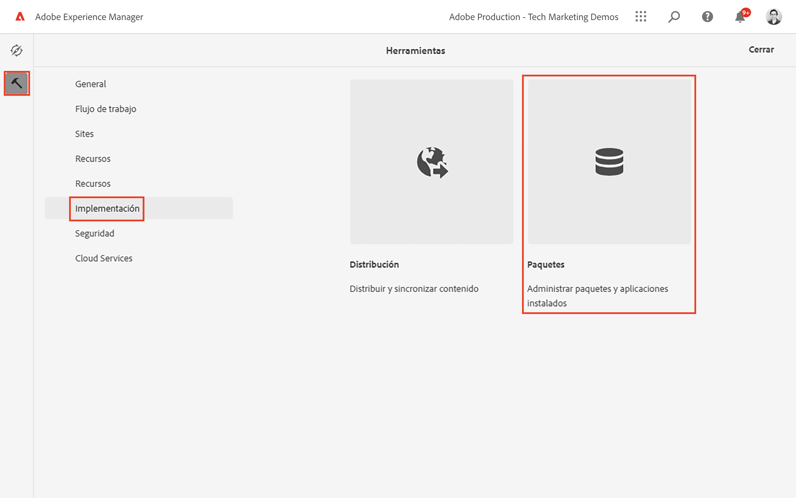
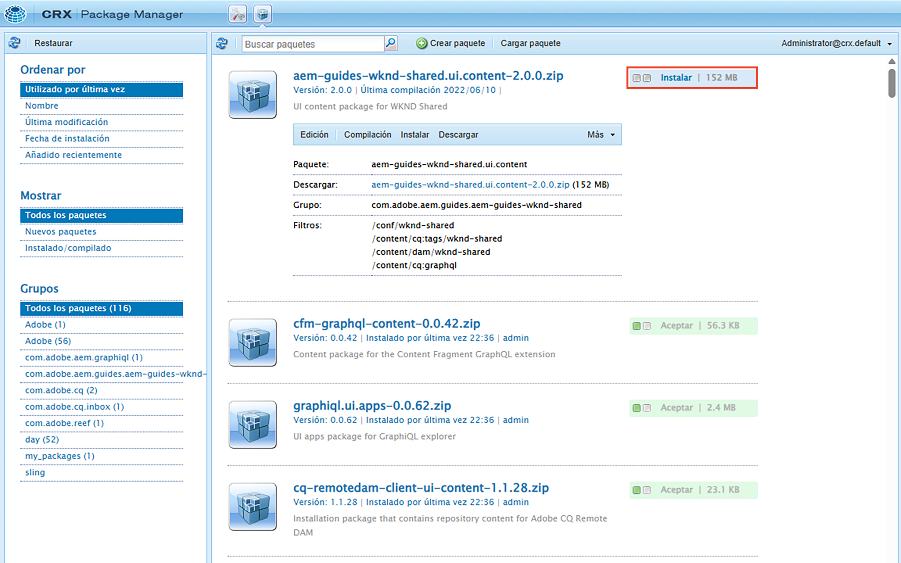

# Introducción a AEM sin encabezado: GraphQL

Un tutorial completo que ilustra cómo crear y exponer contenido mediante las API de GraphQL de AEM y consumido por una aplicación externa, en un escenario de CMS remoto.

Este tutorial explora cómo se pueden utilizar AEM API de GraphQL y capacidades sin encabezado para impulsar las experiencias que aparecen en una aplicación externa.

Este tutorial tratará los siguientes temas:

* Crear una nueva configuración de proyecto
* Crear nuevos modelos de fragmento de contenido para modelar datos
* Cree nuevos fragmentos de contenido basados en los modelos creados anteriormente.
* Explore cómo se pueden consultar los fragmentos de contenido en AEM mediante la herramienta de desarrollo integrada GraphiQL.
* Para almacenar o mantener las consultas de GraphQL en AEM
* Consumir consultas de GraphQL persistentes desde una aplicación React de muestra

## Requisitos previos {#prerequisites}

Se requieren las siguientes opciones para seguir este tutorial:

* Capacidades básicas de HTML y JavaScript
* Las siguientes herramientas deben instalarse localmente:
   * [Node.js v10+](https://nodejs.org/en/)
   * [npm 6+](https://www.npmjs.com/)
   * [Git](https://git-scm.com/)
   * Un IDE (por ejemplo, [Código Microsoft® Visual Studio](https://code.visualstudio.com/))

### Entorno AEM

Se requiere un entorno de Adobe Experience Manager para completar este tutorial. Se puede utilizar cualquiera de las siguientes opciones (las capturas de pantalla se registran desde un entorno as a Cloud Service AEM):

* AEM entorno as a Cloud Service con:
   * [Acceso a AEM as a Cloud Service y Cloud Manager](/help/cloud-service/accessing/overview.md)
      * **Administrador AEM** acceso a AEM as a Cloud Service
      * **Cloud Manager: desarrollador** acceso a Cloud Manager

### Instalar contenido de ejemplo {#install-sample-content}

Puede resultar útil que el contenido de muestra ya esté disponible en el entorno de AEM para utilizarlo como referencia.

1. Vaya a la [AEM proyecto compartido WKND](https://github.com/adobe/aem-guides-wknd-shared/releases).
1. Descargue el recurso más reciente: `aem-guides-wknd-shared.ui.content-x.x.x.zip`.
1. Inicie sesión en el entorno de creación de AEM que se utilizará para el tutorial.
1. En la pantalla de inicio de AEM, vaya a **Herramientas** > **Implementación** > **Paquetes**:

   

1. Toque **Cargar paquete** y seleccione `aem-guides-wknd-shared.ui.content-x.x.x.zip` archivo descargado anteriormente. Toque **Ok** para cargar.
1. Una vez que el paquete haya terminado de cargarse, pulse **Instalar** para instalar el contenido.

   

1. Se instalarán fragmentos de contenido de muestra, modelos de fragmentos de contenido, imágenes y mucho más para la ficticia [Marca WKND](https://wknd.site/). Se hará referencia al contenido de muestra más adelante en el tutorial.

## ¡Empecemos!

1. Inicie el tutorial con [Definición de modelos de fragmento de contenido](content-fragment-models.md).

## Proyecto de GitHub

El código fuente y los paquetes de contenido están disponibles en la [Guías de AEM: proyecto de GitHub de WKND GraphQL](https://github.com/adobe/aem-guides-wknd-graphql).

Si encuentra algún problema con el tutorial o el código, deje un [Problema de GitHub](https://github.com/adobe/aem-guides-wknd-graphql/issues).

Puede encontrar fragmentos de contenido de muestra, modelos y consultas en la [AEM proyecto compartido WKND](https://github.com/adobe/aem-guides-wknd-shared)
