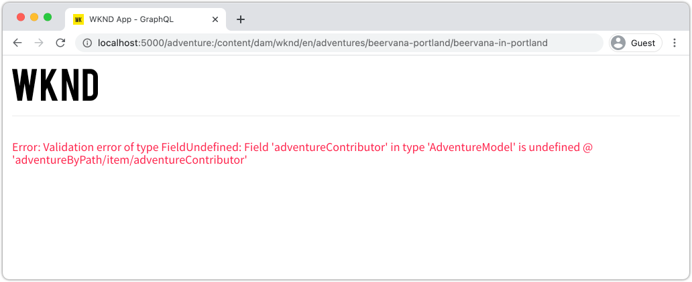

# Implementación de producción con un servicio de AEM Publish

En este tutorial, debe configurar un entorno local para simular el contenido que se distribuye desde una instancia de autor a una instancia de publicación. También generará la compilación de producción de una aplicación React configurada para consumir contenido del entorno de AEM Publish mediante las API de GraphQL. A lo largo del camino, aprenderá a utilizar de forma eficaz las variables de entorno y a actualizar las configuraciones AEM CORS.

## Requisitos previos

Este tutorial forma parte de un tutorial de varias partes. Se supone que se han completado los pasos descritos en las partes anteriores.

## Objetivos

Aprenda a:

* Comprenda la arquitectura de AEM Author y Publish.
* Conozca las prácticas recomendadas para administrar variables de entorno.
* Aprenda a configurar correctamente AEM para el uso compartido de recursos de origen cruzado (CORS).

## Patrón de implementación de publicación de autor {#deployment-pattern}

Un entorno de AEM completo está formado por un Autor, una Publicación y un Dispatcher. El servicio de creación es donde los usuarios internos crean, administran y previsualizan contenido. El servicio de publicación se considera el entorno &quot;activo&quot; y es lo que los usuarios finales interactúan con él. El contenido, después de editarse y aprobarse en el servicio de creación, se distribuye al de publicación.

El patrón de implementación más común con las aplicaciones sin encabezado de AEM es tener la versión de producción de la aplicación conectada a un servicio de publicación de AEM.


El diagrama anterior muestra este patrón de implementación común.

1. A **Autor de contenido** utiliza el servicio de creación de AEM para crear, editar y administrar contenido.
2. El **autor de contenido** y otros usuarios internos pueden obtener una previsualización del contenido directamente en el servicio de creación. Se puede configurar una versión de previsualización de la aplicación que se conecte al servicio de creación.
3. Una vez aprobado el contenido, se puede **publicado** al servicio AEM Publish.
4. **Los usuarios finales interactúan con la versión de producción de la aplicación.** La aplicación Producción se conecta al servicio Publicar y utiliza las API de GraphQL para solicitar y consumir contenido.

El tutorial simula la implementación anterior añadiendo una instancia de AEM Publish a la configuración actual. En capítulos anteriores, la aplicación React actuaba como una vista previa conectándose directamente a la instancia de Autor. Una compilación de producción de la aplicación React se implementa en un servidor Node.js estático que se conecta a la nueva instancia de Publish.

Al final, se están ejecutando tres servidores locales:

* http://localhost:4502 - Instancia de autor
* http://localhost:4503 - Publicar instancia
* http://localhost:5000 - React App en modo de producción, conectándose a la instancia de publicación.

## Instalación AEM SDK: modo de publicación {#aem-sdk-publish}

Actualmente tenemos una instancia en ejecución del SDK en **Autor** en el menú contextual. El SDK también se puede iniciar en **Publicación** para simular un entorno de publicación de AEM.

Una guía más detallada para configurar un entorno de desarrollo local [se puede encontrar aquí](https://experienceleague.adobe.com/docs/experience-manager-learn/cloud-service/local-development-environment-set-up/overview.html?lang=en#local-development-environment-set-up).

1. En el sistema de archivos local, cree una carpeta dedicada para instalar la instancia de publicación, es decir, denominada `~/aem-sdk/publish`.
1. Copie el archivo jar de inicio rápido utilizado para la instancia de autor en capítulos anteriores y péguelo en la sección `publish` directorio. Si lo prefiere, vaya a la [Portal de distribución de software](https://experience.adobe.com/#/downloads/content/software-distribution/es-es/aemcloud.html) y descargue el SDK más reciente y extraiga el archivo .jar de inicio rápido.
1. Cambie el nombre del archivo jar a `aem-publish-p4503.jar`.

   La variable `publish` cadena especifica que el jar de inicio rápido se inicia en modo Publicar. La variable `p4503` especifica que el servidor de inicio rápido se ejecuta en el puerto 4503.

1. Abra una nueva ventana de terminal y vaya a la carpeta que contiene el archivo jar. Instale e inicie la instancia de AEM:

   ```shell
   $ cd ~/aem-sdk/publish
   $ java -jar aem-publish-p4503.jar
   ```

1. Proporcione una contraseña de administrador como `admin`. Cualquier contraseña de administrador es aceptable, pero se recomienda utilizar el valor predeterminado para el desarrollo local para evitar configuraciones adicionales.
1. Cuando la instancia de AEM haya terminado de instalarse, se abrirá una nueva ventana del explorador en [http://localhost:4503/content.html](http://localhost:4503/content.html)

   Se espera que devuelva una página 404 no encontrada. Se trata de una instancia de AEM completamente nueva y no se ha instalado ningún contenido.

## Instalación del contenido de ejemplo y los extremos de GraphQL {#wknd-site-content-endpoints}

Al igual que en la instancia de autor, la instancia de publicación debe tener habilitados los extremos de GraphQL y necesita contenido de muestra. A continuación, instale el sitio de referencia de WKND en la instancia de publicación.

1. Descargue el paquete de AEM más reciente compilado para WKND Site: [aem-guides-wknd.all-x.x.x.zip](https://github.com/adobe/aem-guides-wknd/releases/latest).

   >[!NOTE]
   >
   > Asegúrese de descargar la versión estándar compatible con AEM as a Cloud Service y **not** el `classic` versión.

1. Inicie sesión en la instancia de publicación navegando directamente a: [http://localhost:4503/libs/granite/core/content/login.html](http://localhost:4503/libs/granite/core/content/login.html) con el nombre de usuario `admin` y contraseña `admin`.
1. A continuación, vaya al Administrador de paquetes en [http://localhost:4503/crx/packmgr/index.jsp](http://localhost:4503/crx/packmgr/index.jsp).
1. Haga clic en **Cargar paquete** y elija el paquete WKND descargado en el paso anterior. Haga clic en **Instalar** para instalar el paquete.
1. Después de instalar el paquete, el sitio de referencia WKND ya está disponible en [http://localhost:4503/content/wknd/us/en.html](http://localhost:4503/content/wknd/us/en.html).
1. Cierre la sesión como `admin` al hacer clic en el botón &quot;Cerrar sesión&quot; de la barra de menús.

   

   A diferencia de la instancia de autor de AEM, las instancias de publicación de AEM toman el acceso de solo lectura anónimo. Queremos simular la experiencia de un usuario anónimo al ejecutar la aplicación React.

## Actualizar variables de entorno para que apunten a la instancia de publicación {#react-app-publish}

A continuación, actualice las variables de entorno utilizadas por la aplicación React para que apunten a la instancia de Publish. La aplicación React debería **only** conéctese a la instancia Publicar en modo de producción.

A continuación, añada un nuevo archivo `.env.production.local` para simular la experiencia de producción.

1. Abra la aplicación WKND GraphQL React en su IDE.

1. Bajo `aem-guides-wknd-graphql/react-app`, añada un archivo denominado `.env.production.local`.
1. Rellenar `.env.production.local` con lo siguiente:

   ```plain
   REACT_APP_HOST_URI=http://localhost:4503
   REACT_APP_GRAPHQL_ENDPOINT=/content/graphql/global/endpoint.json
   ```

   

   El uso de variables de entorno facilita alternar el extremo de GraphQL entre un entorno de Author o Publish sin añadir lógica adicional dentro del código de la aplicación. Más información sobre [las variables de entorno personalizadas para React se encuentran aquí](https://create-react-app.dev/docs/adding-custom-environment-variables).

   >[!NOTE]
   >
   > Tenga en cuenta que no se incluye información de autenticación, ya que los entornos de publicación proporcionan acceso anónimo al contenido de forma predeterminada.

## Implementar un servidor de nodos estático {#static-server}

La aplicación React se puede iniciar usando el servidor de webpack, pero solo para desarrollo. A continuación, simule una implementación de producción utilizando [serve](https://github.com/vercel/serve) para alojar una compilación de producción de la aplicación React mediante Node.js.

1. Abra una nueva ventana de terminal y vaya a la `aem-guides-wknd-graphql/react-app` directory

   ```shell
   $ cd aem-guides-wknd-graphql/react-app
   ```

1. Instalar [serve](https://github.com/vercel/serve) con el siguiente comando:

   ```shell
   $ npm install serve --save-dev
   ```

1. Abra el archivo . `package.json` at `react-app/package.json`. Agregar una secuencia de comandos con el nombre `serve`:

   ```diff
    "scripts": {
       "start": "react-scripts start",
       "build": "react-scripts build",
       "test": "react-scripts test",
       "eject": "react-scripts eject",
   +   "serve": "npm run build && serve -s build"
   },
   ```

   La variable `serve` la secuencia de comandos realiza dos acciones. En primer lugar, se genera una compilación de producción de la aplicación React. Segundo, el servidor Node.js se inicia y utiliza la compilación de producción.

1. Vuelva al terminal e introduzca el comando para iniciar el servidor estático:

   ```shell
   $ npm run serve
   
   ┌────────────────────────────────────────────────────┐
   │                                                    │
   │   Serving!                                         │
   │                                                    │
   │   - Local:            http://localhost:5000        │
   │   - On Your Network:  http://192.168.86.111:5000   │
   │                                                    │
   │   Copied local address to clipboard!               │
   │                                                    │
   └────────────────────────────────────────────────────┘
   ```

1. Abra un explorador nuevo y vaya a [http://localhost:5000/](http://localhost:5000/). Debería ver la aplicación React que se está sirviendo.

   

   Observe que la consulta GraphQL funciona en la página principal. Inspect la variable **XHR** solicite con sus herramientas para desarrolladores. Observe que el POST de GraphQL se encuentra en la instancia Publicar en `http://localhost:4503/content/graphql/global/endpoint.json`.

   Sin embargo, ¡todas las imágenes están rotas en la página de inicio!

1. Haga clic en una de las páginas Detalles de aventura .

   

   Observe que se produce un error de GraphQL para `adventureContributor`. En los próximos ejercicios, las imágenes rotas y el `adventureContributor` se han corregido problemas.

## Referencias de imagen absoluta {#absolute-image-references}

Las imágenes parecen rotas porque la variable `` etiqueta:

   ```diff
   - 
   + 
   ```

1. Abra el archivo . `AdventureDetail.js` at `react-app/src/components/AdventureDetail.js`.
1. Repita los mismos pasos para modificar la consulta de GraphQL y añadir la variable `_publishUrl` propiedad para la aventura

   ```diff
    adventureByPath (_path: "${_path}") {
       item {
           _path
           adventureTitle
           adventureActivity
           adventureType
           adventurePrice
           adventureTripLength
           adventureGroupSize
           adventureDifficulty
           adventurePrice
           adventurePrimaryImage {
               ... on ImageRef {
               _path
   +           _publishUrl
               mimeType
               width
               height
               }
           }
           adventureDescription {
               html
           }
           adventureItinerary {
               html
           }
           adventureContributor {
               fullName
               occupation
               pictureReference {
                   ...on ImageRef {
                       _path
   +                   _publishUrl
                   }
               }
           }
       }
       }
   } 
   ```

1. Modifique las dos `` etiquetas para la imagen principal de Aventura y la referencia Imagen del colaborador en `AdventureDetail.js`:

   ```diff
   /* AdventureDetail.js */
   ...
   
   ...
   pictureReference =  
   ```

1. Vuelva al terminal e inicie el servidor estático:

   ```shell
   $ npm run serve
   ```

1. Vaya a [http://localhost:5000/](http://localhost:5000/) y observe que las imágenes aparecen y que la variable `` señala a `http://localhost:4503`.

   

## Simular la publicación de contenido {#content-publish}

Recuerde que se produce un error de GraphQL para `adventureContributor` cuando se solicita una página Detalles de aventura . La variable **Colaborador** El modelo de fragmento de contenido aún no existe en la instancia de publicación. Actualizaciones realizadas en **Aventura** El modelo de fragmento de contenido tampoco está disponible en la instancia de publicación. Estos cambios se realizaron directamente en la instancia de Autor y deben distribuirse en la instancia de Publicación.

Esto es algo a tener en cuenta al implementar nuevas actualizaciones en una aplicación que se base en actualizaciones de un fragmento de contenido o un modelo de fragmento de contenido.

A continuación, permite simular la publicación de contenido entre las instancias locales Author y Publish .

1. Inicie la instancia de autor (si no está iniciada) y vaya al Administrador de paquetes en [http://localhost:4502/crx/packmgr/index.jsp](http://localhost:4502/crx/packmgr/index.jsp)
1. Descargar el paquete [EnableReplicationAgent.zip](./assets/publish-deployment/EnableReplicationAgent.zip) e instálelo mediante el Administrador de paquetes.

   Este paquete instala una configuración que permite que la instancia de autor publique contenido en la instancia de publicación. Pasos manuales para [esta configuración se puede encontrar aquí](https://experienceleague.adobe.com/docs/experience-manager-learn/cloud-service/local-development-environment-set-up/aem-runtime.html?lang=en#content-distribution).

   >[!NOTE]
   >
   > En un entorno as a Cloud Service AEM, el nivel Autor se configura automáticamente para distribuir contenido al nivel Publicar .

1. En el **Inicio de AEM** , vaya a **Herramientas** > **Recursos** > **Modelos de fragmento de contenido**.

1. Haga clic en **Sitio WKND** carpeta.

1. Seleccione los tres modelos y haga clic en **Publicación**:

   

   Aparece un cuadro de diálogo de confirmación, haga clic en **Publicación**.

1. Vaya al fragmento de contenido del campamento de surf de Bali en [http://localhost:4502/editor.html/content/dam/wknd/en/adventures/bali-surf-camp/bali-surf-camp](http://localhost:4502/editor.html/content/dam/wknd/en/adventures/bali-surf-camp/bali-surf-camp).

1. Haga clic en el **Publicación** en la barra de menús superior.

   

1. El asistente Publicar muestra los recursos dependientes que se deben publicar. En este caso, el fragmento al que se hace referencia **stacey-roswells** y se hace referencia a varias imágenes. Los recursos a los que se hace referencia se publican junto con el fragmento .

   

   Haga clic en el **Publicación** para publicar el fragmento de contenido y los recursos dependientes.

1. Vuelva a la aplicación React que se ejecuta en [http://localhost:5000/](http://localhost:5000/). Ahora puede hacer clic en el Bali Surf Camp para ver los detalles de la aventura.

1. Vuelva a la instancia de autor de AEM en [http://localhost:4502/editor.html/content/dam/wknd/en/adventures/bali-surf-camp/bali-surf-camp](http://localhost:4502/editor.html/content/dam/wknd/en/adventures/bali-surf-camp/bali-surf-camp) y actualice la variable **Título** del fragmento. **Guardar y cerrar** el fragmento. Entonces **publicar** el fragmento.
1. Volver a [http://localhost:5000/adventure:/content/dam/wknd/en/adventures/bali-surf-camp/bali-surf-camp](http://localhost:5000/adventure:/content/dam/wknd/en/adventures/bali-surf-camp/bali-surf-camp) y observe los cambios publicados.

   

## Actualizar la configuración de COR

AEM es seguro de forma predeterminada y no permite que las propiedades web que no sean AEM realicen llamadas del lado del cliente. AEM configuración de Cross-Origin Resource Sharing (CORS) puede permitir que dominios específicos realicen llamadas a AEM.

A continuación, experimente con la configuración CORS de la instancia de AEM Publish.

1. Vuelva a la ventana de terminal donde la aplicación React se está ejecutando con el comando . `npm run serve`:

   ```shell
   ┌────────────────────────────────────────────────────┐
   │                                                    │
   │   Serving!                                         │
   │                                                    │
   │   - Local:            http://localhost:5000        │
   │   - On Your Network:  http://192.168.86.205:5000   │
   │                                                    │
   │   Copied local address to clipboard!               │
   │                                                    │
   └────────────────────────────────────────────────────┘
   ```

   Observe que se proporcionan dos direcciones URL. Una `localhost` y otro utilizando la dirección IP de red local.

1. Vaya a la dirección que comienza con [http://192.168.86.XXX:5000](http://192.168.86.XXX:5000). La dirección es ligeramente diferente para cada equipo local. Observe que hay un error CORS al recuperar los datos. Esto se debe a que la configuración actual de CORS solo permite solicitudes de `localhost`.

   

   A continuación, actualice la configuración de AEM Publish CORS para permitir solicitudes de la dirección IP de red.

1. Vaya a [http://localhost:4503/content/wknd/us/en/errors/sign-in.html](http://localhost:4503/content/wknd/us/en/errors/sign-in.html) e inicie sesión con el nombre de usuario `admin` y contraseña `admin`.

1. Vaya a [http://localhost:4503/system/console/configMgr](http://localhost:4503/system/console/configMgr) y busque la configuración de WKND GraphQL en `com.adobe.granite.cors.impl.CORSPolicyImpl~wknd-graphql`.

1. Actualice el **Orígenes permitidos** para incluir la dirección IP de red:

   

   También es posible incluir una expresión regular para permitir todas las solicitudes de un subdominio específico. Guarde los cambios.

1. Buscar **Filtro de referente de Apache Sling** y revise la configuración. La variable **Permitir vacío** también es necesaria para habilitar las solicitudes de GraphQL de un dominio externo.

   

   Se han configurado como parte del sitio de referencia WKND. Puede ver el conjunto completo de configuraciones de OSGi a través de [repositorio de GitHub](https://github.com/adobe/aem-guides-wknd/tree/master/ui.config/src/main/content/jcr_root/apps/wknd/osgiconfig).

   >[!NOTE]
   >
   > Las configuraciones de OSGi se administran en un proyecto AEM comprometido con el control de código fuente. Un proyecto AEM se puede implementar en AEM como entornos de Cloud Service mediante Cloud Manager. La variable [Tipo de archivo del proyecto AEM](https://github.com/adobe/aem-project-archetype) puede ayudar a generar un proyecto para una implementación específica.

1. Volver a la aplicación React que comienza con [http://192.168.86.XXX:5000](http://192.168.86.XXX:5000) y observe que la aplicación ya no genera un error CORS.

   

## Felicitaciones! {#congratulations}

Felicitaciones! Ahora ha simulado una implementación de producción completa mediante un entorno de AEM Publish. También ha aprendido a utilizar la configuración CORS en AEM.

## Otros recursos

Para obtener más información sobre los fragmentos de contenido y GraphQL, consulte los siguientes recursos:

* [Entrega de contenido sin encabezado mediante fragmentos de contenido con GraphQL](https://experienceleague.adobe.com/docs/experience-manager-cloud-service/assets/content-fragments/content-fragments-graphql.html?lang=es)
* [API de GraphQL de AEM para su uso con fragmentos de contenido](https://experienceleague.adobe.com/docs/experience-manager-cloud-service/assets/admin/graphql-api-content-fragments.html?lang=es)
* [Autenticación basada en token](https://experienceleague.adobe.com/docs/experience-manager-learn/getting-started-with-aem-headless/authentication/overview.html?lang=en#authentication)
* [Implementación del código en AEM as a Cloud Service](https://experienceleague.adobe.com/docs/experience-manager-learn/cloud-service/cloud-manager/devops/deploy-code.html?lang=en#cloud-manager)
