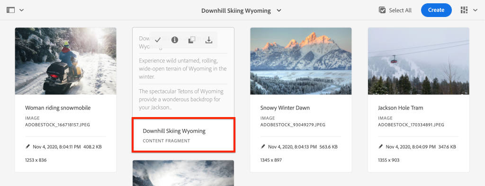

# Configuración rápida {#setup}

Este capítulo ofrece una configuración rápida de un entorno local para ver que una aplicación externa consume contenido de AEM mediante las API de GraphQL de AEM. Los capítulos posteriores del tutorial se basarán en esta configuración.

## Requisitos previos {#prerequisites}

Las siguientes herramientas deben instalarse localmente:

* [JDK 11](https://experience.adobe.com/#/downloads/content/software-distribution/en/general.html?1_group.propertyvalues.property=.%2Fjcr%3Acontent%2Fmetadata%2Fdc%3AsoftwareType&amp;1_group.propertyvalues.operation=equals&amp;1_group.propertyvalues.0_values=software-type%3Atooling&amp;fulltext=Oracle%7E+JDK%7E+11%7E&amp;orderby=%40jcr%3Acontent%2Fjcr%3AlastModified&amp;orderby.sort=desc&amp;layout=list&amp;p.offset=0&amp;p.limit=14)
* [Node.js v10+](https://nodejs.org/en/)
* [npm 6+](https://www.npmjs.com/)
* [Git](https://git-scm.com/)

## Objetivos {#objectives}

1. Descargue e instale el SDK de AEM.
1. Descargue e instale contenido de ejemplo del sitio de referencia de WKND.
1. Descargue e instale una aplicación de ejemplo para consumir contenido mediante las API de GraphQL.

## Instalación del SDK de AEM {#aem-sdk}

Este tutorial utiliza el [AEM como Cloud Service SDK](https://experienceleague.adobe.com/docs/experience-manager-cloud-service/implementing/developing/aem-as-a-cloud-service-sdk.html?lang=en#aem-as-a-cloud-service-sdk) para explorar AEM API de GraphQL. Esta sección proporciona una guía rápida para instalar el SDK de AEM y ejecutarlo en modo Autor. Aquí](https://experienceleague.adobe.com/docs/experience-manager-learn/cloud-service/local-development-environment-set-up/overview.html?lang=en#local-development-environment-set-up) puede encontrar una guía más detallada para configurar un entorno de desarrollo local [.

>[!NOTE]
>
> También es posible seguir el tutorial con un AEM como entorno de Cloud Service. Se incluyen notas adicionales sobre el uso de un entorno de Cloud en todo el tutorial.

1. Vaya al **[Software Distribution Portal](https://experience.adobe.com/#/downloads/content/software-distribution/es-ES/aemcloud.html)** > **AEM as a Cloud Service** y descargue la última versión del **AEM SDK**.

   

   >[!CAUTION]
   >
   > La función GraphQL solo está habilitada de forma predeterminada en el SDK de AEM de 2021-02-04 o posterior.

1. Descomprima la descarga y copie el jar de inicio rápido (`aem-sdk-quickstart-XXX.jar`) en una carpeta dedicada, por ejemplo `~/aem-sdk/author`.
1. Cambie el nombre del archivo jar a `aem-author-p4502.jar`.

   El nombre `author` especifica que el jar de inicio rápido se iniciará en modo Autor. El `p4502` especifica que el servidor de inicio rápido se ejecutará en el puerto 4502.

1. Abra una nueva ventana de terminal y vaya a la carpeta que contiene el archivo jar. Ejecute el siguiente comando para instalar e iniciar la instancia de AEM:

   ```shell
   $ cd ~/aem-sdk/author
   $ java -jar aem-author-p4502.jar
   ```

1. Proporcione una contraseña de administrador como `admin`. Cualquier contraseña de administrador es aceptable, pero se recomienda utilizar el valor predeterminado para el desarrollo local para reducir la necesidad de volver a configurarla.
1. Después de unos minutos, la instancia de AEM terminará de instalarse y se abrirá una nueva ventana del explorador en [http://localhost:4502](http://localhost:4502).
1. Inicie sesión con el nombre de usuario `admin` y la contraseña `admin`.

## Instalación del contenido de ejemplo y los extremos de GraphQL {#wknd-site-content-endpoints}

Se instalará contenido de muestra del **sitio de referencia de WKND** para acelerar el tutorial. El WKND es una marca ficticia de estilo de vida, que a menudo se utiliza junto con AEM formación.

El sitio de referencia de WKND incluye configuraciones necesarias para exponer un [extremo de GraphQL](https://experienceleague.adobe.com/docs/experience-manager-cloud-service/assets/admin/graphql-api-content-fragments.html?lang=en#graphql-aem-endpoint). En una implementación real, siga los pasos documentados para [incluir los extremos de GraphQL](https://experienceleague.adobe.com/docs/experience-manager-cloud-service/assets/admin/graphql-api-content-fragments.html?lang=en#graphql-aem-endpoint) en su proyecto de cliente. También se ha empaquetado un [CORS](#cors-config) como parte del sitio WKND. Se necesita una configuración CORS para conceder acceso a una aplicación externa. A continuación se puede encontrar más información sobre [CORS](#cors-config).

1. Descargue el paquete de AEM más reciente compilado para WKND Site: [aem-guides-wknd.all-x.x.x.zip](https://github.com/adobe/aem-guides-wknd/releases/latest).

   >[!NOTE]
   >
   > Asegúrese de descargar la versión estándar compatible con AEM como Cloud Service y **no** la versión `classic`.

1. En el menú **Inicio de AEM** vaya a **Herramientas** > **Implementación** > **Paquetes**.

   

1. Haga clic en **Upload Package** y seleccione el paquete WKND descargado en el paso anterior. Haga clic en **Install** para instalar el paquete.

1. En el menú **Inicio de AEM** vaya a **Assets** > **Archivos**.
1. Haga clic en las carpetas para navegar a **Sitio WKND** > **Inglés** > **Aventuras**.

   

   Esta es una carpeta de todos los recursos que comprenden las distintas aventuras promovidas por la marca WKND. Esto incluye tipos de medios tradicionales, como imágenes y vídeos, así como medios específicos de AEM como **Fragmentos de contenido**.

1. Haga clic en la carpeta **Downhill Skiing Wyoming** y haga clic en la tarjeta **Downhill Skiing Wyoming Content Fragment**:

   

1. La interfaz de usuario del editor de fragmentos de contenido se abrirá para la aventura de descenso en esquiar.

   

   Observe que varios campos como **Title**, **Description** y **Activity** definen el fragmento.

   **Los** fragmentos de contenido son una de las formas en que el contenido se puede administrar en AEM. Los fragmentos de contenido son contenido reutilizable, independiente de la presentación y compuesto por elementos de datos estructurados como texto, texto enriquecido, fechas o referencias a otros fragmentos de contenido. Los fragmentos de contenido se explorarán con buenos detalles más adelante en el tutorial.

1. Haga clic en **Cancelar** para cerrar el fragmento. Siéntase libre de navegar por algunas de las otras carpetas y explorar el otro contenido de Aventura.

>[!NOTE]
>
> Si utiliza un entorno de Cloud Service, consulte la documentación para saber cómo [implementar una base de código como el sitio de referencia WKND en un entorno de Cloud Service](https://experienceleague.adobe.com/docs/experience-manager-cloud-service/implementing/deploying/overview.html?lang=es).

## Instalación de la aplicación de ejemplo{#sample-app}

Uno de los objetivos de este tutorial es mostrar cómo utilizar AEM contenido de una aplicación externa mediante las API de GraphQL. Este tutorial utiliza un ejemplo de aplicación React que se ha completado parcialmente para acelerar el tutorial. Las mismas lecciones y conceptos se aplican a las aplicaciones creadas con iOS, Android o cualquier otra plataforma. La aplicación React es intencionalmente sencilla, para evitar complejidad innecesaria; no pretende ser una implementación de referencia.

1. Abra una nueva ventana de terminal y clone la rama de inicio del tutorial utilizando Git:

   ```shell
   $ git clone --branch tutorial/react git@github.com:adobe/aem-guides-wknd-graphql.git
   ```

1. En el IDE de su elección, abra el archivo `.env.development` en `aem-guides-wknd-graphql/react-app/.env.development`. Compruebe que la línea `REACT_APP_AUTHORIZATION` no contiene comentarios y que el archivo tiene el siguiente aspecto:

   ```plain
   REACT_APP_HOST_URI=http://localhost:4502
   REACT_APP_GRAPHQL_ENDPOINT=/content/graphql/global/endpoint.json
   # Use Authorization when connecting to an AEM Author environment
   REACT_APP_AUTHORIZATION=admin:admin
   ```

   Asegúrese de que `React_APP_HOST_URI` coincida con la instancia de AEM local. En este capítulo conectaremos la aplicación React directamente al entorno **Author** de AEM. **** De forma predeterminada, los entornos de autorización requieren autenticación, por lo que la aplicación se conectará como  `admin` usuario. Esta es una práctica habitual durante el desarrollo, ya que nos permite realizar cambios rápidamente en el entorno de AEM y verlos reflejados inmediatamente en la aplicación.

   >[!NOTE]
   >
   > En un escenario de producción, la aplicación se conectará a un entorno **Publish** AEM. Esto se explica con más detalle en el capítulo [Implementación de producción](production-deployment.md).

1. Vaya a la carpeta `aem-guides-wknd-graphql/react-app` . Instale e inicie la aplicación:

   ```shell
   $ cd aem-guides-wknd-graphql/react-app
   $ npm install
   $ npm start
   ```

1. Una nueva ventana del explorador debe iniciar automáticamente la aplicación en [http://localhost:3000](http://localhost:3000).

   

   Se debe mostrar una lista del contenido de Aventura actual de AEM.

1. Haga clic en una de las imágenes de aventura para ver los detalles de la aventura. Se solicita a AEM que devuelva los detalles de una aventura.

   

1. Utilice las herramientas para desarrolladores del navegador para inspeccionar las solicitudes **Network**. Vea las solicitudes **XHR** y observe varias solicitudes de POST a `/content/graphql/global/endpoint.json`, el extremo de GraphQL configurado para AEM.

   

1. También puede ver los parámetros y la respuesta JSON inspeccionando la solicitud de red. Puede resultar útil instalar una extensión del explorador como [GraphQL Network Inspector](https://chrome.google.com/webstore/detail/graphql-network-inspector/ndlbedplllcgconngcnfmkadhokfaaln) para Chrome para comprender mejor la consulta y la respuesta.

## Modificación de un fragmento de contenido

Ahora que la aplicación React se está ejecutando, actualice el contenido de AEM y vea el cambio reflejado en la aplicación.

1. Vaya a AEM [http://localhost:4502](http://localhost:4502).
1. Vaya a **Assets** > **Files** > **WKND Site** > **English** > **Adventures** > **[Bali Surf Camp](http://localhost:4502/assets.html/content/dam/wknd/en/adventures/bali-surf-camp)**.

   

1. Haga clic en el fragmento de contenido **Bali Surf Camp** para abrir el Editor de fragmentos de contenido.
1. Modifique el **Title** y la **Description** de la aventura

   

1. Haga clic en **Guardar** para guardar los cambios.
1. Vuelva a la aplicación React en [http://localhost:3000](http://localhost:3000) y actualice para ver los cambios:

   

## Instalación de la herramienta GraphiQL {#install-graphiql}

[](https://github.com/graphql/graphiql) GraphiQL es una herramienta de desarrollo que solo se necesita en entornos de nivel inferior como una instancia local o de desarrollo. El IDE de GraphiQL le permite probar y refinar rápidamente las consultas y los datos devueltos. GraphiQL también proporciona fácil acceso a la documentación, lo que facilita la comprensión de los métodos disponibles.

1. Vaya al **[Software Distribution Portal](https://experience.adobe.com/#/downloads/content/software-distribution/en/aemcloud.html)** > **AEM como Cloud Service**.
1. Busque &quot;GraphiQL&quot; (asegúrese de incluir el **i** en **GraphiQL**.
1. Descargue el paquete de contenido más reciente de **GraphiQL v.x.x.x**

   

   El archivo zip es un paquete AEM que se puede instalar directamente.

1. En el menú **Inicio de AEM** vaya a **Herramientas** > **Implementación** > **Paquetes**.
1. Haga clic en **Cargar paquete** y elija el paquete descargado en el paso anterior. Haga clic en **Install** para instalar el paquete.

   
1. Vaya al IDE de GraphiQL en [http://localhost:4502/content/graphiql.html](http://localhost:4502/content/graphiql.html) y comience a explorar las API de GraphQL.

   >[!NOTE]
   >
   > La herramienta GraphiQL y la API de GraphQL se exploran [con más detalle más adelante en el tutorial](./explore-graphql-api.md).

## Felicitaciones! {#congratulations}

Felicidades, ahora tiene una aplicación externa que consume AEM contenido con GraphQL. No dude en inspeccionar el código en la aplicación React y seguir experimentando con la modificación de los fragmentos de contenido existentes.

## Siguientes pasos {#next-steps}

En el capítulo siguiente, [Definición de modelos de fragmento de contenido](content-fragment-models.md), aprenda a modelar contenido y a crear un esquema con **Modelos de fragmento de contenido**. Revisará los modelos existentes y creará un nuevo modelo. También aprenderá los diferentes tipos de datos que se pueden utilizar para definir un esquema como parte del modelo.

## Configuración CORS (bono) {#cors-config}

AEM, al ser seguro de forma predeterminada, bloquea las solicitudes de origen cruzado, lo que impide que las aplicaciones no autorizadas se conecten a su contenido y lo muestren.

Para permitir que la aplicación React de este tutorial interactúe con AEM extremos de la API de GraphQL, se ha definido una configuración de uso compartido de recursos de origen diverso en el proyecto de referencia del sitio WKND.


Para ver la configuración implementada:

1. Vaya a AEM consola web del SDK en [http://localhost:4502/system/console](http://localhost:4502/system/console).

   >[!NOTE]
   >
   > La consola web solo está disponible en el SDK. En un entorno AEM como Cloud Service, esta información se puede ver a través de [Developer Console](https://experienceleague.adobe.com/docs/experience-manager-learn/cloud-service/debugging/debugging-aem-as-a-cloud-service/developer-console.html).

1. En el menú superior, haga clic en **OSGI** > **Configuración** para que aparezcan todas las configuraciones [OSGi](http://localhost:4502/system/console/configMgr).
1. Desplácese hacia abajo por la página **Adobe Granite Cross-Origin Resource Sharing**.
1. Haga clic en la configuración para `com.adobe.granite.cors.impl.CORSPolicyImpl~wknd-graphql`.
1. Se han actualizado los campos siguientes:
   * Orígenes permitidos (Regex): `http://localhost:.*`
      * Permite todas las conexiones de host locales.
   * Rutas permitidas: `/content/graphql/global/endpoint.json`
      * Este es el único extremo de GraphQL configurado actualmente. Como práctica recomendada, las configuraciones de los informes de calidad deben ser lo más restrictivas posible.
   * Métodos permitidos: `GET`, `HEAD`, `POST`
      * Solo se requiere `POST` para GraphQL; sin embargo, los demás métodos pueden ser útiles para interactuar con AEM de forma directa.
   * Encabezados admitidos: Se ha agregado **autorización** para pasar la autenticación básica en el entorno de creación.
   * Admite Credenciales: `Yes`
      * Esto es necesario, ya que nuestra aplicación React se comunicará con los puntos finales de GraphQL protegidos del servicio AEM Author.

Esta configuración y los extremos de GraphQL forman parte del proyecto AEM WKND. Puede ver todas las configuraciones de [OSGi aquí](https://github.com/adobe/aem-guides-wknd/tree/master/ui.config/src/main/content/jcr_root/apps/wknd/osgiconfig).
