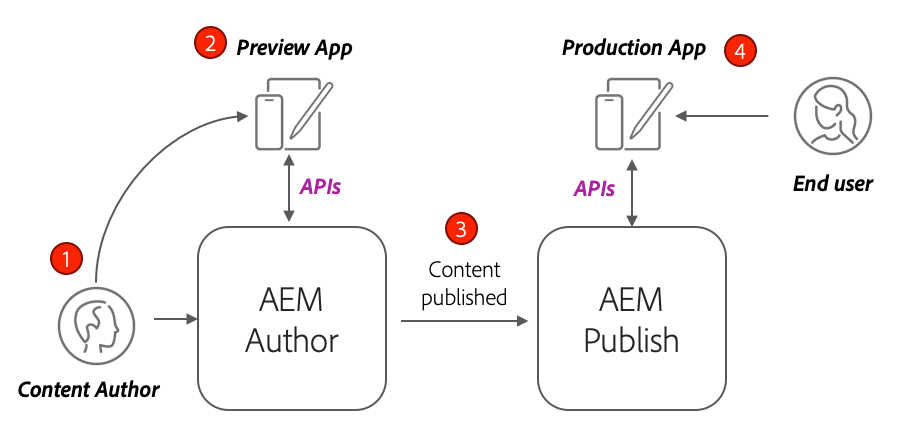
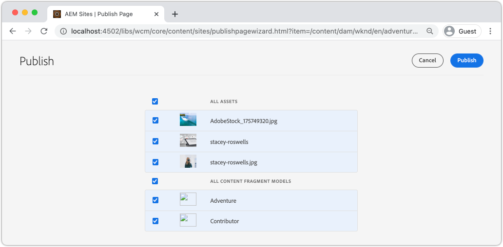
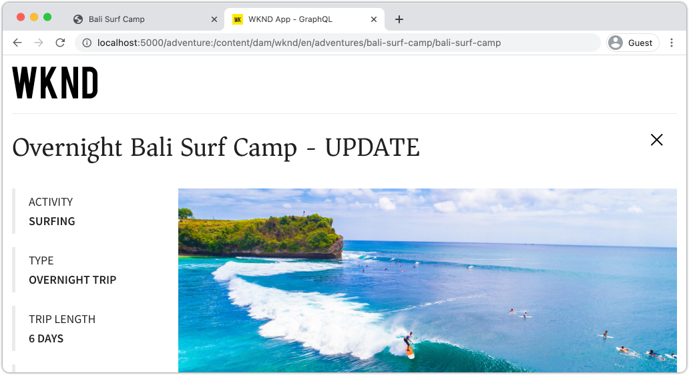

# Implementación de producción con un servicio de AEM Publish

En este tutorial, configurará un entorno local para simular el contenido que se distribuye desde una instancia de Autor a una instancia de Publish. También generará la generación de producción de una aplicación React configurada para consumir contenido del entorno de AEM Publish mediante las API de GraphQL. A lo largo del camino, aprenderá a utilizar de manera eficaz las variables de entorno y a actualizar las configuraciones de CORS de AEM.

## Requisitos previos

Este tutorial forma parte de un tutorial de varias partes. Se da por hecho que se han completado los pasos descritos en las partes anteriores.

## Objetivos

Aprenda a:

* Conozca la arquitectura de AEM Author y Publish.
* Conozca las prácticas recomendadas para administrar variables de entorno.
* Obtenga información sobre cómo configurar correctamente AEM para el uso compartido de recursos entre Orígenes (CORS).

## Patrón de implementación de publicación de creación {#deployment-pattern}

Un entorno de AEM completo está formado por un Autor, Publicación y Dispatcher. El servicio Autor es donde los usuarios internos crean, administran y previsualización de contenido. El servicio Publicar se considera el entorno &quot;Activo&quot; y es normalmente lo que interactúan con los usuarios finales. El contenido, después de editarlo y aprobarlo en el servicio Autor, se distribuye al servicio de publicación.

El patrón de implementación más común con AEM aplicaciones sin cabezal es tener la versión de producción de la aplicación conectada a un servicio de AEM Publish.



El diagrama anterior muestra este patrón de implementación común.

1. Un **autor de contenido** utiliza el servicio de creación de AEM para crear, editar y administrar contenido.
2. El **autor del contenido** y otros usuarios internos pueden previsualización del contenido directamente en el servicio Autor. Se puede configurar una versión de Previsualización de la aplicación que se conecte al servicio Autor.
3. Una vez aprobado el contenido, puede **publicarse** en el servicio AEM Publish.
4. **Los** usuarios finales interactúan con la versión de producción de la aplicación. La aplicación Producción se conecta al servicio Publicar y utiliza las API de GraphQL para solicitar y consumir contenido.

El tutorial simula la implementación anterior agregando una instancia de AEM Publish a la configuración actual. En capítulos anteriores, la aplicación React actuaba como una previsualización al conectarse directamente a la instancia Autor. Se implementará una compilación de producción de la aplicación React en un servidor Node.js estático que se conecte a la nueva instancia de Publish.

Al final, se ejecutarán tres servidores locales:

* http://localhost:4502 - Instancia de creación
* http://localhost:4503 - Publicar instancia
* http://localhost:5000 - Reaccione la aplicación en modo de producción, conectándose a la instancia de Publish.

## Instalación AEM SDK - modo de publicación {#aem-sdk-publish}

Actualmente tenemos una instancia en ejecución del SDK en el modo **Autor**. El SDK también se puede iniciar en el modo **Publicar** para simular un entorno de AEM Publish.

Puede encontrar una guía más detallada para configurar un entorno de desarrollo local [aquí](https://experienceleague.adobe.com/docs/experience-manager-learn/cloud-service/local-development-environment-set-up/overview.html?lang=en#local-development-environment-set-up).

1. En el sistema de archivos local, cree una carpeta dedicada para instalar la instancia de Publish, denominada `~/aem-sdk/publish`.
1. Copie el archivo jar de inicio rápido utilizado para la instancia de Autor en capítulos anteriores y péguelo en el directorio `publish`. Alternativamente, navegue hasta [Software Distribution Portal](https://experience.adobe.com/#/downloads/content/software-distribution/es-ES/aemcloud.html) y descargue el SDK más reciente y extraiga el archivo jar de QuickStart.
1. Cambie el nombre del archivo jar a `aem-publish-p4503.jar`.

   La cadena `publish` especifica que la jar de inicio rápido inicio en modo de publicación. El `p4503` especifica que el servidor Quickstart se ejecuta en el puerto 4503.

1. Abra una nueva ventana de terminal y vaya a la carpeta que contiene el archivo jar. Instale y inicio la instancia de AEM:

   ```shell
   $ cd ~/aem-sdk/publish
   $ java -jar aem-publish-p4503.jar
   ```

1. Proporcione una contraseña de administrador como `admin`. Se acepta cualquier contraseña de administrador, pero se recomienda usar la predeterminada para el desarrollo local para evitar configuraciones adicionales.
1. Cuando la instancia de AEM haya terminado de instalarse, se abrirá una nueva ventana del explorador en [http://localhost:4503/content.html](http://localhost:4503/content.html)

   Se espera que devuelva una página 404 no encontrada. Se trata de una instancia de AEM completamente nueva y no se ha instalado contenido.

## Instalar contenido de muestra y puntos finales de GraphQL {#wknd-site-content-endpoints}

Al igual que en la instancia de autor, la instancia de publicación debe tener habilitados los extremos de GraphQL y necesita contenido de muestra. A continuación, instale el sitio de referencia de WKND en la instancia de Publish.

1. Descargue el paquete de AEM más reciente compilado para el sitio WKND: [aem-guide-wknd.all-x.x.x.zip](https://github.com/adobe/aem-guides-wknd/releases/latest).

   >[!NOTE]
   >
   > Asegúrese de descargar la versión estándar compatible con AEM como Cloud Service y **no** la versión `classic`.

1. Inicie sesión en la instancia de Publish navegando directamente a: [http://localhost:4503/libs/granite/core/content/login.html](http://localhost:4503/libs/granite/core/content/login.html) con el nombre de usuario `admin` y la contraseña `admin`.
1. A continuación, vaya al Administrador de paquetes en [http://localhost:4503/crx/packmgr/index.jsp](http://localhost:4503/crx/packmgr/index.jsp).
1. Haga clic en **Cargar paquete** y elija el paquete WKND descargado en el paso anterior. Haga clic en **Instalar** para instalar el paquete.
1. Después de instalar el paquete, el sitio de referencia de WKND ya está disponible en [http://localhost:4503/content/wknd/us/en.html](http://localhost:4503/content/wknd/us/en.html).
1. Para cerrar sesión como usuario `admin`, haga clic en el botón &quot;Cerrar sesión&quot; en la barra de menús.

   

   A diferencia de la instancia de AEM Author, las instancias de AEM Publish tienen acceso de solo lectura de forma predeterminada. Queremos simular la experiencia de un usuario anónimo al ejecutar la aplicación React.

## Actualice las variables de Entorno para que señalen la instancia de Publish {#react-app-publish}

A continuación, actualice las variables de entorno utilizadas por la aplicación React para que señalen a la instancia de Publish. La aplicación React debe **solo** conectarse a la instancia de Publish en modo de producción.

A continuación, agregue un nuevo archivo `.env.production.local` para simular la experiencia de producción.

1. Abra la aplicación WKND GraphQL React en su IDE.

1. Debajo de `aem-guides-wknd-graphql/react-app`, agregue un archivo llamado `.env.production.local`.
1. Rellene `.env.production.local` con lo siguiente:

   ```plain
   REACT_APP_HOST_URI=http://localhost:4503
   REACT_APP_GRAPHQL_ENDPOINT=/content/graphql/global/endpoint.json
   ```

   

   El uso de variables de entorno facilita el cambio del punto final de GraphQL entre un entorno de creación o publicación sin agregar lógica adicional dentro del código de la aplicación. Puede encontrar más información sobre [variables de entorno personalizadas para React aquí](https://create-react-app.dev/docs/adding-custom-environment-variables).

   >[!NOTE]
   >
   > Tenga en cuenta que no se incluye información de autenticación, ya que los entornos de publicación proporcionan acceso anónimo al contenido de forma predeterminada.

## Implementar un servidor de nodos estático {#static-server}

La aplicación React se puede iniciar con el servidor de webpack, pero solo para desarrollo. A continuación, simule una implementación de producción utilizando [serve](https://github.com/vercel/serve) para alojar una compilación de producción de la aplicación React mediante Node.js.

1. Abra una nueva ventana de terminal y vaya al directorio `aem-guides-wknd-graphql/react-app`

   ```shell
   $ cd aem-guides-wknd-graphql/react-app
   ```

1. Instale [serve](https://github.com/vercel/serve) con el siguiente comando:

   ```shell
   $ npm install serve --save-dev
   ```

1. Abra el archivo `package.json` en `react-app/package.json`. Añada una secuencia de comandos con el nombre `serve`:

   ```diff
    "scripts": {
       "start": "react-scripts start",
       "build": "react-scripts build",
       "test": "react-scripts test",
       "eject": "react-scripts eject",
   +   "serve": "npm run build && serve -s build"
   },
   ```

   La secuencia de comandos `serve` realiza dos acciones. En primer lugar, se genera una compilación de producción de la aplicación React. En segundo lugar, el servidor Node.js inicio y utiliza la generación de producción.

1. Vuelva al terminal e introduzca el comando para inicio del servidor estático:

   ```shell
   $ npm run serve
   
   ┌────────────────────────────────────────────────────┐
   │                                                    │
   │   Serving!                                         │
   │                                                    │
   │   - Local:            http://localhost:5000        │
   │   - On Your Network:  http://192.168.86.111:5000   │
   │                                                    │
   │   Copied local address to clipboard!               │
   │                                                    │
   └────────────────────────────────────────────────────┘
   ```

1. Abra un navegador nuevo y vaya a [http://localhost:5000/](http://localhost:5000/). Debería ver la aplicación React que se está ofreciendo.

   

   Observe que la consulta GraphQL está funcionando en la página de inicio. Inspect la solicitud **XHR** mediante las herramientas de desarrollador. Observe que el POST de GraphQL se encuentra en la instancia de Publish en `http://localhost:4503/content/graphql/global/endpoint.json`.

   Sin embargo, ¡todas las imágenes están rotas en la página de inicio!

1. Haga clic en una de las páginas Detalles de aventura.

   

   Observe que se produce un error de GraphQL para `adventureContributor`. En los siguientes ejercicios, se corrigen las imágenes rotas y los problemas `adventureContributor`.

## Referencias absolutas de imagen {#absolute-image-references}

Las imágenes aparecen rotas porque el atributo ``:

   ```diff
   - 
   + 
   ```

1. Abra el archivo `AdventureDetail.js` en `react-app/src/components/AdventureDetail.js`.
1. Repita los mismos pasos para modificar la consulta de GraphQL y agregar la propiedad `_publishUrl` para la aventura

   ```diff
    adventureByPath (_path: "${_path}") {
       item {
           _path
           adventureTitle
           adventureActivity
           adventureType
           adventurePrice
           adventureTripLength
           adventureGroupSize
           adventureDifficulty
           adventurePrice
           adventurePrimaryImage {
               ... on ImageRef {
               _path
   +           _publishUrl
               mimeType
               width
               height
               }
           }
           adventureDescription {
               html
           }
           adventureItinerary {
               html
           }
           adventureContributor {
               fullName
               occupation
               pictureReference {
                   ...on ImageRef {
                       _path
   +                   _publishUrl
                   }
               }
           }
       }
       }
   } 
   ```

1. Modifique las dos etiquetas `` para la imagen principal de la aventura y la referencia de imagen del colaborador en `AdventureDetail.js`:

   ```diff
   /* AdventureDetail.js */
   ...
   
   ...
   pictureReference =  
   ```

1. Vuelva al terminal y inicio del servidor estático:

   ```shell
   $ npm run serve
   ```

1. Vaya a [http://localhost:5000/](http://localhost:5000/) y observe que las imágenes aparecen y que el atributo `` apunta a `http://localhost:4503`.

   

## Simular la publicación de contenido {#content-publish}

Recuerde que se genera un error de GraphQL para `adventureContributor` cuando se solicita una página Detalles de aventura. El modelo de fragmento de contenido **Colaborador** aún no existe en la instancia de publicación. Las actualizaciones realizadas en el modelo de fragmento de contenido **Aventura** tampoco están disponibles en la instancia de publicación. Estos cambios se realizaron directamente en la instancia de Autor y deben distribuirse en la instancia de Publicar.

Esto es algo que hay que tener en cuenta al implementar nuevas actualizaciones en una aplicación que se base en actualizaciones de un fragmento de contenido o un modelo de fragmento de contenido.

A continuación, permite simular la publicación de contenido entre las instancias locales de Autor y Publicación.

1. Inicio de la instancia de creación (si no se ha iniciado ya) y vaya al Administrador de paquetes en [http://localhost:4502/crx/packmgr/index.jsp](http://localhost:4502/crx/packmgr/index.jsp)
1. Descargue el paquete [EnableReplicationAgent.zip](./assets/publish-deployment/EnableReplicationAgent.zip) e instálelo mediante Package Manager.

   Este paquete instala una configuración que permite a la instancia de autor publicar contenido en la instancia de Publish. Los pasos manuales para [esta configuración se encuentran aquí](https://experienceleague.adobe.com/docs/experience-manager-learn/cloud-service/local-development-environment-set-up/aem-runtime.html?lang=en#content-distribution).

   >[!NOTE]
   >
   > En un AEM como entorno de Cloud Service, el nivel Autor se configura automáticamente para distribuir contenido en el nivel Publicar.

1. En el menú **AEM Inicio**, vaya a **Herramientas** > **Recursos** > **Modelos de fragmento de contenido**.

1. Haga clic en la carpeta **WKND Site**.

1. Seleccione los tres modelos y haga clic en **Publicar**:

   

   Aparece un cuadro de diálogo de confirmación, haga clic en **Publicar**.

1. Vaya al fragmento de contenido del campamento de surf de Bali en [http://localhost:4502/editor.html/content/dam/wknd/en/adventures/bali-surf-camp/bali-surf-camp](http://localhost:4502/editor.html/content/dam/wknd/en/adventures/bali-surf-camp/bali-surf-camp).

1. Haga clic en el botón **Publicar** en la barra de menús superior.

   

1. El asistente de publicación muestra los recursos dependientes que se deben publicar. En este caso, se muestra el fragmento al que se hace referencia **stacey-roswells** y también se hace referencia a varias imágenes. Los recursos a los que se hace referencia se publican junto con el fragmento.

   

   Vuelva a hacer clic en el botón **Publicar** para publicar el fragmento de contenido y los recursos dependientes.

1. Vuelva a la aplicación React que se ejecuta en [http://localhost:5000/](http://localhost:5000/). Ahora puedes hacer click en el Campo de Surf de Bali para ver los detalles de la aventura.

1. Vuelva a la instancia de AEM Author en [http://localhost:4502/editor.html/content/dam/wknd/en/adventures/bali-surf-camp/bali-surf-camp](http://localhost:4502/editor.html/content/dam/wknd/en/adventures/bali-surf-camp/bali-surf-camp) y actualice el **Título** del fragmento. **Guarde y** cierre el fragmento. A continuación **publique** el fragmento.
1. Vuelva a [http://localhost:5000/adventure:/content/dam/wknd/en/adventures/bali-surf-camp/bali-surf-camp](http://localhost:5000/adventure:/content/dam/wknd/en/adventures/bali-surf-camp/bali-surf-camp) y observe los cambios publicados.

   

## Actualizar la configuración de COR

AEM es seguro de forma predeterminada y no permite que las propiedades web que no sean AEM realicen llamadas del cliente. AEM configuración de uso compartido de recursos entre Orígenes (CORS) puede permitir que dominios específicos realicen llamadas a AEM.

A continuación, experimente con la configuración CORS de la instancia de AEM Publish.

1. Vuelva a la ventana de terminal donde React App se está ejecutando con el comando `npm run serve`:

   ```shell
   ┌────────────────────────────────────────────────────┐
   │                                                    │
   │   Serving!                                         │
   │                                                    │
   │   - Local:            http://localhost:5000        │
   │   - On Your Network:  http://192.168.86.205:5000   │
   │                                                    │
   │   Copied local address to clipboard!               │
   │                                                    │
   └────────────────────────────────────────────────────┘
   ```

   Observe que se proporcionan dos direcciones URL. Uno que utiliza `localhost` y otro que utiliza la dirección IP de red local.

1. Navegue a la dirección comenzando por [http://192.168.86.XXX:5000](http://192.168.86.XXX:5000). La dirección será ligeramente diferente para cada equipo local. Observe que hay un error CORS al recuperar los datos. Esto se debe a que la configuración actual de CORS sólo permite solicitudes de `localhost`.

   

   A continuación, actualice la configuración de AEM Publish CORS para permitir solicitudes desde la dirección IP de red.

1. Vaya a [http://localhost:4503/content/wknd/us/en/errors/sign-in.html](http://localhost:4503/content/wknd/us/en/errors/sign-in.html) e inicie sesión con el nombre de usuario `admin` y la contraseña `admin`.

1. Vaya a [http://localhost:4503/system/console/configMgr](http://localhost:4503/system/console/configMgr) y busque la configuración de WKND GraphQL en `com.adobe.granite.cors.impl.CORSPolicyImpl~wknd-graphql`.

1. Actualice el campo **Orígenes permitidos** para incluir la dirección IP de la red:

   

   También es posible incluir una expresión regular para permitir todas las solicitudes de un subdominio específico. Guarde los cambios.

1. Busque **Apache Sling Remitente del reenvío Filter** y revise la configuración. La configuración **Permitir vacío** también es necesaria para habilitar las solicitudes de GraphQL desde un dominio externo.

   

   Estos se han configurado como parte del sitio de referencia de WKND. Puede realizar la vista del conjunto completo de configuraciones de OSGi mediante [el repositorio de GitHub](https://github.com/adobe/aem-guides-wknd/tree/master/ui.config/src/main/content/jcr_root/apps/wknd/osgiconfig).

   >[!NOTE]
   >
   > Las configuraciones de OSGi se administran en un proyecto AEM que está comprometido con el control de código fuente. Un proyecto AEM se puede implementar en AEM como entornos de Cloud Service mediante Cloud Manager. El [AEM Arquetipo de proyecto](https://github.com/adobe/aem-project-archetype) puede ayudar a generar un proyecto para una implementación específica.

1. Vuelva a la aplicación de React desde [http://192.168.86.XXX:5000](http://192.168.86.XXX:5000) y observe que la aplicación ya no genera un error de CORS.

   

## Felicitaciones! {#congratulations}

Felicitaciones! Ahora ha simulado una implementación de producción completa con un entorno de AEM Publish. También ha aprendido a utilizar la configuración CORS en AEM.

## Otros recursos

Para obtener más información sobre los fragmentos de contenido y GraphQL, consulte los siguientes recursos:

* [Envío de contenido sin cabeza mediante fragmentos de contenido con GraphQL](https://experienceleague.adobe.com/docs/experience-manager-cloud-service/assets/content-fragments/content-fragments-graphql.html)
* [API de AEM GraphQL para usar con fragmentos de contenido](https://experienceleague.adobe.com/docs/experience-manager-cloud-service/assets/admin/graphql-api-content-fragments.html)
* [Autenticación basada en token](https://experienceleague.adobe.com/docs/experience-manager-learn/getting-started-with-aem-headless/authentication/overview.html?lang=en#authentication)
* [Implementación de código para AEM como Cloud Service](https://experienceleague.adobe.com/docs/experience-manager-learn/cloud-service/cloud-manager/devops/deploy-code.html?lang=en#cloud-manager)
