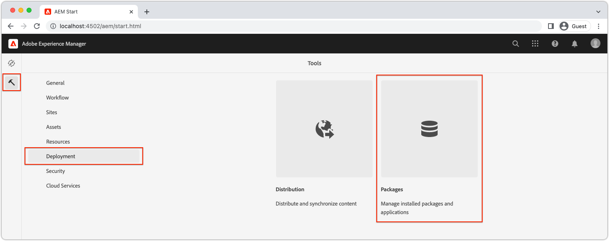
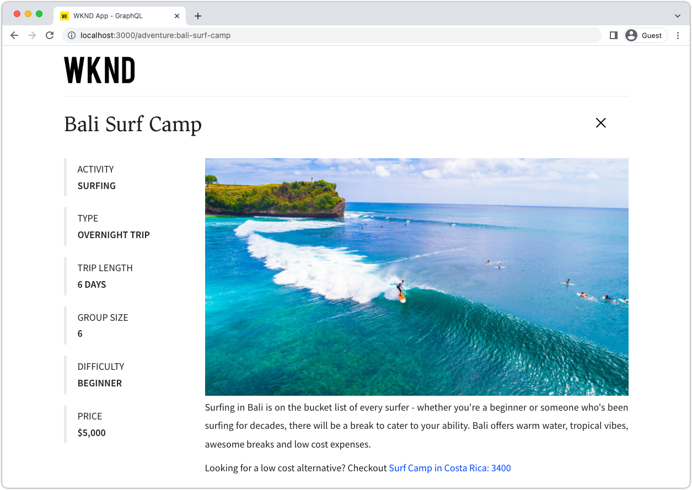

# Configuración rápida AEM sin encabezado mediante el SDK local {#setup}

La configuración rápida AEM sin encabezado le permite trabajar con AEM sin encabezado mediante el contenido del proyecto de muestra del sitio WKND y una aplicación React (a SPA) de muestra que consume el contenido a través de AEM API de GraphQL sin encabezado. Esta guía utiliza la variable [SDK as a Cloud Service AEM](https://experienceleague.adobe.com/docs/experience-manager-cloud-service/content/implementing/developing/aem-as-a-cloud-service-sdk.html).

## Requisitos previos {#prerequisites}

Las siguientes herramientas deben instalarse localmente:

* [JDK 11](https://experience.adobe.com/#/downloads/content/software-distribution/en/general.html?1_group.propertyvalues.property=.%2Fjcr%3Acontent%2Fmetadata%2Fdc%3AsoftwareType&amp;1_group.propertyvalues.operation=equals&amp;1_group.propertyvalues.0_values=software-type%3Atooling&amp;fulltext=Oracle%7E+JDK%7E+11%7E&amp;orderby=%40jcr%3Acontent%2Fjcr%3AlastModified&amp;orderby.sort=desc&amp;layout=list&amp;p.offset=0&amp;p.limit=14)
* [Node.js v10+](https://nodejs.org/en/)
* [npm 6+](https://www.npmjs.com/)
* [Git](https://git-scm.com/)

## 1. Instalación del SDK de AEM {#aem-sdk}

Esta configuración utiliza la variable [SDK as a Cloud Service AEM](https://experienceleague.adobe.com/docs/experience-manager-cloud-service/implementing/developing/aem-as-a-cloud-service-sdk.html?#aem-as-a-cloud-service-sdk) para explorar AEM API de GraphQL. Esta sección proporciona una guía rápida para instalar el SDK de AEM y ejecutarlo en modo Autor. Una guía más detallada para configurar un entorno de desarrollo local [se puede encontrar aquí](https://experienceleague.adobe.com/docs/experience-manager-learn/cloud-service/local-development-environment-set-up/overview.html#local-development-environment-set-up).

>[!NOTE]
>
> También es posible seguir el tutorial con un [AEM entorno as a Cloud Service](./cloud-service.md). Se incluyen notas adicionales sobre el uso de un entorno de Cloud en todo el tutorial.

1. Vaya a la **[Portal de distribución de software](https://experience.adobe.com/#/downloads/content/software-distribution/en/aemcloud.html?fulltext=AEM*+SDK*&amp;orderby=%40jcr%3Acontent%2Fjcr%3AlastModified&amp;orderby.sort=desc&amp;layout=list&amp;p.offset=0&amp;p.limit=1)** > **AEM as a Cloud Service** y descargue la última versión de **SDK AEM**.

   

1. Descomprima la descarga y copie el jar de inicio rápido (`aem-sdk-quickstart-XXX.jar`) a una carpeta dedicada, es decir, `~/aem-sdk/author`.
1. Cambie el nombre del archivo jar a `aem-author-p4502.jar`.

   La variable `author` name especifica que el jar de inicio rápido se inicia en modo Autor. La variable `p4502` especifica que Quickstart se ejecuta en el puerto 4502.

1. Para instalar e iniciar la instancia de AEM, abra un símbolo del sistema en la carpeta que contiene el archivo jar y ejecute el siguiente comando:

   ```shell
   $ cd ~/aem-sdk/author
   $ java -jar aem-author-p4502.jar
   ```

1. Proporcione una contraseña de administrador como `admin`. Cualquier contraseña de administrador es aceptable, pero se recomienda utilizar `admin` para el desarrollo local a fin de reducir la necesidad de reconfigurar.
1. Cuando el servicio de AEM termine de instalarse, se abrirá una nueva ventana del explorador en [http://localhost:4502](http://localhost:4502).
1. Inicie sesión con el nombre de usuario `admin` y la contraseña seleccionada durante AEM inicio inicial (normalmente `admin`).

## 2. Instalar contenido de muestra {#install-sample-content}

Contenido de muestra de **Sitio de referencia WKND** se utiliza para acelerar el tutorial. El WKND es una marca ficticia de estilo de vida, a menudo usada con AEM entrenamiento.

El sitio WKND incluye configuraciones necesarias para exponer un [Extremo de GraphQL](https://experienceleague.adobe.com/docs/experience-manager-cloud-service/content/headless/graphql-api/content-fragments.html). En una implementación del mundo real, siga los pasos documentados para [incluir los extremos de GraphQL](https://experienceleague.adobe.com/docs/experience-manager-cloud-service/content/headless/graphql-api/content-fragments.html) en su proyecto de cliente. A [CORS](#cors-config) también ha sido empaquetado como parte del sitio WKND. Se requiere una configuración CORS para conceder acceso a una aplicación externa, más información sobre [CORS](#cors-config) puede encontrarse más abajo.

1. Descargue el paquete de AEM más reciente compilado para WKND Site: [aem-guides-wknd.all-x.x.x.zip](https://github.com/adobe/aem-guides-wknd/releases/latest).

   >[!NOTE]
   >
   > Asegúrese de descargar la versión estándar compatible con AEM as a Cloud Service y **not** el `classic` versión.

1. En el **Inicio de AEM** , vaya a **Herramientas** > **Implementación** > **Paquetes**.

   

1. Haga clic en **Cargar paquete** y elija el paquete WKND descargado en el paso anterior. Haga clic en **Instalar** para instalar el paquete.

1. En el **Inicio de AEM** , vaya a **Recursos** > **Archivos** > **WKND compartido** > **Inglés** > **Aventuras**.

   

   Esta es una carpeta de todos los recursos que comprenden las distintas aventuras promovidas por la marca WKND. Esto incluye tipos de medios tradicionales, como imágenes y vídeo, y medios específicos de AEM como **Fragmentos de contenido**.

1. Haga clic en **Wyoming en descenso** y haga clic en **Fragmento de contenido de Wyoming en descenso** tarjeta:

   

1. El editor de fragmentos de contenido se abre para la aventura de descenso en esquiar Wyoming.

   

   Observe que varios campos como **Título**, **Descripción** y **Actividad** defina el fragmento.

   **Fragmentos de contenido** son una de las formas en que el contenido se puede administrar en AEM. Los fragmentos de contenido son contenido reutilizable, independiente de la presentación y compuesto por elementos de datos estructurados como texto, texto enriquecido, fechas o referencias a otros fragmentos de contenido. Los fragmentos de contenido se exploran con buenos detalles más adelante en la configuración rápida.

1. Haga clic en **Cancelar** para cerrar el fragmento. Siéntase libre de navegar por algunas de las otras carpetas y explorar el otro contenido de Aventura.

>[!NOTE]
>
> Si utiliza un entorno de Cloud Service, consulte la documentación de cómo [implementar una base de código como el sitio de referencia WKND en un entorno de Cloud Service](https://experienceleague.adobe.com/docs/experience-manager-cloud-service/implementing/deploying/overview.html#coding-against-the-right-aem-version).

## 3. Descargue y ejecute la aplicación WKND React {#sample-app}

Uno de los objetivos de este tutorial es mostrar cómo utilizar AEM contenido de una aplicación externa mediante las API de GraphQL. Este tutorial utiliza un ejemplo de aplicación React. La aplicación React es intencionalmente sencilla, ya que se centra en la integración con las API de AEM GraphQL.

1. Abra un nuevo símbolo del sistema y clone la aplicación React de ejemplo desde GitHub:

   ```shell
   $ git clone git@github.com:adobe/aem-guides-wknd-graphql.git
   $ cd aem-guides-wknd-graphql/react-app
   ```

1. Abra la aplicación React en `aem-guides-wknd-graphql/react-app` en su IDE de elección.
1. En el IDE, abra el archivo `.env.development` at `/.env.development`. Compruebe el `REACT_APP_AUTHORIZATION` línea no se comenta y el archivo declara las siguientes variables:

   ```plain
   REACT_APP_HOST_URI=http://localhost:4502
   REACT_APP_GRAPHQL_ENDPOINT=/content/graphql/global/endpoint.json
   # Use Authorization when connecting to an AEM Author environment
   REACT_APP_AUTHORIZATION=admin:admin
   ```

   Asegúrese `REACT_APP_HOST_URI` apunta al SDK de AEM local. Para su comodidad, este inicio rápido conecta la aplicación React con  **Autor de AEM**. **Autor** Los servicios requieren autenticación, por lo que la aplicación utiliza la variable `admin` para establecer su conexión. La conexión de una aplicación a AEM Author es una práctica habitual durante el desarrollo, ya que facilita la iteración rápida en el contenido sin necesidad de publicar cambios.

   >[!NOTE]
   >
   > En un escenario de producción, la aplicación se conectará a un AEM **Publicación** entorno. Esto se explica con más detalle en la sección _Implementación de producción_ para obtener más información.


1. Instale e inicie la aplicación React:

   ```shell
   $ cd aem-guides-wknd-graphql/react-app
   $ npm install
   $ npm start
   ```

1. Una nueva ventana del explorador abre automáticamente la aplicación en [http://localhost:3000](http://localhost:3000).

   

   Se muestra una lista del contenido de aventura de AEM.

1. Haga clic en una de las imágenes de aventura para ver los detalles de la aventura. Se solicita a AEM que devuelva los detalles de una aventura.

   

1. Utilice las herramientas para desarrolladores del navegador para inspeccionar el **Red** solicitudes. Consulte la **XHR** solicitudes y observar varias solicitudes de GET a `/graphql/execute.json/...`. Este prefijo de ruta invoca AEM extremo de consulta persistente, seleccionando la consulta persistente que se ejecutará con el nombre y los parámetros codificados que siguen al prefijo .

   

## 4. Editar contenido en AEM

Con la aplicación React en ejecución, actualice el contenido de AEM y compruebe que el cambio se refleja en la aplicación.

1. Navegar a AEM [http://localhost:4502](http://localhost:4502).
1. Vaya a **Recursos** > **Archivos** > **WKND compartido** > **Inglés** > **Aventuras** > **[Campo de surf de Bali](http://localhost:4502/assets.html/content/dam/wknd-shared/en/adventures/bali-surf-camp)**.

   

1. Haga clic en **Campo de surf de Bali** fragmento de contenido para abrir el editor de fragmentos de contenido.
1. Modifique el **Título** y **Descripción** de la aventura.

   

1. Haga clic en **Guardar** para guardar los cambios.
1. Actualice la aplicación React en [http://localhost:3000](http://localhost:3000) para ver los cambios:

   

## 5. Explorar GraphiQL {#graphiql}

1. Apertura [GraphiQL](http://localhost:4502/aem/graphiql.html) navegando a **Herramientas** > **General** > **Editor de consultas de GraphQL**
1. Seleccione las consultas persistentes existentes a la izquierda y ejecútelas para ver los resultados.

   >[!NOTE]
   >
   > La herramienta GraphiQL y la API de GraphQL son [explorado con más detalle más adelante en el tutorial](../multi-step/explore-graphql-api.md).

## Felicitaciones!{#congratulations}

Felicidades, ahora tiene una aplicación externa que consume AEM contenido con GraphQL. No dude en inspeccionar el código en la aplicación React y seguir experimentando con la modificación de los fragmentos de contenido existentes.

### Siguientes pasos

* [Iniciar el tutorial AEM sin encabezado](../multi-step/overview.md)
