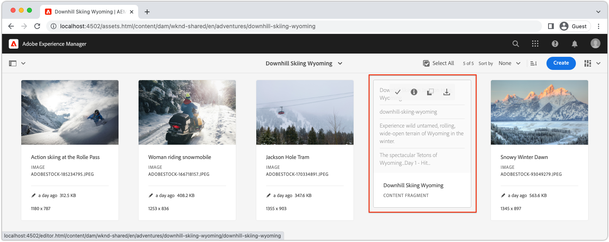

# Configuración rápida de AEM sin encabezado mediante el SDK local de AEM {#setup}

La configuración rápida de AEM sin encabezado le permite ponerse en contacto con AEM sin encabezado mediante el contenido del proyecto de muestra del sitio WKND y una aplicación React de muestra (un SPA) que consume el contenido a través de las API de GraphQL sin encabezado de AEM. Esta guía usa [AEM as a Cloud Service SDK](https://experienceleague.adobe.com/docs/experience-manager-cloud-service/content/implementing/developing/aem-as-a-cloud-service-sdk.html?lang=es).

## Requisitos previos {#prerequisites}

Las siguientes herramientas deben instalarse localmente:

* [JDK 11](https://experience.adobe.com/#/downloads/content/software-distribution/en/general.html?1_group.propertyvalues.property=.%2Fjcr%3Acontent%2Fmetadata%2Fdc%3AsoftwareType&amp;1_group.propertyvalues.operation=equals&amp;1_group.propertyvalues.0_values=software-type%3Atooling&amp;fulltext=Oracle%7E+JDK%7E+11%7E&amp;orderby=%40jcr%3Acontent%2Fjcr%3AlastModified&amp;orderby.sort=desc&amp;layout=list&amp;p.offset=0&amp;p.limit=14)
* [Node.js v18](https://nodejs.org/en/)
* [Git](https://git-scm.com/)

## 1. Instalar AEM SDK {#aem-sdk}

Esta configuración usa [AEM as a Cloud Service SDK](https://experienceleague.adobe.com/docs/experience-manager-cloud-service/implementing/developing/aem-as-a-cloud-service-sdk.html?#aem-as-a-cloud-service-sdk) para explorar las API de GraphQL de AEM. Esta sección proporciona una guía rápida para instalar AEM SDK y ejecutarlo en el modo Autor. Puede encontrar una guía más detallada para configurar un entorno de desarrollo local [aquí](https://experienceleague.adobe.com/docs/experience-manager-learn/cloud-service/local-development-environment-set-up/overview.html#local-development-environment-set-up).

>[!NOTE]
>
> También es posible seguir el tutorial con un [entorno de AEM as a Cloud Service](./cloud-service.md). A lo largo del tutorial se incluyen notas adicionales para utilizar un entorno de nube.

1. Vaya a **[Portal de distribución de software](https://experience.adobe.com/#/downloads/content/software-distribution/en/aemcloud.html?fulltext=AEM*+SDK*&amp;orderby=%40jcr%3Acontent%2Fjcr%3AlastModified&amp;orderby.sort=desc&amp;layout=list&amp;p.offset=0&amp;p.limit=1)** > **AEM as a Cloud Service** y descargue la última versión de **AEM SDK**.

   

1. Descomprima la descarga y copie el JAR de inicio rápido (`aem-sdk-quickstart-XXX.jar`) en una carpeta dedicada, por ejemplo `~/aem-sdk/author`.
1. Cambie el nombre del archivo jar a `aem-author-p4502.jar`.

   El nombre `author` especifica que el JAR de inicio rápido se inicia en el modo Autor. `p4502` especifica que Quickstart se ejecuta en el puerto 4502.

1. Para instalar e iniciar la instancia de AEM, abra un símbolo del sistema en la carpeta que contiene el archivo jar y ejecute el siguiente comando:

   ```shell
   $ cd ~/aem-sdk/author
   $ java -jar aem-author-p4502.jar
   ```

1. Proporcione una contraseña de administrador como `admin`. Cualquier contraseña de administrador es aceptable, pero se recomienda usar `admin` para el desarrollo local a fin de reducir la necesidad de volver a configurar.
1. Cuando el servicio AEM termine de instalarse, se abrirá una nueva ventana del explorador en [http://localhost:4502](http://localhost:4502).
1. Inicie sesión con el nombre de usuario `admin` y la contraseña seleccionados durante el inicio inicial de AEM (normalmente `admin`).

## 2. Instalar contenido de muestra {#install-sample-content}

El contenido de muestra del **sitio de referencia WKND** se usa para acelerar el tutorial. WKND es una marca ficticia de estilo de vida que se utiliza a menudo con la formación de AEM.

El sitio WKND incluye las configuraciones necesarias para exponer un [extremo GraphQL](https://experienceleague.adobe.com/docs/experience-manager-cloud-service/content/headless/graphql-api/content-fragments.html). En una implementación real, siga los pasos documentados para [incluir los extremos de GraphQL](https://experienceleague.adobe.com/docs/experience-manager-cloud-service/content/headless/graphql-api/content-fragments.html) en su proyecto de cliente. Un [CORS](#cors-config) también se ha empaquetado como parte del sitio WKND. Se requiere una configuración de CORS para conceder acceso a una aplicación externa. A continuación se encuentra más información sobre [CORS](#cors-config).

1. Descargue el paquete de AEM compilado más reciente para el sitio WKND: [aem-guides-wknd.all-x.x.x.zip](https://github.com/adobe/aem-guides-wknd/releases/latest).

   >[!NOTE]
   >
   > Asegúrese de descargar la versión estándar compatible con AEM as a Cloud Service y **no** la versión de `classic`.

1. En el menú **Inicio de AEM**, vaya a **Herramientas** > **Implementación** > **Paquetes**.

   

1. Haga clic en **Cargar paquete** y elija el paquete WKND descargado en el paso anterior. Haga clic en **Instalar** para instalar el paquete.

1. En el menú **Inicio de AEM**, vaya a **Assets** > **Archivos** > **WKND Compartido** > **Inglés** > **Aventuras**.

   

   Esta es una carpeta de todos los activos que componen las distintas Aventuras promocionadas por la marca WKND. Esto incluye tipos de medios tradicionales como imágenes y vídeo, y medios específicos de AEM como **Fragmentos de contenido**.

1. Haz clic en la carpeta **Downhill Skiing Wyoming** y luego en la tarjeta **Fragmento de contenido de Downhill Skiing Wyoming**:

   

1. El editor de fragmentos de contenido se abre para la aventura de Downhill Skiing Wyoming.

   

   Observe que varios campos como **Título**, **Descripción** y **Actividad** definen el fragmento.

   **Los fragmentos de contenido** son una de las formas de administrar el contenido en AEM. Los fragmentos de contenido son contenidos reutilizables y no relacionados con la presentación compuestos por elementos de datos estructurados, como texto, texto enriquecido, fechas o referencias a otros fragmentos de contenido. Los fragmentos de contenido se exploran con mayor detalle más adelante en la configuración rápida.

1. Haga clic en **Cancelar** para cerrar el fragmento. Siéntase libre de navegar en algunas de las otras carpetas y explorar el otro contenido de Aventura.

>[!NOTE]
>
> Si usa un entorno de Cloud Service, consulte la documentación para [implementar una base de código como el sitio de referencia de WKND en un entorno de Cloud Service](https://experienceleague.adobe.com/docs/experience-manager-cloud-service/implementing/deploying/overview.html#coding-against-the-right-aem-version).

## 3. Descargar y ejecutar la aplicación WKND React {#sample-app}

Uno de los objetivos de este tutorial es mostrar cómo consumir contenido de AEM desde una aplicación externa mediante las API de GraphQL. Este tutorial utiliza un ejemplo de la aplicación React. La aplicación React es intencionalmente sencilla, para centrarse en la integración con las API de GraphQL de AEM.

1. Abra un nuevo símbolo del sistema y clone la aplicación React de ejemplo desde GitHub:

   ```shell
   $ git clone git@github.com:adobe/aem-guides-wknd-graphql.git
   $ cd aem-guides-wknd-graphql/react-app
   ```

1. Abra la aplicación React en `aem-guides-wknd-graphql/react-app` en el IDE que desee.
1. En el IDE, abra el archivo `.env.development` en `/.env.development`. Compruebe que la línea `REACT_APP_AUTHORIZATION` no esté comentada y que el archivo declare las siguientes variables:

   ```plain
   REACT_APP_HOST_URI=http://localhost:4502
   REACT_APP_GRAPHQL_ENDPOINT=/content/graphql/global/endpoint.json
   # Use Authorization when connecting to an AEM Author environment
   REACT_APP_AUTHORIZATION=admin:admin
   ```

   Asegúrese de que `REACT_APP_HOST_URI` apunta a su AEM SDK local. Para mayor comodidad, este inicio rápido conecta la aplicación React con **AEM Author**. Los servicios de **Autor** requieren autenticación, por lo que la aplicación utiliza al usuario `admin` para establecer su conexión. La conexión de una aplicación al Autor de AEM es una práctica común durante el desarrollo, ya que facilita la iteración rápida en el contenido sin necesidad de publicar cambios.

   >[!NOTE]
   >
   > En un escenario de producción, la aplicación se conectará a un entorno de AEM **Publish**. Esto se trata con más detalle en la sección _Implementación de producción_.


1. Instale e inicie la aplicación React:

   ```shell
   $ cd aem-guides-wknd-graphql/react-app
   $ npm install
   $ npm start
   ```

1. Una nueva ventana del explorador abre automáticamente la aplicación en [http://localhost:3000](http://localhost:3000).

   

   Se muestra una lista del contenido de aventura de AEM.

1. Haga clic en una de las imágenes de aventura para ver los detalles de la aventura. Se solicita a AEM que devuelva el detalle de la aventura.

   

1. Utilice las herramientas para desarrolladores del explorador para inspeccionar las solicitudes de **Red**. Vea las **solicitudes XHR** y observe varias solicitudes GET a `/graphql/execute.json/...`. Este prefijo de ruta invoca el extremo de consulta persistente de AEM, al seleccionar la consulta persistente que se va a ejecutar mediante el nombre y los parámetros codificados que siguen al prefijo.

   

## 4. Editar contenido en AEM

Con la aplicación React en ejecución, actualice el contenido en AEM y compruebe que el cambio se refleja en la aplicación.

1. Vaya a AEM [http://localhost:4502](http://localhost:4502).
1. Vaya a **Assets** > **Archivos** > **WKND Compartido** > **Inglés** > **Aventuras** > **[Bali Surf Camp](http://localhost:4502/assets.html/content/dam/wknd-shared/en/adventures/bali-surf-camp)**.

   

1. Haz clic en el fragmento de contenido **Bali Surf Camp** para abrir el editor de fragmentos de contenido.
1. Modifica el **Título** y la **Descripción** de la aventura.

   

1. Haga clic en **Guardar** para guardar los cambios.
1. Actualice la aplicación React en [http://localhost:3000](http://localhost:3000) para ver los cambios:

   

## 5. Explorar GraphiQL {#graphiql}

1. Abra [GraphiQL](http://localhost:4502/aem/graphiql.html) navegando a **Herramientas** > **General** > **Editor de consultas de GraphQL**
1. Seleccione las consultas persistentes existentes a la izquierda y ejecútelas para ver los resultados.

   >[!NOTE]
   >
   > La herramienta GraphiQL y la API de GraphQL se [exploran con más detalle más adelante en el tutorial](../multi-step/explore-graphql-api.md).

## Enhorabuena.{#congratulations}

¡Enhorabuena! Ahora tiene una aplicación externa que consume contenido de AEM con GraphQL. No dude en inspeccionar el código en la aplicación React y seguir experimentando con la modificación de fragmentos de contenido existentes.

### Siguientes pasos

* [Inicio del tutorial de AEM sin encabezado](../multi-step/overview.md)
