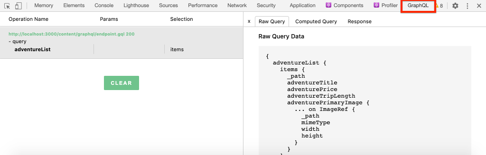
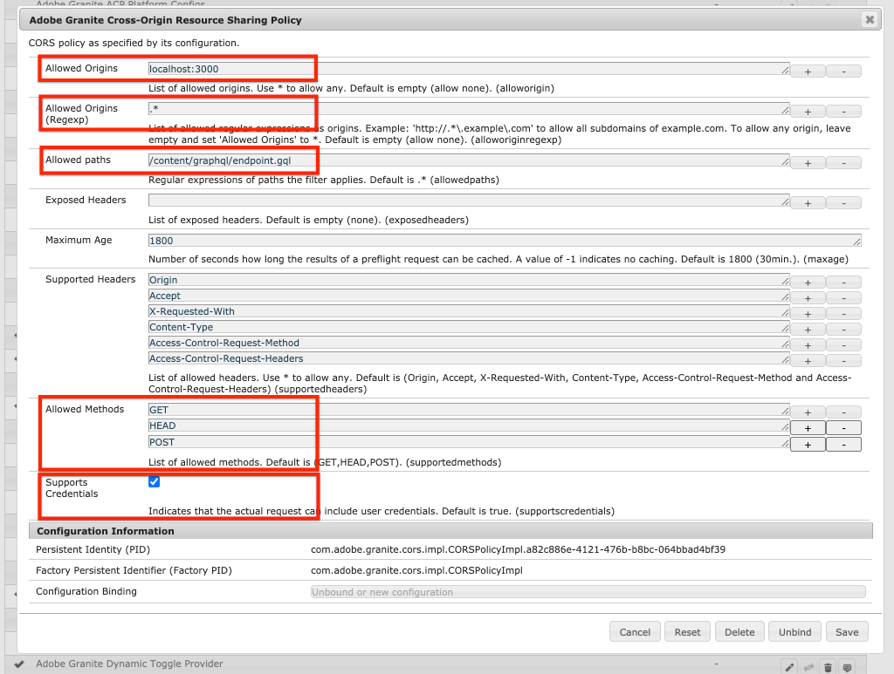

# Configuración rápida {#setup}

Este capítulo oferta una rápida configuración de un entorno local para ver que una aplicación externa consume contenido de AEM mediante API de GraphQL AEM. Los capítulos posteriores del tutorial generarán esta configuración.

## Requisitos previos {#prerequisites}

Las siguientes herramientas deben instalarse localmente:

* [JDK 11](https://experience.adobe.com/#/downloads/content/software-distribution/en/general.html?1_group.propertyvalues.property=.%2Fjcr%3Acontent%2Fmetadata%2Fdc%3AsoftwareType&amp;1_group.propertyvalues.operation=equals&amp;1_group.propertyvalues.0_values=software-type%3Atooling&amp;fulltext=Oracle%7E+JDK%7E+11%7E&amp;orderby=%40jcr%3Acontent%2Fr jcr%3AlastModified&amp;orderby.sort=desc&amp;layout=lista&amp;p.offset=0&amp;p.limit=14)
* [Node.js v10+](https://nodejs.org/en/)
* [npm 6+](https://www.npmjs.com/)
* [Git](https://git-scm.com/)

## Objetivos {#objectives}

1. Descargue e instale el SDK de AEM.
1. Descargue e instale contenido de muestra del sitio de referencia de WKND.
1. Descargue e instale una aplicación de muestra para consumir contenido mediante las API de GraphQL.

## Instalación del SDK de AEM{#aem-sdk}

Este tutorial utiliza el [AEM como un SDK de Cloud Service](https://experienceleague.adobe.com/docs/experience-manager-cloud-service/implementing/developing/aem-as-a-cloud-service-sdk.html?lang=en#aem-as-a-cloud-service-sdk) para explorar AEM API de GraphQL. Esta sección proporciona una guía rápida para instalar el SDK de AEM y ejecutarlo en modo de autor. Puede encontrar una guía más detallada para configurar un entorno de desarrollo local [aquí](https://experienceleague.adobe.com/docs/experience-manager-learn/cloud-service/local-development-environment-set-up/overview.html?lang=en#local-development-environment-set-up).

>[!NOTE]
>
> También es posible seguir el tutorial con un AEM como entorno Cloud Service. A lo largo del tutorial se incluyen notas adicionales sobre el uso de un entorno de nube.

1. Vaya al **[Portal de distribución de software](https://experience.adobe.com/#/downloads/content/software-distribution/es-ES/aemcloud.html)** > **AEM como Cloud Service** y descargue la versión más reciente del **AEM SDK**.

   

1. Descomprima la descarga y copie el tarro de inicio rápido (`aem-sdk-quickstart-XXX.jar`) en una carpeta dedicada, por ejemplo `~/aem-sdk/author`.
1. Cambie el nombre del archivo jar a `aem-author-p4502.jar`.
1. Abra una nueva ventana de terminal y vaya a la carpeta que contiene el archivo jar. Ejecute el siguiente comando para instalar y inicio de la instancia de AEM:

   ```shell
   $ cd ~/aem-sdk/author
   $ java -jar aem-author-p4502.jar
   ```

1. Proporcione una contraseña de administrador como `admin`. Se acepta cualquier contraseña de administrador, pero se recomienda utilizar el valor predeterminado para el desarrollo local a fin de reducir la necesidad de volver a configurar.
1. Después de unos minutos, la instancia de AEM finalizará la instalación y se abrirá una nueva ventana del explorador en [http://localhost:4502](http://localhost:4502).
1. Inicie sesión con el nombre de usuario `admin` y la contraseña `admin`.

## Instalar contenido de muestra{#wknd-site}

Se instalará contenido de muestra del sitio de referencia WKND para acelerar el tutorial. El WKND es una marca ficticia de estilo de vida, que a menudo se utiliza junto con AEM formación.

1. Descargue el paquete de AEM más reciente compilado para el sitio WKND: [aem-guide-wknd.all-x.x.x.zip](https://github.com/adobe/aem-guides-wknd/releases/latest).

   >[!NOTE]
   >
   > Asegúrese de descargar la versión estándar compatible con AEM como Cloud Service y **no** la versión `classic`.

1. En el menú **AEM Inicio** vaya a **Herramientas** > **Implementación** > **Paquetes**.

   

1. Haga clic en **Cargar paquete** y elija el paquete WKND descargado en el paso anterior. Haga clic en **Instalar** para instalar el paquete.

1. En el menú **AEM Inicio** vaya a **Recursos** > **Archivos**.
1. Haga clic en las carpetas para navegar a **Sitio WKND** > **Inglés** > **Aventuras**.

   

   Esta es una carpeta de todos los recursos que componen las distintas aventuras promocionadas por la marca WKND. Esto incluye tipos de medios tradicionales como imágenes y video, así como medios específicos de AEM como **Fragmentos de contenido**.

1. Haga clic en la carpeta **Downhill Skiing Wyoming** y haga clic en la tarjeta **Downhill Skiing Content Fragment**:

   

1. La interfaz de usuario del Editor de fragmentos de contenido se abrirá para la aventura de esquiar cuesta abajo de Wyoming.

   

   Observe que varios campos como **Título**, **Descripción** y **Actividad** definen el fragmento.

   **Los** fragmentos de contenido son una de las formas en que se puede administrar el contenido en AEM. El fragmento de contenido es un contenido reutilizable y no basado en la presentación compuesto por elementos de datos estructurados como texto, texto enriquecido, fechas o referencias a otros fragmentos de contenido. Los fragmentos de contenido se explorarán con buenos detalles más adelante en el tutorial.

1. Haga clic en **Cancelar** para cerrar el fragmento. Siéntase libre de navegar por algunas de las otras carpetas y explorar el otro contenido de Aventura.

>[!NOTE]
>
> Si utiliza un entorno de Cloud Service, consulte la documentación sobre cómo [implementar una base de código como el sitio de referencia WKND en un entorno de Cloud Service](https://experienceleague.adobe.com/docs/experience-manager-cloud-service/implementing/deploying/overview.html?lang=en#deploying).

## Instalar los extremos de GraphQL{#graphql-endpoint}

Es necesario configurar los extremos de GraphQL. Esto proporciona flexibilidad al proyecto para determinar el punto final exacto al que se expone la API de GraphQL. También se necesita un [CORS](#cors-config) para otorgar acceso a una aplicación externa. Para acelerar el tutorial, se ha creado previamente un paquete.

1. Descargue el paquete [aem-guide-wknd-graphql.all-1.0.0-SNAPSHOT.zip](./assets/setup/aem-guides-wknd-graphql.all-1.0.0-SNAPSHOT.zip).
1. En el menú **AEM Inicio** vaya a **Herramientas** > **Implementación** > **Paquetes**.
1. Haga clic en **Cargar paquete** y elija el paquete descargado en el paso anterior. Haga clic en **Instalar** para instalar el paquete.

El paquete anterior también contiene la [herramienta GraphiQL](https://github.com/graphql/graphiql) que se utilizará en capítulos posteriores. Puede [encontrar más información sobre la configuración de CORS a continuación](#cors-config).

## Instale la aplicación de ejemplo{#sample-app}

Uno de los objetivos de este tutorial es mostrar cómo utilizar AEM contenido de una aplicación externa mediante las API de GraphQL. Este tutorial utiliza un ejemplo de React App que se ha completado parcialmente para acelerar el tutorial. Las mismas lecciones y conceptos se aplican a las aplicaciones creadas con iOS, Android o cualquier otra plataforma. La aplicación React es intencionalmente sencilla, para evitar una complejidad innecesaria; no se supone que sea una implementación de referencia.

1. Abra una nueva ventana de terminal y clone la ramificación de inicio de tutorial usando Git:

   ```shell
   $ git clone --branch tutorial/react git@github.com:adobe/aem-guides-wknd-graphql.git
   ```

1. En el IDE de su elección, abra el archivo `.env.development` en `aem-guides-wknd-graphql/react-app/.env.development`. Quite el comentario de la línea `REACT_APP_AUTHORIZATION` para que el archivo tenga el siguiente aspecto:

   ```plain
   REACT_APP_HOST_URI=http://localhost:4502
   REACT_APP_GRAPHQL_ENDPOINT=/content/graphql/endpoint.gql
   REACT_APP_AUTHORIZATION=admin:admin
   ```

   Asegúrese de que `React_APP_HOST_URI` coincide con la instancia de AEM local. En este capítulo conectaremos la aplicación React directamente con el entorno AEM **Autor** y, por lo tanto, será necesario autenticarse. Esta es una práctica común durante el desarrollo, ya que nos permite realizar cambios rápidamente en el entorno de AEM y verlos reflejados inmediatamente en la aplicación.

   >[!NOTE]
   >
   > En un escenario de producción, la aplicación se conectará a un entorno AEM **Publish**. Esto se trata con más detalle, más adelante en el tutorial.

1. Vaya a la carpeta `aem-guides-wknd-graphql/react-app`. Instalación y inicio de la aplicación:

   ```shell
   $ cd aem-guides-wknd-graphql/react-app
   $ npm install
   $ npm start
   ```

1. Una nueva ventana del explorador debe iniciar automáticamente la aplicación en [http://localhost:3000](http://localhost:3000).

   

   Se debería mostrar una lista del contenido actual de la aventura de AEM.

1. Haga clic en una de las imágenes de aventura para vista los detalles de la aventura. Se solicita a AEM que devuelva el detalle de una aventura.

   

1. Utilice las herramientas de desarrollador del explorador para inspeccionar las solicitudes **Network**. Vista las solicitudes **XHR** y observe varias solicitudes de POST a `/content/graphql/endpoint.gql`, el punto final de GraphQL configurado para AEM.

   

1. También puede realizar la vista de los parámetros y la respuesta JSON inspeccionando la solicitud de red. Puede resultar útil instalar una extensión de explorador como [Red GraphQL](https://chrome.google.com/webstore/detail/graphql-network/igbmhmnkobkjalekgiehijefpkdemocm) para Chrome a fin de comprender mejor la consulta y la respuesta.

   

   *Uso de la extensión Chrome Red GraphQL*

## Modificación de un fragmento de contenido

Ahora que la aplicación React se está ejecutando, actualice el contenido de AEM y vea el cambio reflejado en la aplicación.

1. Vaya a AEM [http://localhost:4502](http://localhost:4502).
1. Vaya a **Assets** > **Files** > **WKND Site** > **English** > **Adventures** > **[Bali Surf Camp](http://localhost:4502/assets.html/content/dam/wknd/en/adventures/bali-surf-camp)**.

   

1. Haga clic en el fragmento de contenido **Campo de surf de Bali** para abrir el Editor de fragmentos de contenido.
1. Modifique el **Título** y la **Descripción** de la aventura

   

1. Haga clic en **Guardar** para guardar los cambios.
1. Vuelva a la aplicación React en [http://localhost:3000](http://localhost:3000) y actualice para ver los cambios:

   

## Felicitaciones! {#congratulations}

Enhorabuena, ahora tiene una aplicación externa que consume AEM contenido con GraphQL. No dude en inspeccionar el código en la aplicación React y seguir experimentando con la modificación de fragmentos de contenido existentes.

## Próximos pasos {#next-steps}

En el siguiente capítulo, [Definición de modelos de fragmento de contenido](content-fragment-models.md), aprenda a modelar contenido y a crear un esquema con **Modelos de fragmento de contenido**. Revisará los modelos existentes y creará un nuevo modelo. También aprenderá los diferentes tipos de datos que se pueden utilizar para definir un esquema como parte del modelo.

## (Bono) Configuración de CORS {#cors-config}

AEM, al ser seguro de forma predeterminada, bloquea las solicitudes entre orígenes, lo que impide que las aplicaciones no autorizadas se conecten y muestren su contenido.

Para permitir que la aplicación React de este tutorial interactúe con los extremos de AEM API de GraphQL, se ha definido una configuración de uso compartido de recursos entre orígenes en el paquete de extremos de GraphQL.



Para configurar manualmente esto:

1. Vaya a la consola web de AEM SDK en **Herramientas** > **Operaciones** > **Consola web**
1. Haga clic en la fila rotulada **Política de uso compartido de recursos de granito de Adobe** para crear una nueva configuración
1. Actualice los campos siguientes, dejando a los demás con sus valores predeterminados:
   * Orígenes permitidos: `localhost:3000`
   * Orígenes permitidos (Regex): `.* `
   * Rutas permitidas: `/content/graphql/endpoint.gql`
   * Métodos permitidos: `GET`, `HEAD`, `POST`
      * Solo se requiere `POST` para GraphQL, pero los otros métodos pueden ser útiles cuando interactúan con AEM de manera directa.
   * Admite credenciales: `Yes`
      * Esto es necesario, ya que nuestra aplicación React se comunicará con los puntos finales de GraphQL protegidos del servicio AEM Author.
1. Haga clic en **Guardar**

Esta configuración permite `POST` solicitudes HTTP procedentes de `localhost:3000` al servicio AEM Author en la ruta `/content/graphql/endpoint.gql`.

Esta configuración y los extremos de GraphQL se generan a partir de un proyecto AEM. [Vista los detalles aquí](https://github.com/adobe/aem-guides-wknd-graphql/tree/master/aem-project).
