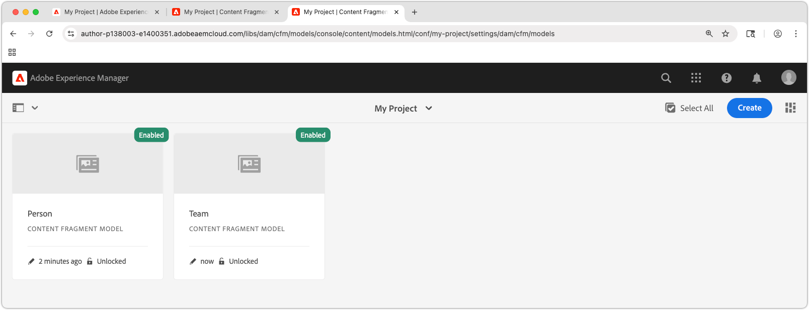

# Definición de los modelos de fragmento de contenido

En este capítulo, aprenderá a modelar contenido y a crear un esquema con **Modelos de fragmento de contenido**, así como sobre los diferentes tipos de datos que definen un modelo de fragmento de contenido.

En este tutorial, creará dos modelos simples, **Equipo** y **Persona**. El modelo de datos **Equipo** tiene nombre, nombre corto y descripción y hace referencia al modelo de datos **Persona**, que tiene nombre completo, detalles biológicos, imagen de perfil y lista de ocupaciones.

## Objetivos

* Cree un modelo de fragmento de contenido.
* Explore los tipos de datos disponibles y las opciones de validación para crear modelos.
* Comprenda cómo los modelos de fragmentos de contenido definen **tanto** el esquema de datos como la plantilla de creación de un fragmento de contenido.

## Crear una configuración de proyecto

Una configuración de proyecto contiene todos los modelos de fragmentos de contenido asociados a un proyecto concreto y proporciona un medio para organizar los modelos. Cree al menos un proyecto **antes de** crear el modelo de fragmento de contenido.

1. Inicie sesión en el entorno de AEM **Author** (p. ej. `https://author-p<PROGRAM_ID>-e<ENVIRONMENT_ID>.adobeaemcloud.com/`)
1. En la pantalla de inicio de AEM, vaya a **Herramientas** > **General** > **Explorador de configuración**.
1. Haga clic en **Crear** en la barra de acciones superior e introduzca los siguientes detalles de configuración:
   * Título: **Mi proyecto**
   * Nombre: **my-project**
   * Modelos de fragmento de contenido: **Comprobado**

   

1. Seleccione **Crear** para crear la configuración del proyecto.

## Crear los modelos de fragmentos de contenido

A continuación, cree modelos de fragmentos de contenido para un **equipo** y una **persona**. Estos actuarán como modelos de datos, o esquemas, que representan a un equipo y a una persona que forma parte de un equipo, y definirán la interfaz para que los autores creen y editen fragmentos de contenido basados en estos modelos.

### Creación del modelo de fragmento de contenido de persona

Cree un modelo de fragmento de contenido para una **persona**, que es el modelo de datos o esquema que representa a una persona que forma parte de un equipo.

1. En la pantalla de inicio de AEM, vaya a **Herramientas** > **General** > **Modelos de fragmentos de contenido**.
1. Vaya a la carpeta **Mi proyecto**.
1. Seleccione **Crear** en la esquina superior derecha para que aparezca el asistente **Crear modelo**.
1. Cree un modelo de fragmento de contenido con las siguientes propiedades:

   * Título de modelo: **Persona**
   * Habilitar modelo: **Comprobado**

   Seleccione **Crear**. En el cuadro de diálogo resultante, seleccione **Abrir** para generar el modelo.

1. Arrastre y suelte un elemento **Texto de una sola línea** en el panel principal. Escriba las siguientes propiedades en la ficha **Propiedades**:

   * Etiqueta de campo: **Nombre completo**
   * Nombre de propiedad: `fullName`
   * Comprobación **Requerida**

   **Nombre de propiedad** define el nombre de la propiedad donde se almacena el valor creado en AEM. El **Nombre de propiedad** también define el nombre de **clave** para esta propiedad como parte del esquema de datos y se utiliza como clave en la respuesta JSON cuando el fragmento de contenido se entrega a través de las API abiertas de AEM.

1. Seleccione la pestaña **Tipos de datos** y arrastre y suelte un campo de **Texto de varias líneas** debajo del campo **Nombre completo**. Introduzca las siguientes propiedades:

   * Etiqueta de campo: **Biografía**
   * Nombre de propiedad: `biographyText`
   * Tipo predeterminado: **Texto enriquecido**

1. Haga clic en la pestaña **Tipos de datos** y arrastre y suelte un campo de **Referencia de contenido**. Introduzca las siguientes propiedades:

   * Etiqueta de campo: **Imagen de perfil**
   * Nombre de propiedad: `profilePicture`
   * Ruta raíz: `/content/dam`

     Al configurar la **Ruta raíz**, puede hacer clic en el icono **carpeta** para que aparezca un modal y seleccione la ruta. Esto restringe las carpetas que los autores pueden utilizar para rellenar la ruta. `/content/dam` es la raíz en la que se almacenan todos los AEM Assets (imágenes, vídeos y otros fragmentos de contenido).

   * Aceptar solo tipos de contenido específicos: **Imagen**

     Agregue una validación a la **Referencia de imagen** para que solo se puedan usar los tipos de contenido de **Imágenes** para rellenar el campo.

   * Mostrar miniatura: **Comprobado**

1. Haga clic en la ficha **Tipos de datos** y arrastre y suelte un tipo de datos **Enumeración** debajo del campo **Referencia de imagen**. Introduzca las siguientes propiedades:

   * Procesar como: **Casillas**
   * Etiqueta de campo: **Ocupación**
   * Nombre de propiedad: `occupation`
   * Opciones:
      * **Artista**
      * **Influencer**
      * **Fotógrafo**
      * **Viajero**
      * **Escritor**
      * **YouTuber**

   Establezca el mismo valor para Option label y value.

1. El modelo final de **persona** debe tener el siguiente aspecto:

   

1. Haga clic en **Guardar** para guardar los cambios.

### Crear el modelo de fragmento de contenido de equipo

Cree un modelo de fragmento de contenido para un **equipo**, que es el modelo de datos para un equipo de personas. El modelo de equipo hace referencia a los fragmentos de contenido de la persona, que representan a los miembros del equipo.

1. En la carpeta **Mi proyecto**, seleccione **Crear** en la esquina superior derecha para que aparezca el asistente **Crear modelo**.
1. En el campo **Título de modelo**, escriba **Equipo** y seleccione **Crear**.

   Seleccione **Abrir** en el cuadro de diálogo resultante para abrir el modelo recién creado.

1. Arrastre y suelte un elemento **Texto de una sola línea** en el panel principal. Escriba las siguientes propiedades en la ficha **Propiedades**:

   * Etiqueta de campo: **Título**
   * Nombre de propiedad: `title`
   * Comprobación **Requerida**

1. Seleccione la pestaña **Tipos de datos** y arrastre y suelte un campo de **Texto de varias líneas** debajo del campo **Nombre corto**. Introduzca las siguientes propiedades:

   * Etiqueta de campo: **Descripción**
   * Nombre de propiedad: `description`
   * Tipo predeterminado: **Texto enriquecido**

1. Haga clic en la pestaña **Tipos de datos** y arrastre y suelte un campo **Referencia de fragmento**. Introduzca las siguientes propiedades:

   * Procesar como: **Campo múltiple**
   * Cantidad mínima de elementos: **2**
   * Etiqueta de campo: **Miembros del equipo**
   * Nombre de propiedad: `teamMembers`
   * Modelos de fragmento de contenido permitidos: use el icono de carpeta para seleccionar el modelo **Person**.

1. El modelo final de **equipo** debería tener el siguiente aspecto:

   

1. Haga clic en **Guardar** para guardar los cambios.

1. Ahora debería tener dos modelos desde los que trabajar:

   

## Enhorabuena.

¡Enhorabuena, acaba de crear sus primeros modelos de fragmentos de contenido!

## Próximos pasos

En el capítulo siguiente, [Creación de modelos de fragmentos de contenido](2-author-content-fragments.md), crea y edita un nuevo fragmento de contenido basado en un modelo de fragmento de contenido. También aprenderá a crear variaciones de Fragmentos de contenido.

## Documentación relacionada

* [Modelos de fragmentos de contenido](https://experienceleague.adobe.com/docs/experience-manager-cloud-service/content/assets/content-fragments/content-fragments-models.html)

