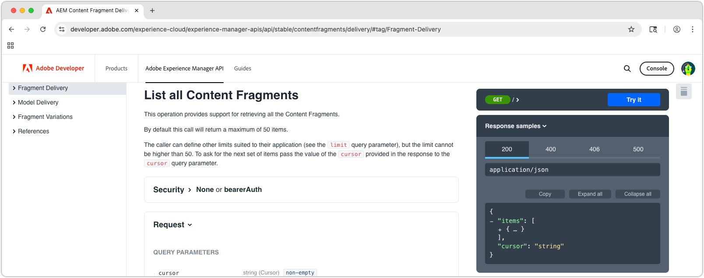

# Explore las API de entrega de fragmentos de contenido basadas en AEM OpenAPI

La entrega de fragmentos de contenido de [AEM con API de OpenAPI](https://developer.adobe.com/experience-cloud/experience-manager-apis/api/stable/contentfragments/delivery/) en AEM ofrece una forma eficaz de entregar contenido estructurado a cualquier aplicación o canal. En este capítulo, exploramos cómo utilizar las OpenAPI para recuperar fragmentos de contenido a través de la funcionalidad **Probar** de la documentación.

## Requisitos previos {#prerequisites}

Este es un tutorial de varias partes y supone que se han completado los pasos descritos en [Creación de fragmentos de contenido](./2-author-content-fragments.md).

Asegúrese de tener lo siguiente:

* Nombre de host del servicio de publicación de AEM (por ejemplo: `https://publish-<PROGRAM_ID>-e<ENVIRONMENT_ID >.adobeaemcloud.com/`) en el que se publican los [fragmentos de contenido](./2-author-content-fragments.md#publish-content-fragments). Si va a publicar un servicio de vista previa de AEM, debe tener disponible ese nombre de host (por ejemplo, `https://preview-<PROGRAM_ID>-e<ENVIRONMENT_ID>.adobeaemcloud.com/`).

## Objetivos {#objectives}

* Familiarícese con la entrega de fragmentos de contenido de [AEM con las API de OpenAPI](https://developer.adobe.com/experience-cloud/experience-manager-apis/api/stable/contentfragments/delivery/).
* Invoque las API mediante la capacidad **Probar** de los documentos de API.

## API de envío

La Entrega de fragmentos de contenido de AEM con API de OpenAPI proporciona una interfaz RESTful para recuperar fragmentos de contenido. Las API que se describen en este tutorial solo están disponibles en los servicios Publicación y Vista previa de AEM y no en el servicio Autor. Existen otras API abiertas para [interactuar con fragmentos de contenido en el servicio de AEM Author](https://developer.adobe.com/experience-cloud/experience-manager-apis/api/stable/sites/).

## Exploración de las API

[Entrega de fragmentos de contenido de AEM con documentación de API de OpenAPI](https://developer.adobe.com/experience-cloud/experience-manager-apis/api/stable/contentfragments/delivery/) tiene la función &quot;Probar&quot; que le permite explorar las API y probarlas directamente desde el explorador. Esta es una buena manera de familiarizarse con los puntos de conexión de API y sus funcionalidades.

Abra [documentos de la API de AEM Sites](https://developer.adobe.com/experience-cloud/experience-manager-apis/api/stable/contentfragments/delivery/) en su explorador.

Las API se enumeran en el panel de navegación izquierdo bajo la sección **Entrega de fragmentos**. Puede ampliar esta sección para ver las API disponibles. Al seleccionar una API, se muestran los detalles de la API en el panel principal y la sección **Probarla** en el carril derecho, que le permite probar y explorar la API directamente desde el explorador.



## Enumerar fragmentos de contenido

1. Abra [AEM Content Fragment Delivery con OpenAPI developer docs](https://developer.adobe.com/experience-cloud/experience-manager-apis/api/stable/contentfragments/delivery/) en su explorador.
1. En el panel de navegación izquierdo, expanda la sección **Entrega de fragmentos** y seleccione la API **Enumerar todos los fragmentos de contenido**

Esta API le permite recuperar una lista paginada de todos los fragmentos de contenido de AEM por carpeta. La forma más sencilla de utilizar esta API es proporcionar la ruta a la carpeta que contiene los fragmentos de contenido.

1. Seleccione **Probarlo** en la parte superior del carril derecho.
1. Introduzca el identificador del servicio de AEM al que se conectará la API para recuperar los fragmentos de contenido. El contenedor es la primera parte de la URL del servicio de publicación (o vista previa) de AEM, normalmente con el formato: `publish-p<PROGRAM_ID>-e<ENVIRONMENT_ID>` o `preview-p<PROGRAM_ID>-e<ENVIRONMENT_ID>`.

Dado que estamos utilizando el servicio de publicación de AEM, establezca el bloque en el identificador del servicio de publicación de AEM. Por ejemplo:

* **cubo**: `publish-p138003-e1400351`


Cuando se establece el contenedor, el campo **Servidor de destino** se actualiza automáticamente a la dirección URL de API completa del servicio de publicación de AEM, como: `https://publish-p138003-e1400351.adobeaemcloud.com/adobe/contentFragments`

1. Expanda la sección **Seguridad** y establezca **Esquema de seguridad** en **Ninguno**. Esto se debe a que el servicio Publicación de AEM (y el servicio Vista previa) no requieren autenticación para la Entrega de fragmentos de contenido de AEM con API de OpenAPI.

1. Expanda la sección **Parámetros** para proporcionar los detalles del fragmento de contenido que se va a obtener.

* **cursor**: déjelo vacío, se usa para la paginación y es una solicitud inicial.
* **limit**: déjelo vacío, se usa para limitar el número de resultados devueltos por página de resultados.
* **ruta**: `/content/dam/my-project/en`

  >[!TIP]
  > Al introducir una ruta de acceso, asegúrese de que su prefijo sea `/content/dam/` y de que **no** termine con una barra diagonal `/`.

  

1. Seleccione el botón **Send** para ejecutar la llamada de API.
1. En la ficha **Respuesta** del panel **Probarlo**, debería ver una respuesta JSON que contenga una lista de fragmentos de contenido en la carpeta especificada. La respuesta será similar a la siguiente:

   

1. La respuesta contiene todos los fragmentos de contenido bajo la carpeta `path` del parámetro `/content/dam/my-project`, incluidas las subcarpetas, incluidos los fragmentos de contenido de **Persona** y **Equipo**.
1. Haga clic en la matriz `items` y busque el valor `Team Alpha` del elemento `id`. El ID se utiliza en la siguiente sección para recuperar los detalles de un solo fragmento de contenido.
1. Seleccione **Editar solicitud** en la parte superior del panel **Probar** y los distintos parámetros de la llamada de API para ver cómo cambia la respuesta. Por ejemplo, puede cambiar la ruta a una carpeta diferente que contenga fragmentos de contenido o puede agregar parámetros de consulta para filtrar los resultados. Por ejemplo, cambie el parámetro `path` a `/content/dam/my-project/teams` para que solo incluya fragmentos de contenido en esa carpeta (y subcarpetas).

## Obtener detalles del fragmento de contenido

Similar a la API **Enumerar todos los fragmentos de contenido**, la API **Obtener un fragmento de contenido** recupera un solo fragmento de contenido por su ID junto con cualquier referencia opcional. Para explorar esta API, solicitaremos el fragmento de contenido del equipo que hace referencia a varios fragmentos de contenido de persona.

1. Expanda la sección **Entrega de fragmentos** en el carril izquierdo y seleccione la API **Obtener un fragmento de contenido**.
1. Seleccione **Probarlo** en la parte superior del carril derecho.
1. Compruebe que `bucket` apunta a su servicio de publicación o vista previa de AEM as a Cloud Service.
1. Expanda la sección **Seguridad** y establezca **Esquema de seguridad** en **Ninguno**. Esto se debe a que el servicio Publicación de AEM no requiere autenticación para la Entrega de fragmentos de contenido de AEM con API de OpenAPI.
1. Expanda la sección **Parámetros** para proporcionar los detalles del fragmento de contenido que se va a obtener:

En este ejemplo, utilice el ID del fragmento de contenido del equipo recuperado en la sección anterior. Por ejemplo, para esta respuesta de fragmento de contenido en **Enumerar todos los fragmentos de contenido**, use el valor en el campo `id` de `b954923a-0368-4fa2-93ea-2845f599f512`. (Su `id` será diferente del valor utilizado en el tutorial).

```json
{
    "path": "/content/dam/my-project/teams/team-alpha",
    "name": "",
    "title": "Team Alpha",
    "id": "50f28a14-fec7-4783-a18f-2ce2dc017f55", // This is the Content Fragment ID
    "description": "",
    "model": {},
    "fields": {} 
}
```

* **fragmentId**: `50f28a14-fec7-4783-a18f-2ce2dc017f55`
* **referencias**: `none`
* **depth**: Si se deja vacío, el parámetro **references** dictará la profundidad de los fragmentos a los que se hace referencia.
* **hidratado**: si se deja vacío, el parámetro **references** dictará la hidratación de los fragmentos a los que se hace referencia.
* **If-None-Match**: Dejar vacío

1. Seleccione el botón **Send** para ejecutar la llamada de API.
1. Revise la respuesta en la ficha **Respuesta** del panel **Probarla**. Debería ver una respuesta JSON que contenga los detalles del fragmento de contenido, incluidas sus propiedades y cualquier referencia que tenga.
1. Seleccione **Editar solicitud** en la parte superior del panel **Probarlo** y en las secciones **Parámetros**, ajuste el parámetro `references` a `all-hydrated`, haciendo que todo el contenido de fragmento de contenido referenciado se incluya en la llamada de API.

   * **fragmentId**: `50f28a14-fec7-4783-a18f-2ce2dc017f55`
   * **referencias**: `all-hydrated`
   * **depth**: Si se deja vacío, el parámetro **references** dictará la profundidad de los fragmentos a los que se hace referencia.
   * **hidratado**: si se deja vacío, el parámetro **references** dictará la hidratación de los fragmentos a los que se hace referencia.
   * **If-None-Match**: Dejar vacío

1. Seleccione el botón **Volver a enviar** para ejecutar de nuevo la llamada de API.
1. Revise la respuesta en la ficha **Respuesta** del panel **Probarla**. Debería ver una respuesta JSON que contenga los detalles del fragmento de contenido, incluidas sus propiedades y las de los fragmentos de contenido de persona a los que se hace referencia.

Observe que la matriz `teamMembers` ahora incluye los detalles de los fragmentos de contenido de persona a los que se hace referencia. La hidratación de referencias le permite recuperar todos los datos necesarios en una sola llamada de API, lo que resulta especialmente útil para reducir el número de solicitudes realizadas por las aplicaciones cliente.

## Enhorabuena.

¡Enhorabuena! Ha creado y ejecutado varias entregas de fragmentos de contenido de AEM con llamadas a la API de OpenAPI mediante la capacidad **Probar** de la documentación de AEM.

## Próximos pasos

En el capítulo siguiente, [Crear una aplicación de React](./4-react-app.md), explora cómo una aplicación externa puede interactuar con la Entrega de fragmentos de contenido de AEM con las API de OpenAPI.

