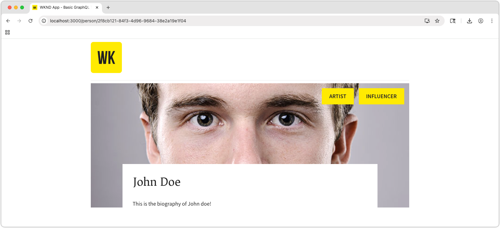

# Creación de una aplicación de React con las API de entrega de fragmentos de contenido de AEM

En este capítulo, explora cómo la entrega de fragmentos de contenido de AEM con API de OpenAPI puede impulsar la experiencia en aplicaciones externas.

Se usa una aplicación React simple para solicitar y mostrar el contenido de **Equipo** y **Persona** expuesto por la entrega de fragmentos de contenido de AEM con las API de OpenAPI. El uso de React no es importante en gran medida, y la aplicación externa utilizada podría escribirse en cualquier marco de trabajo para cualquier plataforma, siempre y cuando pueda realizar solicitudes HTTP a AEM as a Cloud Service.

## Requisitos previos

Se da por hecho que se han completado los pasos descritos en las partes anteriores de este tutorial de varias partes.

Se debe instalar el siguiente software:

* [Node.js v22+](https://nodejs.org/en)
* [Código de Visual Studio](https://code.visualstudio.com/)

## Objetivos

Obtenga información sobre cómo:

* Descargue e inicie la aplicación React de ejemplo.
* Invoque la entrega de fragmentos de contenido de AEM con las API de OpenAPI para una lista de equipos y sus miembros a los que se hace referencia.
* Invocar la entrega de fragmentos de contenido de AEM con las API de OpenAPI para recuperar los detalles de un miembro del equipo.

## Configuración de CORS en AEM as a Cloud Service

Esta aplicación de React de ejemplo se ejecuta localmente (en `http://localhost:3000`) y se conecta a la entrega de fragmentos de contenido de AEM del servicio AEM Publish con las API de OpenAPI. Para permitir esta conexión, CORS (Intercambio de recursos de origen cruzado) debe configurarse en el servicio AEM Publish (o Preview).

Siga las [instrucciones de configuración de un SPA que se ejecuta en `http://localhost:3000` para permitir solicitudes CORS al servicio de publicación de AEM](https://experienceleague.adobe.com/es/docs/experience-manager-learn/getting-started-with-aem-headless/deployments/spa#different-domains).

### Proxy CORS local

Como alternativa, para desarrollo, ejecute un [proxy CORS local](https://www.npmjs.com/package/local-cors-proxy) que facilite una conexión compatible con CORS a AEM.

```bash
$ npm install --global lcp
$ lcp --proxyUrl https://publish-p<PROGRAM_ID>-e<ENVIRONMENT_ID>.adobeaemcloud.com
```

Actualice el valor `--proxyUrl` a la dirección URL de publicación (o vista previa) de AEM.

Con el proxy CORS local en ejecución, acceda a las API de entrega de fragmentos de contenido de AEM en `http://localhost:8010/proxy` para evitar problemas con CORS.

## Clonar la aplicación React de ejemplo

Se implementa una aplicación React de ejemplo con el código necesario para interactuar con la entrega de fragmentos de contenido de AEM con las API de OpenAPI y mostrar los datos de equipo y persona obtenidos de ellas.

El código fuente de la aplicación React de ejemplo está [disponible en Github.com](https://github.com/adobe/aem-tutorials/tree/main/headless/open-api/basic).

Para obtener la aplicación React:

1. Clona la aplicación WKND OpenAPI React de ejemplo de [Github.com](https://github.com/adobe/aem-tutorials) desde la etiqueta [`headless_open-api_basic`](https://github.com/adobe/aem-tutorials/tree/headless_open-api_basic).

   ```shell
   $ cd ~/Code
   $ git clone git@github.com:adobe/aem-tutorials.git
   $ cd aem-tutorials  
   $ git fetch --tags
   $ git tag
   $ git checkout tags/headless_open-api_basic
   ```

1. Vaya a la carpeta `headless/open-api/basic` y ábrala en su IDE.

   ```shell
   $ cd ~/Code/aem-tutorials/headless/open-api/basic
   $ code .
   ```

1. Actualice `.env` para conectarse al servicio Publicación de AEM as a Cloud Service, ya que aquí se publican los fragmentos de contenido. Esto puede indicar servicio de vista previa de AEM si desea probar la aplicación con el servicio de vista previa de AEM (y los fragmentos de contenido se publican allí).

   ```
   # AEM Publish (or Preview) service that provides Content Fragments
   REACT_APP_HOST_URI=https://publish-p123-e456.adobeaemcloud.com
   ```

   Al usar [proxy CORS local](#local-cors-proxy), establezca `REACT_APP_HOST_URI` en `http://localhost:8010/proxy`.

   ```
   # AEM Publish (or Preview) service that provides Content Fragments
   REACT_APP_HOST_URI=http://localhost:8010/proxy
   ```

1. Inicio de la aplicación React

   ```shell
   $ cd ~/Code/aem-tutorials/headless/open-api/basic
   $ npm install
   $ npm start
   ```

1. La aplicación React se inicia en modo de desarrollo en [http://localhost:3000/](http://localhost:3000/). Los cambios realizados en la aplicación React a lo largo del tutorial se reflejan inmediatamente en el explorador web.

>[!IMPORTANT]
>
>   Esta aplicación de React se ha implementado parcialmente. Siga los pasos de este tutorial para completar la implementación. Los archivos JavaScript que necesitan implementación funcionan con el siguiente comentario. Asegúrese de agregar o actualizar el código de esos archivos con el código especificado en este tutorial.
>
>
>  //**&#x200B;**&#x200B;**&#x200B;**&#x200B;**&#x200B;**&#x200B;**&#x200B;**&#x200B;**&#x200B;**&#x200B;**&#x200B;**&#x200B;**&#x200B;**&#x200B;**&#x200B;***
>  &#x200B;>  // TODO: Implemente esto siguiendo los pasos de Tutorial de AEM sin encabezado
>  &#x200B;>  //**&#x200B;**&#x200B;**&#x200B;**&#x200B;**&#x200B;**&#x200B;**&#x200B;**&#x200B;**&#x200B;**&#x200B;**&#x200B;**&#x200B;**&#x200B;**&#x200B;**&#x200B;***
>

## Estructura de la aplicación React

La aplicación React de ejemplo tiene tres partes principales que requieren actualización.

1. El archivo `.env` contiene la dirección URL del servicio de publicación (o vista previa) de AEM.
1. `src/components/Teams.js` muestra una lista de equipos y sus miembros.
1. `src/components/Person.js` muestra los detalles de un solo miembro del equipo.

## Implementación de funcionalidad de equipos

Genere la funcionalidad para mostrar los equipos y sus miembros en la vista principal de la aplicación React. Esta funcionalidad requiere lo siguiente:

* Un nuevo [vínculo personalizado de React useEffect](https://react.dev/reference/react/useEffect#useeffect) que invoca la **API Enumerar todos los fragmentos de contenido** mediante una solicitud de captura y, a continuación, obtiene el valor `fullName` de cada `teamMember` para su visualización.

Una vez completada, la vista principal de la aplicación se rellena con los datos de equipos de AEM.


1. Abra `src/components/Teams.js`.

1. Implemente el componente **Teams** para recuperar la lista de equipos de la [API Enumerar todos los fragmentos de contenido](https://developer.adobe.com/experience-cloud/experience-manager-apis/api/stable/contentfragments/delivery/#operation/fragments/getFragments) y procesar el contenido de los equipos. Esto se desglosa en los siguientes pasos:

1. Cree un vínculo `useEffect` que invoque la API **Enumerar todos los fragmentos de contenido** de AEM y almacene los datos en el estado del componente React.
1. Para cada fragmento de contenido **Equipo** devuelto, invoque la API **Obtener un fragmento de contenido** para obtener los detalles totalmente hidratados del equipo, incluidos sus miembros y sus `fullNames`.
1. Procesar los datos de los equipos mediante la función `Team`.

   ```javascript
   import { useEffect, useState } from "react";
   import { Link } from "react-router-dom";
   import "./Teams.scss";
   
   function Teams() {
   
     // The teams folder is the only folder-tree that is allowed to contain Team Content Fragments.
     const TEAMS_FOLDER = '/content/dam/my-project/en/teams';
   
     // State to store the teams data
     const [teams, setTeams] = useState(null);
   
     useEffect(() => {
       /**
       * Fetches all teams and their associated member details
       * This is a two-step process:
       * 1. First, get all team content fragments from the specified folder
       * 2. Then, for each team, fetch the full details including hydrated references to get the team member names
       */
       const fetchData = async () => {
         try {
           // Step 1: Fetch all teams from the teams folder
           const response = await fetch(
             `${process.env.REACT_APP_HOST_URI}/adobe/contentFragments?path=${TEAMS_FOLDER}`
           );
           const allTeams = (await response.json()).items || [];
   
           // Step 2: Fetch detailed information for each team with hydrated references
           const hydratedTeams = [];
           for (const team of allTeams) {
             const hydratedTeamResponse = await fetch(
               `${process.env.REACT_APP_HOST_URI}/adobe/contentFragments/${team.id}?references=direct-hydrated`
             );
             hydratedTeams.push(await hydratedTeamResponse.json());
           }
   
           setTeams(hydratedTeams);
         } catch (error) {
           console.error("Error fetching content fragments:", error);
         }
       };
   
       fetchData();
     }, [TEAMS_FOLDER]);
   
     // Show loading state while teams data is being fetched
     if (!teams) {
       return <div>Loading teams...</div>;
     }
   
     // Render the teams
     return (
       <div className="teams">
         {teams.map((team, index) => {
           return (
             <Team 
               key={index} 
               {..team}
             />
           );
         })}
       </div>
     );
   }
   
   /**
   * Team component - renders a single team with its details and members
   * @param {string} fields - The authorable fields
   * @param {Object} references - Hydrated references containing member details such as fullName
   */
   function Team({ fields, references, path }) {
     if (!fields.title || !fields.teamMembers) {
       return null;
     }
   
     return (
       <div className="team">
         <h2 className="team__title">{fields.title}</h2>
         {/* Render description as HTML using dangerouslySetInnerHTML */}
         <p 
           className="team__description" 
           dangerouslySetInnerHTML={{ __html: fields.description.value }}
         />
         <div>
           <h4 className="team__members-title">Members</h4>
           <ul className="team__members">
             {/* Render each team member as a link to their detail page */}
             {fields.teamMembers.map((teamMember, index) => {
               return (
                 <li key={index} className="team__member">
                   <Link to={`/person/${teamMember}`}>
                     {/* Display the full name from the hydrated reference */}
                     {references[teamMember].value.fields.fullName}
                   </Link>
                 </li>
               );
             })}
           </ul>
         </div>
       </div>
     );
   }
   
   export default Teams;
   ```

## Implementar la funcionalidad de persona

Una vez completada la funcionalidad [Equipos](#implement-teams-functionality), implemente la funcionalidad para administrar la visualización de los detalles de un miembro del equipo o de una persona.



Para ello, haga lo siguiente:

1. Abrir `src/components/Person.js`
1. En el componente React `Person`, analice el parámetro de ruta `id`. Tenga en cuenta que las rutas de la aplicación React se configuraron anteriormente para aceptar el parámetro de URL `id` (consulte `/src/App.js`).
1. Recupere los datos de la persona de AEM mediante la [API de obtención de fragmento de contenido](https://developer.adobe.com/experience-cloud/experience-manager-apis/api/stable/contentfragments/delivery/#operation/fragments/getFragment).

   ```javascript
   import "./Person.scss";
   import { useEffect, useState } from "react";
   import { useParams } from "react-router-dom";
   
   /**
   * Person component - displays detailed information about a single person
   * Fetches person data from AEM using the ID from the URL parameters
   */
   function Person() {
     // Get the person ID from the URL parameter
     const { id } = useParams();
   
     // State to store the person data
     const [person, setPerson] = useState(null);
   
     useEffect(() => {
       /**
       * Fetches person data from AEM Content Fragment Delivery API
       * Uses the ID from URL parameters to get the specific person's details
       */
       const fetchData = async () => {
         try {
           /* Hydrate references for access to profilePicture asset path */
           const response = await fetch(
             `${process.env.REACT_APP_HOST_URI}/adobe/contentFragments/${id}?references=direct-hydrated`
           );
           const json = await response.json();
           setPerson(json || null);
         } catch (error) {
           console.error("Error fetching person data:", error);
         }
       };
       fetchData();
     }, [id]); // Re-fetch when ID changes
   
     // Show loading state while person data is being fetched
     if (!person) {
       return <div>Loading person...</div>;
     }
   
     return (
       <div className="person">
         {/* Person profile image - Look up the profilePicture reference in the references object */}
         
         {/* Display person's occupations */}
         <div className="person__occupations">
           {person.fields.occupation.map((occupation, index) => {
             return (
               <span key={index} className="person__occupation">
                 {occupation}
               </span>
             );
           })}
         </div>
   
         {/* Person's main content: name and biography */}
         <div className="person__content">
           <h1 className="person__full-name">{person.fields.fullName}</h1>
           {/* Render biography as HTML content */}
           <div
             className="person__biography"
             dangerouslySetInnerHTML={{ __html: person.fields.biographyText.value }}
           />
         </div>
       </div>
     );  
   }
   
   export default Person;
   ```

### Obtener el código completado

El código fuente completo de este capítulo es [disponible en Github.com](https://github.com/adobe/aem-tutorials/tree/headless_open-api_basic_4-end).

```bash
$ git fetch --tags
$ git tag
$ git checkout tags/headless_open-api_basic_4-end
```

## Pruebe la aplicación

Revise la aplicación [http://localhost:3000/](http://localhost:3000/) y haga clic en los vínculos _Miembro del equipo_. Además, puede añadir más equipos o miembros a Team Alpha añadiendo fragmentos de contenido en el servicio de creación de AEM y publicándolos.

## Internamente

Abra la consola **Herramientas para desarrolladores > Red** del explorador y **Filtre** para `/adobe/contentFragments` solicitudes de captura al interactuar con la aplicación React.

## Enhorabuena.

¡Enhorabuena! Ha creado correctamente una aplicación de React para consumir y mostrar fragmentos de contenido de la entrega de fragmentos de contenido de AEM con las API de OpenAPI.
