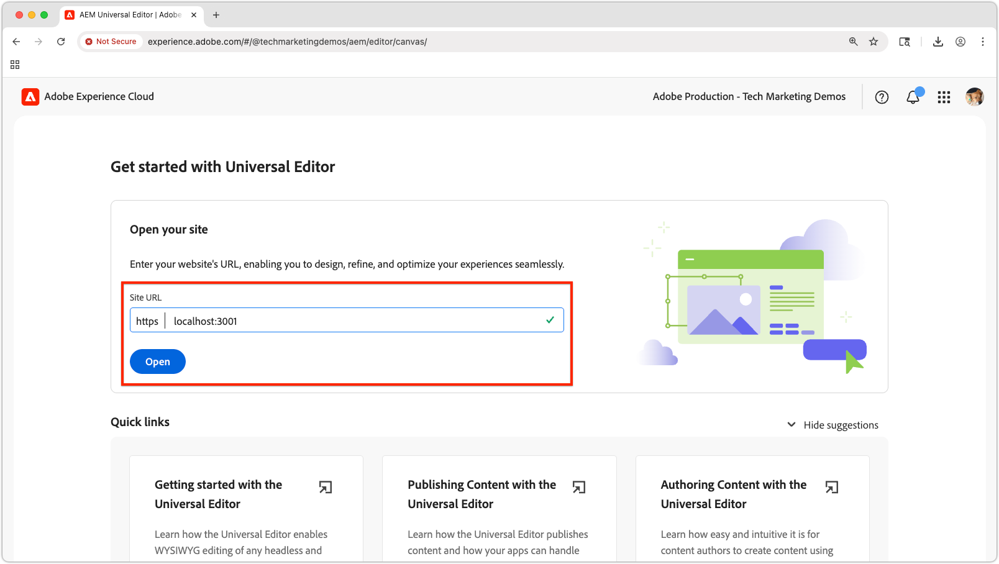

# Hacer que la aplicación de React sea editable con el editor universal

En este capítulo, aprenderá a hacer que la aplicación React creada en el [capítulo anterior](./4-react-app.md) sea editable mediante el Editor universal de AEM. El editor universal permite a los autores de contenido editar contenido directamente en el contexto de la experiencia de la aplicación React, a la vez que mantiene la experiencia perfecta de una aplicación sin encabezado.


El editor universal proporciona una forma eficaz de habilitar la edición en contexto para cualquier aplicación web, lo que permite a los autores editar contenido sin cambiar entre distintas interfaces de creación.

## Requisitos previos

* Se han completado los pasos anteriores de este tutorial, específicamente [Crear una aplicación de React que use las API abiertas de entrega de fragmentos de contenido de AEM](./4-react-app.md)
* Conocimientos prácticos de [cómo usar e implementar el Editor universal](https://experienceleague.adobe.com/es/docs/experience-manager-cloud-service/content/implementing/developing/universal-editor/introduction).

## Objetivos

Obtenga información sobre cómo:

* Añada la instrumentación del Editor universal a la aplicación React.
* Configure la aplicación React para el editor universal.
* Habilite la edición de contenido directamente desde la interfaz de la aplicación React con el Editor universal.

## Instrumentación del editor universal

El editor universal requiere [atributos de HTML y metaetiquetas](https://experienceleague.adobe.com/es/docs/experience-manager-cloud-service/content/implementing/developing/universal-editor/attributes-types) para identificar el contenido editable y establecer la conexión entre la interfaz de usuario y el contenido de AEM.

### Adición de etiquetas de editor universal

En primer lugar, añada las metaetiquetas necesarias para identificar la aplicación React como compatible con el editor universal.

1. Abra `public/index.html` en la aplicación React.
1. Agregue las [metaetiquetas del editor universal y el script CORS](https://experienceleague.adobe.com/en/docs/experience-manager-cloud-service/content/implementing/developing/universal-editor/getting-started) en la sección `<head>` de la aplicación React:

   ```html
   <!DOCTYPE html>
   <html lang="en">
   <head>
       <meta charset="utf-8" />
       <link rel="icon" href="%PUBLIC_URL%/favicon.ico" />
       <meta name="viewport" content="width=device-width, initial-scale=1" />
       <meta name="theme-color" content="#000000" />
       <meta name="description" content="WKND Teams React App" />
   
       <!-- Universal Editor meta tags and CORS script -->
       <meta name="urn:adobe:aue:system:aemconnection" content="aem:%REACT_APP_AEM_AUTHOR_HOST_URI%" />
       <script src="https://universal-editor-service.adobe.io/cors.js"></script>
   
       <link rel="apple-touch-icon" href="%PUBLIC_URL%/logo192.png" />
       <link rel="manifest" href="%PUBLIC_URL%/manifest.json" />
       <title>WKND Teams</title>
   </head>
   <body>
       <noscript>You need to enable JavaScript to run this app.</noscript>
       <div id="root"></div>
   </body>
   </html>
   ```

1. Actualice el archivo `.env` de la aplicación React para incluir el host del servicio de AEM Author para admitir la reescritura en el editor universal (utilizado en el valor de la etiqueta de metadatos `urn:adobe:aue:system:aemconnection`).

   ```bash
   # The AEM Publish (or Preview) service
   REACT_APP_HOST_URI=https://publish-p123-e456.adobeaemcloud.com
   
   # The AEM Author service
   REACT_APP_AEM_AUTHOR_HOST_URI=https://author-p123-e456.adobeaemcloud.com
   ```

### Instrumentar el componente de equipos

Ahora, agregue atributos del editor universal para poder editar el componente Equipos.

1. Abra `src/components/Teams.js`.
1. Actualice el componente `Team` para incluir [atributos de datos del editor universal](https://experienceleague.adobe.com/es/docs/experience-manager-cloud-service/content/implementing/developing/universal-editor/attributes-types):

   Al establecer el atributo `data-aue-resource`, asegúrese de que la ruta de AEM al fragmento de contenido, tal como la devuelve la Entrega de fragmentos de contenido de AEM con API de OpenAPI, se fije con la subruta a la variación del fragmento de contenido; en este caso `/jcr:content/data/master`.

   ```javascript
   import { useEffect, useState } from "react";
   import { Link } from "react-router-dom";
   import "./Teams.scss";
   
   function Teams() {
   
   // The teams folder is the only folder-tree that is allowed to contain Team Content Fragments.
   const TEAMS_FOLDER = '/content/dam/my-project/en/teams';
   
   // State to store the teams data
   const [teams, setTeams] = useState(null);
   
   useEffect(() => {
       /**
       * Fetches all teams and their associated member details
       * This is a two-step process:
       * 1. First, get all team content fragments from the specified folder
       * 2. Then, for each team, fetch the full details including hydrated references to get the team member names
       */
       const fetchData = async () => {
       try {
           // Step 1: Fetch all teams from the teams folder
           const response = await fetch(
           `${process.env.REACT_APP_HOST_URI}/adobe/contentFragments?path=${TEAMS_FOLDER}`
           );
           const allTeams = (await response.json()).items || [];
   
           // Step 2: Fetch detailed information for each team with hydrated references
           const hydratedTeams = [];
           for (const team of allTeams) {
               const hydratedTeamResponse = await fetch(
                   `${process.env.REACT_APP_HOST_URI}/adobe/contentFragments/${team.id}?references=direct-hydrated`
               );
               hydratedTeams.push(await hydratedTeamResponse.json());
           }
   
           setTeams(hydratedTeams);
       } catch (error) {
           console.error("Error fetching content fragments:", error);
       }
       };
   
       fetchData();
   }, [TEAMS_FOLDER]);
   
   // Show loading state while teams data is being fetched
   if (!teams) {
       return <div>Loading teams...</div>;
   }
   
   // Render the teams
   return (
       <div className="teams">
       {teams.map((team, index) => {
           return (
           <Team
               key={index}
               {...team}
           />
           );
       })}
       </div>
   );
   }
   
   /**
   * Team - renders a single team with its details and members
   * @param {Object} fields - The authored Content Fragment fields
   * @param {Object} references - Hydrated references containing member details such as fullName
   * @param {string} path - Path of the team content fragment
   */
   function Team({ fields, references, path }) {
   if (!fields.title || !fields.teamMembers) {
       return null;
   }
   
   return (
       <>
       {/* Specify the correct Content Fragment variation path suffix in the data-aue-resource attribute */}
       <div className="team"
           data-aue-resource={`urn:aemconnection:${path}/jcr:content/data/master`}
           data-aue-type="component"
           data-aue-label={fields.title}>
   
           <h2 className="team__title"
           data-aue-prop="title"
           data-aue-type="text"
           data-aue-label="Team Title">{fields.title}</h2>
           <p className="team__description"
           data-aue-prop="description"
           data-aue-type="richtext"
           data-aue-label="Team Description"
           dangerouslySetInnerHTML={{ __html: fields.description.value }}
           />
           <div>
           <h4 className="team__members-title">Members</h4>
           <ul className="team__members">
               {fields.teamMembers.map((teamMember, index) => {
               return (
                   <li key={index} className="team__member">
                   <Link to={`/person/${teamMember}`}>
                       {references[teamMember].value.fields.fullName}
                   </Link>
                   </li>
               );
               })}
           </ul>
           </div>
       </div>
       </>
   );
   }
   
   export default Teams;
   ```

### Instrumentar el componente de persona

Del mismo modo, agregue atributos del Editor universal al componente Persona.

1. Abra `src/components/Person.js`.
1. Actualice el componente para incluir [atributos de datos del editor universal](https://experienceleague.adobe.com/es/docs/experience-manager-cloud-service/content/implementing/developing/universal-editor/attributes-types):

   Al establecer el atributo `data-aue-resource`, asegúrese de que la ruta de AEM al fragmento de contenido, tal como la devuelve la Entrega de fragmentos de contenido de AEM con API de OpenAPI, se fije con la subruta a la variación del fragmento de contenido; en este caso `/jcr:content/data/master`.

   ```javascript
   import "./Person.scss";
   import { useEffect, useState } from "react";
   import { useParams } from "react-router-dom";
   
   /**
   * Person component - displays detailed information about a single person
   * Fetches person data from AEM using the ID from the URL parameters
   */
   function Person() {
       const { id } = useParams();
       const [person, setPerson] = useState(null);
   
       useEffect(() => {
           const fetchData = async () => {
           try {
               const response = await fetch(
               `${process.env.REACT_APP_HOST_URI}/adobe/contentFragments/${id}?references=direct-hydrated`
               );
               const json = await response.json();
               setPerson(json || null);
           } catch (error) {
               console.error("Error fetching person data:", error);
           }
           };
           fetchData();
       }, [id]);
   
       if (!person) {
           return <div>Loading person...</div>;
       }
   
       /* Add the Universal Editor data-aue-* attirbutes to the rendered HTML */
       return (
           <div className="person"
               data-aue-resource={`urn:aemconnection:${person.path}/jcr:content/data/master`}
               data-aue-type="component"
               data-aue-label={person.fields.fullName}>
               
               <div className="person__occupations">
                   {person.fields.occupation.map((occupation, index) => {
                   return (
                       <span key={index} className="person__occupation">
                           {occupation}
                       </span>
                   );
                   })}
               </div>
   
               <div className="person__content">
                   <h1 className="person__full-name"
                       data-aue-prop="fullName"
                       data-aue-type="text"
                       data-aue-label="Full Name">
                       {person.fields.fullName}
                   </h1>
                   <div className="person__biography"
                       data-aue-prop="biographyText"
                       data-aue-type="richtext"
                       data-aue-label="Biography"
                       dangerouslySetInnerHTML={{ __html: person.fields.biographyText.value }}
                   />
               </div>
           </div>
       );
   }
   ```

### Obtener el código completado

El código fuente completo de este capítulo es [disponible en Github.com](https://github.com/adobe/aem-tutorials/tree/headless_open-api_basic_5-end).


```bash
$ git fetch --tags
$ git tag
$ git checkout tags/headless_open-api_basic_5-end
```

## Probar la integración del editor universal

Ahora pruebe las actualizaciones de compatibilidad del Editor universal abriendo la aplicación React en el Editor universal.

### Inicio de la aplicación React

1. Asegúrese de que la aplicación React se esté ejecutando:

   ```bash
   $ cd ~/Code/aem-guides-wknd-openapi/basic-tutorial
   $ npm install
   $ npm start
   ```

1. Compruebe que la aplicación se carga en `http://localhost:3000` y muestra el contenido de equipos y personas.

### Ejecutar proxy SSL local

El editor universal requiere que la aplicación editable se cargue a través de HTTPS.

1. Para ejecutar la aplicación React local en HTTPS, use el módulo [local-ssl-proxy](https://www.npmjs.com/package/local-ssl-proxy) npm desde la línea de comandos.

   ```bash
   $ npm install -g local-ssl-proxy
   $ local-ssl-proxy --source 3001 --target 3000
   ```

1. Abra `https://localhost:3001` en su explorador web
1. Acepte el certificado autofirmado.
1. Compruebe que la aplicación React se carga.

### Abrir en el editor universal



1. Vaya a [Editor universal](https://experience.adobe.com/#/@myOrg/aem/editor/canvas/).
1. En el campo **URL del sitio**, introduzca la URL de la aplicación HTTPS React: `https://localhost:3001`.
1. Seleccione Click **Open**.

El editor universal debe cargar la aplicación React con las funciones de edición habilitadas.

### Probar la funcionalidad de edición


1. En el Editor universal, pase el ratón sobre los elementos editables de la aplicación React.

1. Para navegar dentro de la aplicación React, activa y desactiva el modo **Vista previa** de nuevo para editar. Recuerde, la **vista previa** no tiene nada que ver con el servicio de vista previa de AEM, sino que activa y desactiva la opción Editar Chrome en el Editor universal.

1. Debería ver los indicadores de edición y poder hacer clic en los distintos elementos editables de la aplicación React.

1. Intente editar el título de un equipo:
   * Haga clic en el título de un equipo
   * Editar el texto en el panel de propiedades
   * Guarde los cambios

1. Intente editar la imagen de perfil de una persona:
   * Hacer clic en la imagen de perfil de una persona
   * Seleccione una nueva imagen del selector de recursos
   * Guarde los cambios

1. Pulse **Publicar** en la parte superior derecha del Editor universal para publicar ediciones en el servicio de publicación (o vista previa) de AEM, de modo que se reflejen en la aplicación React del Editor universal.

## Atributos de datos del Editor universal

Para obtener documentación completa sobre cómo instrumentar una aplicación para el editor universal, consulte la [documentación del editor universal](https://experience.adobe.com/#/@myOrg/aem/editor/canvas/).

## Enhorabuena.

¡Enhorabuena! Se ha integrado correctamente el editor universal con la aplicación React. Los autores de contenido ahora pueden editar fragmentos de contenido directamente desde la interfaz de la aplicación React, lo que ofrece una experiencia de creación perfecta y, al mismo tiempo, mantiene las ventajas de una arquitectura sin encabezado.

Recuerde, siempre puede obtener el código fuente final para este tutorial desde la rama `main` del [repositorio GitHub.com](https://github.com/adobe/aem-tutorials/tree/main).
