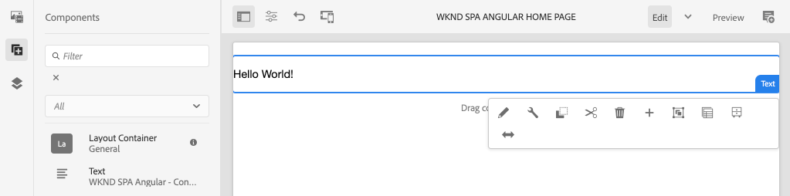

# SPA Proyecto de editor de {#create-project}

Aprenda a utilizar un proyecto Maven de Adobe Experience Manager AEM () como punto de partida para una aplicación de Angular AEM SPA integrada con el Editor de.

## Objetivo

1. AEM SPA Comprender la estructura de un nuevo proyecto de Editor de de trabajo creado a partir de un arquetipo de Maven.
2. AEM Implemente el proyecto de inicio en una instancia local de.

## Qué va a generar

AEM En este capítulo, se implementa un nuevo proyecto de basado en el [AEM Tipo de archivo del proyecto](https://github.com/adobe/aem-project-archetype). AEM El proyecto de la se arranca con un punto de partida muy sencillo para el Angular SPA de la. SPA El proyecto utilizado en este capítulo servirá de base para la implementación del WKND, sobre el que se elaborará un proyecto en los capítulos futuros. El proyecto se desarrollará en el marco de la aplicación del WKND en el futuro.



*Un mensaje clásico de Hello World.*

## Requisitos previos

Revise las herramientas y las instrucciones necesarias para configurar una [entorno de desarrollo local](overview.md#local-dev-environment). Asegúrese de que una nueva instancia de Adobe Experience Manager, iniciada en **autor** , se está ejecutando localmente.

## Obtención del proyecto

AEM Existen varias opciones para crear un proyecto de módulo múltiple de Maven para su. Este tutorial ha utilizado la última versión [AEM Tipo de archivo del proyecto](https://github.com/adobe/aem-project-archetype) como base para el código de tutorial de. AEM Se han realizado modificaciones en el código del proyecto para que sea compatible con varias versiones de los programas de trabajo de la. Consulte las [la nota sobre la compatibilidad con versiones anteriores](overview.md#compatibility).

>[!CAUTION]
>
>Se recomienda utilizar la variable **última versión** versión de [arquetipo](https://github.com/adobe/aem-project-archetype) para generar un nuevo proyecto para una implementación real. AEM AEM Los proyectos de deben dirigirse a una sola versión de la aplicación de la que se utilice la variable `aemVersion` propiedad del tipo de archivo.

1. Descargue el punto de partida para este tutorial mediante Git:

   ```shell
   $ git clone git@github.com:adobe/aem-guides-wknd-spa.git
   $ cd aem-guides-wknd-spa
   $ git checkout Angular/create-project-start
   ```

2. AEM La siguiente estructura de carpetas y archivos representa el proyecto de generado por el arquetipo de Maven en el sistema de archivos local:

   ```plain
   |--- aem-guides-wknd-spa
       |--- all/
       |--- core/
       |--- dispatcher/
       |--- ui.apps/
       |--- ui.apps.structure/
       |--- ui.content/
       |--- ui.frontend /
       |--- it.tests/
       |--- pom.xml
       |--- README.md
       |--- .gitignore
       |--- archetype.properties
   ```

3. AEM Se utilizaron las siguientes propiedades al generar el proyecto de a partir de [AEM Arquetipo de proyecto](https://github.com/Adobe-Marketing-Cloud/aem-project-archetype/releases/tag/aem-project-archetype-14):

   | Propiedad | Valor |
   |-----------------|---------------------------------------|
   | aemVersion | nube |
   | appTitle | SPA ANGULAR DE WKND |
   | appId | wknd-spa-angular |
   | groupId | com.adobe.aem.guides |
   | frontendModule | angular |
   | paquete | com.adobe.aem.guides.wknd.spa.angular |
   | includeExamples | n |

   >[!NOTE]
   >
   > Observe el `frontendModule=angular` propiedad. AEM Esto indica al tipo de archivo del proyecto de la que arranque el proyecto con un iniciador [base de código de angular](https://experienceleague.adobe.com/docs/experience-manager-core-components/using/developing/archetype/uifrontend-angular.html) AEM SPA para usar con el Editor de la.

## Creación del proyecto

AEM A continuación, compile, genere e implemente el código del proyecto en una instancia local de mediante Maven.

1. AEM Asegúrese de que una instancia de la se esté ejecutando localmente en el puerto **4502**.
2. Desde el terminal de la línea de comandos, compruebe que Maven está instalado:

   ```shell
   $ mvn --version
   Apache Maven 3.6.2
   Maven home: /Library/apache-maven-3.6.2
   Java version: 11.0.4, vendor: Oracle Corporation, runtime: /Library/Java/JavaVirtualMachines/jdk-11.0.4.jdk/Contents/Home
   ```

3. Ejecute el siguiente comando Maven desde el `aem-guides-wknd-spa` AEM para generar e implementar el proyecto en el que se va a realizar la:

   ```shell
   $ mvn -PautoInstallSinglePackage clean install
   ```

   Si se usa [AEM.x](overview.md#compatibility):

   ```shell
   $ mvn clean install -PautoInstallSinglePackage -Pclassic
   ```

   AEM Los múltiples módulos del proyecto deben ser compilados e implementados para su implementación en los distintos entornos de trabajo del proyecto de la comunidad de trabajo de la comunidad de.

   ```plain
   [INFO] ------------------------------------------------------------------------
   [INFO] Reactor Summary for wknd-spa-angular 1.0.0-SNAPSHOT:
   [INFO] 
   [INFO] wknd-spa-angular ................................... SUCCESS [  0.473 s]
   [INFO] WKND SPA Angular - Core ............................ SUCCESS [ 54.866 s]
   [INFO] wknd-spa-angular.ui.frontend - UI Frontend ......... SUCCESS [02:10 min]
   [INFO] WKND SPA Angular - Repository Structure Package .... SUCCESS [  0.694 s]
   [INFO] WKND SPA Angular - UI apps ......................... SUCCESS [  6.351 s]
   [INFO] WKND SPA Angular - UI content ...................... SUCCESS [  2.885 s]
   [INFO] WKND SPA Angular - All ............................. SUCCESS [  1.736 s]
   [INFO] WKND SPA Angular - Integration Tests Bundles ....... SUCCESS [  2.563 s]
   [INFO] WKND SPA Angular - Integration Tests Launcher ...... SUCCESS [  1.846 s]
   [INFO] WKND SPA Angular - Dispatcher ...................... SUCCESS [  0.270 s]
   [INFO] ------------------------------------------------------------------------
   [INFO] BUILD SUCCESS
   [INFO] ------------------------------------------------------------------------
   ```

   El perfil de Maven ***autoInstallSinglePackage*** AEM compila los módulos individuales del proyecto e implementa un paquete único en la instancia de la instancia de la. AEM De forma predeterminada, este paquete se implementa en una instancia de que se ejecuta localmente en el puerto **4502** y con las credenciales de **admin:admin**.

4. Vaya a **[!UICONTROL Administrador de paquetes]** AEM en la instancia local de la: [http://localhost:4502/crx/packmgr/index.jsp](http://localhost:4502/crx/packmgr/index.jsp).

5. Debería ver tres paquetes para `wknd-spa-angular.all`, `wknd-spa-angular.ui.apps` y `wknd-spa-angular.ui.content`.

   

   AEM Todo el código personalizado necesario para el proyecto se incluye en estos paquetes y se instala en el tiempo de ejecución de la.

6. También debería ver varios paquetes de `spa.project.core` y `core.wcm.components`. Son dependencias incluidas automáticamente por el tipo de archivo. Más información sobre [AEM Los componentes principales se pueden encontrar aquí](https://experienceleague.adobe.com/docs/experience-manager-core-components/using/introduction.html?lang=es).

## Contenido del autor

SPA A continuación, abra el código de inicio que generó el tipo de archivo y actualice parte del contenido.

1. Vaya a **[!UICONTROL Sites]** consola: [http://localhost:4502/sites.html/content](http://localhost:4502/sites.html/content).

   SPA El WKND incluye una estructura básica del sitio con un país, un idioma y una página de inicio. Esta jerarquía se basa en los valores predeterminados del tipo de archivo para `language_country` y `isSingleCountryWebsite`. Estos valores se pueden sobrescribir actualizando el [propiedades disponibles](https://github.com/adobe/aem-project-archetype#available-properties) al generar un proyecto.

2. Abra el **[!DNL us]** > **[!DNL en]** > **[!DNL WKND SPA Angular Home Page]** página seleccionando la página y haciendo clic en el botón **[!UICONTROL Editar]** en la barra de menús:

   

3. A **[!UICONTROL Texto]** ya se ha añadido el componente a la página. AEM Puede editar este componente como cualquier otro componente de la lista de componentes de la lista de componentes

   

4. Añadir un adicional **[!UICONTROL Texto]** a la página.

   Tenga en cuenta que la experiencia de creación es similar a la de una página de AEM Sites tradicional. Actualmente hay un número limitado de componentes disponibles para su uso. Se agregarán más en el curso del tutorial.

## Inspect la aplicación de una sola página

A continuación, compruebe que se trata de una aplicación de una sola página con el uso de las herramientas para desarrolladores del explorador.

1. En el **[!UICONTROL Editor de página]**, haga clic en **[!UICONTROL Información de página]** menú > **[!UICONTROL Ver como aparece publicado]**:

   

   Se abrirá una nueva pestaña con el parámetro de consulta `?wcmmode=disabled` AEM que desactiva de forma efectiva el editor de: [http://localhost:4502/content/wknd-spa-angular/us/en/home.html?wcmmode=disabled](http://localhost:4502/content/wknd-spa-angular/us/en/home.html?wcmmode=disabled)

2. Vea el origen de la página y observe que el contenido de texto **[!DNL Hello World]** o cualquier otro contenido no se encuentra. En su lugar, debería ver un HTML como el siguiente:

   ```html
   ...
   <body>
       <noscript>You need to enable JavaScript to run this app.</noscript>
       <div id="spa-root"></div>
       <script type="text/javascript" src="/etc.clientlibs/wknd-spa-angular/clientlibs/clientlib-angular.min.js"></script>
       ...
   </body>
   ...
   ```

   `clientlib-angular.min.js` es el Angular SPA que se carga en la página y que se encarga de procesar el contenido.

   *¿De dónde proviene el contenido?*

3. Vuelva a la pestaña: [http://localhost:4502/content/wknd-spa-angular/us/en/home.html?wcmmode=disabled](http://localhost:4502/content/wknd-spa-angular/us/en/home.html?wcmmode=disabled)
4. Abra las herramientas para desarrolladores del explorador e inspeccione el tráfico de red de la página durante una actualización. Ver el **XHR** solicita:

   

   Debe haber una solicitud a [http://localhost:4502/content/wknd-spa-angular/us/en.model.json](http://localhost:4502/content/wknd-spa-angular/us/en.model.json). SPA Contiene todo el contenido, con formato JSON, que impulsará la creación de la.

5. En una pestaña nueva, abra [http://localhost:4502/content/wknd-spa-angular/us/en.model.json](http://localhost:4502/content/wknd-spa-angular/us/en.model.json)

   La solicitud `en.model.json` representa el modelo de contenido que dirigirá la aplicación. Inspect utiliza la salida JSON y debería poder encontrar el fragmento que representa el **[!UICONTROL Texto]** componente(s).

   ```json
   ...
   ":items": {
       "text": {
           "text": "<p>Hello World! Updated content!</p>\r\n",
           "richText": true,
           ":type": "wknd-spa-angular/components/text"
       },
       "text_98796435": {
           "text": "<p>A new text component.</p>\r\n",
           "richText": true,
           ":type": "wknd-spa-angular/components/text"
   },
   ...
   ```

   AEM SPA AEM SPA En el siguiente capítulo analizaremos cómo se asigna el contenido JSON de los componentes de la a los componentes de la para formar la base de la experiencia del editor de la.

   >[!NOTE]
   >
   > Puede resultar útil instalar una extensión de explorador para dar formato automáticamente a la salida JSON.

## Enhorabuena. {#congratulations}

AEM SPA Enhorabuena, acaba de crear su primer proyecto de editor de.

Ahora mismo es bastante simple, pero en los próximos capítulos se agrega más funcionalidad.

### Siguientes pasos {#next-steps}

[SPA Integración de la](integrate-spa.md) SPA AEM SPA - Aprenda cómo se integra el código fuente de la con el Proyecto de la y comprenda las herramientas disponibles para desarrollar rápidamente el.
