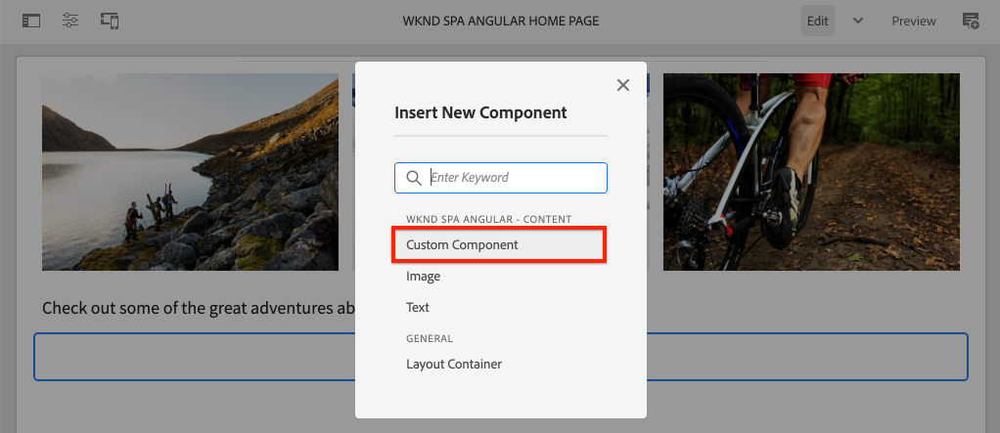

# Crear un componente personalizado {#custom-component}

AEM SPA Obtenga información sobre cómo crear un componente personalizado para utilizarlo con el Editor de. Aprenda a desarrollar cuadros de diálogo de autor y modelos Sling para ampliar el modelo JSON y rellenar un componente personalizado.

## Objetivo

1. AEM Comprenda el papel de los modelos Sling en la manipulación de la API del modelo JSON proporcionada por los usuarios de la interfaz de usuario de.
2. AEM Obtenga información sobre cómo crear cuadros de diálogo de componentes de.
3. Aprenda a crear una **personalizado** AEM SPA Componente que es compatible con el marco de trabajo del editor de.

## Qué va a generar

SPA En capítulos anteriores se centró la atención en el desarrollo de componentes de la y su asignación a *existente* AEM Componentes principales Este capítulo se centra en cómo crear y ampliar *nuevo* AEM AEM Los componentes de y manipular el modelo JSON servido por los usuarios de.

Un sencillo `Custom Component` AEM ilustra los pasos necesarios para crear un componente de red de nueva.


## Requisitos previos

Revise las herramientas y las instrucciones necesarias para configurar una [entorno de desarrollo local](overview.md#local-dev-environment).

### Obtener el código

1. Descargue el punto de partida para este tutorial mediante Git:

   ```shell
   $ git clone git@github.com:adobe/aem-guides-wknd-spa.git
   $ cd aem-guides-wknd-spa
   $ git checkout Angular/custom-component-start
   ```

2. AEM Implemente el código base en una instancia de local mediante Maven:

   ```shell
   $ mvn clean install -PautoInstallSinglePackage
   ```

   Si se usa [AEM.x](overview.md#compatibility) añada el `classic` perfil:

   ```shell
   $ mvn clean install -PautoInstallSinglePackage -Pclassic
   ```

3. Instale el paquete terminado para el tradicional [Sitio de referencia de WKND](https://github.com/adobe/aem-guides-wknd/releases/latest). Las imágenes proporcionadas por [Sitio de referencia de WKND](https://github.com/adobe/aem-guides-wknd/releases/latest) SPA se reutilizan en el WKND de la. El paquete se puede instalar utilizando [AEM Administrador de paquetes](http://localhost:4502/crx/packmgr/index.jsp).

   

Siempre puede ver el código terminado en [GitHub](https://github.com/adobe/aem-guides-wknd-spa/tree/Angular/custom-component-solution) o compruebe el código localmente cambiando a la rama `Angular/custom-component-solution`.

## AEM Definición del componente de

AEM Un componente se define como un nodo y propiedades. En el proyecto, estos nodos y propiedades se representan como archivos XML en el `ui.apps` módulo. AEM A continuación, cree el componente de en `ui.apps` módulo.

>[!NOTE]
>
> Un breve repaso de la [AEM puede ser útil conocer los conceptos básicos de los componentes de](https://experienceleague.adobe.com/docs/experience-manager-learn/getting-started-wknd-tutorial-develop/project-archetype/component-basics.html).

1. Abra el `ui.apps` en el IDE que elija.
2. Vaya a `ui.apps/src/main/content/jcr_root/apps/wknd-spa-angular/components` y cree una carpeta denominada `custom-component`.
3. Cree un archivo llamado `.content.xml` debajo de `custom-component` carpeta. Rellene el `custom-component/.content.xml` con lo siguiente:

   ```xml
   <?xml version="1.0" encoding="UTF-8"?>
   <jcr:root xmlns:sling="http://sling.apache.org/jcr/sling/1.0" xmlns:cq="http://www.day.com/jcr/cq/1.0" xmlns:jcr="http://www.jcp.org/jcr/1.0"
       jcr:primaryType="cq:Component"
       jcr:title="Custom Component"
       componentGroup="WKND SPA Angular - Content"/>
   ```

   

   `jcr:primaryType="cq:Component"` AEM : identifica que este nodo es un componente de la.

   `jcr:title` es el valor que se muestra a los autores de contenido y la variable `componentGroup` determina la agrupación de componentes en la interfaz de usuario de creación.

4. Debajo del `custom-component` carpeta, cree otra carpeta llamada `_cq_dialog`.
5. Debajo del `_cq_dialog` carpeta cree un archivo llamado `.content.xml` y rellénelo con lo siguiente:

   ```xml
   <?xml version="1.0" encoding="UTF-8"?>
   <jcr:root xmlns:sling="http://sling.apache.org/jcr/sling/1.0" xmlns:granite="http://www.adobe.com/jcr/granite/1.0" xmlns:cq="http://www.day.com/jcr/cq/1.0" xmlns:jcr="http://www.jcp.org/jcr/1.0" xmlns:nt="http://www.jcp.org/jcr/nt/1.0"
       jcr:primaryType="nt:unstructured"
       jcr:title="Custom Component"
       sling:resourceType="cq/gui/components/authoring/dialog">
       <content
           jcr:primaryType="nt:unstructured"
           sling:resourceType="granite/ui/components/coral/foundation/container">
           <items jcr:primaryType="nt:unstructured">
               <tabs
                   jcr:primaryType="nt:unstructured"
                   sling:resourceType="granite/ui/components/coral/foundation/tabs"
                   maximized="{Boolean}true">
                   <items jcr:primaryType="nt:unstructured">
                       <properties
                           jcr:primaryType="nt:unstructured"
                           jcr:title="Properties"
                           sling:resourceType="granite/ui/components/coral/foundation/container"
                           margin="{Boolean}true">
                           <items jcr:primaryType="nt:unstructured">
                               <columns
                                   jcr:primaryType="nt:unstructured"
                                   sling:resourceType="granite/ui/components/coral/foundation/fixedcolumns"
                                   margin="{Boolean}true">
                                   <items jcr:primaryType="nt:unstructured">
                                       <column
                                           jcr:primaryType="nt:unstructured"
                                           sling:resourceType="granite/ui/components/coral/foundation/container">
                                           <items jcr:primaryType="nt:unstructured">
                                               <message
                                                   jcr:primaryType="nt:unstructured"
                                                   sling:resourceType="granite/ui/components/coral/foundation/form/textfield"
                                                   fieldDescription="The text to display on the component."
                                                   fieldLabel="Message"
                                                   name="./message"/>
                                           </items>
                                       </column>
                                   </items>
                               </columns>
                           </items>
                       </properties>
                   </items>
               </tabs>
           </items>
       </content>
   </jcr:root>
   ```

   

   El archivo XML anterior genera un cuadro de diálogo sencillo para la variable `Custom Component`. La parte crítica del archivo es la parte interna `<message>` nodo. Este cuadro de diálogo contiene un `textfield` nombrado `Message` y mantiene el valor del campo de texto en una propiedad denominada `message`.

   Se crea un modelo Sling junto a para exponer el valor de la variable `message` a través del modelo JSON.

   >[!NOTE]
   >
   > Puede ver muchas más [ejemplos de cuadros de diálogo viendo las definiciones de componentes principales](https://github.com/adobe/aem-core-wcm-components/tree/master/content/src/content/jcr_root/apps/core/wcm/components). También puede ver campos de formulario adicionales, como `select`, `textarea`, `pathfield`, disponible debajo de `/libs/granite/ui/components/coral/foundation/form` in [CRXDE-Lite](http://localhost:4502/crx/de/index.jsp#/libs/granite/ui/components/coral/foundation/form).

   AEM Con un componente tradicional de la, un [HTL](https://experienceleague.adobe.com/docs/experience-manager-htl/content/overview.html?lang=es) normalmente se requiere un script. SPA Dado que el procesa el componente, no se necesita ningún script HTL.

## Creación del modelo Sling

Los modelos Sling son objetos Java™ &quot;POJO&quot; (Plain Old Java™ Objects) impulsados por anotaciones que facilitan la asignación de datos de las variables JCR a Java™. [Modelos Sling](https://experienceleague.adobe.com/docs/experience-manager-learn/getting-started-wknd-tutorial-develop/project-archetype/component-basics.html#sling-models) AEM Normalmente funcionan para encapsular lógica empresarial compleja del lado del servidor para componentes de la.

SPA En el contexto del Editor de, los modelos Sling exponen el contenido de un componente a través del modelo JSON a través de una función que utiliza [Exportador del modelo Sling](https://experienceleague.adobe.com/docs/experience-manager-learn/foundation/development/develop-sling-model-exporter.html?lang=es).

1. En el IDE de su elección, abra `core` módulo. `CustomComponent.java` y `CustomComponentImpl.java` ya se han creado y tachado como parte del código de inicio del capítulo.

   >[!NOTE]
   >
   > Si utiliza el IDE de código de Visual Studio, puede resultar útil instalar [extensiones para Java™](https://code.visualstudio.com/docs/java/extensions).

2. Abra la interfaz de Java™. `CustomComponent.java` en `core/src/main/java/com/adobe/aem/guides/wknd/spa/angular/core/models/CustomComponent.java`:

   

   Esta es la interfaz Java™ que implementa el modelo Sling.

3. Actualizar `CustomComponent.java` para que amplíe el `ComponentExporter` interfaz:

   ```java
   package com.adobe.aem.guides.wknd.spa.angular.core.models;
   import com.adobe.cq.export.json.ComponentExporter;
   
   public interface CustomComponent extends ComponentExporter {
   
       public String getMessage();
   
   }
   ```

   Implementación de `ComponentExporter` es un requisito para que la API del modelo JSON recoja automáticamente el modelo Sling.

   El `CustomComponent` La interfaz de incluye un único método de captador `getMessage()`. Este es el método que expone el valor del cuadro de diálogo de autor a través del modelo JSON. Solo métodos de captador con parámetros vacíos `()` se exportan en el modelo JSON.

4. Abrir `CustomComponentImpl.java` en `core/src/main/java/com/adobe/aem/guides/wknd/spa/angular/core/models/impl/CustomComponentImpl.java`.

   Esta es la implementación de la `CustomComponent` interfaz. El `@Model` Esta anotación identifica la clase Java™ como un modelo Sling. El `@Exporter` La anotación permite serializar y exportar la clase Java™ a través del Exportador de modelos Sling.

5. Actualizar la variable estática `RESOURCE_TYPE` AEM para apuntar al componente de la `wknd-spa-angular/components/custom-component` creado en el ejercicio anterior.

   ```java
   static final String RESOURCE_TYPE = "wknd-spa-angular/components/custom-component";
   ```

   AEM El tipo de recurso del componente es el que enlaza el modelo Sling al componente de y, en última instancia, se asigna al componente de Angular.

6. Añada el `getExportedType()` para el `CustomComponentImpl` para devolver el tipo de recurso de componente:

   ```java
   @Override
   public String getExportedType() {
       return CustomComponentImpl.RESOURCE_TYPE;
   }
   ```

   Este método es necesario al implementar el `ComponentExporter` y expone el tipo de recurso que permite la asignación al componente de Angular.

7. Actualice el `getMessage()` para devolver el valor del método `message` propiedad mantenida por el cuadro de diálogo de autor. Utilice el `@ValueMap` La anotación se asigna al valor JCR. `message` a una variable Java™:

   ```java
   import org.apache.commons.lang3.StringUtils;
   ...
   
   @ValueMapValue
   private String message;
   
   @Override
   public String getMessage() {
       return StringUtils.isNotBlank(message) ? message.toUpperCase() : null;
   }
   ```

   Se agrega alguna &quot;lógica empresarial&quot; adicional para devolver el valor del mensaje como mayúsculas. Esto nos permite ver la diferencia entre el valor sin procesar almacenado por el cuadro de diálogo del autor y el valor expuesto por el modelo Sling.

   >[!NOTE]
   >
   Puede ver el [ha finalizado CustomComponentImpl.java aquí](https://github.com/adobe/aem-guides-wknd-spa/blob/Angular/custom-component-solution/core/src/main/java/com/adobe/aem/guides/wknd/spa/angular/core/models/impl/CustomComponentImpl.java).

## Actualización del componente Angular

Ya se ha creado el código de Angular del componente personalizado. A continuación, realice algunas actualizaciones para asignar el componente de Angular AEM al componente de.

1. En el `ui.frontend` módulo abra el archivo `ui.frontend/src/app/components/custom/custom.component.ts`
2. Observe el `@Input() message: string;` línea. Se espera que el valor en mayúsculas transformado se asigne a esta variable.
3. Importe el `MapTo` AEM SPA AEM del SDK de JS de Editor de de datos y utilizarlo para asignarlo al componente de:

   ```diff
   + import {MapTo} from '@adobe/cq-angular-editable-components';
   
    ...
    export class CustomComponent implements OnInit {
        ...
    }
   
   + MapTo('wknd-spa-angular/components/custom-component')(CustomComponent, CustomEditConfig);
   ```

4. Abrir `cutom.component.html` y observe que el valor de `{{message}}` se muestra en el lado y `<h2>` etiqueta.
5. Abrir `custom.component.css` y agregue la regla siguiente:

   ```css
   :host-context {
       display: block;
   }
   ```

   AEM Para que el marcador de posición del Editor de se muestre correctamente cuando el componente esté vacío, `:host-context` u otro `<div>` debe establecerse en `display: block;`.

6. AEM Implemente las actualizaciones en un entorno de trabajo local desde la raíz del directorio del proyecto con sus habilidades con Maven:

   ```shell
   $ cd aem-guides-wknd-spa
   $ mvn clean install -PautoInstallSinglePackage
   ```

## Actualizar la directiva de plantilla

AEM A continuación, vaya a la página de ayuda de para comprobar las actualizaciones y permitir que el usuario seleccione `Custom Component` SPA que se agregarán a la.

1. Compruebe el registro del nuevo modelo Sling navegando hasta [http://localhost:4502/system/console/status-slingmodels](http://localhost:4502/system/console/status-slingmodels).

   ```plain
   com.adobe.aem.guides.wknd.spa.angular.core.models.impl.CustomComponentImpl - wknd-spa-angular/components/custom-component
   
   com.adobe.aem.guides.wknd.spa.angular.core.models.impl.CustomComponentImpl exports 'wknd-spa-angular/components/custom-component' with selector 'model' and extension '[Ljava.lang.String;@6fb4a693' with exporter 'jackson'
   ```

   Debería ver las dos líneas anteriores que indican lo siguiente `CustomComponentImpl` está asociado con el `wknd-spa-angular/components/custom-component` y que está registrado a través del Exportador de modelos Sling.

2. SPA Navegue hasta la plantilla de página de la página de en [http://localhost:4502/editor.html/conf/wknd-spa-angular/settings/wcm/templates/spa-page-template/structure.html](http://localhost:4502/editor.html/conf/wknd-spa-angular/settings/wcm/templates/spa-page-template/structure.html).
3. Actualice la directiva del contenedor de diseño para agregar el nuevo `Custom Component` como componente permitido:

   

   Guarde los cambios en la directiva y observe las `Custom Component` como componente permitido:

   

## Crear el componente personalizado

A continuación, cree el `Custom Component` AEM SPA Uso del Editor de la.

1. Vaya a [http://localhost:4502/editor.html/content/wknd-spa-angular/us/en/home.html](http://localhost:4502/editor.html/content/wknd-spa-angular/us/en/home.html).
2. Entrada `Edit` modo, añada el `Custom Component` a la `Layout Container`:

   

3. Abra el cuadro de diálogo del componente e introduzca un mensaje que contenga letras minúsculas.

   

   Este es el cuadro de diálogo que se creó en función del archivo XML anteriormente en el capítulo.

4. Guarde los cambios. Observe que el mensaje que se muestra está en mayúsculas.

   

5. Vea el modelo JSON navegando hasta [http://localhost:4502/content/wknd-spa-angular/us/en.model.json](http://localhost:4502/content/wknd-spa-angular/us/en.model.json). Buscar por `wknd-spa-angular/components/custom-component`:

   ```json
   "custom_component_208183317": {
       "message": "HELLO WORLD",
       ":type": "wknd-spa-angular/components/custom-component"
   }
   ```

   Observe que el valor JSON se establece en mayúsculas en función de la lógica agregada al modelo Sling.

## Enhorabuena. {#congratulations}

AEM ¡Enhorabuena! Ha aprendido a crear un componente de personalizado y cómo los modelos Sling y los cuadros de diálogo funcionan con el modelo JSON.

Siempre puede ver el código terminado en [GitHub](https://github.com/adobe/aem-guides-wknd-spa/tree/Angular/custom-component-solution) o compruebe el código localmente cambiando a la rama `Angular/custom-component-solution`.

### Pasos siguientes {#next-steps}

[Ampliación de un componente principal](extend-component.md) AEM SPA : Aprenda a ampliar un componente principal existente para utilizarlo con el Editor de componentes de la. AEM SPA Comprender cómo añadir propiedades y contenido a un componente existente es una técnica potente para ampliar las capacidades de una implementación de Editor de segmentos de tiempo de ejecución de la aplicación de un editor de segmentos de tiempo de ejecución de la aplicación de un editor de tiempo de ejecución de la.
