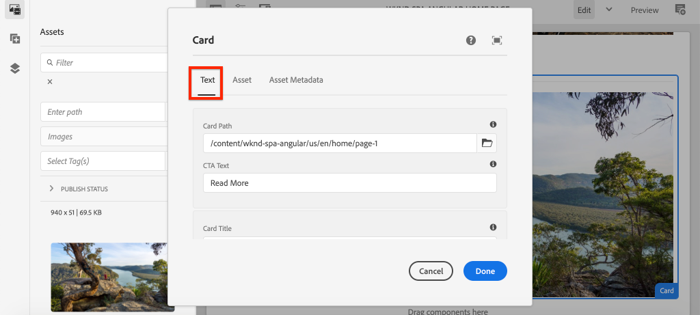

# Ampliación de un componente principal {#extend-component}

{{spa-editor-deprecation}}

Obtenga información sobre cómo ampliar un componente principal existente para utilizarlo con AEM SPA Editor. Comprender cómo ampliar un componente existente es una técnica potente para personalizar y ampliar las capacidades de una implementación de AEM SPA Editor.

## Objetivo

1. Ampliar un componente principal existente con propiedades y contenido adicionales.
2. Comprenda los conceptos básicos de la herencia de componentes con el uso de `sling:resourceSuperType`.
3. Aprenda a utilizar el [Patrón de delegación](https://github.com/adobe/aem-core-wcm-components/wiki/Delegation-Pattern-for-Sling-Models) para modelos Sling a fin de reutilizar la lógica y la funcionalidad existentes.

## Qué va a generar

En este capítulo, se crea un nuevo componente `Card`. El componente `Card` amplía el [componente principal de imagen](https://experienceleague.adobe.com/docs/experience-manager-core-components/using/components/image.html?lang=es) al agregar campos de contenido adicionales como un título y un botón de Call to action para desempeñar la función de teaser de otro contenido dentro de la SPA.


>[!NOTE]
>
> En una implementación real, puede ser más apropiado usar simplemente el [componente teaser](https://experienceleague.adobe.com/docs/experience-manager-core-components/using/components/teaser.html) que ampliar el [componente principal de imagen](https://experienceleague.adobe.com/docs/experience-manager-core-components/using/components/image.html?lang=es) para hacer un componente `Card` según los requisitos del proyecto. Siempre se recomienda usar [Componentes principales](https://experienceleague.adobe.com/docs/experience-manager-core-components/using/introduction.html?lang=es) directamente cuando sea posible.

## Requisitos previos

Revise las herramientas y las instrucciones necesarias para configurar un [entorno de desarrollo local](overview.md#local-dev-environment).

### Obtener el código

1. Descargue el punto de partida para este tutorial mediante Git:

   ```shell
   $ git clone git@github.com:adobe/aem-guides-wknd-spa.git
   $ cd aem-guides-wknd-spa
   $ git checkout Angular/extend-component-start
   ```

2. Implemente el código base en una instancia local de AEM mediante Maven:

   ```shell
   $ mvn clean install -PautoInstallSinglePackage
   ```

   Si usa [AEM 6.x](overview.md#compatibility), agregue el perfil `classic`:

   ```shell
   $ mvn clean install -PautoInstallSinglePackage -Pclassic
   ```

3. Instale el paquete terminado para el [sitio de referencia WKND](https://github.com/adobe/aem-guides-wknd/releases/tag/aem-guides-wknd-2.1.0) tradicional. Las imágenes proporcionadas por [sitio de referencia WKND](https://github.com/adobe/aem-guides-wknd/releases/latest) se vuelven a utilizar en el SPA de WKND. El paquete se puede instalar usando [Administrador de paquetes de AEM](http://localhost:4502/crx/packmgr/index.jsp).

   

Siempre puede ver el código terminado en [GitHub](https://github.com/adobe/aem-guides-wknd-spa/tree/Angular/extend-component-solution) o desprotegerlo localmente cambiando a la rama `Angular/extend-component-solution`.

## Inspeccionar la implementación inicial de la tarjeta

El código de inicio del capítulo ha proporcionado un componente de tarjeta inicial. Inspeccione el punto de partida para la implementación de la tarjeta.

1. En el IDE de su elección, abra el módulo `ui.apps`.
2. Vaya a `ui.apps/src/main/content/jcr_root/apps/wknd-spa-angular/components/card` y vea el archivo `.content.xml`.

   

   ```xml
   <?xml version="1.0" encoding="UTF-8"?>
   <jcr:root xmlns:sling="http://sling.apache.org/jcr/sling/1.0" xmlns:cq="http://www.day.com/jcr/cq/1.0" xmlns:jcr="http://www.jcp.org/jcr/1.0"
       jcr:primaryType="cq:Component"
       jcr:title="Card"
       sling:resourceSuperType="wknd-spa-angular/components/image"
       componentGroup="WKND SPA Angular - Content"/>
   ```

   La propiedad `sling:resourceSuperType` señala a `wknd-spa-angular/components/image`, lo que indica que el componente `Card` hereda la funcionalidad del componente de imagen de SPA de WKND.

3. Inspeccione el archivo `ui.apps/src/main/content/jcr_root/apps/wknd-spa-angular/components/image/.content.xml`:

   ```xml
   <?xml version="1.0" encoding="UTF-8"?>
   <jcr:root xmlns:sling="http://sling.apache.org/jcr/sling/1.0" xmlns:cq="http://www.day.com/jcr/cq/1.0" xmlns:jcr="http://www.jcp.org/jcr/1.0"
       jcr:primaryType="cq:Component"
       jcr:title="Image"
       sling:resourceSuperType="core/wcm/components/image/v2/image"
       componentGroup="WKND SPA Angular - Content"/>
   ```

   Observe que `sling:resourceSuperType` señala a `core/wcm/components/image/v2/image`. Esto indica que el componente de imagen de SPA de WKND hereda la funcionalidad de la imagen del componente principal.

   La herencia de recursos de Sling también conocida como [Patrón proxy](https://experienceleague.adobe.com/docs/experience-manager-core-components/using/developing/guidelines.html#proxy-component-pattern) es un patrón de diseño potente que permite que los componentes secundarios hereden la funcionalidad y amplíen/anulen el comportamiento cuando lo deseen. La herencia de Sling admite varios niveles de herencia, por lo que, en última instancia, el nuevo componente `Card` hereda la funcionalidad de la imagen del componente principal.

   Muchos equipos de desarrollo se esfuerzan por ser D.R.Y. (no te repitas). La herencia de Sling lo hace posible con AEM.

4. Bajo la carpeta `card`, abra el archivo `_cq_dialog/.content.xml`.

   Este archivo es la definición del cuadro de diálogo de componentes para el componente `Card`. Si se usa la herencia de Sling, es posible usar las características de [Fusión de recursos de Sling](https://experienceleague.adobe.com/docs/experience-manager-65/developing/platform/sling-resource-merger.html?lang=es) para anular o ampliar partes del cuadro de diálogo. En este ejemplo, se ha añadido una nueva pestaña al cuadro de diálogo para capturar datos adicionales de un autor para rellenar el componente de tarjeta.

   Las propiedades como `sling:orderBefore` permiten a los desarrolladores elegir dónde insertar nuevas pestañas o campos de formulario. En este caso, la ficha `Text` se inserta antes de la ficha `asset`. Para utilizar completamente la fusión de recursos de Sling, es importante conocer la estructura del nodo de diálogo original para el [cuadro de diálogo del componente de imagen](https://github.com/adobe/aem-core-wcm-components/blob/master/content/src/content/jcr_root/apps/core/wcm/components/image/v2/image/_cq_dialog/.content.xml).

5. Bajo la carpeta `card`, abra el archivo `_cq_editConfig.xml`. Este archivo dicta el comportamiento de arrastrar y soltar en la interfaz de usuario de creación de AEM. Al ampliar el componente de imagen, es importante que el tipo de recurso coincida con el propio componente. Revise el nodo `<parameters>`:

   ```xml
   <parameters
       jcr:primaryType="nt:unstructured"
       sling:resourceType="wknd-spa-angular/components/card"
       imageCrop=""
       imageMap=""
       imageRotate=""/>
   ```

   La mayoría de los componentes no requieren un `cq:editConfig`, la imagen y los descendientes secundarios del componente de imagen son excepciones.

6. En el IDE, cambie al módulo `ui.frontend` y navegue hasta `ui.frontend/src/app/components/card`:

   

7. Inspeccione el archivo `card.component.ts`.

   El componente ya se ha asignado al componente AEM `Card` mediante la función estándar `MapTo`.

   ```js
   MapTo('wknd-spa-angular/components/card')(CardComponent, CardEditConfig);
   ```

   Revise los tres parámetros `@Input` de la clase para `src`, `alt` y `title`. Estos son valores JSON esperados del componente de AEM asignados al componente de Angular.

8. Abra el archivo `card.component.html`:

   ```html
   <div class="card"  *ngIf="hasContent">
       <app-image class="card__image" [src]="src" [alt]="alt" [title]="title"></app-image>
   </div>
   ```

   En este ejemplo elegimos reutilizar el componente de imagen de Angular existente `app-image` pasando simplemente los parámetros `@Input` de `card.component.ts`. Más adelante en el tutorial, se añaden y muestran propiedades adicionales.

## Actualizar la directiva de plantilla

Con esta implementación inicial de `Card` revise la funcionalidad en el Editor de SPA de AEM. Para ver el componente `Card` inicial se necesita una actualización de la directiva de plantilla.

1. Implemente el código de inicio en una instancia local de AEM, si aún no lo ha hecho:

   ```shell
   $ cd aem-guides-wknd-spa
   $ mvn clean install -PautoInstallSinglePackage
   ```

2. Vaya a la plantilla de página de la SPA en [http://localhost:4502/editor.html/conf/wknd-spa-angular/settings/wcm/templates/spa-page-template/structure.html](http://localhost:4502/editor.html/conf/wknd-spa-angular/settings/wcm/templates/spa-page-template/structure.html).
3. Actualice la directiva del contenedor de diseño para agregar el nuevo componente `Card` como un componente permitido:

   

   Guarde los cambios en la directiva y observe el componente `Card` como un componente permitido:

   

## Componente de tarjeta inicial del autor

A continuación, cree el componente `Card` con el Editor de SPA de AEM.

1. Vaya a [http://localhost:4502/editor.html/content/wknd-spa-angular/us/en/home.html](http://localhost:4502/editor.html/content/wknd-spa-angular/us/en/home.html).
2. En el modo `Edit`, agregue el componente `Card` al `Layout Container`:

   

3. Arrastre y suelte una imagen del buscador de recursos en el componente `Card`:

   

4. Abra el cuadro de diálogo del componente `Card` y observe cómo se agrega la ficha **Texto**.
5. Escriba los siguientes valores en la ficha **Texto**:

   

   **Ruta de la tarjeta**: elija una página debajo de la página principal de la SPA.

   **Texto De CTA** - &quot;Más Información&quot;

   **Título de tarjeta** - dejar en blanco

   **Obtener título de la página vinculada**: marque la casilla de verificación para indicar verdadero.

6. Actualice la pestaña **Metadatos del recurso** para agregar valores para **Texto alternativo** y **Pie de ilustración**.

   Actualmente no aparecen cambios adicionales después de actualizar el cuadro de diálogo. Para exponer los nuevos campos al componente Angular, se debe actualizar el modelo Sling para el componente `Card`.

7. Abra una ficha nueva y vaya a [CRXDE-Lite](http://localhost:4502/crx/de/index.jsp#/content/wknd-spa-angular/us/en/home/jcr%3Acontent/root/responsivegrid/card). Inspeccione los nodos de contenido debajo de `/content/wknd-spa-angular/us/en/home/jcr:content/root/responsivegrid` para encontrar el contenido del componente `Card`.

   

   Observe que el cuadro de diálogo mantiene las propiedades `cardPath`, `ctaText`, `titleFromPage`.

## Actualizar modelo de Sling de tarjeta

Para exponer finalmente los valores del cuadro de diálogo del componente al componente de Angular, necesitamos actualizar el modelo Sling que rellena el JSON para el componente `Card`. También tenemos la oportunidad de implementar dos partes de lógica empresarial:

* Si `titleFromPage` tiene el valor **true**, devuelve el título de la página especificada por `cardPath`; de lo contrario, devuelve el valor del campo de texto `cardTitle`.
* Devuelve la última fecha de modificación de la página especificada por `cardPath`.

Vuelva al IDE de su elección y abra el módulo `core`.

1. Abra el archivo `Card.java` en `core/src/main/java/com/adobe/aem/guides/wknd/spa/angular/core/models/Card.java`.

   Observe que la interfaz `Card` amplía actualmente `com.adobe.cq.wcm.core.components.models.Image` y, por lo tanto, hereda los métodos de la interfaz `Image`. La interfaz `Image` ya amplía la interfaz `ComponentExporter`, lo que permite exportar el modelo Sling como JSON y asignarlo el editor de SPA. Por lo tanto, no es necesario ampliar explícitamente la interfaz `ComponentExporter`, como se hizo en el [capítulo de componente personalizado](custom-component.md).

2. Añada los siguientes métodos a la interfaz:

   ```java
   @ProviderType
   public interface Card extends Image {
   
       /***
       * The URL to populate the CTA button as part of the card.
       * The link should be based on the cardPath property that points to a page.
       * @return String URL
       */
       public String getCtaLinkURL();
   
       /***
       * The text to display on the CTA button of the card.
       * @return String CTA text
       */
       public String getCtaText();
   
   
   
       /***
       * The date to be displayed as part of the card.
       * This is based on the last modified date of the page specified by the cardPath
       * @return
       */
       public Calendar getCardLastModified();
   
   
       /**
       * Return the title of the page specified by cardPath if `titleFromPage` is set to true.
       * Otherwise return the value of `cardTitle`
       * @return
       */
       public String getCardTitle();
   }
   ```

   Estos métodos se exponen a través de la API del modelo JSON y se pasan al componente Angular.

3. Abra `CardImpl.java`. Esta es la implementación de la interfaz `Card.java`. Esta implementación se ha rellenado parcialmente para acelerar el tutorial.  Observe el uso de las anotaciones `@Model` y `@Exporter` para asegurarse de que el modelo Sling se pueda serializar como JSON a través del exportador del modelo Sling.

   `CardImpl.java` también usa el patrón de delegación [para modelos Sling](https://github.com/adobe/aem-core-wcm-components/wiki/Delegation-Pattern-for-Sling-Models) a fin de evitar que se vuelva a escribir la lógica desde el componente principal de imagen.

4. Observe las líneas siguientes:

   ```java
   @Self
   @Via(type = ResourceSuperType.class)
   private Image image;
   ```

   La anotación anterior crea una instancia de un objeto de imagen denominado `image` basado en la herencia `sling:resourceSuperType` del componente `Card`.

   ```java
   @Override
   public String getSrc() {
       return null != image ? image.getSrc() : null;
   }
   ```

   Entonces, es posible usar simplemente el objeto `image` para implementar métodos definidos por la interfaz `Image`, sin tener que escribir la lógica nosotros mismos. Esta técnica se usa para `getSrc()`, `getAlt()` y `getTitle()`.

5. A continuación, implemente el método `initModel()` para iniciar una variable privada `cardPage` basada en el valor de `cardPath`

   ```java
   @PostConstruct
   public void initModel() {
       if(StringUtils.isNotBlank(cardPath) && pageManager != null) {
           cardPage = pageManager.getPage(this.cardPath);
       }
   }
   ```

   Se llama al `@PostConstruct initModel()` cuando se inicializa el modelo Sling, por lo que es una buena oportunidad para inicializar objetos que otros métodos del modelo pueden utilizar. `pageManager` es uno de varios [objetos globales respaldados por Java™](https://experienceleague.adobe.com/docs/experience-manager-htl/content/global-objects.html) disponibles para los modelos Sling a través de la anotación `@ScriptVariable`. El método [getPage](https://developer.adobe.com/experience-manager/reference-materials/cloud-service/javadoc/com/day/cq/wcm/api/PageManager.html) toma una ruta y devuelve un objeto [Page](https://developer.adobe.com/experience-manager/reference-materials/cloud-service/javadoc/com/day/cq/wcm/api/Page.html) de AEM o un valor nulo si la ruta no apunta a una página válida.

   Esto inicializa la variable `cardPage`, que utilizan los otros métodos nuevos para devolver datos sobre la página vinculada subyacente.

6. Revise las variables globales ya asignadas a las propiedades JCR guardadas en el cuadro de diálogo de autor. La anotación `@ValueMapValue` se usa para realizar automáticamente la asignación.

   ```java
   @ValueMapValue
   private String cardPath;
   
   @ValueMapValue
   private String ctaText;
   
   @ValueMapValue
   private boolean titleFromPage;
   
   @ValueMapValue
   private String cardTitle;
   ```

   Estas variables se utilizan para implementar los métodos adicionales para la interfaz `Card.java`.

7. Implemente los métodos adicionales definidos en la interfaz `Card.java`:

   ```java
   @Override
   public String getCtaLinkURL() {
       if(cardPage != null) {
           return cardPage.getPath() + ".html";
       }
       return null;
   }
   
   @Override
   public String getCtaText() {
       return ctaText;
   }
   
   @Override
   public Calendar getCardLastModified() {
      if(cardPage != null) {
          return cardPage.getLastModified();
      }
      return null;
   }
   
   @Override
   public String getCardTitle() {
       if(titleFromPage) {
           return cardPage != null ? cardPage.getTitle() : null;
       }
       return cardTitle;
   }
   ```

   >[!NOTE]
   >
   > Puede ver [CardImpl.java finalizado aquí](https://github.com/adobe/aem-guides-wknd-spa/blob/Angular/extend-component-solution/core/src/main/java/com/adobe/aem/guides/wknd/spa/angular/core/models/impl/CardImpl.java).

8. Abra una ventana de terminal e implemente solo las actualizaciones del módulo `core` mediante el perfil Maven `autoInstallBundle` desde el directorio `core`.

   ```shell
   $ cd core/
   $ mvn clean install -PautoInstallBundle
   ```

   Si usa [AEM 6.x](overview.md#compatibility), agregue el perfil `classic`.

9. Vea la respuesta del modelo JSON en: [http://localhost:4502/content/wknd-spa-angular/us/en.model.json](http://localhost:4502/content/wknd-spa-angular/us/en.model.json) y busque `wknd-spa-angular/components/card`:

   ```json
   "card": {
       "ctaText": "Read More",
       "cardTitle": "Page 1",
       "title": "Woman chillaxing with river views in Australian bushland",
       "src": "/content/wknd-spa-angular/us/en/home/_jcr_content/root/responsivegrid/card.coreimg.jpeg/1595190732886/adobestock-216674449.jpeg",
       "alt": "Female sitting on a large rock relaxing in afternoon dappled light the Australian bushland with views over the river",
       "cardLastModified": 1591360492414,
       "ctaLinkURL": "/content/wknd-spa-angular/us/en/home/page-1.html",
       ":type": "wknd-spa-angular/components/card"
   }
   ```

   Observe que el modelo JSON se actualiza con pares clave/valor adicionales después de actualizar los métodos en el modelo Sling `CardImpl`.

## Actualizar componente de Angular

Ahora que el modelo JSON se rellena con nuevas propiedades para `ctaLinkURL`, `ctaText`, `cardTitle` y `cardLastModified`, podemos actualizar el componente Angular para mostrarlas.

1. Vuelva al IDE y abra el módulo `ui.frontend`. De forma opcional, inicie el servidor de desarrollo de Webpack desde una nueva ventana de terminal para ver los cambios en tiempo real:

   ```shell
   $ cd ui.frontend
   $ npm install
   $ npm start
   ```

2. Abra `card.component.ts` a las `ui.frontend/src/app/components/card/card.component.ts`. Agregue las anotaciones adicionales de `@Input` para capturar el nuevo modelo:

   ```diff
   export class CardComponent implements OnInit {
   
        @Input() src: string;
        @Input() alt: string;
        @Input() title: string;
   +    @Input() cardTitle: string;
   +    @Input() cardLastModified: number;
   +    @Input() ctaLinkURL: string;
   +    @Input() ctaText: string;
   ```

3. Agregue métodos para comprobar si Call to action está listo y devolver una cadena de fecha y hora basada en la entrada `cardLastModified`:

   ```js
   export class CardComponent implements OnInit {
       ...
       get hasCTA(): boolean {
           return this.ctaLinkURL && this.ctaLinkURL.trim().length > 0 && this.ctaText && this.ctaText.trim().length > 0;
       }
   
       get lastModifiedDate(): string {
           const lastModifiedDate = this.cardLastModified ? new Date(this.cardLastModified) : null;
   
           if (lastModifiedDate) {
           return lastModifiedDate.toLocaleDateString();
           }
           return null;
       }
       ...
   }
   ```

4. Abra `card.component.html` y agregue las siguientes marcas para mostrar el título, la call to action y la fecha de la última modificación:

   ```html
   <div class="card"  *ngIf="hasContent">
       <app-image class="card__image" [src]="src" [alt]="alt" [title]="title"></app-image>
       <div class="card__content">
           <h2 class="card__title">
               {{cardTitle}}
               <span class="card__lastmod" *ngIf="lastModifiedDate">{{lastModifiedDate}}</span>
           </h2>
           <div class="card__action-container" *ngIf="hasCTA">
               <a [routerLink]="ctaLinkURL" class="card__action-link" [title]="ctaText">
                   {{ctaText}}
               </a>
           </div>
       </div>
   </div>
   ```

   Ya se agregaron reglas Sass en `card.component.scss` para aplicar estilo al título, call to action y la fecha de la última modificación.

   >[!NOTE]
   >
   > Puede ver el [código de componente de tarjeta Angular finalizado](https://github.com/adobe/aem-guides-wknd-spa/tree/Angular/extend-component-solution/ui.frontend/src/app/components/card).

5. Implemente los cambios completos en AEM desde la raíz del proyecto mediante Maven:

   ```shell
   $ cd aem-guides-wknd-spa
   $ mvn clean install -PautoInstallSinglePackage
   ```

6. Vaya a [http://localhost:4502/editor.html/content/wknd-spa-angular/us/en/home.html](http://localhost:4502/editor.html/content/wknd-spa-angular/us/en/home.html) para ver el componente actualizado:

   

7. Debe poder volver a crear el contenido existente para crear una página similar a la siguiente:

   

## Enhorabuena. {#congratulations}

¡Enhorabuena! Ha aprendido a ampliar un componente de AEM y cómo los modelos Sling y los cuadros de diálogo funcionan con el modelo JSON.

Siempre puede ver el código terminado en [GitHub](https://github.com/adobe/aem-guides-wknd-spa/tree/Angular/extend-component-solution) o desprotegerlo localmente cambiando a la rama `Angular/extend-component-solution`.
