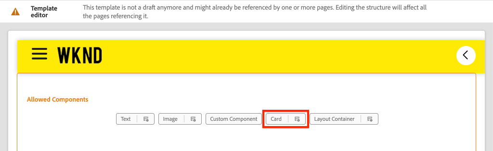

# Ampliar un componente principal {#extend-component}

Obtenga información sobre cómo ampliar un componente principal existente para utilizarlo con el AEM SPA Editor. Explicación de cómo ampliar un componente existente es una técnica eficaz para personalizar y expandir las capacidades de una implementación AEM Editor SPA.

## Objetivo

1. Amplíe un componente principal existente con propiedades y contenido adicionales.
2. Comprender los conceptos básicos de la herencia de componentes con el uso de `sling:resourceSuperType`.
3. Aprenda a utilizar la variable [Patrón de delegación](https://github.com/adobe/aem-core-wcm-components/wiki/Delegation-Pattern-for-Sling-Models) para que los modelos Sling reutilicen la lógica y funcionalidad existentes.

## Qué va a generar

En este capítulo, se ha añadido una nueva `Card` se crea. La variable `Card` amplía el [Componente principal de imagen](https://experienceleague.adobe.com/docs/experience-manager-core-components/using/components/image.html?lang=es) añadir campos de contenido adicionales como un Título y un botón Llamar a acción para realizar la función de un teaser para otro contenido dentro del SPA.


>[!NOTE]
>
> En una implementación del mundo real, puede ser más apropiado simplemente usar la variable [Componente teaser](https://experienceleague.adobe.com/docs/experience-manager-core-components/using/components/teaser.html) en lugar de ampliar el [Componente principal de imagen](https://experienceleague.adobe.com/docs/experience-manager-core-components/using/components/image.html) para hacer un `Card` en función de los requisitos del proyecto. Siempre se recomienda utilizar [Componentes principales](https://experienceleague.adobe.com/docs/experience-manager-core-components/using/introduction.html?lang=es) directamente cuando sea posible.

## Requisitos previos

Revise las herramientas e instrucciones necesarias para configurar un [entorno de desarrollo local](overview.md#local-dev-environment).

### Obtención del código

1. Descargue el punto de partida para este tutorial mediante Git:

   ```shell
   $ git clone git@github.com:adobe/aem-guides-wknd-spa.git
   $ cd aem-guides-wknd-spa
   $ git checkout Angular/extend-component-start
   ```

2. Implemente el código base en una instancia de AEM local mediante Maven:

   ```shell
   $ mvn clean install -PautoInstallSinglePackage
   ```

   Si usa [AEM 6.x](overview.md#compatibility) añada la variable `classic` perfil:

   ```shell
   $ mvn clean install -PautoInstallSinglePackage -Pclassic
   ```

3. Instale el paquete terminado para el [Sitio de referencia WKND](https://github.com/adobe/aem-guides-wknd/releases/tag/aem-guides-wknd-2.1.0). Las imágenes proporcionadas por [Sitio de referencia WKND](https://github.com/adobe/aem-guides-wknd/releases/latest) se reutiliza en la SPA WKND. El paquete se puede instalar mediante [Administrador de paquetes AEM](http://localhost:4502/crx/packmgr/index.jsp).

   

Siempre puede ver el código terminado en [GitHub](https://github.com/adobe/aem-guides-wknd-spa/tree/Angular/extend-component-solution) o extraer el código localmente cambiando a la rama `Angular/extend-component-solution`.

## Implementación de tarjeta inicial de Inspect

El código de inicio de capítulo ha proporcionado un componente de tarjeta inicial. Inspect es el punto de partida para la implementación de tarjetas.

1. En el IDE de su elección, abra el `ui.apps` módulo.
2. Vaya a `ui.apps/src/main/content/jcr_root/apps/wknd-spa-angular/components/card` y vea la `.content.xml` archivo.

   

   ```xml
   <?xml version="1.0" encoding="UTF-8"?>
   <jcr:root xmlns:sling="http://sling.apache.org/jcr/sling/1.0" xmlns:cq="http://www.day.com/jcr/cq/1.0" xmlns:jcr="http://www.jcp.org/jcr/1.0"
       jcr:primaryType="cq:Component"
       jcr:title="Card"
       sling:resourceSuperType="wknd-spa-angular/components/image"
       componentGroup="WKND SPA Angular - Content"/>
   ```

   La propiedad `sling:resourceSuperType` señala a `wknd-spa-angular/components/image` indicando que `Card` hereda la funcionalidad del componente WKND SPA Image .

3. Inspect el archivo `ui.apps/src/main/content/jcr_root/apps/wknd-spa-angular/components/image/.content.xml`:

   ```xml
   <?xml version="1.0" encoding="UTF-8"?>
   <jcr:root xmlns:sling="http://sling.apache.org/jcr/sling/1.0" xmlns:cq="http://www.day.com/jcr/cq/1.0" xmlns:jcr="http://www.jcp.org/jcr/1.0"
       jcr:primaryType="cq:Component"
       jcr:title="Image"
       sling:resourceSuperType="core/wcm/components/image/v2/image"
       componentGroup="WKND SPA Angular - Content"/>
   ```

   Observe que la variable `sling:resourceSuperType` señala a `core/wcm/components/image/v2/image`. Esto indica que el componente WKND SPA Imagen hereda la funcionalidad de la imagen del componente principal.

   También se conoce como [Patrón de proxy](https://experienceleague.adobe.com/docs/experience-manager-core-components/using/developing/guidelines.html#proxy-component-pattern) La herencia de recursos de Sling es un potente patrón de diseño que permite que los componentes secundarios hereden la funcionalidad y amplíen o anulen el comportamiento cuando lo deseen. La herencia de Sling admite varios niveles de herencia, por lo que, en última instancia, el nuevo `Card` hereda la funcionalidad de la imagen del componente principal.

   Muchos equipos de desarrollo se esfuerzan por ser D.R.Y. (no se repitan). La herencia de Sling permite hacerlo con AEM.

4. Debajo de la variable `card` carpeta, abra el archivo `_cq_dialog/.content.xml`.

   Este archivo es la definición de cuadro de diálogo de componentes para la variable `Card` componente. Si se utiliza la herencia de Sling, es posible utilizar las características de la variable [Fusión de recursos de Sling](https://experienceleague.adobe.com/docs/experience-manager-65/developing/platform/sling-resource-merger.html?lang=es) para anular o ampliar partes del cuadro de diálogo. En este ejemplo, se ha añadido una nueva pestaña al cuadro de diálogo para capturar datos adicionales de un autor y rellenar el componente de tarjeta.

   Propiedades como `sling:orderBefore` permita a un desarrollador elegir dónde insertar nuevas fichas o campos de formulario. En este caso, la variable `Text` se inserta antes de `asset` pestaña . Para aprovechar al máximo la fusión de recursos de Sling, es importante conocer la estructura de nodos del cuadro de diálogo original para la variable [Cuadro de diálogo de componente de imagen](https://github.com/adobe/aem-core-wcm-components/blob/master/content/src/content/jcr_root/apps/core/wcm/components/image/v2/image/_cq_dialog/.content.xml).

5. Debajo de la variable `card` carpeta, abra el archivo `_cq_editConfig.xml`. Este archivo dicta el comportamiento de arrastrar y soltar en la interfaz de usuario de creación de AEM. Al ampliar el componente Imagen, es importante que el tipo de recurso coincida con el componente en sí. Consulte la `<parameters>` nodo:

   ```xml
   <parameters
       jcr:primaryType="nt:unstructured"
       sling:resourceType="wknd-spa-angular/components/card"
       imageCrop=""
       imageMap=""
       imageRotate=""/>
   ```

   La mayoría de los componentes no requieren una `cq:editConfig`, la imagen y los descendientes secundarios del componente Imagen son excepciones.

6. En el conmutador IDE, vaya a la `ui.frontend` , vaya a `ui.frontend/src/app/components/card`:

   

7. Inspect el archivo `card.component.ts`.

   El componente ya se ha atascado para asignarlo a la AEM `Card` Componente que utiliza el estándar `MapTo` función.

   ```js
   MapTo('wknd-spa-angular/components/card')(CardComponent, CardEditConfig);
   ```

   Revise los tres `@Input` parámetros de la clase para `src`, `alt`y `title`. Estos son valores JSON esperados del componente AEM que están asignados al componente de Angular.

8. Abra el archivo `card.component.html`:

   ```html
   <div class="card"  *ngIf="hasContent">
       <app-image class="card__image" [src]="src" [alt]="alt" [title]="title"></app-image>
   </div>
   ```

   En este ejemplo elegimos reutilizar el componente de imagen de Angular existente `app-image` simplemente pasando el `@Input` parámetros de `card.component.ts`. Más adelante en el tutorial, se añaden y muestran propiedades adicionales.

## Actualizar la directiva de plantilla

Con esta inicial `Card` revisión de la funcionalidad en AEM SPA Editor. Para ver la `Card` es necesario actualizar la directiva Plantilla .

1. Implemente el código de inicio en una instancia local de AEM, si aún no lo ha hecho:

   ```shell
   $ cd aem-guides-wknd-spa
   $ mvn clean install -PautoInstallSinglePackage
   ```

2. Vaya a la plantilla de página SPA en [http://localhost:4502/editor.html/conf/wknd-spa-angular/settings/wcm/templates/spa-page-template/structure.html](http://localhost:4502/editor.html/conf/wknd-spa-angular/settings/wcm/templates/spa-page-template/structure.html).
3. Actualice la política del contenedor de diseño para agregar el nuevo `Card` como componente permitido:

   

   Guarde los cambios en la directiva y observe la `Card` como componente permitido:

   

## Autor del componente de tarjeta inicial

A continuación, cree el `Card` con el AEM SPA Editor.

1. Vaya a [http://localhost:4502/editor.html/content/wknd-spa-angular/us/en/home.html](http://localhost:4502/editor.html/content/wknd-spa-angular/us/en/home.html).
2. En `Edit` , añada la variable `Card` al `Layout Container`:

   

3. Arrastre y suelte una imagen desde el buscador de recursos en el `Card` componente:

   

4. Abra el `Card` diálogo de componentes y observe la adición de un **Texto** Tabulación.
5. Introduzca los siguientes valores en la variable **Texto** pestaña:

   

   **Ruta de acceso de la tarjeta** - seleccione una página debajo de la página principal de SPA.

   **Texto CTA** - &quot;Más información&quot;

   **Título de la tarjeta** - dejar en blanco

   **Obtener título de una página vinculada** - marque la casilla de verificación para indicar verdadero.

6. Actualice el **Metadatos de recursos** para agregar valores **Texto alternativo** y **Pie de ilustración**.

   Actualmente no aparece ningún cambio adicional después de actualizar el cuadro de diálogo. Para exponer los nuevos campos al componente de Angular, es necesario actualizar el modelo de Sling para el `Card` componente.

7. Abra una pestaña nueva y vaya a [CRXDE-Lite](http://localhost:4502/crx/de/index.jsp#/content/wknd-spa-angular/us/en/home/jcr%3Acontent/root/responsivegrid/card). Inspect de los nodos de contenido situados debajo `/content/wknd-spa-angular/us/en/home/jcr:content/root/responsivegrid` para encontrar la variable `Card` contenido del componente.

   

   Observe que las propiedades `cardPath`, `ctaText`, `titleFromPage` se mantienen en el cuadro de diálogo.

## Actualizar modelo de Sling de tarjeta

Para exponer finalmente los valores del cuadro de diálogo del componente al componente Angular, debemos actualizar el modelo de Sling que rellena el JSON para el `Card` componente. También tenemos la oportunidad de implementar dos fragmentos de lógica empresarial:

* If `titleFromPage` a **true**, devuelven el título de la página especificada por `cardPath` de lo contrario, devuelve el valor de `cardTitle` campo de texto.
* Devuelve la última fecha de modificación de la página especificada por `cardPath`.

Vuelva al IDE de su elección y abra el `core` módulo.

1. Abra el archivo . `Card.java` at `core/src/main/java/com/adobe/aem/guides/wknd/spa/angular/core/models/Card.java`.

   Observe que la variable `Card` actualmente, la interfaz se amplía `com.adobe.cq.wcm.core.components.models.Image` y, por lo tanto, hereda los métodos del `Image` interfaz. La variable `Image` La interfaz ya amplía el `ComponentExporter` que permite exportar el modelo de Sling como JSON y asignarlo el editor de SPA. Por lo tanto, no es necesario ampliar explícitamente `ComponentExporter` interfaz como hicimos en el [Capítulo de componente personalizado](custom-component.md).

2. Agregue los siguientes métodos a la interfaz:

   ```java
   @ProviderType
   public interface Card extends Image {
   
       /***
       * The URL to populate the CTA button as part of the card.
       * The link should be based on the cardPath property that points to a page.
       * @return String URL
       */
       public String getCtaLinkURL();
   
       /***
       * The text to display on the CTA button of the card.
       * @return String CTA text
       */
       public String getCtaText();
   
   
   
       /***
       * The date to be displayed as part of the card.
       * This is based on the last modified date of the page specified by the cardPath
       * @return
       */
       public Calendar getCardLastModified();
   
   
       /**
       * Return the title of the page specified by cardPath if `titleFromPage` is set to true.
       * Otherwise return the value of `cardTitle`
       * @return
       */
       public String getCardTitle();
   }
   ```

   Estos métodos se exponen a través de la API del modelo JSON y se pasan al componente Angular.

3. Abrir `CardImpl.java`. Esta es la implementación de `Card.java` interfaz. Esta implementación se ha atascado parcialmente para acelerar el tutorial.  Observe el uso de la variable `@Model` y `@Exporter` anotaciones para garantizar que el modelo de Sling se pueda serializar como JSON a través del exportador de modelos Sling.

   `CardImpl.java` también utiliza la variable [Patrón de delegación para modelos Sling](https://github.com/adobe/aem-core-wcm-components/wiki/Delegation-Pattern-for-Sling-Models) para evitar reescribir la lógica del componente principal de imagen.

4. Observe las siguientes líneas:

   ```java
   @Self
   @Via(type = ResourceSuperType.class)
   private Image image;
   ```

   La anotación anterior crea una instancia de un objeto de imagen denominado `image` en función de la variable `sling:resourceSuperType` herencia de `Card` componente.

   ```java
   @Override
   public String getSrc() {
       return null != image ? image.getSrc() : null;
   }
   ```

   Por lo tanto, es posible utilizar simplemente la variable `image` objeto para implementar métodos definidos por el `Image` , sin tener que escribir la lógica nosotros mismos. Esta técnica se utiliza para `getSrc()`, `getAlt()`y `getTitle()`.

5. A continuación, implemente la variable `initModel()` método para iniciar una variable privada `cardPage` en función del valor de `cardPath`

   ```java
   @PostConstruct
   public void initModel() {
       if(StringUtils.isNotBlank(cardPath) && pageManager != null) {
           cardPage = pageManager.getPage(this.cardPath);
       }
   }
   ```

   La variable `@PostConstruct initModel()` se llama cuando se inicializa el modelo Sling, por lo que es una buena oportunidad para inicializar objetos que puedan ser utilizados por otros métodos del modelo. La variable `pageManager` es uno de varios [Objetos globales respaldados por Java™](https://experienceleague.adobe.com/docs/experience-manager-htl/content/global-objects.html) disponibles para los modelos Sling mediante el `@ScriptVariable` anotación. La variable [getPage](https://developer.adobe.com/experience-manager/reference-materials/cloud-service/javadoc/com/day/cq/wcm/api/PageManager.html) toma una ruta y devuelve un AEM [Página](https://developer.adobe.com/experience-manager/reference-materials/cloud-service/javadoc/com/day/cq/wcm/api/Page.html) o nulo si la ruta no apunta a una página válida.

   Esto inicializa el `cardPage` , que utilizan los otros métodos nuevos para devolver datos sobre la página vinculada subyacente.

6. Revise las variables globales ya asignadas a las propiedades JCR guardadas en el cuadro de diálogo de autor. La variable `@ValueMapValue` la anotación se utiliza para realizar automáticamente la asignación.

   ```java
   @ValueMapValue
   private String cardPath;
   
   @ValueMapValue
   private String ctaText;
   
   @ValueMapValue
   private boolean titleFromPage;
   
   @ValueMapValue
   private String cardTitle;
   ```

   Estas variables se utilizan para implementar los métodos adicionales para la variable `Card.java` interfaz.

7. Implemente los métodos adicionales definidos en el `Card.java` interfaz:

   ```java
   @Override
   public String getCtaLinkURL() {
       if(cardPage != null) {
           return cardPage.getPath() + ".html";
       }
       return null;
   }
   
   @Override
   public String getCtaText() {
       return ctaText;
   }
   
   @Override
   public Calendar getCardLastModified() {
      if(cardPage != null) {
          return cardPage.getLastModified();
      }
      return null;
   }
   
   @Override
   public String getCardTitle() {
       if(titleFromPage) {
           return cardPage != null ? cardPage.getTitle() : null;
       }
       return cardTitle;
   }
   ```

   >[!NOTE]
   >
   > Puede ver la [ha finalizado CardImpl.java aquí](https://github.com/adobe/aem-guides-wknd-spa/blob/Angular/extend-component-solution/core/src/main/java/com/adobe/aem/guides/wknd/spa/angular/core/models/impl/CardImpl.java).

8. Abra una ventana de terminal e implemente solo las actualizaciones de `core` módulo con Maven `autoInstallBundle` perfil de `core` directorio.

   ```shell
   $ cd core/
   $ mvn clean install -PautoInstallBundle
   ```

   Si usa [AEM 6.x](overview.md#compatibility) añada la variable `classic` perfil.

9. Vea la respuesta del modelo JSON en: [http://localhost:4502/content/wknd-spa-angular/us/en.model.json](http://localhost:4502/content/wknd-spa-angular/us/en.model.json) y busque la variable `wknd-spa-angular/components/card`:

   ```json
   "card": {
       "ctaText": "Read More",
       "cardTitle": "Page 1",
       "title": "Woman chillaxing with river views in Australian bushland",
       "src": "/content/wknd-spa-angular/us/en/home/_jcr_content/root/responsivegrid/card.coreimg.jpeg/1595190732886/adobestock-216674449.jpeg",
       "alt": "Female sitting on a large rock relaxing in afternoon dappled light the Australian bushland with views over the river",
       "cardLastModified": 1591360492414,
       "ctaLinkURL": "/content/wknd-spa-angular/us/en/home/page-1.html",
       ":type": "wknd-spa-angular/components/card"
   }
   ```

   Tenga en cuenta que el modelo JSON se actualiza con pares clave/valor adicionales después de actualizar los métodos en la variable `CardImpl` Modelo Sling.

## Actualizar componente de Angular

Ahora que el modelo JSON se rellena con nuevas propiedades para `ctaLinkURL`, `ctaText`, `cardTitle`y `cardLastModified` podemos actualizar el componente Angular para mostrarlos.

1. Vuelva al IDE y abra el `ui.frontend` módulo. Opcionalmente, inicie el servidor de desarrollo de webpack desde una nueva ventana de terminal para ver los cambios en tiempo real:

   ```shell
   $ cd ui.frontend
   $ npm install
   $ npm start
   ```

2. Apertura `card.component.ts` at `ui.frontend/src/app/components/card/card.component.ts`. Agregue el `@Input` anotaciones para capturar el nuevo modelo:

   ```diff
   export class CardComponent implements OnInit {
   
        @Input() src: string;
        @Input() alt: string;
        @Input() title: string;
   +    @Input() cardTitle: string;
   +    @Input() cardLastModified: number;
   +    @Input() ctaLinkURL: string;
   +    @Input() ctaText: string;
   ```

3. Agregar métodos para comprobar si la llamada a acción está lista y para devolver una cadena de fecha y hora basada en la variable `cardLastModified` entrada:

   ```js
   export class CardComponent implements OnInit {
       ...
       get hasCTA(): boolean {
           return this.ctaLinkURL && this.ctaLinkURL.trim().length > 0 && this.ctaText && this.ctaText.trim().length > 0;
       }
   
       get lastModifiedDate(): string {
           const lastModifiedDate = this.cardLastModified ? new Date(this.cardLastModified) : null;
   
           if (lastModifiedDate) {
           return lastModifiedDate.toLocaleDateString();
           }
           return null;
       }
       ...
   }
   ```

4. Apertura `card.component.html` y añada la siguiente marca para mostrar el título, la llamada a la acción y la fecha de la última modificación:

   ```html
   <div class="card"  *ngIf="hasContent">
       <app-image class="card__image" [src]="src" [alt]="alt" [title]="title"></app-image>
       <div class="card__content">
           <h2 class="card__title">
               {{cardTitle}}
               <span class="card__lastmod" *ngIf="lastModifiedDate">{{lastModifiedDate}}</span>
           </h2>
           <div class="card__action-container" *ngIf="hasCTA">
               <a [routerLink]="ctaLinkURL" class="card__action-link" [title]="ctaText">
                   {{ctaText}}
               </a>
           </div>
       </div>
   </div>
   ```

   Ya se han agregado reglas de sass en `card.component.scss` para aplicar estilo al título, llame a acción y fecha de la última modificación.

   >[!NOTE]
   >
   > Puede ver el [Código de componente de la tarjeta de angular aquí](https://github.com/adobe/aem-guides-wknd-spa/tree/Angular/extend-component-solution/ui.frontend/src/app/components/card).

5. Implemente todos los cambios en AEM desde la raíz del proyecto mediante Maven:

   ```shell
   $ cd aem-guides-wknd-spa
   $ mvn clean install -PautoInstallSinglePackage
   ```

6. Vaya a [http://localhost:4502/editor.html/content/wknd-spa-angular/us/en/home.html](http://localhost:4502/editor.html/content/wknd-spa-angular/us/en/home.html) para ver el componente actualizado:

   

7. Debería poder volver a crear el contenido existente para crear una página similar a la siguiente:

   

## Felicitaciones! {#congratulations}

Felicidades, ha aprendido a ampliar un componente AEM y a trabajar los modelos y diálogos de Sling con el modelo JSON.

Siempre puede ver el código terminado en [GitHub](https://github.com/adobe/aem-guides-wknd-spa/tree/Angular/extend-component-solution) o extraer el código localmente cambiando a la rama `Angular/extend-component-solution`.
