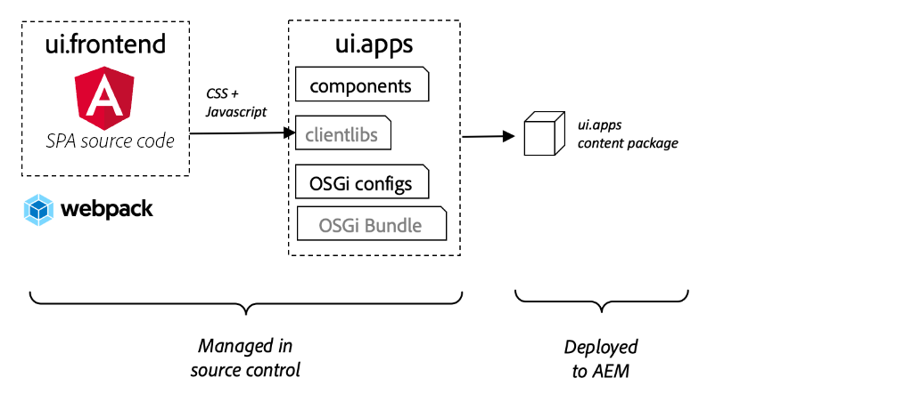
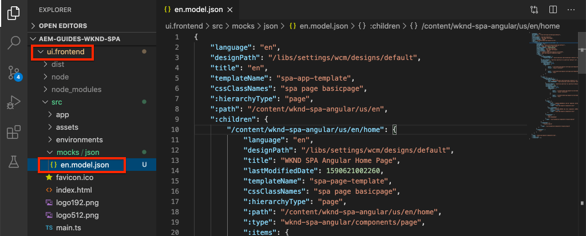

# Integrar un SPA {#integrate-spa}

Comprender cómo se puede integrar el código fuente de una aplicación de una sola página (SPA) escrita en Angular con un proyecto de Adobe Experience Manager (AEM). Aprenda a utilizar herramientas front-end modernas, como un servidor de desarrollo de webpack, para desarrollar rápidamente el SPA con la API del modelo JSON de AEM.

## Objetivo

1. Comprender cómo el proyecto de SPA está integrado con AEM con bibliotecas del lado del cliente.
2. Aprenda a utilizar un servidor de desarrollo local para el desarrollo del front-end dedicado.
3. Explorar el uso de un **proxy** y estático **mock** archivo para desarrollo con la API del modelo JSON de AEM

## Qué va a generar

Este capítulo agregará una `Header` al SPA. En el proceso de creación de esta estática `Header` componente se utilizan varios enfoques para AEM el desarrollo de SPA.


*El SPA se amplía para agregar un `Header` componente*

## Requisitos previos

Revise las herramientas e instrucciones necesarias para configurar un [entorno de desarrollo local](overview.md#local-dev-environment).

### Obtención del código

1. Descargue el punto de partida para este tutorial mediante Git:

   ```shell
   $ git clone git@github.com:adobe/aem-guides-wknd-spa.git
   $ cd aem-guides-wknd-spa
   $ git checkout Angular/integrate-spa-start
   ```

2. Implemente el código base en una instancia de AEM local mediante Maven:

   ```shell
   $ mvn clean install -PautoInstallSinglePackage
   ```

   Si usa [AEM 6.x](overview.md#compatibility) añada la variable `classic` perfil:

   ```shell
   $ mvn clean install -PautoInstallSinglePackage -Pclassic
   ```

Siempre puede ver el código terminado en [GitHub](https://github.com/adobe/aem-guides-wknd-spa/tree/Angular/integrate-spa-solution) o desproteja el código localmente cambiando a la rama `Angular/integrate-spa-solution`.

## Enfoque de integración {#integration-approach}

Se crearon dos módulos como parte del proyecto AEM: `ui.apps` y `ui.frontend`.

La variable `ui.frontend` es un [webpack](https://webpack.js.org/) proyecto que contiene todo el código fuente de SPA. La mayoría de las pruebas y el desarrollo de SPA se realizan en el proyecto de webpack. Cuando se activa una compilación de producción, la SPA se crea y se compila mediante un webpack. Los artefactos compilados (CSS y Javascript) se copian en la variable `ui.apps` que luego se implementa en el tiempo de ejecución de AEM.



*Descripción general de la integración de SPA.*

La información adicional sobre la compilación del front-end puede ser [se encuentra aquí](https://experienceleague.adobe.com/docs/experience-manager-core-components/using/developing/archetype/uifrontend-angular.html).

## Integración de Inspect con SPA {#inspect-spa-integration}

A continuación, revise la `ui.frontend` para comprender el SPA que el [AEM tipo de archivo del proyecto](https://experienceleague.adobe.com/docs/experience-manager-core-components/using/developing/archetype/uifrontend-angular.html).

1. En el IDE de su elección, abra el proyecto AEM para el SPA WKND. Este tutorial utilizará la variable [Código IDE de Visual Studio](https://experienceleague.adobe.com/docs/experience-manager-learn/cloud-service/local-development-environment-set-up/development-tools.html#microsoft-visual-studio-code).

   

2. Expanda e inspeccione la variable `ui.frontend` carpeta. Abra el archivo `ui.frontend/package.json`

3. En el `dependencies` debería ver varias relacionadas con `@angular`:

   ```json
   "@angular/animations": "~9.1.11",
   "@angular/common": "~9.1.11",
   "@angular/compiler": "~9.1.11",
   "@angular/core": "~9.1.11",
   "@angular/forms": "~9.1.10",
   "@angular/platform-browser": "~9.1.10",
   "@angular/platform-browser-dynamic": "~9.1.10",
   "@angular/router": "~9.1.10",
   ```

   La variable `ui.frontend` es un [aplicación de angular](https://angular.io) generado mediante el uso de la variable [Herramienta CLI de angular](https://angular.io/cli) que incluye el enrutamiento.

4. También hay tres dependencias con el prefijo `@adobe`:

   ```json
   "@adobe/cq-angular-editable-components": "^2.0.2",
   "@adobe/cq-spa-component-mapping": "^1.0.3",
   "@adobe/cq-spa-page-model-manager": "^1.1.3",
   ```

   Los módulos anteriores forman el [AEM SDK de JS Editor SPA](https://experienceleague.adobe.com/docs/experience-manager-65/developing/headless/spas/spa-blueprint.html) y proporcionar la funcionalidad para que sea posible asignar SPA componentes a AEM componentes.

5. En el `package.json` file several `scripts` están definidas:

   ```json
   "scripts": {
       "start": "ng serve --open --proxy-config ./proxy.conf.json",
       "build": "ng lint && ng build && clientlib",
       "build:production": "ng lint && ng build --prod && clientlib",
       "test": "ng test",
       "sync": "aemsync -d -w ../ui.apps/src/main/content"
   }
   ```

   Estas secuencias de comandos se basan en [Comandos CLI de angular](https://angular.io/cli/build) pero se han modificado ligeramente para trabajar con el proyecto de AEM más grande.

   `start` : ejecuta la aplicación de Angular localmente mediante un servidor web local. Se ha actualizado para representar el contenido de la instancia de AEM local.

   `build` - compila la aplicación de Angular para la distribución de producción. La adición de `&& clientlib` es responsable de copiar el SPA compilado en el `ui.apps` como biblioteca del lado del cliente durante una compilación. El módulo npm [aem-clientlib-generator](https://github.com/wcm-io-frontend/aem-clientlib-generator) se utiliza para facilitar este proceso.

   Se pueden encontrar más detalles sobre los scripts disponibles [here](https://experienceleague.adobe.com/docs/experience-manager-core-components/using/developing/archetype/uifrontend-angular.html).

6. Inspect el archivo `ui.frontend/clientlib.config.js`. Este archivo de configuración lo utiliza [aem-clientlib-generator](https://github.com/wcm-io-frontend/aem-clientlib-generator#clientlibconfigjs) para determinar cómo generar la biblioteca de cliente.

7. Inspect el archivo `ui.frontend/pom.xml`. Este archivo transforma el `ui.frontend` carpeta en un [Módulo Maven](https://maven.apache.org/guides/mini/guide-multiple-modules.html). La variable `pom.xml` se ha actualizado para usar la variable [frontend-maven-plugin](https://github.com/eirslett/frontend-maven-plugin) a **prueba** y **versión** el SPA durante una compilación de Maven.

8. Inspect el archivo `app.component.ts` at `ui.frontend/src/app/app.component.ts`:

   ```js
   import { Constants } from '@adobe/cq-angular-editable-components';
   import { ModelManager } from '@adobe/cq-spa-page-model-manager';
   import { Component } from '@angular/core';
   
   @Component({
   selector: '#spa-root', // tslint:disable-line
   styleUrls: ['./app.component.css'],
   templateUrl: './app.component.html'
   })
   export class AppComponent {
       ...
   
       constructor() {
           ModelManager.initialize().then(this.updateData);
       }
   
       private updateData = pageModel => {
           this.path = pageModel[Constants.PATH_PROP];
           this.items = pageModel[Constants.ITEMS_PROP];
           this.itemsOrder = pageModel[Constants.ITEMS_ORDER_PROP];
       }
   }
   ```

   `app.component.js` es el punto de entrada del SPA. `ModelManager` es proporcionado por AEM SPA Editor JS SDK. Es responsable de llamar e inyectar el `pageModel` (el contenido JSON) en la aplicación.

## Añadir un componente Encabezado {#header-component}

A continuación, agregue un componente nuevo a la SPA e implemente los cambios en una instancia de AEM local para ver la integración.

1. Abra una nueva ventana de terminal y vaya a la `ui.frontend` carpeta:

   ```shell
   $ cd aem-guides-wknd-spa/ui.frontend
   ```

2. Instalar [CLI de angular](https://angular.io/cli#installing-angular-cli) globalmente Se utiliza para generar componentes de Angular, así como para crear y servir la aplicación de Angular a través de la variable **ng** comando.

   ```shell
   $ npm install -g @angular/cli
   ```

   >[!CAUTION]
   >
   > La versión de **@angular/cli** utilizado por este proyecto es **9.1.7**. Se recomienda mantener las versiones de CLI de Angular sincronizadas.

3. Cree una nueva `Header` al ejecutar la CLI de Angular `ng generate component` desde el `ui.frontend` carpeta.

   ```shell
   $ ng generate component components/header
   
   CREATE src/app/components/header/header.component.css (0 bytes)
   CREATE src/app/components/header/header.component.html (21 bytes)
   CREATE src/app/components/header/header.component.spec.ts (628 bytes)
   CREATE src/app/components/header/header.component.ts (269 bytes)
   UPDATE src/app/app.module.ts (1809 bytes)
   ```

   Esto creará un esqueleto para el nuevo componente Encabezado de Angular en `ui.frontend/src/app/components/header`.

4. Abra el `aem-guides-wknd-spa` en el IDE que elija. Vaya a la `ui.frontend/src/app/components/header` carpeta.

   

5. Abra el archivo . `header.component.html` y reemplace el contenido por lo siguiente:

   ```html
   <!--/* header.component.html */-->
   <header className="header">
       <div className="header-container">
           <h1>WKND</h1>
       </div>
   </header>
   ```

   Tenga en cuenta que esto muestra contenido estático, por lo que este componente de Angular no requiere ningún ajuste en la generación predeterminada `header.component.ts`.

6. Abra el archivo . **app.component.html** at  `ui.frontend/src/app/app.component.html`. Agregue la variable `app-header`:

   ```html
   <app-header></app-header>
   <router-outlet></router-outlet>
   ```

   Esto incluirá la variable `header` sobre todo el contenido de la página.

7. Abra un terminal nuevo y vaya a la `ui.frontend` y ejecute el `npm run build` comando:

   ```shell
   $ cd ui.frontend
   $ npm run build
   
   Linting "angular-app"...
   All files pass linting.
   Generating ES5 bundles for differential loading...
   ES5 bundle generation complete.
   ```

8. Vaya a la `ui.apps` carpeta. Bajo `ui.apps/src/main/content/jcr_root/apps/wknd-spa-angular/clientlibs/clientlib-angular` debería ver que los archivos SPA compilados se han copiado de la variable`ui.frontend/build` carpeta.

   

9. Vuelva al terminal y navegue hasta el `ui.apps` carpeta. Ejecute el siguiente comando Maven:

   ```shell
   $ cd ../ui.apps
   $ mvn clean install -PautoInstallPackage
   ...
   [INFO] ------------------------------------------------------------------------
   [INFO] BUILD SUCCESS
   [INFO] ------------------------------------------------------------------------
   [INFO] Total time:  9.629 s
   [INFO] Finished at: 2020-05-04T17:48:07-07:00
   [INFO] ------------------------------------------------------------------------
   ```

   Esto implementará la variable `ui.apps` a una instancia local en ejecución de AEM.

10. Abra una pestaña del explorador y vaya a [http://localhost:4502/editor.html/content/wknd-spa-angular/us/en/home.html](http://localhost:4502/editor.html/content/wknd-spa-angular/us/en/home.html). Ahora debería ver el contenido del `Header` componente que se muestra en el SPA.

   

   Pasos **7-9** se ejecutan automáticamente al activar una compilación de Maven desde la raíz del proyecto (p. ej. `mvn clean install -PautoInstallSinglePackage`). Ahora debe comprender los conceptos básicos de la integración entre las bibliotecas de SPA y AEM del lado del cliente. Observe que aún puede editar y agregar `Text` componentes en AEM, sin embargo, la variable `Header` no es editable.

## Servidor de desarrollo de Webpack: proxy de la API JSON {#proxy-json}

Como se ha visto en ejercicios anteriores, realizar una compilación y sincronizar la biblioteca del cliente con una instancia local de AEM tarda unos minutos. Esto es aceptable para las pruebas finales, pero no es ideal para la mayoría del desarrollo de SPA.

A [servidor de desarrollo de webpack](https://webpack.js.org/configuration/dev-server/) puede utilizarse para desarrollar rápidamente el SPA. El SPA está impulsado por un modelo JSON generado por AEM. En este ejercicio, el contenido JSON de una instancia de AEM en ejecución es **proxy** en el servidor de desarrollo configurado por el [proyecto de angular](https://angular.io/guide/build).

1. Vuelva al IDE y abra el archivo **proxy.conf.json** at `ui.frontend/proxy.conf.json`.

   ```json
   [
       {
           "context": [
                       "/content/**/*.(jpg|jpeg|png|model.json)",
                       "/etc.clientlibs/**/*"
                   ],
           "target": "http://localhost:4502",
           "auth": "admin:admin",
           "logLevel": "debug"
       }
   ]
   ```

   La variable [aplicación de angular](https://angular.io/guide/build#proxying-to-a-backend-server) proporciona un mecanismo fácil para las solicitudes de API proxy. Los patrones especificados en `context` se procesan mediante proxy `localhost:4502`, el inicio rápido AEM local.

2. Abra el archivo . **index.html** at `ui.frontend/src/index.html`. Este es el archivo HTML raíz que utiliza el servidor de desarrollo.

   Tenga en cuenta que hay una entrada para `base href="/"`. La variable [etiqueta base](https://angular.io/guide/deployment#the-base-tag) es fundamental para que la aplicación resuelva las direcciones URL relativas.

   ```html
   <base href="/">
   ```

3. Abra una ventana de terminal y vaya a la `ui.frontend` carpeta. Ejecutar el comando `npm start`:

   ```shell
   $ cd ui.frontend
   $ npm start
   
   > wknd-spa-angular@0.1.0 start /Users/dgordon/Documents/code/aem-guides-wknd-spa/ui.frontend
   > ng serve --open --proxy-config ./proxy.conf.json
   
   10% building 3/3 modules 0 active[HPM] Proxy created: [ '/content/**/*.(jpg|jpeg|png|model.json)', '/etc.clientlibs/**/*' ]  ->  http://localhost:4502
   [HPM] Subscribed to http-proxy events:  [ 'error', 'close' ]
   ℹ ｢wds｣: Project is running at http://localhost:4200/webpack-dev-server/
   ℹ ｢wds｣: webpack output is served from /
   ℹ ｢wds｣: 404s will fallback to //index.html
   ```

4. Abra una nueva pestaña del explorador (si aún no está abierta) y vaya a [http://localhost:4200/content/wknd-spa-angular/us/en/home.html](http://localhost:4200/content/wknd-spa-angular/us/en/home.html).

   

   Debería ver el mismo contenido que en AEM, pero sin ninguna de las capacidades de creación habilitadas.

5. Vuelva al IDE y cree una nueva carpeta denominada `img` at `ui.frontend/src/assets`.
6. Descargue y añada el siguiente logotipo WKND al `img` carpeta:

   

7. Apertura **header.component.html** at `ui.frontend/src/app/components/header/header.component.html` e incluya el logotipo:

   ```html
   <header class="header">
       <div class="header-container">
           <div class="logo">
               
           </div>
       </div>
   </header>
   ```

   Guarde los cambios en **header.component.html**.

8. Vuelva al explorador. Debería ver inmediatamente los cambios realizados en la aplicación.

   

   Puede seguir actualizando el contenido en **AEM** y veas reflejadas en **servidor de desarrollo de webpack**, ya que estamos proxizando el contenido. Tenga en cuenta que los cambios de contenido solo son visibles en la variable **servidor de desarrollo de webpack**.

9. Detenga el servidor web local con `ctrl+c` en el terminal.

## Servidor de desarrollo de Webpack: API de JSON de prueba {#mock-json}

Otro enfoque para el desarrollo rápido es utilizar un archivo JSON estático para actuar como el modelo JSON. Al &quot;burlarse&quot; del JSON, eliminamos la dependencia de una instancia de AEM local. También permite a un desarrollador front-end actualizar el modelo JSON para probar la funcionalidad y dirigir los cambios a la API JSON que luego sería implementada por un desarrollador back-end.

La configuración inicial del JSON de prueba hace **requerir una instancia de AEM local**.

1. En el navegador, vaya a [http://localhost:4502/content/wknd-spa-angular/us/en.model.json](http://localhost:4502/content/wknd-spa-angular/us/en.model.json).

   Este es el JSON exportado por AEM que administra la aplicación. Copie la salida JSON.

2. Vuelva al IDE para navegar `ui.frontend/src` y añada nuevas carpetas denominadas **mocks** y **json** para que coincida con la siguiente estructura de carpetas:

   ```plain
   |-- ui.frontend
       |-- src
           |-- mocks
               |-- json
   ```

3. Cree un nuevo archivo con el nombre **en.model.json** below `ui.frontend/public/mocks/json`. Pegar la salida JSON desde **Paso 1** aquí.

   

4. Crear un nuevo archivo **proxy.mock.conf.json** below `ui.frontend`. Rellene el archivo con lo siguiente:

   ```json
   [
       {
       "context": [
           "/content/**/*.model.json"
       ],
       "pathRewrite": { "^/content/wknd-spa-angular/us" : "/mocks/json"} ,
       "target": "http://localhost:4200",
       "logLevel": "debug"
       }
   ]
   ```

   Esta configuración de proxy reescribirá las solicitudes que comiencen por `/content/wknd-spa-angular/us` con `/mocks/json` y sirven el archivo JSON estático correspondiente, por ejemplo:

   ```plain
   /content/wknd-spa-angular/us/en.model.json -> /mocks/json/en.model.json
   ```

5. Abra el archivo . **angular.json**. Agregar una nueva **dev** configuración con una **activos** para hacer referencia a la matriz **mocks** carpeta creada.

   ```json
    "dev": {
             "assets": [
               "src/mocks",
               "src/assets",
               "src/favicon.ico",
               "src/logo192.png",
               "src/logo512.png",
               "src/manifest.json"
             ]
       },
   ```

   

   Creación de una **dev** garantiza que la variable **mocks** solo se utiliza durante el desarrollo y nunca se implementa para AEM en una compilación de producción.

6. En el **angular.json** , actualice el **browserTarget** para usar la nueva **dev** configuración:

   ```diff
     ...
     "serve": {
         "builder": "@angular-devkit/build-angular:dev-server",
         "options": {
   +       "browserTarget": "angular-app:build:dev"
   -       "browserTarget": "angular-app:build"
         },
     ...
   ```

   

7. Abra el archivo . `ui.frontend/package.json` y agregue **start:mock** para hacer referencia a la variable **proxy.mock.conf.json** archivo.

   ```diff
       "scripts": {
           "start": "ng serve --open --proxy-config ./proxy.conf.json",
   +       "start:mock": "ng serve --open --proxy-config ./proxy.mock.conf.json",
           "build": "ng lint && ng build && clientlib",
           "build:production": "ng lint && ng build --prod && clientlib",
           "test": "ng test",
           "sync": "aemsync -d -w ../ui.apps/src/main/content"
       }
   ```

   Añadir un nuevo comando facilita la alternancia entre las configuraciones de proxy.

8. Si se está ejecutando, detenga la variable **servidor de desarrollo de webpack**. Inicie el **servidor de desarrollo de webpack** usando la variable **start:mock** script:

   ```shell
   $ npm run start:mock
   
   > wknd-spa-angular@0.1.0 start:mock /Users/dgordon/Documents/code/aem-guides-wknd-spa/ui.frontend
   > ng serve --open --proxy-config ./proxy.mock.conf.json
   ```

   Vaya a [http://localhost:4200/content/wknd-spa-angular/us/en/home.html](http://localhost:4200/content/wknd-spa-angular/us/en/home.html) y debería ver el mismo SPA, pero el contenido ahora se está extrayendo del **mock** Archivo JSON.

9. Realice un pequeño cambio en la variable **en.model.json** archivo creado anteriormente. El contenido actualizado debe reflejarse inmediatamente en la variable **servidor de desarrollo de webpack**.

   

   Poder manipular el modelo JSON y ver los efectos en un SPA activo puede ayudar a un desarrollador a comprender la API del modelo JSON. También permite el desarrollo del front-end y del back-end en paralelo.

## Agregar estilos con Sass

A continuación, se añaden al proyecto algunos estilos actualizados. Este proyecto agregará [Sass](https://sass-lang.com/) compatibilidad con algunas funciones útiles como las variables.

1. Abra una ventana de terminal y detenga el **servidor de desarrollo de webpack** si se ha iniciado. Desde dentro de la variable `ui.frontend` carpeta introduzca el siguiente comando para actualizar la aplicación de Angular que desea procesar **.scs** archivos.

   ```shell
   $ cd ui.frontend
   $ ng config schematics.@schematics/angular:component.styleext scss
   ```

   Esto actualizará la variable `angular.json` con una nueva entrada en la parte inferior del archivo:

   ```json
   "schematics": {
       "@schematics/angular:component": {
       "styleext": "scss"
       }
   }
   ```

2. Instalar `normalize-scss` para normalizar los estilos en los navegadores:

   ```shell
   $ npm install normalize-scss --save
   ```

3. Vuelva al IDE y debajo de `ui.frontend/src` crear una nueva carpeta con el nombre `styles`.
4. Cree un nuevo archivo debajo de `ui.frontend/src/styles` named `_variables.scss` y rellénelo con las siguientes variables:

   ```scss
   //_variables.scss
   
   //== Colors
   //
   //## Gray and brand colors for use across theme.
   
   $black:                  #202020;
   $gray:                   #696969;
   $gray-light:             #EBEBEB;
   $gray-lighter:           #F7F7F7;
   $white:                  #FFFFFF;
   $yellow:                 #FFEA00;
   $blue:                   #0045FF;
   
   
   //== Typography
   //
   //## Font, line-height, and color for body text, headings, and more.
   
   $font-family-sans-serif:  "Helvetica Neue", Helvetica, Arial, sans-serif;
   $font-family-serif:       Georgia, "Times New Roman", Times, serif;
   $font-family-base:        $font-family-sans-serif;
   $font-size-base:          18px;
   
   $line-height-base:        1.5;
   $line-height-computed:    floor(($font-size-base * $line-height-base));
   
   // Functional Colors
   $brand-primary:             $yellow;
   $body-bg:                   $white;
   $text-color:                $black;
   $text-color-inverse:        $gray-light;
   $link-color:                $blue;
   
   //Layout
   $max-width: 1024px;
   $header-height: 75px;
   
   // Spacing
   $gutter-padding: 12px;
   ```

5. Cambie el nombre de la extensión del archivo **estilos.css** at `ui.frontend/src/styles.css` a **estilos.scss**. Sustituya el contenido por el siguiente:

   ```scss
   /* styles.scss * /
   
   /* Normalize */
   @import '~normalize-scss/sass/normalize';
   
   @import './styles/variables';
   
   body {
       background-color: $body-bg;
       font-family: $font-family-base;
       margin: 0;
       padding: 0;
       font-size: $font-size-base;
       text-align: left;
       color: $text-color;
       line-height: $line-height-base;
   }
   
   body.page {
       max-width: $max-width;
       margin: 0 auto;
       padding: $gutter-padding;
       padding-top: $header-height;
   }
   ```

6. Actualizar **angular.json** y cambie el nombre de todas las referencias a **style.css** con **estilos.scss**. Debería haber 3 referencias.

   ```diff
     "styles": [
   -    "src/styles.css"
   +    "src/styles.scss"
      ],
   ```

## Actualizar estilos de encabezado

A continuación, agregue algunos estilos específicos de la marca al **Encabezado** utilizando Sass.

1. Inicie el **servidor de desarrollo de webpack** para ver cómo se actualizan los estilos en tiempo real:

   ```shell
   $ npm run start:mock
   ```

2. En `ui.frontend/src/app/components/header` volver a nombrar **header.component.css** a **header.component.scss**. Rellene el archivo con lo siguiente:

   ```scss
   @import "~src/styles/variables";
   
   .header {
       width: 100%;
       position: fixed;
       top: 0;
       left:0;
       z-index: 99;
       background-color: $brand-primary;
       box-shadow: 0px 0px 10px 0px rgba(0, 0, 0, 0.24);
   }
   
   .header-container {
       display: flex;
       max-width: $max-width;
       margin: 0 auto;
       padding-left: $gutter-padding;
       padding-right: $gutter-padding;
   }
   
   .logo {
       z-index: 100;
       display: flex;
       padding-top: $gutter-padding;
       padding-bottom: $gutter-padding;
   }
   
   .logo-img {
       width: 100px;
   }
   ```

3. Actualizar **header.component.ts** referencia **header.component.scss**:

   ```diff
   ...
     @Component({
       selector: 'app-header',
       templateUrl: './header.component.html',
   -   styleUrls: ['./header.component.css']
   +   styleUrls: ['./header.component.scss']
     })
   ...
   ```

4. Vuelva al explorador y a la **servidor de desarrollo de webpack**:

   

   Ahora debería ver los estilos actualizados añadidos al **Encabezado** componente.

## Implementar SPA actualizaciones en AEM

Los cambios realizados en la variable **Encabezado** actualmente solo son visibles a través de la variable **servidor de desarrollo de webpack**. Implemente el SPA actualizado en AEM para ver los cambios.

1. Detenga el **servidor de desarrollo de webpack**.
2. Vaya a la raíz del proyecto `/aem-guides-wknd-spa` e implemente el proyecto para AEM con Maven:

   ```shell
   $ cd ..
   $ mvn clean install -PautoInstallSinglePackage
   ```

3. Vaya a [http://localhost:4502/editor.html/content/wknd-spa-angular/us/en/home.html](http://localhost:4502/editor.html/content/wknd-spa-angular/us/en/home.html). Debería ver la **Encabezado** con logotipo y estilos aplicados:

   

   Ahora que la SPA actualizada está en AEM, la creación puede continuar.

## Felicitaciones! {#congratulations}

Felicidades, ha actualizado la SPA y explorado la integración con AEM! Ahora conoce dos enfoques diferentes para desarrollar la SPA con la API del modelo JSON de AEM mediante un **servidor de desarrollo de webpack**.

Siempre puede ver el código terminado en [GitHub](https://github.com/adobe/aem-guides-wknd-spa/tree/Angular/integrate-spa-solution) o desproteja el código localmente cambiando a la rama `Angular/integrate-spa-solution`.

### Siguientes pasos {#next-steps}

[Asignación de componentes de SPA a componentes de AEM](map-components.md) : Aprenda a asignar componentes de Angular a componentes de Adobe Experience Manager (AEM) con el SDK de JS de AEM Editor SPA. La asignación de componentes permite a los autores realizar actualizaciones dinámicas de los componentes de SPA dentro del AEM SPA Editor, de forma similar a la creación de AEM tradicional.
