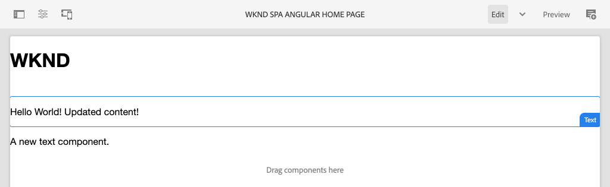

# SPA Integración de una {#integrate-spa}

SPA Comprenda cómo el código fuente de una aplicación de una sola página () escrita en Angular se puede integrar con un proyecto de Adobe Experience Manager AEM (). SPA AEM Aprenda a utilizar herramientas front-end modernas, como un servidor de desarrollo de Webpack, para desarrollar rápidamente la contra la API del modelo JSON de la red de aplicaciones de la red de aplicaciones de JSON de la red de aplicaciones de la red (JSON) de la red de archivos de datos.

## Objetivo

1. SPA AEM Comprender cómo el proyecto de está integrado con las bibliotecas del lado del cliente y la forma en que lo hace.
2. Aprenda a utilizar un servidor de desarrollo local para el desarrollo front-end dedicado.
3. Explorar el uso de un **proxy** y estático **burlar de** AEM archivo para desarrollar con la API del modelo JSON de

## Qué va a generar

Este capítulo añadirá un `Header` SPA componente a la. En el proceso de creación de esta estática `Header` AEM SPA componente se utilizan varios enfoques para el desarrollo de la.


*SPA La se amplía para agregar una estática `Header` componente*

## Requisitos previos

Revise las herramientas y las instrucciones necesarias para configurar una [entorno de desarrollo local](overview.md#local-dev-environment).

### Obtener el código

1. Descargue el punto de partida para este tutorial mediante Git:

   ```shell
   $ git clone git@github.com:adobe/aem-guides-wknd-spa.git
   $ cd aem-guides-wknd-spa
   $ git checkout Angular/integrate-spa-start
   ```

2. AEM Implemente el código base en una instancia de local mediante Maven:

   ```shell
   $ mvn clean install -PautoInstallSinglePackage
   ```

   Si se usa [AEM.x](overview.md#compatibility) añada el `classic` perfil:

   ```shell
   $ mvn clean install -PautoInstallSinglePackage -Pclassic
   ```

Siempre puede ver el código terminado en [GitHub](https://github.com/adobe/aem-guides-wknd-spa/tree/Angular/integrate-spa-solution) o compruebe el código localmente cambiando a la rama `Angular/integrate-spa-solution`.

## Enfoque de integración {#integration-approach}

AEM Se crearon dos módulos como parte del proyecto de: `ui.apps` y `ui.frontend`.

El `ui.frontend` El módulo es un [webpack](https://webpack.js.org/) SPA proyecto que contiene todo el código fuente de la. SPA La mayoría de las pruebas y el desarrollo de la se realizan en el proyecto de Webpack. SPA Cuando se activa una compilación de producción, la generación de la se compila mediante Webpack. Los artefactos compilados (CSS y Javascript) se copian en la variable `ui.apps` AEM que luego se implementa en el tiempo de ejecución de la.


*SPA Una descripción de alto nivel de la integración de la.*

Puede obtener información adicional sobre la versión del front-end [encontrado aquí](https://experienceleague.adobe.com/docs/experience-manager-core-components/using/developing/archetype/uifrontend-angular.html).

## Inspect SPA la integración de la {#inspect-spa-integration}

A continuación, inspeccione el `ui.frontend` SPA para comprender la que ha generado automáticamente el módulo [AEM Arquetipo de proyecto](https://experienceleague.adobe.com/docs/experience-manager-core-components/using/developing/archetype/uifrontend-angular.html).

1. AEM SPA En el IDE de su elección, abra el Proyecto de para el WKND. Este tutorial utilizará el [IDE de código de Visual Studio](https://experienceleague.adobe.com/docs/experience-manager-learn/cloud-service/local-development-environment-set-up/development-tools.html#microsoft-visual-studio-code).

   

2. Expanda e inspeccione el `ui.frontend` carpeta. Abra el archivo `ui.frontend/package.json`

3. En el `dependencies` debería ver varias relacionadas con `@angular`:

   ```json
   "@angular/animations": "~9.1.11",
   "@angular/common": "~9.1.11",
   "@angular/compiler": "~9.1.11",
   "@angular/core": "~9.1.11",
   "@angular/forms": "~9.1.10",
   "@angular/platform-browser": "~9.1.10",
   "@angular/platform-browser-dynamic": "~9.1.10",
   "@angular/router": "~9.1.10",
   ```

   El `ui.frontend` El módulo es un [aplicación de angular](https://angular.io) generado mediante el uso de [Herramienta CLI de angular](https://angular.io/cli) que incluye enrutamiento.

4. También hay tres dependencias con el prefijo `@adobe`:

   ```json
   "@adobe/cq-angular-editable-components": "^2.0.2",
   "@adobe/cq-spa-component-mapping": "^1.0.3",
   "@adobe/cq-spa-page-model-manager": "^1.1.3",
   ```

   Los módulos anteriores conforman el [AEM SPA SDK de JS de Editor de](https://experienceleague.adobe.com/docs/experience-manager-65/developing/headless/spas/spa-blueprint.html) SPA AEM y proporcionan la funcionalidad para hacer posible la asignación de componentes de la a componentes de la.

5. En el `package.json` archivar varios `scripts` están definidas:

   ```json
   "scripts": {
       "start": "ng serve --open --proxy-config ./proxy.conf.json",
       "build": "ng lint && ng build && clientlib",
       "build:production": "ng lint && ng build --prod && clientlib",
       "test": "ng test",
       "sync": "aemsync -d -w ../ui.apps/src/main/content"
   }
   ```

   Estos scripts se basan en [Comandos CLI de angular](https://angular.io/cli/build) AEM pero se han modificado ligeramente para que funcionen con el proyecto de mayor envergadura de la.

   `start` : ejecuta la aplicación de Angular localmente mediante un servidor web local. AEM Se ha actualizado para representar el contenido de la instancia local de.

   `build` : compila la aplicación de Angular para la distribución de producción. La adición de `&& clientlib` SPA es responsable de copiar los datos compilados en la interfaz de usuario de `ui.apps` como una biblioteca del lado del cliente durante una compilación. El módulo npm [aem-clientlib-generator](https://github.com/wcm-io-frontend/aem-clientlib-generator) se utiliza para facilitar esto.

   Se pueden encontrar más detalles sobre los scripts disponibles [aquí](https://experienceleague.adobe.com/docs/experience-manager-core-components/using/developing/archetype/uifrontend-angular.html).

6. Inspect el archivo `ui.frontend/clientlib.config.js`. Este archivo de configuración lo utiliza [aem-clientlib-generator](https://github.com/wcm-io-frontend/aem-clientlib-generator#clientlibconfigjs) para determinar cómo generar la biblioteca de cliente.

7. Inspect el archivo `ui.frontend/pom.xml`. Este archivo transforma el `ui.frontend` carpeta en una [módulo Maven](https://maven.apache.org/guides/mini/guide-multiple-modules.html). El `pom.xml` se ha actualizado el archivo para utilizar el [frontend-maven-plugin](https://github.com/eirslett/frontend-maven-plugin) hasta **prueba** y **generar** SPA la configuración de la aplicación durante una compilación de Maven.

8. Inspect el archivo `app.component.ts` en `ui.frontend/src/app/app.component.ts`:

   ```js
   import { Constants } from '@adobe/cq-angular-editable-components';
   import { ModelManager } from '@adobe/cq-spa-page-model-manager';
   import { Component } from '@angular/core';
   
   @Component({
   selector: '#spa-root', // tslint:disable-line
   styleUrls: ['./app.component.css'],
   templateUrl: './app.component.html'
   })
   export class AppComponent {
       ...
   
       constructor() {
           ModelManager.initialize().then(this.updateData);
       }
   
       private updateData = pageModel => {
           this.path = pageModel[Constants.PATH_PROP];
           this.items = pageModel[Constants.ITEMS_PROP];
           this.itemsOrder = pageModel[Constants.ITEMS_ORDER_PROP];
       }
   }
   ```

   `app.component.js` SPA es el punto de entrada de la. `ModelManager` AEM SPA es proporcionado por el SDK de JS de Editor de. Es responsable de llamar e inyectar al `pageModel` (el contenido JSON) en la aplicación.

## Añadir un componente de encabezado {#header-component}

SPA AEM A continuación, añada un nuevo componente a la e implemente los cambios en una instancia de local para ver la integración.

1. Abra una nueva ventana de terminal y vaya al `ui.frontend` carpeta:

   ```shell
   $ cd aem-guides-wknd-spa/ui.frontend
   ```

2. Instalar [CLI DE ANGULAR](https://angular.io/cli#installing-angular-cli) globalmente Se utiliza para generar componentes de Angular, así como para crear y ofrecer la aplicación de Angular a través de **ng** comando.

   ```shell
   $ npm install -g @angular/cli
   ```

   >[!CAUTION]
   >
   > La versión de **@angular/cli** utilizado por este proyecto es **9.1.7**. Se recomienda mantener las versiones de CLI de Angular sincronizadas.

3. Crear un nuevo `Header` al ejecutar la CLI de Angular `ng generate component` desde el interior del `ui.frontend` carpeta.

   ```shell
   $ ng generate component components/header
   
   CREATE src/app/components/header/header.component.css (0 bytes)
   CREATE src/app/components/header/header.component.html (21 bytes)
   CREATE src/app/components/header/header.component.spec.ts (628 bytes)
   CREATE src/app/components/header/header.component.ts (269 bytes)
   UPDATE src/app/app.module.ts (1809 bytes)
   ```

   Esto creará un esqueleto para el nuevo componente Encabezado de Angular en `ui.frontend/src/app/components/header`.

4. Abra el `aem-guides-wknd-spa` proyecto en el IDE que elija. Navegue hasta la carpeta `ui.frontend/src/app/components/header`.

   

5. Abra el archivo `header.component.html` y reemplace el contenido por lo siguiente:

   ```html
   <!--/* header.component.html */-->
   <header className="header">
       <div className="header-container">
           <h1>WKND</h1>
       </div>
   </header>
   ```

   Tenga en cuenta que esto muestra contenido estático, por lo que este componente de Angular no requiere ningún ajuste en el contenido generado predeterminado `header.component.ts`.

6. Abra el archivo **app.component.html** en  `ui.frontend/src/app/app.component.html`. Añada el `app-header`:

   ```html
   <app-header></app-header>
   <router-outlet></router-outlet>
   ```

   Esto incluirá lo siguiente `header` componente sobre todo el contenido de la página.

7. Abra un terminal nuevo y navegue hasta el `ui.frontend` y ejecute el `npm run build` comando:

   ```shell
   $ cd ui.frontend
   $ npm run build
   
   Linting "angular-app"...
   All files pass linting.
   Generating ES5 bundles for differential loading...
   ES5 bundle generation complete.
   ```

8. Navegue hasta la carpeta `ui.apps`. Debajo `ui.apps/src/main/content/jcr_root/apps/wknd-spa-angular/clientlibs/clientlib-angular` SPA debería ver que los archivos compilados de la se han copiado desde el`ui.frontend/build` carpeta.

   

9. Vuelva a la terminal y navegue hasta la `ui.apps` carpeta. Ejecute el siguiente comando Maven:

   ```shell
   $ cd ../ui.apps
   $ mvn clean install -PautoInstallPackage
   ...
   [INFO] ------------------------------------------------------------------------
   [INFO] BUILD SUCCESS
   [INFO] ------------------------------------------------------------------------
   [INFO] Total time:  9.629 s
   [INFO] Finished at: 2020-05-04T17:48:07-07:00
   [INFO] ------------------------------------------------------------------------
   ```

   Esto implementará el `ui.apps` AEM a una instancia local en ejecución de la aplicación de la aplicación de la.

10. Abra una pestaña del explorador y vaya a [http://localhost:4502/editor.html/content/wknd-spa-angular/us/en/home.html](http://localhost:4502/editor.html/content/wknd-spa-angular/us/en/home.html). Ahora debería ver el contenido de la `Header` SPA componente que se muestra en la lista de componentes de.

   

   Pasos **7-9** se ejecutan automáticamente al activar una compilación de Maven desde la raíz del proyecto (es decir, `mvn clean install -PautoInstallSinglePackage`). SPA AEM Ahora debería comprender los conceptos básicos de la integración entre las bibliotecas del lado del cliente de la y la de la segmentación de datos Observe que aún puede editar y agregar `Text` AEM componentes en el entorno de, sin embargo, el `Header` el componente no se puede editar.

## Servidor de desarrollo de Webpack: proxy de la API de JSON {#proxy-json}

AEM Como se ha visto en los ejercicios anteriores, llevar a cabo una compilación y sincronizar la biblioteca de cliente con una instancia local de lleva unos minutos. SPA Esto es aceptable para las pruebas finales, pero no es ideal para la mayoría del desarrollo de la.

A [servidor de desarrollo de webpack](https://webpack.js.org/configuration/dev-server/) SPA se puede utilizar para desarrollar rápidamente la. SPA AEM La está impulsada por un modelo JSON generado por el grupo de informes de. AEM En este ejercicio, el contenido JSON de una instancia en ejecución de es el siguiente **en proxy** en el servidor de desarrollo configurado por [proyecto de angular](https://angular.io/guide/build).

1. Vuelva al IDE y abra el archivo **proxy.conf.json** en `ui.frontend/proxy.conf.json`.

   ```json
   [
       {
           "context": [
                       "/content/**/*.(jpg|jpeg|png|model.json)",
                       "/etc.clientlibs/**/*"
                   ],
           "target": "http://localhost:4502",
           "auth": "admin:admin",
           "logLevel": "debug"
       }
   ]
   ```

   El [aplicación de angular](https://angular.io/guide/build#proxying-to-a-backend-server) proporciona un mecanismo fácil para las solicitudes de API de proxy. Los patrones especificados en `context` se procesan como proxy mediante `localhost:4502`AEM , el inicio rápido local de la.

2. Abra el archivo **index.html** en `ui.frontend/src/index.html`. Este es el archivo HTML raíz que utiliza el servidor dev.

   Observe que hay una entrada para `base href="/"`. El [etiqueta base](https://angular.io/guide/deployment#the-base-tag) es fundamental para que la aplicación resuelva direcciones URL relativas.

   ```html
   <base href="/">
   ```

3. Abra una ventana de terminal y vaya a `ui.frontend` carpeta. Ejecute el comando `npm start`:

   ```shell
   $ cd ui.frontend
   $ npm start
   
   > wknd-spa-angular@0.1.0 start /Users/dgordon/Documents/code/aem-guides-wknd-spa/ui.frontend
   > ng serve --open --proxy-config ./proxy.conf.json
   
   10% building 3/3 modules 0 active[HPM] Proxy created: [ '/content/**/*.(jpg|jpeg|png|model.json)', '/etc.clientlibs/**/*' ]  ->  http://localhost:4502
   [HPM] Subscribed to http-proxy events:  [ 'error', 'close' ]
   ℹ ｢wds｣: Project is running at http://localhost:4200/webpack-dev-server/
   ℹ ｢wds｣: webpack output is served from /
   ℹ ｢wds｣: 404s will fallback to //index.html
   ```

4. Abra una nueva pestaña del explorador (si no está abierta todavía) y vaya a [http://localhost:4200/content/wknd-spa-angular/us/en/home.html](http://localhost:4200/content/wknd-spa-angular/us/en/home.html).

   

   AEM Debería ver el mismo contenido que en el caso de los recursos de creación, pero sin ninguna de las capacidades de creación habilitadas.

5. Vuelva al IDE y cree una nueva carpeta denominada `img` en `ui.frontend/src/assets`.
6. Descargue y añada el siguiente logotipo de WKND a `img` carpeta:

   

7. Abrir **header.component.html** en `ui.frontend/src/app/components/header/header.component.html` e incluir el logotipo:

   ```html
   <header class="header">
       <div class="header-container">
           <div class="logo">
               
           </div>
       </div>
   </header>
   ```

   Guardar los cambios en **header.component.html**.

8. Vuelva al explorador. Debería ver reflejados inmediatamente los cambios en la aplicación.

   

   Puede seguir realizando actualizaciones de contenido en **AEM** y verlas reflejadas en **servidor de desarrollo de webpack**, ya que estamos procesando el contenido. Tenga en cuenta que los cambios de contenido solo son visibles en la **servidor de desarrollo de webpack**.

9. Detenga el servidor web local con `ctrl+c` en la terminal.

## Servidor de desarrollo de Webpack: simulación de API de JSON {#mock-json}

Otro enfoque para el desarrollo rápido es utilizar un archivo JSON estático para actuar como modelo JSON. AEM Al &quot;burlarse&quot; del JSON, eliminamos la dependencia de una instancia local de. También permite a un desarrollador front-end actualizar el modelo JSON para probar la funcionalidad y dirigir cambios en la API JSON que luego implementaría un desarrollador back-end.

La configuración inicial del JSON de prueba sí **AEM requiere una instancia de local**.

1. En el explorador, vaya a [http://localhost:4502/content/wknd-spa-angular/us/en.model.json](http://localhost:4502/content/wknd-spa-angular/us/en.model.json).

   AEM Este es el JSON exportado por el usuario que está impulsando la aplicación. Copie la salida JSON.

2. Vuelva al IDE y navegue hasta `ui.frontend/src` y agregue nuevas carpetas con el nombre **burlas** y **json** para que coincida con la siguiente estructura de carpetas:

   ```plain
   |-- ui.frontend
       |-- src
           |-- mocks
               |-- json
   ```

3. Cree un nuevo archivo llamado **en.model.json** debajo `ui.frontend/public/mocks/json`. Pegue la salida JSON desde **Paso 1** aquí.

   

4. Crear un nuevo archivo **proxy.mock.conf.json** debajo `ui.frontend`. Rellene el archivo con lo siguiente:

   ```json
   [
       {
       "context": [
           "/content/**/*.model.json"
       ],
       "pathRewrite": { "^/content/wknd-spa-angular/us" : "/mocks/json"} ,
       "target": "http://localhost:4200",
       "logLevel": "debug"
       }
   ]
   ```

   Esta configuración proxy reescribirá las solicitudes que empiecen por `/content/wknd-spa-angular/us` con `/mocks/json` y servirá el archivo JSON estático correspondiente, por ejemplo:

   ```plain
   /content/wknd-spa-angular/us/en.model.json -> /mocks/json/en.model.json
   ```

5. Abra el archivo **angular.json**. Añadir un nuevo **dev** con una configuración actualizada **activos** matriz para hacer referencia a **burlas** carpeta creada.

   ```json
    "dev": {
             "assets": [
               "src/mocks",
               "src/assets",
               "src/favicon.ico",
               "src/logo192.png",
               "src/logo512.png",
               "src/manifest.json"
             ]
       },
   ```

   

   Creación de un **dev** La configuración de garantiza que la **burlas** AEM La carpeta de solo se utiliza durante el desarrollo y nunca se implementa en una compilación de producción de la que se haya realizado una implementación de la misma.

6. En el **angular.json** , actualice el archivo **browserTarget** configuración para utilizar el nuevo **dev** configuración:

   ```diff
     ...
     "serve": {
         "builder": "@angular-devkit/build-angular:dev-server",
         "options": {
   +       "browserTarget": "angular-app:build:dev"
   -       "browserTarget": "angular-app:build"
         },
     ...
   ```

   

7. Abra el archivo `ui.frontend/package.json` y añada un nuevo **inicio:simulado** para hacer referencia al **proxy.mock.conf.json** archivo.

   ```diff
       "scripts": {
           "start": "ng serve --open --proxy-config ./proxy.conf.json",
   +       "start:mock": "ng serve --open --proxy-config ./proxy.mock.conf.json",
           "build": "ng lint && ng build && clientlib",
           "build:production": "ng lint && ng build --prod && clientlib",
           "test": "ng test",
           "sync": "aemsync -d -w ../ui.apps/src/main/content"
       }
   ```

   Añadir un nuevo comando facilita el cambio entre las configuraciones de proxy.

8. Si se está ejecutando, detenga el **servidor de desarrollo de webpack**. Inicie el **servidor de desarrollo de webpack** uso del **inicio:simulado** script:

   ```shell
   $ npm run start:mock
   
   > wknd-spa-angular@0.1.0 start:mock /Users/dgordon/Documents/code/aem-guides-wknd-spa/ui.frontend
   > ng serve --open --proxy-config ./proxy.mock.conf.json
   ```

   Vaya a [http://localhost:4200/content/wknd-spa-angular/us/en/home.html](http://localhost:4200/content/wknd-spa-angular/us/en/home.html) SPA y debería ver el mismo contenido, pero ahora se está extrayendo de la misma, pero el contenido se está descargando de la barra de herramientas. **burlar de** Archivo JSON.

9. Realice un pequeño cambio en la **en.model.json** archivo creado anteriormente. El contenido actualizado debe reflejarse inmediatamente en la **servidor de desarrollo de webpack**.

   

   SPA La posibilidad de manipular el modelo JSON y ver los efectos en un modelo en directo puede ayudar a un desarrollador a comprender la API del modelo JSON. También permite que el desarrollo del front-end y del back-end se produzca en paralelo.

## Agregar estilos con Sass

A continuación, se añaden al proyecto algunos estilos actualizados. Este proyecto añadirá [Sass](https://sass-lang.com/) compatibilidad con algunas funciones útiles como variables.

1. Abra una ventana de terminal y detenga el **servidor de desarrollo de webpack** si se ha iniciado. Desde dentro de `ui.frontend` carpeta introduzca el siguiente comando para actualizar la aplicación de Angular que se va a procesar **.scss** archivos.

   ```shell
   $ cd ui.frontend
   $ ng config schematics.@schematics/angular:component.styleext scss
   ```

   Esto actualizará el `angular.json` con una nueva entrada en la parte inferior del archivo:

   ```json
   "schematics": {
       "@schematics/angular:component": {
       "styleext": "scss"
       }
   }
   ```

2. Instalar `normalize-scss` para normalizar los estilos en los distintos exploradores:

   ```shell
   $ npm install normalize-scss --save
   ```

3. Vuelva al IDE y debajo de `ui.frontend/src` cree una nueva carpeta con el nombre `styles`.
4. Cree un nuevo archivo debajo de `ui.frontend/src/styles` nombrado `_variables.scss` y rellénelo con las siguientes variables:

   ```scss
   //_variables.scss
   
   //== Colors
   //
   //## Gray and brand colors for use across theme.
   
   $black:                  #202020;
   $gray:                   #696969;
   $gray-light:             #EBEBEB;
   $gray-lighter:           #F7F7F7;
   $white:                  #FFFFFF;
   $yellow:                 #FFEA00;
   $blue:                   #0045FF;
   
   
   //== Typography
   //
   //## Font, line-height, and color for body text, headings, and more.
   
   $font-family-sans-serif:  "Helvetica Neue", Helvetica, Arial, sans-serif;
   $font-family-serif:       Georgia, "Times New Roman", Times, serif;
   $font-family-base:        $font-family-sans-serif;
   $font-size-base:          18px;
   
   $line-height-base:        1.5;
   $line-height-computed:    floor(($font-size-base * $line-height-base));
   
   // Functional Colors
   $brand-primary:             $yellow;
   $body-bg:                   $white;
   $text-color:                $black;
   $text-color-inverse:        $gray-light;
   $link-color:                $blue;
   
   //Layout
   $max-width: 1024px;
   $header-height: 75px;
   
   // Spacing
   $gutter-padding: 12px;
   ```

5. Cambie el nombre de la extensión del archivo **styles.css** en `ui.frontend/src/styles.css` hasta **styles.scss**. Reemplace el contenido por lo siguiente:

   ```scss
   /* styles.scss * /
   
   /* Normalize */
   @import '~normalize-scss/sass/normalize';
   
   @import './styles/variables';
   
   body {
       background-color: $body-bg;
       font-family: $font-family-base;
       margin: 0;
       padding: 0;
       font-size: $font-size-base;
       text-align: left;
       color: $text-color;
       line-height: $line-height-base;
   }
   
   body.page {
       max-width: $max-width;
       margin: 0 auto;
       padding: $gutter-padding;
       padding-top: $header-height;
   }
   ```

6. Actualizar **angular.json** y cambie el nombre de todas las referencias a **style.css** con **styles.scss**. Debe haber 3 referencias.

   ```diff
     "styles": [
   -    "src/styles.css"
   +    "src/styles.scss"
      ],
   ```

## Actualizar estilos de encabezado

A continuación, agregue algunos estilos específicos de marca a **Header** componente con Sass.

1. Inicie el **servidor de desarrollo de webpack** para ver los estilos actualizándose en tiempo real:

   ```shell
   $ npm run start:mock
   ```

2. En `ui.frontend/src/app/components/header` renombrar **header.component.css** hasta **header.component.scss**. Rellene el archivo con lo siguiente:

   ```scss
   @import "~src/styles/variables";
   
   .header {
       width: 100%;
       position: fixed;
       top: 0;
       left:0;
       z-index: 99;
       background-color: $brand-primary;
       box-shadow: 0px 0px 10px 0px rgba(0, 0, 0, 0.24);
   }
   
   .header-container {
       display: flex;
       max-width: $max-width;
       margin: 0 auto;
       padding-left: $gutter-padding;
       padding-right: $gutter-padding;
   }
   
   .logo {
       z-index: 100;
       display: flex;
       padding-top: $gutter-padding;
       padding-bottom: $gutter-padding;
   }
   
   .logo-img {
       width: 100px;
   }
   ```

3. Actualizar **header.component.ts** para referencia **header.component.scss**:

   ```diff
   ...
     @Component({
       selector: 'app-header',
       templateUrl: './header.component.html',
   -   styleUrls: ['./header.component.css']
   +   styleUrls: ['./header.component.scss']
     })
   ...
   ```

4. Vuelva al explorador y a la **servidor de desarrollo de webpack**:

   

   Ahora debería ver los estilos actualizados agregados al **Header** componente.

## SPA AEM Implementar actualizaciones de la en el

Los cambios realizados en el **Header** actualmente solo son visibles a través de **servidor de desarrollo de webpack**. SPA AEM Implemente el actualizado para ver los cambios que se han producido.

1. Detenga el **servidor de desarrollo de webpack**.
2. Vaya a la raíz del proyecto `/aem-guides-wknd-spa` AEM e implemente el proyecto para que se ejecute de forma más rápida mediante Maven:

   ```shell
   $ cd ..
   $ mvn clean install -PautoInstallSinglePackage
   ```

3. Vaya a [http://localhost:4502/editor.html/content/wknd-spa-angular/us/en/home.html](http://localhost:4502/editor.html/content/wknd-spa-angular/us/en/home.html). Debería ver el informe actualizado **Header** con logotipo y estilos aplicados:

   

   SPA AEM Ahora que la actualización de la se encuentra en la fase de creación, la creación puede continuar.

## Enhorabuena. {#congratulations}

SPA AEM ¡Enhorabuena, ha actualizado la y ha explorado la integración con la opción de integración de! SPA AEM Ahora conoce dos enfoques diferentes para desarrollar la contra la API del modelo JSON de la aplicación de datos de la aplicación de modo que se pueda usar una **servidor de desarrollo de webpack**.

Siempre puede ver el código terminado en [GitHub](https://github.com/adobe/aem-guides-wknd-spa/tree/Angular/integrate-spa-solution) o compruebe el código localmente cambiando a la rama `Angular/integrate-spa-solution`.

### Siguientes pasos {#next-steps}

[SPA AEM Asignación de componentes de a componentes de](map-components.md) : Obtenga información sobre cómo asignar componentes de Angular a componentes de Adobe Experience Manager AEM AEM SPA () con el SDK de JS de Editor de. SPA AEM SPA AEM La asignación de componentes permite a los autores realizar actualizaciones dinámicas de los componentes de la de componentes dentro del Editor de componentes, de forma similar a la creación tradicional de los componentes de la aplicación de la creación de.
