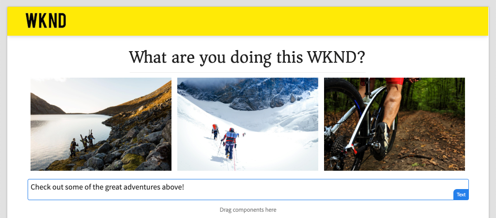
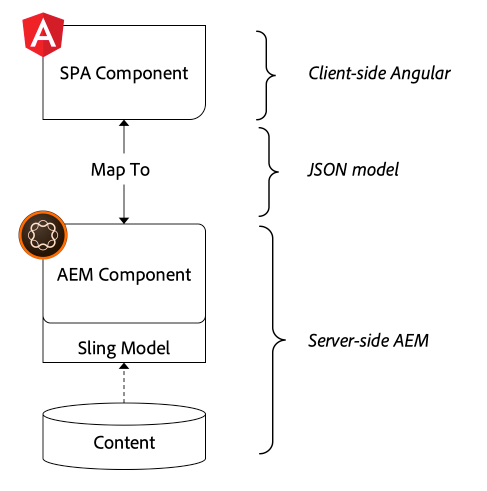
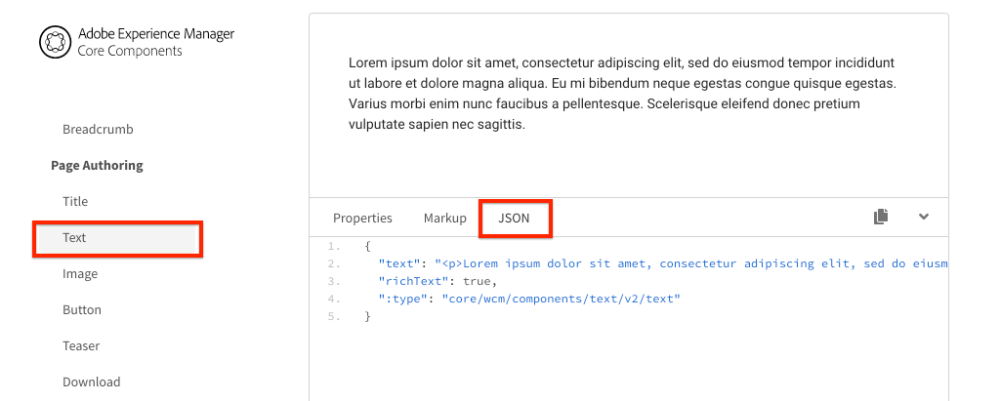

# Asignación de componentes de SPA a componentes de AEM {#map-components}

Obtenga información sobre cómo asignar componentes de Angular a componentes de Adobe Experience Manager (AEM) con el SDK de JS de AEM Editor SPA. La asignación de componentes permite a los usuarios realizar actualizaciones dinámicas de los componentes de SPA dentro del AEM SPA Editor, de forma similar a la creación de AEM tradicional.

Este capítulo profundiza en la API del modelo JSON de AEM y en cómo el contenido JSON expuesto por un componente de AEM se puede insertar automáticamente en un componente de Angular como props.

## Objetivo

1. Obtenga información sobre cómo asignar AEM componentes a SPA componentes.
2. Comprender la diferencia entre **Contenedor** componentes y **Contenido** componentes.
3. Cree un nuevo componente de Angular que se asigne a un componente de AEM existente.

## Qué va a generar

Este capítulo inspeccionará cómo se proporciona `Text` SPA componente está asignado al AEM `Text`componente. Un nuevo `Image` Se creará SPA componente que se puede utilizar en el SPA y crear en AEM. Las funciones predeterminadas de la variable **Contenedor de diseño** y **Editor de plantillas** las políticas también se utilizarán para crear una vista que tenga un aspecto un poco más variado.



## Requisitos previos

Revise las herramientas e instrucciones necesarias para configurar un [entorno de desarrollo local](overview.md#local-dev-environment).

### Obtención del código

1. Descargue el punto de partida para este tutorial mediante Git:

   ```shell
   $ git clone git@github.com:adobe/aem-guides-wknd-spa.git
   $ cd aem-guides-wknd-spa
   $ git checkout Angular/map-components-start
   ```

2. Implemente el código base en una instancia de AEM local mediante Maven:

   ```shell
   $ mvn clean install -PautoInstallSinglePackage
   ```

   Si usa [AEM 6.x](overview.md#compatibility) añada la variable `classic` perfil:

   ```shell
   $ mvn clean install -PautoInstallSinglePackage -Pclassic
   ```

Siempre puede ver el código terminado en [GitHub](https://github.com/adobe/aem-guides-wknd-spa/tree/Angular/map-components-solution) o desproteja el código localmente cambiando a la rama `Angular/map-components-solution`.

## Enfoque de asignación

El concepto básico es asignar un componente SPA a un componente AEM. AEM componentes, ejecute contenido de exportación del lado del servidor como parte de la API del modelo JSON. El contenido JSON lo consume la SPA, que ejecuta el lado del cliente en el explorador. Se crea una asignación 1:1 entre SPA componentes y un componente AEM.



*Resumen general de alto nivel de asignación de un componente AEM a un componente de Angular*

## Inspect del componente de texto

La variable [Tipo de archivo del proyecto AEM](https://github.com/adobe/aem-project-archetype) proporciona un `Text` componente asignado al AEM [Componente de texto](https://experienceleague.adobe.com/docs/experience-manager-core-components/using/components/text.html). Este es un ejemplo de **contenido** componente, en el que se procesa *contenido* de AEM.

Veamos cómo funciona el componente.

### Inspect con el modelo JSON

1. Antes de saltar al código SPA, es importante comprender el modelo JSON que AEM proporciona. Vaya a la [Biblioteca de componentes principales](https://www.aemcomponents.dev/content/core-components-examples/library/core-content/text.html) y vea la página del componente Texto . La biblioteca de componentes principales proporciona ejemplos de todos los componentes principales de AEM.
2. Seleccione el **JSON** para ver uno de los ejemplos:

   

   Debería ver tres propiedades: `text`, `richText`y `:type`.

   `:type` es una propiedad reservada que muestra la variable `sling:resourceType` (o ruta) del componente AEM. El valor de `:type` es lo que se utiliza para asignar el componente AEM al componente SPA.

   `text` y `richText` son propiedades adicionales que se expondrán al componente SPA.

### Inspect del componente Texto

1. Abra un terminal nuevo y vaya a la `ui.frontend` dentro del proyecto. Ejecutar `npm install` y luego `npm start` para iniciar el **servidor de desarrollo de webpack**:

   ```shell
   $ cd ui.frontend
   $ npm run start:mock
   ```

   La variable `ui.frontend` está configurado para usar la variable [modelo JSON de maqueta](./integrate-spa.md#mock-json).

2. Debería ver una nueva ventana del explorador abierta a [http://localhost:4200/content/wknd-spa-angular/us/en/home.html](http://localhost:4200/content/wknd-spa-angular/us/en/home.html)

   

3. En el IDE de su elección, abra el proyecto AEM para el SPA WKND. Expanda el `ui.frontend` y abra el archivo **text.component.ts** under `ui.frontend/src/app/components/text/text.component.ts`:

   

4. El primer área que se debe inspeccionar es la `class TextComponent` en ~line 35:

   ```js
   export class TextComponent {
       @Input() richText: boolean;
       @Input() text: string;
       @Input() itemName: string;
   
       @HostBinding('innerHtml') get content() {
           return this.richText
           ? this.sanitizer.bypassSecurityTrustHtml(this.text)
           : this.text;
       }
       @HostBinding('attr.data-rte-editelement') editAttribute = true;
   
       constructor(private sanitizer: DomSanitizer) {}
   }
   ```

   [@Input()](https://angular.io/api/core/Input) decorator se utiliza para declarar campos cuyos valores se establecen mediante el objeto JSON asignado, revisado anteriormente.

   `@HostBinding('innerHtml') get content()` es un método que expone el contenido de texto creado del valor de `this.text`. En el caso de que el contenido sea texto enriquecido (determinado por la variable `this.richText` (indicador) Se omite la seguridad integrada del Angular. Angular [DomSanitizer](https://angular.io/api/platform-browser/DomSanitizer) se utiliza para &quot;eliminar&quot; el HTML sin procesar y evitar vulnerabilidades de scripts entre sitios. El método está enlazado al `innerHtml` usando la propiedad [@HostBinding](https://angular.io/api/core/HostBinding) decorador.

5. Inspeccione la siguiente `TextEditConfig` en ~line 24:

   ```js
   const TextEditConfig = {
       emptyLabel: 'Text',
       isEmpty: cqModel =>
           !cqModel || !cqModel.text || cqModel.text.trim().length < 1
   };
   ```

   El código anterior es responsable de determinar cuándo procesar el marcador de posición en el entorno de creación de AEM. Si la variable `isEmpty` devuelve el método **true** a continuación, se representa el marcador de posición.

6. Finalmente, eche un vistazo a la `MapTo` llamada a ~line 53:

   ```js
   MapTo('wknd-spa-angular/components/text')(TextComponent, TextEditConfig );
   ```

   **MapTo** es proporcionado por AEM SPA Editor JS SDK (`@adobe/cq-angular-editable-components`). La ruta `wknd-spa-angular/components/text` representa la variable `sling:resourceType` del componente AEM. Esta ruta se corresponde con la variable `:type` expuesto por el modelo JSON observado anteriormente. **MapTo** analiza la respuesta del modelo JSON y pasa los valores correctos a la variable `@Input()` variables del componente SPA.

   Puede encontrar el AEM `Text` definición de componente en `ui.apps/src/main/content/jcr_root/apps/wknd-spa-angular/components/text`.

7. Experimento modificando el **en.model.json** file at `ui.frontend/src/mocks/json/en.model.json`.

   En ~line 62 actualice la primera `Text` para usar un **`H1`** y **`u`** etiquetas:

   ```json
       "text": {
           "text": "<h1><u>Hello World!</u></h1>",
           "richText": true,
           ":type": "wknd-spa-angular/components/text"
       }
   ```

   Vuelva al explorador para ver los efectos que proporciona el **servidor de desarrollo de webpack**:

   

   Intente alternar el `richText` propiedad entre **true** / **false** para ver la lógica de renderización en acción.

8. Inspect **text.component.html** at `ui.frontend/src/app/components/text/text.component.html`.

   Este archivo está vacío, ya que todo el contenido del componente será configurado por el `innerHTML` propiedad.

9. Inspect la variable **app.module.ts** at `ui.frontend/src/app/app.module.ts`.

   ```js
   @NgModule({
   imports: [
       BrowserModule,
       SpaAngularEditableComponentsModule,
       AppRoutingModule
   ],
   providers: [ModelManagerService, { provide: APP_BASE_HREF, useValue: '/' }],
   declarations: [AppComponent, TextComponent, PageComponent, HeaderComponent],
   entryComponents: [TextComponent, PageComponent],
   bootstrap: [AppComponent]
   })
   export class AppModule {}
   ```

   La variable **TextComponent** no se incluye explícitamente, sino dinámicamente mediante **AEMResponsiveGridComponent** proporcionado por el SDK de JS AEM Editor. Por lo tanto, debe incluirse en la lista **app.module.ts**&#39; [entryComponents](https://angular.io/guide/entry-components) matriz.

## Crear el componente de imagen

A continuación, cree un `Image` Componente de angular asignado al AEM [Componente de imagen](https://experienceleague.adobe.com/docs/experience-manager-core-components/using/components/image.html). La variable `Image` es otro ejemplo de **contenido** componente.

### Inspect JSON

Antes de saltar al código SPA, revise el modelo JSON proporcionado por AEM.

1. Vaya a la [Ejemplos de imágenes en la biblioteca de componentes principales](https://www.aemcomponents.dev/content/core-components-examples/library/core-content/image.html).

   

   Propiedades de `src`, `alt`y `title` se utilizará para rellenar el SPA `Image` componente.

   >[!NOTE]
   >
   > Hay otras propiedades de imagen expuestas (`lazyEnabled`, `widths`) que permiten a un desarrollador crear un componente adaptable y de carga diferida. El componente integrado en este tutorial será sencillo y **not** utilice estas propiedades avanzadas.

2. Vuelva a su IDE y abra el `en.model.json` at `ui.frontend/src/mocks/json/en.model.json`. Dado que este es un nuevo componente para nuestro proyecto, necesitamos &quot;burlarnos&quot; del JSON de imagen.

   En ~line 70 agregue una entrada JSON para el `image` modelo (no olvide la coma de cierre) `,` después de la segunda `text_386303036`) y actualice la variable `:itemsOrder` matriz.

   ```json
   ...
   ":items": {
               ...
               "text_386303036": {
                   "text": "<p>A new text component.</p>\r\n",
                   "richText": true,
                   ":type": "wknd-spa-angular/components/text"
                   },
               "image": {
                   "alt": "Rock Climber in New Zealand",
                   "title": "Rock Climber in New Zealand",
                   "src": "/mocks/images/adobestock-140634652.jpeg",
                   ":type": "wknd-spa-angular/components/image"
               }
           },
           ":itemsOrder": [
               "text",
               "text_386303036",
               "image"
           ],
   ```

   El proyecto incluye una imagen de ejemplo en `/mock-content/adobestock-140634652.jpeg` que se utilizará con la variable **servidor de desarrollo de webpack**.

   Puede ver la información completa [en.model.json aquí](https://github.com/adobe/aem-guides-wknd-spa/blob/Angular/map-components-solution/ui.frontend/src/mocks/json/en.model.json).

3. Añada una foto de existencias para que la muestre el componente.

   Cree una nueva carpeta con el nombre **imágenes** below `ui.frontend/src/mocks`. Descargar [adobestock-140634652.jpeg](assets/map-components/adobestock-140634652.jpeg) y colóquelo en la **imágenes** carpeta. Si lo desea, puede usar su propia imagen.

### Implementar el componente Imagen

1. Detenga el **servidor de desarrollo de webpack** si se ha iniciado.
2. Cree un nuevo componente Imagen ejecutando la CLI de Angular `ng generate component` desde dentro `ui.frontend` carpeta:

   ```shell
   $ ng generate component components/image
   ```

3. En el IDE, abra **image.component.ts** at `ui.frontend/src/app/components/image/image.component.ts` y actualice como se indica a continuación:

   ```js
   import {Component, Input, OnInit} from '@angular/core';
   import {MapTo} from '@adobe/cq-angular-editable-components';
   
   const ImageEditConfig = {
   emptyLabel: 'Image',
   isEmpty: cqModel =>
       !cqModel || !cqModel.src || cqModel.src.trim().length < 1
   };
   
   @Component({
   selector: 'app-image',
   templateUrl: './image.component.html',
   styleUrls: ['./image.component.scss']
   })
   export class ImageComponent implements OnInit {
   
   @Input() src: string;
   @Input() alt: string;
   @Input() title: string;
   
   constructor() { }
   
   get hasImage() {
       return this.src && this.src.trim().length > 0;
   }
   
   ngOnInit() { }
   }
   
   MapTo('wknd-spa-angular/components/image')(ImageComponent, ImageEditConfig);
   ```

   `ImageEditConfig` es la configuración para determinar si se va a procesar el marcador de posición de autor en AEM, en función de si la variable `src` se rellena.

   `@Input()` de `src`, `alt`y `title` son las propiedades asignadas desde la API de JSON.

   `hasImage()` es un método que determina si se debe representar la imagen.

   `MapTo` asigna el componente SPA al componente AEM ubicado en `ui.apps/src/main/content/jcr_root/apps/wknd-spa-angular/components/image`.

4. Apertura **image.component.html** y actualícelo de la siguiente manera:

   ```html
   <ng-container *ngIf="hasImage">
       
   </ng-container>
   ```

   Esto procesará el `` element if `hasImage` return **true**.

5. Apertura **image.component.scss** y actualícelo de la siguiente manera:

   ```scss
   :host-context {
       display: block;
   }
   
   .image {
       margin: 1rem 0;
       width: 100%;
       border: 0;
   }
   ```

   >[!NOTE]
   >
   > La variable `:host-context` la regla es **crítico** para que el marcador de posición del editor de SPA de AEM funcione correctamente. Todos los componentes de SPA que se pretenda crear en el editor de páginas de AEM necesitarán esta regla como mínimo.

6. Apertura `app.module.ts` y añada `ImageComponent` a `entryComponents` matriz:

   ```js
   entryComponents: [TextComponent, PageComponent, ImageComponent],
   ```

   Como el `TextComponent`, el `ImageComponent` se carga dinámicamente y debe incluirse en la variable `entryComponents` matriz.

7. Inicie el **servidor de desarrollo de webpack** para ver el `ImageComponent` procesar.

   ```shell
   $ npm run start:mock
   ```

   

   *Imagen añadida a la SPA*

   >[!NOTE]
   >
   > **Desafío de las bonificaciones**: Implemente un nuevo método para mostrar el valor de `title` como un rótulo debajo de la imagen.

## Actualizar directivas en AEM

La variable `ImageComponent` solo está visible en el **servidor de desarrollo de webpack**. A continuación, implemente la SPA actualizada para AEM y actualizar las directivas de plantilla.

1. Detenga el **servidor de desarrollo de webpack** y **root** del proyecto, implemente los cambios en AEM con sus habilidades con Maven:

   ```shell
   $ cd aem-guides-wknd-spa
   $ mvn clean install -PautoInstallSinglePackage
   ```

2. Desde la pantalla Inicio de AEM vaya a **[!UICONTROL Herramientas]** > **[!UICONTROL Plantillas]** > **[WKND SPA Angular](http://localhost:4502/libs/wcm/core/content/sites/templates.html/conf/wknd-spa-angular)**.

   Seleccione y edite el **Página SPA**:

   

3. Seleccione el **Contenedor de diseño** y haga clic en ella **directiva** para editar la directiva:

   

4. En **Componentes permitidos** > **Angular de SPA WKND: contenido** > marque la **Imagen** componente:

   

   En **Componentes predeterminados** > **Añadir asignación** y seleccione **Imagen: WKND SPA Angular - Contenido** componente:

   

   Escriba un **tipo mime** de `image/*`.

   Haga clic en **Listo** para guardar las actualizaciones de directiva.

5. En el **Contenedor de diseño** haga clic en **directiva** para **Texto** componente:

   

   Cree una nueva directiva con el nombre **WKND SPA texto**. En **Complementos** > **Formato** > marque todas las casillas para activar opciones de formato adicionales:

   

   En **Complementos** > **Estilos de párrafo** > marque la casilla para **Habilitar estilos de párrafo**:

   

   Haga clic en **Listo** para guardar la actualización de directiva.

6. Vaya a la **Página principal** [http://localhost:4502/editor.html/content/wknd-spa-angular/us/en/home.html](http://localhost:4502/editor.html/content/wknd-spa-angular/us/en/home.html).

   También debe poder editar la variable `Text` componente y añadir estilos de párrafo adicionales en **pantalla completa** en el menú contextual.

   

7. También debe poder arrastrar y soltar una imagen desde el **Buscador de recursos**:

   

8. Añada sus propias imágenes mediante [AEM Assets](http://localhost:4502/assets.html/content/dam) o instalar la base de código finalizada para el estándar [Sitio de referencia WKND](https://github.com/adobe/aem-guides-wknd/releases/latest). La variable [Sitio de referencia WKND](https://github.com/adobe/aem-guides-wknd/releases/latest) incluye muchas imágenes que se pueden reutilizar en el SPA WKND. El paquete se puede instalar mediante [Administrador de paquetes AEM](http://localhost:4502/crx/packmgr/index.jsp).

   

## Inspect: contenedor de diseño

Compatibilidad con **Contenedor de diseño** es proporcionado automáticamente por AEM SPA Editor SDK. La variable **Contenedor de diseño**, como se indica con el nombre, es un **container** componente. Los componentes de contenedor son componentes que aceptan estructuras JSON que representan *other* y cree instancias de ellos de forma dinámica.

Inspeccionemos más el contenedor de diseño.

1. En el IDE, abra **adaptable-grid.component.ts** at `ui.frontend/src/app/components/responsive-grid`:

   ```js
   import { AEMResponsiveGridComponent,MapTo } from '@adobe/cq-angular-editable-components';
   
   MapTo('wcm/foundation/components/responsivegrid')(AEMResponsiveGridComponent);
   ```

   La variable `AEMResponsiveGridComponent` se implementa como parte del SDK AEM SPA Editor y se incluye en el proyecto mediante `import-components`.

2. En un navegador, vaya a [http://localhost:4502/content/wknd-spa-angular/us/en.model.json](http://localhost:4502/content/wknd-spa-angular/us/en.model.json)

   

   La variable **Contenedor de diseño** tiene un `sling:resourceType` de `wcm/foundation/components/responsivegrid` y es reconocido por el SPA Editor usando la variable `:type` como la `Text` y `Image` componentes.

   Las mismas capacidades para cambiar el tamaño de un componente mediante [Modo de diseño](https://experienceleague.adobe.com/docs/experience-manager-65/authoring/siteandpage/responsive-layout.html#defining-layouts-layout-mode) están disponibles con SPA Editor.

3. Volver a [http://localhost:4502/editor.html/content/wknd-spa-angular/us/en/home.html](http://localhost:4502/editor.html/content/wknd-spa-angular/us/en/home.html). Agregar adicional **Imagen** e intente cambiar el tamaño de los componentes mediante el **Diseño** opción:

   

4. Vuelva a abrir el modelo JSON [http://localhost:4502/content/wknd-spa-angular/us/en.model.json](http://localhost:4502/content/wknd-spa-angular/us/en.model.json) y observe la `columnClassNames` como parte del JSON:

   

   El nombre de clase `aem-GridColumn--default--4` indica que el componente debe tener 4 columnas de ancho en función de una cuadrícula de 12 columnas. Más detalles sobre [la cuadrícula interactiva se puede encontrar aquí](https://adobe-marketing-cloud.github.io/aem-responsivegrid/).

5. Vuelva al IDE y en el `ui.apps` hay una biblioteca del lado del cliente definida en `ui.apps/src/main/content/jcr_root/apps/wknd-spa-angular/clientlibs/clientlib-grid`. Abra el archivo `less/grid.less`.

   Este archivo determina los puntos de interrupción (`default`, `tablet`y `phone`) que usa el **Contenedor de diseño**. Este archivo está diseñado para personalizarse según las especificaciones del proyecto. Actualmente, los puntos de interrupción están establecidos en `1200px` y `650px`.

6. Debe poder utilizar las capacidades de respuesta y las políticas de texto enriquecido actualizadas de la variable `Text` para crear una vista como la siguiente:

   

## Felicitaciones! {#congratulations}

Enhorabuena, ha aprendido a asignar SPA componentes a los componentes de AEM y ha implementado un nuevo `Image` componente. También tiene la oportunidad de explorar las capacidades de respuesta del **Contenedor de diseño**.

Siempre puede ver el código terminado en [GitHub](https://github.com/adobe/aem-guides-wknd-spa/tree/Angular/map-components-solution) o desproteja el código localmente cambiando a la rama `Angular/map-components-solution`.

### Siguientes pasos {#next-steps}

[Navegación y enrutamiento](navigation-routing.md) : Aprenda cómo se pueden admitir varias vistas de la SPA asignando páginas AEM con el SDK del Editor de SPA. La navegación dinámica se implementa mediante el enrutador de Angular y se agrega a un componente de encabezado existente.

## Bonus: Persistir configuraciones en el control de código fuente {#bonus}

En muchos casos, especialmente al principio de un proyecto AEM, es importante mantener las configuraciones, como las plantillas y las políticas de contenido relacionadas, para el control de código fuente. Esto garantiza que todos los desarrolladores trabajen con el mismo conjunto de contenido y configuraciones, y puede garantizar una coherencia adicional entre entornos. Una vez que un proyecto alcanza un cierto nivel de madurez, la práctica de administrar plantillas se puede transferir a un grupo especial de usuarios avanzados.

Los siguientes pasos se llevarán a cabo utilizando el IDE de código de Visual Studio y [VSCode AEM Sync](https://marketplace.visualstudio.com/items?itemName=yamato-ltd.vscode-aem-sync) pero podría estar utilizando cualquier herramienta y cualquier IDE que haya configurado **extraer** o **importar** contenido de una instancia local de AEM.

1. En el IDE de código de Visual Studio, asegúrese de que tiene **VSCode AEM Sync** instalado mediante la extensión de Marketplace:

   

2. Expanda el **ui.content** en el explorador de proyectos y vaya a `/conf/wknd-spa-angular/settings/wcm/templates`.

3. **Clic con el botón derecho** el `templates` carpeta y seleccione **Importar desde AEM servidor**:

   

4. Repita los pasos para importar contenido, pero seleccione la opción **políticas** carpeta ubicada en `/conf/wknd-spa-angular/settings/wcm/policies`.

5. Inspect la variable `filter.xml` archivo ubicado en `ui.content/src/main/content/META-INF/vault/filter.xml`.

   ```xml
   <!--ui.content filter.xml-->
   <?xml version="1.0" encoding="UTF-8"?>
    <workspaceFilter version="1.0">
        <filter root="/conf/wknd-spa-angular" mode="merge"/>
        <filter root="/content/wknd-spa-angular" mode="merge"/>
        <filter root="/content/dam/wknd-spa-angular" mode="merge"/>
        <filter root="/content/experience-fragments/wknd-spa-angular" mode="merge"/>
    </workspaceFilter>
   ```

   La variable `filter.xml` es responsable de identificar las rutas de los nodos que se instalarán con el paquete. Observe que `mode="merge"` en cada uno de los filtros que indica que el contenido existente no se modificará, solo se añadirá contenido nuevo. Dado que los autores de contenido pueden estar actualizando estas rutas, es importante que una implementación de código **not** sobrescribir contenido. Consulte la [Documentación de FileVault](https://jackrabbit.apache.org/filevault/filter.html) para obtener más información sobre cómo trabajar con elementos de filtro.

   Comparar `ui.content/src/main/content/META-INF/vault/filter.xml` y `ui.apps/src/main/content/META-INF/vault/filter.xml` para comprender los diferentes nodos administrados por cada módulo.
