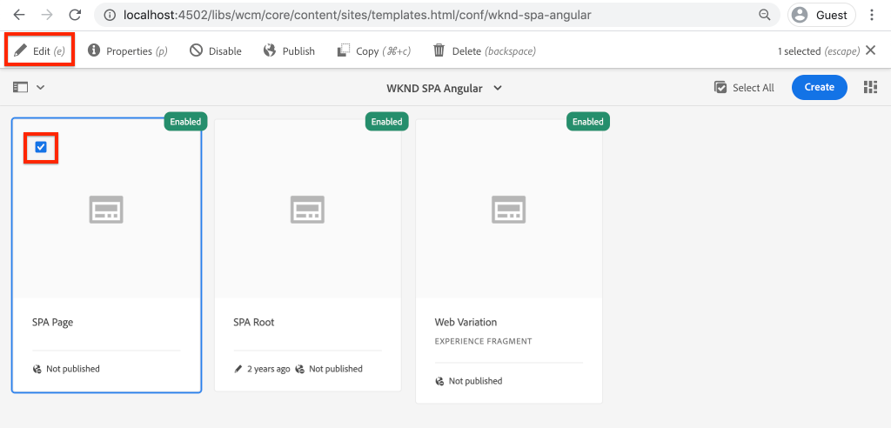

# SPA AEM Asignación de componentes de a componentes de {#map-components}

Obtenga información sobre cómo asignar componentes de Angular a componentes de Adobe Experience Manager AEM AEM SPA () con el SDK de JS de Editor de. SPA AEM SPA AEM La asignación de componentes permite a los usuarios realizar actualizaciones dinámicas en los componentes de la de componentes del Editor de componentes, de forma similar a la creación tradicional de los componentes de la.

AEM AEM En este capítulo se profundiza en la API del modelo JSON de y en cómo el contenido JSON expuesto por un componente de la se puede insertar automáticamente en un componente de Angular como props.

## Objetivo

1. AEM SPA Obtenga información sobre cómo asignar componentes de la a componentes de la aplicación.
2. Comprender la diferencia entre **Contenedor** componentes y **Contenido** componentes.
3. Cree un nuevo componente de Angular AEM que se asigne a un componente de existente.

## Qué va a generar

En este capítulo se analizará la forma en que se proporciona el `Text` SPA AEM El componente se asigna a la `Text`componente. Un nuevo `Image` SPA SPA AEM Se crea un componente de que se puede utilizar en la y crear en la misma. Funciones listas para usar del **Contenedor de diseño** y **Editor de plantillas** las directivas también se utilizarán para crear una vista que sea un poco más variada en apariencia.


## Requisitos previos

Revise las herramientas y las instrucciones necesarias para configurar una [entorno de desarrollo local](overview.md#local-dev-environment).

### Obtener el código

1. Descargue el punto de partida para este tutorial mediante Git:

   ```shell
   $ git clone git@github.com:adobe/aem-guides-wknd-spa.git
   $ cd aem-guides-wknd-spa
   $ git checkout Angular/map-components-start
   ```

2. AEM Implemente el código base en una instancia de local mediante Maven:

   ```shell
   $ mvn clean install -PautoInstallSinglePackage
   ```

   Si se usa [AEM.x](overview.md#compatibility) añada el `classic` perfil:

   ```shell
   $ mvn clean install -PautoInstallSinglePackage -Pclassic
   ```

Siempre puede ver el código terminado en [GitHub](https://github.com/adobe/aem-guides-wknd-spa/tree/Angular/map-components-solution) o compruebe el código localmente cambiando a la rama `Angular/map-components-solution`.

## Método de asignación

SPA AEM El concepto básico es asignar un componente de a un componente de. AEM Los componentes de, que ejecutan del lado del servidor, exportan contenido como parte de la API del modelo JSON. SPA El contenido JSON lo consume el usuario, que se ejecuta en el lado del cliente en el explorador. SPA AEM Se crea una asignación 1:1 entre los componentes de la y un componente de la.


*AEM Información general de alto nivel sobre la asignación de un componente de a un componente de Angular*

## Inspect el componente Texto

El [AEM Tipo de archivo del proyecto](https://github.com/adobe/aem-project-archetype) proporciona un `Text` AEM componente asignado al componente de la lista de componentes de la [Componente Texto](https://experienceleague.adobe.com/docs/experience-manager-core-components/using/components/text.html). Este es un ejemplo de **content** componente, ya que se procesa *content* AEM de la.

Veamos cómo funciona el componente.

### Inspect el modelo JSON

1. SPA AEM Antes de saltar al código de la, es importante comprender el modelo JSON que proporciona el usuario de la interfaz de usuario de JSON de la que se proporciona la aplicación. Vaya a [Biblioteca de componentes principales](https://www.aemcomponents.dev/content/core-components-examples/library/core-content/text.html) y vea la página del componente Texto. AEM La biblioteca de componentes principales proporciona ejemplos de todos los componentes principales de la.
2. Seleccione el **JSON** para ver uno de los ejemplos:

   

   Debe ver tres propiedades: `text`, `richText`, y `:type`.

   `:type` es una propiedad reservada que enumera las `sling:resourceType` AEM (o ruta) del componente de. El valor de `:type` AEM SPA es lo que se utiliza para asignar el componente de la al componente de la.

   `text` y `richText` SPA son propiedades adicionales que se exponen al componente de la.

### Inspect el componente Texto

1. Abra un terminal nuevo y vaya al `ui.frontend` carpeta dentro del proyecto. Ejecutar `npm install` y luego `npm start` para iniciar el **servidor de desarrollo de webpack**:

   ```shell
   $ cd ui.frontend
   $ npm run start:mock
   ```

   El `ui.frontend` El módulo está configurado actualmente para utilizar [modelo JSON ficticio](./integrate-spa.md#mock-json).

2. Debería ver una nueva ventana del explorador abierta a [http://localhost:4200/content/wknd-spa-angular/us/en/home.html](http://localhost:4200/content/wknd-spa-angular/us/en/home.html)

   

3. AEM SPA En el IDE de su elección, abra el Proyecto de para el WKND. Expanda el `ui.frontend` y abra el archivo. **text.component.ts** bajo `ui.frontend/src/app/components/text/text.component.ts`:

   

4. El primer área a inspeccionar es la `class TextComponent` en ~line 35:

   ```js
   export class TextComponent {
       @Input() richText: boolean;
       @Input() text: string;
       @Input() itemName: string;
   
       @HostBinding('innerHtml') get content() {
           return this.richText
           ? this.sanitizer.bypassSecurityTrustHtml(this.text)
           : this.text;
       }
       @HostBinding('attr.data-rte-editelement') editAttribute = true;
   
       constructor(private sanitizer: DomSanitizer) {}
   }
   ```

   [@Input()](https://angular.io/api/core/Input) decorador se utiliza para declarar campos cuyos valores se establecen mediante el objeto JSON asignado, revisado anteriormente.

   `@HostBinding('innerHtml') get content()` es un método que expone el contenido de texto creado a partir del valor de `this.text`. En caso de que el contenido sea texto enriquecido (determinado por la variable `this.richText` Indicador) Se omite la seguridad integrada del Angular. Angular [DomSanitizer](https://angular.io/api/platform-browser/DomSanitizer) se utiliza para &quot;eliminar&quot; el HTML sin procesar y evitar vulnerabilidades de ejecución de scripts en sitios múltiples. El método está enlazado a `innerHtml` propiedad mediante el [@HostBinding](https://angular.io/api/core/HostBinding) decorador.

5. A continuación, inspeccione el `TextEditConfig` en ~line 24:

   ```js
   const TextEditConfig = {
       emptyLabel: 'Text',
       isEmpty: cqModel =>
           !cqModel || !cqModel.text || cqModel.text.trim().length < 1
   };
   ```

   AEM El código anterior es responsable de determinar cuándo procesar el marcador de posición en el entorno de autor de la. Si la variable `isEmpty` método devuelve **true** a continuación, se representa el marcador de posición.

6. Por último, eche un vistazo a la `MapTo` llamada en ~line 53:

   ```js
   MapTo('wknd-spa-angular/components/text')(TextComponent, TextEditConfig );
   ```

   **MapTo** AEM SPA es proporcionado por el SDK de JS del Editor de (`@adobe/cq-angular-editable-components`). La ruta `wknd-spa-angular/components/text` representa el `sling:resourceType` AEM del componente de la. Esta ruta coincide con el `:type` expuesto por el modelo JSON observado anteriormente. **MapTo** analiza la respuesta del modelo JSON y pasa los valores correctos a `@Input()` SPA variables del componente de la.

   AEM Puede encontrar la `Text` definición del componente en `ui.apps/src/main/content/jcr_root/apps/wknd-spa-angular/components/text`.

7. Experimente modificando el **en.model.json** archivo en `ui.frontend/src/mocks/json/en.model.json`.

   En ~line 62 actualice la primera `Text` valor para utilizar un **`H1`** y **`u`** etiquetas:

   ```json
       "text": {
           "text": "<h1><u>Hello World!</u></h1>",
           "richText": true,
           ":type": "wknd-spa-angular/components/text"
       }
   ```

   Vuelva al explorador para ver los efectos que produce el **servidor de desarrollo de webpack**:

   

   Intente cambiar el `richText` propiedad entre **true** / **false** para ver la lógica de procesamiento en acción.

8. Inspect **text.component.html** en `ui.frontend/src/app/components/text/text.component.html`.

   Este archivo está vacío, ya que todo el contenido del componente lo establece el `innerHTML` propiedad.

9. Inspect el **app.module.ts** en `ui.frontend/src/app/app.module.ts`.

   ```js
   @NgModule({
   imports: [
       BrowserModule,
       SpaAngularEditableComponentsModule,
       AppRoutingModule
   ],
   providers: [ModelManagerService, { provide: APP_BASE_HREF, useValue: '/' }],
   declarations: [AppComponent, TextComponent, PageComponent, HeaderComponent],
   entryComponents: [TextComponent, PageComponent],
   bootstrap: [AppComponent]
   })
   export class AppModule {}
   ```

   El **TextComponent** no se incluye explícitamente, sino de forma dinámica mediante **AEMResponsiveGridComponent** AEM SPA proporcionado por el SDK de JS de Editor de. Por lo tanto, debe aparecer en la **app.module.ts**&#39; [entryComponents](https://angular.io/guide/entry-components) matriz.

## Creación del componente de imagen

A continuación, cree un `Image` Componente de angular AEM asignado a la [Componente de imagen](https://experienceleague.adobe.com/docs/experience-manager-core-components/using/components/image.html?lang=es). El `Image` Este componente es otro ejemplo de **content** componente.

### Inspect el JSON

SPA AEM Antes de saltar al código de la, revise el modelo JSON proporcionado por el administrador de códigos de.

1. Vaya a [Ejemplos de imágenes en la biblioteca de componentes principales](https://www.aemcomponents.dev/content/core-components-examples/library/core-content/image.html).

   

   Propiedades de `src`, `alt`, y `title` SPA se utilizan para rellenar la `Image` componente.

   >[!NOTE]
   >
   > Hay otras propiedades de imagen expuestas (`lazyEnabled`, `widths`) que permiten a un desarrollador crear un componente de carga diferida y adaptable. El componente integrado en este tutorial es sencillo y tiene **no** utilice estas propiedades avanzadas.

2. Vuelva al IDE y abra el `en.model.json` en `ui.frontend/src/mocks/json/en.model.json`. Dado que este es un nuevo componente para nuestro proyecto, necesitamos &quot;burlarnos&quot; del JSON de imagen.

   En ~line 70 añada una entrada JSON para `image` modelo (no se olvide de la coma final `,` después del segundo `text_386303036`) y actualice el `:itemsOrder` matriz.

   ```json
   ...
   ":items": {
               ...
               "text_386303036": {
                   "text": "<p>A new text component.</p>\r\n",
                   "richText": true,
                   ":type": "wknd-spa-angular/components/text"
                   },
               "image": {
                   "alt": "Rock Climber in New Zealand",
                   "title": "Rock Climber in New Zealand",
                   "src": "/mocks/images/adobestock-140634652.jpeg",
                   ":type": "wknd-spa-angular/components/image"
               }
           },
           ":itemsOrder": [
               "text",
               "text_386303036",
               "image"
           ],
   ```

   El proyecto incluye una imagen de muestra en `/mock-content/adobestock-140634652.jpeg` que se utiliza con el **servidor de desarrollo de webpack**.

   Puede ver la información completa [en.model.json aquí](https://github.com/adobe/aem-guides-wknd-spa/blob/Angular/map-components-solution/ui.frontend/src/mocks/json/en.model.json).

3. Añada una foto estándar para que la muestre el componente.

   Cree una nueva carpeta llamada **imágenes** debajo `ui.frontend/src/mocks`. Descargar [adobestock-140634652.jpeg](assets/map-components/adobestock-140634652.jpeg) y colóquelo en el recién creado **imágenes** carpeta. Siéntase libre de usar su propia imagen, si lo desea.

### Implementación del componente de imagen

1. Detenga el **servidor de desarrollo de webpack** si se ha iniciado.
2. Cree un nuevo componente de imagen ejecutando la CLI de Angular `ng generate component` comando desde `ui.frontend` carpeta:

   ```shell
   $ ng generate component components/image
   ```

3. En el IDE, abra **image.component.ts** en `ui.frontend/src/app/components/image/image.component.ts` y actualícelo como se indica a continuación:

   ```js
   import {Component, Input, OnInit} from '@angular/core';
   import {MapTo} from '@adobe/cq-angular-editable-components';
   
   const ImageEditConfig = {
   emptyLabel: 'Image',
   isEmpty: cqModel =>
       !cqModel || !cqModel.src || cqModel.src.trim().length < 1
   };
   
   @Component({
   selector: 'app-image',
   templateUrl: './image.component.html',
   styleUrls: ['./image.component.scss']
   })
   export class ImageComponent implements OnInit {
   
   @Input() src: string;
   @Input() alt: string;
   @Input() title: string;
   
   constructor() { }
   
   get hasImage() {
       return this.src && this.src.trim().length > 0;
   }
   
   ngOnInit() { }
   }
   
   MapTo('wknd-spa-angular/components/image')(ImageComponent, ImageEditConfig);
   ```

   `ImageEditConfig` AEM es la configuración para determinar si se debe representar el marcador de posición del autor en el código de tiempo, en función de si la variable `src` La propiedad se ha rellenado.

   `@Input()` de `src`, `alt`, y `title` son las propiedades asignadas desde la API de JSON.

   `hasImage()` es un método que determinará si se debe procesar la imagen.

   `MapTo` SPA AEM asigna el componente de la al componente de la ubicado en `ui.apps/src/main/content/jcr_root/apps/wknd-spa-angular/components/image`.

4. Abrir **image.component.html** y actualícelo como se indica a continuación:

   ```html
   <ng-container *ngIf="hasImage">
       
   </ng-container>
   ```

   Esto procesará el `` element if `hasImage` devoluciones **true**.

5. Abrir **image.component.scss** y actualícelo como se indica a continuación:

   ```scss
   :host-context {
       display: block;
   }
   
   .image {
       margin: 1rem 0;
       width: 100%;
       border: 0;
   }
   ```

   >[!NOTE]
   >
   > El `:host-context` la regla es **crítico** AEM SPA para que el marcador de posición del editor de funcione correctamente. SPA AEM Todos los componentes de la que se vayan a crear en el editor de páginas de la página necesitarán esta regla como mínimo.

6. Abrir `app.module.ts` y añada el `ImageComponent` a la `entryComponents` matriz:

   ```js
   entryComponents: [TextComponent, PageComponent, ImageComponent],
   ```

   Como el `TextComponent`, el `ImageComponent` se carga dinámicamente y debe incluirse en el `entryComponents` matriz.

7. Inicie el **servidor de desarrollo de webpack** para ver la `ImageComponent` procesar.

   ```shell
   $ npm run start:mock
   ```

   

   *SPA Imagen agregada al recurso de la*

   >[!NOTE]
   >
   > **Desafío extra**: Implemente un nuevo método para mostrar el valor de `title` como pie de ilustración debajo de la imagen.

## AEM Actualizar directivas en el

El `ImageComponent` El componente solo es visible en **servidor de desarrollo de webpack**. SPA AEM A continuación, implemente la plantilla actualizada para implementar y actualizar las directivas de la plantilla.

1. Detenga el **servidor de desarrollo de webpack** y desde el **raíz** AEM Del proyecto, implemente los cambios para utilizar las habilidades de Maven en la implementación de los siguientes elementos:

   ```shell
   $ cd aem-guides-wknd-spa
   $ mvn clean install -PautoInstallSinglePackage
   ```

2. AEM En la pantalla Inicio de la, vaya a **[!UICONTROL Herramientas]** > **[!UICONTROL Plantillas]** > **[SPA ANGULAR DE WKND](http://localhost:4502/libs/wcm/core/content/sites/templates.html/conf/wknd-spa-angular)**.

   Seleccione y edite el **SPA Página de**:

   

3. Seleccione el **Contenedor de diseño** y haga clic en su **directiva** para editar la directiva:

   

4. En **Componentes permitidos** > **SPA Angular de WKND: contenido** > consulte la **Imagen** componente:

   

   En **Componentes predeterminados** > **Añadir asignación** y elija la **SPA Imagen - Angular de WKND - Contenido** componente:

   

   Introduzca una **tipo MIME** de `image/*`.

   Clic **Listo** para guardar las actualizaciones de directivas.

5. En el **Contenedor de diseño** haga clic en **directiva** para el **Texto** componente:

   

   Cree una nueva directiva denominada **SPA Texto de WKND**. En **Complementos** > **Formato** > marque todas las casillas para habilitar opciones de formato adicionales:

   

   En **Complementos** > **Estilos de párrafo** > marque la casilla para **Activar estilos de párrafo**:

   

   Clic **Listo** para guardar la actualización de la directiva.

6. Vaya a **Homepage** [http://localhost:4502/editor.html/content/wknd-spa-angular/us/en/home.html](http://localhost:4502/editor.html/content/wknd-spa-angular/us/en/home.html).

   También debería poder editar la variable `Text` y agregar estilos de párrafo adicionales en **pantalla completa** modo.

   

7. También debe poder arrastrar y soltar una imagen desde el **Buscador de recursos**:

   

8. Añada sus propias imágenes mediante [AEM Assets](http://localhost:4502/assets.html/content/dam) o instale el código final base para el estándar [Sitio de referencia de WKND](https://github.com/adobe/aem-guides-wknd/releases/latest). El [Sitio de referencia de WKND](https://github.com/adobe/aem-guides-wknd/releases/latest) SPA incluye muchas imágenes que se pueden reutilizar en la interfaz de usuario de. El paquete se puede instalar utilizando [AEM Administrador de paquetes](http://localhost:4502/crx/packmgr/index.jsp).

   

## Inspect el contenedor de diseño

Compatibilidad con el **Contenedor de diseño** AEM SPA es proporcionado automáticamente por el SDK de Editor de. El **Contenedor de diseño**, como indica su nombre, es un **contenedor** componente. Los componentes de contenedor son componentes que aceptan estructuras JSON que representan *otro* componentes y crearlos dinámicamente.

Vamos a inspeccionar más el contenedor de diseño.

1. En el IDE, abra **responsive-grid.component.ts** en `ui.frontend/src/app/components/responsive-grid`:

   ```js
   import { AEMResponsiveGridComponent,MapTo } from '@adobe/cq-angular-editable-components';
   
   MapTo('wcm/foundation/components/responsivegrid')(AEMResponsiveGridComponent);
   ```

   El `AEMResponsiveGridComponent` AEM SPA se implementa como parte del SDK del Editor de código de la y se incluye en el proyecto mediante `import-components`.

2. En un explorador, vaya a [http://localhost:4502/content/wknd-spa-angular/us/en.model.json](http://localhost:4502/content/wknd-spa-angular/us/en.model.json)

   

   El **Contenedor de diseño** el componente tiene un `sling:resourceType` de `wcm/foundation/components/responsivegrid` SPA y es reconocido por el Editor de la mediante el `:type` propiedad, al igual que el `Text` y `Image` componentes.

   Las mismas capacidades para cambiar el tamaño de un componente mediante [Modo de diseño](https://experienceleague.adobe.com/docs/experience-manager-65/authoring/siteandpage/responsive-layout.html#defining-layouts-layout-mode) SPA están disponibles con el Editor de.

3. Volver a [http://localhost:4502/editor.html/content/wknd-spa-angular/us/en/home.html](http://localhost:4502/editor.html/content/wknd-spa-angular/us/en/home.html). Añadir más **Imagen** componentes e intente cambiar su tamaño con el **Diseño** opción:

   

4. Vuelva a abrir el modelo JSON [http://localhost:4502/content/wknd-spa-angular/us/en.model.json](http://localhost:4502/content/wknd-spa-angular/us/en.model.json) y observe la `columnClassNames` como parte del JSON:

   

   El nombre de la clase `aem-GridColumn--default--4` indica que el componente debe tener 4 columnas de ancho en función de una cuadrícula de 12 columnas. Más detalles acerca de [cuadrícula adaptable se puede encontrar aquí](https://adobe-marketing-cloud.github.io/aem-responsivegrid/).

5. Vuelva al IDE y, en el `ui.apps` : hay una biblioteca del lado del cliente definida en `ui.apps/src/main/content/jcr_root/apps/wknd-spa-angular/clientlibs/clientlib-grid`. Abra el archivo `less/grid.less`.

   Este archivo determina los puntos de interrupción (`default`, `tablet`, y `phone`) utilizado por el **Contenedor de diseño**. El propósito de este archivo es personalizarlo según las especificaciones del proyecto. Actualmente los puntos de interrupción están configurados en `1200px` y `650px`.

6. Debe poder utilizar las capacidades adaptables y las políticas de texto enriquecido actualizadas del `Text` para crear una vista como la siguiente:

   

## Enhorabuena. {#congratulations}

SPA AEM ¡Enhorabuena! Ha aprendido a asignar componentes de la a componentes y ha implementado un nuevo `Image` componente. También tiene la oportunidad de explorar las capacidades de respuesta de **Contenedor de diseño**.

Siempre puede ver el código terminado en [GitHub](https://github.com/adobe/aem-guides-wknd-spa/tree/Angular/map-components-solution) o compruebe el código localmente cambiando a la rama `Angular/map-components-solution`.

### Siguientes pasos {#next-steps}

[Navegación y enrutamiento](navigation-routing.md) SPA AEM SPA : Descubra cómo se pueden admitir varias vistas en la asignando a páginas de la página con el SDK de Editor de la página de la página de la página de la aplicación de la versión de la aplicación. La navegación dinámica se implementa mediante Angular Router y se añade a un componente de encabezado existente.

## Bonificación: mantener configuraciones para el control de código fuente {#bonus}

AEM En muchos casos, especialmente al principio de un proyecto de, es importante mantener las configuraciones, como las plantillas y las directivas de contenido relacionadas, para el control de código fuente. Esto garantiza que todos los desarrolladores trabajen con el mismo conjunto de contenido y configuraciones y puede garantizar una coherencia adicional entre entornos. Una vez que un proyecto alcanza un cierto nivel de madurez, la práctica de administrar plantillas se puede transferir a un grupo especial de usuarios avanzados.

Los siguientes pasos se realizarán mediante el IDE de código de Visual Studio y [AEM Sincronización de VSCode con la](https://marketplace.visualstudio.com/items?itemName=yamato-ltd.vscode-aem-sync) pero podría estar utilizando cualquier herramienta y cualquier IDE que haya configurado para **extraer** o **importar** AEM contenido de una instancia local de.

1. En el IDE de código de Visual Studio, asegúrese de que tiene **AEM Sincronización de VSCode con la** instalado mediante la extensión Marketplace:

   

2. Expanda el **ui.content** en el Explorador de proyectos y vaya a `/conf/wknd-spa-angular/settings/wcm/templates`.

3. **Haga clic con el botón derecho** el `templates` carpeta y seleccione **AEM Importar desde servidor de**:

   

4. Repita los pasos para importar contenido, pero seleccione **directivas** carpeta ubicada en `/conf/wknd-spa-angular/settings/wcm/policies`.

5. Inspect el `filter.xml` archivo ubicado en `ui.content/src/main/content/META-INF/vault/filter.xml`.

   ```xml
   <!--ui.content filter.xml-->
   <?xml version="1.0" encoding="UTF-8"?>
    <workspaceFilter version="1.0">
        <filter root="/conf/wknd-spa-angular" mode="merge"/>
        <filter root="/content/wknd-spa-angular" mode="merge"/>
        <filter root="/content/dam/wknd-spa-angular" mode="merge"/>
        <filter root="/content/experience-fragments/wknd-spa-angular" mode="merge"/>
    </workspaceFilter>
   ```

   El `filter.xml` es responsable de identificar las rutas de los nodos que se instalan con el paquete. Observe el `mode="merge"` en cada uno de los filtros que indica que el contenido existente no se modificará, solo se añade contenido nuevo. Dado que los autores de contenido pueden estar actualizando estas rutas, es importante que la implementación de código haga lo siguiente **no** sobrescribir contenido. Consulte la [Documentación de FileVault](https://jackrabbit.apache.org/filevault/filter.html) para obtener más información sobre cómo trabajar con elementos de filtro.

   Comparar `ui.content/src/main/content/META-INF/vault/filter.xml` y `ui.apps/src/main/content/META-INF/vault/filter.xml` para comprender los diferentes nodos administrados por cada módulo.
