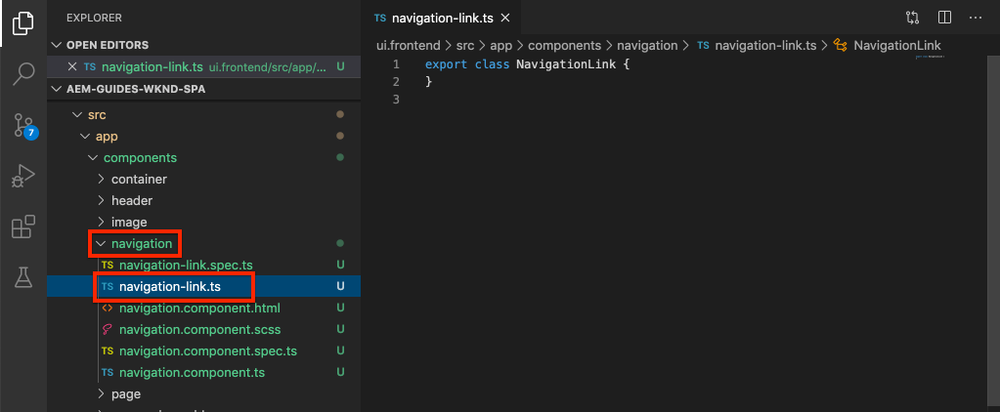

# Agregar navegación y enrutamiento {#navigation-routing}

Descubra cómo se admiten varias vistas de la SPA mediante AEM Pages y el SDK de SPA Editor. La navegación dinámica se implementa mediante rutas de Angular y se agrega a un componente de encabezado existente.

## Objetivo

1. Comprender las opciones de enrutamiento del modelo de SPA disponibles al utilizar el SPA Editor.
2. Aprenda a utilizar [enrutamiento de Angular](https://angular.io/guide/router) para navegar entre diferentes vistas de la SPA.
3. Implemente una navegación dinámica controlada por la jerarquía de páginas AEM.

## Qué va a generar

En este capítulo se agrega un menú de navegación a un componente `Header` existente. El menú de navegación está impulsado por la jerarquía de páginas AEM y utiliza el modelo JSON proporcionado por el [Componente principal de navegación](https://docs.adobe.com/content/help/en/experience-manager-core-components/using/components/navigation.html).


## Requisitos previos

Revise las herramientas e instrucciones necesarias para configurar un [entorno de desarrollo local](overview.md#local-dev-environment).

### Obtención del código

1. Descargue el punto de partida para este tutorial mediante Git:

   ```shell
   $ git clone git@github.com:adobe/aem-guides-wknd-spa.git
   $ cd aem-guides-wknd-spa
   $ git checkout Angular/navigation-routing-start
   ```

2. Implemente el código base en una instancia de AEM local mediante Maven:

   ```shell
   $ mvn clean install -PautoInstallSinglePackage
   ```

   Si utiliza [AEM 6.x](overview.md#compatibility), añada el perfil `classic`:

   ```shell
   $ mvn clean install -PautoInstallSinglePackage -Pclassic
   ```

3. Instale el paquete terminado para el sitio de referencia tradicional [WKND](https://github.com/adobe/aem-guides-wknd/releases/latest). Las imágenes proporcionadas por [WKND reference site](https://github.com/adobe/aem-guides-wknd/releases/latest) se reutilizarán en la SPA WKND. El paquete se puede instalar utilizando [AEM Package Manager](http://localhost:4502/crx/packmgr/index.jsp).

   

Siempre puede ver el código terminado en [GitHub](https://github.com/adobe/aem-guides-wknd-spa/tree/Angular/navigation-routing-solution) o extraer el código localmente cambiando a la rama `Angular/navigation-routing-solution`.

## Actualizaciones de HeaderComponent de Inspect {#inspect-header}

En capítulos anteriores, el componente `HeaderComponent` se añadió como componente de Angular puro incluido mediante `app.component.html`. En este capítulo, el componente `HeaderComponent` se elimina de la aplicación y se añade mediante el [Editor de plantillas](https://docs.adobe.com/content/help/en/experience-manager-learn/sites/page-authoring/template-editor-feature-video-use.html). Esto permite a los usuarios configurar el menú de navegación de `HeaderComponent` desde AEM.

>[!NOTE]
>
> Ya se han realizado varias actualizaciones de CSS y JavaScript en la base de código para iniciar este capítulo. Para centrarse en los conceptos principales, no **todos** de los cambios de código se discuten. Puede ver todos los cambios [aquí](https://github.com/adobe/aem-guides-wknd-spa/compare/Angular/map-components-solution...Angular/navigation-routing-start).

1. En el IDE de su elección, abra el proyecto de inicio de SPA para este capítulo.
2. Debajo del módulo `ui.frontend` inspeccione el archivo `header.component.ts` en: `ui.frontend/src/app/components/header/header.component.ts`.

   Se han realizado varias actualizaciones, incluida la adición de `HeaderEditConfig` y `MapTo` para permitir que el componente se asigne a un componente AEM `wknd-spa-angular/components/header`.

   ```js
   /* header.component.ts */
   ...
   const HeaderEditConfig = {
       ...
   };
   
   @Component({
   selector: 'app-header',
   templateUrl: './header.component.html',
   styleUrls: ['./header.component.scss']
   })
   export class HeaderComponent implements OnInit {
   @Input() items: object[];
       ...
   }
   ...
   MapTo('wknd-spa-angular/components/header')(withRouter(Header), HeaderEditConfig);
   ```

   Tenga en cuenta la anotación `@Input()` para `items`. `items` contendrá una matriz de objetos de navegación transferidos desde AEM.

3. En el módulo `ui.apps` inspeccione la definición del componente del componente AEM `Header`: `ui.apps/src/main/content/jcr_root/apps/wknd-spa-angular/components/header/.content.xml`:

   ```xml
   <?xml version="1.0" encoding="UTF-8"?>
   <jcr:root xmlns:sling="http://sling.apache.org/jcr/sling/1.0" xmlns:cq="http://www.day.com/jcr/cq/1.0"
       xmlns:jcr="http://www.jcp.org/jcr/1.0"
       jcr:primaryType="cq:Component"
       jcr:title="Header"
       sling:resourceSuperType="wknd-spa-angular/components/navigation"
       componentGroup="WKND SPA Angular - Structure"/>
   ```

   El componente AEM `Header` heredará toda la funcionalidad del [Componente principal de navegación](https://docs.adobe.com/content/help/en/experience-manager-core-components/using/components/navigation.html) mediante la propiedad `sling:resourceSuperType`.

## Agregar HeaderComponent a la plantilla SPA {#add-header-template}

1. Abra un explorador e inicie sesión en AEM, [http://localhost:4502/](http://localhost:4502/). La base del código de inicio ya debe implementarse.
2. Vaya a **[!UICONTROL SPA Plantilla de página]**: [http://localhost:4502/editor.html/conf/wknd-spa-angular/settings/wcm/templates/spa-page-template/structure.html](http://localhost:4502/editor.html/conf/wknd-spa-angular/settings/wcm/templates/spa-page-template/structure.html).
3. Seleccione el **[!UICONTROL Contenedor de diseño raíz]** más externo y haga clic en su icono **[!UICONTROL Directiva]**. Tenga cuidado **not** de seleccionar el **[!UICONTROL Contenedor de diseño]** desbloqueado para la creación.

   

4. Copie la directiva actual y cree una nueva directiva denominada **[!UICONTROL SPA Estructura]**:

   

   En **[!UICONTROL Componentes permitidos]** > **[!UICONTROL General]** > seleccione el componente **[!UICONTROL Contenedor de diseño]**.

   En **[!UICONTROL Componentes permitidos]** > **[!UICONTROL ANGULAR de SPA WKND - ESTRUCTURA]** > seleccione el componente **[!UICONTROL Encabezado]**:

   

   En **[!UICONTROL Componentes permitidos]** > **[!UICONTROL ANGULAR de SPA WKND - Contenido]** > seleccione los componentes **[!UICONTROL Imagen]** y **[!UICONTROL Texto]**. Debe tener 4 componentes totales seleccionados.

   Haga clic en **[!UICONTROL Listo]** para guardar los cambios.

5. **Actualice la página.** Añada el componente **[!UICONTROL Header]** encima del **[!UICONTROL Contenedor de diseño]** desbloqueado:

   

6. Seleccione el componente **[!UICONTROL Header]** y haga clic en su icono **Policy** para editar la política.

   

7. Cree una nueva directiva con un **[!UICONTROL Título de directiva]** de **&quot;Encabezado de SPA WKND&quot;**.

   En **[!UICONTROL Properties]**:

   * Establezca **[!UICONTROL Raíz de navegación]** en `/content/wknd-spa-angular/us/en`.
   * Establezca **[!UICONTROL Excluir niveles raíz]** en **1**.
   * Desmarque **[!UICONTROL Recopilar todas las páginas secundarias]**.
   * Establezca la **[!UICONTROL Profundidad de la estructura de navegación]** en **3**.

   

   Esto recopilará los 2 niveles de navegación que hay debajo de `/content/wknd-spa-angular/us/en`.

8. Después de guardar los cambios, debería ver el `Header` rellenado como parte de la plantilla:

   

## Crear páginas secundarias

A continuación, cree páginas adicionales en AEM que sirvan como las diferentes vistas del SPA. También inspeccionaremos la estructura jerárquica del modelo JSON proporcionado por AEM.

1. Vaya a la consola **Sites**: [http://localhost:4502/sites.html/content/wknd-spa-angular/us/en/home](http://localhost:4502/sites.html/content/wknd-spa-angular/us/en/home). Seleccione la **Página de inicio del Angular WKND SPA** y haga clic en **[!UICONTROL Crear]** > **[!UICONTROL Página]**:

   

2. En **[!UICONTROL Plantilla]** seleccione **[!UICONTROL SPA Página]**. En **[!UICONTROL Properties]** introduzca **&quot;Page 1&quot;** para el **[!UICONTROL Title]** y **&quot;page-1&quot;** como nombre.

   

   Haga clic en **[!UICONTROL Crear]** y, en la ventana emergente de cuadro de diálogo, haga clic en **[!UICONTROL Abrir]** para abrir la página en el AEM SPA Editor.

3. Agregue un nuevo componente **[!UICONTROL Texto]** al contenedor de diseño **[!UICONTROL principal]**. Edite el componente e introduzca el texto: **&quot;Página 1&quot;** utilizando el RTE y el elemento **H1** (tendrá que entrar al modo de pantalla completa para cambiar los elementos de párrafo)

   

   Siéntase libre de añadir contenido adicional, como una imagen.

4. Vuelva a la consola de AEM Sites y repita los pasos anteriores, creando una segunda página llamada **&quot;Página 2&quot;** como elemento secundario de **Página 1**. Agregue contenido a **Página 2** para que se identifique fácilmente.
5. Por último, cree una tercera página, **&quot;Página 3&quot;** pero como **secundario** de **Página 2**. Una vez completada la jerarquía del sitio, debería tener el siguiente aspecto:

   

6. En una pestaña nueva, abra la API del modelo JSON proporcionada por AEM: [http://localhost:4502/content/wknd-spa-angular/us/en.model.json](http://localhost:4502/content/wknd-spa-angular/us/en.model.json). Este contenido JSON se solicita cuando el SPA se carga por primera vez. La estructura exterior es similar a la siguiente:

   ```json
   {
   "language": "en",
   "title": "en",
   "templateName": "spa-app-template",
   "designPath": "/libs/settings/wcm/designs/default",
   "cssClassNames": "spa page basicpage",
   ":type": "wknd-spa-angular/components/spa",
   ":items": {},
   ":itemsOrder": [],
   ":hierarchyType": "page",
   ":path": "/content/wknd-spa-angular/us/en",
   ":children": {
       "/content/wknd-spa-angular/us/en/home": {},
       "/content/wknd-spa-angular/us/en/home/page-1": {},
       "/content/wknd-spa-angular/us/en/home/page-2": {},
       "/content/wknd-spa-angular/us/en/home/page-2/page-3": {}
       }
   }
   ```

   En `:children` debería ver una entrada para cada una de las páginas creadas. El contenido de todas las páginas se encuentra en esta solicitud JSON inicial. Una vez implementado el enrutamiento de navegación, las vistas posteriores del SPA se cargarán rápidamente, ya que el contenido ya está disponible en el lado del cliente.

   No es aconsejable cargar **ALL** del contenido de una SPA en la solicitud JSON inicial, ya que esto ralentizaría la carga inicial de la página. A continuación, veamos cómo se recopila la profundidad de la jerarquía de las páginas.

7. Vaya a la plantilla **SPA Root** en: [http://localhost:4502/editor.html/conf/wknd-spa-angular/settings/wcm/templates/spa-app-template/structure.html](http://localhost:4502/editor.html/conf/wknd-spa-angular/settings/wcm/templates/spa-app-template/structure.html).

   Haga clic en **[!UICONTROL Menú de propiedades de página]** > **[!UICONTROL Política de página]**:

   

8. La plantilla **SPA Root** tiene una pestaña adicional **[!UICONTROL Hierarchical Structure]** para controlar el contenido JSON recopilado. La **[!UICONTROL Profundidad de estructura]** determina la profundidad en la jerarquía del sitio para recopilar páginas secundarias debajo de **raíz**. También puede utilizar el campo **[!UICONTROL Patrones de estructura]** para filtrar páginas adicionales basadas en una expresión regular.

   Actualice **[!UICONTROL Profundidad de estructura]** a **&quot;2&quot;**:

   

   Haga clic en **[!UICONTROL Listo]** para guardar los cambios en la directiva.

9. Vuelva a abrir el modelo JSON [http://localhost:4502/content/wknd-spa-angular/us/en.model.json](http://localhost:4502/content/wknd-spa-angular/us/en.model.json).

   ```json
   {
   "language": "en",
   "title": "en",
   "templateName": "spa-app-template",
   "designPath": "/libs/settings/wcm/designs/default",
   "cssClassNames": "spa page basicpage",
   ":type": "wknd-spa-angular/components/spa",
   ":items": {},
   ":itemsOrder": [],
   ":hierarchyType": "page",
   ":path": "/content/wknd-spa-angular/us/en",
   ":children": {
       "/content/wknd-spa-angular/us/en/home": {},
       "/content/wknd-spa-angular/us/en/home/page-1": {},
       "/content/wknd-spa-angular/us/en/home/page-2": {}
       }
   }
   ```

   Observe que la ruta **Page 3** se ha eliminado: `/content/wknd-spa-angular/us/en/home/page-2/page-3` del modelo JSON inicial.

   Posteriormente, observaremos cómo el SDK de AEM SPA Editor puede cargar dinámicamente contenido adicional.

## Implementar la navegación

A continuación, implemente el menú de navegación con un nuevo `NavigationComponent`. Podríamos añadir el código directamente en `header.component.html`, pero una práctica recomendada es evitar los componentes grandes. En su lugar, implemente un `NavigationComponent` que podría reutilizarse más adelante.

1. Revise el JSON expuesto por el componente AEM `Header` en [http://localhost:4502/content/wknd-spa-angular/us/en.model.json](http://localhost:4502/content/wknd-spa-angular/us/en.model.json):

   ```json
   ...
   "header": {
       "items": [
       {
       "level": 0,
       "active": true,
       "path": "/content/wknd-spa-angular/us/en/home",
       "description": null,
       "url": "/content/wknd-spa-angular/us/en/home.html",
       "lastModified": 1589062597083,
       "title": "WKND SPA Angular Home Page",
       "children": [
               {
               "children": [],
               "level": 1,
               "active": false,
               "path": "/content/wknd-spa-angular/us/en/home/page-1",
               "description": null,
               "url": "/content/wknd-spa-angular/us/en/home/page-1.html",
               "lastModified": 1589429385100,
               "title": "Page 1"
               },
               {
               "level": 1,
               "active": true,
               "path": "/content/wknd-spa-angular/us/en/home/page-2",
               "description": null,
               "url": "/content/wknd-spa-angular/us/en/home/page-2.html",
               "lastModified": 1589429603507,
               "title": "Page 2",
               "children": [
                   {
                   "children": [],
                   "level": 2,
                   "active": false,
                   "path": "/content/wknd-spa-angular/us/en/home/page-2/page-3",
                   "description": null,
                   "url": "/content/wknd-spa-angular/us/en/home/page-2/page-3.html",
                   "lastModified": 1589430413831,
                   "title": "Page 3"
                   }
               ],
               }
           ]
           }
       ],
   ":type": "wknd-spa-angular/components/header"
   ```

   La naturaleza jerárquica de las páginas AEM se modela en el JSON que se puede usar para rellenar un menú de navegación. Recuerde que el componente `Header` hereda toda la funcionalidad del [Componente principal de navegación](https://www.aemcomponents.dev/content/core-components-examples/library/templating/navigation.html) y que el contenido expuesto a través del JSON se asignará automáticamente a la anotación `@Input` de Angular.

2. Abra una nueva ventana de terminal y vaya a la carpeta `ui.frontend` del proyecto de SPA. Cree un nuevo `NavigationComponent` utilizando la herramienta CLI de Angular:

   ```shell
   $ cd ui.frontend
   $ ng generate component components/navigation
   CREATE src/app/components/navigation/navigation.component.scss (0 bytes)
   CREATE src/app/components/navigation/navigation.component.html (25 bytes)
   CREATE src/app/components/navigation/navigation.component.spec.ts (656 bytes)
   CREATE src/app/components/navigation/navigation.component.ts (286 bytes)
   UPDATE src/app/app.module.ts (2032 bytes)
   ```

3. A continuación, cree una clase denominada `NavigationLink` utilizando la CLI de Angular en el directorio `components/navigation` recién creado:

   ```shell
   $ cd src/app/components/navigation/
   $ ng generate class NavigationLink
   CREATE src/app/components/navigation/navigation-link.spec.ts (187 bytes)
   CREATE src/app/components/navigation/navigation-link.ts (32 bytes)
   ```

4. Vuelva al IDE de su elección y abra el archivo en `navigation-link.ts` en `/src/app/components/navigation/navigation-link.ts`.

   

5. Rellene `navigation-link.ts` con lo siguiente:

   ```js
   export class NavigationLink {
   
       title: string;
       path: string;
       url: string;
       level: number;
       children: NavigationLink[];
       active: boolean;
   
       constructor(data) {
           this.path = data.path;
           this.title = data.title;
           this.url = data.url;
           this.level = data.level;
           this.active = data.active;
           this.children = data.children.map( item => {
               return new NavigationLink(item);
           });
       }
   }
   ```

   Se trata de una clase sencilla que representa un vínculo de navegación individual. En el constructor de clase, esperamos que `data` sea el objeto JSON transferido desde AEM. Esta clase se utilizará dentro de `NavigationComponent` y `HeaderComponent` para rellenar fácilmente la estructura de navegación.

   No se realiza ninguna transformación de datos; esta clase se crea principalmente para escribir con fuerza el modelo JSON. Observe que `this.children` se escribe como `NavigationLink[]` y que el constructor crea de forma recursiva nuevos objetos `NavigationLink` para cada uno de los elementos de la matriz `children`. Recuerde que el modelo JSON para `Header` es jerárquico.

6. Abra el archivo `navigation-link.spec.ts`. Este es el archivo de prueba de la clase `NavigationLink`. Actualícelo con lo siguiente:

   ```js
   import { NavigationLink } from './navigation-link';
   
   describe('NavigationLink', () => {
       it('should create an instance', () => {
           const data = {
               children: [],
               level: 1,
               active: false,
               path: '/content/wknd-spa-angular/us/en/home/page-1',
               description: null,
               url: '/content/wknd-spa-angular/us/en/home/page-1.html',
               lastModified: 1589429385100,
               title: 'Page 1'
           };
           expect(new NavigationLink(data)).toBeTruthy();
       });
   });
   ```

   Observe que `const data` sigue el mismo modelo JSON inspeccionado anteriormente para un solo enlace. Esto está lejos de ser una prueba de unidad robusta, pero debería bastar para probar el constructor de `NavigationLink`.

7. Abra el archivo `navigation.component.ts`. Actualícelo con lo siguiente:

   ```js
   import { Component, OnInit, Input } from '@angular/core';
   import { NavigationLink } from './navigation-link';
   
   @Component({
   selector: 'app-navigation',
   templateUrl: './navigation.component.html',
   styleUrls: ['./navigation.component.scss']
   })
   export class NavigationComponent implements OnInit {
   
       @Input() items: object[];
   
       constructor() { }
   
       get navigationLinks(): NavigationLink[] {
   
           if (this.items && this.items.length > 0) {
               return this.items.map(item => {
                   return new NavigationLink(item);
               });
           }
   
           return null;
       }
   
       ngOnInit() {}
   
   }
   ```

   `NavigationComponent` espera un  `object[]` nombre  `items` que sea el modelo JSON de AEM. Esta clase expone un único método `get navigationLinks()` que devuelve una matriz de objetos `NavigationLink`.

8. Abra el archivo `navigation.component.html` y actualícelo de la siguiente manera:

   ```html
   <ul *ngIf="navigationLinks && navigationLinks.length > 0" class="navigation__group">
       <ng-container *ngTemplateOutlet="recursiveListTmpl; context:{ links: navigationLinks }"></ng-container>
   </ul>
   ```

   Esto genera un `<ul>` inicial y llama al método `get navigationLinks()` desde `navigation.component.ts`. Se utiliza un `<ng-container>` para realizar una llamada a una plantilla denominada `recursiveListTmpl` y la pasa `navigationLinks` como una variable denominada `links`.

   Añada el `recursiveListTmpl` siguiente:

   ```html
   <ng-template #recursiveListTmpl let-links="links">
       <li *ngFor="let link of links" class="{{'navigation__item navigation__item--' + link.level}}">
           <a [routerLink]="link.url" class="navigation__item-link" [title]="link.title" [attr.aria-current]="link.active">
               {{link.title}}
           </a>
           <ul *ngIf="link.children && link.children.length > 0">
               <ng-container *ngTemplateOutlet="recursiveListTmpl; context:{ links: link.children }"></ng-container>
           </ul>
       </li>
   </ng-template>
   ```

   Aquí se implementa el resto de la renderización del vínculo de navegación. Tenga en cuenta que la variable `link` es de tipo `NavigationLink` y que todos los métodos/propiedades creados por esa clase están disponibles. [`[routerLink]`](https://angular.io/api/router/RouterLink) en lugar del  `href` atributo normal. Esto nos permite vincular rutas específicas en la aplicación, sin necesidad de actualizar la página completa.

   La parte recursiva de la navegación también se implementa creando otra `<ul>` si la `link` actual tiene una matriz `children` no vacía.

9. Actualice `navigation.component.spec.ts` para agregar soporte para `RouterTestingModule`:

   ```diff
    ...
   + import { RouterTestingModule } from '@angular/router/testing';
    ...
    beforeEach(async(() => {
       TestBed.configureTestingModule({
   +   imports: [ RouterTestingModule ],
       declarations: [ NavigationComponent ]
       })
       .compileComponents();
    }));
    ...
   ```

   Es necesario agregar el `RouterTestingModule` porque el componente utiliza `[routerLink]`.

10. Actualice `navigation.component.scss` para agregar algunos estilos básicos a `NavigationComponent`:

   ```scss
   @import "~src/styles/variables";
   
   $link-color: $black;
   $link-hover-color: $white;
   $link-background: $black;
   
   :host-context {
       display: block;
       width: 100%;
   }
   
   .navigation__item {
       list-style: none;
   }
   
   .navigation__item-link {
       color: $link-color;
       font-size: $font-size-large;
       text-transform: uppercase;
       padding: $gutter-padding;
       display: flex;
       border-bottom: 1px solid $gray;
   
       &:hover {
           background: $link-background;
           color: $link-hover-color;
       }
   
   }
   ```

## Actualizar el componente del encabezado

Ahora que el `NavigationComponent` se ha implementado, el `HeaderComponent` debe actualizarse para hacer referencia a él.

1. Abra un terminal y vaya a la carpeta `ui.frontend` dentro del proyecto de SPA. Inicie el **servidor de desarrollo de webpack**:

   ```shell
   $ npm start
   ```

2. Abra una pestaña del explorador y vaya a [http://localhost:4200/](http://localhost:4200/).

   El **servidor de desarrollo de webpack** debe configurarse para representar el modelo JSON desde una instancia local de AEM (`ui.frontend/proxy.conf.json`). Esto nos permite codificar directamente con el contenido creado en AEM a partir de versiones anteriores del tutorial.

   

   El `HeaderComponent` tiene actualmente implementada la funcionalidad de alternancia de menú. A continuación, añada el componente de navegación.

3. Vuelva al IDE de su elección y abra el archivo `header.component.ts` en `ui.frontend/src/app/components/header/header.component.ts`.
4. Actualice el método `setHomePage()` para eliminar la cadena codificada y utilizar las props dinámicas pasadas por el componente AEM:

   ```js
   /* header.component.ts */
   import { NavigationLink } from '../navigation/navigation-link';
   ...
    setHomePage() {
       if (this.hasNavigation) {
           const rootNavigationLink: NavigationLink = new NavigationLink(this.items[0]);
           this.isHome = rootNavigationLink.path === this.route.snapshot.data.path;
           this.homePageUrl = rootNavigationLink.url;
       }
   }
   ...
   ```

   Se crea una nueva instancia de `NavigationLink` basada en `items[0]`, la raíz del modelo JSON de navegación transferido desde AEM. `this.route.snapshot.data.path` devuelve la ruta de Angular actual. Este valor se utiliza para determinar si la ruta actual es **Home Page**. `this.homePageUrl` se utiliza para rellenar el vínculo de anclaje en el  **logotipo**.

5. Abra `header.component.html` y reemplace el marcador de posición estático para la navegación con una referencia a la `NavigationComponent` recién creada:

   ```diff
       <div class="header-navigation">
           <div class="navigation">
   -            Navigation Placeholder
   +           <app-navigation [items]="items"></app-navigation>
           </div>
       </div>
   ```

   `[items]=items` pasa el  `@Input() items` desde el  `HeaderComponent` al  `NavigationComponent` lugar donde generará la navegación.

6. Abra `header.component.spec.ts` y agregue una declaración para `NavigationComponent`:

   ```diff
       /* header.component.spect.ts */
   +   import { NavigationComponent } from '../navigation/navigation.component';
   
       describe('HeaderComponent', () => {
       let component: HeaderComponent;
       let fixture: ComponentFixture<HeaderComponent>;
   
       beforeEach(async(() => {
           TestBed.configureTestingModule({
           imports: [ RouterTestingModule ],
   +       declarations: [ HeaderComponent, NavigationComponent ]
           })
           .compileComponents();
       }));
   ```

   Dado que el `NavigationComponent` se utiliza ahora como parte del `HeaderComponent`, debe declararse como parte del banco de pruebas.

7. Guarde los cambios en cualquier archivo abierto y vuelva al **servidor de desarrollo de webpack**: [http://localhost:4200/](http://localhost:4200/)

   

   Abra la navegación haciendo clic en la opción de menú y debería ver los vínculos de navegación rellenados. Debería poder navegar a diferentes vistas de la SPA.

## Comprender el enrutamiento de SPA

Ahora que la navegación se ha implementado, revise el enrutamiento en AEM.

1. En el IDE, abra el archivo `app-routing.module.ts` en `ui.frontend/src/app`.

   ```js
   /* app-routing.module.ts */
   import { AemPageDataResolver, AemPageRouteReuseStrategy } from '@adobe/cq-angular-editable-components';
   import { NgModule } from '@angular/core';
   import { RouteReuseStrategy, RouterModule, Routes, UrlMatchResult, UrlSegment } from '@angular/router';
   import { PageComponent } from './components/page/page.component';
   
   export function AemPageMatcher(url: UrlSegment[]): UrlMatchResult {
       if (url.length) {
           return {
               consumed: url,
               posParams: {
                   path: url[url.length - 1]
               }
           };
       }
   }
   
   const routes: Routes = [
       {
           matcher: AemPageMatcher,
           component: PageComponent,
           resolve: {
               path: AemPageDataResolver
           }
       }
   ];
   @NgModule({
       imports: [RouterModule.forRoot(routes)],
       exports: [RouterModule],
       providers: [
           AemPageDataResolver,
           {
           provide: RouteReuseStrategy,
           useClass: AemPageRouteReuseStrategy
           }
       ]
   })
   export class AppRoutingModule {}
   ```

   La matriz `routes: Routes = [];` define las rutas o rutas de navegación a las asignaciones de componentes de Angular.

   `AemPageMatcher` es un router de Angular personalizado  [UrlMatcher](https://angular.io/api/router/UrlMatcher), que coincide con cualquier cosa que &quot;parezca&quot; una página de AEM que forma parte de esta aplicación de Angular.

   `PageComponent` es el componente Angular que representa una página en AEM y se invocarán las rutas coincidentes. El `PageComponent` será inspeccionado más adelante.

   `AemPageDataResolver`, proporcionado por el SDK de JS AEM Editor SPA, es un  [Angular personalizado de Router ](https://angular.io/api/router/Resolve) Resolverused para transformar la URL de ruta, que es la ruta en AEM que incluye la extensión .html, a la ruta de recurso en AEM, que es la ruta de página menos la extensión.

   Por ejemplo, `AemPageDataResolver` transforma la dirección URL de una ruta de `content/wknd-spa-angular/us/en/home.html` en una ruta de `/content/wknd-spa-angular/us/en/home`. Se utiliza para resolver el contenido de la página en función de la ruta de la API del modelo JSON.

   `AemPageRouteReuseStrategy`, proporcionado por AEM SPA Editor JS SDK, es una  [](https://angular.io/api/router/RouteReuseStrategy) RouteReuseStrategy personalizada que evita la reutilización de las rutas  `PageComponent` entre. De lo contrario, podría aparecer contenido de la página &quot;A&quot; al navegar a la página &quot;B&quot;.

2. Abra el archivo `page.component.ts` en `ui.frontend/src/app/components/page/`.

   ```js
   ...
   export class PageComponent {
       items;
       itemsOrder;
       path;
   
       constructor(
           private route: ActivatedRoute,
           private modelManagerService: ModelManagerService
       ) {
           this.modelManagerService
           .getData({ path: this.route.snapshot.data.path })
           .then(data => {
               this.path = data[Constants.PATH_PROP];
               this.items = data[Constants.ITEMS_PROP];
               this.itemsOrder = data[Constants.ITEMS_ORDER_PROP];
           });
       }
   }
   ```

   El `PageComponent` es necesario para procesar el JSON recuperado de AEM y se utiliza como componente de Angular para procesar las rutas.

   `ActivatedRoute`, que proporciona el módulo Enrutador de Angular, contiene el estado que indica qué contenido JSON de AEM página debe cargarse en esta instancia de componente Página de Angular.

   `ModelManagerService`, obtiene los datos JSON en función de la ruta y los asigna a variables de clase  `path`,  `items`,  `itemsOrder`. Estos se pasarán a [AEMPageComponent](https://www.npmjs.com/package/@adobe/cq-angular-editable-components#aempagecomponent.md)

3. Abra el archivo `page.component.html` en `ui.frontend/src/app/components/page/`

   ```html
   <aem-page 
       class="structure-page" 
       [attr.data-cq-page-path]="path" 
       [cqPath]="path" 
       [cqItems]="items" 
       [cqItemsOrder]="itemsOrder">
   </aem-page>
   ```

   `aem-page` incluye  [AEMPageComponent](https://www.npmjs.com/package/@adobe/cq-angular-editable-components#aempagecomponent.md). Las variables `path`, `items` y `itemsOrder` se pasan a `AEMPageComponent`. El `AemPageComponent`, que se proporciona mediante los SDK de JavaScript del Editor de SPA, se iterará a continuación sobre estos datos y creará instancias dinámicas de componentes de Angular basadas en los datos JSON como se ve en el [tutorial Asignar componentes](./map-components.md).

   El `PageComponent` es realmente solo un proxy para el `AEMPageComponent` y es el `AEMPageComponent` que hace que la mayoría de la carga pesada asigne correctamente el modelo JSON a los componentes de Angular.

## Inspect el enrutamiento de SPA en AEM

1. Abra un terminal y detenga el **servidor de desarrollo de webpack** si se inicia. Vaya a la raíz del proyecto e implemente el proyecto para AEM con sus habilidades con Maven:

   ```shell
   $ cd aem-guides-wknd-spa
   $ mvn clean install -PautoInstallSinglePackage
   ```

   >[!CAUTION]
   >
   > El proyecto de Angular tiene habilitadas algunas reglas de enlace muy estrictas. Si la compilación de Maven falla, compruebe el error y busque **Errores de Lint encontrados en los archivos enumerados.**. Corrija cualquier problema que encuentre el filtro y vuelva a ejecutar el comando Maven.

2. Vaya a la página de inicio de SPA en AEM: [http://localhost:4502/content/wknd-spa-angular/us/en/home.html](http://localhost:4502/content/wknd-spa-angular/us/en/home.html) y abra las herramientas para desarrolladores del explorador. Las capturas de pantalla siguientes se obtienen del navegador Google Chrome.

   Actualice la página y debería ver una solicitud XHR a `/content/wknd-spa-angular/us/en.model.json`, que es la raíz SPA. Tenga en cuenta que solo se incluyen tres páginas secundarias en función de la configuración de profundidad de jerarquía de la plantilla raíz de SPA realizada anteriormente en el tutorial. Esto no incluye **Página 3**.

   

3. Con las herramientas para desarrolladores abiertas, vaya a **Página 3**:

   

   Tenga en cuenta que se realiza una nueva solicitud XHR a: `/content/wknd-spa-angular/us/en/home/page-2/page-3.model.json`

   

   El Administrador de modelos de AEM entiende que el contenido JSON de la **Página 3** no está disponible y déclencheur automáticamente la solicitud XHR adicional.

4. Continúe navegando por la SPA utilizando los distintos vínculos de navegación. Tenga en cuenta que no se realizan solicitudes XHR adicionales y que no se actualiza la página completa. Esto hace que el SPA sea más rápido para el usuario final y reduce las solicitudes innecesarias a AEM.

   

5. Experimente con vínculos profundos navegando directamente a: [http://localhost:4502/content/wknd-spa-angular/us/en/home/page-2.html](http://localhost:4502/content/wknd-spa-angular/us/en/home/page-2.html). Observe que el botón Atrás del explorador sigue funcionando.

## Felicitaciones! {#congratulations}

Felicidades, ha aprendido cómo se pueden admitir varias vistas en el SPA asignando a AEM páginas con el SDK del Editor de SPA. La navegación dinámica se ha implementado utilizando el enrutamiento de Angular y se ha agregado al componente `Header`.

Siempre puede ver el código terminado en [GitHub](https://github.com/adobe/aem-guides-wknd-spa/tree/Angular/navigation-routing-solution) o extraer el código localmente cambiando a la rama `Angular/navigation-routing-solution`.

### Pasos siguientes {#next-steps}

[Crear un componente personalizado](custom-component.md) : obtenga información sobre cómo crear un componente personalizado para utilizarlo con el AEM SPA Editor. Aprenda a desarrollar cuadros de diálogo de autor y modelos de Sling para ampliar el modelo JSON y rellenar un componente personalizado.
