# Agregar navegación y enrutamiento {#navigation-routing}

{{spa-editor-deprecation}}

Descubra cómo se admiten varias vistas en la SPA mediante páginas de AEM y el Editor de SPA de SDK. La navegación dinámica se implementa mediante rutas de Angular y se añade a un componente de encabezado existente.

## Objetivo

1. Comprenda las opciones de enrutamiento del modelo de SPA disponibles al utilizar el Editor de SPA.
2. Aprenda a utilizar el [enrutamiento de Angular](https://angular.io/guide/router) para navegar entre diferentes vistas de la SPA.
3. Implemente una navegación dinámica controlada por la jerarquía de páginas de AEM.

## Lo qué va a generar

Este capítulo agrega un menú de navegación a un componente `Header` existente. El menú de navegación está gobernado por la jerarquía de páginas de AEM y usa el modelo JSON proporcionado por el [componente principal de navegación](https://experienceleague.adobe.com/docs/experience-manager-core-components/using/components/navigation.html?lang=es).


## Requisitos previos

Revise las herramientas y las instrucciones necesarias para configurar un [entorno de desarrollo local](overview.md#local-dev-environment).

### Obtener el código

1. Descargue el punto de partida para este tutorial mediante Git:

   ```shell
   $ git clone git@github.com:adobe/aem-guides-wknd-spa.git
   $ cd aem-guides-wknd-spa
   $ git checkout Angular/navigation-routing-start
   ```

2. Implemente el código base en una instancia local de AEM mediante Maven:

   ```shell
   $ mvn clean install -PautoInstallSinglePackage
   ```

   Si usa [AEM 6.x](overview.md#compatibility), agregue el perfil `classic`:

   ```shell
   $ mvn clean install -PautoInstallSinglePackage -Pclassic
   ```

3. Instale el paquete terminado para el [sitio de referencia WKND](https://github.com/adobe/aem-guides-wknd/releases/latest) tradicional. Las imágenes proporcionadas por [sitio de referencia WKND](https://github.com/adobe/aem-guides-wknd/releases/latest) se reutilizarán en el SPA de WKND. El paquete se puede instalar usando [Administrador de paquetes de AEM](http://localhost:4502/crx/packmgr/index.jsp).

   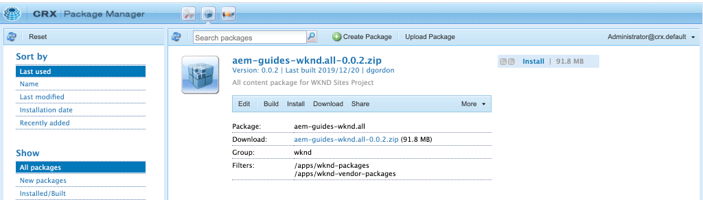

Siempre puede ver el código terminado en [GitHub](https://github.com/adobe/aem-guides-wknd-spa/tree/Angular/navigation-routing-solution) o desprotegerlo localmente cambiando a la rama `Angular/navigation-routing-solution`.

## Inspeccionar actualizaciones de componentes de encabezado {#inspect-header}

En capítulos anteriores, el componente `HeaderComponent` se agregó como un componente Angular puro incluido mediante `app.component.html`. En este capítulo, el componente `HeaderComponent` se quita de la aplicación y se agrega mediante el [Editor de plantillas](https://experienceleague.adobe.com/docs/experience-manager-learn/sites/page-authoring/template-editor-feature-video-use.html?lang=es). Esto permite a los usuarios configurar el menú de navegación de `HeaderComponent` desde AEM.

>[!NOTE]
>
> Ya se han realizado varias actualizaciones de CSS y JavaScript en la base de código para iniciar este capítulo. Para centrarse en los conceptos principales, no se discuten **todos** los cambios de código. You can view the full changes [here](https://github.com/adobe/aem-guides-wknd-spa/compare/Angular/map-components-solution...Angular/navigation-routing-start).

1. In the IDE of your choice open the SPA starter project for this chapter.
2. Beneath the `ui.frontend` module inspect the file `header.component.ts` at: `ui.frontend/src/app/components/header/header.component.ts`.

   Several updates have been made, including the addition of a `HeaderEditConfig` and a `MapTo` to enable the component to be mapped to an AEM component `wknd-spa-angular/components/header`.

   ```js
   /* header.component.ts */
   ...
   const HeaderEditConfig = {
       ...
   };
   
   @Component({
   selector: 'app-header',
   templateUrl: './header.component.html',
   styleUrls: ['./header.component.scss']
   })
   export class HeaderComponent implements OnInit {
   @Input() items: object[];
       ...
   }
   ...
   MapTo('wknd-spa-angular/components/header')(withRouter(Header), HeaderEditConfig);
   ```

   Note the `@Input()` annotation for `items`. `items` will contain an array of navigation objects passed in from AEM.

3. In the `ui.apps` module inspect the component definition of the AEM `Header` component: `ui.apps/src/main/content/jcr_root/apps/wknd-spa-angular/components/header/.content.xml`:

   ```xml
   <?xml version="1.0" encoding="UTF-8"?>
   <jcr:root xmlns:sling="http://sling.apache.org/jcr/sling/1.0" xmlns:cq="http://www.day.com/jcr/cq/1.0"
       xmlns:jcr="http://www.jcp.org/jcr/1.0"
       jcr:primaryType="cq:Component"
       jcr:title="Header"
       sling:resourceSuperType="wknd-spa-angular/components/navigation"
       componentGroup="WKND SPA Angular - Structure"/>
   ```

   The AEM `Header` component will inherit all of the functionality of the [Navigation Core Component](https://experienceleague.adobe.com/docs/experience-manager-core-components/using/components/navigation.html?lang=es) via the `sling:resourceSuperType` property.

## Add the HeaderComponent to the SPA template {#add-header-template}

1. Open a browser and login to AEM, [http://localhost:4502/](http://localhost:4502/). The starting code base should already be deployed.
2. Navigate to the **[!UICONTROL SPA Page Template]**: [http://localhost:4502/editor.html/conf/wknd-spa-angular/settings/wcm/templates/spa-page-template/structure.html](http://localhost:4502/editor.html/conf/wknd-spa-angular/settings/wcm/templates/spa-page-template/structure.html).
3. Select the outer-most **[!UICONTROL Root Layout Container]** and click its **[!UICONTROL Policy]** icon. Be careful **not** to select the **[!UICONTROL Layout Container]** un-locked for authoring.

   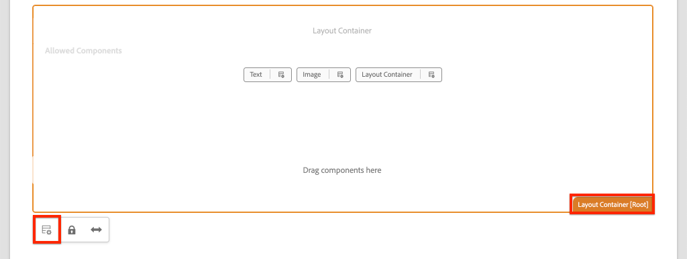

4. Copy the current policy and create a new policy named **[!UICONTROL SPA Structure]**:

   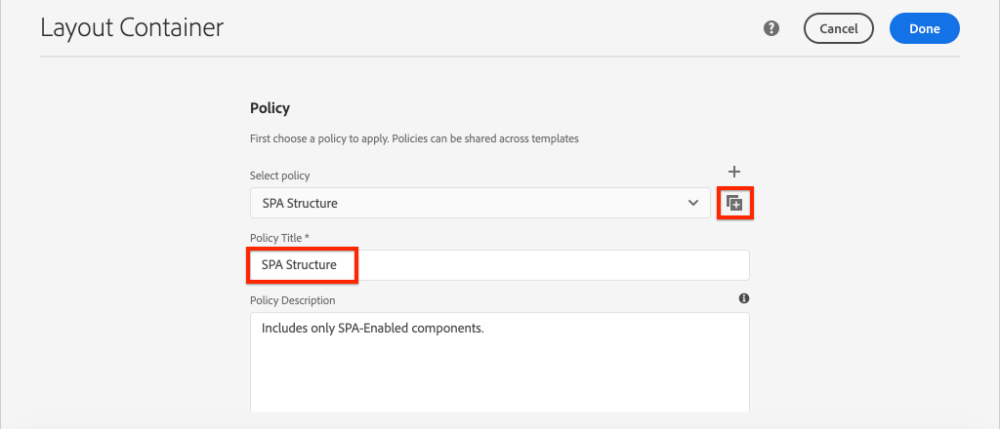

   Under **[!UICONTROL Allowed Components]** > **[!UICONTROL General]** > select the **[!UICONTROL Layout Container]** component.

   Under **[!UICONTROL Allowed Components]** > **[!UICONTROL WKND SPA ANGULAR - STRUCTURE]** > select the **[!UICONTROL Header]** component:

   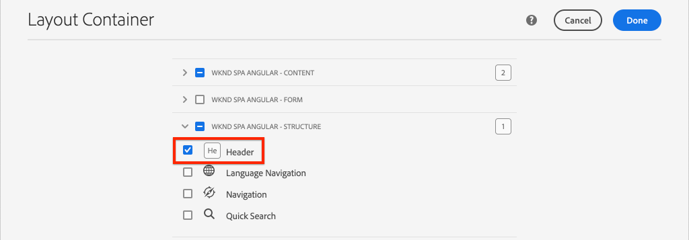

   Under **[!UICONTROL Allowed Components]** > **[!UICONTROL WKND SPA ANGULAR - Content]** > select the **[!UICONTROL Image]** and **[!UICONTROL Text]** components. You should have 4 total components selected.

   Haga clic en **[!UICONTROL Listo]** para guardar los cambios.

5. **Refresh** the page. Add the **[!UICONTROL Header]** component above the un-locked **[!UICONTROL Layout Container]**:

   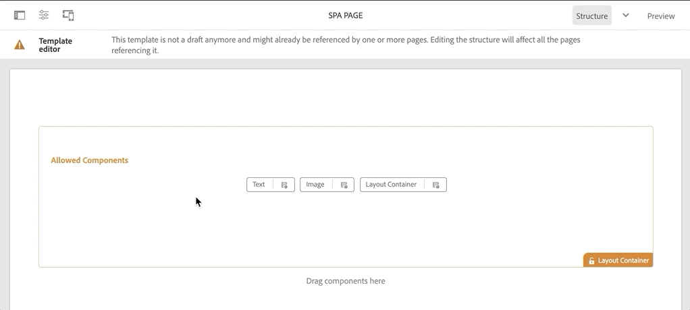

6. Select the **[!UICONTROL Header]** component and click its **Policy** icon to edit the policy.

   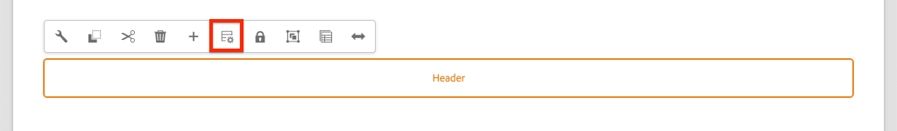

7. Create a new policy with a **[!UICONTROL Policy Title]** of **&quot;WKND SPA Header&quot;**.

   Under the **[!UICONTROL Properties]**:

   * Set the **[!UICONTROL Navigation Root]** to `/content/wknd-spa-angular/us/en`.
   * Establezca **[!UICONTROL Excluir niveles de raíz]** en **1**.
   * Uncheck **[!UICONTROL Collect al child pages]**.
   * Establezca la **[!UICONTROL Profundidad de la estructura de navegación]** en **3**.

   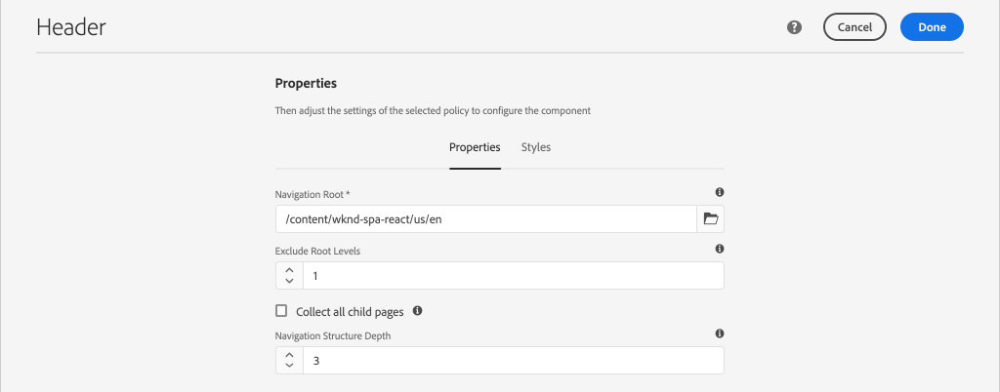

   This will collect the navigation 2 levels deep beneath `/content/wknd-spa-angular/us/en`.

8. After saving your changes you should see the populated `Header` as part of the template:

   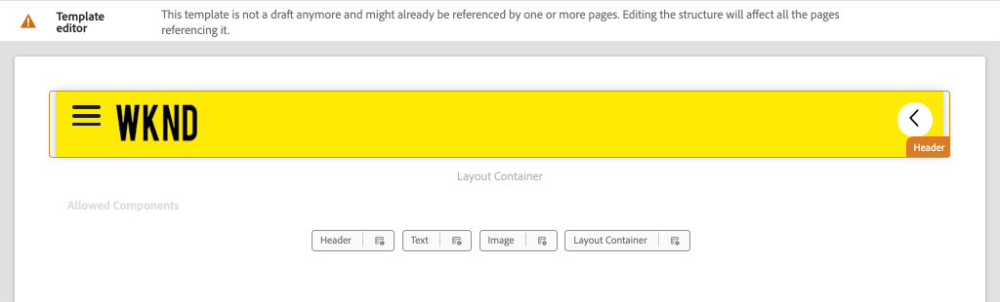

## Create child pages

Next, create additional pages in AEM that will serve as the different views in the SPA. We will also inspect the hierarchical structure of the JSON model provided by AEM.

1. Navigate to the **Sites** console: [http://localhost:4502/sites.html/content/wknd-spa-angular/us/en/home](http://localhost:4502/sites.html/content/wknd-spa-angular/us/en/home). Select the **WKND SPA Angular Home Page** and click **[!UICONTROL Create]** > **[!UICONTROL Page]**:

   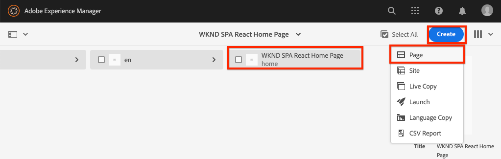

2. Under **[!UICONTROL Template]** select **[!UICONTROL SPA Page]**. Under **[!UICONTROL Properties]** enter **&quot;Page 1&quot;** for the **[!UICONTROL Title]** and **&quot;page-1&quot;** as the name.

   

   Click **[!UICONTROL Create]** and in the dialog pop-up, click **[!UICONTROL Open]** to open the page in the AEM SPA Editor.

3. Add a new **[!UICONTROL Text]** component to the main **[!UICONTROL Layout Container]**. Edit the component and enter the text: **&quot;Page 1&quot;** using the RTE and the **H1** element (you will have to enter full-screen mode to change the paragraph elements)

   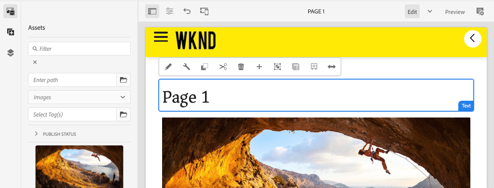

   Feel free to add additional content, like an image.

4. Return to the AEM Sites console and repeat the above steps, creating a second page named **&quot;Page 2&quot;** as a sibling of **Page 1**. Add content to **Page 2** so that it is easily identified.
5. Lastly create a third page, **&quot;Page 3&quot;** but as a **child** of **Page 2**. Once completed the site hierarchy should look like the following:

   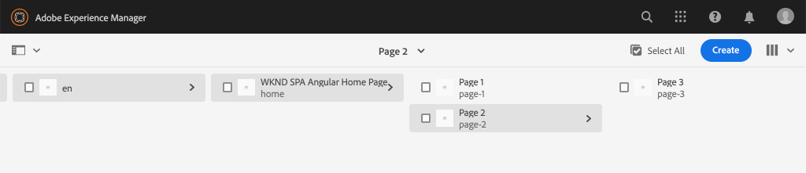

6. In a new tab, open the JSON model API provided by AEM: [http://localhost:4502/content/wknd-spa-angular/us/en.model.json](http://localhost:4502/content/wknd-spa-angular/us/en.model.json). This JSON content is requested when the SPA is first loaded. The outer structure looks like the following:

   ```json
   {
   "language": "en",
   "title": "en",
   "templateName": "spa-app-template",
   "designPath": "/libs/settings/wcm/designs/default",
   "cssClassNames": "spa page basicpage",
   ":type": "wknd-spa-angular/components/spa",
   ":items": {},
   ":itemsOrder": [],
   ":hierarchyType": "page",
   ":path": "/content/wknd-spa-angular/us/en",
   ":children": {
       "/content/wknd-spa-angular/us/en/home": {},
       "/content/wknd-spa-angular/us/en/home/page-1": {},
       "/content/wknd-spa-angular/us/en/home/page-2": {},
       "/content/wknd-spa-angular/us/en/home/page-2/page-3": {}
       }
   }
   ```

   Under `:children` you should see an entry for each of the pages created. The content for all of the pages is in this initial JSON request. Once, the navigation routing is implemented, subsequent views of the SPA is loaded rapidly, since the content is already available client-side.

   It is not wise to load **ALL** of the content of a SPA in the initial JSON request, as this would slow down the initial page load. Next, lets look at how the heirarchy depth of pages are collected.

7. Navigate to the **SPA Root** template at: [http://localhost:4502/editor.html/conf/wknd-spa-angular/settings/wcm/templates/spa-app-template/structure.html](http://localhost:4502/editor.html/conf/wknd-spa-angular/settings/wcm/templates/spa-app-template/structure.html).

   Click the **[!UICONTROL Page properties menu]** > **[!UICONTROL Page Policy]**:

   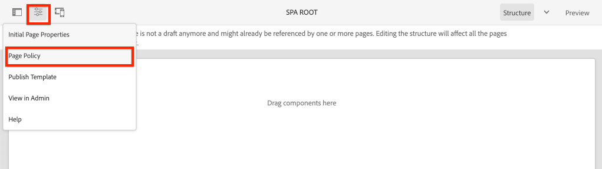

8. The **SPA Root** template has an extra **[!UICONTROL Hierarchical Structure]** tab to control the JSON content collected. The **[!UICONTROL Structure Depth]** determines how deep in the site hierarchy to collect child pages beneath the **root**. You can also use the **[!UICONTROL Structure Patterns]** field to filter out additional pages based on a regular expression.

   Update the **[!UICONTROL Structure Depth]** to **&quot;2&quot;**:

   

   Click **[!UICONTROL Done]** to save the changes to the policy.

9. Re-open the JSON model [http://localhost:4502/content/wknd-spa-angular/us/en.model.json](http://localhost:4502/content/wknd-spa-angular/us/en.model.json).

   ```json
   {
   "language": "en",
   "title": "en",
   "templateName": "spa-app-template",
   "designPath": "/libs/settings/wcm/designs/default",
   "cssClassNames": "spa page basicpage",
   ":type": "wknd-spa-angular/components/spa",
   ":items": {},
   ":itemsOrder": [],
   ":hierarchyType": "page",
   ":path": "/content/wknd-spa-angular/us/en",
   ":children": {
       "/content/wknd-spa-angular/us/en/home": {},
       "/content/wknd-spa-angular/us/en/home/page-1": {},
       "/content/wknd-spa-angular/us/en/home/page-2": {}
       }
   }
   ```

   Notice that the **Page 3** path has been removed: `/content/wknd-spa-angular/us/en/home/page-2/page-3` from the initial JSON model.

   Later, we will observe how the AEM SPA Editor SDK can dynamically load additional content.

## Implement the navigation

Next, implement the navigation menu with a new `NavigationComponent`. We could add the code directly in `header.component.html` but a better practice is to avoid large components. Instead, implement a `NavigationComponent` that could potentially be re-used later.

1. Review the JSON exposed by the AEM `Header` component at [http://localhost:4502/content/wknd-spa-angular/us/en.model.json](http://localhost:4502/content/wknd-spa-angular/us/en.model.json):

   ```json
   ...
   "header": {
       "items": [
       {
       "level": 0,
       "active": true,
       "path": "/content/wknd-spa-angular/us/en/home",
       "description": null,
       "url": "/content/wknd-spa-angular/us/en/home.html",
       "lastModified": 1589062597083,
       "title": "WKND SPA Angular Home Page",
       "children": [
               {
               "children": [],
               "level": 1,
               "active": false,
               "path": "/content/wknd-spa-angular/us/en/home/page-1",
               "description": null,
               "url": "/content/wknd-spa-angular/us/en/home/page-1.html",
               "lastModified": 1589429385100,
               "title": "Page 1"
               },
               {
               "level": 1,
               "active": true,
               "path": "/content/wknd-spa-angular/us/en/home/page-2",
               "description": null,
               "url": "/content/wknd-spa-angular/us/en/home/page-2.html",
               "lastModified": 1589429603507,
               "title": "Page 2",
               "children": [
                   {
                   "children": [],
                   "level": 2,
                   "active": false,
                   "path": "/content/wknd-spa-angular/us/en/home/page-2/page-3",
                   "description": null,
                   "url": "/content/wknd-spa-angular/us/en/home/page-2/page-3.html",
                   "lastModified": 1589430413831,
                   "title": "Page 3"
                   }
               ],
               }
           ]
           }
       ],
   ":type": "wknd-spa-angular/components/header"
   ```

   The hierarchical nature of the AEM pages are modeled in the JSON that can be used to populate a navigation menu. Recall that the `Header` component inherits all of the functionality of the [Navigation Core Component](https://www.aemcomponents.dev/content/core-components-examples/library/core-structure/navigation.html) and the content exposed through the JSON is automatically mapped to the Angular `@Input` annotation.

2. Open a new terminal window and navigate to the `ui.frontend` folder of the SPA project. Create a new `NavigationComponent` using the Angular CLI tool:

   ```shell
   $ cd ui.frontend
   $ ng generate component components/navigation
   CREATE src/app/components/navigation/navigation.component.scss (0 bytes)
   CREATE src/app/components/navigation/navigation.component.html (25 bytes)
   CREATE src/app/components/navigation/navigation.component.spec.ts (656 bytes)
   CREATE src/app/components/navigation/navigation.component.ts (286 bytes)
   UPDATE src/app/app.module.ts (2032 bytes)
   ```

3. Next create a class named `NavigationLink` using the Angular CLI in the newly created `components/navigation` directory:

   ```shell
   $ cd src/app/components/navigation/
   $ ng generate class NavigationLink
   CREATE src/app/components/navigation/navigation-link.spec.ts (187 bytes)
   CREATE src/app/components/navigation/navigation-link.ts (32 bytes)
   ```

4. Return to the IDE of your choice and open the file at `navigation-link.ts` at `/src/app/components/navigation/navigation-link.ts`.

   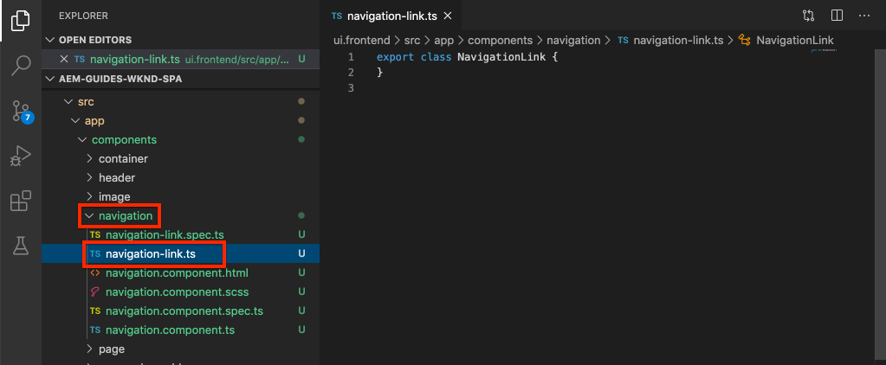

5. Populate `navigation-link.ts` with the following:

   ```js
   export class NavigationLink {
   
       title: string;
       path: string;
       url: string;
       level: number;
       children: NavigationLink[];
       active: boolean;
   
       constructor(data) {
           this.path = data.path;
           this.title = data.title;
           this.url = data.url;
           this.level = data.level;
           this.active = data.active;
           this.children = data.children.map( item => {
               return new NavigationLink(item);
           });
       }
   }
   ```

   This is a simple class to represent an individual navigation link. In the class constructor we expect `data` to be the JSON object passed in from AEM. This class is used within both the `NavigationComponent` and `HeaderComponent` to easily populate the navigation structure.

   No data transformation is performed, this class is primarily created to strongly type the JSON model. Notice that `this.children` is typed as `NavigationLink[]` and that the constructor recursively creates new `NavigationLink` objects for each of the items in the `children` array. Recall that JSON model for the `Header` is hierarchical.

6. Abra el archivo `navigation-link.spec.ts`. This is the test file for the `NavigationLink` class. Update it with the following:

   ```js
   import { NavigationLink } from './navigation-link';
   
   describe('NavigationLink', () => {
       it('should create an instance', () => {
           const data = {
               children: [],
               level: 1,
               active: false,
               path: '/content/wknd-spa-angular/us/en/home/page-1',
               description: null,
               url: '/content/wknd-spa-angular/us/en/home/page-1.html',
               lastModified: 1589429385100,
               title: 'Page 1'
           };
           expect(new NavigationLink(data)).toBeTruthy();
       });
   });
   ```

   Notice that `const data` follows the same JSON model inspected earlier for a single link. This is far from a robust unit test, however it should suffice to test the constructor of `NavigationLink`.

7. Abra el archivo `navigation.component.ts`. Update it with the following:

   ```js
   import { Component, OnInit, Input } from '@angular/core';
   import { NavigationLink } from './navigation-link';
   
   @Component({
   selector: 'app-navigation',
   templateUrl: './navigation.component.html',
   styleUrls: ['./navigation.component.scss']
   })
   export class NavigationComponent implements OnInit {
   
       @Input() items: object[];
   
       constructor() { }
   
       get navigationLinks(): NavigationLink[] {
   
           if (this.items && this.items.length > 0) {
               return this.items.map(item => {
                   return new NavigationLink(item);
               });
           }
   
           return null;
       }
   
       ngOnInit() {}
   
   }
   ```

   `NavigationComponent` expects an `object[]` named `items` that is the JSON model from AEM. This class exposes a single method `get navigationLinks()` which returns an array of `NavigationLink` objects.

8. Open the file `navigation.component.html` and update it with the following:

   ```html
   <ul *ngIf="navigationLinks && navigationLinks.length > 0" class="navigation__group">
       <ng-container *ngTemplateOutlet="recursiveListTmpl; context:{ links: navigationLinks }"></ng-container>
   </ul>
   ```

   This generates an initial `<ul>` and calls the `get navigationLinks()` method from `navigation.component.ts`. An `<ng-container>` is used to make a call to a template named `recursiveListTmpl` and passes it the `navigationLinks` as a variable named `links`.

   Add the `recursiveListTmpl` next:

   ```html
   <ng-template #recursiveListTmpl let-links="links">
       <li *ngFor="let link of links" class="{{'navigation__item navigation__item--' + link.level}}">
           <a [routerLink]="link.url" class="navigation__item-link" [title]="link.title" [attr.aria-current]="link.active">
               {{link.title}}
           </a>
           <ul *ngIf="link.children && link.children.length > 0">
               <ng-container *ngTemplateOutlet="recursiveListTmpl; context:{ links: link.children }"></ng-container>
           </ul>
       </li>
   </ng-template>
   ```

   Here the rest of the rendering for the navigation link is implemented. Note that the variable `link` is of type `NavigationLink` and all methods/properties created by that class are available. [`[routerLink]`](https://angular.io/api/router/RouterLink) is used instead of normal `href` attribute. This allows us to link to specific routes in the app, without a full-page refresh.

   The recursive portion of the navigation is also implemented by creating another `<ul>` if the current `link` has a non-empty `children` array.

9. Update `navigation.component.spec.ts` to add support for `RouterTestingModule`:

   ```diff
    ...
   + import { RouterTestingModule } from '@angular/router/testing';
    ...
    beforeEach(async(() => {
       TestBed.configureTestingModule({
   +   imports: [ RouterTestingModule ],
       declarations: [ NavigationComponent ]
       })
       .compileComponents();
    }));
    ...
   ```

   Adding the `RouterTestingModule` is required because the component uses `[routerLink]`.

10. Update `navigation.component.scss` to add some basic styles to the `NavigationComponent`:

   ```scss
   @import "~src/styles/variables";
   
   $link-color: $black;
   $link-hover-color: $white;
   $link-background: $black;
   
   :host-context {
       display: block;
       width: 100%;
   }
   
   .navigation__item {
       list-style: none;
   }
   
   .navigation__item-link {
       color: $link-color;
       font-size: $font-size-large;
       text-transform: uppercase;
       padding: $gutter-padding;
       display: flex;
       border-bottom: 1px solid $gray;
   
       &:hover {
           background: $link-background;
           color: $link-hover-color;
       }
   
   }
   ```

## Update the header component

Now that the `NavigationComponent` has been implemented, the `HeaderComponent` must be updated to reference it.

1. Open a terminal and navigate to the `ui.frontend` folder within the SPA project. Start the **webpack dev server**:

   ```shell
   $ npm start
   ```

2. Open a browser tab and navigate to [http://localhost:4200/](http://localhost:4200/).

   The **webpack dev server** should be configured to proxy the JSON model from a local instance of AEM (`ui.frontend/proxy.conf.json`). This will allow us to code directly against the content created in AEM from earlier in the tutorial.

   

   The `HeaderComponent` currently has the menu toggle functionality already implemented. Next, add the navigation component.

3. Return to the IDE of your choice, and open the file `header.component.ts` at `ui.frontend/src/app/components/header/header.component.ts`.
4. Update the `setHomePage()` method to remove the hard-coded String and use the dynamic props passed in by the AEM component:

   ```js
   /* header.component.ts */
   import { NavigationLink } from '../navigation/navigation-link';
   ...
    setHomePage() {
       if (this.hasNavigation) {
           const rootNavigationLink: NavigationLink = new NavigationLink(this.items[0]);
           this.isHome = rootNavigationLink.path === this.route.snapshot.data.path;
           this.homePageUrl = rootNavigationLink.url;
       }
   }
   ...
   ```

   A new instance of `NavigationLink` is created based on `items[0]`, the root of the navigation JSON model passed in from AEM. `this.route.snapshot.data.path` devuelve la ruta de acceso de la ruta de acceso de Angular actual. Este valor se usa para determinar si la ruta actual es la **página principal**. `this.homePageUrl` se usa para rellenar el vínculo de anclaje en el **logotipo**.

5. Abra `header.component.html` y reemplace el marcador de posición estático para la navegación con una referencia al `NavigationComponent` recién creado:

   ```diff
       <div class="header-navigation">
           <div class="navigation">
   -            Navigation Placeholder
   +           <app-navigation [items]="items"></app-navigation>
           </div>
       </div>
   ```

   El atributo `[items]=items` pasa `@Input() items` de `HeaderComponent` a `NavigationComponent`, donde generará la navegación.

6. Abra `header.component.spec.ts` y agregue una declaración para `NavigationComponent`:

   ```diff
       /* header.component.spect.ts */
   +   import { NavigationComponent } from '../navigation/navigation.component';
   
       describe('HeaderComponent', () => {
       let component: HeaderComponent;
       let fixture: ComponentFixture<HeaderComponent>;
   
       beforeEach(async(() => {
           TestBed.configureTestingModule({
           imports: [ RouterTestingModule ],
   +       declarations: [ HeaderComponent, NavigationComponent ]
           })
           .compileComponents();
       }));
   ```

   Dado que `NavigationComponent` se utiliza ahora como parte de `HeaderComponent`, debe declararse como parte del banco de pruebas.

7. Guardar cambios en cualquier archivo abierto y volver al **servidor de desarrollo de Webpack**: [http://localhost:4200/](http://localhost:4200/)

   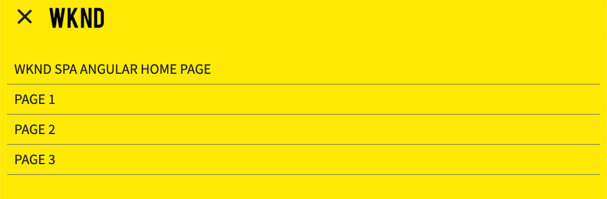

   Abra la navegación haciendo clic en el botón de opción de menú y verá los vínculos de navegación rellenados. Debe poder navegar a diferentes vistas de la SPA.

## Comprender el enrutamiento de SPA

Ahora que la navegación ha sido implementada, inspeccione el enrutamiento en AEM.

1. En el IDE, abra el archivo `app-routing.module.ts` a las `ui.frontend/src/app`.

   ```js
   /* app-routing.module.ts */
   import { AemPageDataResolver, AemPageRouteReuseStrategy } from '@adobe/cq-angular-editable-components';
   import { NgModule } from '@angular/core';
   import { RouteReuseStrategy, RouterModule, Routes, UrlMatchResult, UrlSegment } from '@angular/router';
   import { PageComponent } from './components/page/page.component';
   
   export function AemPageMatcher(url: UrlSegment[]): UrlMatchResult {
       if (url.length) {
           return {
               consumed: url,
               posParams: {
                   path: url[url.length - 1]
               }
           };
       }
   }
   
   const routes: Routes = [
       {
           matcher: AemPageMatcher,
           component: PageComponent,
           resolve: {
               path: AemPageDataResolver
           }
       }
   ];
   @NgModule({
       imports: [RouterModule.forRoot(routes)],
       exports: [RouterModule],
       providers: [
           AemPageDataResolver,
           {
           provide: RouteReuseStrategy,
           useClass: AemPageRouteReuseStrategy
           }
       ]
   })
   export class AppRoutingModule {}
   ```

   La matriz `routes: Routes = [];` define las rutas o rutas de navegación a las asignaciones de componentes de Angular.

   `AemPageMatcher` es un enrutador de Angular personalizado [UrlMatcher](https://angular.io/api/router/UrlMatcher), que coincide con cualquier elemento que &quot;se parezca&quot; a una página de AEM que forma parte de esta aplicación de Angular.

   `PageComponent` es el componente de Angular que representa una página en AEM y que se utiliza para representar las rutas coincidentes. `PageComponent` se revisa más adelante en el tutorial.

   `AemPageDataResolver`, proporcionado por AEM SPA Editor JS SDK, es un [Angular Router Resolver](https://angular.io/api/router/Resolve) personalizado que se usa para transformar la dirección URL de ruta, que es la ruta en AEM incluyendo la extensión .html, a la ruta de recurso en AEM, que es la ruta de página menos la extensión.

   Por ejemplo, `AemPageDataResolver` transforma la dirección URL de una ruta de `content/wknd-spa-angular/us/en/home.html` en una ruta de acceso de `/content/wknd-spa-angular/us/en/home`. Se utiliza para resolver el contenido de la página en función de la ruta en la API del modelo JSON.

   `AemPageRouteReuseStrategy`, proporcionado por AEM SPA Editor JS SDK, es una [RouteReuseStrategy](https://angular.io/api/router/RouteReuseStrategy) personalizada que evita la reutilización de `PageComponent` entre rutas. De lo contrario, el contenido de la página &quot;A&quot; podría mostrarse al navegar a la página &quot;B&quot;.

2. Abra el archivo `page.component.ts` en `ui.frontend/src/app/components/page/`.

   ```js
   ...
   export class PageComponent {
       items;
       itemsOrder;
       path;
   
       constructor(
           private route: ActivatedRoute,
           private modelManagerService: ModelManagerService
       ) {
           this.modelManagerService
           .getData({ path: this.route.snapshot.data.path })
           .then(data => {
               this.path = data[Constants.PATH_PROP];
               this.items = data[Constants.ITEMS_PROP];
               this.itemsOrder = data[Constants.ITEMS_ORDER_PROP];
           });
       }
   }
   ```

   Se requiere `PageComponent` para procesar el JSON recuperado de AEM y se usa como componente de Angular para procesar las rutas.

   `ActivatedRoute`, que proporciona el módulo Angular Router, contiene el estado que indica qué contenido JSON de la página de AEM debe cargarse en esta instancia de componente de página de Angular.

   `ModelManagerService`, obtiene los datos JSON en función de la ruta y asigna los datos a las variables de clase `path`, `items`, `itemsOrder`. Estos se pasarán a [AEMPageComponent](https://www.npmjs.com/package/@adobe/cq-angular-editable-components#aempagecomponent.md)

3. Abrir el archivo `page.component.html` en `ui.frontend/src/app/components/page/`

   ```html
   <aem-page 
       class="structure-page" 
       [attr.data-cq-page-path]="path" 
       [cqPath]="path" 
       [cqItems]="items" 
       [cqItemsOrder]="itemsOrder">
   </aem-page>
   ```

   `aem-page` incluye [AEMPageComponent](https://www.npmjs.com/package/@adobe/cq-angular-editable-components#aempagecomponent.md). Las variables `path`, `items` y `itemsOrder` se pasan a `AEMPageComponent`. El `AemPageComponent`, proporcionado mediante el Editor de SPA de JavaScript SDK, iterará estos datos e instanciará dinámicamente componentes de Angular basados en los datos JSON, tal como se ve en el [tutorial de componentes de mapa](./map-components.md).

   `PageComponent` es realmente solo un proxy para `AEMPageComponent` y es `AEMPageComponent` el que hace la mayor parte del trabajo pesado para asignar correctamente el modelo JSON a los componentes de Angular.

## Inspeccionar el enrutamiento de SPA en AEM

1. Abra un terminal y detenga **webpack dev server** si se inició. Vaya a la raíz del proyecto e implemente el proyecto en AEM con sus habilidades con Maven:

   ```shell
   $ cd aem-guides-wknd-spa
   $ mvn clean install -PautoInstallSinglePackage
   ```

   >[!CAUTION]
   >
   > El proyecto de Angular tiene habilitadas algunas reglas de vinculación muy estrictas. Si la generación de Maven falla, compruebe el error y busque **Errores de Lint encontrados en los archivos enumerados.**. Corrija los problemas que encuentre el filtro y vuelva a ejecutar el comando de Maven.

2. Vaya a la página de inicio de SPA en AEM: [http://localhost:4502/content/wknd-spa-angular/us/en/home.html](http://localhost:4502/content/wknd-spa-angular/us/en/home.html) y abra las herramientas para desarrolladores del explorador. Las capturas de pantalla a continuación se capturan desde el navegador Google Chrome.

   Actualice la página y debería ver una solicitud XHR a `/content/wknd-spa-angular/us/en.model.json`, que es la raíz de la SPA. Tenga en cuenta que solo se incluyen tres páginas secundarias en función de la configuración de profundidad de jerarquía en la plantilla raíz de SPA realizada anteriormente en el tutorial. Esto no incluye **Página 3**.

   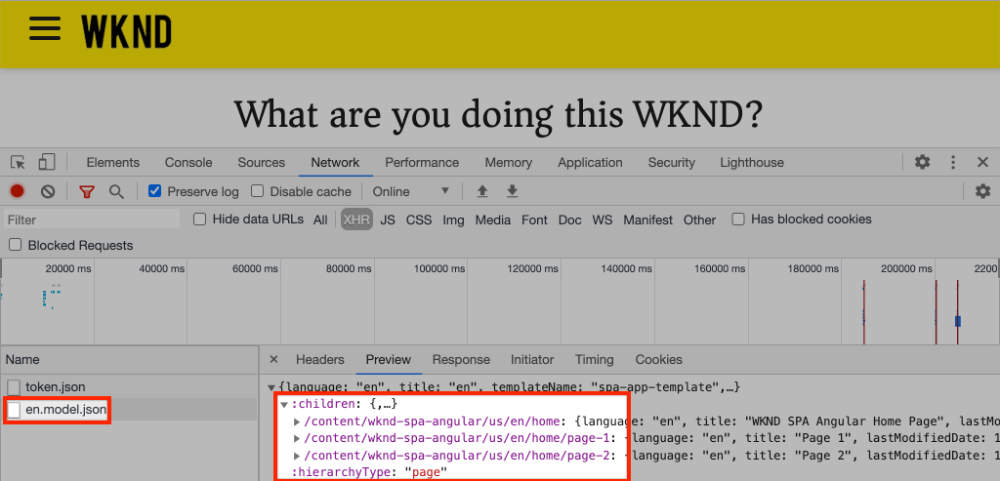

3. Con las herramientas para desarrolladores abiertas, vaya a **Página 3**:

   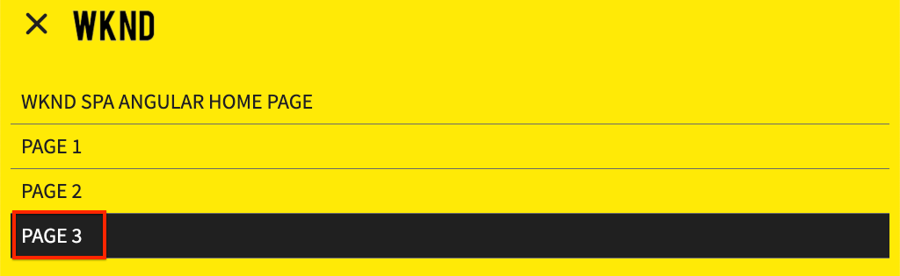

   Observe que se hace una nueva solicitud XHR a: `/content/wknd-spa-angular/us/en/home/page-2/page-3.model.json`

   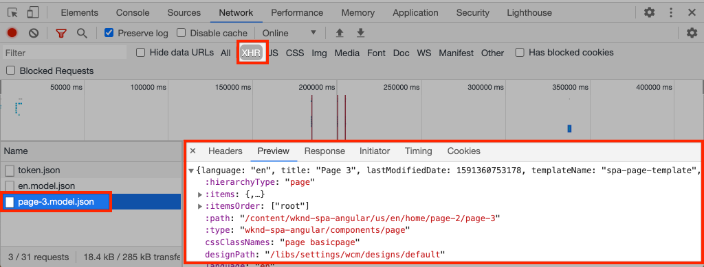

   El administrador de modelos de AEM comprende que el contenido JSON de la **página 3** no está disponible y déclencheur automáticamente la solicitud XHR adicional.

4. Continúe navegando por la SPA utilizando los distintos vínculos de navegación. Observe that no additional XHR requests are made, and that no full page refreshes occurs. This makes the SPA fast for the end-user and reduces unnecessary requests back to AEM.

   

5. Experiment with deep links by navigating directly to: [http://localhost:4502/content/wknd-spa-angular/us/en/home/page-2.html](http://localhost:4502/content/wknd-spa-angular/us/en/home/page-2.html). Observe that the browser&#39;s back button continues to work.

## Enhorabuena. {#congratulations}

Congratulations, you learned how multiple views in the SPA can be supported by mapping to AEM Pages with the SPA Editor SDK. Dynamic navigation has been implemented using Angular routing and added to the `Header` component.

You can always view the finished code on [GitHub](https://github.com/adobe/aem-guides-wknd-spa/tree/Angular/navigation-routing-solution) or check the code out locally by switching to the branch `Angular/navigation-routing-solution`.

### Próximos pasos {#next-steps}

[Create a Custom Component](custom-component.md) - Learn how to create a custom component to be used with the AEM SPA Editor. Learn how to develop author dialogs and Sling Models to extend the JSON model to populate a custom component.
