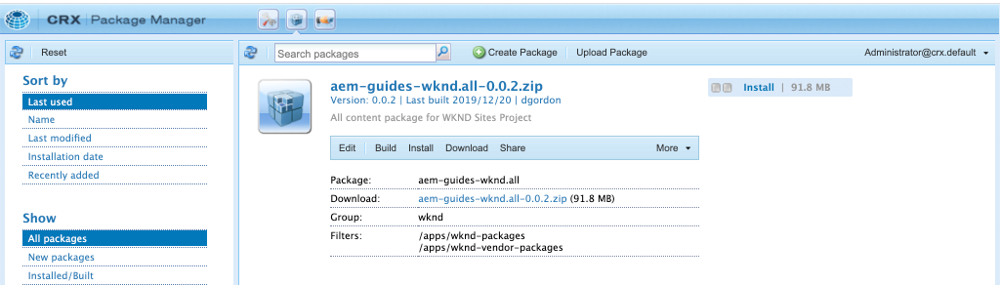

# Agregar navegación y enrutamiento {#navigation-routing}

SPA AEM SPA Descubra cómo se admiten varias vistas en la mediante páginas de la página de la aplicación y el SDK del Editor de la página de la aplicación de la aplicación de la aplicación de la. La navegación dinámica se implementa mediante rutas de Angular y se añade a un componente de encabezado existente.

## Objetivo

1. SPA SPA Comprender las opciones de enrutamiento del modelo de disponibles al utilizar el Editor de rutas.
2. Aprenda a utilizar [enrutamiento de angular](https://angular.io/guide/router) SPA para desplazarse entre las distintas vistas de la.
3. AEM Implemente una navegación dinámica impulsada por la jerarquía de páginas de la página de la.

## Qué va a generar

En este capítulo se añade un menú de navegación a un `Header` componente. AEM El menú de navegación está gobernado por la jerarquía de páginas de y utiliza el modelo JSON proporcionado por el [Componente principal de navegación](https://experienceleague.adobe.com/docs/experience-manager-core-components/using/components/navigation.html).


## Requisitos previos

Revise las herramientas y las instrucciones necesarias para configurar una [entorno de desarrollo local](overview.md#local-dev-environment).

### Obtener el código

1. Descargue el punto de partida para este tutorial mediante Git:

   ```shell
   $ git clone git@github.com:adobe/aem-guides-wknd-spa.git
   $ cd aem-guides-wknd-spa
   $ git checkout Angular/navigation-routing-start
   ```

2. AEM Implemente el código base en una instancia de local mediante Maven:

   ```shell
   $ mvn clean install -PautoInstallSinglePackage
   ```

   Si se usa [AEM.x](overview.md#compatibility) añada el `classic` perfil:

   ```shell
   $ mvn clean install -PautoInstallSinglePackage -Pclassic
   ```

3. Instale el paquete terminado para el tradicional [Sitio de referencia de WKND](https://github.com/adobe/aem-guides-wknd/releases/latest). Las imágenes proporcionadas por [Sitio de referencia de WKND](https://github.com/adobe/aem-guides-wknd/releases/latest) SPA se vuelven a utilizar en el WKND de forma predeterminada El paquete se puede instalar utilizando [AEM Administrador de paquetes](http://localhost:4502/crx/packmgr/index.jsp).

   

Siempre puede ver el código terminado en [GitHub](https://github.com/adobe/aem-guides-wknd-spa/tree/Angular/navigation-routing-solution) o compruebe el código localmente cambiando a la rama `Angular/navigation-routing-solution`.

## Actualizaciones de componentes de encabezado de Inspect {#inspect-header}

En los capítulos anteriores, la variable `HeaderComponent` El componente se ha añadido como un componente de Angular puro incluido mediante `app.component.html`. En este capítulo, la variable `HeaderComponent` Este componente se elimina de la aplicación y se añade mediante la variable [Editor de plantillas](https://experienceleague.adobe.com/docs/experience-manager-learn/sites/page-authoring/template-editor-feature-video-use.html?lang=es). Esto permite a los usuarios configurar el menú de navegación del `HeaderComponent` AEM desde dentro de la.

>[!NOTE]
>
> Ya se han realizado varias actualizaciones de CSS y JavaScript en la base de código para iniciar este capítulo. Centrarse en los conceptos principales, no en **todo** Se analizan todos los cambios de código. Puede ver los cambios completos [aquí](https://github.com/adobe/aem-guides-wknd-spa/compare/Angular/map-components-solution...Angular/navigation-routing-start).

1. SPA En el IDE de su elección, abra el proyecto de inicio de la para este capítulo.
2. Debajo del `ui.frontend` módulo inspeccionar el archivo `header.component.ts` a las: `ui.frontend/src/app/components/header/header.component.ts`.

   Se han realizado varias actualizaciones, incluida la adición de un `HeaderEditConfig` y una `MapTo` AEM para permitir que el componente se asigne a un componente de la `wknd-spa-angular/components/header`.

   ```js
   /* header.component.ts */
   ...
   const HeaderEditConfig = {
       ...
   };
   
   @Component({
   selector: 'app-header',
   templateUrl: './header.component.html',
   styleUrls: ['./header.component.scss']
   })
   export class HeaderComponent implements OnInit {
   @Input() items: object[];
       ...
   }
   ...
   MapTo('wknd-spa-angular/components/header')(withRouter(Header), HeaderEditConfig);
   ```

   Tenga en cuenta `@Input()` anotación para `items`. `items` AEM contendrá una matriz de objetos de navegación pasados desde el punto de vista de la barra de herramientas de la interfaz de usuario de.

3. En el `ui.apps` AEM inspeccionar la definición del componente del módulo de la interfaz de usuario de la interfaz de usuario de la `Header` componente: `ui.apps/src/main/content/jcr_root/apps/wknd-spa-angular/components/header/.content.xml`:

   ```xml
   <?xml version="1.0" encoding="UTF-8"?>
   <jcr:root xmlns:sling="http://sling.apache.org/jcr/sling/1.0" xmlns:cq="http://www.day.com/jcr/cq/1.0"
       xmlns:jcr="http://www.jcp.org/jcr/1.0"
       jcr:primaryType="cq:Component"
       jcr:title="Header"
       sling:resourceSuperType="wknd-spa-angular/components/navigation"
       componentGroup="WKND SPA Angular - Structure"/>
   ```

   AEM El `Header` El componente heredará todas las funciones del [Componente principal de navegación](https://experienceleague.adobe.com/docs/experience-manager-core-components/using/components/navigation.html) a través de `sling:resourceSuperType` propiedad.

## SPA Agregue el componente HeaderComponent a la plantilla de la {#add-header-template}

1. AEM Abra un explorador e inicie sesión para iniciar sesión en [http://localhost:4502/](http://localhost:4502/). La base del código de inicio ya debería implementarse.
2. Vaya a **[!UICONTROL SPA Plantilla de página]**: [http://localhost:4502/editor.html/conf/wknd-spa-angular/settings/wcm/templates/spa-page-template/structure.html](http://localhost:4502/editor.html/conf/wknd-spa-angular/settings/wcm/templates/spa-page-template/structure.html).
3. Seleccione el más exterior **[!UICONTROL Contenedor de diseño raíz]** y haga clic en **[!UICONTROL Política]** icono. Ten cuidado **no** para seleccionar **[!UICONTROL Contenedor de diseño]** desbloqueado para la creación.

   

4. Copie la directiva actual y cree una nueva directiva denominada **[!UICONTROL SPA Estructura de]**:

   

   En **[!UICONTROL Componentes permitidos]** > **[!UICONTROL General]** > seleccione el **[!UICONTROL Contenedor de diseño]** componente.

   En **[!UICONTROL Componentes permitidos]** > **[!UICONTROL SPA ANGULAR DE WKND: ESTRUCTURA]** > seleccione el **[!UICONTROL Header]** componente:

   

   En **[!UICONTROL Componentes permitidos]** > **[!UICONTROL SPA ANGULAR de WKND: contenido]** > seleccione el **[!UICONTROL Imagen]** y **[!UICONTROL Texto]** componentes. Debe tener un total de 4 componentes seleccionados.

   Haga clic en **[!UICONTROL Listo]** para guardar los cambios.

5. **Actualizar** la página. Añada el **[!UICONTROL Header]** componente sobre el desbloqueado **[!UICONTROL Contenedor de diseño]**:

   

6. Seleccione el **[!UICONTROL Header]** y haga clic en su **Política** para editar la directiva.

   

7. Crear una nueva directiva con un **[!UICONTROL Título de política]** de **SPA &quot;WKND Encabezado de la&quot;**.

   En el **[!UICONTROL Propiedades]**:

   * Configure las variables **[!UICONTROL Raíz de navegación]** hasta `/content/wknd-spa-angular/us/en`.
   * Configure las variables **[!UICONTROL Excluir niveles de raíz]** hasta **1**.
   * Desmarcar **[!UICONTROL Recopilar todas las páginas secundarias]**.
   * Configure las variables **[!UICONTROL Profundidad de estructura de navegación]** hasta **3**.

   

   Se recopilará la navegación a 2 niveles de profundidad por debajo `/content/wknd-spa-angular/us/en`.

8. Después de guardar los cambios, debería ver los campos rellenados `Header` como parte de la plantilla:

   

## Creación de páginas secundarias

AEM SPA A continuación, cree páginas adicionales en las que se puedan usar las vistas diferentes de las vistas de la. AEM También inspeccionaremos la estructura jerárquica del modelo JSON proporcionado por los usuarios de la plataforma de datos de la plataforma de datos de.

1. Vaya a **Sites** consola: [http://localhost:4502/sites.html/content/wknd-spa-angular/us/en/home](http://localhost:4502/sites.html/content/wknd-spa-angular/us/en/home). Seleccione el **SPA Página de inicio de Angular de WKND** y haga clic en **[!UICONTROL Crear]** > **[!UICONTROL Página]**:

   

2. En **[!UICONTROL Plantilla]** select **[!UICONTROL SPA Página de]**. En **[!UICONTROL Propiedades]** introduzcan **&quot;Página 1&quot;** para el **[!UICONTROL Título]** y **&quot;page-1&quot;** como el nombre.

   

   Clic **[!UICONTROL Crear]** y en el cuadro de diálogo emergente, haga clic en **[!UICONTROL Abrir]** AEM SPA para abrir la página en el Editor de.

3. Añadir un nuevo **[!UICONTROL Texto]** al componente principal **[!UICONTROL Contenedor de diseño]**. Edite el componente e introduzca el texto: **&quot;Página 1&quot;** uso del RTE y el **H1** (tendrá que entrar en el modo de pantalla completa para cambiar los elementos del párrafo)

   

   No dude en añadir contenido adicional, como una imagen.

4. Vuelva a la consola de AEM Sites y repita los pasos anteriores, creando una segunda página denominada **&quot;Página 2&quot;** como hermano de **Página 1**. Añadir contenido a **Página 2** para que se pueda identificar fácilmente.
5. Por último, cree una tercera página, **&quot;Página 3&quot;** pero como **niño** de **Página 2**. Una vez completada, la jerarquía del sitio debe tener el siguiente aspecto:

   

6. AEM En una pestaña nueva, abra la API del modelo JSON proporcionada por: [http://localhost:4502/content/wknd-spa-angular/us/en.model.json](http://localhost:4502/content/wknd-spa-angular/us/en.model.json). SPA Este contenido JSON se solicita cuando se carga la por primera vez. La estructura exterior tiene el siguiente aspecto:

   ```json
   {
   "language": "en",
   "title": "en",
   "templateName": "spa-app-template",
   "designPath": "/libs/settings/wcm/designs/default",
   "cssClassNames": "spa page basicpage",
   ":type": "wknd-spa-angular/components/spa",
   ":items": {},
   ":itemsOrder": [],
   ":hierarchyType": "page",
   ":path": "/content/wknd-spa-angular/us/en",
   ":children": {
       "/content/wknd-spa-angular/us/en/home": {},
       "/content/wknd-spa-angular/us/en/home/page-1": {},
       "/content/wknd-spa-angular/us/en/home/page-2": {},
       "/content/wknd-spa-angular/us/en/home/page-2/page-3": {}
       }
   }
   ```

   En `:children` debería ver una entrada para cada una de las páginas creadas. El contenido de todas las páginas se encuentra en esta solicitud JSON inicial. SPA Una vez implementado el enrutamiento de navegación, las vistas subsiguientes de la se cargan rápidamente, ya que el contenido ya está disponible en el lado del cliente.

   No es aconsejable cargar **TODO** SPA del contenido de un elemento de la solicitud de JSON inicial, ya que esto ralentizaría la carga inicial de la página. A continuación, veamos cómo se recopila la profundidad de jerarquía de las páginas.

7. Vaya a **SPA Raíz** plantilla en: [http://localhost:4502/editor.html/conf/wknd-spa-angular/settings/wcm/templates/spa-app-template/structure.html](http://localhost:4502/editor.html/conf/wknd-spa-angular/settings/wcm/templates/spa-app-template/structure.html).

   Haga clic en **[!UICONTROL Menú Propiedades de página]** > **[!UICONTROL Política de página]**:

   

8. El **SPA Raíz** la plantilla tiene un **[!UICONTROL Estructura jerárquica]** para controlar el contenido JSON recopilado. El **[!UICONTROL Profundidad de estructura]** determina la profundidad en la jerarquía del sitio para recopilar páginas secundarias debajo del **raíz**. También puede utilizar la variable **[!UICONTROL Patrones de estructura]** para filtrar páginas adicionales basadas en una expresión regular.

   Actualice el **[!UICONTROL Profundidad de estructura]** hasta **&quot;2&quot;**:

   

   Clic **[!UICONTROL Listo]** para guardar los cambios en la directiva.

9. Vuelva a abrir el modelo JSON [http://localhost:4502/content/wknd-spa-angular/us/en.model.json](http://localhost:4502/content/wknd-spa-angular/us/en.model.json).

   ```json
   {
   "language": "en",
   "title": "en",
   "templateName": "spa-app-template",
   "designPath": "/libs/settings/wcm/designs/default",
   "cssClassNames": "spa page basicpage",
   ":type": "wknd-spa-angular/components/spa",
   ":items": {},
   ":itemsOrder": [],
   ":hierarchyType": "page",
   ":path": "/content/wknd-spa-angular/us/en",
   ":children": {
       "/content/wknd-spa-angular/us/en/home": {},
       "/content/wknd-spa-angular/us/en/home/page-1": {},
       "/content/wknd-spa-angular/us/en/home/page-2": {}
       }
   }
   ```

   Observe que la variable **Página 3** se ha eliminado la ruta: `/content/wknd-spa-angular/us/en/home/page-2/page-3` del modelo JSON inicial.

   AEM SPA Más adelante, observaremos cómo el SDK del Editor de código de tiempo de ejecución (SDK) de la de contenido puede cargar dinámicamente contenido adicional.

## Implementación de la navegación

A continuación, implemente el menú de navegación con una nueva `NavigationComponent`. Podríamos agregar el código directamente en `header.component.html` sin embargo, una práctica recomendada es evitar los componentes grandes. En su lugar, implemente una `NavigationComponent` que podría reutilizarse más adelante.

1. AEM Revise el JSON expuesto por el `Header` componente en [http://localhost:4502/content/wknd-spa-angular/us/en.model.json](http://localhost:4502/content/wknd-spa-angular/us/en.model.json):

   ```json
   ...
   "header": {
       "items": [
       {
       "level": 0,
       "active": true,
       "path": "/content/wknd-spa-angular/us/en/home",
       "description": null,
       "url": "/content/wknd-spa-angular/us/en/home.html",
       "lastModified": 1589062597083,
       "title": "WKND SPA Angular Home Page",
       "children": [
               {
               "children": [],
               "level": 1,
               "active": false,
               "path": "/content/wknd-spa-angular/us/en/home/page-1",
               "description": null,
               "url": "/content/wknd-spa-angular/us/en/home/page-1.html",
               "lastModified": 1589429385100,
               "title": "Page 1"
               },
               {
               "level": 1,
               "active": true,
               "path": "/content/wknd-spa-angular/us/en/home/page-2",
               "description": null,
               "url": "/content/wknd-spa-angular/us/en/home/page-2.html",
               "lastModified": 1589429603507,
               "title": "Page 2",
               "children": [
                   {
                   "children": [],
                   "level": 2,
                   "active": false,
                   "path": "/content/wknd-spa-angular/us/en/home/page-2/page-3",
                   "description": null,
                   "url": "/content/wknd-spa-angular/us/en/home/page-2/page-3.html",
                   "lastModified": 1589430413831,
                   "title": "Page 3"
                   }
               ],
               }
           ]
           }
       ],
   ":type": "wknd-spa-angular/components/header"
   ```

   AEM La naturaleza jerárquica de las páginas de la se modela en el archivo JSON, que se puede utilizar para rellenar un menú de navegación. Recuerde que la variable `Header` El componente hereda todas las funcionalidades de [Componente principal de navegación](https://www.aemcomponents.dev/content/core-components-examples/library/core-structure/navigation.html) y el contenido expuesto a través del JSON se asigna automáticamente al Angular `@Input` anotación.

2. Abra una nueva ventana de terminal y vaya al `ui.frontend` SPA carpeta del proyecto de. Crear un nuevo `NavigationComponent` uso de la herramienta CLI de Angular:

   ```shell
   $ cd ui.frontend
   $ ng generate component components/navigation
   CREATE src/app/components/navigation/navigation.component.scss (0 bytes)
   CREATE src/app/components/navigation/navigation.component.html (25 bytes)
   CREATE src/app/components/navigation/navigation.component.spec.ts (656 bytes)
   CREATE src/app/components/navigation/navigation.component.ts (286 bytes)
   UPDATE src/app/app.module.ts (2032 bytes)
   ```

3. A continuación, cree una clase denominada `NavigationLink` usando la CLI de Angular en el recién creado `components/navigation` directorio:

   ```shell
   $ cd src/app/components/navigation/
   $ ng generate class NavigationLink
   CREATE src/app/components/navigation/navigation-link.spec.ts (187 bytes)
   CREATE src/app/components/navigation/navigation-link.ts (32 bytes)
   ```

4. Vuelva al IDE de su elección y abra el archivo en `navigation-link.ts` en `/src/app/components/navigation/navigation-link.ts`.

   

5. Rellenar `navigation-link.ts` con lo siguiente:

   ```js
   export class NavigationLink {
   
       title: string;
       path: string;
       url: string;
       level: number;
       children: NavigationLink[];
       active: boolean;
   
       constructor(data) {
           this.path = data.path;
           this.title = data.title;
           this.url = data.url;
           this.level = data.level;
           this.active = data.active;
           this.children = data.children.map( item => {
               return new NavigationLink(item);
           });
       }
   }
   ```

   Se trata de una clase simple que representa un vínculo de navegación individual. En el constructor de clase que esperamos `data` AEM para que sea el objeto JSON pasado desde la interfaz de usuario de la interfaz de usuario de. Esta clase se utiliza tanto en `NavigationComponent` y `HeaderComponent` para rellenar fácilmente la estructura de navegación.

   No se realiza ninguna transformación de datos, esta clase se crea principalmente para escribir de forma segura el modelo JSON. Observe que `this.children` se escribe como `NavigationLink[]` y que el constructor crea nuevas de forma recursiva `NavigationLink` para cada uno de los elementos de `children` matriz. Recuerde ese modelo JSON para `Header` es jerárquico.

6. Abra el archivo `navigation-link.spec.ts`. Este es el archivo de prueba para `NavigationLink` clase. Actualícelo con lo siguiente:

   ```js
   import { NavigationLink } from './navigation-link';
   
   describe('NavigationLink', () => {
       it('should create an instance', () => {
           const data = {
               children: [],
               level: 1,
               active: false,
               path: '/content/wknd-spa-angular/us/en/home/page-1',
               description: null,
               url: '/content/wknd-spa-angular/us/en/home/page-1.html',
               lastModified: 1589429385100,
               title: 'Page 1'
           };
           expect(new NavigationLink(data)).toBeTruthy();
       });
   });
   ```

   Observe que `const data` sigue el mismo modelo JSON inspeccionado anteriormente para un solo vínculo. Esto dista mucho de ser una prueba unitaria sólida, pero debería ser suficiente para probar el constructor de `NavigationLink`.

7. Abra el archivo `navigation.component.ts`. Actualícelo con lo siguiente:

   ```js
   import { Component, OnInit, Input } from '@angular/core';
   import { NavigationLink } from './navigation-link';
   
   @Component({
   selector: 'app-navigation',
   templateUrl: './navigation.component.html',
   styleUrls: ['./navigation.component.scss']
   })
   export class NavigationComponent implements OnInit {
   
       @Input() items: object[];
   
       constructor() { }
   
       get navigationLinks(): NavigationLink[] {
   
           if (this.items && this.items.length > 0) {
               return this.items.map(item => {
                   return new NavigationLink(item);
               });
           }
   
           return null;
       }
   
       ngOnInit() {}
   
   }
   ```

   `NavigationComponent` espera un `object[]` nombrado `items` AEM Este es el modelo JSON de. Esta clase expone un único método `get navigationLinks()` que devuelve una matriz de `NavigationLink` objetos.

8. Abra el archivo `navigation.component.html` y actualícelo con lo siguiente:

   ```html
   <ul *ngIf="navigationLinks && navigationLinks.length > 0" class="navigation__group">
       <ng-container *ngTemplateOutlet="recursiveListTmpl; context:{ links: navigationLinks }"></ng-container>
   </ul>
   ```

   Esto genera una `<ul>` y llama al `get navigationLinks()` método desde `navigation.component.ts`. Un `<ng-container>` se utiliza para realizar una llamada a una plantilla denominada `recursiveListTmpl` y lo pasa el `navigationLinks` como una variable denominada `links`.

   Añada el `recursiveListTmpl` siguiente:

   ```html
   <ng-template #recursiveListTmpl let-links="links">
       <li *ngFor="let link of links" class="{{'navigation__item navigation__item--' + link.level}}">
           <a [routerLink]="link.url" class="navigation__item-link" [title]="link.title" [attr.aria-current]="link.active">
               {{link.title}}
           </a>
           <ul *ngIf="link.children && link.children.length > 0">
               <ng-container *ngTemplateOutlet="recursiveListTmpl; context:{ links: link.children }"></ng-container>
           </ul>
       </li>
   </ng-template>
   ```

   Aquí se implementa el resto de la renderización del vínculo de navegación. Observe que la variable `link` es de tipo `NavigationLink` y todos los métodos/propiedades creados por esa clase están disponibles. [`[routerLink]`](https://angular.io/api/router/RouterLink) se utiliza en lugar de normal `href` atributo. Esto nos permite vincular a rutas específicas en la aplicación, sin una actualización de página completa.

   La parte recursiva de la navegación también se implementa creando otra `<ul>` si el actual `link` tiene un no vacío `children` matriz.

9. Actualizar `navigation.component.spec.ts` para agregar compatibilidad con `RouterTestingModule`:

   ```diff
    ...
   + import { RouterTestingModule } from '@angular/router/testing';
    ...
    beforeEach(async(() => {
       TestBed.configureTestingModule({
   +   imports: [ RouterTestingModule ],
       declarations: [ NavigationComponent ]
       })
       .compileComponents();
    }));
    ...
   ```

   Añadir el `RouterTestingModule` es obligatorio porque el componente utiliza `[routerLink]`.

10. Actualizar `navigation.component.scss` para agregar algunos estilos básicos a `NavigationComponent`:

   ```scss
   @import "~src/styles/variables";
   
   $link-color: $black;
   $link-hover-color: $white;
   $link-background: $black;
   
   :host-context {
       display: block;
       width: 100%;
   }
   
   .navigation__item {
       list-style: none;
   }
   
   .navigation__item-link {
       color: $link-color;
       font-size: $font-size-large;
       text-transform: uppercase;
       padding: $gutter-padding;
       display: flex;
       border-bottom: 1px solid $gray;
   
       &:hover {
           background: $link-background;
           color: $link-hover-color;
       }
   
   }
   ```

## Actualización del componente del encabezado

Ahora que la variable `NavigationComponent` se ha implementado, la variable `HeaderComponent` debe actualizarse para hacer referencia a él.

1. Abra un terminal y vaya al `ui.frontend` SPA carpeta dentro del proyecto de. Inicie el **servidor de desarrollo de webpack**:

   ```shell
   $ npm start
   ```

2. Abra una pestaña del explorador y vaya a [http://localhost:4200/](http://localhost:4200/).

   El **servidor de desarrollo de webpack** AEM debe configurarse para representar el modelo JSON desde una instancia local de (`ui.frontend/proxy.conf.json`). AEM Esto nos permite codificar directamente en el contenido creado en la aplicación desde el que se ha creado la aplicación de forma predeterminada en el tutorial anterior.

   

   El `HeaderComponent` ya tiene implementada la funcionalidad de alternancia de menús. A continuación, añada el componente de navegación.

3. Vuelva al IDE que desee y abra el archivo `header.component.ts` en `ui.frontend/src/app/components/header/header.component.ts`.
4. Actualice el `setHomePage()` AEM para eliminar el valor de tipo String codificado de forma rígida y utilizar las props dinámicas pasadas por el componente de la:

   ```js
   /* header.component.ts */
   import { NavigationLink } from '../navigation/navigation-link';
   ...
    setHomePage() {
       if (this.hasNavigation) {
           const rootNavigationLink: NavigationLink = new NavigationLink(this.items[0]);
           this.isHome = rootNavigationLink.path === this.route.snapshot.data.path;
           this.homePageUrl = rootNavigationLink.url;
       }
   }
   ...
   ```

   Una nueva instancia de `NavigationLink` se crea en función de `items[0]`AEM , la raíz del modelo JSON de navegación pasado desde el sistema de. `this.route.snapshot.data.path` devuelve la ruta de la ruta de Angular actual. Este valor se utiliza para determinar si la ruta actual es la **Página principal**. `this.homePageUrl` se utiliza para rellenar el vínculo de anclaje en la variable **logo**.

5. Abrir `header.component.html` y reemplace el marcador de posición estático para la navegación con una referencia al recién creado `NavigationComponent`:

   ```diff
       <div class="header-navigation">
           <div class="navigation">
   -            Navigation Placeholder
   +           <app-navigation [items]="items"></app-navigation>
           </div>
       </div>
   ```

   `[items]=items` pasa el atributo `@Input() items` desde el `HeaderComponent` a la `NavigationComponent` dónde generará la navegación.

6. Abrir `header.component.spec.ts` y añada una declaración para `NavigationComponent`:

   ```diff
       /* header.component.spect.ts */
   +   import { NavigationComponent } from '../navigation/navigation.component';
   
       describe('HeaderComponent', () => {
       let component: HeaderComponent;
       let fixture: ComponentFixture<HeaderComponent>;
   
       beforeEach(async(() => {
           TestBed.configureTestingModule({
           imports: [ RouterTestingModule ],
   +       declarations: [ HeaderComponent, NavigationComponent ]
           })
           .compileComponents();
       }));
   ```

   Dado que el `NavigationComponent` ahora se utiliza como parte de `HeaderComponent` debe declararse como parte del banco de pruebas.

7. Guarde los cambios en los archivos abiertos y vuelva a la **servidor de desarrollo de webpack**: [http://localhost:4200/](http://localhost:4200/)

   

   Abra la navegación haciendo clic en el botón de opción de menú y verá los vínculos de navegación rellenados. SPA Debe poder navegar a diferentes vistas de la página de inicio de la página de la página de la página de.

## SPA Comprender el enrutamiento de la

AEM Ahora que la navegación ha sido implementada, inspeccione el enrutamiento en la dirección de correo electrónico de la.

1. En el IDE, abra el archivo `app-routing.module.ts` en `ui.frontend/src/app`.

   ```js
   /* app-routing.module.ts */
   import { AemPageDataResolver, AemPageRouteReuseStrategy } from '@adobe/cq-angular-editable-components';
   import { NgModule } from '@angular/core';
   import { RouteReuseStrategy, RouterModule, Routes, UrlMatchResult, UrlSegment } from '@angular/router';
   import { PageComponent } from './components/page/page.component';
   
   export function AemPageMatcher(url: UrlSegment[]): UrlMatchResult {
       if (url.length) {
           return {
               consumed: url,
               posParams: {
                   path: url[url.length - 1]
               }
           };
       }
   }
   
   const routes: Routes = [
       {
           matcher: AemPageMatcher,
           component: PageComponent,
           resolve: {
               path: AemPageDataResolver
           }
       }
   ];
   @NgModule({
       imports: [RouterModule.forRoot(routes)],
       exports: [RouterModule],
       providers: [
           AemPageDataResolver,
           {
           provide: RouteReuseStrategy,
           useClass: AemPageRouteReuseStrategy
           }
       ]
   })
   export class AppRoutingModule {}
   ```

   El `routes: Routes = [];` define las rutas o rutas de navegación a las asignaciones de componentes de Angular.

   `AemPageMatcher` es un enrutador de Angular personalizado [UrlMatcher](https://angular.io/api/router/UrlMatcher)AEM , que coincide con cualquier cosa que &quot;se parezca&quot; a una página en la que se haya creado un ID de página y que forme parte de esta aplicación de Angular de.

   `PageComponent` es el componente de Angular AEM que representa una página en la que se ha realizado un seguimiento y que se utiliza para representar las rutas coincidentes. El `PageComponent` se revisa más adelante en el tutorial.

   `AemPageDataResolver`AEM SPA , proporcionado por el SDK de JS del Editor de, es un SDK personalizado [Resolución de enrutador de angular](https://angular.io/api/router/Resolve) AEM AEM se utiliza para transformar la dirección URL de ruta, que es la ruta en la que se incluye la extensión .html, a la ruta del recurso en, que es la ruta de la página menos la extensión.

   Por ejemplo, la variable `AemPageDataResolver` transforma la dirección URL de una ruta de `content/wknd-spa-angular/us/en/home.html` en una ruta de `/content/wknd-spa-angular/us/en/home`. Se utiliza para resolver el contenido de la página en función de la ruta en la API del modelo JSON.

   `AemPageRouteReuseStrategy`AEM SPA , proporcionado por el SDK de JS del Editor de, es un SDK personalizado [RouteReuseStrategy](https://angular.io/api/router/RouteReuseStrategy) que evita la reutilización del `PageComponent` a través de rutas. De lo contrario, el contenido de la página &quot;A&quot; podría mostrarse al navegar a la página &quot;B&quot;.

2. Abra el archivo `page.component.ts` en `ui.frontend/src/app/components/page/`.

   ```js
   ...
   export class PageComponent {
       items;
       itemsOrder;
       path;
   
       constructor(
           private route: ActivatedRoute,
           private modelManagerService: ModelManagerService
       ) {
           this.modelManagerService
           .getData({ path: this.route.snapshot.data.path })
           .then(data => {
               this.path = data[Constants.PATH_PROP];
               this.items = data[Constants.ITEMS_PROP];
               this.itemsOrder = data[Constants.ITEMS_ORDER_PROP];
           });
       }
   }
   ```

   El `PageComponent` AEM es necesario para procesar el JSON recuperado de la red de distribución de recursos y se utiliza como componente de Angular para procesar las rutas de acceso de los recursos.

   `ActivatedRoute`, que proporciona el módulo Enrutador de Angular AEM, contiene el estado que indica qué contenido JSON de la página se debe cargar en esta instancia de componente Página de Angular.

   `ModelManagerService`, obtiene los datos JSON en función de la ruta y asigna los datos a variables de clase `path`, `items`, `itemsOrder`. Estos se pasarán a continuación a [AEMPageComponent](https://www.npmjs.com/package/@adobe/cq-angular-editable-components#aempagecomponent.md)

3. Abra el archivo `page.component.html` en `ui.frontend/src/app/components/page/`

   ```html
   <aem-page 
       class="structure-page" 
       [attr.data-cq-page-path]="path" 
       [cqPath]="path" 
       [cqItems]="items" 
       [cqItemsOrder]="itemsOrder">
   </aem-page>
   ```

   `aem-page` incluye el [AEMPageComponent](https://www.npmjs.com/package/@adobe/cq-angular-editable-components#aempagecomponent.md). Las variables `path`, `items`, y `itemsOrder` se pasan al `AEMPageComponent`. El `AemPageComponent`SPA , proporcionado mediante el SDK de JavaScript del Editor de datos, se iterarán en estos datos e instanciarán dinámicamente componentes de Angular basados en los datos JSON, tal como se ven en el [Tutorial de asignación de componentes](./map-components.md).

   El `PageComponent` es solo un proxy para el `AEMPageComponent` y es el `AEMPageComponent` que hace que la mayoría del trabajo pesado asigne correctamente el modelo JSON a los componentes del Angular.

## Inspect SPA AEM el enrutamiento de la en la

1. Abra un terminal y detenga el **servidor de desarrollo de webpack** si se ha iniciado. AEM Vaya a la raíz del proyecto e implemente el proyecto para que se ejecute con sus habilidades con Maven:

   ```shell
   $ cd aem-guides-wknd-spa
   $ mvn clean install -PautoInstallSinglePackage
   ```

   >[!CAUTION]
   >
   > El proyecto de Angular tiene habilitadas algunas reglas de vinculación muy estrictas. Si la generación de Maven falla, compruebe el error y busque **Errores de línea encontrados en los archivos enumerados.**. Corrija los problemas que encuentre el filtro y vuelva a ejecutar el comando de Maven.

2. SPA AEM Vaya a la página principal de la en la siguiente dirección: [http://localhost:4502/content/wknd-spa-angular/us/en/home.html](http://localhost:4502/content/wknd-spa-angular/us/en/home.html) y abra las herramientas para desarrolladores del explorador. Las capturas de pantalla a continuación se capturan desde el navegador Google Chrome.

   Actualice la página y debería ver una solicitud XHR para `/content/wknd-spa-angular/us/en.model.json`SPA , que es la Raíz de la. SPA Tenga en cuenta que solo se incluyen tres páginas secundarias en función de la configuración de profundidad de jerarquía a la plantilla Raíz de realizada anteriormente en el tutorial. Esto no incluye **Página 3**.

   

3. Con las herramientas para desarrolladores abiertas, vaya a **Página 3**:

   

   Observe que se realiza una nueva solicitud XHR para: `/content/wknd-spa-angular/us/en/home/page-2/page-3.model.json`

   

   AEM El Administrador de modelos de datos entiende que la variable **Página 3** El contenido JSON no está disponible y almacena en déclencheur automáticamente la solicitud XHR adicional.

4. SPA Continúe navegando por la utilizando los distintos vínculos de navegación. Observe que no se realizan solicitudes XHR adicionales y que no se actualiza la página completa. SPA AEM Esto hace que el usuario final tenga una mayor rapidez en la ejecución de la solicitud y reduce las solicitudes innecesarias de nuevo a la fase de ejecución de la solicitud de la.

   

5. Experimente con vínculos profundos navegando directamente a: [http://localhost:4502/content/wknd-spa-angular/us/en/home/page-2.html](http://localhost:4502/content/wknd-spa-angular/us/en/home/page-2.html). Observe que el botón Atrás del explorador sigue funcionando.

## Enhorabuena. {#congratulations}

SPA AEM SPA ¡Enhorabuena! Ha aprendido cómo se pueden admitir varias vistas en la asignando a páginas de la página con el SDK del editor de páginas (SDK) de la aplicación de la aplicación de la aplicación de la manera de. La navegación dinámica se ha implementado utilizando el enrutamiento de Angular y se ha añadido a `Header` componente.

Siempre puede ver el código terminado en [GitHub](https://github.com/adobe/aem-guides-wknd-spa/tree/Angular/navigation-routing-solution) o compruebe el código localmente cambiando a la rama `Angular/navigation-routing-solution`.

### Pasos siguientes {#next-steps}

[Crear un componente personalizado](custom-component.md) AEM SPA : Aprenda a crear un componente personalizado para utilizarlo con el Editor de. Aprenda a desarrollar cuadros de diálogo de autor y modelos Sling para ampliar el modelo JSON y rellenar un componente personalizado.
