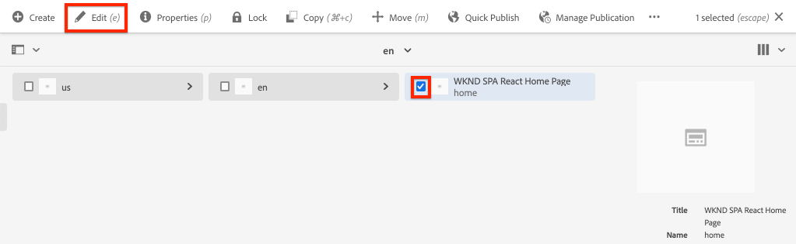

# Crear proyecto {#spa-editor-project}

Obtenga información sobre cómo generar un proyecto de Adobe Experience Manager (AEM) Maven como punto de partida para una aplicación React integrada con el AEM SPA Editor.

## Objetivo

1. Genere un proyecto habilitado para SPA Editor mediante el tipo de archivo del proyecto AEM.
2. Implemente el proyecto de inicio en una instancia local de AEM.

## Qué va a generar {#what-build}

En este capítulo, se genera un nuevo proyecto de AEM, basado en la variable [Tipo de archivo del proyecto AEM](https://github.com/adobe/aem-project-archetype). El proyecto AEM está arrancado con un punto de partida muy sencillo para la SPA React.

**¿Qué es un proyecto Maven?** - [Maven Apache](https://maven.apache.org/) es una herramienta de gestión de software para crear proyectos. *Todas las Adobe Experience Manager* las implementaciones de utilizan proyectos de Maven para crear, administrar e implementar código personalizado sobre AEM.

**¿Qué es un arquetipo de Maven?** - A [Arquetipo de Maven](https://maven.apache.org/archetype/index.html) es una plantilla o un patrón para generar nuevos proyectos. El arquetipo de proyecto AEM permite generar un nuevo proyecto con un área de nombres personalizada e incluir una estructura de proyecto que siga las prácticas recomendadas, lo que acelera enormemente nuestro proyecto.

## Requisitos previos

Revise las herramientas e instrucciones necesarias para configurar un [entorno de desarrollo local](overview.md#local-dev-environment). Asegúrese de que se ha iniciado una nueva instancia de Adobe Experience Manager en **author** se está ejecutando localmente.

## Crear el proyecto {#create}

>[!NOTE]
>
>Este tutorial utiliza la versión **27** del tipo de archivo. Siempre es recomendable usar la variable **última versión** versión del tipo de archivo para generar un nuevo proyecto.

1. Abra un terminal de línea de comandos e introduzca el siguiente comando Maven:

   ```shell
   mvn -B archetype:generate \
    -D archetypeGroupId=com.adobe.aem \
    -D archetypeArtifactId=aem-project-archetype \
    -D archetypeVersion=27 \
    -D appTitle="WKND SPA React" \
    -D appId="wknd-spa-react" \
    -D artifactId="aem-guides-wknd-spa.react" \
    -D groupId="com.adobe.aem.guides.wkndspa.react" \
    -D frontendModule="react" \
    -D aemVersion="cloud"
   ```

   >[!NOTE]
   >
   > Si la segmentación AEM 6.5.5+, sustituya `aemVersion="cloud"` con `aemVersion="6.5.5"`. Si va a ser la versión 6.4.8 o posterior, use `aemVersion="6.4.8"`.

   Observe que `frontendModule=react` propiedad. Esto indica al tipo de archivo del proyecto AEM que arranque el proyecto con un inicio [React code base](https://experienceleague.adobe.com/docs/experience-manager-core-components/using/developing/archetype/uifrontend-react.html) para usar con el AEM SPA Editor. Propiedades como `appTitle`, `appId`, `artifactId`y `groupId` se utilizan para identificar el proyecto y el propósito.

   Una lista completa de las propiedades disponibles para configurar un proyecto [se puede encontrar aquí](https://github.com/adobe/aem-project-archetype#available-properties).

1. El tipo de archivo Maven del sistema de archivos local genera la siguiente estructura de carpetas y archivos:

   ```plain
   |--- aem-guides-wknd-spa.react/
       |--- all/
       |--- core/
       |--- ui.apps/
       |--- ui.apps.structure/
       |--- ui.config/
       |--- ui.content/
       |--- ui.frontend/
       |--- ui.tests /
       |--- it.tests/
       |--- dispatcher/
       |--- pom.xml
       |--- README.md
       |--- .gitignore
   ```

   Cada carpeta representa un módulo Maven individual. En este tutorial, principalmente trabajaremos con el `ui.frontend` , que es la aplicación React. Puede encontrar más información sobre módulos individuales en la [Documentación del tipo de archivo del proyecto AEM](https://experienceleague.adobe.com/docs/experience-manager-core-components/using/developing/archetype/overview.html).

## Implementar y crear el proyecto

A continuación, compile, cree e implemente el código del proyecto en una instancia local de AEM mediante Maven.

1. Asegúrese de que una instancia de AEM se esté ejecutando localmente en el puerto **4502**.
1. Desde la línea de comandos, vaya a la `aem-guides-wknd-spa.react` directorio del proyecto.

   ```shell
   $ cd aem-guides-wknd-spa.react
   ```

1. Ejecute el siguiente comando para crear e implementar todo el proyecto para AEM:

   ```shell
   $ mvn clean install -PautoInstallSinglePackage
   ```

   La compilación tardará aproximadamente un minuto y debe terminar con el siguiente mensaje:

   ```shell
   ...
   [INFO] ------------------------------------------------------------------------
   [INFO] Reactor Summary for aem-guides-wknd-spa.react 1.0.0-SNAPSHOT:
   [INFO]
   [INFO] aem-guides-wknd-spa.react .......................... SUCCESS [  0.257 s]
   [INFO] WKND SPA React - Core .............................. SUCCESS [ 12.553 s]
   [INFO] WKND SPA React - UI Frontend ....................... SUCCESS [01:46 min]
   [INFO] WKND SPA React - Repository Structure Package ...... SUCCESS [  1.082 s]
   [INFO] WKND SPA React - UI apps ........................... SUCCESS [  8.237 s]
   [INFO] WKND SPA React - UI content ........................ SUCCESS [  5.633 s]
   [INFO] WKND SPA React - UI config ......................... SUCCESS [  0.234 s]
   [INFO] WKND SPA React - All ............................... SUCCESS [  0.643 s]
   [INFO] WKND SPA React - Integration Tests ................. SUCCESS [ 12.377 s]
   [INFO] WKND SPA React - Dispatcher ........................ SUCCESS [  0.066 s]
   [INFO] WKND SPA React - UI Tests .......................... SUCCESS [  0.074 s]
   [INFO] WKND SPA React - Project Analyser .................. SUCCESS [ 31.287 s]
   [INFO] ------------------------------------------------------------------------
   [INFO] BUILD SUCCESS
   [INFO] ------------------------------------------------------------------------
   ```

   El perfil de Maven `autoInstallSinglePackage` compila los módulos individuales del proyecto e implementa un paquete único en la instancia de AEM. De forma predeterminada, este paquete se implementa en una instancia de AEM que se ejecuta localmente en el puerto **4502** y con las credenciales de `admin:admin`.

1. Vaya a **Administrador de paquetes** en la instancia de AEM local: [http://localhost:4502/crx/packmgr/index.jsp](http://localhost:4502/crx/packmgr/index.jsp).

1. Debería ver varios paquetes con el prefijo `aem-guides-wknd-spa.react`.

   

   *Administrador de paquetes AEM*

   Todo el código personalizado necesario para el proyecto está empaquetado en estos paquetes e instalado en el entorno de AEM.

## Contenido de autor

A continuación, abra el SPA de inicio generado por el tipo de archivo y actualice parte del contenido.

1. Vaya a la **Sitios** consola: [http://localhost:4502/sites.html/content](http://localhost:4502/sites.html/content).

   La SPA WKND incluye una estructura básica del sitio con un país, idioma y página de inicio. Esta jerarquía se basa en los valores predeterminados del tipo de archivo para `language_country` y `isSingleCountryWebsite`. Estos valores se pueden sobrescribir actualizando la variable [propiedades disponibles](https://github.com/adobe/aem-project-archetype#available-properties) al generar un proyecto.

2. Abra el **us** > **en** > **Página principal de WKND SPA React** seleccionando la página y haciendo clic en el botón **Editar** en la barra de menús:

   

3. A **Texto** ya se ha agregado a la página. Puede editar este componente como cualquier otro componente de AEM.

   

4. Agregue un **Texto** a la página.

   Tenga en cuenta que la experiencia de creación es similar a la de una página de AEM Sites tradicional. Actualmente hay un número limitado de componentes disponibles para usar. Se ha añadido más información a lo largo del tutorial.

## Inspect: aplicación de una sola página

A continuación, compruebe que se trata de una aplicación de una sola página con las herramientas para desarrolladores del explorador.

1. En el **Editor de página**, haga clic en **Información de la página** botón > **Ver tal y como aparece publicado**:

   

   Se abrirá una nueva pestaña con el parámetro de consulta `?wcmmode=disabled` que desactiva el editor de AEM: [http://localhost:4502/content/wknd-spa-react/us/en/home.html?wcmmode=disabled](http://localhost:4502/content/wknd-spa-react/us/en/home.html?wcmmode=disabled)

2. Vea la fuente de la página y observe que el contenido de texto **[!DNL Hello World]** o cualquier otro contenido no se encuentra. En su lugar, debería ver un HTML como el siguiente:

   ```html
   ...
   <body>
       <noscript>You need to enable JavaScript to run this app.</noscript>
       <div id="spa-root"></div>
       <script type="text/javascript" src="/etc.clientlibs/wknd-spa-react/clientlibs/clientlib-react.lc-xxxx-lc.min.js"></script>
   </body>
   ...
   ```

   `clientlib-react.min.js` es la SPA React que se carga en la página y responsable de procesar el contenido.

   Sin embargo, *¿de dónde viene el contenido?*

3. Vuelva a la pestaña : [http://localhost:4502/content/wknd-spa-react/us/en/home.html?wcmmode=disabled](http://localhost:4502/content/wknd-spa-react/us/en/home.html?wcmmode=disabled)
4. Abra las herramientas para desarrolladores del explorador e inspeccione el tráfico de red de la página durante una actualización. Consulte la **XHR** solicitudes:

   

   Debe haber una solicitud para [http://localhost:4502/content/wknd-spa-react/us/en.model.json](http://localhost:4502/content/wknd-spa-react/us/en.model.json). Contiene todo el contenido, con formato JSON, que dirigirá el SPA.

5. En una pestaña nueva, abra [http://localhost:4502/content/wknd-spa-react/us/en.model.json](http://localhost:4502/content/wknd-spa-react/us/en.model.json)

   La solicitud `en.model.json` representa el modelo de contenido que dirigirá la aplicación. Inspect utiliza la salida JSON y debe poder encontrar el fragmento que representa la variable **[!UICONTROL Texto]** componentes.

   ```json
   ...
   ":items": {
       "text": {
           "text": "<p>Hello World! Updated content!</p>\r\n",
           "richText": true,
           ":type": "wknd-spa-react/components/text"
       },
       "text_98796435": {
           "text": "<p>A new text component.</p>\r\n",
           "richText": true,
           ":type": "wknd-spa-react/components/text"
       },
   }
   ...
   ```

   En el siguiente capítulo analizaremos cómo se asigna este contenido JSON de AEM componentes a SPA componentes para formar la base de la experiencia del AEM SPA editor.

   >[!NOTE]
   >
   > Puede resultar útil instalar una extensión del explorador para dar formato automáticamente a la salida JSON.

## Felicitaciones! {#congratulations}

¡Felicidades, acaba de crear su primer proyecto AEM SPA Editor!

El SPA es bastante sencillo. En los siguientes capítulos se agrega más funcionalidad.

### Siguientes pasos {#next-steps}

[Integrar un SPA](integrate-spa.md) - Aprenda cómo el código fuente SPA está integrado con el proyecto AEM y comprenda las herramientas disponibles para desarrollar rápidamente el SPA.
