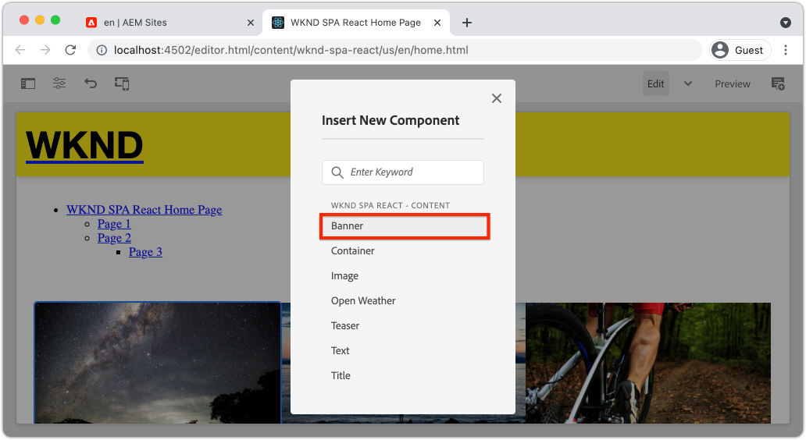

# Ampliación de un componente principal {#extend-component}

Obtenga información sobre cómo ampliar un componente principal existente para utilizarlo con AEM SPA Editor. Comprender cómo ampliar un componente existente es una técnica potente para personalizar y ampliar las capacidades de una implementación de AEM SPA Editor.

## Objetivo

1. Ampliar un componente principal existente con propiedades y contenido adicionales.
2. Comprenda los conceptos básicos de la herencia de componentes con el uso de `sling:resourceSuperType`.
3. Aprenda a aprovechar [Patrón de delegación](https://github.com/adobe/aem-core-wcm-components/wiki/Delegation-Pattern-for-Sling-Models) para modelos Sling para reutilizar la lógica y la funcionalidad existentes.

## Qué va a generar

Este capítulo ilustra el código adicional necesario para agregar una propiedad adicional a un componente estándar `Image` para cumplir los requisitos de un nuevo componente `Banner`. El componente `Banner` contiene las mismas propiedades que el componente `Image` estándar, pero incluye una propiedad adicional para que los usuarios rellenen **Banner Text**.


## Requisitos previos

Revise las herramientas y las instrucciones necesarias para configurar un [entorno de desarrollo local](overview.md#local-dev-environment). Se supone que en este punto del tutorial los usuarios tienen una comprensión sólida de la función AEM SPA Editor.

## Herencia con el supertipo de recursos de Sling {#sling-resource-super-type}

Para ampliar un componente existente, establezca una propiedad denominada `sling:resourceSuperType` en la definición del componente.  `sling:resourceSuperType` es una [propiedad](https://sling.apache.org/documentation/the-sling-engine/resources.html#resource-properties) que se puede establecer en la definición de un componente de AEM que señala a otro componente. Esto establece explícitamente que el componente heredará toda la funcionalidad del componente identificado como `sling:resourceSuperType`.

Si queremos extender el componente `Image` en `wknd-spa-react/components/image`, necesitamos actualizar el código en el módulo `ui.apps`.

1. Cree una nueva carpeta debajo del módulo `ui.apps` para `banner` en `ui.apps/src/main/content/jcr_root/apps/wknd-spa-react/components/banner`.
1. Debajo de `banner`, cree una definición de componente (`.content.xml`) como la siguiente:

   ```xml
   <?xml version="1.0" encoding="UTF-8"?>
   <jcr:root xmlns:sling="http://sling.apache.org/jcr/sling/1.0" xmlns:cq="http://www.day.com/jcr/cq/1.0" xmlns:jcr="http://www.jcp.org/jcr/1.0"
       jcr:primaryType="cq:Component"
       jcr:title="Banner"
       sling:resourceSuperType="wknd-spa-react/components/image"
       componentGroup="WKND SPA React - Content"/>
   ```

   Esto configura `wknd-spa-react/components/banner` para que herede toda la funcionalidad de `wknd-spa-react/components/image`.

## cq:editConfig {#cq-edit-config}

El archivo `_cq_editConfig.xml` dicta el comportamiento de arrastrar y soltar en la IU de creación de AEM. Al ampliar el componente de imagen, es importante que el tipo de recurso coincida con el propio componente.

1. En el módulo `ui.apps`, cree otro archivo debajo de `banner` con el nombre `_cq_editConfig.xml`.
1. Rellene `_cq_editConfig.xml` con el siguiente XML:

   ```xml
   <?xml version="1.0" encoding="UTF-8"?>
   <jcr:root xmlns:sling="http://sling.apache.org/jcr/sling/1.0" xmlns:cq="http://www.day.com/jcr/cq/1.0" xmlns:jcr="http://www.jcp.org/jcr/1.0" xmlns:nt="http://www.jcp.org/jcr/nt/1.0"
       jcr:primaryType="cq:EditConfig">
       <cq:dropTargets jcr:primaryType="nt:unstructured">
           <image
               jcr:primaryType="cq:DropTargetConfig"
               accept="[image/gif,image/jpeg,image/png,image/webp,image/tiff,image/svg\\+xml]"
               groups="[media]"
               propertyName="./fileReference">
               <parameters
                   jcr:primaryType="nt:unstructured"
                   sling:resourceType="wknd-spa-react/components/banner"
                   imageCrop=""
                   imageMap=""
                   imageRotate=""/>
           </image>
       </cq:dropTargets>
       <cq:inplaceEditing
           jcr:primaryType="cq:InplaceEditingConfig"
           active="{Boolean}true"
           editorType="image">
           <inplaceEditingConfig jcr:primaryType="nt:unstructured">
               <plugins jcr:primaryType="nt:unstructured">
                   <crop
                       jcr:primaryType="nt:unstructured"
                       supportedMimeTypes="[image/jpeg,image/png,image/webp,image/tiff]"
                       features="*">
                       <aspectRatios jcr:primaryType="nt:unstructured">
                           <wideLandscape
                               jcr:primaryType="nt:unstructured"
                               name="Wide Landscape"
                               ratio="0.6180"/>
                           <landscape
                               jcr:primaryType="nt:unstructured"
                               name="Landscape"
                               ratio="0.8284"/>
                           <square
                               jcr:primaryType="nt:unstructured"
                               name="Square"
                               ratio="1"/>
                           <portrait
                               jcr:primaryType="nt:unstructured"
                               name="Portrait"
                               ratio="1.6180"/>
                       </aspectRatios>
                   </crop>
                   <flip
                       jcr:primaryType="nt:unstructured"
                       supportedMimeTypes="[image/jpeg,image/png,image/webp,image/tiff]"
                       features="-"/>
                   <map
                       jcr:primaryType="nt:unstructured"
                       supportedMimeTypes="[image/jpeg,image/png,image/webp,image/tiff,image/svg+xml]"
                       features="*"/>
                   <rotate
                       jcr:primaryType="nt:unstructured"
                       supportedMimeTypes="[image/jpeg,image/png,image/webp,image/tiff]"
                       features="*"/>
                   <zoom
                       jcr:primaryType="nt:unstructured"
                       supportedMimeTypes="[image/jpeg,image/png,image/webp,image/tiff]"
                       features="*"/>
               </plugins>
               <ui jcr:primaryType="nt:unstructured">
                   <inline
                       jcr:primaryType="nt:unstructured"
                       toolbar="[crop#launch,rotate#right,history#undo,history#redo,fullscreen#fullscreen,control#close,control#finish]">
                       <replacementToolbars
                           jcr:primaryType="nt:unstructured"
                           crop="[crop#identifier,crop#unlaunch,crop#confirm]"/>
                   </inline>
                   <fullscreen jcr:primaryType="nt:unstructured">
                       <toolbar
                           jcr:primaryType="nt:unstructured"
                           left="[crop#launchwithratio,rotate#right,flip#horizontal,flip#vertical,zoom#reset100,zoom#popupslider]"
                           right="[history#undo,history#redo,fullscreen#fullscreenexit]"/>
                       <replacementToolbars jcr:primaryType="nt:unstructured">
                           <crop
                               jcr:primaryType="nt:unstructured"
                               left="[crop#identifier]"
                               right="[crop#unlaunch,crop#confirm]"/>
                           <map
                               jcr:primaryType="nt:unstructured"
                               left="[map#rectangle,map#circle,map#polygon]"
                               right="[map#unlaunch,map#confirm]"/>
                       </replacementToolbars>
                   </fullscreen>
               </ui>
           </inplaceEditingConfig>
       </cq:inplaceEditing>
   </jcr:root>
   ```

1. El aspecto único del archivo es el nodo `<parameters>` que establece resourceType en `wknd-spa-react/components/banner`.

   ```xml
   <parameters
       jcr:primaryType="nt:unstructured"
       sling:resourceType="wknd-spa-react/components/banner"
       imageCrop=""
       imageMap=""
       imageRotate=""/>
   ```

   La mayoría de los componentes no requieren un `_cq_editConfig`. Los componentes de imagen y los descendientes son la excepción.

## Ampliación del cuadro de diálogo {#extend-dialog}

Nuestro componente `Banner` requiere un campo de texto adicional en el cuadro de diálogo para capturar `bannerText`. Como estamos usando la herencia de Sling, podemos usar las características de [Fusión de recursos de Sling](https://experienceleague.adobe.com/docs/experience-manager-65/developing/platform/sling-resource-merger.html?lang=es) para anular o ampliar partes del cuadro de diálogo. En este ejemplo, se ha añadido una nueva pestaña al cuadro de diálogo para capturar datos adicionales de un autor para rellenar el componente de tarjeta.

1. En el módulo `ui.apps`, debajo de la carpeta `banner`, cree una carpeta denominada `_cq_dialog`.
1. Debajo de `_cq_dialog` cree un archivo de definición de cuadro de diálogo `.content.xml`. Rellénelo con lo siguiente:

   ```xml
   <?xml version="1.0" encoding="UTF-8"?>
   <jcr:root xmlns:sling="http://sling.apache.org/jcr/sling/1.0" xmlns:granite="http://www.adobe.com/jcr/granite/1.0" xmlns:cq="http://www.day.com/jcr/cq/1.0" xmlns:jcr="http://www.jcp.org/jcr/1.0" xmlns:nt="http://www.jcp.org/jcr/nt/1.0"
       jcr:primaryType="nt:unstructured"
       jcr:title="Banner"
       sling:resourceType="cq/gui/components/authoring/dialog">
       <content jcr:primaryType="nt:unstructured">
           <items jcr:primaryType="nt:unstructured">
               <tabs jcr:primaryType="nt:unstructured">
                   <items jcr:primaryType="nt:unstructured">
                       <text
                           jcr:primaryType="nt:unstructured"
                           jcr:title="Text"
                           sling:orderBefore="asset"
                           sling:resourceType="granite/ui/components/coral/foundation/container"
                           margin="{Boolean}true">
                           <items jcr:primaryType="nt:unstructured">
                               <columns
                                   jcr:primaryType="nt:unstructured"
                                   sling:resourceType="granite/ui/components/coral/foundation/fixedcolumns"
                                   margin="{Boolean}true">
                                   <items jcr:primaryType="nt:unstructured">
                                       <column
                                           jcr:primaryType="nt:unstructured"
                                           sling:resourceType="granite/ui/components/coral/foundation/container">
                                           <items jcr:primaryType="nt:unstructured">
                                               <textGroup
                                                   granite:hide="${cqDesign.titleHidden}"
                                                   jcr:primaryType="nt:unstructured"
                                                   sling:resourceType="granite/ui/components/coral/foundation/well">
                                                   <items jcr:primaryType="nt:unstructured">
                                                       <bannerText
                                                           jcr:primaryType="nt:unstructured"
                                                           sling:resourceType="granite/ui/components/coral/foundation/form/textfield"
                                                           fieldDescription="Text to display on top of the banner."
                                                           fieldLabel="Banner Text"
                                                           name="./bannerText"/>
                                                   </items>
                                               </textGroup>
                                           </items>
                                       </column>
                                   </items>
                               </columns>
                           </items>
                       </text>
                   </items>
               </tabs>
           </items>
       </content>
   </jcr:root>
   ```

   La definición XML anterior creará una nueva ficha denominada **Texto** y la ordenará *antes* de la ficha **Recurso** existente. Contendrá un solo campo **Texto del titular**.

1. El cuadro de diálogo tendrá el siguiente aspecto:

   

   Observe que no tuvimos que definir las fichas para **Asset** o **Metadata**. Se heredan mediante la propiedad `sling:resourceSuperType`.

   Antes de poder obtener una vista previa del cuadro de diálogo, es necesario implementar el componente SPA y la función `MapTo`.

## Implementación del componente SPA {#implement-spa-component}

Para utilizar el componente Banner con el Editor de SPA, se debe crear un nuevo componente de SPA que se asignará a `wknd-spa-react/components/banner`. Esto se hace en el módulo `ui.frontend`.

1. En el módulo `ui.frontend`, cree una nueva carpeta para `Banner` en `ui.frontend/src/components/Banner`.
1. Cree un nuevo archivo con el nombre `Banner.js` debajo de la carpeta `Banner`. Rellénelo con lo siguiente:

   ```js
   import React, {Component} from 'react';
   import {MapTo} from '@adobe/aem-react-editable-components';
   
   export const BannerEditConfig = {
       emptyLabel: 'Banner',
   
       isEmpty: function(props) {
           return !props || !props.src || props.src.trim().length < 1;
       }
   };
   
   export default class Banner extends Component {
   
       get content() {
           return ;
       }
   
       // display our custom bannerText property!
       get bannerText() {
           if(this.props.bannerText) {
               return <h4>{this.props.bannerText}</h4>;
           }
   
           return null;
       }
   
       render() {
           if (BannerEditConfig.isEmpty(this.props)) {
               return null;
           }
   
           return (
               <div className="Banner">
                   {this.bannerText}
                   <div className="BannerImage">{this.content}</div>
               </div>
           );
       }
   }
   
   MapTo('wknd-spa-react/components/banner')(Banner, BannerEditConfig);
   ```

   Este componente de SPA se asigna al componente de AEM `wknd-spa-react/components/banner` creado anteriormente.

1. Actualizar `import-components.js` a las `ui.frontend/src/components/import-components.js` para incluir el nuevo componente de SPA `Banner`:

   ```diff
     import './ExperienceFragment/ExperienceFragment';
     import './OpenWeather/OpenWeather';
   + import './Banner/Banner';
   ```

1. En este punto, el proyecto se puede implementar en AEM y el cuadro de diálogo se puede probar. Implemente el proyecto con sus habilidades con Maven:

   ```shell
   $ cd aem-guides-wknd-spa.react
   $ mvn clean install -PautoInstallSinglePackage
   ```

1. Actualice la directiva de la plantilla SPA para agregar el componente `Banner` como un **componente permitido**.

1. Vaya a una página de SPA y agregue el componente `Banner` a una de las páginas de SPA:

   

   >[!NOTE]
   >
   > El cuadro de diálogo le permitirá guardar un valor para **Texto del titular**, pero este valor no se refleja en el componente SPA. Para habilitarlo, necesitamos extender el modelo Sling para el componente.

## Añadir interfaz de Java {#java-interface}

Para exponer finalmente los valores del cuadro de diálogo del componente al componente React, debemos actualizar el modelo Sling que rellena el JSON para el componente `Banner`. Esto se hace en el módulo `core` que contiene todo el código Java para nuestro proyecto SPA.

En primer lugar, crearemos una nueva interfaz Java para `Banner` que amplía la interfaz Java `Image`.

1. En el módulo `core`, cree un nuevo archivo con el nombre `BannerModel.java` en `core/src/main/java/com/adobe/aem/guides/wkndspa/react/core/models`.
1. Rellene `BannerModel.java` con lo siguiente:

   ```java
   package com.adobe.aem.guides.wkndspa.react.core.models;
   
   import com.adobe.cq.wcm.core.components.models.Image;
   import org.osgi.annotation.versioning.ProviderType;
   
   @ProviderType
   public interface BannerModel extends Image {
   
       public String getBannerText();
   
   }
   ```

   Esto heredará todos los métodos de la interfaz del componente principal `Image` y agregará un nuevo método `getBannerText()`.

## Implementar el modelo Sling {#sling-model}

A continuación, implemente el modelo Sling para la interfaz `BannerModel`.

1. En el módulo `core`, cree un nuevo archivo con el nombre `BannerModelImpl.java` en `core/src/main/java/com/adobe/aem/guides/wkndspa/react/core/models/impl`.

1. Rellene `BannerModelImpl.java` con lo siguiente:

   ```java
   package com.adobe.aem.guides.wkndspa.react.core.models.impl;
   
   import com.adobe.aem.guides.wkndspa.react.core.models.BannerModel;
   import com.adobe.cq.export.json.ComponentExporter;
   import com.adobe.cq.export.json.ExporterConstants;
   import com.adobe.cq.wcm.core.components.models.Image;
   import org.apache.sling.models.annotations.*;
   import org.apache.sling.api.SlingHttpServletRequest;
   import org.apache.sling.models.annotations.Model;
   import org.apache.sling.models.annotations.injectorspecific.Self;
   import org.apache.sling.models.annotations.injectorspecific.ValueMapValue;
   import org.apache.sling.models.annotations.via.ResourceSuperType;
   
   @Model(
       adaptables = SlingHttpServletRequest.class, 
       adapters = { BannerModel.class,ComponentExporter.class}, 
       resourceType = BannerModelImpl.RESOURCE_TYPE, 
       defaultInjectionStrategy = DefaultInjectionStrategy.OPTIONAL
   )
   @Exporter(name = ExporterConstants.SLING_MODEL_EXPORTER_NAME, extensions = ExporterConstants.SLING_MODEL_EXTENSION)
   public class BannerModelImpl implements BannerModel {
   
       // points to the the component resource path in ui.apps
       static final String RESOURCE_TYPE = "wknd-spa-react/components/banner";
   
       @Self
       private SlingHttpServletRequest request;
   
       // With sling inheritance (sling:resourceSuperType) we can adapt the current resource to the Image class
       // this allows us to re-use all of the functionality of the Image class, without having to implement it ourself
       // see https://github.com/adobe/aem-core-wcm-components/wiki/Delegation-Pattern-for-Sling-Models
       @Self
       @Via(type = ResourceSuperType.class)
       private Image image;
   
       // map the property saved by the dialog to a variable named `bannerText`
       @ValueMapValue
       private String bannerText;
   
       // public getter to expose the value of `bannerText` via the Sling Model and JSON output
       @Override
       public String getBannerText() {
           return bannerText;
       }
   
       // Re-use the Image class for all other methods:
   
       @Override
       public String getSrc() {
           return null != image ? image.getSrc() : null;
       }
   
       @Override
       public String getAlt() {
           return null != image ? image.getAlt() : null;
       }
   
       @Override
       public String getTitle() {
           return null != image ? image.getTitle() : null;
       }
   
       // method required by `ComponentExporter` interface
       // exposes a JSON property named `:type` with a value of `wknd-spa-react/components/banner`
       // required to map the JSON export to the SPA component props via the `MapTo`
       @Override
       public String getExportedType() {
           return BannerModelImpl.RESOURCE_TYPE;
       }
   }
   ```

   Observe el uso de las anotaciones `@Model` y `@Exporter` para asegurarse de que el modelo Sling se pueda serializar como JSON a través del exportador del modelo Sling.

   `BannerModelImpl.java` utiliza el patrón de delegación [para modelos Sling](https://github.com/adobe/aem-core-wcm-components/wiki/Delegation-Pattern-for-Sling-Models) para evitar que se vuelva a escribir toda la lógica desde el componente principal de imagen.

1. Revise las líneas siguientes:

   ```java
   @Self
   @Via(type = ResourceSuperType.class)
   private Image image;
   ```

   La anotación anterior creará una instancia de un objeto de imagen denominado `image` basado en la herencia `sling:resourceSuperType` del componente `Banner`.

   ```java
   @Override
   public String getSrc() {
       return null != image ? image.getSrc() : null;
   }
   ```

   Entonces, es posible usar simplemente el objeto `image` para implementar métodos definidos por la interfaz `Image`, sin tener que escribir la lógica nosotros mismos. Esta técnica se usa para `getSrc()`, `getAlt()` y `getTitle()`.

1. Abra una ventana de terminal e implemente solo las actualizaciones del módulo `core` mediante el perfil Maven `autoInstallBundle` desde el directorio `core`.

   ```shell
   $ cd core/
   $ mvn clean install -PautoInstallBundle
   ```

## En resumen {#put-together}

1. Vuelva a AEM y abra la página de la SPA que tiene el componente `Banner`.
1. Actualizar el componente `Banner` para incluir **Texto del titular**:

   

1. Rellene el componente con una imagen:

   

   Guarde las actualizaciones del cuadro de diálogo.

1. Ahora debería ver el valor procesado de **Texto del titular**:


1. Vea la respuesta del modelo JSON en: [http://localhost:4502/content/wknd-spa-react/us/en.model.json](http://localhost:4502/content/wknd-spa-react/us/en.model.json) y busque `wknd-spa-react/components/card`:

   ```json
   "banner": {
       "bannerText": "My Banner Text",
       "src": "/content/wknd-spa-react/us/en/home/_jcr_content/root/responsivegrid/banner.coreimg.jpeg/1622167884688/sport-climbing.jpeg",
       "alt": "alt banner rock climber",
       ":type": "wknd-spa-react/components/banner"
    },
   ```

   Observe que el modelo JSON se actualiza con pares clave/valor adicionales después de implementar el modelo Sling en `BannerModelImpl.java`.

## Enhorabuena. {#congratulations}

¡Enhorabuena! Ha aprendido a ampliar un componente de AEM mediante y cómo funcionan los modelos Sling y los cuadros de diálogo con el modelo JSON.
