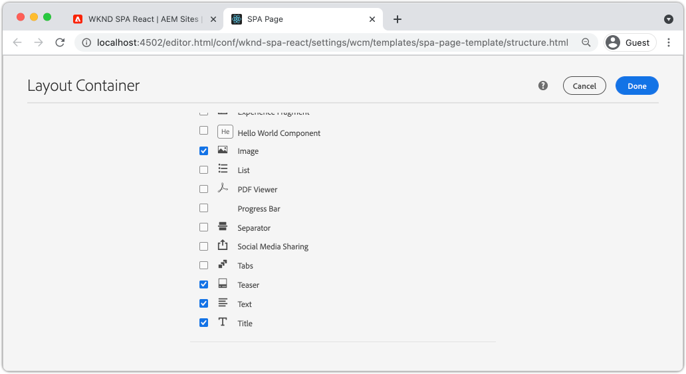
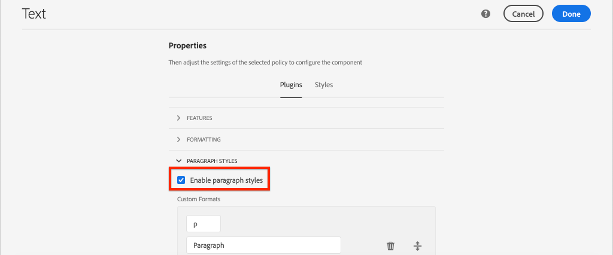
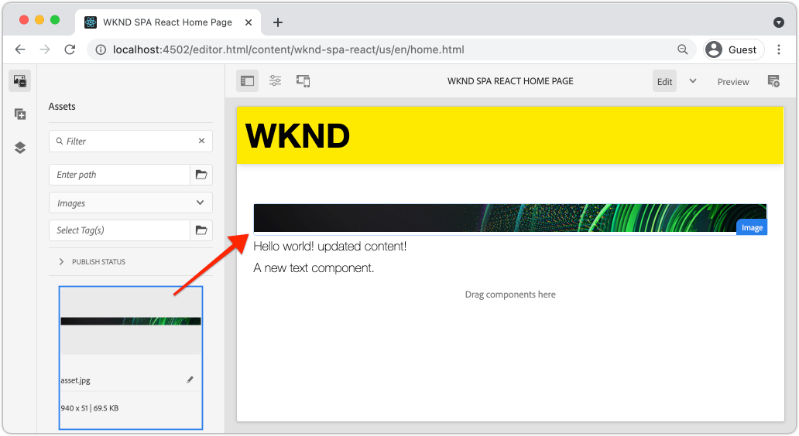
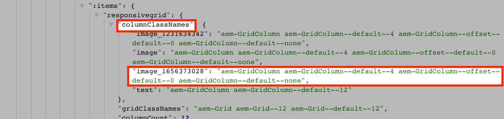

# Asignación de componentes de SPA a componentes de AEM {#map-components}

Obtenga información sobre cómo asignar componentes de React a componentes de Adobe Experience Manager (AEM) con el SDK de JS de AEM Editor SPA. La asignación de componentes permite a los usuarios realizar actualizaciones dinámicas de los componentes de SPA dentro del AEM SPA Editor, de forma similar a la creación de AEM tradicional.

Este capítulo profundiza en la API del modelo JSON de AEM y en cómo el contenido JSON expuesto por un componente AEM se puede insertar automáticamente en un componente React como props.

## Objetivo

1. Obtenga información sobre cómo asignar AEM componentes a SPA componentes.
1. Inspect cómo un componente React utiliza propiedades dinámicas pasadas desde AEM.
1. Aprenda a utilizar fuera de la caja [Reacción AEM componentes principales](https://github.com/adobe/aem-react-core-wcm-components-examples).

## Qué va a generar

Este capítulo inspecciona cómo se proporciona `Text` SPA componente está asignado al AEM `Text`componente. Reaccione los componentes principales como el `Image` SPA componente se utiliza en el SPA y se crea en AEM. Las funciones predeterminadas de la variable **Contenedor de diseño** y **Editor de plantillas** las políticas también se utilizan para crear una vista un poco más variada en apariencia.


## Requisitos previos

Revise las herramientas e instrucciones necesarias para configurar un [entorno de desarrollo local](overview.md#local-dev-environment). Este capítulo es una continuación del [Integrar el SPA](integrate-spa.md) capítulo, sin embargo, para seguir todo lo que necesita es un proyecto de AEM habilitado para SPA.

## Enfoque de asignación

El concepto básico es asignar un componente SPA a un componente AEM. AEM componentes, ejecute contenido de exportación del lado del servidor como parte de la API del modelo JSON. El contenido JSON lo consume la SPA, que ejecuta el lado del cliente en el explorador. Se crea una asignación 1:1 entre SPA componentes y un componente AEM.


*Resumen general de alto nivel de asignación de un componente AEM a un componente React*

## Inspect del componente de texto

La variable [Tipo de archivo del proyecto AEM](https://github.com/adobe/aem-project-archetype) proporciona un `Text` componente asignado al AEM [Componente de texto](https://experienceleague.adobe.com/docs/experience-manager-core-components/using/components/text.html). Este es un ejemplo de **contenido** componente, en el que se procesa *contenido* de AEM.

Veamos cómo funciona el componente.

### Inspect con el modelo JSON

1. Antes de saltar al código SPA, es importante comprender el modelo JSON que AEM proporciona. Vaya a la [Biblioteca de componentes principales](https://www.aemcomponents.dev/content/core-components-examples/library/core-content/text.html) y vea la página del componente Texto . La biblioteca de componentes principales proporciona ejemplos de todos los componentes principales de AEM.
1. Seleccione el **JSON** para ver uno de los ejemplos:

   

   Debería ver tres propiedades: `text`, `richText`y `:type`.

   `:type` es una propiedad reservada que muestra la variable `sling:resourceType` (o ruta) del componente AEM. El valor de `:type` es lo que se utiliza para asignar el componente AEM al componente SPA.

   `text` y `richText` son propiedades adicionales que se exponen al componente SPA.

1. Ver la salida JSON en [http://localhost:4502/content/wknd-spa-react/us/en.model.json](http://localhost:4502/content/wknd-spa-react/us/en.model.json). Debe poder encontrar una entrada similar a:

   ```json
   "text": {
       "id": "text-a647cec03a",
       "text": "<p>Hello World! Updated content!</p>\r\n",
       "richText": true,
       ":type": "wknd-spa-react/components/text",
       "dataLayer": {}
      }
   ```

### Inspect del componente Texto SPA

1. En el IDE de su elección, abra el proyecto AEM para el SPA. Expanda el `ui.frontend` y abra el archivo `Text.js` under `ui.frontend/src/components/Text/Text.js`.

1. La primera área que analizaremos es la `class Text` en ~line 40:

   ```js
   class Text extends Component {
   
       get richTextContent() {
           return (<div
                   id={extractModelId(this.props.cqPath)}
                   data-rte-editelement
                   dangerouslySetInnerHTML={{__html: DOMPurify.sanitize(this.props.text)}} />
                   );
       }
   
       get textContent() {
           return <div>{this.props.text}</div>;
       }
   
       render() {
           return this.props.richText ? this.richTextContent : this.textContent;
       }
   }
   ```

   `Text` es un componente React estándar. El componente utiliza `this.props.richText` para determinar si el contenido que se va a procesar va a ser texto enriquecido o texto sin formato. El &quot;contenido&quot; real utilizado proviene de `this.props.text`.

   Para evitar un posible ataque XSS, el texto enriquecido se escapa mediante `DOMPurify` antes de utilizar [peligrosamenteSetInnerHTML](https://reactjs.org/docs/dom-elements.html#dangerouslysetinnerhtml) para procesar el contenido. Recuerde `richText` y `text` propiedades del modelo JSON anteriormente en el ejercicio.

1. A continuación, eche un vistazo a la `TextEditConfig` en ~line 29:

   ```js
   const TextEditConfig = {
   emptyLabel: 'Text',
   
       isEmpty: function(props) {
           return !props || !props.text || props.text.trim().length < 1;
       }
   };
   ```

   El código anterior es responsable de determinar cuándo procesar el marcador de posición en el entorno de creación de AEM. Si la variable `isEmpty` devuelve el método **true** a continuación, se representa el marcador de posición.

1. Finalmente, eche un vistazo a la `MapTo` llamada a ~line 62:

   ```js
   export default MapTo('wknd-spa-react/components/text')(Text, TextEditConfig);
   ```

   `MapTo` es proporcionado por AEM SPA Editor JS SDK (`@adobe/aem-react-editable-components`). La ruta `wknd-spa-react/components/text` representa la variable `sling:resourceType` del componente AEM. Esta ruta se corresponde con la variable `:type` expuesto por el modelo JSON observado anteriormente. `MapTo` se encarga de analizar la respuesta del modelo JSON y pasar los valores correctos como `props` al componente SPA.

   Puede encontrar el AEM `Text` definición de componente en `ui.apps/src/main/content/jcr_root/apps/wknd-spa-react/components/text`.

## Usar componentes principales de React

[Componentes de WCM de AEM: implementación principal de React](https://github.com/adobe/aem-react-core-wcm-components-base) y [Componentes de WCM de AEM: editor de spa: implementación de React Core](https://github.com/adobe/aem-react-core-wcm-components-spa). Se trata de un conjunto de componentes de interfaz de usuario reutilizables que se asignan a componentes de AEM listos para usar. La mayoría de los proyectos pueden reutilizar estos componentes como punto de partida para su propia implementación.

1. En el código del proyecto, abra el archivo . `import-components.js` at `ui.frontend/src/components`.
Este archivo importa todos los componentes de SPA que se asignan a AEM componentes. Dada la naturaleza dinámica de la implementación del Editor de SPA, debemos hacer referencia explícita a cualquier componente de SPA vinculado a AEM componentes que se pueden crear. Esto permite a un autor AEM elegir utilizar un componente dondequiera que lo desee en la aplicación.
1. Las siguientes instrucciones de importación incluyen SPA componentes escritos en el proyecto:

   ```js
   import './Page/Page';
   import './Text/Text';
   import './Container/Container';
   import './ExperienceFragment/ExperienceFragment';
   ```

1. Hay varios otros `imports` from `@adobe/aem-core-components-react-spa` y `@adobe/aem-core-components-react-base`. Se trata de importar los componentes de React Core y ponerlos a disposición del proyecto actual. A continuación, se asignan a componentes de AEM específicos del proyecto mediante la variable `MapTo`, igual que con la variable `Text` ejemplo de componente anterior.

### Actualizar directivas AEM

Las políticas son una característica de AEM plantillas que proporciona a los desarrolladores y a los usuarios avanzados un control granular sobre qué componentes están disponibles para usar. Los componentes principales de React se incluyen en el código SPA, pero deben habilitarse mediante una directiva para poder utilizarse en la aplicación.

1. Desde la pantalla Inicio de AEM vaya a **Herramientas** > **Plantillas** > **[WKND SPA React](http://localhost:4502/libs/wcm/core/content/sites/templates.html/conf/wknd-spa-react)**.

1. Seleccione y abra el **Página SPA** plantilla para editar.

1. Seleccione el **Contenedor de diseño** y haga clic en ella **directiva** para editar la directiva:

   

1. En **Componentes permitidos** > **WKND SPA React: contenido** > comprobar **Imagen**, **Teaser** y **Título**.

   

   En **Componentes predeterminados** > **Añadir asignación** y seleccione **Imagen: WKND SPA React - Contenido** componente:

   

   Escriba un **tipo mime** de `image/*`.

   Haga clic en **Listo** para guardar las actualizaciones de directiva.

1. En el **Contenedor de diseño** haga clic en **directiva** para **Texto** componente.

   Cree una nueva directiva con el nombre **WKND SPA texto**. En **Complementos** > **Formato** > marque todas las casillas para activar opciones de formato adicionales:

   

   En **Complementos** > **Estilos de párrafo** > marque la casilla para **Habilitar estilos de párrafo**:

   

   Haga clic en **Listo** para guardar la actualización de directiva.

### Contenido de autor

1. Vaya a la **Página principal** [http://localhost:4502/editor.html/content/wknd-spa-react/us/en/home.html](http://localhost:4502/editor.html/content/wknd-spa-react/us/en/home.html).

1. Ahora debería poder utilizar los componentes adicionales **Imagen**, **Teaser** y **Título** en la página .

   

1. También debe poder editar la variable `Text` componente y añadir estilos de párrafo adicionales en **pantalla completa** en el menú contextual.

   

1. También debe poder arrastrar y soltar una imagen desde el **Buscador de recursos**:

   

1. Experiencia con el **Título** y **Teaser** componentes.

1. Añada sus propias imágenes mediante [AEM Assets](http://localhost:4502/assets.html/content/dam) o instalar la base de código finalizada para el estándar [Sitio de referencia WKND](https://github.com/adobe/aem-guides-wknd/releases/latest). La variable [Sitio de referencia WKND](https://github.com/adobe/aem-guides-wknd/releases/latest) incluye muchas imágenes que se pueden reutilizar en el SPA WKND. El paquete se puede instalar mediante [Administrador de paquetes AEM](http://localhost:4502/crx/packmgr/index.jsp).

   

## Inspect: contenedor de diseño

Compatibilidad con **Contenedor de diseño** es proporcionado automáticamente por AEM SPA Editor SDK. La variable **Contenedor de diseño**, como se indica con el nombre, es un **container** componente. Los componentes de contenedor son componentes que aceptan estructuras JSON que representan *other* y cree instancias de ellos de forma dinámica.

Inspeccionemos más el contenedor de diseño.

1. En un navegador, vaya a [http://localhost:4502/content/wknd-spa-react/us/en.model.json](http://localhost:4502/content/wknd-spa-react/us/en.model.json)

   

   La variable **Contenedor de diseño** tiene un `sling:resourceType` de `wcm/foundation/components/responsivegrid` y es reconocido por el SPA Editor usando la variable `:type` como la `Text` y `Image` componentes.

   Las mismas capacidades para cambiar el tamaño de un componente mediante [Modo de diseño](https://experienceleague.adobe.com/docs/experience-manager-65/authoring/siteandpage/responsive-layout.html#defining-layouts-layout-mode) están disponibles con SPA Editor.

2. Volver a [http://localhost:4502/editor.html/content/wknd-spa-react/us/en/home.html](http://localhost:4502/editor.html/content/wknd-spa-react/us/en/home.html). Agregar adicional **Imagen** e intente cambiar el tamaño de los componentes mediante el **Diseño** opción:

   

3. Vuelva a abrir el modelo JSON [http://localhost:4502/content/wknd-spa-react/us/en.model.json](http://localhost:4502/content/wknd-spa-react/us/en.model.json) y observe la `columnClassNames` como parte del JSON:

   

   El nombre de clase `aem-GridColumn--default--4` indica que el componente debe tener 4 columnas de ancho en función de una cuadrícula de 12 columnas. Más detalles sobre [la cuadrícula interactiva se puede encontrar aquí](https://adobe-marketing-cloud.github.io/aem-responsivegrid/).

4. Vuelva al IDE y en el `ui.apps` hay una biblioteca del lado del cliente definida en `ui.apps/src/main/content/jcr_root/apps/wknd-spa-react/clientlibs/clientlib-grid`. Abra el archivo `less/grid.less`.

   Este archivo determina los puntos de interrupción (`default`, `tablet`y `phone`) que usa el **Contenedor de diseño**. Este archivo está diseñado para personalizarse según las especificaciones del proyecto. Actualmente, los puntos de interrupción están establecidos en `1200px` y `768px`.

5. Debe poder utilizar las capacidades de respuesta y las políticas de texto enriquecido actualizadas de la variable `Text` para crear una vista como la siguiente:

   

## Felicitaciones! {#congratulations}

Felicidades, ha aprendido a asignar SPA componentes a los componentes AEM y ha utilizado los componentes principales de React. También tiene la oportunidad de explorar las capacidades de respuesta del **Contenedor de diseño**.

### Siguientes pasos {#next-steps}

[Navegación y enrutamiento](navigation-routing.md) : Aprenda cómo se pueden admitir varias vistas de la SPA asignando páginas AEM con el SDK del Editor de SPA. La navegación dinámica se implementa mediante el router React y los componentes principales React.

## (Bono) Persistir configuraciones para control de código fuente {#bonus-configs}

En muchos casos, especialmente al principio de un proyecto AEM, es importante mantener las configuraciones, como las plantillas y las políticas de contenido relacionadas, para el control de código fuente. Esto garantiza que todos los desarrolladores trabajen con el mismo conjunto de contenido y configuraciones, y puede garantizar una coherencia adicional entre entornos. Una vez que un proyecto alcanza un cierto nivel de madurez, la práctica de administrar plantillas se puede transferir a un grupo especial de usuarios avanzados.

Los siguientes pasos se llevarán a cabo utilizando el IDE de código de Visual Studio y [VSCode AEM Sync](https://marketplace.visualstudio.com/items?itemName=yamato-ltd.vscode-aem-sync) pero podría estar utilizando cualquier herramienta y cualquier IDE que haya configurado **extraer** o **importar** contenido de una instancia local de AEM.

1. En el IDE de código de Visual Studio, asegúrese de que tiene **VSCode AEM Sync** instalado mediante la extensión de Marketplace:

   

2. Expanda el **ui.content** en el explorador de proyectos y vaya a `/conf/wknd-spa-react/settings/wcm/templates`.

3. **Clic con el botón derecho** el `templates` carpeta y seleccione **Importar desde AEM servidor**:

   

4. Repita los pasos para importar contenido, pero seleccione la opción **políticas** carpeta ubicada en `/conf/wknd-spa-react/settings/wcm/templates/policies`.

5. Inspect la variable `filter.xml` archivo ubicado en `ui.content/src/main/content/META-INF/vault/filter.xml`.

   ```xml
   <!--ui.content filter.xml-->
   <?xml version="1.0" encoding="UTF-8"?>
    <workspaceFilter version="1.0">
        <filter root="/conf/wknd-spa-react" mode="merge"/>
        <filter root="/content/wknd-spa-react" mode="merge"/>
        <filter root="/content/dam/wknd-spa-react" mode="merge"/>
        <filter root="/content/experience-fragments/wknd-spa-react" mode="merge"/>
    </workspaceFilter>
   ```

   La variable `filter.xml` es responsable de identificar las rutas de los nodos instalados con el paquete. Observe que `mode="merge"` en cada uno de los filtros que indica que el contenido existente no se modificará, solo se añadirá contenido nuevo. Dado que los autores de contenido pueden estar actualizando estas rutas, es importante que una implementación de código **not** sobrescribir contenido. Consulte la [Documentación de FileVault](https://jackrabbit.apache.org/filevault/filter.html) para obtener más información sobre cómo trabajar con elementos de filtro.

   Comparar `ui.content/src/main/content/META-INF/vault/filter.xml` y `ui.apps/src/main/content/META-INF/vault/filter.xml` para comprender los diferentes nodos administrados por cada módulo.

## (Bonos) Crear un componente de imagen personalizado {#bonus-image}

Los componentes principales de React ya han proporcionado un componente de imagen SPA. Sin embargo, si desea realizar prácticas adicionales, cree su propia implementación de React que se asigne a la AEM [Componente de imagen](https://experienceleague.adobe.com/docs/experience-manager-core-components/using/components/image.html). La variable `Image` es otro ejemplo de **contenido** componente.

### Inspect JSON

Antes de saltar al código SPA, revise el modelo JSON proporcionado por AEM.

1. Vaya a la [Ejemplos de imágenes en la biblioteca de componentes principales](https://www.aemcomponents.dev/content/core-components-examples/library/core-content/image.html).

   

   Propiedades de `src`, `alt`y `title` se usan para rellenar el SPA `Image` componente.

   >[!NOTE]
   >
   > Hay otras propiedades de imagen expuestas (`lazyEnabled`, `widths`) que permiten a un desarrollador crear un componente adaptable y de carga diferida. El componente creado en este tutorial es sencillo y **not** utilice estas propiedades avanzadas.

### Implementar el componente Imagen

1. A continuación, cree una nueva carpeta con el nombre `Image` under `ui.frontend/src/components`.
1. Debajo de la variable `Image` carpeta crear un nuevo archivo denominado `Image.js`.

   

1. Agregue lo siguiente `import` instrucciones para `Image.js`:

   ```js
   import React, {Component} from 'react';
   import {MapTo} from '@adobe/aem-react-editable-components';
   ```

1. A continuación, añada la variable `ImageEditConfig` para determinar cuándo mostrar el marcador de posición en AEM:

   ```js
   export const ImageEditConfig = {
   
       emptyLabel: 'Image',
   
       isEmpty: function(props) {
           return !props || !props.src || props.src.trim().length < 1;
       }
   };
   ```

   El marcador de posición mostrará si la variable `src` no está establecida.

1. A continuación, implemente la variable `Image` Clase :

   ```js
    export default class Image extends Component {
   
       get content() {
           return ;
       }
   
       render() {
           if(ImageEditConfig.isEmpty(this.props)) {
               return null;
           }
   
           return (
                   <div className="Image">
                       {this.content}
                   </div>
           );
       }
   }
   ```

   El código anterior renderizará un `` en función de las props `src`, `alt`y `title` transferido por el modelo JSON.

1. Agregue la variable `MapTo` código para asignar el componente React al componente AEM:

   ```js
   MapTo('wknd-spa-react/components/image')(Image, ImageEditConfig);
   ```

   Tenga en cuenta la cadena `wknd-spa-react/components/image` corresponde a la ubicación del componente AEM en `ui.apps` en: `ui.apps/src/main/content/jcr_root/apps/wknd-spa-react/components/image`.

1. Cree un nuevo archivo con el nombre `Image.css` en el mismo directorio y agregue lo siguiente:

   ```scss
   .Image-src {
       margin: 1rem 0;
       width: 100%;
       border: 0;
   }
   ```

1. En `Image.js` agregue una referencia al archivo en la parte superior debajo de la variable `import` instrucciones:

   ```js
   import React, {Component} from 'react';
   import {MapTo} from '@adobe/aem-react-editable-components';
   
   require('./Image.css');
   ```

1. Abra el archivo . `ui.frontend/src/components/import-components.js` y añada una referencia al nuevo `Image` componente:

   ```js
   import './Page/Page';
   import './Text/Text';
   import './Container/Container';
   import './ExperienceFragment/ExperienceFragment';
   import './Image/Image'; //add reference to Image component
   ```

1. En `import-components.js` comente la imagen del componente principal de React:

   ```js
   //MapTo('wknd-spa-react/components/image')(ImageV2, {isEmpty: ImageV2IsEmptyFn});
   ```

   Esto garantizará que se utilice nuestro componente de imagen personalizado en su lugar.

1. Desde la raíz del proyecto, implemente el código de SPA para AEM con Maven:

   ```shell
   $ cd aem-guides-wknd-spa.react
   $ mvn clean install -PautoInstallSinglePackage
   ```

1. Inspect el SPA en AEM. Cualquier componente Imagen de la página debe seguir funcionando. Inspect muestra la salida representada y debería ver el marcado de nuestro componente de imagen personalizado en lugar del componente principal de React.

   *Margen de componente de imagen personalizada*

   ```html
   <div class="Image">
       
   </div>
   ```

   *React Core Component Image markup*

   ```html
   <div class="cmp-image cq-dd-image">
       
   </div>
   ```

   Esta es una buena introducción para ampliar e implementar sus propios componentes.
