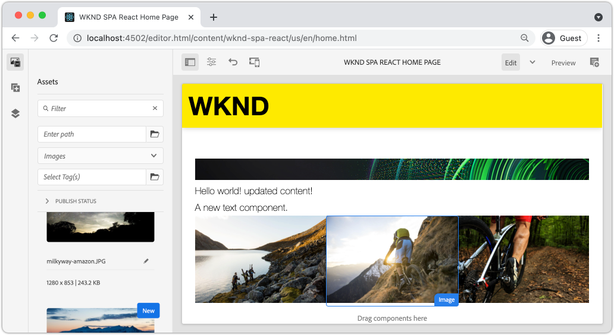

# SPA AEM Asignación de componentes de a componentes de {#map-components}

Obtenga información sobre cómo asignar componentes de React a componentes de Adobe Experience Manager AEM AEM SPA () con el SDK de JS de Editor de. SPA AEM SPA AEM La asignación de componentes permite a los usuarios realizar actualizaciones dinámicas en los componentes de la de componentes del Editor de componentes, de forma similar a la creación tradicional de los componentes de la.

AEM AEM En este capítulo se profundiza en la API del modelo JSON de y en cómo el contenido JSON expuesto por un componente de la aplicación se puede insertar automáticamente en un componente de React como props.

## Objetivo

1. AEM SPA Obtenga información sobre cómo asignar componentes de la a componentes de la aplicación.
1. Inspect AEM muestra cómo un componente de React utiliza propiedades dinámicas pasadas desde la interfaz de usuario de.
1. AEM Aprenda a utilizar los [componentes principales de React predeterminados](https://github.com/adobe/aem-react-core-wcm-components-examples).

## Qué va a generar

SPA AEM En este capítulo se inspecciona cómo se asigna el componente de `Text` proporcionado al componente `Text` de la. SPA SPA AEM Los componentes principales de React como `Image` se utilizan en el y se crean en el entorno de. Las características predeterminadas de las directivas **Contenedor de diseño** y **Editor de plantillas** también se pueden usar para crear una vista que tenga un aspecto un poco más variado.



## Requisitos previos

Revise las herramientas y las instrucciones necesarias para configurar un [entorno de desarrollo local](overview.md#local-dev-environment). SPA SPA AEM Este capítulo es una continuación del capítulo [Integrar el capítulo de la](integrate-spa.md); sin embargo, para continuar, todo lo que necesita es un proyecto de habilitado para el uso de la.

## Método de asignación

SPA AEM El concepto básico es asignar un componente de a un componente de. AEM Los componentes de, que ejecutan del lado del servidor, exportan contenido como parte de la API del modelo JSON. SPA El contenido JSON lo consume el usuario, que se ejecuta en el lado del cliente en el explorador. SPA AEM Se crea una asignación 1:1 entre los componentes de la y un componente de la.

AEM 

AEM *Información general de alto nivel sobre la asignación de un componente de a un componente de React*

## Inspect el componente Texto

AEM AEM El [Arquetipo de proyecto de](https://github.com/adobe/aem-project-archetype) proporciona un componente `Text` que está asignado al componente de texto [. ](https://experienceleague.adobe.com/docs/experience-manager-core-components/using/components/text.html) AEM Este es un ejemplo de un componente **content**, en el sentido de que procesa *content* de la.

Veamos cómo funciona el componente.

### Inspect el modelo JSON

1. SPA AEM Antes de saltar al código de la, es importante comprender el modelo JSON que proporciona el usuario de la interfaz de usuario de JSON de la que se proporciona la aplicación. Vaya a la [Biblioteca de componentes principales](https://www.aemcomponents.dev/content/core-components-examples/library/core-content/text.html) y vea la página del componente Texto. AEM La biblioteca de componentes principales proporciona ejemplos de todos los componentes principales de la.
1. Seleccione la ficha **JSON** para uno de los ejemplos:

   

   Debería ver tres propiedades: `text`, `richText` y `:type`.

   AEM `:type` es una propiedad reservada que enumera `sling:resourceType` (o ruta de acceso) del componente de la. AEM SPA El valor de `:type` es lo que se usa para asignar el componente de la al componente de la.

   SPA `text` y `richText` son propiedades adicionales que se exponen al componente de la.

1. Vea la salida de JSON en [http://localhost:4502/content/wknd-spa-react/us/en.model.json](http://localhost:4502/content/wknd-spa-react/us/en.model.json). Debería poder encontrar una entrada similar a:

   ```json
   "text": {
       "id": "text-a647cec03a",
       "text": "<p>Hello World! Updated content!</p>\r\n",
       "richText": true,
       ":type": "wknd-spa-react/components/text",
       "dataLayer": {}
      }
   ```

### Inspect SPA, el componente Texto

1. AEM SPA En el IDE de su elección, abra el Proyecto de para la creación de la página de inicio de sesión de la página de la página de. Expanda el módulo `ui.frontend` y abra el archivo `Text.js` en `ui.frontend/src/components/Text/Text.js`.

1. El primer área que inspeccionaremos es la `class Text` en ~line 40:

   ```js
   class Text extends Component {
   
       get richTextContent() {
           return (<div
                   id={extractModelId(this.props.cqPath)}
                   data-rte-editelement
                   dangerouslySetInnerHTML={{__html: DOMPurify.sanitize(this.props.text)}} />
                   );
       }
   
       get textContent() {
           return <div>{this.props.text}</div>;
       }
   
       render() {
           return this.props.richText ? this.richTextContent : this.textContent;
       }
   }
   ```

   `Text` es un componente React estándar. El componente utiliza `this.props.richText` para determinar si el contenido que se va a representar será texto enriquecido o texto sin formato. El &quot;contenido&quot; real utilizado proviene de `this.props.text`.

   Para evitar un posible ataque XSS, el texto enriquecido se escapa a través de `DOMPurify` antes de usar [peligrosamenteSetInnerHTML](https://reactjs.org/docs/dom-elements.html#dangerouslysetinnerhtml) para procesar el contenido. Recupere las propiedades `richText` y `text` del modelo JSON anteriormente en el ejercicio.

1. A continuación, abra `ui.frontend/src/components/import-components.js` y eche un vistazo a `TextEditConfig` en ~line 86:

   ```js
   const TextEditConfig = {
   emptyLabel: 'Text',
   
       isEmpty: function(props) {
           return !props || !props.text || props.text.trim().length < 1;
       }
   };
   ```

   AEM El código anterior es responsable de determinar cuándo procesar el marcador de posición en el entorno de autor de la. Si el método `isEmpty` devuelve **true**, se procesará el marcador de posición.

1. Finalmente, eche un vistazo a la llamada de `MapTo` en la línea 94:

   ```js
   export default MapTo('wknd-spa-react/components/text')(LazyTextComponent, TextEditConfig);
   ```

   AEM SPA `MapTo` lo proporciona el SDK de JS del Editor de JS de la de datos (`@adobe/aem-react-editable-components`). AEM La ruta de acceso `wknd-spa-react/components/text` representa el `sling:resourceType` del componente de la. Esta ruta de acceso coincide con el `:type` expuesto por el modelo JSON observado anteriormente. SPA `MapTo` se encarga de analizar la respuesta del modelo JSON y de pasar los valores correctos como `props` al componente de la.

   AEM Puede encontrar la definición del componente `Text` de la en `ui.apps/src/main/content/jcr_root/apps/wknd-spa-react/components/text`.

## Uso de componentes principales de React

AEM AEM [Componentes de WCM de - Implementación principal de React](https://github.com/adobe/aem-react-core-wcm-components-base) y [Componentes de WCM de - Editor de spa - Implementación principal de React](https://github.com/adobe/aem-react-core-wcm-components-spa). AEM Se trata de un conjunto de componentes de la interfaz de usuario reutilizables que se asignan a componentes de la interfaz de usuario listos para usar. La mayoría de los proyectos pueden reutilizar estos componentes como punto de partida para su propia implementación.

1. En el código del proyecto, abra el archivo `import-components.js` en `ui.frontend/src/components`.
SPA AEM Este archivo importa todos los componentes de la que se asignan a componentes de la. SPA SPA AEM Dada la naturaleza dinámica de la implementación del Editor de, debemos hacer referencia explícita a cualquier componente de la lista de componentes que se pueden crear con la ayuda de componentes que se pueden crear con la capacidad de crear de manera. AEM Esto permite a un autor de la elegir utilizar un componente en el lugar de la aplicación que desee.
1. SPA Las siguientes instrucciones de importación incluyen componentes de escritos en el proyecto:

   ```js
   import './Page/Page';
   import './Text/Text';
   import './Container/Container';
   import './ExperienceFragment/ExperienceFragment';
   ```

1. Hay varios otros `imports` de `@adobe/aem-core-components-react-spa` y `@adobe/aem-core-components-react-base`. Se están importando los componentes principales de React y se están poniendo a disposición en el proyecto actual. AEM A continuación, se asignan a componentes de proyecto específicos del proyecto mediante el uso de `MapTo`, al igual que con el ejemplo del componente `Text` anterior.

### AEM Actualizar directivas

AEM Las directivas son una función de las plantillas de que proporciona a los desarrolladores y a los usuarios avanzados un control granular sobre los componentes que se pueden utilizar. SPA Los componentes principales de React se incluyen en el código de la, pero deben habilitarse mediante una directiva para poder utilizarse en la aplicación.

1. AEM SPA Desde la pantalla Inicio de la, vaya a **Herramientas** > **Plantillas** > **[WKND React](http://localhost:4502/libs/wcm/core/content/sites/templates.html/conf/wknd-spa-react)**.

1. SPA Seleccione y abra la plantilla **Página** de para editarla.

1. Seleccione el **contenedor de diseño** y haga clic en su icono **directiva** para editar la directiva:

   

1. SPA En **Componentes permitidos** > **WKND React - Contenido** > comprobar **Imagen**, **Teaser** y **Título**.

   

   SPA En **Componentes predeterminados** > **Agregar asignación** y elija el componente **Imagen - Reacción de WKND - Contenido**:

   

   Escriba un **tipo mime** de `image/*`.

   Haga clic en **Listo** para guardar las actualizaciones de la directiva.

1. En el **contenedor de diseño**, haga clic en el icono **directiva** para el componente **Texto**.

   SPA Cree una nueva directiva con el nombre **WKND Texto de la**. En **Complementos** > **Formato** > marque todas las casillas para habilitar opciones de formato adicionales:

   

   En **Complementos** > **Estilos de párrafo** > marque la casilla para **habilitar estilos de párrafo**:

   

   Haga clic en **Listo** para guardar la actualización de la directiva.

### Contenido del autor

1. Vaya a **Página principal** [http://localhost:4502/editor.html/content/wknd-spa-react/us/en/home.html](http://localhost:4502/editor.html/content/wknd-spa-react/us/en/home.html).

1. Ahora debería poder usar los componentes adicionales **Imagen**, **Teaser** y **Título** de la página.

   

1. También debería poder editar el componente `Text` y agregar estilos de párrafo adicionales en el modo **pantalla completa**.

   

1. También debería poder arrastrar y soltar una imagen desde **Buscador de recursos**:

   

1. Experiencia con los componentes **Title** y **Teaser**.

1. Agregue sus propias imágenes a través de [AEM Assets](http://localhost:4502/assets.html/content/dam) o instale la base de código final para el [sitio de referencia WKND estándar](https://github.com/adobe/aem-guides-wknd/releases/latest). SPA El [sitio de referencia WKND](https://github.com/adobe/aem-guides-wknd/releases/latest) incluye muchas imágenes que se pueden reutilizar en el sitio de referencia de WKND. AEM El paquete se puede instalar usando el [Administrador de paquetes de](http://localhost:4502/crx/packmgr/index.jsp).

   

## Inspect el contenedor de diseño

AEM SPA El SDK del editor de diseños proporciona automáticamente compatibilidad con el **contenedor de diseños**. El **contenedor de diseño**, tal como indica el nombre, es un componente **contenedor**. Los componentes de contenedor son componentes que aceptan estructuras JSON que representan *otros* componentes y las instancian dinámicamente.

Vamos a inspeccionar más el contenedor de diseño.

1. En un explorador, vaya a [http://localhost:4502/content/wknd-spa-react/us/en.model.json](http://localhost:4502/content/wknd-spa-react/us/en.model.json)

   

   SPA El componente **Contenedor de diseño** tiene un `sling:resourceType` de `wcm/foundation/components/responsivegrid` y el Editor de recursos lo reconoce usando la propiedad `:type`, al igual que los componentes `Text` y `Image`.

   SPA Las mismas capacidades para cambiar el tamaño de un componente mediante [Modo de diseño](https://experienceleague.adobe.com/docs/experience-manager-65/authoring/siteandpage/responsive-layout.html#defining-layouts-layout-mode) están disponibles con el Editor de elementos de diseño de la página de la página de la página de la página de la página de la página de la página de la página de inicio de la página de.

2. Volver a [http://localhost:4502/editor.html/content/wknd-spa-react/us/en/home.html](http://localhost:4502/editor.html/content/wknd-spa-react/us/en/home.html). Agregue componentes adicionales de **Image** e intente cambiar su tamaño con la opción **Diseño**:

   

3. Vuelva a abrir el modelo JSON [http://localhost:4502/content/wknd-spa-react/us/en.model.json](http://localhost:4502/content/wknd-spa-react/us/en.model.json) y observe `columnClassNames` como parte del JSON:

   

   El nombre de clase `aem-GridColumn--default--4` indica que el componente debe tener 4 columnas de ancho basado en una cuadrícula de 12 columnas. Encontrará más detalles sobre la cuadrícula [adaptable aquí](https://adobe-marketing-cloud.github.io/aem-responsivegrid/).

4. Vuelva al IDE y en el módulo `ui.apps` hay una biblioteca del lado del cliente definida en `ui.apps/src/main/content/jcr_root/apps/wknd-spa-react/clientlibs/clientlib-grid`. Abra el archivo `less/grid.less`.

   Este archivo determina los puntos de interrupción (`default`, `tablet` y `phone`) utilizados por el **contenedor de diseño**. El propósito de este archivo es personalizarlo según las especificaciones del proyecto. Actualmente los puntos de interrupción están establecidos en `1200px` y `768px`.

5. Debe poder utilizar las capacidades adaptables y las directivas de texto enriquecido actualizadas del componente `Text` para crear una vista como la siguiente:

   

## Enhorabuena. {#congratulations}

SPA AEM Felicidades, ha aprendido a asignar componentes de a componentes principales y ha utilizado los componentes principales de React. También tiene la oportunidad de explorar las capacidades adaptables de **Contenedor de diseño**.

### Siguientes pasos {#next-steps}

SPA AEM SPA [Navegación y enrutamiento](navigation-routing.md): descubra cómo se pueden admitir varias vistas en la asignando a páginas de la lista de distribución con el SDK del Editor de la página de la lista de distribución (SDK) del editor de la lista de distribución. La navegación dinámica se implementa mediante los componentes principales React y React Router.

## (Bonus) Mantener configuraciones en el control de código fuente {#bonus-configs}

AEM En muchos casos, especialmente al principio de un proyecto de, es importante mantener las configuraciones, como las plantillas y las directivas de contenido relacionadas, para el control de código fuente. Esto garantiza que todos los desarrolladores trabajen con el mismo conjunto de contenido y configuraciones y puede garantizar una coherencia adicional entre entornos. Una vez que un proyecto alcanza un cierto nivel de madurez, la práctica de administrar plantillas se puede transferir a un grupo especial de usuarios avanzados.

AEM AEM Los siguientes pasos se llevarán a cabo con el IDE de código de Visual Studio y la sincronización de código de VSC [VSCode](https://marketplace.visualstudio.com/items?itemName=yamato-ltd.vscode-aem-sync), pero podrían realizarse con cualquier herramienta y cualquier IDE que haya configurado para **extraer** o **importar** contenido de una instancia local de.

1. AEM En el IDE de código de Visual Studio, asegúrese de que tiene **VSCode Sync** instalado mediante la extensión Marketplace:

   AEM 

2. Expanda el módulo **ui.content** en el explorador del proyecto y vaya a `/conf/wknd-spa-react/settings/wcm/templates`.

3. AEM **Haga clic con el botón derecho** en la carpeta `templates` y seleccione **Importar desde el servidor**:

   

4. Repita los pasos para importar contenido, pero seleccione la carpeta **policies** ubicada en `/conf/wknd-spa-react/settings/wcm/templates/policies`.

5. Inspect agregó el archivo `filter.xml` ubicado en `ui.content/src/main/content/META-INF/vault/filter.xml`.

   ```xml
   <!--ui.content filter.xml-->
   <?xml version="1.0" encoding="UTF-8"?>
    <workspaceFilter version="1.0">
        <filter root="/conf/wknd-spa-react" mode="merge"/>
        <filter root="/content/wknd-spa-react" mode="merge"/>
        <filter root="/content/dam/wknd-spa-react" mode="merge"/>
        <filter root="/content/experience-fragments/wknd-spa-react" mode="merge"/>
    </workspaceFilter>
   ```

   El archivo `filter.xml` es responsable de identificar las rutas de acceso de los nodos instalados con el paquete. Observe el `mode="merge"` en cada uno de los filtros que indica que el contenido existente no se modificará, solo se agregará contenido nuevo. Dado que los autores de contenido pueden estar actualizando estas rutas, es importante que una implementación de código sobrescriba el contenido **no**. Consulte la [documentación de FileVault](https://jackrabbit.apache.org/filevault/filter.html) para obtener más información sobre cómo trabajar con elementos de filtro.

   Compare `ui.content/src/main/content/META-INF/vault/filter.xml` y `ui.apps/src/main/content/META-INF/vault/filter.xml` para comprender los diferentes nodos administrados por cada módulo.

## (Bonus) Crear componente de imagen personalizado {#bonus-image}

SPA Los componentes principales de React ya han proporcionado un componente de imagen de. AEM Sin embargo, si desea tener práctica adicional, cree su propia implementación de React que se asigne al componente de imagen [Image](https://experienceleague.adobe.com/docs/experience-manager-core-components/using/components/image.html?lang=es) de la. El componente `Image` es otro ejemplo de un componente **content**.

### Inspect el JSON

SPA AEM Antes de saltar al código de la, revise el modelo JSON proporcionado por el administrador de códigos de.

1. Vaya a los [ejemplos de imagen de la biblioteca de componentes principales](https://www.aemcomponents.dev/content/core-components-examples/library/core-content/image.html).

   

   SPA Las propiedades de `src`, `alt` y `title` se usan para rellenar el componente de `Image` de la.

   >[!NOTE]
   >
   > Hay otras propiedades de imagen expuestas (`lazyEnabled`, `widths`) que permiten a un desarrollador crear un componente de carga diferida y adaptable. El componente integrado en este tutorial es sencillo y **no** utiliza estas propiedades avanzadas.

### Implementación del componente de imagen

1. A continuación, cree una nueva carpeta denominada `Image` en `ui.frontend/src/components`.
1. Debajo de la carpeta `Image`, cree un nuevo archivo con el nombre `Image.js`.

   

1. Agregar las siguientes `import` instrucciones a `Image.js`:

   ```js
   import React, {Component} from 'react';
   import {MapTo} from '@adobe/aem-react-editable-components';
   ```

1. AEM A continuación, agregue `ImageEditConfig` para determinar cuándo se debe mostrar el marcador de posición en el código de tiempo de la:

   ```js
   export const ImageEditConfig = {
   
       emptyLabel: 'Image',
   
       isEmpty: function(props) {
           return !props || !props.src || props.src.trim().length < 1;
       }
   };
   ```

   El marcador de posición se mostrará si no se ha establecido la propiedad `src`.

1. A continuación, implemente la clase `Image`:

   ```js
    export default class Image extends Component {
   
       get content() {
           return ;
       }
   
       render() {
           if(ImageEditConfig.isEmpty(this.props)) {
               return null;
           }
   
           return (
                   <div className="Image">
                       {this.content}
                   </div>
           );
       }
   }
   ```

   El código anterior procesará un `` basado en las props `src`, `alt` y `title` pasadas por el modelo JSON.

1. AEM Agregue el código `MapTo` para asignar el componente React al componente de la:

   ```js
   MapTo('wknd-spa-react/components/image')(Image, ImageEditConfig);
   ```

   AEM Tenga en cuenta que la cadena `wknd-spa-react/components/image` corresponde a la ubicación del componente de la en `ui.apps` en: `ui.apps/src/main/content/jcr_root/apps/wknd-spa-react/components/image`.

1. Cree un nuevo archivo con el nombre `Image.css` en el mismo directorio y agregue lo siguiente:

   ```scss
   .Image-src {
       margin: 1rem 0;
       width: 100%;
       border: 0;
   }
   ```

1. En `Image.js`, agregue una referencia al archivo en la parte superior debajo de las instrucciones `import`:

   ```js
   import React, {Component} from 'react';
   import {MapTo} from '@adobe/aem-react-editable-components';
   
   require('./Image.css');
   ```

1. Abra el archivo `ui.frontend/src/components/import-components.js` y agregue una referencia al nuevo componente `Image`:

   ```js
   import './Page/Page';
   import './Text/Text';
   import './Container/Container';
   import './ExperienceFragment/ExperienceFragment';
   import './Image/Image'; //add reference to Image component
   ```

1. En `import-components.js`, comente la imagen del componente principal de React:

   ```js
   //MapTo('wknd-spa-react/components/image')(ImageV2, {isEmpty: ImageV2IsEmptyFn});
   ```

   Esto garantizará que se utilice el componente de imagen personalizado en su lugar.

1. SPA AEM Desde la raíz del proyecto, implemente el código de para que se ejecute mediante Maven:

   ```shell
   $ cd aem-guides-wknd-spa.react
   $ mvn clean install -PautoInstallSinglePackage
   ```

1. Inspect SPA AEM el en la. Todos los componentes de imagen de la página deben seguir funcionando. Inspect muestra el resultado procesado y debería ver el marcado del componente de imagen personalizado en lugar del componente principal React.

   *Marcado de componente de imagen personalizado*

   ```html
   <div class="Image">
       
   </div>
   ```

   *Marcado de imagen del componente principal de React*

   ```html
   <div class="cmp-image cq-dd-image">
       
   </div>
   ```

   Esta es una buena introducción para ampliar e implementar sus propios componentes.
