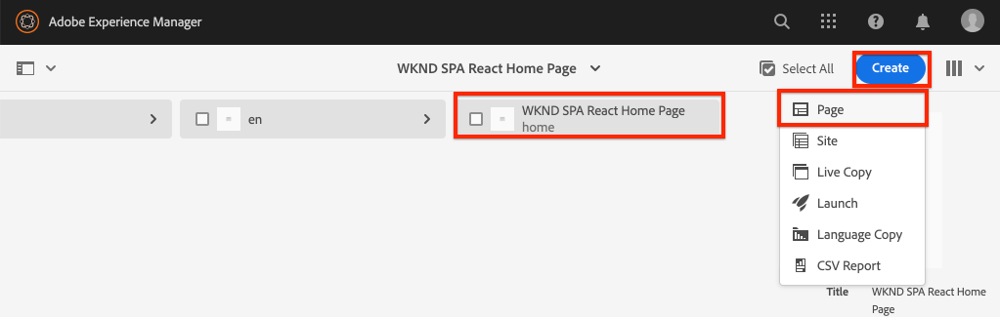
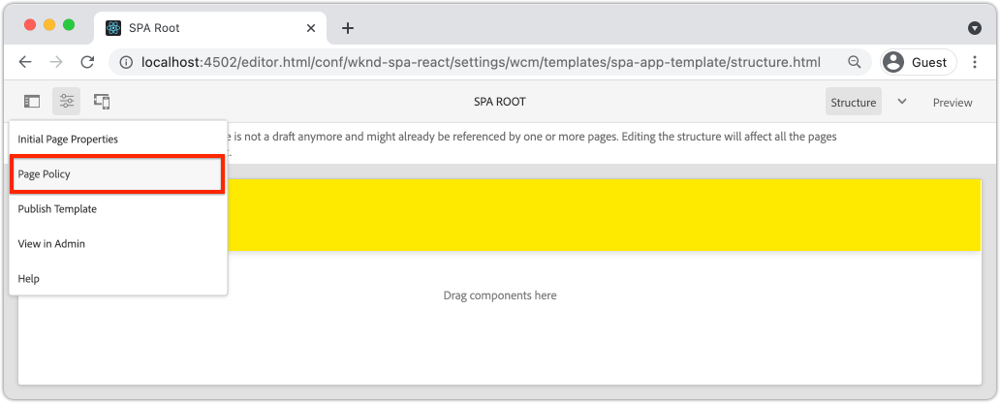

# Agregar navegación y enrutamiento {#navigation-routing}

Aprenda cómo se pueden admitir varias vistas de la SPA asignando páginas AEM con el SDK del Editor de SPA. La navegación dinámica se implementa mediante el router React y los componentes principales React.

## Objetivo

1. Comprender las opciones de enrutamiento del modelo de SPA disponibles al utilizar el SPA Editor.
1. Aprenda a utilizar [React Router](https://reacttraining.com/react-router/) para navegar entre las diferentes vistas del SPA.
1. Utilice AEM componentes principales de React para implementar una navegación dinámica controlada por la jerarquía de páginas de AEM.

## Qué va a generar

Este capítulo agregará navegación a un SPA en AEM. El menú de navegación estará impulsado por la jerarquía de páginas AEM y utilizará el modelo JSON proporcionado por el [Componente principal de navegación](https://docs.adobe.com/content/help/en/experience-manager-core-components/using/components/navigation.html).


## Requisitos previos

Revise las herramientas e instrucciones necesarias para configurar un [entorno de desarrollo local](overview.md#local-dev-environment). Este capítulo es una continuación del capítulo [Map Components](map-components.md) , sin embargo, para seguir todo lo que necesita es un proyecto de AEM habilitado para SPA implementado en una instancia de AEM local.

## Agregar la navegación a la plantilla {#add-navigation-template}

1. Abra un explorador e inicie sesión en AEM, [http://localhost:4502/](http://localhost:4502/). La base del código de inicio ya debe implementarse.
1. Vaya a **SPA Plantilla de página**: [http://localhost:4502/editor.html/conf/wknd-spa-react/settings/wcm/templates/spa-page-template/structure.html](http://localhost:4502/editor.html/conf/wknd-spa-react/settings/wcm/templates/spa-page-template/structure.html).
1. Seleccione el **Contenedor de diseño raíz** más externo y haga clic en su icono **Directiva**. Tenga cuidado **not** de seleccionar el **Contenedor de diseño** desbloqueado para la creación.

   

1. Cree una nueva directiva denominada **SPA Estructura**:

   

   En **Componentes permitidos** > **General** > seleccione el componente **Contenedor de diseño**.

   En **Componentes permitidos** > **WKND SPA REACT - STRUCTURE** > seleccione el componente **Encabezado**:

   

   En **Componentes permitidos** > **WKND SPA REACT - Contenido** > seleccione los componentes **Imagen** y **Texto**. Debe tener 4 componentes totales seleccionados.

   Haga clic en **Listo** para guardar los cambios.

1. Actualice la página y añada el componente **Navegación** sobre el **Contenedor de diseño** desbloqueado:

   

1. Seleccione el componente **Navegación** y haga clic en su icono **Política** para editar la política.
1. Cree una nueva directiva con un **Título de directiva** de **Navegación de SPA**.

   En **Properties**:

   * Establezca **Raíz de navegación** en `/content/wknd-spa-react/us/en`.
   * Establezca **Excluir niveles raíz** en **1**.
   * Desmarque **Collect all child pages**.
   * Establezca la **Profundidad de la estructura de navegación** en **3**.

   

   Esto recopilará los 2 niveles de navegación que hay debajo de `/content/wknd-spa-react/us/en`.

1. Después de guardar los cambios, debería ver el `Navigation` rellenado como parte de la plantilla:

   

## Crear páginas secundarias

A continuación, cree páginas adicionales en AEM que sirvan como las diferentes vistas del SPA. También inspeccionaremos la estructura jerárquica del modelo JSON proporcionado por AEM.

1. Vaya a la consola **Sites**: [http://localhost:4502/sites.html/content/wknd-spa-react/us/en/home](http://localhost:4502/sites.html/content/wknd-spa-react/us/en/home). Seleccione **WKND SPA React Home Page** y haga clic en **Crear** > **Página**:

   

1. En **Plantilla** seleccione **SPA Página**. En **Propiedades** introduzca **Página 1** para el **Título** y **página-1** como nombre.

   

   Haga clic en **Crear** y, en la ventana emergente de cuadro de diálogo, haga clic en **Abrir** para abrir la página en el AEM SPA Editor.

1. Agregue un nuevo componente **Texto** al contenedor de diseño **principal**. Edite el componente e introduzca el texto: **Página 1** utilizando el RTE y el elemento **H2**.

   

   Siéntase libre de añadir contenido adicional, como una imagen.

1. Vuelva a la consola de AEM Sites y repita los pasos anteriores, creando una segunda página llamada **Página 2** como secundaria de **Página 1**.
1. Por último, cree una tercera página, **Página 3** pero como **secundario** de **Página 2**. Una vez completada la jerarquía del sitio, debería tener el siguiente aspecto:

   

1. El componente Navegación ahora se puede utilizar para desplazarse a diferentes áreas de la SPA.

   

1. Abra la página fuera del Editor de AEM: [http://localhost:4502/content/wknd-spa-react/us/en/home.html](http://localhost:4502/content/wknd-spa-react/us/en/home.html). Utilice el componente **Navegación** para navegar a diferentes vistas de la aplicación.

1. Utilice las herramientas para desarrolladores del explorador para inspeccionar las solicitudes de red a medida que navega. Las capturas de pantalla siguientes se obtienen del navegador Google Chrome.

   

   Observe que después de la carga inicial de la página, la navegación posterior no provoca una actualización completa de la página y que el tráfico de red se minimiza al regresar a las páginas visitadas anteriormente.

## Modelo JSON de página de jerarquía {#hierarchy-page-json-model}

A continuación, revise el modelo JSON que impulsa la experiencia de visualización múltiple del SPA.

1. En una pestaña nueva, abra la API del modelo JSON proporcionada por AEM: [http://localhost:4502/content/wknd-spa-react/us/en.model.json](http://localhost:4502/content/wknd-spa-react/us/en.model.json). Puede resultar útil utilizar una extensión del explorador para [dar formato al JSON](https://chrome.google.com/webstore/detail/json-formatter/bcjindcccaagfpapjjmafapmmgkkhgoa).

   Este contenido JSON se solicita cuando el SPA se carga por primera vez. La estructura exterior es similar a la siguiente:

   ```json
   {
   "language": "en",
   "title": "en",
   "templateName": "spa-app-template",
   "designPath": "/libs/settings/wcm/designs/default",
   "cssClassNames": "spa page basicpage",
   ":type": "wknd-spa-react/components/spa",
   ":items": {},
   ":itemsOrder": [],
   ":hierarchyType": "page",
   ":path": "/content/wknd-spa-react/us/en",
   ":children": {
      "/content/wknd-spa-react/us/en/home": {},
      "/content/wknd-spa-react/us/en/home/page-1": {},
      "/content/wknd-spa-react/us/en/home/page-2": {},
      "/content/wknd-spa-react/us/en/home/page-2/page-3": {}
      }
   }
   ```

   En `:children` debería ver una entrada para cada una de las páginas creadas. El contenido de todas las páginas se encuentra en esta solicitud JSON inicial. Con el enrutamiento de navegación, las vistas posteriores del SPA se cargarán rápidamente, ya que el contenido ya está disponible en el lado del cliente.

   No es aconsejable cargar **ALL** del contenido de una SPA en la solicitud JSON inicial, ya que esto ralentizaría la carga inicial de la página. A continuación, veamos cómo se recopila la profundidad de jerarquía de las páginas.

1. Vaya a la plantilla **SPA Root** en: [http://localhost:4502/editor.html/conf/wknd-spa-react/settings/wcm/templates/spa-app-template/structure.html](http://localhost:4502/editor.html/conf/wknd-spa-react/settings/wcm/templates/spa-app-template/structure.html).

   Haga clic en **Menú de propiedades de página** > **Política de página**:

   

1. La plantilla **SPA Root** tiene una pestaña adicional **Hierarchical Structure** para controlar el contenido JSON recopilado. La **Profundidad de estructura** determina la profundidad en la jerarquía del sitio para recopilar páginas secundarias debajo de **raíz**. También puede utilizar el campo **Patrones de estructura** para filtrar páginas adicionales basadas en una expresión regular.

   Actualice **Profundidad de estructura** a **2**:

   

   Haga clic en **Listo** para guardar los cambios en la directiva.

1. Vuelva a abrir el modelo JSON [http://localhost:4502/content/wknd-spa-react/us/en.model.json](http://localhost:4502/content/wknd-spa-react/us/en.model.json).

   ```json
   {
   "language": "en",
   "title": "en",
   "templateName": "spa-app-template",
   "designPath": "/libs/settings/wcm/designs/default",
   "cssClassNames": "spa page basicpage",
   ":type": "wknd-spa-react/components/spa",
   ":items": {},
   ":itemsOrder": [],
   ":hierarchyType": "page",
   ":path": "/content/wknd-spa-react/us/en",
   ":children": {
      "/content/wknd-spa-react/us/en/home": {},
      "/content/wknd-spa-react/us/en/home/page-1": {},
      "/content/wknd-spa-react/us/en/home/page-2": {}
      }
   }
   ```

   Observe que la ruta **Page 3** se ha eliminado: `/content/wknd-spa-react/us/en/home/page-2/page-3` del modelo JSON inicial. Esto se debe a que **Página 3** está en un nivel 3 de la jerarquía y actualizamos la directiva para incluir solamente contenido con una profundidad máxima de nivel 2.

1. Vuelva a abrir la página principal de SPA: [http://localhost:4502/content/wknd-spa-react/us/en/home.html](http://localhost:4502/content/wknd-spa-react/us/en/home.html) y abra las herramientas para desarrolladores del explorador.

   Actualice la página y debería ver la solicitud XHR a `/content/wknd-spa-react/us/en.model.json`, que es la raíz SPA. Tenga en cuenta que solo se incluyen tres páginas secundarias en función de la configuración de profundidad de jerarquía de la plantilla raíz de SPA realizada anteriormente en el tutorial. Esto no incluye **Página 3**.

   

1. Con las herramientas para desarrolladores abiertas, utilice el componente `Navigation` para navegar directamente a **Página 3**:

   Tenga en cuenta que se realiza una nueva solicitud XHR a: `/content/wknd-spa-react/us/en/home/page-2/page-3.model.json`

   

   El Administrador de modelos de AEM entiende que el contenido JSON de la **Página 3** no está disponible y déclencheur automáticamente la solicitud XHR adicional.

1. Experimente con vínculos profundos navegando directamente a: [http://localhost:4502/content/wknd-spa-react/us/en/home/page-2.html](http://localhost:4502/content/wknd-spa-react/us/en/home/page-2.html). También observe que el botón de retroceso del navegador sigue funcionando.

## Enrutamiento React de Inspect {#react-routing}

La navegación y el enrutamiento se implementan con [React Router](https://reactrouter.com/). React Router es una colección de componentes de navegación para aplicaciones React. [AEM los ](https://github.com/adobe/aem-react-core-wcm-components-base) componentes principales de React utilizan las funciones del router React para implementar el componente  **** Navegación utilizado en los pasos anteriores.

A continuación, revise cómo React Router está integrado con el SPA y experimente usando el componente [Link](https://reactrouter.com/web/api/Link) del Enrutador React.

1. En el IDE, abra el archivo `index.js` en `ui.frontend/src/index.js`.

   ```js
   /* index.js */
   import { Router } from 'react-router-dom';
   ...
   ...
    ModelManager.initialize().then(pageModel => {
       const history = createBrowserHistory();
       render(
       <Router history={history}>
           <App
           history={history}
           cqChildren={pageModel[Constants.CHILDREN_PROP]}
           cqItems={pageModel[Constants.ITEMS_PROP]}
           cqItemsOrder={pageModel[Constants.ITEMS_ORDER_PROP]}
           cqPath={pageModel[Constants.PATH_PROP]}
           locationPathname={window.location.pathname}
           />
       </Router>,
       document.getElementById('spa-root')
       );
   });
   ```

   Observe que `App` está envuelto en el componente `Router` de [React Router](https://reacttraining.com/react-router/). El `ModelManager`, proporcionado por el SDK de JS AEM Editor SPA, agrega las rutas dinámicas a AEM páginas en función de la API del modelo JSON.

1. Abra el archivo `Page.js` en `ui.frontend/src/components/Page/Page.js`

   ```js
   class AppPage extends Page {
     get containerProps() {
       let attrs = super.containerProps;
       attrs.className =
         (attrs.className || '') + ' page ' + (this.props.cssClassNames || '');
       return attrs;
     }
   }
   
   export default MapTo('wknd-spa-react/components/page')(
     withComponentMappingContext(withRoute(AppPage))
   );
   ```

   El componente de SPA `Page` utiliza la función `MapTo` para asignar **Páginas** en AEM a un componente de SPA correspondiente. La utilidad `withRoute` ayuda a enrutar dinámicamente el SPA a la página secundaria de AEM adecuada en función de la propiedad `cqPath`.

1. Abra el componente `Header.js` en `ui.frontend/src/components/Header/Header.js`.
1. Actualice `Header` para envolver la etiqueta `<h1>` en un [Link](https://reactrouter.com/web/api/Link) a la página principal:

   ```diff
     //Header.js
     import React, {Component} from 'react';
   + import {Link} from 'react-router-dom';
     require('./Header.css');
   
   export default class Header extends Component {
   
       render() {
           return (
               <header className="Header">
               <div className="Header-container">
   +              <Link to="/content/wknd-spa-react/us/en/home.html">
                       <h1>WKND</h1>
   +              </Link>
               </div>
               </header>
           );
       }
   ```

   En lugar de usar una etiqueta de anclaje `<a>` predeterminada, usamos `<Link>` proporcionada por el Enrutador de React. Siempre que el `to=` apunte a una ruta válida, el SPA cambiará a esa ruta y **no** realizará una actualización completa de la página. Aquí simplemente codificamos el enlace a la página principal para ilustrar el uso de `Link`.

1. Actualice la prueba en `App.test.js` en `ui.frontend/src/App.test.js`.

   ```diff
   + import { BrowserRouter as Router } from 'react-router-dom';
     import App from './App';
   
     it('renders without crashing', () => {
       const div = document.createElement('div');
   -   ReactDOM.render(<App />, div);
   +   ReactDOM.render(<Router><App /></Router>, div);
     });
   ```

   Dado que estamos utilizando características de React Router dentro de un componente estático al que se hace referencia en `App.js`, necesitamos actualizar la prueba unitaria para contabilizarla.

1. Abra un terminal, vaya a la raíz del proyecto e implemente el proyecto para AEM con sus habilidades con Maven:

   ```shell
   $ cd aem-guides-wknd-spa.react
   $ mvn clean install -PautoInstallSinglePackage
   ```

1. Vaya a una de las páginas de la SPA en AEM: [http://localhost:4502/content/wknd-spa-react/us/en/home/page-1.html](http://localhost:4502/content/wknd-spa-react/us/en/home/page-1.html)

   En lugar de utilizar el componente `Navigation` para desplazarse, utilice el vínculo en `Header`.

   

   Observe que una actualización de página completa se activa **no** y que el enrutamiento de SPA funciona.

1. Opcionalmente, experimente con el archivo `Header.js` utilizando una etiqueta de anclaje `<a>` estándar:

   ```js
   <a href="/content/wknd-spa-react/us/en/home.html">
       <h1>WKND</h1>
   </a>
   ```

   Esto puede ayudar a ilustrar la diferencia entre SPA enrutamiento y los vínculos de páginas web normales.

## Felicitaciones! {#congratulations}

Felicidades, ha aprendido cómo se pueden admitir varias vistas en el SPA asignando a AEM páginas con el SDK del Editor de SPA. Se ha implementado la navegación dinámica mediante el enrutador React y se ha agregado al componente `Header`.

