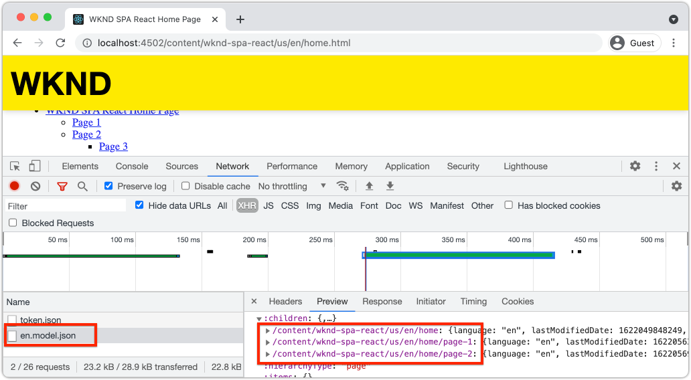

# Agregar navegación y enrutamiento {#navigation-routing}

Descubra cómo se pueden admitir varias vistas en la SPA asignando a páginas de AEM con la SDK del Editor de SPA. La navegación dinámica se implementa mediante los componentes principales React y React Router.

## Objetivo

1. Comprenda las opciones de enrutamiento del modelo de SPA disponibles al utilizar el Editor de SPA.
1. Aprenda a utilizar [React Router](https://reacttraining.com/react-router) para navegar entre diferentes vistas de la SPA.
1. Utilice los componentes principales de AEM React para implementar una navegación dinámica controlada por la jerarquía de páginas de AEM.

## Qué va a generar

Este capítulo añadirá navegación a un SPA en AEM. El menú de navegación está gobernado por la jerarquía de páginas de AEM y utilizará el modelo JSON proporcionado por el [componente principal de navegación](https://experienceleague.adobe.com/docs/experience-manager-core-components/using/wcm-components/navigation.html).


## Requisitos previos

Revise las herramientas y las instrucciones necesarias para configurar un [entorno de desarrollo local](overview.md#local-dev-environment). Este capítulo es una continuación del capítulo [Componentes de mapa](map-components.md); sin embargo, para continuar, todo lo que necesita es un proyecto de AEM con SPA implementado en una instancia de AEM local.

## Añadir la navegación a la plantilla {#add-navigation-template}

1. Abra un explorador e inicie sesión en AEM, [http://localhost:4502/](http://localhost:4502/). La base del código de inicio ya debería implementarse.
1. Vaya a la **plantilla de página SPA**: [http://localhost:4502/editor.html/conf/wknd-spa-react/settings/wcm/templates/spa-page-template/structure.html](http://localhost:4502/editor.html/conf/wknd-spa-react/settings/wcm/templates/spa-page-template/structure.html).
1. Seleccione el **contenedor de diseño raíz más externo** y haga clic en su icono **directiva**. Tenga cuidado **no** al seleccionar el **contenedor de diseño** desbloqueado para la creación.

   

1. Crear una directiva nueva con el nombre **Estructura de SPA**:

   

   En **Componentes permitidos** > **General** > seleccione el componente **Contenedor de diseño**.

   En **Componentes permitidos** > **WKND SPA REACT - ESTRUCTURA** > seleccione el componente **Navegación**:

   

   En **Componentes permitidos** > **WKND SPA REACT - Contenido** > seleccione los componentes **Imagen** y **Texto**. Debe tener un total de 4 componentes seleccionados.

   Haga clic en **Listo** para guardar los cambios.

1. Actualice la página y agregue el componente **Navigation** sobre el **contenedor de diseño** que no está bloqueado:

   

1. Seleccione el componente **Navegación** y haga clic en su icono **Directiva** para editar la directiva.
1. Cree una nueva directiva con un **Título de directiva** de **navegación SPA**.

   En **Propiedades**:

   * Establezca **Raíz de navegación** en `/content/wknd-spa-react/us/en`.
   * Establecer **Excluir niveles de raíz** en **1**.
   * Desmarque **Recopilar todas las páginas secundarias**.
   * Establezca la **profundidad de la estructura de navegación** en **3**.

   

   Se recopilará la navegación 2 niveles por debajo de `/content/wknd-spa-react/us/en`.

1. Después de guardar los cambios, debería ver los `Navigation` rellenados como parte de la plantilla:

   

## Crear páginas secundarias

A continuación, cree páginas adicionales en AEM que sirvan como vistas diferentes en la SPA. También analizaremos la estructura jerárquica del modelo JSON proporcionado por AEM.

1. Vaya a la consola de **Sites**: [http://localhost:4502/sites.html/content/wknd-spa-react/us/en/home](http://localhost:4502/sites.html/content/wknd-spa-react/us/en/home). Seleccione la **página de inicio de React de WKND SPA** y haga clic en **Crear** > **Página**:

   

1. En **Plantilla**, seleccione **Página de SPA**. En **Propiedades**, escriba **Página 1** para el **Título** y **página-1** como nombre.

   

   Haga clic en **Crear** y, en el cuadro de diálogo emergente, haga clic en **Abrir** para abrir la página en el Editor de SPA de AEM.

1. Agregue un nuevo componente **Text** al **contenedor de diseño principal**. Edite el componente e introduzca el texto: **Página 1** con el RTE y el elemento **H2**.

   

   No dude en añadir contenido adicional, como una imagen.

1. Vuelva a la consola de AEM Sites y repita los pasos anteriores, creando una segunda página denominada **Página 2** como elemento secundario de **Página 1**.
1. Por último, cree una tercera página, **Página 3**, pero como **elemento secundario** de **Página 2**. Una vez completada, la jerarquía del sitio debe tener el siguiente aspecto:

   

1. El componente Navegación ahora se puede utilizar para navegar a diferentes áreas de la SPA.

   

1. Abra la página fuera del Editor de AEM: [http://localhost:4502/content/wknd-spa-react/us/en/home.html](http://localhost:4502/content/wknd-spa-react/us/en/home.html). Utilice el componente **Navegación** para navegar a diferentes vistas de la aplicación.

1. Utilice las herramientas para desarrolladores del explorador para inspeccionar las solicitudes de red a medida que navega. Las capturas de pantalla a continuación se capturan desde el navegador Google Chrome.

   

   Observe que después de la carga inicial de la página, la navegación posterior no provoca una actualización de la página completa y que el tráfico de red se minimiza al volver a páginas visitadas anteriormente.

## Modelo JSON de página de jerarquía {#hierarchy-page-json-model}

A continuación, inspeccione el modelo JSON que impulsa la experiencia de múltiples vistas de la SPA.

1. En una pestaña nueva, abra la API del modelo JSON proporcionada por AEM: [http://localhost:4502/content/wknd-spa-react/us/en.model.json](http://localhost:4502/content/wknd-spa-react/us/en.model.json). Puede resultar útil usar una extensión de explorador para [dar formato al JSON](https://chrome.google.com/webstore/detail/json-formatter/bcjindcccaagfpapjjmafapmmgkkhgoa).

   Este contenido JSON se solicita cuando se carga la SPA por primera vez. La estructura exterior tiene el siguiente aspecto:

   ```json
   {
   "language": "en",
   "title": "en",
   "templateName": "spa-app-template",
   "designPath": "/libs/settings/wcm/designs/default",
   "cssClassNames": "spa page basicpage",
   ":type": "wknd-spa-react/components/spa",
   ":items": {},
   ":itemsOrder": [],
   ":hierarchyType": "page",
   ":path": "/content/wknd-spa-react/us/en",
   ":children": {
      "/content/wknd-spa-react/us/en/home": {},
      "/content/wknd-spa-react/us/en/home/page-1": {},
      "/content/wknd-spa-react/us/en/home/page-2": {},
      "/content/wknd-spa-react/us/en/home/page-2/page-3": {}
      }
   }
   ```

   En `:children` debería ver una entrada para cada una de las páginas creadas. El contenido de todas las páginas se encuentra en esta solicitud JSON inicial. Con el enrutamiento de navegación, las vistas posteriores del SPA se cargan rápidamente, ya que el contenido ya está disponible en el lado del cliente.

   No es aconsejable cargar **ALL** del contenido de una SPA en la solicitud JSON inicial, ya que esto ralentizaría la carga inicial de la página. A continuación, veamos cómo se recopila la profundidad de jerarquía de las páginas.

1. Vaya a la plantilla **SPA Root** en: [http://localhost:4502/editor.html/conf/wknd-spa-react/settings/wcm/templates/spa-app-template/structure.html](http://localhost:4502/editor.html/conf/wknd-spa-react/settings/wcm/templates/spa-app-template/structure.html).

   Haga clic en el **menú Propiedades de página** > **Directiva de página**:

   

1. La plantilla **SPA Root** tiene una ficha **Estructura jerárquica** adicional para controlar el contenido JSON recopilado. La **profundidad de la estructura** determina la profundidad en la jerarquía del sitio para recopilar páginas secundarias debajo de la **raíz**. También puede usar el campo **Patrones de estructura** para filtrar páginas adicionales en función de una expresión regular.

   Actualizar la **profundidad de la estructura** a **2**:

   

   Haga clic en **Listo** para guardar los cambios en la directiva.

1. Vuelva a abrir el modelo JSON [http://localhost:4502/content/wknd-spa-react/us/en.model.json](http://localhost:4502/content/wknd-spa-react/us/en.model.json).

   ```json
   {
   "language": "en",
   "title": "en",
   "templateName": "spa-app-template",
   "designPath": "/libs/settings/wcm/designs/default",
   "cssClassNames": "spa page basicpage",
   ":type": "wknd-spa-react/components/spa",
   ":items": {},
   ":itemsOrder": [],
   ":hierarchyType": "page",
   ":path": "/content/wknd-spa-react/us/en",
   ":children": {
      "/content/wknd-spa-react/us/en/home": {},
      "/content/wknd-spa-react/us/en/home/page-1": {},
      "/content/wknd-spa-react/us/en/home/page-2": {}
      }
   }
   ```

   Observe que la ruta de acceso **Página 3** se ha eliminado: `/content/wknd-spa-react/us/en/home/page-2/page-3` del modelo JSON inicial. Esto se debe a que **Página 3** se encuentra en un nivel 3 de la jerarquía y hemos actualizado la directiva para incluir únicamente contenido con una profundidad máxima de nivel 2.

1. Vuelva a abrir la página principal de la SPA: [http://localhost:4502/content/wknd-spa-react/us/en/home.html](http://localhost:4502/content/wknd-spa-react/us/en/home.html) y abra las herramientas para desarrolladores del explorador.

   Actualice la página y debería ver la solicitud XHR a `/content/wknd-spa-react/us/en.model.json`, que es la raíz de la SPA. Tenga en cuenta que solo se incluyen tres páginas secundarias en función de la configuración de profundidad de jerarquía en la plantilla raíz de SPA realizada anteriormente en el tutorial. Esto no incluye **Página 3**.

   

1. Con las herramientas para desarrolladores abiertas, use el componente `Navigation` para navegar directamente a **Página 3**:

   Observe que se hace una nueva solicitud XHR a: `/content/wknd-spa-react/us/en/home/page-2/page-3.model.json`

   

   El administrador de modelos de AEM comprende que el contenido JSON de la **página 3** no está disponible y déclencheur automáticamente la solicitud XHR adicional.

1. Experimente con vínculos profundos directamente a: [http://localhost:4502/content/wknd-spa-react/us/en/home/page-2.html](http://localhost:4502/content/wknd-spa-react/us/en/home/page-2.html). Observe también que el botón Atrás del explorador sigue funcionando.

## Inspeccionar enrutamiento de React  {#react-routing}

La navegación y el enrutamiento están implementados con [React Router](https://reactrouter.com/en/main). React Router es una colección de componentes de navegación para aplicaciones React. [Los componentes principales de React de AEM](https://github.com/adobe/aem-react-core-wcm-components-base) utilizan las características de React Router para implementar el componente **Navigation** utilizado en los pasos anteriores.

A continuación, revise cómo React Router está integrado con la SPA y experimente con el componente [Link](https://reactrouter.com/en/main/components/link) de React Router.

1. En el IDE, abra el archivo `index.js` a las `ui.frontend/src/index.js`.

   ```js
   /* index.js */
   import { Router } from 'react-router-dom';
   ...
   ...
    ModelManager.initialize().then(pageModel => {
       const history = createBrowserHistory();
       render(
       <Router history={history}>
           <App
           history={history}
           cqChildren={pageModel[Constants.CHILDREN_PROP]}
           cqItems={pageModel[Constants.ITEMS_PROP]}
           cqItemsOrder={pageModel[Constants.ITEMS_ORDER_PROP]}
           cqPath={pageModel[Constants.PATH_PROP]}
           locationPathname={window.location.pathname}
           />
       </Router>,
       document.getElementById('spa-root')
       );
   });
   ```

   Observe que `App` está dentro del componente `Router` de [React Router](https://reacttraining.com/react-router). `ModelManager`, proporcionado por el SDK JS del Editor de SPA de AEM, agrega las rutas dinámicas a las páginas de AEM basadas en la API del modelo JSON.

1. Abrir el archivo `Page.js` en `ui.frontend/src/components/Page/Page.js`

   ```js
   class AppPage extends Page {
     get containerProps() {
       let attrs = super.containerProps;
       attrs.className =
         (attrs.className || '') + ' page ' + (this.props.cssClassNames || '');
       return attrs;
     }
   }
   
   export default MapTo('wknd-spa-react/components/page')(
     withComponentMappingContext(withRoute(AppPage))
   );
   ```

   El componente de SPA `Page` utiliza la función `MapTo` para asignar **Páginas** en AEM a un componente de SPA correspondiente. La utilidad `withRoute` ayuda a enrutar dinámicamente la SPA a la página secundaria de AEM apropiada en función de la propiedad `cqPath`.

1. Abra el componente `Header.js` en `ui.frontend/src/components/Header/Header.js`.
1. Actualice `Header` para envolver la etiqueta `<h1>` en un [vínculo](https://reactrouter.com/en/main/components/link) a la página principal:

   ```diff
     //Header.js
     import React, {Component} from 'react';
   + import {Link} from 'react-router-dom';
     require('./Header.css');
   
   export default class Header extends Component {
   
       render() {
           return (
               <header className="Header">
               <div className="Header-container">
   +              <Link to="/content/wknd-spa-react/us/en/home.html">
                       <h1>WKND</h1>
   +              </Link>
               </div>
               </header>
           );
       }
   ```

   En lugar de usar una etiqueta de anclaje predeterminada `<a>`, usamos `<Link>` proporcionada por el enrutador React. Siempre que `to=` apunte a una ruta válida, la SPA cambiará a esa ruta y **no** realizará una actualización de la página completa. Aquí simplemente codificamos el vínculo a la página principal para ilustrar el uso de `Link`.

1. Actualice la prueba en `App.test.js` a las `ui.frontend/src/App.test.js`.

   ```diff
   + import { BrowserRouter as Router } from 'react-router-dom';
     import App from './App';
   
     it('renders without crashing', () => {
       const div = document.createElement('div');
   -   ReactDOM.render(<App />, div);
   +   ReactDOM.render(<Router><App /></Router>, div);
     });
   ```

   Como estamos usando características del enrutador React dentro de un componente estático al que se hace referencia en `App.js`, necesitamos actualizar la prueba unitaria para tener en cuenta dicho componente.

1. Abra un terminal, vaya a la raíz del proyecto e implemente el proyecto en AEM con sus habilidades con Maven:

   ```shell
   $ cd aem-guides-wknd-spa.react
   $ mvn clean install -PautoInstallSinglePackage
   ```

1. Vaya a una de las páginas del SPA de AEM: [http://localhost:4502/content/wknd-spa-react/us/en/home/page-1.html](http://localhost:4502/content/wknd-spa-react/us/en/home/page-1.html)

   En lugar de usar el componente `Navigation` para navegar, use el vínculo en `Header`.

   

   Observe que se ha activado una actualización de página completa de **no** y que el enrutamiento de SPA está funcionando.

1. De forma opcional, experimente con el archivo `Header.js` mediante una etiqueta de anclaje estándar `<a>`:

   ```js
   <a href="/content/wknd-spa-react/us/en/home.html">
       <h1>WKND</h1>
   </a>
   ```

   Esto puede ayudar a ilustrar la diferencia entre el enrutamiento de SPA y los vínculos de página web normales.

## Enhorabuena. {#congratulations}

Felicidades, ha aprendido cómo se pueden admitir varias vistas en la SPA asignando a páginas de AEM con el SDK del Editor de SPA. La navegación dinámica se ha implementado mediante React Router y se ha agregado al componente `Header`.
