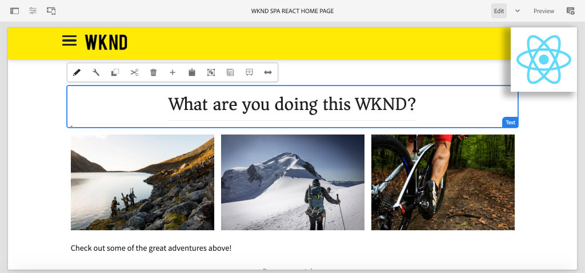

# Creación de su primer SPA de React en AEM {#overview}

{{edge-delivery-services}}

Bienvenido a un tutorial de varias partes diseñado para desarrolladores que utilicen la función **Editor de SPA** en Adobe Experience Manager (AEM). Este tutorial explora la implementación de una aplicación de React para una marca ficticia de estilo de vida, WKND. La aplicación React se ha desarrollado y diseñado para implementarse con el Editor de SPA de AEM, que asigna los componentes React a los componentes de AEM. La SPA completada, implementada en AEM, se puede crear dinámicamente con las herramientas tradicionales de edición en línea de AEM.

*Implementación de SPA de WKND*

## Acerca de

El tutorial está diseñado para funcionar con **AEM as a Cloud Service** y es compatible con **AEM 6.5.4+** y **AEM 6.4.8+**.

## Último código

Todo el código del tutorial se encuentra en [GitHub](https://github.com/adobe/aem-guides-wknd-spa).

La [base de código más reciente](https://github.com/adobe/aem-guides-wknd-spa/releases) está disponible como paquetes descargables de AEM.

## Requisitos previos

Antes de iniciar este tutorial, necesita lo siguiente:

* Conocimientos básicos de HTML, CSS y JavaScript
* Familiaridad básica con [React](https://reactjs.org/tutorial/tutorial.html)

*Aunque no es necesario, es beneficioso tener una comprensión básica del [desarrollo de componentes tradicionales de AEM Sites](https://experienceleague.adobe.com/docs/experience-manager-learn/getting-started-wknd-tutorial-develop/overview.html?lang=es).*

## Entorno de desarrollo local {#local-dev-environment}

Se necesita un entorno de desarrollo local para completar este tutorial. Las capturas de pantalla y los vídeos se capturan con AEM as a Cloud Service SDK, que se ejecuta en un entorno de sistema operativo Mac con [Visual Studio Code](https://code.visualstudio.com/) como IDE. Los comandos y el código deben ser independientes del sistema operativo local, a menos que se indique lo contrario.

### Software necesario

* [AEM as a Cloud Service SDK](https://experienceleague.adobe.com/docs/experience-manager-learn/cloud-service/local-development-environment-set-up/aem-runtime.html), [AEM 6.5.4+](https://experienceleague.adobe.com/docs/experience-manager-release-information/aem-release-updates/aem-releases-updates.html?lang=en#aem-65) o [AEM 6.4.8+](https://experienceleague.adobe.com/docs/experience-manager-release-information/aem-release-updates/aem-releases-updates.html?lang=en#aem-64)
* [Java](https://downloads.experiencecloud.adobe.com/content/software-distribution/en/general.html)
* [Apache Maven](https://maven.apache.org/) (3.3.9 o posterior)
* [Node.js](https://nodejs.org/en/) y [npm](https://www.npmjs.com/)

>[!NOTE]
>
> **¿Es novato en el uso de AEM as a Cloud Service?** Consulte la [siguiente guía para configurar un entorno de desarrollo local con el SDK de AEM as a Cloud Service](https://experienceleague.adobe.com/docs/experience-manager-learn/cloud-service/local-development-environment-set-up/overview.html?lang=es).
>
> **Nuevo en AEM 6.5?** Consulte la [siguiente guía para configurar un entorno de desarrollo local](https://experienceleague.adobe.com/docs/experience-manager-learn/foundation/development/set-up-a-local-aem-development-environment.html?lang=es).

## Siguientes pasos {#next-steps}

¿Qué estás esperando?! Inicie el tutorial navegando hasta el capítulo [Crear proyecto](create-project.md) y aprenda a generar un proyecto con Editor SPA habilitado mediante el arquetipo de proyecto de AEM.
