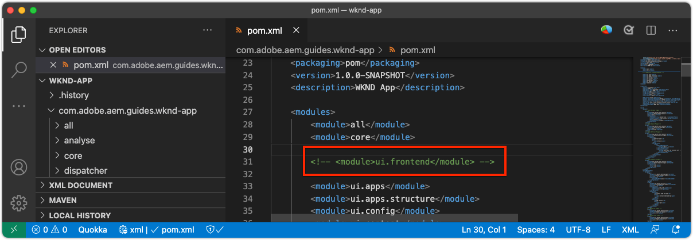
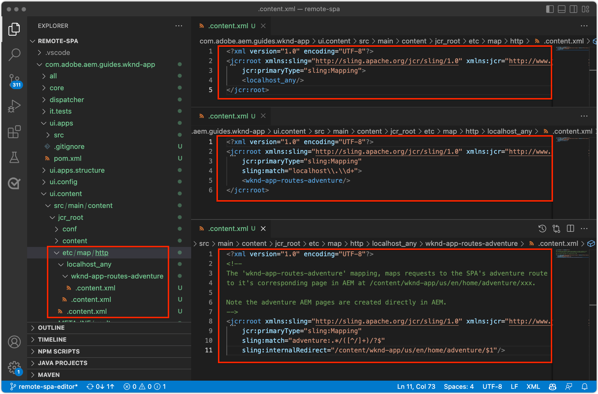
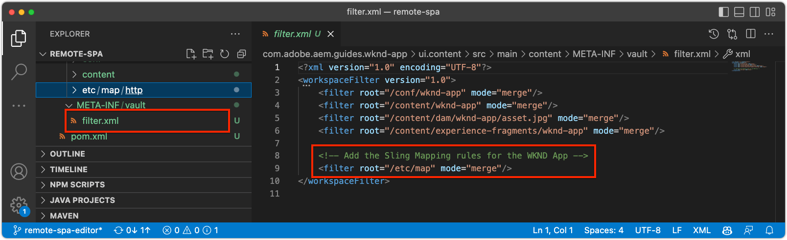
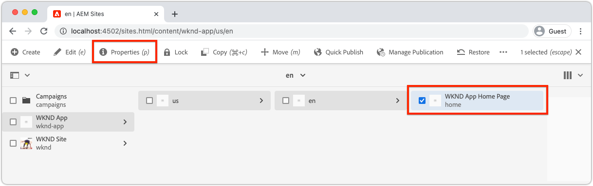

# Configuración de AEM para el Editor de SPA

{{spa-editor-deprecation}}

Aunque el código base de la SPA se administra fuera de AEM, se necesita un proyecto de AEM para configurar los requisitos de configuración y contenido de soporte. Este capítulo explica la creación de un proyecto de AEM que contiene las configuraciones necesarias:

* Proxy de componentes principales de AEM WCM
* Proxy de página de SPA remota de AEM
* Plantillas de página de SPA remota de AEM
* Páginas de AEM de la SPA remota de línea base
* Subproyecto para definir asignaciones de SPA a URL de AEM
* Carpetas de configuración de OSGi

## Descargar el proyecto base desde GitHub

Descargue el proyecto `aem-guides-wknd-graphql` desde Github.com. Contiene algunos archivos de línea de base utilizados en este proyecto.

```
$ mkdir -p ~/Code
$ git clone https://github.com/adobe/aem-guides-wknd-graphql.git
$ cd remote-spa-tutorial
```

## Creación de un proyecto de AEM

Cree un proyecto de AEM en el que se administren configuraciones y contenido de línea de base. Este proyecto se generará dentro de la carpeta `remote-spa-tutorial` del proyecto `aem-guides-wknd-graphql` clonado.

_Utilice siempre la última versión del [tipo de archivo de AEM](https://github.com/adobe/aem-project-archetype)._

```
$ cd ~/Code/aem-guides-wknd-graphql/remote-spa-tutorial
$ mvn -B archetype:generate \
 -D archetypeGroupId=com.adobe.aem \
 -D archetypeArtifactId=aem-project-archetype \
 -D archetypeVersion=39 \
 -D aemVersion=cloud \
 -D appTitle="WKND App" \
 -D appId="wknd-app" \
 -D groupId="com.adobe.aem.guides.wkndapp" \
 -D frontendModule="react"
$ mv ~/Code/aem-guides-wknd-graphql/remote-spa-tutorial/wknd-app ~/Code/aem-guides-wknd-graphql/remote-spa-tutorial/com.adobe.aem.guides.wknd-app
```

_El último comando simplemente cambia el nombre de la carpeta del proyecto de AEM para que esté claro que es el proyecto de AEM y no se debe confundir con el SPA remoto**

Mientras se especifica `frontendModule="react"`, el proyecto `ui.frontend` no se usa para el caso de uso de SPA remoto. El SPA se desarrolla y administra de forma externa a AEM y solo utiliza AEM como API de contenido. Se requiere el indicador `frontendModule="react"` para el proyecto, que incluye las dependencias de AEM Java™ `spa-project` y configura las plantillas de página de SPA remotas.

El tipo de archivo del proyecto de AEM genera los siguientes elementos que se utilizan para configurar AEM para su integración con la SPA.

* **Proxies de componentes principales de AEM WCM** en `ui.apps/src/.../apps/wknd-app/components`
* **Proxy de página remota SPA de AEM** en `ui.apps/src/.../apps/wknd-app/components/remotepage`
* **Plantillas de página AEM** a las `ui.content/src/.../conf/wknd-app/settings/wcm/templates`
* **Subproyecto para definir asignaciones de contenido** en `ui.content/src/...`
* **Páginas de AEM de SPA remota de línea de base** a las `ui.content/src/.../content/wknd-app`
* **carpetas de configuración de OSGi** en `ui.config/src/.../apps/wknd-app/osgiconfig`

Con el proyecto base de AEM generado, algunos ajustes garantizan la compatibilidad del Editor SPA con las SPA remotas.

## Eliminar proyecto ui.frontend

Dado que la SPA es una SPA remota, supongamos que se desarrolla y administra fuera del proyecto de AEM. Para evitar conflictos, quite la implementación del proyecto `ui.frontend`. Si no se quita el proyecto `ui.frontend`, dos SPA, el SPA predeterminado proporcionado en el proyecto `ui.frontend` y el SPA remoto, se cargarán al mismo tiempo en el Editor de SPA de AEM.

1. Abra el proyecto de AEM (`~/Code/aem-guides-wknd-graphql/remote-spa-tutorial/com.adobe.aem.guides.wknd-app`) en su IDE
1. Abrir la raíz `pom.xml`
1. Comentar `<module>ui.frontend</module` fuera de la lista `<modules>`

   ```
   <modules>
       <module>all</module>
       <module>core</module>
   
       <!-- <module>ui.frontend</module> -->
   
       <module>ui.apps</module>
       <module>ui.apps.structure</module>
       <module>ui.config</module>
       <module>ui.content</module>
       <module>it.tests</module>
       <module>dispatcher</module>
       <module>ui.tests</module>
       <module>analyse</module>
   </modules>
   ```

   El archivo `pom.xml` debe tener el siguiente aspecto:

   

1. Abrir `ui.apps/pom.xml`
1. Eliminar comentario de `<dependency>` en `<artifactId>wknd-app.ui.frontend</artifactId>`

   ```
   <dependencies>
   
       <!-- Remote SPA project will provide all frontend resources
       <dependency>
           <groupId>com.adobe.aem.guides.wkndapp</groupId>
           <artifactId>wknd-app.ui.frontend</artifactId>
           <version>${project.version}</version>
           <type>zip</type>
       </dependency>
       --> 
   </dependencies>
   ```

   El archivo `ui.apps/pom.xml` debe tener el siguiente aspecto:

   

Si el proyecto de AEM se creó antes de estos cambios, elimine manualmente la biblioteca de cliente generada por `ui.frontend` del proyecto `ui.apps` en `ui.apps/src/main/content/jcr_root/apps/wknd-app/clientlibs/clientlib-react`.

## Asignación de contenido de AEM

Para que AEM cargue el SPA remoto en el Editor de SPA, se deben establecer asignaciones entre las rutas del SPA y las páginas de AEM utilizadas para abrir y crear contenido.

La importancia de esta configuración se analiza más adelante.

La asignación se puede realizar con [la asignación de Sling](https://sling.apache.org/documentation/the-sling-engine/mappings-for-resource-resolution.html#root-level-mappings-1) definida en `/etc/map`.

1. In the IDE, open the `ui.content` subproject
1. Navigate to  `src/main/content/jcr_root`
1. Create a folder `etc`
1. In `etc`, create a folder `map`
1. In `map`, create a folder `http`
1. In `http`, create a file `.content.xml` with the contents:

   ```
   <?xml version="1.0" encoding="UTF-8"?>
   <jcr:root xmlns:sling="http://sling.apache.org/jcr/sling/1.0" xmlns:jcr="http://www.jcp.org/jcr/1.0"
       jcr:primaryType="sling:Mapping">
       <localhost_any/>
   </jcr:root>
   ```

1. In `http` , create a folder `localhost_any`
1. In `localhost_any`, create a file `.content.xml` with the contents:

   ```
   <?xml version="1.0" encoding="UTF-8"?>
   <jcr:root xmlns:sling="http://sling.apache.org/jcr/sling/1.0" xmlns:jcr="http://www.jcp.org/jcr/1.0"
       jcr:primaryType="sling:Mapping"
       sling:match="localhost\\.\\d+">
       <wknd-app-routes-adventure/>
   </jcr:root>
   ```

1. In `localhost_any` , create a folder `wknd-app-routes-adventure`
1. In `wknd-app-routes-adventure`, create a file `.content.xml` with the contents:

   ```
   <?xml version="1.0" encoding="UTF-8"?>
   
   <!--
   The 'wknd-app-routes-adventure' mapping, maps requests to the SPA's adventure route 
   to it's corresponding page in AEM at /content/wknd-app/us/en/home/adventure/xxx.
   
   Note the adventure AEM pages are created directly in AEM.
   -->
   
   <jcr:root xmlns:sling="http://sling.apache.org/jcr/sling/1.0" xmlns:jcr="http://www.jcp.org/jcr/1.0"
       jcr:primaryType="sling:Mapping"
       sling:match="adventure:.*/([^/]+)/?$"
       sling:internalRedirect="/content/wknd-app/us/en/home/adventure/$1"/>
   ```

1. Add the mapping nodes to `ui.content/src/main/content/META-INF/vault/filter.xml` to they included in the AEM package.

   ```
   <?xml version="1.0" encoding="UTF-8"?>
   <workspaceFilter version="1.0">
       <filter root="/conf/wknd-app" mode="merge"/>
       <filter root="/content/wknd-app" mode="merge"/>
       <filter root="/content/dam/wknd-app/asset.jpg" mode="merge"/>
       <filter root="/content/experience-fragments/wknd-app" mode="merge"/>
   
       <!-- Add the Sling Mapping rules for the WKND App -->
       <filter root="/etc/map" mode="merge"/>
   </workspaceFilter>
   ```

The folder structure and `.context.xml` files should look like:



The `filter.xml` file should look like:



Now, when the AEM project is deployed, these configurations are automatically included.

The Sling Mapping effects AEM running on `http` and `localhost`, so only support local development. When deploying to AEM as a Cloud Service, similar Sling Mappings must be added that target `https` and the appropriate AEM as a Cloud Service domain/s. For more information, see the [Sling Mapping documentation](https://sling.apache.org/documentation/the-sling-engine/mappings-for-resource-resolution.html).

## Cross-Origin Resource Sharing security policies

Next, configure AEM to protect the content so only this SPA can access the AEM content. Configure [Cross-Origin Resource Sharing in AEM](https://experienceleague.adobe.com/docs/experience-manager-learn/foundation/security/develop-for-cross-origin-resource-sharing.html).

1. In your IDE, open the `ui.config` Maven subproject
1. Navigate `src/main/content/jcr_root/apps/wknd-app/osgiconfig/config`
1. Create a file named `com.adobe.granite.cors.impl.CORSPolicyImpl~wknd-app_remote-spa.cfg.json`
1. Añada lo siguiente al archivo:

   ```
   {
       "supportscredentials":true,
       "exposedheaders":[
           ""
       ],
       "supportedmethods":[
           "GET",
           "HEAD",
           "POST",
           "OPTIONS"
       ],
       "alloworigin":[
           "https://external-hosted-app", "localhost:3000"
       ],
       "maxage:Integer":1800,
       "alloworiginregexp":[
           ".*"
       ],
       "allowedpaths":[
           ".*"
       ],
       "supportedheaders":[
           "Origin",
           "Accept",
           "X-Requested-With",
           "Content-Type",
           "Access-Control-Request-Method",
           "Access-Control-Request-Headers",
           "authorization"
       ]
   }
   ```

El archivo `com.adobe.granite.cors.impl.CORSPolicyImpl~wknd-app_remote-spa.cfg.json` debe tener el siguiente aspecto:


Los elementos clave de la configuración son:

* `alloworigin` especifica qué hosts pueden recuperar contenido de AEM.
   * `localhost:3000` se ha agregado para admitir que la SPA se ejecute localmente
   * `https://external-hosted-app` actúa como un marcador de posición para reemplazarse con el dominio en el que se aloja el SPA remoto.
* `allowedpaths` specify which paths in AEM are covered by this CORS configuration. El valor predeterminado permite el acceso a todo el contenido en AEM; sin embargo, esto solo se puede vincular a las rutas específicas a las que puede acceder la SPA, por ejemplo: `/content/wknd-app`.

## Establecer página de AEM como plantilla de página de SPA remota

El tipo de archivo del proyecto de AEM genera un proyecto preparado para la integración de AEM con una SPA remota, pero requiere un pequeño pero importante ajuste de la estructura de páginas de AEM generada automáticamente. Se debe cambiar el tipo de la página de AEM generada automáticamente a **página de SPA remota**, en lugar de a **página de SPA**.

1. En su IDE, abra el subproyecto `ui.content`
1. Abrir en `src/main/content/jcr_root/content/wknd-app/us/en/home/.content.xml`
1. Actualizar este archivo de `.content.xml` con:

   ```xml
   <?xml version="1.0" encoding="UTF-8"?>
   <jcr:root xmlns:sling="http://sling.apache.org/jcr/sling/1.0" xmlns:cq="http://www.day.com/jcr/cq/1.0" xmlns:jcr="http://www.jcp.org/jcr/1.0" xmlns:nt="http://www.jcp.org/jcr/nt/1.0"
           jcr:primaryType="cq:Page">
       <jcr:content
           cq:template="/conf/wknd-app/settings/wcm/templates/spa-remote-page"
           jcr:primaryType="cq:PageContent"
           jcr:title="WKND App Home Page"
           sling:resourceType="wknd-app/components/remotepage">
           <root
               jcr:primaryType="nt:unstructured"
               sling:resourceType="wcm/foundation/components/responsivegrid">
               <responsivegrid
                   jcr:primaryType="nt:unstructured"
                   sling:resourceType="wcm/foundation/components/responsivegrid">
                   <text
                       jcr:primaryType="nt:unstructured"
                       sling:resourceType="wknd-app/components/text"
                       text="&lt;p>Hello World!&lt;/p>"
                       textIsRich="true">
                       <cq:responsive jcr:primaryType="nt:unstructured"/>
                   </text>
               </responsivegrid>
           </root>
       </jcr:content>
   </jcr:root>
   ```

Los cambios clave son actualizaciones en el nodo `jcr:content`:

* `cq:template` a `/conf/wknd-app/settings/wcm/templates/spa-remote-page`
* `sling:resourceType` a `wknd-app/components/remotepage`

El archivo `src/main/content/jcr_root/content/wknd-app/us/en/home/.content.xml` debe tener el siguiente aspecto:


Estos cambios permiten que esta página, que actúa como raíz de la SPA en AEM, cargue la SPA remota en el Editor de SPA.

>[!NOTE]
>
>Si este proyecto se implementó anteriormente en AEM, asegúrese de eliminar la página de AEM como **Sitios > Aplicación WKND > us > en > Página de inicio de la aplicación WKND**, ya que el proyecto `ui.content` se establece en **combinar** nodos, en lugar de **actualizar**.

Esta página también se puede eliminar y volver a crear como una página de SPA remota en AEM, pero como esta página se crea automáticamente en el proyecto `ui.content`, es mejor actualizarla en la base de código.

## Implementar el proyecto de AEM en AEM SDK

1. Asegúrese de que el servicio AEM Author se está ejecutando en el puerto 4502
1. From the command line, navigate to the root of the AEM Maven project
1. Use Maven to deploy the project to your local AEM SDK Author service

   ```
   $ mvn clean install -PautoInstallSinglePackage
   ```

   

## Configure the root AEM page

With the AEM Project deployed, there is one last step to prepare SPA Editor to load our Remote SPA. In AEM, mark the AEM page that corresponds to the SPA&#39;s root,`/content/wknd-app/us/en/home`, generated by the AEM Project Archetype.

1. Log in to AEM Author
1. Navigate to **Sites > WKND App > us > en**
1. Select the **WKND App Home Page**, and tap **Properties**

   

1. Navigate to the **SPA** tab
1. Fill out the **Remote SPA Configuration**
   1. **SPA Host URL**: `http://localhost:3000`
      1. The URL to the root of the Remote SPA

   

1. Tap **Save &amp; Close**

Remember that we changed this page&#39;s type to that of a **Remote SPA Page**, which is what allows us to see the **SPA** tab in its **Page Properties**.

This configuration only must be set on the AEM page that corresponds to the root of the SPA. All AEM pages beneath this page inherit the value.

## Enhorabuena.

You&#39;ve now prepared AEM&#39;s configurations and deployed them to your local AEM author! You now know how to:

* Remove the AEM Project Archetype-generated SPA, by commenting out the dependencies in `ui.frontend`
* Add Sling Mappings to AEM that map the SPA routes to resources in AEM
* Set up AEM&#39;s Cross-Origin Resource Sharing security policies that allow the Remote SPA to consume content from AEM
* Deploy the AEM project to your local AEM SDK Author service
* Marcar una página de AEM como raíz de la SPA remota mediante la propiedad de página URL del host de la SPA

## Próximos pasos

Con AEM configurado, podemos centrarnos en [arrancar el SPA remoto](./spa-bootstrap.md) con soporte para áreas editables usando AEM SPA Editor.
