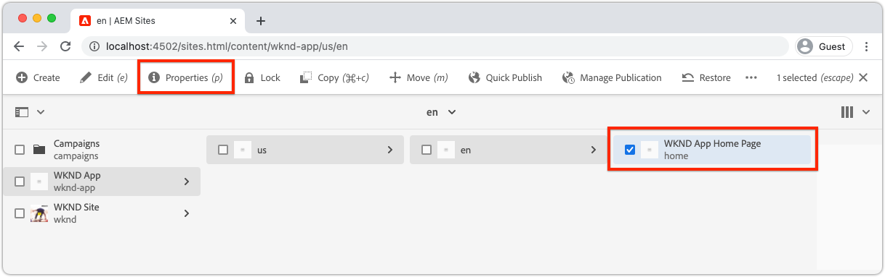

# Configuración de AEM para SPA Editor

Aunque el código base de SPA se administra fuera de AEM, se requiere un proyecto de AEM para configurar los requisitos de configuración y contenido. Este capítulo explica la creación de un proyecto AEM que contenga las configuraciones necesarias:

+ AEM proxies de componentes principales de WCM
+ AEM Remote SPA Page proxy
+ AEM plantillas de página SPA remotas
+ Páginas de AEM de SPA remoto de línea de base
+ Subproyecto para definir SPA a AEM asignaciones de URL
+ Carpetas de configuración de OSGi

## Creación de un proyecto AEM

Cree un proyecto AEM en el que se administren las configuraciones y el contenido de línea de base.

_Utilice siempre la versión más reciente del tipo de archivo  [AEM](https://github.com/adobe/aem-project-archetype)._


```
$ mkdir -p ~/Code/wknd-app
$ cd ~/Code/wknd-app
$ mvn -B archetype:generate \
 -D archetypeGroupId=com.adobe.aem \
 -D archetypeArtifactId=aem-project-archetype \
 -D archetypeVersion=27 \
 -D aemVersion=cloud \
 -D appTitle="WKND App" \
 -D appId="wknd-app" \
 -D groupId="com.adobe.aem.guides.wkndapp" \
 -D frontendModule="react"
$ mv ~/Code/wknd-app/wknd-app ~/Code/wknd-app/com.adobe.aem.guides.wknd-app
```

_El último comando simplemente cambia el nombre de la carpeta del proyecto de AEM para que quede claro que es el proyecto de AEM y no debe confundirse con SPA__ remoto

Mientras que `frontendModule="react"` se especifica, el proyecto `ui.frontend` no se utiliza para el caso de uso de SPA remoto. El SPA se desarrolla y administra externamente para AEM y solo utiliza AEM como API de contenido. Se requiere el indicador `frontendModule="react"` para el proyecto, que incluye las dependencias `spa-project` AEM Java™ y configura las plantillas de página de SPA remota.

El tipo de archivo del proyecto AEM genera los siguientes elementos que se utilizaron para configurar AEM para la integración con el SPA.

+ __AEM proxy de componentes principales de WCM__ en  `ui.content/src/.../apps/wknd-app/components`
+ __AEM SPA__ proxyat de página remota  `ui.content/src/.../apps/wknd-app/components/remotepage`
+ __AEM__ plantillas de página  `ui.content/src/.../conf/wknd-app/settings/wcm/templates`
+ __Subproyecto para definir__ asignaciones de contenido  `ui.content/src/...`
+ __Páginas de AEM de SPA remoto__ de línea de base  `ui.content/src/.../content/wknd-app`
+ __Carpeta de configuración__ OSGi  `ui.config/src/.../apps/wknd-app/osgiconfig`

Con la generación del proyecto de AEM base, algunos ajustes garantizan SPA compatibilidad del Editor con SPA remoto.

## Quitar proyecto ui.frontend

Dado que el SPA es un SPA remoto, asumamos que se ha desarrollado y administrado fuera del proyecto AEM. Para evitar conflictos, elimine el proyecto `ui.frontend` de la implementación. Si el proyecto `ui.frontend` no se elimina, dos SPA, el SPA predeterminado proporcionado en el proyecto `ui.frontend` y el SPA remoto, se cargarán al mismo tiempo en el Editor de SPA de AEM.

1. Abra el proyecto de AEM (`~/Code/wknd-app/com.adobe.aem.guides.wknd-app`) en su IDE
1. Abra la raíz `pom.xml`
1. Comente el `<module>ui.frontend</module` fuera de la lista `<modules>`

   ```
   <modules>
       <module>all</module>
       <module>core</module>
   
       <!-- <module>ui.frontend</module> -->
   
       <module>ui.apps</module>
       <module>ui.apps.structure</module>
       <module>ui.config</module>
       <module>ui.content</module>
       <module>it.tests</module>
       <module>dispatcher</module>
       <module>ui.tests</module>
       <module>analyse</module>
   </modules>
   ```

   El archivo `pom.xml` debería tener el siguiente aspecto:

   

1. Abra el `ui.apps/pom.xml`
1. Comente el `<dependency>` en `<artifactId>wknd-app.ui.frontend</artifactId>`

   ```
   <dependencies>
   
       <!-- Remote SPA project will provide all frontend resources
       <dependency>
           <groupId>com.adobe.aem.guides.wkndapp</groupId>
           <artifactId>wknd-app.ui.frontend</artifactId>
           <version>${project.version}</version>
           <type>zip</type>
       </dependency>
       --> 
   </dependencies>
   ```

   El archivo `ui.apps/pom.xml` debería tener el siguiente aspecto:

   

Si el proyecto AEM se creó antes de estos cambios, elimine manualmente la `ui.frontend` biblioteca de cliente generada del proyecto `ui.apps` en `ui.apps/src/main/content/jcr_root/apps/wknd-app/clientlibs/clientlib-react`.

## Asignación de contenido AEM

Para AEM cargar el SPA remoto en el Editor de SPA, se deben establecer asignaciones entre las rutas de SPA y las páginas de AEM utilizadas para abrir y crear contenido.

La importancia de esta configuración se analiza más adelante.

La asignación se puede realizar con [Sling Mapping](https://sling.apache.org/documentation/the-sling-engine/mappings-for-resource-resolution.html#root-level-mappings-1) definido en `/etc/map`.

1. En el IDE, abra el subproyecto `ui.content`
1. Ir a  `src/main/content/jcr_root/etc`
1. Cree una carpeta  . `map`
1. En `map`, cree una carpeta `http`
1. En `http`, cree un archivo `.content.xml` con el contenido:

   ```
   <?xml version="1.0" encoding="UTF-8"?>
   <jcr:root xmlns:sling="http://sling.apache.org/jcr/sling/1.0" xmlns:jcr="http://www.jcp.org/jcr/1.0"
       jcr:primaryType="sling:Mapping">
       <localhost_any/>
   </jcr:root>
   ```

1. En `http` , cree una carpeta `localhost_any`
1. En `localhost_any`, cree un archivo `.content.xml` con el contenido:

   ```
   <?xml version="1.0" encoding="UTF-8"?>
   <jcr:root xmlns:sling="http://sling.apache.org/jcr/sling/1.0" xmlns:jcr="http://www.jcp.org/jcr/1.0"
       jcr:primaryType="sling:Mapping"
       sling:match="localhost\\.\\d+">
       <wknd-app-routes-adventure/>
   </jcr:root>
   ```

1. En `localhost_any` , cree una carpeta `wknd-app-routes-adventure`
1. En `wknd-app-routes-adventure`, cree un archivo `.content.xml` con el contenido:

   ```
   <?xml version="1.0" encoding="UTF-8"?>
   
   <!--
   The 'wknd-app-routes-adventure' mapping, maps requests to the SPA's adventure route 
   to it's corresponding page in AEM at /content/wknd-app/us/en/home/adventure/xxx.
   
   Note the adventure AEM pages will be created directly in AEM.
   -->
   
   <jcr:root xmlns:sling="http://sling.apache.org/jcr/sling/1.0" xmlns:jcr="http://www.jcp.org/jcr/1.0"
       jcr:primaryType="sling:Mapping"
       sling:match="adventure:.*/([^/]+)/?$"
       sling:internalRedirect="/content/wknd-app/us/en/home/adventure/$1"/>
   ```

1. Agregue los nodos de asignación a `ui.content/src/main/content/META-INF/vault/filter.xml` a los que se incluyen en el paquete de AEM.

   ```
   <?xml version="1.0" encoding="UTF-8"?>
   <workspaceFilter version="1.0">
       <filter root="/conf/wknd-app" mode="merge"/>
       <filter root="/content/wknd-app" mode="merge"/>
       <filter root="/content/dam/wknd-app/asset.jpg" mode="merge"/>
       <filter root="/content/experience-fragments/wknd-app" mode="merge"/>
   
       <!-- Add the Sling Mapping rules for the WKND App -->
       <filter root="/etc/map" mode="merge"/>
   </workspaceFilter>
   ```

La estructura de carpetas y los archivos `.context.xml` deben tener el siguiente aspecto:


El archivo `filter.xml` debería tener el siguiente aspecto:


Ahora, cuando se implementa el proyecto AEM, estas configuraciones se incluyen automáticamente.

Los efectos de Sling Mapping AEM se ejecutan en `http` y `localhost`, por lo que solo admiten el desarrollo local. Al implementar en AEM como Cloud Service, se deben agregar asignaciones de Sling similares que tengan como destino `https` y el AEM apropiado como dominios de Cloud Service. Para obtener más información, consulte la [documentación de Sling Mapping](https://sling.apache.org/documentation/the-sling-engine/mappings-for-resource-resolution.html).

## Políticas de seguridad de Cross-Origin Resource Sharing

A continuación, configure AEM para proteger el contenido de modo que solo este SPA pueda acceder al contenido AEM. C Configurar el [uso compartido de recursos de origen cruzado en AEM](https://experienceleague.adobe.com/docs/experience-manager-learn/foundation/security/develop-for-cross-origin-resource-sharing.html).

1. En su IDE, abra el subproyecto `ui.config` Maven
1. Navegar `src/main/content/jcr_root/apps/wknd-app/osgiconfig/config`
1. Crear un archivo con el nombre `com.adobe.granite.cors.impl.CORSPolicyImpl~wknd-app_remote-spa.cfg.json`
1. Agregue lo siguiente al archivo :

   ```
   {
       "supportscredentials":true,
       "exposedheaders":[
           ""
       ],
       "supportedmethods":[
           "GET",
           "HEAD",
           "POST",
           "OPTIONS"
       ],
       "alloworigin":[
           "https://external-hosted-app", "localhost:3000"
       ],
       "maxage:Integer":1800,
       "alloworiginregexp":[
           ".*"
       ],
       "allowedpaths":[
           ".*"
       ],
       "supportedheaders":[
           "Origin",
           "Accept",
           "X-Requested-With",
           "Content-Type",
           "Access-Control-Request-Method",
           "Access-Control-Request-Headers",
           "Authorization"
       ]
   }
   ```

El archivo `com.adobe.granite.cors.impl.CORSPolicyImpl~wknd-app_remote-spa.cfg.json` debería tener el siguiente aspecto:


Los elementos de configuración clave son:

+ `alloworigin` especifica qué hosts pueden recuperar contenido de AEM.
   + `localhost:3000` se agrega para admitir la SPA que se ejecuta localmente
   + `https://external-hosted-app` actúa como marcador de posición para reemplazarlo por el dominio en el que está alojado SPA remoto.
+ `allowedpaths` especifique qué rutas de AEM están cubiertas por esta configuración CORS. El valor predeterminado permite acceder a todo el contenido de AEM, aunque solo se puede tratar en el ámbito de las rutas específicas a las que el SPA puede acceder, por ejemplo: `/content/wknd-app`.

## Establecer AEM página como plantilla SPA página remota

El tipo de archivo del proyecto AEM genera un proyecto preparado para AEM integración con un SPA remoto, pero requiere un ajuste pequeño, pero importante, de la estructura de AEM página generada automáticamente. El tipo de página de AEM generada automáticamente debe cambiarse a __Página de SPA remota__, en lugar de a __SPA página__.

1. En su IDE, abra el subproyecto `ui.content`
1. Abrir a `src/main/content/jcr_root/content/wknd-app/us/en/home/.content.xml`
1. Actualice este archivo `.content.xml` con:

   ```
   <?xml version="1.0" encoding="UTF-8"?>
   <jcr:root xmlns:sling="http://sling.apache.org/jcr/sling/1.0" xmlns:cq="http://www.day.com/jcr/cq/1.0" xmlns:jcr="http://www.jcp.org/jcr/1.0" xmlns:nt="http://www.jcp.org/jcr/nt/1.0"
           jcr:primaryType="cq:Page">
       <jcr:content
           cq:template="/conf/wknd-app/settings/wcm/templates/spa-remote-page"
           jcr:primaryType="cq:PageContent"
           jcr:title="WKND App Home Page"
           sling:resourceType="wknd-app/components/remotepage">
           <root
               jcr:primaryType="nt:unstructured"
               sling:resourceType="wcm/foundation/components/responsivegrid">
               <responsivegrid
                   jcr:primaryType="nt:unstructured"
                   sling:resourceType="wcm/foundation/components/responsivegrid">
                   <text
                       jcr:primaryType="nt:unstructured"
                       sling:resourceType="wknd-app/components/text"
                       text="&lt;p>Hello World!&lt;/p>"
                       textIsRich="true">
                       <cq:responsive jcr:primaryType="nt:unstructured"/>
                   </text>
               </responsivegrid>
           </root>
       </jcr:content>
   </jcr:root>
   ```

Los cambios clave son actualizaciones del nodo `jcr:content`:

+ `cq:template` hasta `/conf/wknd-app/settings/wcm/templates/spa-remote-page`
+ `sling:resourceType` hasta `wknd-app/components/remotepage`

El archivo `src/main/content/jcr_root/content/wknd-app/us/en/home/.content.xml` debería tener el siguiente aspecto:


Estos cambios permiten que esta página, que actúa como SPA raíz en AEM, cargue la SPA remota en SPA Editor.

>[!NOTE]
>
>Si este proyecto se AEM anteriormente, asegúrese de eliminar la página AEM como __Sites > WKND App > us > en > WKND App Home Page__, ya que el proyecto `ui.content` está configurado como nodos __merge__ en lugar de __update__.

Esta página también se puede eliminar y volver a crear como página de SPA remota en AEM, sin embargo, dado que esta página se crea automáticamente en el proyecto `ui.content`, es mejor actualizarla en la base de código.

## Implementación del proyecto AEM en AEM SDK

1. Asegúrese de que el servicio AEM Author se esté ejecutando en el puerto 4502
1. Desde la línea de comandos, vaya a la raíz del proyecto AEM Maven.
1. Utilice Maven para implementar el proyecto en el servicio de creación del SDK de AEM local.

   ```
   $ mvn clean install -PautoInstallSinglePackage
   ```

   

## Configuración de la página AEM raíz

Con el proyecto AEM implementado, hay un último paso para preparar SPA Editor para cargar nuestro SPA remoto. En AEM, marque la página AEM que corresponde a la raíz de SPA,`/content/wknd-app/us/en/home`, generada por el tipo de archivo del proyecto AEM.

1. Iniciar sesión en AEM Author
1. Vaya a __Sites > WKND App > us > en__
1. Seleccione la __Página principal de la aplicación WKND__ y pulse __Propiedades__

   

1. Vaya a la pestaña __SPA__
1. Rellene __Configuración de SPA remota__
   + __SPA URL__ del host:  `http://localhost:3000`
      + La URL a la raíz del SPA remoto

   

1. Toque __Guardar y cerrar__

Recuerde que hemos cambiado el tipo de esta página por el de una __Página de SPA remota__, que es lo que nos permite ver la pestaña __SPA__ en sus __Propiedades de la página__.

Esta configuración solo debe configurarse en la página AEM que corresponda a la raíz de la SPA. Todas las páginas AEM debajo de esta página heredan el valor.

## Felicitaciones

Ya ha preparado AEM configuraciones e implementado en su autor de AEM local. Ahora sabe cómo:

+ Elimine la SPA generada por el tipo de archivo del proyecto AEM, comentando las dependencias en `ui.frontend`
+ Agregue asignaciones de Sling a AEM que asignen las rutas de SPA a los recursos en AEM
+ Configure AEM políticas de seguridad de Cross-Origin Resource Sharing que permitan que el SPA remoto consuma contenido de AEM
+ Implemente el proyecto de AEM en el servicio local AEM SDK Author
+ Marcar una página AEM como la raíz de SPA remota usando la propiedad de página URL de host SPA

## Pasos siguientes

Con AEM configurado, podemos centrarnos en [arrancar el SPA remoto](./spa-bootstrap.md) con compatibilidad para áreas editables usando AEM SPA Editor!