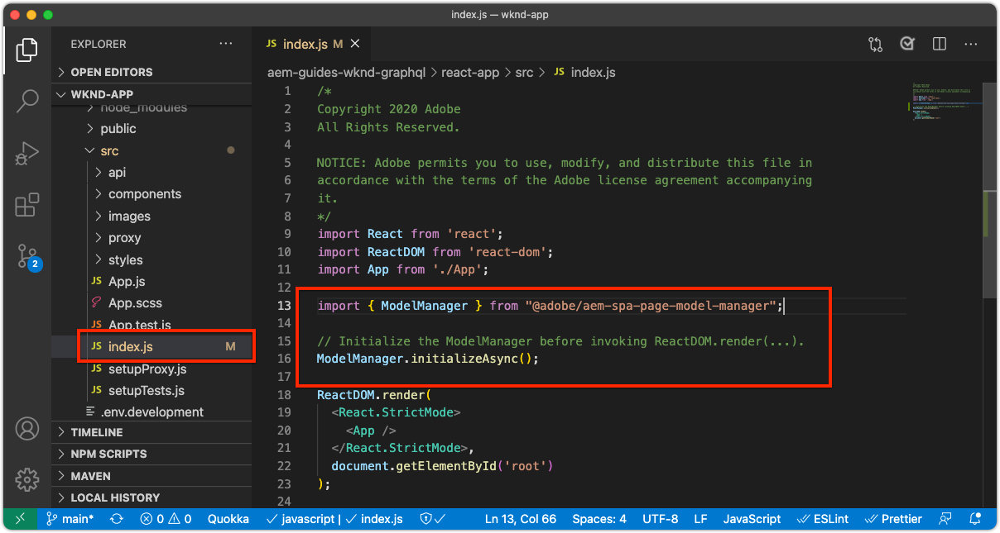
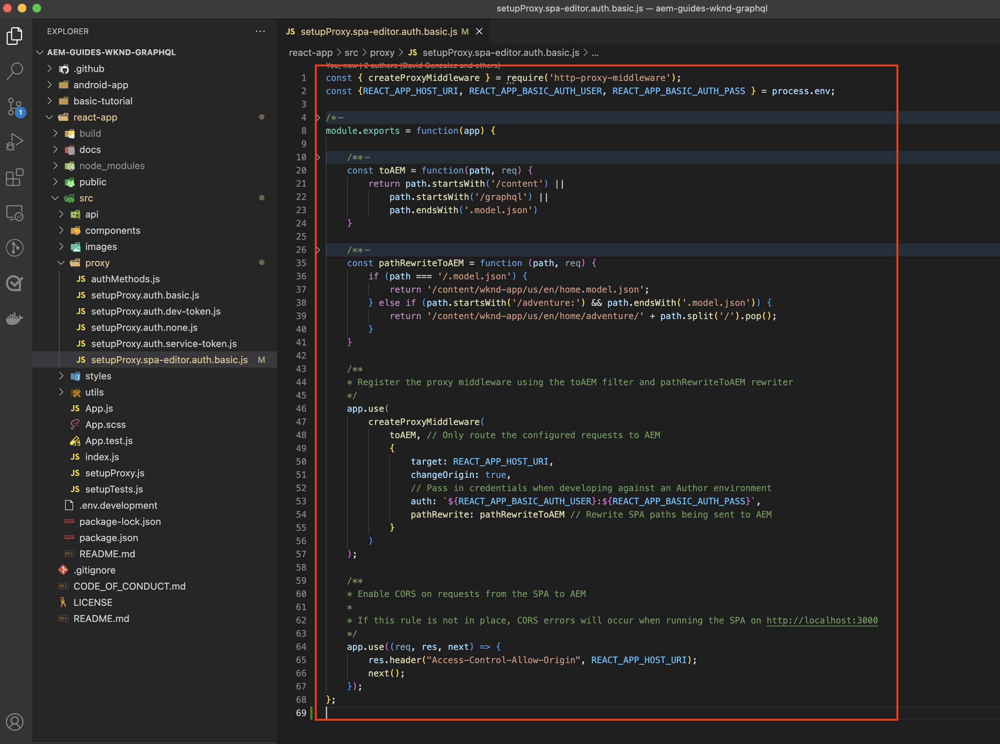
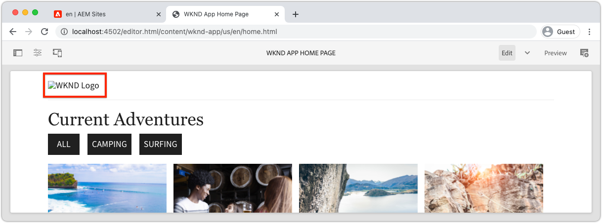
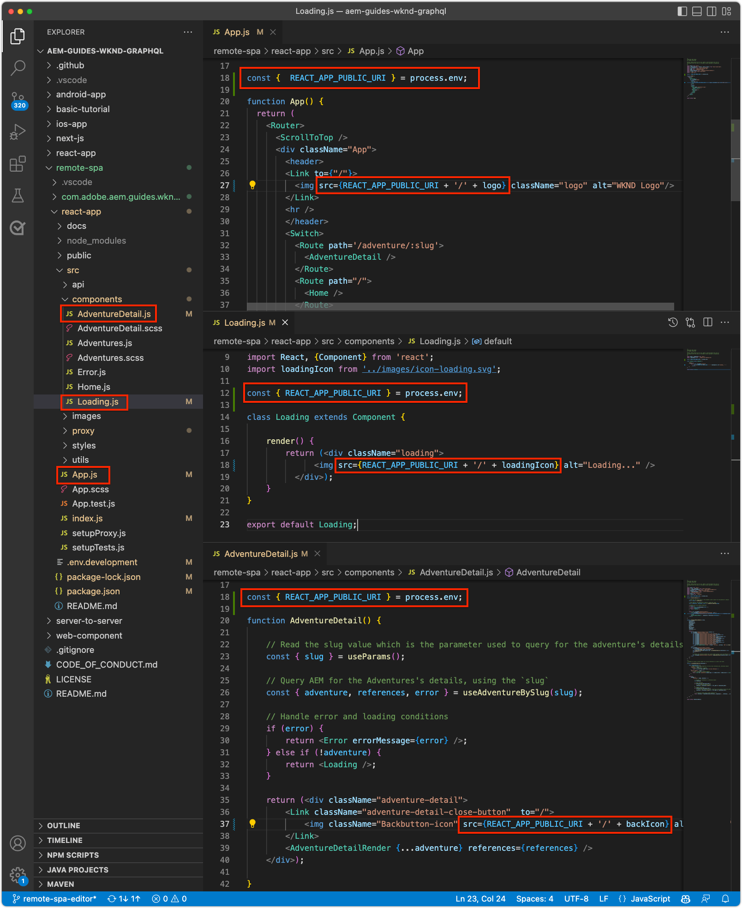
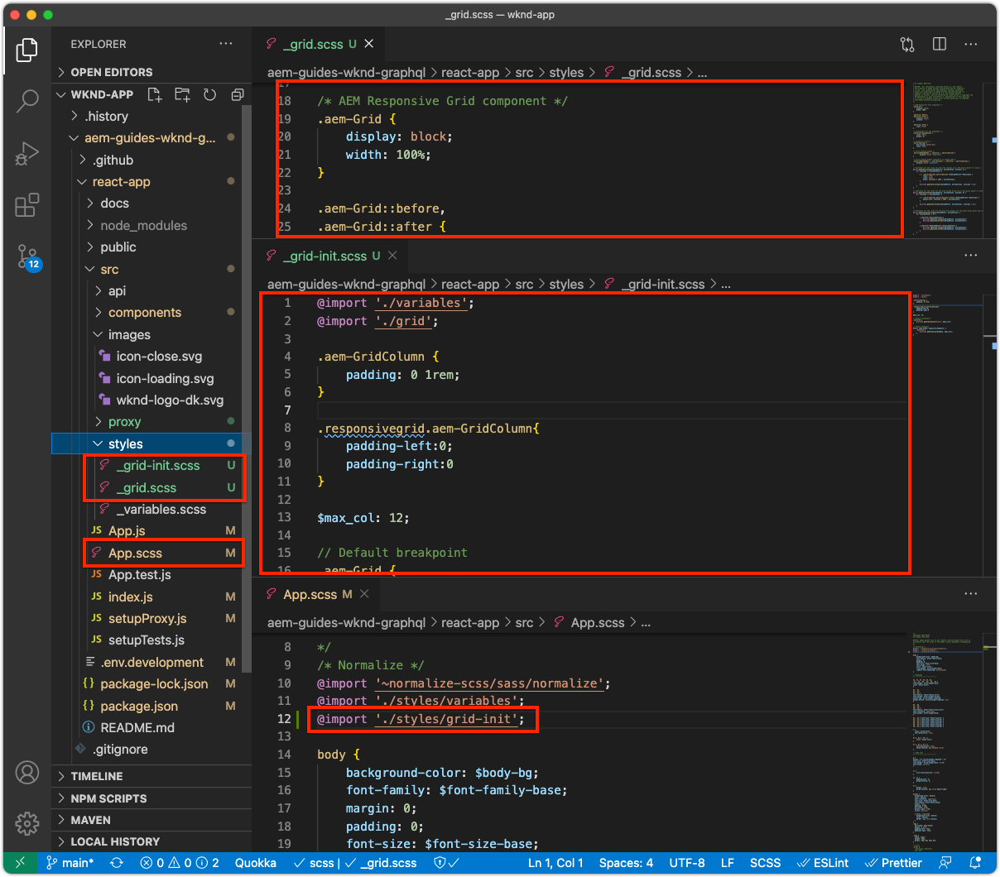
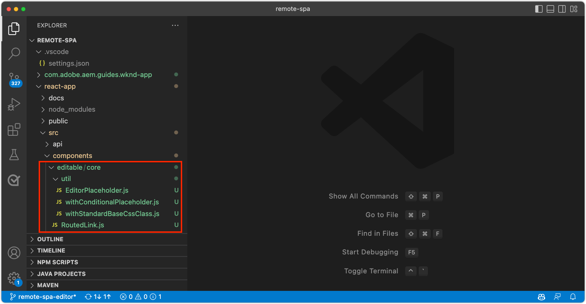
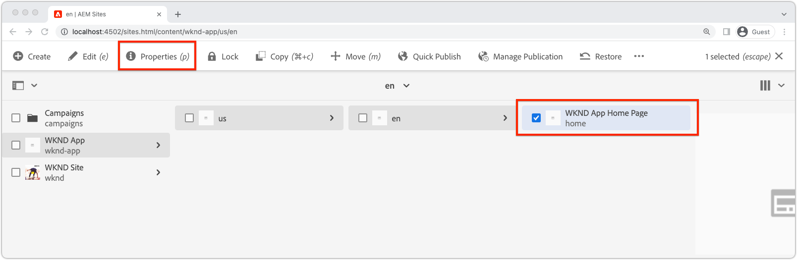
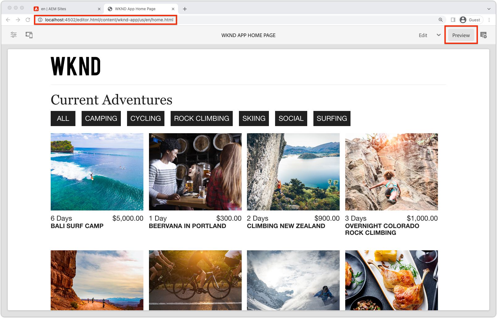

# Bootstrap el SPA remoto para el editor de SPA

{{spa-editor-deprecation}}

Antes de poder agregar las áreas editables a la SPA remota, debe arrancarse con AEM SPA Editor JavaScript SDK y algunas otras configuraciones.

## Instalación de dependencias npm de AEM SPA Editor JS SDK

En primer lugar, revise las dependencias npm de SPA de AEM para el proyecto React y, a continuación, instálelas.

* [`@adobe/aem-spa-page-model-manager`](https://github.com/adobe/aem-spa-page-model-manager) : proporciona la API para recuperar contenido de AEM.
* [`@adobe/aem-spa-component-mapping`](https://github.com/adobe/aem-spa-component-mapping) : proporciona la API que asigna contenido de AEM a los componentes de SPA.
* [`@adobe/aem-react-editable-components` v2](https://github.com/adobe/aem-react-editable-components) : proporciona una API para generar componentes de SPA personalizados y proporciona implementaciones de uso común como el componente React `AEMPage`.

```shell
$ cd ~/Code/aem-guides-wknd-graphql/remote-spa-tutorial/react-app
$ npm install @adobe/aem-spa-page-model-manager 
$ npm install @adobe/aem-spa-component-mapping
$ npm install @adobe/aem-react-editable-components 
```

## Revisar variables de entorno de SPA

Varias variables de entorno deben exponerse al SPA remoto para que sepa cómo interactuar con AEM.

* Abrir proyecto de SPA remoto en `~/Code/aem-guides-wknd-graphql/remote-spa-tutorial/react-app` en su IDE
* Abra el archivo `.env.development`
* En el archivo, preste atención específica a las claves y actualice según sea necesario:

  ```
  REACT_APP_HOST_URI=http://localhost:4502
  
  REACT_APP_USE_PROXY=true
  
  REACT_APP_AUTH_METHOD=basic 
  
  REACT_APP_BASIC_AUTH_USER=admin
  REACT_APP_BASIC_AUTH_PASS=admin
  ```

  

  *Recuerde que las variables de entorno personalizadas en React deben tener el prefijo `REACT_APP_`.*

   * `REACT_APP_HOST_URI`: el esquema y el host del servicio de AEM al que se conecta el SPA remoto.
      * Este valor cambia en función de si el entorno de AEM (local, de desarrollo, de fase o de producción) y el tipo de servicio de AEM (de autor a publicación)
   * `REACT_APP_USE_PROXY`: esto evita problemas de CORS durante el desarrollo, ya que indica al servidor de desarrollo de react que realice solicitudes de AEM proxy como `/content, /graphql, .model.json` mediante el módulo `http-proxy-middleware`.
   * `REACT_APP_AUTH_METHOD`: método de autenticación para solicitudes atendidas por AEM, las opciones son &quot;service-token&quot;, &quot;dev-token&quot;, &quot;basic&quot; o dejar en blanco para caso de uso sin autenticación
      * Necesario para su uso con AEM Author
      * Posiblemente sea necesario para su uso con AEM Publish (si el contenido está protegido)
      * El desarrollo con AEM SDK admite cuentas locales a través de la autenticación básica. Este es el método que se utiliza en este tutorial.
      * Al integrarse con AEM as a Cloud Service, utilice [tokens de acceso](https://experienceleague.adobe.com/docs/experience-manager-learn/getting-started-with-aem-headless/authentication/overview.html?lang=es)
   * `REACT_APP_BASIC_AUTH_USER`: el __nombre de usuario__ de AEM por la SPA para autenticarse al recuperar contenido de AEM.
   * `REACT_APP_BASIC_AUTH_PASS`: la __contraseña__ de AEM por la SPA para autenticarse al recuperar contenido de AEM.

## Integración de la API de ModelManager

Con las dependencias npm de la SPA de AEM disponibles para la aplicación, inicialice `ModelManager` de AEM en `index.js` del proyecto antes de que se invoque `ReactDOM.render(...)`.

[ModelManager](https://github.com/adobe/aem-spa-page-model-manager/blob/master/src/ModelManager.ts) es responsable de conectarse a AEM para recuperar contenido editable.

1. Abra el proyecto SPA remoto en el IDE
1. Abra el archivo `src/index.js`
1. Agregue la importación `ModelManager` e inicialícela antes de la invocación de `root.render(..)`,

   ```javascript
   ...
   import { ModelManager } from "@adobe/aem-spa-page-model-manager";
   
   // Initialize the ModelManager before invoking root.render(..).
   ModelManager.initializeAsync();
   
   const container = document.getElementById('root');
   const root = createRoot(container);
   root.render(<App />);
   ```

El archivo `src/index.js` debe tener el siguiente aspecto:



## Configuración de un proxy SPA interno

Al crear una SPA editable, es mejor configurar un proxy interno [en la SPA](https://create-react-app.dev/docs/proxying-api-requests-in-development/#configuring-the-proxy-manually), que esté configurado para enrutar las solicitudes adecuadas a AEM. Esto se hace usando el módulo [http-proxy-middleware](https://www.npmjs.com/package/http-proxy-middleware) npm, que ya está instalado en la aplicación WKND GraphQL base.

1. Abra el proyecto SPA remoto en el IDE
1. Abra el archivo en `src/proxy/setupProxy.spa-editor.auth.basic.js`
1. Actualice el archivo con el siguiente código:

   ```javascript
   const { createProxyMiddleware } = require('http-proxy-middleware');
   const {REACT_APP_HOST_URI, REACT_APP_BASIC_AUTH_USER, REACT_APP_BASIC_AUTH_PASS } = process.env;
   
   /*
       Set up a proxy with AEM for local development
       In a production environment this proxy should be set up at the webserver level or absolute URLs should be used.
   */
   module.exports = function(app) {
   
       /**
       * Filter to check if the request should be re-routed to AEM. The paths to be re-routed at:
       * - Starts with /content (AEM content)
       * - Starts with /graphql (AEM graphQL endpoint)
       * - Ends with .model.json (AEM Content Services)
       * 
       * @param {*} path the path being requested of the SPA
       * @param {*} req the request object
       * @returns true if the SPA request should be re-routed to AEM
       */
       const toAEM = function(path, req) {
           return path.startsWith('/content') ||
               path.startsWith('/graphql') ||
               path.endsWith('.model.json')
       }
   
       /**
       * Re-writes URLs being proxied to AEM such that they can resolve to real AEM resources
       * - The "root" case of `/.model.json` are rewritten to the SPA's home page in AEM
       * - .model.json requests for /adventure:xxx routes are rewritten to their corresponding adventure page under /content/wknd-app/us/en/home/adventure/ 
       * 
       * @param {*} path the path being requested of the SPA
       * @param {*} req the request object
       * @returns returns a re-written path, or nothing to use the @param path
       */
       const pathRewriteToAEM = function (path, req) { 
           if (path === '/.model.json') {
               return '/content/wknd-app/us/en/home.model.json';
           } else if (path.startsWith('/adventure/') && path.endsWith('.model.json')) {
               return '/content/wknd-app/us/en/home/adventure/' + path.split('/').pop();
           }    
       }
   
       /**
       * Register the proxy middleware using the toAEM filter and pathRewriteToAEM rewriter 
       */
       app.use(
           createProxyMiddleware(
               toAEM, // Only route the configured requests to AEM
               {
                   target: REACT_APP_HOST_URI,
                   changeOrigin: true,
                   // Pass in credentials when developing against an Author environment
                   auth: `${REACT_APP_BASIC_AUTH_USER}:${REACT_APP_BASIC_AUTH_PASS}`,
                   pathRewrite: pathRewriteToAEM // Rewrite SPA paths being sent to AEM
               }
           )
       );
   
       /**
       * Enable CORS on requests from the SPA to AEM
       * 
       * If this rule is not in place, CORS errors will occur when running the SPA on http://localhost:3000
       */
       app.use((req, res, next) => {
           res.header("Access-Control-Allow-Origin", REACT_APP_HOST_URI);
           next();
       });
   };
   ```

   El archivo `setupProxy.spa-editor.auth.basic.js` debe tener el siguiente aspecto:

   

   Esta configuración proxy hace dos cosas principales:

   1. Solicitudes específicas de proxy realizadas a la SPA (`http://localhost:3000`) para AEM `http://localhost:4502`
      * Solo procesa solicitudes cuyas rutas coinciden con patrones que indican que AEM debe servirlas, tal como se define en `toAEM(path, req)`.
      * Reescribe las rutas de acceso SPA a sus páginas de AEM homólogas, tal como se definen en `pathRewriteToAEM(path, req)`
   1. It adds CORS headers to all requests to allow access to AEM content, as defined by `res.header("Access-Control-Allow-Origin", REACT_APP_HOST_URI);`
      * If this is not added, CORS errors occur when loading AEM content in the SPA.

1. Abra el archivo `src/setupProxy.js`
1. Review the line pointing to the `setupProxy.spa-editor.auth.basic` proxy configuration file:

   ```
   ...
   case BASIC:
   // Use user/pass for local development with Local Author Env
   return require('./proxy/setupProxy.spa-editor.auth.basic');
   ...
   ```

Note, any changes to the `src/setupProxy.js` or it&#39;s referenced files require a restart of the SPA.

## Static SPA resource

Static SPA resources such as the WKND Logo and Loading graphics need to have their src URLs updated to force them load from the Remote SPA&#39;s host. If left relative, when the SPA is loaded in SPA Editor for authoring, these URLs default to use AEM&#39;s host rather than the SPA, resulting in 404 requests as illustrated in the image below.



To resolve this issue, make a static resource hosted by the Remote SPA use absolute paths that include the Remote SPA&#39;s origin.

1. Open the SPA project in your IDE
1. Open your SPA&#39;s environment variables file `src/.env.development` and add a variable for the SPA&#39;s public URI:

   ```
   ...
   # The base URI the SPA is accessed from
   REACT_APP_PUBLIC_URI=http://localhost:3000
   ```

   _When deploying to AEM as a Cloud Service, you need to the same for the corresponding `.env` files._

1. Abra el archivo `src/App.js`
1. Import the SPA&#39;s public URI from the SPA&#39;s environment variables

   ```javascript
   const {  REACT_APP_PUBLIC_URI } = process.env;
   
   function App() { ... }
   ```

1. Prefix the WKND logo `` with `REACT_APP_PUBLIC_URI` to force resolution against the SPA.

   ```html
   
   ```

1. Do the same for loading image in `src/components/Loading.js`

   ```javascript
   const { REACT_APP_PUBLIC_URI } = process.env;
   
   class Loading extends Component {
   
       render() {
           return (<div className="loading">
               
           </div>);
       }
   }
   ```

1. And for the __two instances__ of the back button in `src/components/AdventureDetails.js`

   ```javascript
   const { REACT_APP_PUBLIC_URI } = process.env;
   
   function AdventureDetail(props) {
       ...
       render() {
           
       }
   }
   ```

The `App.js`, `Loading.js`, and `AdventureDetails.js` files should look like:



## AEM Responsive Grid

To support SPA Editor&#39;s layout mode for editable areas in the SPA, we must integrate AEM&#39;s Responsive Grid CSS into the SPA. Don&#39;t worry - this grid system is only applicable to the editable containers, and you can use your grid system of choice to drive the layout of the rest of your SPA.

Add the AEM Responsive Grid SCSS files to the SPA.

1. Open the SPA project in your IDE
1. Download and copy the following two files into `src/styles`
   * [_grid.scss](./assets/spa-bootstrap/_grid.scss)
      * The AEM Responsive Grid SCSS generator
   * [_grid-init.scss](./assets/spa-bootstrap/_grid-init.scss)
      * Invokes `_grid.scss` using the SPA&#39;s specific breakpoints (desktop and mobile) and columns (12).
1. Open `src/App.scss` and import `./styles/grid-init.scss`

   ```scss
   ...
   @import './styles/grid-init';
   ...
   ```

The `_grid.scss` and `_grid-init.scss` files should look like:



Now the SPA includes the CSS required to support AEM&#39;s Layout Mode for components added to an AEM container.

## Utility classes

Copy in the the following utility classes into your React app project.

* [RoutedLink.js](./assets/spa-bootstrap/RoutedLink.js) to `~/Code/aem-guides-wknd-graphql/remote-spa-tutorial/react-app/src/components/editable/core/RoutedLink.js`
* [EditorPlaceholder.js](./assets/spa-bootstrap/EditorPlaceholder.js) to `~/Code/aem-guides-wknd-graphql/remote-spa-tutorial/react-app/src/components/editable/core/util/EditorPlaceholder.js`
* [withConditionalPlaceholder.js](./assets/spa-bootstrap/withConditionalPlaceholder.js) to `~/Code/aem-guides-wknd-graphql/remote-spa-tutorial/react-app/src/components/editable/core/util/withConditionalPlaceholder.js`
* [withStandardBaseCssClass.js](./assets/spa-bootstrap/withStandardBaseCssClass.js) to `~/Code/aem-guides-wknd-graphql/remote-spa-tutorial/react-app/src/components/editable/core/util/withStandardBaseCssClass.js`



## Start the SPA

Now that the SPA is bootstrapped for integration with AEM, let&#39;s run the SPA and see what it looks like!

1. On the command line, navigate to the root of the SPA project
1. Start the SPA using the normal commands (if you have not already done it)

   ```shell
   $ cd ~/Code/aem-guides-wknd-graphql/remote-spa-tutorial/react-app
   $ npm install 
   $ npm run start
   ```

1. Browse the SPA on [http://localhost:3000](http://localhost:3000). Everything should look good!


## Open the SPA in AEM SPA Editor

With the SPA running on [http://localhost:3000](http://localhost:3000), let&#39;s open it using AEM SPA Editor. Nothing is editable in the SPA yet, this only validates the SPA in AEM.

1. Log in to AEM Author
1. Vaya a __Sitios > Aplicación WKND > us > en__
1. Seleccione la __página de inicio de la aplicación WKND__, pulse __Editar__ y aparecerá el SPA.

   

1. Cambiar a __vista previa__ mediante el conmutador de modo en la parte superior derecha
1. Haga clic en torno al SPA

   

## Enhorabuena.

¡Ha arrancado el SPA remoto para que sea compatible con el Editor de SPA de AEM! Ahora ya sabe cómo:

* Añadir las dependencias npm de AEM SPA Editor JS SDK al proyecto de SPA
* Configuración de las variables de entorno de la SPA
* Integración de la API de ModelManager con la SPA
* Configure un proxy interno para la SPA de modo que enrute las solicitudes de contenido adecuadas a AEM
* Solucionar problemas con recursos de SPA estáticos en el contexto del Editor de SPA
* Añada el CSS de cuadrícula interactivo de AEM para admitir el diseño en los contenedores editables de AEM

## Próximos pasos

Ahora que hemos alcanzado una línea de base de compatibilidad con AEM SPA Editor, podemos empezar a introducir áreas editables. Primero se busca cómo colocar un [componente editable fijo](./spa-fixed-component.md) en la SPA.
