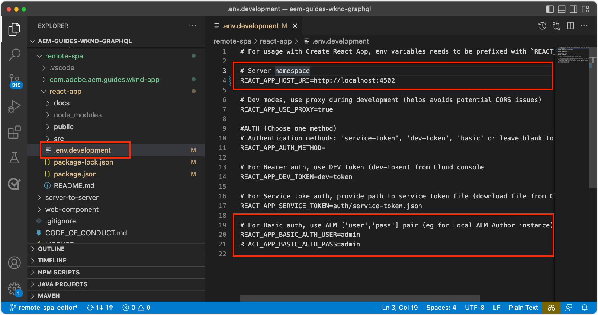

# Bootstrap del SPA remoto para SPA Editor

Para que las áreas editables se puedan agregar al SPA remoto, debe arrancar con el SDK de JavaScript del Editor de AEM SPA y otras configuraciones.


## Descargar la fuente de la aplicación WKND

Si aún no lo ha hecho, descargue el código fuente de la aplicación WKND de Github.com y cambie la rama que contiene los cambios a la SPA realizada en este tutorial.

```
$ mkdir -p ~/Code/wknd-app
$ cd ~/Code/wknd-app
$ git clone --branch feature/spa-editor https://github.com/adobe/aem-guides-wknd-graphql.git
$ cd aem-guides-wknd-graphql
```

## Revisar AEM dependencias SPA SDK npm del Editor JS

En primer lugar, revise AEM dependencias npm SPA del proyecto React.

+ [`@adobe/aem-spa-page-model-manager`](https://github.com/adobe/aem-spa-page-model-manager) : proporciona la API para recuperar contenido de AEM.
+ [`@adobe/aem-spa-component-mapping`](https://github.com/adobe/aem-spa-component-mapping) : proporciona la API que asigna AEM contenido a SPA componentes.
+ [`@adobe/aem-react-editable-components`](https://github.com/adobe/aem-react-editable-components) : proporciona una API para crear componentes de SPA personalizados y proporciona implementaciones de uso común como `AEMPage` Reaccione el componente.
+ [`@adobe/aem-core-components-react-base`](https://github.com/adobe/aem-react-core-wcm-components-base) : proporciona un conjunto de componentes React listos para usar que se integran perfectamente con los componentes principales de WCM AEM y son independientes de SPA Editor. Principalmente incluyen componentes de contenido como:
   + Título
   + Texto
   + Rutas de exploración
   + Y así sucesivamente.
+ [`@adobe/aem-core-components-react-spa`](https://github.com/adobe/aem-react-core-wcm-components-spa) : proporciona un conjunto de componentes React listos para usar que se integran perfectamente con los componentes principales de WCM de AEM y requieren SPA editor. Contienen principalmente componentes que contienen componentes de contenido de `@adobe/aem-core-components-react-base`, como:
   + Contenedor
   + Carrusel
   + y así sucesivamente.

## Revisar SPA variables de entorno

Hay que exponer varias variables de entorno al SPA remoto para que sepa cómo interactuar con AEM.

1. Abra el proyecto SPA remoto en `~/Code/wknd-app/aem-guides-wknd-graphql/react-app` en su IDE
1. Abra el archivo `.env.development`
1. En el archivo , preste especial atención a las claves:

   ```
   REACT_APP_HOST_URI=http://localhost:4502
   
   REACT_APP_USE_PROXY=true
   
   REACT_APP_AUTH_METHOD=basic
   
   REACT_APP_BASIC_AUTH_USER=admin
   REACT_APP_BASIC_AUTH_PASS=admin
   ```

   

   *Recuerde que las variables de entorno personalizadas en React deben tener el prefijo `REACT_APP_`.*

   + `REACT_APP_HOST_URI`: el esquema y el host del servicio de AEM al que se conecta el SPA remoto.
      + Este valor cambia en función de si el entorno de AEM (local, desarrollador, fase o producción) y el tipo de servicio de AEM (autor vs. publicación)
   + `REACT_APP_USE_PROXY`: esto evita los problemas de CORS durante el desarrollo al informar al servidor de desarrollo de reaccionar a solicitudes de AEM de proxy como `/content, /graphql, .model.json` using `http-proxy-middleware` módulo.
   + `REACT_APP_AUTH_METHOD`: método de autenticación para AEM solicitudes proporcionadas, las opciones son &quot;service-token&quot;, &quot;dev-token&quot;, &quot;basic&quot; o dejar en blanco para un caso de uso que no es de autenticación
      + Necesario para su uso con AEM Author
      + Posiblemente necesario para su uso con AEM Publish (si el contenido está protegido)
      + El desarrollo con AEM SDK admite cuentas locales mediante Basic Auth. Este es el método utilizado en este tutorial.
      + Cuando integre con AEM as a Cloud Service, utilice [token de acceso](https://experienceleague.adobe.com/docs/experience-manager-learn/getting-started-with-aem-headless/authentication/overview.html)
   + `REACT_APP_BASIC_AUTH_USER`: el AEM __username__ por el SPA para autenticarse mientras recupera AEM contenido.
   + `REACT_APP_BASIC_AUTH_PASS`: el AEM __password__ por el SPA para autenticarse mientras recupera AEM contenido.

## Integración de la API de ModelManager

Con las dependencias AEM SPA npm disponibles para la aplicación, inicialice AEM `ModelManager` en el informe `index.js` before `ReactDOM.render(...)` se invoca a .

La variable [ModelManager](https://github.com/adobe/aem-spa-page-model-manager/blob/master/src/ModelManager.ts) es responsable de conectarse a AEM para recuperar contenido editable.

1. Abra el proyecto Remote SPA en su IDE
1. Abra el archivo `src/index.js`
1. Agregar importación `ModelManager` e inicialícelo antes de la función `ReactDOM.render(..)` invocación,

   ```
   ...
   import { ModelManager } from "@adobe/aem-spa-page-model-manager";
   
   // Initialize the ModelManager before invoking ReactDOM.render(...).
   ModelManager.initializeAsync();
   
   ReactDOM.render(...);
   ```

La variable `src/index.js` debe tener el siguiente aspecto:


## Configuración de un proxy SPA interno

Al obtener contenido editable de AEM en el SPA, es mejor configurar un [proxy interno en la SPA](https://create-react-app.dev/docs/proxying-api-requests-in-development/#configuring-the-proxy-manually), que está configurado para enrutar las solicitudes adecuadas a AEM. Esto se hace mediante el uso de [http-proxy-middleware](https://www.npmjs.com/package/http-proxy-middleware) módulo npm, que ya está instalado por la aplicación base WKND GraphQL.

1. Abra el proyecto Remote SPA en su IDE
1. Abra el archivo en `src/proxy/setupProxy.spa-editor.auth.basic.js`
1. Revise el siguiente código:

   ```
   const { createProxyMiddleware } = require('http-proxy-middleware');
   const {REACT_APP_HOST_URI, REACT_APP_BASIC_AUTH_USER, REACT_APP_BASIC_AUTH_PASS } = process.env;
   
   /*
       Set up a proxy with AEM for local development
       In a production environment this proxy should be set up at the webserver level or absolute URLs should be used.
   */
   module.exports = function(app) {
   
       /**
       * Filter to check if the request should be re-routed to AEM. The paths to be re-routed at:
       * - Starts with /content (AEM content)
       * - Starts with /graphql (AEM graphQL endpoint)
       * - Ends with .model.json (AEM Content Services)
       * 
       * @param {*} path the path being requested of the SPA
       * @param {*} req the request object
       * @returns true if the SPA request should be re-routed to AEM
       */
       const toAEM = function(path, req) {
           return path.startsWith('/content') || 
               path.startsWith('/graphql') ||
               path.endsWith('.model.json')
       }
   
       /**
       * Re-writes URLs being proxied to AEM such that they can resolve to real AEM resources
       * - The "root" case of `/.model.json` are rewritten to the SPA's home page in AEM
       * - .model.json requests for /adventure:xxx routes are rewritten to their corresponding adventure page under /content/wknd-app/us/en/home/adventure/ 
       * 
       * @param {*} path the path being requested of the SPA
       * @param {*} req the request object
       * @returns returns a re-written path, or nothing to use the @param path
       */
       const pathRewriteToAEM = function (path, req) { 
           if (path === '/.model.json') {
               return '/content/wknd-app/us/en/home.model.json';
           } else if (path.startsWith('/adventure:') && path.endsWith('.model.json')) {
               return '/content/wknd-app/us/en/home/adventure/' + path.split('/').pop();
           }    
       }
   
       /**
       * Register the proxy middleware using the toAEM filter and pathRewriteToAEM rewriter 
       */
       app.use(
           createProxyMiddleware(
               toAEM, // Only route the configured requests to AEM
               {
                   target: REACT_APP_HOST_URI,
                   changeOrigin: true,
                   // Pass in credentials when developing against an Author environment
                   auth: REACT_APP_AUTHORIZATION,
                   pathRewrite: pathRewriteToAEM // Rewrite SPA paths being sent to AEM
               }
           )
       );
   
       /**
       * Enable CORS on requests from the SPA to AEM
       * 
       * If this rule is not in place, CORS errors will occur when running the SPA on http://localhost:3000
       */
       app.use((req, res, next) => {
           res.header("Access-Control-Allow-Origin", REACT_APP_HOST_URI);
           next();
       });
   };
   ```

   La variable `setupProxy.spa-editor.auth.basic.js` debe tener el siguiente aspecto:

   

   Esta configuración de proxy hace dos cosas principales:

   1. Solicitudes específicas de proxies realizadas a la SPA, `http://localhost:3000` a AEM `http://localhost:4502`
      + Solo reemplaza a las solicitudes cuyas rutas coinciden con patrones que indican que deben ser servidas por AEM, tal como se define en `toAEM(path, req)`.
      + Reescribe SPA rutas a sus páginas de AEM de contraparte, tal como se define en `pathRewriteToAEM(path, req)`
   1. Agrega encabezados CORS a todas las solicitudes para permitir el acceso a AEM contenido, tal como se define en `res.header("Access-Control-Allow-Origin", REACT_APP_HOST_URI);`
      + Si no se agrega esto, se producen errores CORS al cargar AEM contenido en el SPA.

1. Abra el archivo `src/setupProxy.js`
1. Revise la línea que señala a la variable `setupProxy.spa-editor.auth.basic` archivo de configuración proxy:

   ```
   ...
   case BASIC:
   // Use user/pass for local development with Local Author Env
   return require('./proxy/setupProxy.spa-editor.auth.basic');
   ...
   ```

   La variable `setupProxy.js` debe tener el siguiente aspecto:

   

Tenga en cuenta que cualquier cambio en la variable `src/setupProxy.js` o los archivos a los que se hace referencia requieren un reinicio del SPA.

## Recurso de SPA estático

Los recursos SPA estáticos, como el logotipo WKND y los gráficos de carga, deben tener sus URL src actualizadas para obligarlos a cargarse desde el host Remote SPA. Si es relativo a la izquierda, cuando el SPA se carga en SPA Editor para la creación, estas direcciones URL utilizan de forma predeterminada AEM host en lugar de la SPA, lo que da como resultado 404 solicitudes, como se ilustra en la imagen siguiente.


Para resolver este problema, haga que un recurso estático alojado por el SPA remoto utilice rutas absolutas que incluyan el origen SPA remoto.

1. Abra el proyecto SPA en su IDE
1. Abra el archivo de variables de entorno de SPA `src/.env.development` y añada una variable para el URI público SPA:

   ```
   ...
   # The base URI the SPA is accessed from
   REACT_APP_PUBLIC_URI=http://localhost:3000
   ```

   _Al implementar en AEM as a Cloud Service, debe hacer lo mismo para el `.env` archivos._

1. Abra el archivo `src/App.js`
1. Importe el URI público SPA desde las variables de entorno de SPA

   ```
   const {  REACT_APP_PUBLIC_URI } = process.env;
   
   function App() { ... }
   ```

1. Prefijo del logotipo de WKND `` con `REACT_APP_PUBLIC_URI` para forzar la resolución contra el SPA.

   ```
   
   ```

1. Haga lo mismo para cargar la imagen en `src/components/Loading.js`

   ```
   const { REACT_APP_PUBLIC_URI } = process.env;
   
   class Loading extends Component {
   
       render() {
           return (<div className="loading">
               
           </div>);
       }
   }
   ```

1. Y para el __dos instancias__ del botón de retroceso en `src/components/AdventureDetails.js`

   ```
   const { REACT_APP_PUBLIC_URI } = process.env;
   
   function AdventureDetail(props) {
       ...
       render() {
           
       }
   }
   ```

La variable `App.js`, `Loading.js`y `AdventureDetails.js` Los archivos deben tener el siguiente aspecto:


## Cuadrícula AEM

Para admitir SPA modo de diseño del Editor para áreas editables en el SPA, debemos integrar AEM CSS de cuadrícula interactiva en el SPA. No se preocupe: este sistema de cuadrícula solo se aplica a los contenedores editables, y puede utilizar el sistema de cuadrícula que desee para dirigir el diseño del resto de la SPA.

Agregue los archivos SCSS de cuadrícula AEM interactiva a la SPA.

1. Abra el proyecto SPA en su IDE
1. Descargue y copie los dos archivos siguientes en `src/styles`
   + [_grid.scss](./assets/spa-bootstrap/_grid.scss)
      + Generador SCSS de cuadrícula AEM interactiva
   + [_grid-init.scss](./assets/spa-bootstrap/_grid-init.scss)
      + Invocaciones `_grid.scss` uso de puntos de interrupción específicos SPA (escritorio y móvil) y columnas (12).
1. Apertura `src/App.scss` e importar `./styles/grid-init.scss`

   ```
   ...
   @import './styles/grid-init';
   ...
   ```

La variable `_grid.scss` y `_grid-init.scss` Los archivos deben tener el siguiente aspecto:


Ahora el SPA incluye el CSS necesario para admitir AEM modo de diseño para los componentes añadidos a un contenedor de AEM.

## Inicie la SPA

Ahora que el SPA está arrancado para la integración con AEM, vamos a ejecutar el SPA y ver cómo se ve!

1. En la línea de comandos, vaya a la raíz del proyecto de SPA
1. Inicie la SPA utilizando los comandos normales (si aún no lo ha hecho)

   ```
   $ cd ~/Code/wknd-app/aem-guides-wknd-graphql/react-app
   $ npm install 
   $ npm run start
   ```

1. Busque la SPA en [http://localhost:3000](http://localhost:3000). ¡Todo debería estar bien!


## Abra la SPA en AEM Editor SPA

Con el SPA en ejecución [http://localhost:3000](http://localhost:3000), vamos a abrirlo con AEM editor SPA. No hay nada editable en la SPA todavía, esto solo valida la SPA en AEM.

1. Iniciar sesión en AEM Author
1. Vaya a __Sites > Aplicación WKND > us > es__
1. Seleccione el __Página principal de la aplicación WKND__ y toque __Editar__ y aparece el SPA.

   

1. Cambie a __Vista previa__ uso del conmutador de modo en la parte superior derecha
1. Haga clic alrededor del SPA

   

## Felicitaciones!

Ha arrancado el SPA remoto para que sea compatible con SPA editor. Ahora sabe cómo:

+ Agregue las dependencias npm del SDK de SPA Editor JS de AEM al proyecto de SPA
+ Configuración de las variables de entorno de SPA
+ Integración de la API de ModelManager con el SPA
+ Configure un proxy interno para la SPA de modo que enruta las solicitudes de contenido apropiadas a AEM
+ Solución de problemas con recursos de SPA estáticos que se resuelven en el contexto de SPA Editor
+ Agregar AEM CSS de cuadrícula interactiva para admitir el diseño en contenedores editables AEM

## Siguientes pasos

Ahora que hemos alcanzado una línea de base de compatibilidad con AEM Editor SPA, podemos empezar a introducir áreas editables. Primero vemos cómo colocar un [componente editable fijo](./spa-fixed-component.md) en el SPA.
