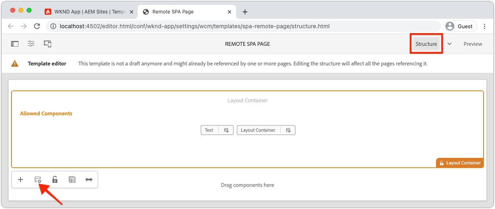

# Componentes de contenedor editables

[Los ](./spa-fixed-component.md) componentes fijos proporcionan cierta flexibilidad para la creación SPA contenido, aunque este enfoque es rígido y requiere que los desarrolladores definan la composición exacta del contenido editable. Para que los autores puedan crear experiencias excepcionales, SPA Editor admite el uso de componentes de contenedor en el SPA. Los componentes de contenedor permiten a los autores arrastrar y soltar los componentes permitidos en el contenedor y crearlos, como pueden en la creación tradicional de AEM Sites.


En este capítulo, agregaremos un contenedor editable a la vista de inicio para que los autores puedan componer y diseñar experiencias de contenido enriquecido utilizando AEM componentes principales React directamente en el SPA.

## Actualizar la aplicación WKND

Para añadir un componente contenedor a la vista Inicio:

+ Importar el componente ResponsiveGrid del componente React Editable de AEM
+ Importar y registrar AEM componentes principales de React (texto e imagen) para utilizarlos en el componente contenedor

### Importar en el componente contenedor de cuadrícula interactiva

Para colocar un área editable en la vista Inicio, debemos:

1. Importar el componente ResponsiveGrid desde `@adobe/aem-react-editable-components`
1. Regístrela mediante `withMappable` para que los desarrolladores puedan colocarla en el SPA
1. Además, regístrese con `MapTo` para que se pueda reutilizar en otros componentes de contenedor y anidar contenedores de forma eficaz.

Para ello:

1. Abra el proyecto SPA en su IDE
1. Crear un componente React en `src/components/aem/AEMResponsiveGrid.js`
1. Agregue el siguiente código a `AEMResponsiveGrid.js`

   ```
   // Import the withMappable API provided bu the AEM SPA Editor JS SDK
   import { withMappable, MapTo } from '@adobe/aem-react-editable-components';
   
   // Import the base ResponsiveGrid component
   import { ResponsiveGrid } from "@adobe/aem-react-editable-components";
   
   // The sling:resourceType for which this Core Component is registered with in AEM
   const RESOURCE_TYPE = "wcm/foundation/components/responsivegrid";
   
   // Create an EditConfig to allow the AEM SPA Editor to properly render the component in the Editor's context
   const EditConfig = {
       emptyLabel: "Layout Container",  // The component placeholder in AEM SPA Editor
       isEmpty: function(props) { 
           return props.cqItemsOrder == null || props.cqItemsOrder.length === 0;
       },                              // The function to determine if this component has been authored
       resourceType: RESOURCE_TYPE     // The sling:resourceType this SPA component is mapped to
   };
   
   // MapTo allows the AEM SPA Editor JS SDK to dynamically render components added to SPA Editor Containers
   MapTo(RESOURCE_TYPE)(ResponsiveGrid, EditConfig);
   
   // withMappable allows the component to be hardcoded into the SPA; <AEMResponsiveGrid .../>
   const AEMResponsiveGrid = withMappable(ResponsiveGrid, EditConfig);
   
   export default AEMResponsiveGrid;
   ```

El código es similar a `AEMTitle.js` que [importó el componente Título de los componentes principales de alcance de AEM](./spa-fixed-component.md).


El archivo `AEMResponsiveGrid.js` debería tener el siguiente aspecto:


### Uso del componente SPA AEMResponsiveGrid

Ahora que AEM componente ResponsiveGrid está registrado en y disponible para su uso dentro del SPA, podemos colocarlo en la vista Inicio.

1. Abra y edite `react-app/src/App.js`
1. Importe el componente `AEMResponsiveGrid` y colóquelo encima del componente `<AEMTitle ...>`.
1. Establezca los siguientes atributos en el componente `<AEMResponsiveGrid...>`
   + `pagePath = '/content/wknd-app/us/en/home'`
   + `itemPath = 'root/responsivegrid'`

   Esto indica a este `AEMResponsiveGrid` componente que recupere su contenido del recurso de AEM:

   + `/content/wknd-app/us/en/home/jcr:content/root/responsivegrid`

   El `itemPath` se asigna al nodo `responsivegrid` definido en la plantilla de AEM `Remote SPA Page` y se crea automáticamente en las nuevas páginas de AEM creadas a partir de la plantilla de AEM `Remote SPA Page`.

   Actualice `App.js` para añadir el componente `<AEMResponsiveGrid...>`.

   ```
   ...
   import AEMResponsiveGrid from './components/aem/AEMResponsiveGrid';
   ...
   
   function Home() {
   return (
       <div className="Home">
           <AEMResponsiveGrid
               pagePath='/content/wknd-app/us/en/home' 
               itemPath='root/responsivegrid'/>
   
           <AEMTitle
               pagePath='/content/wknd-app/us/en/home' 
               itemPath='title'/>
           <Adventures />
       </div>
   );
   }
   ```

El archivo `Apps.js` debería tener el siguiente aspecto:


## Crear componentes editables

Para obtener el efecto completo de la experiencia de creación flexible, los contenedores se proporcionan en SPA Editor. Ya hemos creado un componente Título editable, pero vamos a hacer algunos más que permitan a los autores utilizar Componentes principales de Texto e Imagen AEM WCM en el componente contenedor recién agregado.

### Componente de texto

1. Abra el proyecto SPA en su IDE
1. Crear un componente React en `src/components/aem/AEMText.js`
1. Agregue el siguiente código a `AEMText.js`

   ```
   import { withMappable, MapTo } from '@adobe/aem-react-editable-components';
   import { TextV2, TextV2IsEmptyFn } from "@adobe/aem-core-components-react-base";
   
   const RESOURCE_TYPE = "wknd-app/components/text";
   
   const EditConfig = {    
       emptyLabel: "Text",
       isEmpty: TextV2IsEmptyFn,
       resourceType: RESOURCE_TYPE
   };
   
   MapTo(RESOURCE_TYPE)(TextV2, EditConfig);
   
   const AEMText = withMappable(TextV2, EditConfig);
   
   export default AEMText;
   ```

El archivo `AEMText.js` debería tener el siguiente aspecto:


### Componente de imagen

1. Abra el proyecto SPA en su IDE
1. Crear un componente React en `src/components/aem/AEMImage.js`
1. Agregue el siguiente código a `AEMImage.js`

   ```
   import { withMappable, MapTo } from '@adobe/aem-react-editable-components';
   import { ImageV2, ImageV2IsEmptyFn } from "@adobe/aem-core-components-react-base";
   
   const RESOURCE_TYPE = "wknd-app/components/image";
   
   const EditConfig = {    
       emptyLabel: "Image",
       isEmpty: ImageV2IsEmptyFn,
       resourceType: RESOURCE_TYPE
   };
   
   MapTo(RESOURCE_TYPE)(ImageV2, EditConfig);
   
   const AEMImage = withMappable(ImageV2, EditConfig);
   
   export default AEMImage;
   ```

1. Cree un archivo SCSS `src/components/aem/AEMImage.scss` que proporcione estilos personalizados para `AEMImage.scss`. Estos estilos se dirigen a las clases CSS de notación BEM del componente principal React de AEM.
1. Agregue el siguiente SCSS a `AEMImage.scss`

   ```
   .cmp-image__image {
       margin: 1rem 0;
       width: 100%;
       border: 0;
    }
   ```

1. Importar `AEMImage.scss` en `AEMImage.js`

   ```
   ...
   import './AEMImage.scss';
   ...
   ```

Los `AEMImage.js` y `AEMImage.scss` deben tener el siguiente aspecto:


### Importación de componentes editables

Se hace referencia a los componentes de SPA `AEMText` y `AEMImage` recién creados en la SPA y se crean instancias de forma dinámica en función del JSON devuelto por AEM. Para asegurarse de que estos componentes están disponibles para la SPA, cree instrucciones de importación para ellos en `App.js`

1. Abra el proyecto SPA en su IDE
1. Abra el archivo `src/App.js`
1. Agregar instrucciones de importación para `AEMText` y `AEMImage`

   ```
   ...
   import AEMText from './components/aem/AEMText';
   import AEMImage from './components/aem/AEMImage';
   ...
   ```


El resultado debería ser como:


Si estas importaciones se _no_ agregan, el código `AEMText` y `AEMImage` no serán invocados por SPA y, por lo tanto, los componentes no se registran en los tipos de recurso proporcionados.

## Configuración del contenedor en AEM

AEM componentes de contenedor utilizan políticas para dictar sus componentes permitidos. Esta es una configuración crítica cuando se utiliza SPA Editor, ya que solo AEM componentes principales de WCM que tienen asignados SPA componentes equivalentes pueden procesarlos los SPA. Asegúrese de que solo están permitidos los componentes que hemos proporcionado SPA implementaciones de :

+ `AEMTitle` asignado a  `wknd-app/components/title`
+ `AEMText` asignado a  `wknd-app/components/text`
+ `AEMImage` asignado a  `wknd-app/components/image`

Para configurar el contenedor de cuadrícula de respuesta de la plantilla Página de SPA remota:

1. Iniciar sesión en AEM Author
1. Vaya a __Herramientas > General > Plantillas > Aplicación WKND__
1. Editar __Informe SPA página__

   

1. Seleccione __Structure__ en el conmutador de modo en la parte superior derecha
1. Toque para seleccionar el __Contenedor de diseño__
1. Pulse el icono __Policy__ en la barra emergente

   

1. A la derecha, en la pestaña __Componentes permitidos__, expanda __APLICACIÓN WKND - CONTENT__
1. Asegúrese de que solo están seleccionadas las siguientes opciones:
   + Imagen
   + Texto
   + Título

   

1. Puntee __Listo__

## Creación del contenedor en AEM

Con el SPA actualizado para incrustar `<AEMResponsiveGrid...>`, los contenedores para tres componentes principales de React AEM (`AEMTitle`, `AEMText` y `AEMImage`) y AEM se actualiza con una directiva de Plantilla coincidente, podemos empezar a crear contenido en el componente contenedor.

1. Iniciar sesión en AEM Author
1. Vaya a __Sites > WKND App__
1. Pulse __Inicio__ y seleccione __Editar__ en la barra de acciones superior
   + Aparece un componente Texto &quot;Hola a todos&quot;, ya que se agregó automáticamente al generar el proyecto a partir del tipo de archivo del proyecto AEM
1. Seleccione __Editar__ en el selector de modo en la parte superior derecha del Editor de páginas
1. Busque el área editable __Contenedor de diseño__ debajo del título
1. Abra la __barra lateral del Editor de páginas__ y seleccione la __Vista Componentes__
1. Arrastre los siguientes componentes al __Contenedor de diseño__
   + Imagen
   + Título
1. Arrastre los componentes para reordenarlos en el siguiente orden:
   1. Título
   1. Imagen
   1. Texto
1. ____ Autorización del componente  ____ Titlecomponent
   1. Pulse el componente Título y pulse el icono __llave inglesa__ para __editar__ el componente Título
   1. Añada el siguiente texto:
      + Título: __El verano llega, aprovechémoslo al máximo.__
      + Tipo: __H1__
   1. Puntee __Listo__
1. ____ Autorizar el componente de  ____ imagen
   1. Arrastre una imagen desde la barra lateral (después de cambiar a la vista Recursos) del componente Imagen
   1. Pulse el componente Imagen y pulse el icono __llave inglesa__ para editar
   1. Marque la casilla de verificación __La imagen es decorativa__
   1. Puntee __Listo__
1. ____ Autorización del  ____ componente Texto
   1. Edite el componente Texto tocando el componente Texto y el icono __llave inglesa__
   1. Añada el siguiente texto:
      + _En este momento, puede obtener un 15% de todas las aventuras de una semana y un 20% de descuento en todas las aventuras de dos semanas o más. En el cierre de compra, simplemente agregue el código de campaña SUMERISCOMING para obtener sus descuentos._
   1. Puntee __Listo__

1. Los componentes ahora se crean, pero se apilan verticalmente.

   

   Utilice AEM modo Diseño para que podamos ajustar el tamaño y el diseño de los componentes.

1. Cambie al __Modo de diseño__ utilizando el selector de modo en la parte superior derecha
1. ____ Cambiar el tamaño de los componentes Imagen y texto, de modo que estén uno junto al otro
   + ____ El componente de imagen debe tener una anchura de  __8 columnas__
   + ____ El componente Texto debe tener una anchura de  __3 columnas__

   

1. ____ Previsualizar los cambios en AEM Editor de páginas
1. Actualice la aplicación WKND que se ejecuta localmente en [http://localhost:3000](http://localhost:3000) para ver los cambios creados.

   


## Felicitaciones!

Ha agregado un componente contenedor que permite que los autores añadan componentes editables a la aplicación WKND. Ahora sabe cómo:

+ Utilice el componente AEM React Editable Component&#39;s ResponsiveGrid en el SPA
+ Registre AEM componentes principales de React (texto e imagen) para utilizarlos en la SPA a través del componente contenedor
+ Configure la plantilla Página de SPA remota para permitir los componentes principales habilitados para SPA
+ Añadir componentes editables al componente contenedor
+ Creación y diseño de componentes en SPA Editor

## Pasos siguientes

El siguiente paso será utilizar esta misma técnica para [añadir un componente editable a una ruta de Detalles de aventura](./spa-dynamic-routes.md) en la SPA.
