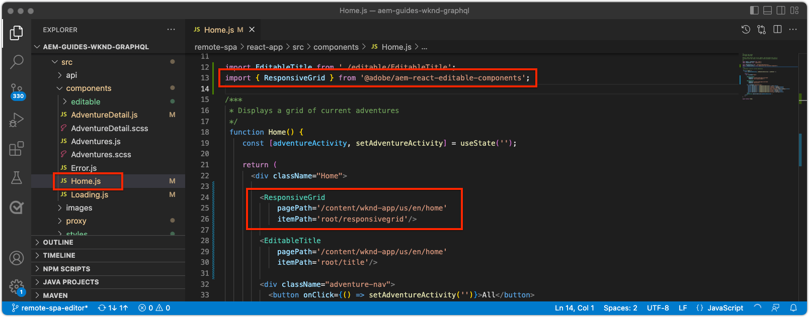
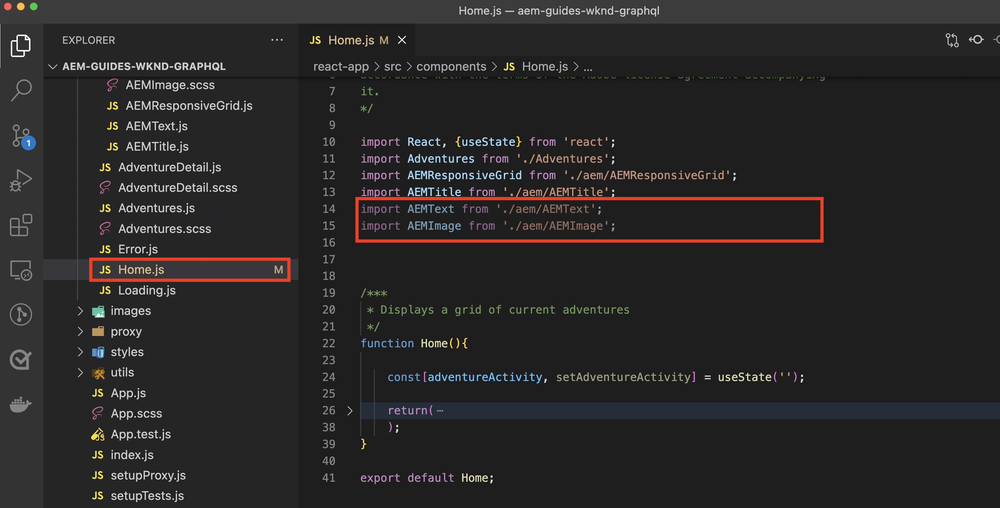
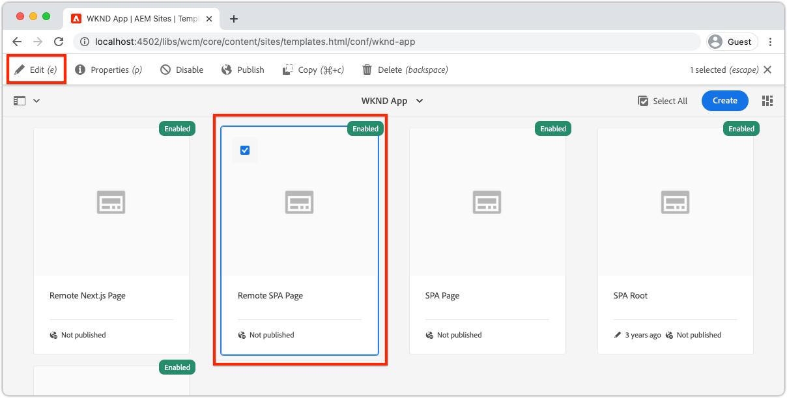
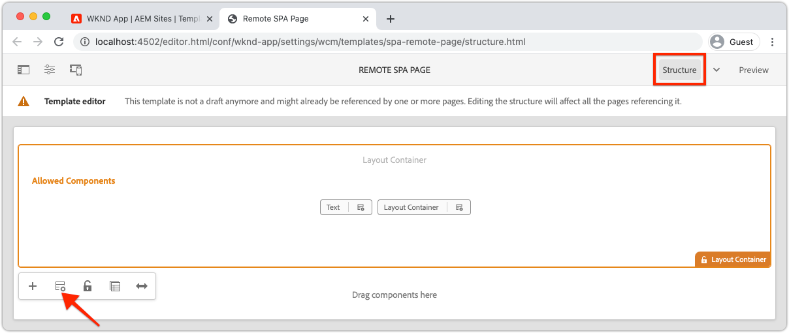
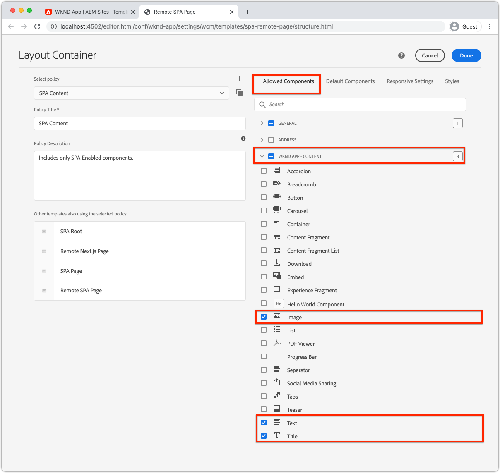
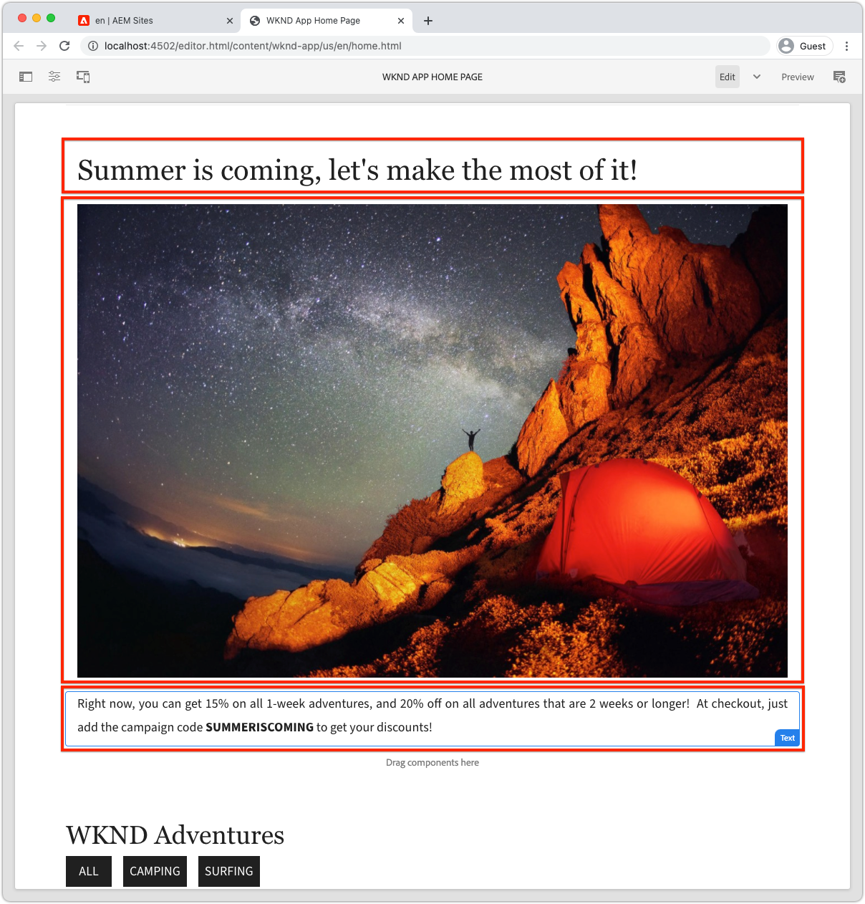

# Componentes de contenedor editables

{{spa-editor-deprecation}}

[Los componentes fijos](./spa-fixed-component.md) proporcionan cierta flexibilidad para la creación de contenido de SPA; sin embargo, este enfoque es rígido y requiere que los desarrolladores definan la composición exacta del contenido editable. Para admitir la creación de experiencias excepcionales por parte de los autores, el Editor de SPA admite el uso de componentes de contenedor en la SPA. Los componentes de contenedor permiten a los autores arrastrar y soltar los componentes permitidos en el contenedor y crearlos, tal como lo pueden hacer en la creación tradicional de AEM Sites.


En este capítulo, agregamos un contenedor editable a la vista de inicio que permite a los autores componer y diseñar experiencias de contenido enriquecido mediante componentes de React editables directamente en la SPA.

## Actualización de la aplicación WKND

Para agregar un componente de contenedor a la vista Inicio:

* Import the AEM React Editable Component&#39;s `ResponsiveGrid` component
* Importar y registrar componentes React editables personalizados (texto e imagen) para utilizarlos en el componente Cuadrícula interactiva

### Uso del componente Cuadrícula interactiva

Para agregar un área editable a la vista Inicio:

1. Abrir y editar `react-app/src/components/Home.js`
1. Importar el componente `ResponsiveGrid` desde `@adobe/aem-react-editable-components` y agregarlo al componente `Home`.
1. Establezca los siguientes atributos en el componente `<ResponsiveGrid...>`
   1. `pagePath = '/content/wknd-app/us/en/home'`
   1. `itemPath = 'root/responsivegrid'`

   Esto indica al componente `ResponsiveGrid` que recupere su contenido del recurso de AEM:

   1. `/content/wknd-app/us/en/home/jcr:content/root/responsivegrid`

   `itemPath` se asigna al nodo `responsivegrid` definido en la plantilla de AEM `Remote SPA Page` y se crea automáticamente en las nuevas páginas de AEM creadas a partir de la plantilla de AEM `Remote SPA Page`.

   Update `Home.js` to add the `<ResponsiveGrid...>` component.

   ```javascript
   ...
   import { ResponsiveGrid } from '@adobe/aem-react-editable-components';
   ...
   
   function Home() {
       return (
           <div className="Home">
               <ResponsiveGrid
                   pagePath='/content/wknd-app/us/en/home' 
                   itemPath='root/responsivegrid'/>
   
               <EditableTitle
                   pagePath='/content/wknd-app/us/en/home' 
                   itemPath='title'/>
   
               <Adventures />
           </div>
       );
   }
   ```

El archivo `Home.js` debe tener el siguiente aspecto:



## Create editable components

Para obtener el efecto completo de la flexibilidad que ofrecen los contenedores de experiencia de creación en el Editor de SPA. Ya hemos creado un componente Título editable, pero vamos a hacer algunos más que permitan a los autores utilizar componentes Texto e Imagen editables en el componente Cuadrícula interactiva recién agregado.

Los nuevos componentes Texto editable y Reacción de imagen se crean utilizando el patrón de definición de componente editable exportado en [componentes fijos editables](./spa-fixed-component.md).

### Componente de texto editable

1. Abra el proyecto SPA en su IDE
1. Crear un componente de React en `src/components/editable/core/Text.js`
1. Agregar el siguiente código a `Text.js`

   ```javascript
   import React from 'react'
   
   const TextPlain = (props) => <div className={props.baseCssClass}><p className="cmp-text__paragraph">{props.text}</p></div>;
   const TextRich = (props) => {
   const text = props.text;
   const id = (props.id) ? props.id : (props.cqPath ? props.cqPath.substr(props.cqPath.lastIndexOf('/') + 1) : "");
       return <div className={props.baseCssClass} id={id} data-rte-editelement dangerouslySetInnerHTML={{ __html: text }} />
   };
   
   export const Text = (props) => {
       if (!props.baseCssClass) {
           props.baseCssClass = 'cmp-text'
       }
   
       const { richText = false } = props
   
       return richText ? <TextRich {...props} /> : <TextPlain {...props} />
       }
   
       export function textIsEmpty(props) {
       return props.text == null || props.text.length === 0;
   }
   ```

1. Crear un componente React editable en `src/components/editable/EditableText.js`
1. Agregar el siguiente código a `EditableText.js`

   ```javascript
   import React from 'react'
   import { EditableComponent, MapTo } from '@adobe/aem-react-editable-components';
   import { Text, textIsEmpty } from "./core/Text";
   import { withConditionalPlaceHolder } from "./core/util/withConditionalPlaceholder";
   import { withStandardBaseCssClass } from "./core/util/withStandardBaseCssClass";
   
   const RESOURCE_TYPE = "wknd-app/components/text";
   
   const EditConfig = {
       emptyLabel: "Text",
       isEmpty: textIsEmpty,
       resourceType: RESOURCE_TYPE
   };
   
   export const WrappedText = (props) => {
       const Wrapped = withConditionalPlaceHolder(withStandardBaseCssClass(Text, "cmp-text"), textIsEmpty, "Text V2")
       return <Wrapped {...props} />
   };
   
   const EditableText = (props) => <EditableComponent config={EditConfig} {...props}><WrappedText /></EditableComponent>
   
   MapTo(RESOURCE_TYPE)(EditableText);
   
   export default EditableText;
   ```

La implementación del componente Texto editable debería tener un aspecto similar al siguiente:


### Componente de imagen

1. Abra el proyecto SPA en su IDE
1. Crear un componente de React en `src/components/editable/core/Image.js`
1. Agregar el siguiente código a `Image.js`

   ```javascript
   import React from 'react'
   import { RoutedLink } from "./RoutedLink";
   
   export const imageIsEmpty = (props) => (!props.src) || props.src.trim().length === 0
   
   const ImageInnerContents = (props) => {
   return (<>
       
       {
           !!(props.title) && <span className={props.baseCssClass + '__title'} itemProp="caption">{props.title}</span>
       }
       {
           props.displayPopupTitle && (!!props.title) && <meta itemProp="caption" content={props.title} />
       }
       </>);
   };
   
   const ImageContents = (props) => {
       if (props.link && props.link.trim().length > 0) {
           return (
           <RoutedLink className={props.baseCssClass + '__link'} isRouted={props.routed} to={props.link}>
               <ImageInnerContents {...props} />
           </RoutedLink>
           )
       }
       return <ImageInnerContents {...props} />
   };
   
   export const Image = (props) => {
       if (!props.baseCssClass) {
           props.baseCssClass = 'cmp-image'
       }
   
       const { isInEditor = false } = props;
       const cssClassName = (isInEditor) ? props.baseCssClass + ' cq-dd-image' : props.baseCssClass;
   
       return (
           <div className={cssClassName}>
               <ImageContents {...props} />
           </div>
       )
   };
   ```

1. Crear un componente React editable en `src/components/editable/EditableImage.js`
1. Agregar el siguiente código a `EditableImage.js`

```javascript
import { EditableComponent, MapTo } from '@adobe/aem-react-editable-components';
import { Image, imageIsEmpty } from "./core/Image";
import React from 'react'

import { withConditionalPlaceHolder } from "./core/util/withConditionalPlaceholder";
import { withStandardBaseCssClass } from "./core/util/withStandardBaseCssClass";

const RESOURCE_TYPE = "wknd-app/components/image";

const EditConfig = {
    emptyLabel: "Image",
    isEmpty: imageIsEmpty,
    resourceType: RESOURCE_TYPE
};

const WrappedImage = (props) => {
    const Wrapped = withConditionalPlaceHolder(withStandardBaseCssClass(Image, "cmp-image"), imageIsEmpty, "Image V2");
    return <Wrapped {...props}/>
}

const EditableImage = (props) => <EditableComponent config={EditConfig} {...props}><WrappedImage /></EditableComponent>

MapTo(RESOURCE_TYPE)(EditableImage);

export default EditableImage;
```


1. Cree un archivo SCSS `src/components/editable/EditableImage.scss` que proporcione estilos personalizados para `EditableImage.scss`. Estos estilos se dirigen a las clases CSS del componente React editable.
1. Agregar el SCSS siguiente a `EditableImage.scss`

   ```css
   .cmp-image__image {
       margin: 1rem 0;
       width: 100%;
       border: 0;
    }
   ```

1. Importar `EditableImage.scss` en `EditableImage.js`

   ```javascript
   ...
   import './EditableImage.scss';
   ...
   ```

La implementación del componente Imagen editable debe tener un aspecto similar al siguiente:


### Importar los componentes editables

Se hace referencia en la SPA a los componentes `EditableText` y `EditableImage` React recién creados y se crean instancias de forma dinámica en función del JSON devuelto por AEM. Para asegurarse de que estos componentes están disponibles para la SPA, cree instrucciones de importación para ellos en `Home.js`

1. Abra el proyecto SPA en su IDE
1. Abra el archivo `src/Home.js`
1. Agregar instrucciones de importación para `AEMText` y `AEMImage`

   ```javascript
   ...
   // The following need to be imported, so that MapTo is run for the components
   import EditableText from './editable/EditableText';
   import EditableImage from './editable/EditableImage';
   ...
   ```

El resultado debería ser similar al siguiente:



Si se agregan estas importaciones _no_, la SPA no invocará el código `EditableText` y `EditableImage` y, por lo tanto, los componentes no están asignados a los tipos de recursos proporcionados.

## Configuración del contenedor en AEM

Los componentes de contenedor de AEM utilizan directivas para dictar los componentes permitidos. Esta configuración es crítica al utilizar el Editor de SPA, ya que solo los componentes de AEM que tienen equivalentes de componentes de SPA asignados se pueden procesar mediante la SPA. Asegúrese de que solo se permiten los componentes para los que hemos proporcionado implementaciones de SPA:

* `EditableTitle` se asignó a `wknd-app/components/title`
* `EditableText` se asignó a `wknd-app/components/text`
* `EditableImage` se asignó a `wknd-app/components/image`

Para configurar el contenedor de cuadrícula adaptable de la plantilla de la SPA remota:

1. Iniciar sesión en AEM Author
1. Vaya a __Herramientas > General > Plantillas > Aplicación WKND__
1. Editar __página de SPA de informe__

   

1. Seleccione __Estructura__ en el conmutador de modo en la parte superior derecha
1. Pulse para seleccionar __Contenedor de diseño__
1. Pulse el icono __Directiva__ en la barra emergente

   

1. A la derecha, en la ficha __Componentes permitidos__, expanda __WKND APP - CONTENT__
1. Asegúrese de que solo están seleccionadas las siguientes opciones:
   1. Imagen
   1. Texto
   1. Título

   

1. Pulse __Listo__

## Creación del contenedor en AEM

Después de actualizar el SPA para incrustar `<ResponsiveGrid...>`, los contenedores de tres componentes React editables (`EditableTitle`, `EditableText` y `EditableImage`) y de actualizar AEM con una directiva de plantilla coincidente, se puede empezar a crear contenido en el componente contenedor.

1. Log in to AEM Author
1. Navigate to __Sites > WKND App__
1. Tap __Home__ and select __Edit__ from the top action bar
   1. A &quot;Hello World&quot; Text component displays, as this was automatically added when generating the project from the AEM Project archetype
1. Select __Edit__ from the mode-selector in the top right of the Page Editor
1. Locate the __Layout Container__ editable area beneath the Title
1. Open the __Page Editor&#39;s side bar__, and select the __Components view__
1. Drag the following components into the __Layout Container__
   1. Imagen
   1. Título
1. Drag the components to reorder them to the following order:
   1. Título
   1. Imagen
   1. Texto
1. __Author__ the __Title__ component
   1. Tap the Title component, and tap the __wrench__ icon to __edit__ the Title component
   1. Add the following text:
      1. Title: __Summer is coming, let&#39;s make the most of it!__
      1. Type: __H1__
   1. Tap __Done__
1. __Author__ the __Image__ component
   1. Drag an image in from the Side bar (after switching to the Assets view) on the Image component
   1. Tap the Image component, and tap the __wrench__ icon to edit
   1. Check the __Image is decorative__ checkbox
   1. Tap __Done__
1. __Author__ the __Text__ component
   1. Edit the Text component by tapping the Text component, and tapping the __wrench__ icon
   1. Add the following text:
      1. _Right now, you can get 15% on all 1-week adventures, and 20% off on all adventures that are 2 weeks or longer! At checkout, add the campaign code SUMMERISCOMING to get your discounts!_
   1. Tap __Done__

1. Your components are now authored, but stack vertically.

   

   Use AEM&#39;s Layout Mode to allow us to adjust the size and layout of the components.

1. Switch to __Layout Mode__ using the mode-selector in the top-right
1. __Resize__ the Image and Text components, such that  they are side by side
   1. __Image__ component should be __8 columns wide__
   1. __Text__ component should be __3 columns wide__

   

1. __Preview__ your changes in AEM Page Editor
1. Refresh the WKND App running locally on [http://localhost:3000](http://localhost:3000) to see the authored changes!

   


## Enhorabuena.

You&#39;ve added a container component that allows for editable components to be added by authors to the WKND App! You now know how to:

* Use the AEM React Editable Component&#39;s `ResponsiveGrid` component in the SPA
* Create and register editable React components (Text and Image) for use in the SPA via the container component
* Configure the Remote SPA Page template to allow the SPA-enabled components
* Add editable components to the container component
* Author and layout components in SPA Editor

## Próximos pasos

The next step uses this same technique to [add an editable component to an Adventure Details route](./spa-dynamic-routes.md) in the SPA.
