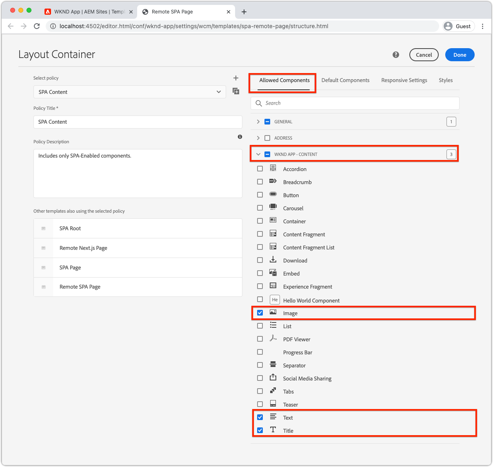

# Componentes de contenedor editables

[Componentes fijos](./spa-fixed-component.md) proporciona cierta flexibilidad para la creación SPA contenido, aunque este enfoque es rígido y requiere que los desarrolladores definan la composición exacta del contenido editable. Para que los autores puedan crear experiencias excepcionales, SPA Editor admite el uso de componentes de contenedor en el SPA. Los componentes de contenedor permiten a los autores arrastrar y soltar los componentes permitidos en el contenedor y crearlos, como pueden en la creación tradicional de AEM Sites.


En este capítulo, se añade un contenedor editable a la vista de inicio que permite a los autores componer y diseñar experiencias de contenido enriquecido utilizando componentes React editables directamente en la SPA.

## Actualizar la aplicación WKND

Para añadir un componente contenedor a la vista Inicio:

+ Importar el componente editable de React de AEM `ResponsiveGrid` componente
+ Importar y registrar componentes React editables personalizados (texto e imagen) para su uso en el componente ResponsiveGrid

### Uso del componente ResponsiveGrid

Para agregar un área editable a la vista Inicio:

1. Abra y edite `react-app/src/components/Home.js`
1. Importe el `ResponsiveGrid` componente desde `@adobe/aem-react-editable-components` y agréguelo a la variable `Home` componente.
1. Establezca los atributos siguientes en la variable `<ResponsiveGrid...>` componente
   + `pagePath = '/content/wknd-app/us/en/home'`
   + `itemPath = 'root/responsivegrid'`

   Esto indica a la `ResponsiveGrid` para recuperar su contenido del recurso de AEM:

   + `/content/wknd-app/us/en/home/jcr:content/root/responsivegrid`

   La variable `itemPath` se asigna a la variable `responsivegrid` nodo definido en la variable `Remote SPA Page` AEM plantilla y se crea automáticamente en las nuevas páginas AEM creadas a partir de la variable `Remote SPA Page` Plantilla AEM.

   Actualizar `Home.js` para agregar la variable `<ResponsiveGrid...>` componente.

   ```javascript
   ...
   import { ResponsiveGrid } from '@adobe/aem-react-editable-components';
   ...
   
   function Home() {
       return (
           <div className="Home">
               <ResponsiveGrid
                   pagePath='/content/wknd-app/us/en/home' 
                   itemPath='root/responsivegrid'/>
   
               <EditableTitle
                   pagePath='/content/wknd-app/us/en/home' 
                   itemPath='title'/>
   
               <Adventures />
           </div>
       );
   }
   ```

La variable `Home.js` debe tener el siguiente aspecto:


## Crear componentes editables

Para obtener el efecto completo de la experiencia de creación flexible, los contenedores se proporcionan en SPA Editor. Ya hemos creado un componente Título editable, pero hagamos unos cuantos más que permitan a los autores utilizar componentes de Texto e Imagen editables en el componente ResponsiveGrid recién agregado.

Los nuevos componentes de Texto editable y Reacción de imagen se crean utilizando el patrón de definición de componente editable exportado en [componentes fijos editables](./spa-fixed-component.md).

### Componente de texto editable

1. Abra el proyecto SPA en su IDE
1. Cree un componente React en `src/components/editable/core/Text.js`
1. Agregue el siguiente código a `Text.js`

   ```javascript
   import React from 'react'
   
   const TextPlain = (props) => <div className={props.baseCssClass}><p className="cmp-text__paragraph">{props.text}</p></div>;
   const TextRich = (props) => {
   const text = props.text;
   const id = (props.id) ? props.id : (props.cqPath ? props.cqPath.substr(props.cqPath.lastIndexOf('/') + 1) : "");
       return <div className={props.baseCssClass} id={id} data-rte-editelement dangerouslySetInnerHTML={{ __html: text }} />
   };
   
   export const Text = (props) => {
       if (!props.baseCssClass) {
           props.baseCssClass = 'cmp-text'
       }
   
       const { richText = false } = props
   
       return richText ? <TextRich {...props} /> : <TextPlain {...props} />
       }
   
       export function textIsEmpty(props) {
       return props.text == null || props.text.length === 0;
   }
   ```

1. Cree un componente React editable en `src/components/editable/EditableText.js`
1. Agregue el siguiente código a `EditableText.js`

   ```javascript
   import React from 'react'
   import { EditableComponent, MapTo } from '@adobe/aem-react-editable-components';
   import { Text, textIsEmpty } from "./core/Text";
   import { withConditionalPlaceHolder } from "./core/util/withConditionalPlaceholder";
   import { withStandardBaseCssClass } from "./core/util/withStandardBaseCssClass";
   
   const RESOURCE_TYPE = "wknd-app/components/text";
   
   const EditConfig = {
       emptyLabel: "Text",
       isEmpty: textIsEmpty,
       resourceType: RESOURCE_TYPE
   };
   
   export const WrappedText = (props) => {
       const Wrapped = withConditionalPlaceHolder(withStandardBaseCssClass(Text, "cmp-text"), textIsEmpty, "Text V2")
       return <Wrapped {...props} />
   };
   
   const EditableText = (props) => <EditableComponent config={EditConfig} {...props}><WrappedText /></EditableComponent>
   
   MapTo(RESOURCE_TYPE)(EditableText);
   
   export default EditableText;
   ```

La implementación editable del componente Texto debería tener el siguiente aspecto:


### Componente de imagen

1. Abra el proyecto SPA en su IDE
1. Cree un componente React en `src/components/editable/core/Image.js`
1. Agregue el siguiente código a `Image.js`

   ```javascript
   import React from 'react'
   import { RoutedLink } from "./RoutedLink";
   
   export const imageIsEmpty = (props) => (!props.src) || props.src.trim().length === 0
   
   const ImageInnerContents = (props) => {
   return (<>
       
       {
           !!(props.title) && <span className={props.baseCssClass + '__title'} itemProp="caption">{props.title}</span>
       }
       {
           props.displayPopupTitle && (!!props.title) && <meta itemProp="caption" content={props.title} />
       }
       </>);
   };
   
   const ImageContents = (props) => {
       if (props.link && props.link.trim().length > 0) {
           return (
           <RoutedLink className={props.baseCssClass + '__link'} isRouted={props.routed} to={props.link}>
               <ImageInnerContents {...props} />
           </RoutedLink>
           )
       }
       return <ImageInnerContents {...props} />
   };
   
   export const Image = (props) => {
       if (!props.baseCssClass) {
           props.baseCssClass = 'cmp-image'
       }
   
       const { isInEditor = false } = props;
       const cssClassName = (isInEditor) ? props.baseCssClass + ' cq-dd-image' : props.baseCssClass;
   
       return (
           <div className={cssClassName}>
               <ImageContents {...props} />
           </div>
       )
   };
   ```

1. Cree un componente React editable en `src/components/editable/EditableImage.js`
1. Agregue el siguiente código a `EditableImage.js`

```javascript
import { EditableComponent, MapTo } from '@adobe/aem-react-editable-components';
import { Image, imageIsEmpty } from "./core/Image";
import React from 'react'

import { withConditionalPlaceHolder } from "./core/util/withConditionalPlaceholder";
import { withStandardBaseCssClass } from "./core/util/withStandardBaseCssClass";

const RESOURCE_TYPE = "wknd-app/components/image";

const EditConfig = {
    emptyLabel: "Image",
    isEmpty: imageIsEmpty,
    resourceType: RESOURCE_TYPE
};

const WrappedImage = (props) => {
    const Wrapped = withConditionalPlaceHolder(withStandardBaseCssClass(Image, "cmp-image"), imageIsEmpty, "Image V2");
    return <Wrapped {...props}/>
}

const EditableImage = (props) => <EditableComponent config={EditConfig} {...props}><WrappedImage /></EditableComponent>

MapTo(RESOURCE_TYPE)(EditableImage);

export default EditableImage;
```


1. Creación de un archivo SCSS `src/components/editable/EditableImage.scss` que proporciona estilos personalizados para la variable `EditableImage.scss`. Estos estilos se dirigen a las clases CSS del componente React editable.
1. Agregue la siguiente SCSS a `EditableImage.scss`

   ```css
   .cmp-image__image {
       margin: 1rem 0;
       width: 100%;
       border: 0;
    }
   ```

1. Importar `EditableImage.scss` en `EditableImage.js`

   ```javascript
   ...
   import './EditableImage.scss';
   ...
   ```

La implementación editable del componente Imagen debería tener el siguiente aspecto:


### Importación de componentes editables

El recién creado `EditableText` y `EditableImage` Se hace referencia a los componentes React en la SPA y se crean instancias de ellos de forma dinámica en función del JSON devuelto por AEM. Para asegurarse de que estos componentes están disponibles para el SPA, cree instrucciones de importación para ellos en `Home.js`

1. Abra el proyecto SPA en su IDE
1. Abra el archivo `src/Home.js`
1. Agregar instrucciones de importación para `AEMText` y `AEMImage`

   ```javascript
   ...
   // The following need to be imported, so that MapTo is run for the components
   import EditableText from './editable/EditableText';
   import EditableImage from './editable/EditableImage';
   ...
   ```

El resultado debería ser como:


Si estas importaciones son _not_ se ha añadido la variable `EditableText` y `EditableImage` SPA no invoca el código y, por lo tanto, los componentes no se asignan a los tipos de recurso proporcionados.

## Configuración del contenedor en AEM

AEM componentes de contenedor utilizan políticas para dictar sus componentes permitidos. Esta es una configuración crítica cuando se utiliza SPA Editor, ya que solo AEM los componentes que tienen asignados SPA componentes equivalentes pueden procesar el SPA. Asegúrese de que solo están permitidos los componentes que hemos proporcionado SPA implementaciones de :

+ `EditableTitle` asignado a `wknd-app/components/title`
+ `EditableText` asignado a `wknd-app/components/text`
+ `EditableImage` asignado a `wknd-app/components/image`

Para configurar el contenedor de cuadrícula de respuesta de la plantilla Página de SPA remota:

1. Iniciar sesión en AEM Author
1. Vaya a __Herramientas > General > Plantillas > Aplicación WKND__
1. Editar __Página SPA informe__

   

1. Select __Estructura__ en el conmutador de modo en la parte superior derecha
1. Toque para seleccionar el __Contenedor de diseño__
1. Toque . __Política__ en la barra emergente

   

1. A la derecha, debajo de __Componentes permitidos__ pestaña, expandir __APLICACIÓN WKND: CONTENIDO__
1. Asegúrese de que solo están seleccionadas las siguientes opciones:
   + Imagen
   + Texto
   + Título

   

1. Pulse __Listo__

## Creación del contenedor en AEM

Después de actualizar el SPA para incrustar el `<ResponsiveGrid...>`, contenedores para tres componentes React editables (`EditableTitle`, `EditableText`y `EditableImage`), y AEM se actualiza con una directiva de plantilla coincidente, podemos empezar a crear contenido en el componente contenedor.

1. Iniciar sesión en AEM Author
1. Vaya a __Sites > Aplicación WKND__
1. Toque __Página principal__ y seleccione __Editar__ desde la barra de acciones superior
   + Aparece un componente Texto &quot;Hola a todos&quot;, ya que se agregó automáticamente al generar el proyecto a partir del tipo de archivo del proyecto AEM
1. Select __Editar__ del selector de modo en la parte superior derecha del Editor de páginas
1. Busque la variable __Contenedor de diseño__ área editable debajo del título
1. Abra el __Barra lateral del Editor de páginas__ y seleccione __Vista Componentes__
1. Arrastre los componentes siguientes al __Contenedor de diseño__
   + Imagen
   + Título
1. Arrastre los componentes para reordenarlos en el siguiente orden:
   1. Título
   1. Imagen
   1. Texto
1. __Autor__ el __Título__ componente
   1. Pulse el componente Título y pulse el botón __llave__ para __editar__ el componente Título
   1. Añada el siguiente texto:
      + Título: __El verano viene, ¡aprovechémoslo al máximo!__
      + Tipo: __H1__
   1. Pulse __Listo__
1. __Autor__ el __Imagen__ componente
   1. Arrastre una imagen desde la barra lateral (después de cambiar a la vista Recursos) del componente Imagen
   1. Pulse el componente Imagen y pulse el botón __llave__ icono para editar
   1. Marque la __La imagen es decorativa__ casilla de verificación
   1. Pulse __Listo__
1. __Autor__ el __Texto__ componente
   1. Edite el componente Texto tocando el componente Texto y tocando el __llave__ icono
   1. Añada el siguiente texto:
      + _En este momento, puede obtener un 15% de todas las aventuras de una semana y un 20% de descuento en todas las aventuras de dos semanas o más. En el cierre de compra, añada el código de campaña SUMERISCOMING para obtener sus descuentos._
   1. Pulse __Listo__

1. Los componentes ahora se crean, pero se apilan verticalmente.

   

Utilice AEM modo Diseño para que podamos ajustar el tamaño y el diseño de los componentes.

1. Cambie a __Modo de diseño__ uso del selector de modo en la parte superior derecha
1. __Cambiar tamaño__ los componentes Imagen y texto, de forma que estén uno al lado del otro
   + __Imagen__ debe ser __8 columnas anchas__
   + __Texto__ debe ser __3 columnas anchas__

   

1. __Vista previa__ los cambios realizados en AEM Editor de páginas
1. Actualice la aplicación WKND que se ejecuta localmente en [http://localhost:3000](http://localhost:3000) para ver los cambios creados.

   


## ¡Enhorabuena!

Ha agregado un componente contenedor que permite que los autores añadan componentes editables a la aplicación WKND. Ahora sabe cómo:

+ Utilice el componente editable React de AEM `ResponsiveGrid` en el SPA
+ Cree y registre componentes React editables (Texto e Imagen) para utilizarlos en el SPA a través del componente contenedor
+ Configure la plantilla Página de SPA remota para permitir los componentes habilitados para SPA
+ Añadir componentes editables al componente contenedor
+ Creación y diseño de componentes en SPA Editor

## Pasos siguientes

El siguiente paso utiliza esta misma técnica para [añadir un componente editable a una ruta de detalles de aventura](./spa-dynamic-routes.md) en el SPA.
