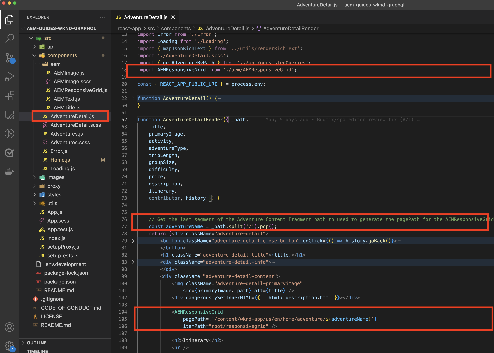
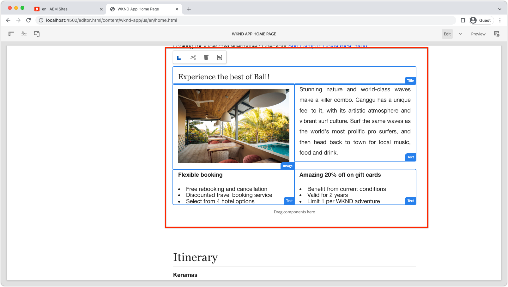

# Dynamic routes and editable components

{{spa-editor-deprecation}}

In this chapter, we enable two dynamic Adventure Detail routes to support editable components; __Bali Surf Camp__ and __Beervana in Portland__.


The Adventure Detail SPA route is defined as `/adventure/:slug` where `slug` is a unique identifier property on the Adventure Content Fragment.

## Map the SPA URLs to AEM Pages

In the previous two chapters, we mapped editable component content from the SPA&#39;s Home view to corresponding Remote SPA root page in AEM at `/content/wknd-app/us/en/`.

Defining mapping for editable components for the SPA&#39;s dynamic routes is similar however we must come up 1:1 mapping scheme between instances of the route and AEM pages.

In this tutorial, we take the name of the WKND Adventure Content Fragment, which is the last segment of the path, and map it to a simple path under `/content/wknd-app/us/en/adventure`.

| Remote SPA route | AEM page path |
|------------------------------------|--------------------------------------------|
| / | /content/wknd-app/us/en/home |
| /adventure/__bali-surf-camp__ | /content/wknd-app/us/en/home/adventure/__bali-surf-camp__ |
| /adventure/__beervana-portland__ | /content/wknd-app/us/en/home/adventure/__beervana-in-portland__ |

So, based on this mapping we must create two new AEM pages at:

* `/content/wknd-app/us/en/home/adventure/bali-surf-camp`
* `/content/wknd-app/us/en/home/adventure/beervana-in-portland`

## Remote SPA mapping

The mapping for requests leaving the Remote SPA are configured via the `setupProxy` configuration done in [Bootstrap the SPA](./spa-bootstrap.md).

## SPA Editor mapping

The mapping for SPA requests when the SPA is opened via AEM SPA Editor are configured via Sling Mappings configuration done in [Configure AEM](./aem-configure.md).

## Create content pages in AEM

First, create the intermediary `adventure` Page segment:

1. Log in to AEM Author
1. Navigate to __Sites > WKND App > us > en > WKND App Home Page__
   1. This AEM page is mapped as the root of the SPA, so this is where we begin building out the AEM page structure for other SPA routes.
1. Tap __Create__ and select __Page__
1. Select the __Remote SPA Page__ template, and tap __Next__
1. Fill out the Page Properties
   1. __Title__: Adventure
   1. __Name__: `adventure`
      1. This value defines the AEM page&#39;s URL, and therefore must match the SPA&#39; route segment.
1. Tap __Done__

Then, create the AEM pages that correspond to each of the SPA&#39;s URLs that require editable areas.

1. Navigate into the new __Adventure__ page in the Site Admin
1. Tap __Create__ and select __Page__
1. Select the __Remote SPA Page__ template, and tap __Next__
1. Fill out the Page Properties
   1. __Title__: Bali Surf Camp
   1. __Name__: `bali-surf-camp`
      1. This value defines the AEM page&#39;s URL, and therefore must match the SPA&#39; route&#39;s last segment
1. Tap __Done__
1. Repeat the steps 3-6 to create the __Beervana in Portland__ page, with:
   1. __Title__: Beervana in Portland
   1. __Name__: `beervana-in-portland`
      1. This value defines the AEM page&#39;s URL, and therefore must match the SPA&#39; route&#39;s last segment

These two AEM pages hold the respective-authored content for their matching SPA routes. If other SPA routes require authoring, new AEM Pages must be created at their SPA&#39;s URL under the Remote SPA page&#39;s root page (`/content/wknd-app/us/en/home`) in AEM.

## Update the WKND App

Vamos a colocar el componente `<ResponsiveGrid...>` creado en el [último capítulo](./spa-container-component.md), en nuestro componente de SPA `AdventureDetail`, creando un contenedor editable.

### Colocar el componente de la SPA de ResponsiveGrid

Al colocar `<ResponsiveGrid...>` en el componente `AdventureDetail`, se crea un contenedor editable en esa ruta. El truco se debe a que varias rutas utilizan el componente `AdventureDetail` para representarse, debemos ajustar dinámicamente el atributo `<ResponsiveGrid...>'s pagePath`. Se debe derivar `pagePath` para que apunte a la página de AEM correspondiente, en función de la aventura que muestre la instancia de la ruta.

1. Abrir y editar `react-app-/src/components/AdventureDetail.js`
1. Importe el componente `ResponsiveGrid` y colóquelo sobre el componente `<h2>Itinerary</h2>`.
1. Establezca los atributos siguientes en el componente `<ResponsiveGrid...>`. Tenga en cuenta que el atributo `pagePath` agrega el elemento `slug` actual que se asigna a la página de aventura según la asignación definida anteriormente.
   1. `pagePath = '/content/wknd-app/us/en/home/adventure/${slug}'`
   1. `itemPath = 'root/responsivegrid'`

   Esto indica al componente `ResponsiveGrid` que recupere su contenido del recurso de AEM:

   1. `/content/wknd-app/us/en/home/adventure/${slug}/jcr:content/root/responsivegrid`

Actualice `AdventureDetail.js` con las líneas siguientes:

```javascript
...
import { ResponsiveGrid } from '@adobe/aem-react-editable-components';
...

function AdventureDetailRender(props) {
    ...
    // Get the slug from the React route parameter, this will be used to specify the AEM Page to store/read editable content from
    const { slug } = useParams();

    return(
        ...
        // Pass the slug in
        function AdventureDetailRender({ title, primaryImage, activity, adventureType, tripLength, 
                groupSize, difficulty, price, description, itinerary, references, slug }) {
            ...
            return (
                ...
                <ResponsiveGrid 
                    pagePath={`/content/wknd-app/us/en/home/adventure/${slug}`}
                    itemPath="root/responsivegrid"/>
                    
                <h2>Itinerary</h2>
                ...
            )
        }
    )
}
```

El archivo `AdventureDetail.js` debe tener el siguiente aspecto:



## Crear el contenedor en AEM

Con `<ResponsiveGrid...>` en su lugar y su `pagePath` establecido dinámicamente en función de la aventura que se está representando, intentamos crear contenido en él.

1. Iniciar sesión en AEM Author
1. Vaya a __Sitios > Aplicación WKND > us > en__
1. __Editar__ la página de inicio de la aplicación __WKND__
   1. Vaya a la ruta __Bali Surf Camp__ en el SPA para editarla
1. Seleccione __Vista previa__ en el selector de modo en la parte superior derecha
1. Toca la tarjeta __Bali Surf Camp__ en el SPA para navegar hasta su ruta
1. Seleccione __Editar__ del selector de modo
1. Busque el área editable __Contenedor de diseño__ justo encima del __Itinerario__
1. Abra la __barra lateral del editor de páginas__ y seleccione la __vista Componentes__
1. Arrastre algunos de los componentes habilitados al __contenedor de diseño__
   1. Imagen
   1. Texto
   1. Título

   And create some promotional marketing material. It could look something like this:

   

1. __Preview__ your changes in AEM Page Editor
1. Refresh the WKND App running locally on [http://localhost:3000](http://localhost:3000), navigate to the __Bali Surf Camp__ route to see the authored changes!

   

When navigating to an adventure detail route that does not have a mapped AEM Page, there is no authoring ability on that route instance. To enable authoring on these pages, simply make an AEM Page with the matching name under the __Adventure__ page!

## Enhorabuena.

¡Enhorabuena! You&#39;ve added authoring ability to dynamic routes in the SPA!

* Added the AEM React Editable Component&#39;s ResponsiveGrid component to a dynamic route
* Created AEM pages to supporting authoring of two specific routes in the SPA (Bali Surf Camp and Beervana in Portland)
* Authored content on the dynamic Bali Surf Camp route!

You&#39;ve now completed exploring the first steps of how AEM SPA Editor can be used to add specific editable areas to a Remote SPA!
