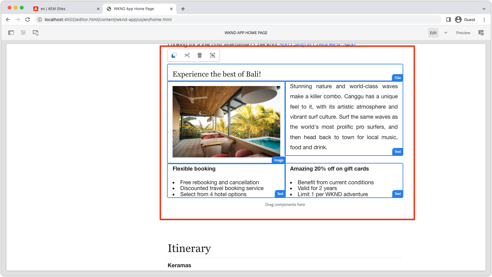

# Rutas dinámicas y componentes editables

{{spa-editor-deprecation}}

En este capítulo, habilitamos dos rutas dinámicas de Adventure Detail para admitir componentes editables: __Bali Surf Camp__ y __Beervana en Portland__.


La ruta de la SPA Detalles de la aventura se define como `/adventure/:slug`, donde `slug` es una propiedad de identificador único en el fragmento de contenido de aventura.

## Asignación de direcciones URL de SPA a páginas de AEM

En los dos capítulos anteriores, asignamos contenido de componente editable de la vista Inicio de la SPA a la página raíz de la SPA remota correspondiente en AEM en `/content/wknd-app/us/en/`.

La definición de asignaciones para componentes editables para las rutas dinámicas de la SPA es similar; sin embargo, debemos crear un esquema de asignación de 1:1 entre instancias de la ruta y páginas de AEM.

En este tutorial, tomamos el nombre del fragmento de contenido de WKND Adventure, que es el último segmento de la ruta, y lo asignamos a una ruta de acceso simple bajo `/content/wknd-app/us/en/adventure`.

| Ruta de SPA remota | Ruta de página de AEM |
|------------------------------------|--------------------------------------------|
| / | /content/wknd-app/us/en/home |
| /adventure/__bali-surf-camp__ | /content/wknd-app/us/en/home/adventure/__bali-surf-camp__ |
| /adventure/__bervana-portland__ | /content/wknd-app/us/en/home/adventure/__bervana-in-portland__ |

Por lo tanto, en función de esta asignación, debemos crear dos nuevas páginas de AEM en:

* `/content/wknd-app/us/en/home/adventure/bali-surf-camp`
* `/content/wknd-app/us/en/home/adventure/beervana-in-portland`

## Asignación de SPA remota

La asignación de solicitudes que salen de la SPA remota se configura mediante la configuración de `setupProxy` realizada en [Bootstrap the SPA](./spa-bootstrap.md).

## Asignación del editor de SPA

La asignación de solicitudes de SPA cuando el SPA se abre mediante el Editor de SPA de AEM se configura mediante la configuración de Asignaciones de Sling realizada en [Configurar AEM](./aem-configure.md).

## Creación de páginas de contenido en AEM

Primero, cree el segmento de página `adventure` intermedio:

1. Iniciar sesión en AEM Author
1. Vaya a __Sitios > Aplicación WKND > us > es > Página de inicio de la aplicación WKND__
   1. Esta página de AEM está asignada como raíz de la SPA, por lo que aquí es donde empezamos a crear la estructura de páginas de AEM para otras rutas de SPA.
1. Pulse __Crear__ y seleccione __Página__
1. Seleccione la plantilla __Página de SPA remota__ y pulse __Siguiente__
1. Rellene las propiedades de la página
   1. __Título__: Aventura
   1. __Nombre__: `adventure`
      1. Este valor define la dirección URL de la página AEM y, por lo tanto, debe coincidir con el segmento de ruta de la SPA.
1. Pulse __Listo__

A continuación, cree las páginas de AEM que correspondan a cada una de las direcciones URL de la SPA que requieran áreas editables.

1. Vaya a la nueva página __Aventura__ en el Administrador del sitio
1. Pulse __Crear__ y seleccione __Página__
1. Seleccione la plantilla __Página de SPA remota__ y pulse __Siguiente__
1. Rellene las propiedades de la página
   1. __Título__: Campamento de Surf en Bali
   1. __Nombre__: `bali-surf-camp`
      1. Este valor define la dirección URL de la página AEM y, por lo tanto, debe coincidir con el último segmento de la ruta de la SPA
1. Pulse __Listo__
1. Repita los pasos del 3 al 6 para crear la página __Beervana in Portland__ con:
   1. __Título__: Beervana en Portland
   1. __Nombre__: `beervana-in-portland`
      1. Este valor define la dirección URL de la página AEM y, por lo tanto, debe coincidir con el último segmento de la ruta de la SPA

Estas dos páginas de AEM contienen el contenido creado respectivamente para sus rutas de SPA coincidentes. Si otras rutas SPA requieren creación, se deben crear nuevas páginas AEM en la dirección URL de su SPA en la página raíz de la página SPA remota (`/content/wknd-app/us/en/home`) en AEM.

## Actualización de la aplicación WKND

Vamos a colocar el componente `<ResponsiveGrid...>` creado en el [último capítulo](./spa-container-component.md), en nuestro componente de SPA `AdventureDetail`, creando un contenedor editable.

### Colocar el componente de la SPA de ResponsiveGrid

Al colocar `<ResponsiveGrid...>` en el componente `AdventureDetail`, se crea un contenedor editable en esa ruta. El truco se debe a que varias rutas utilizan el componente `AdventureDetail` para representarse, debemos ajustar dinámicamente el atributo `<ResponsiveGrid...>'s pagePath`. Se debe derivar `pagePath` para que apunte a la página de AEM correspondiente, en función de la aventura que muestre la instancia de la ruta.

1. Abrir y editar `react-app-/src/components/AdventureDetail.js`
1. Importe el componente `ResponsiveGrid` y colóquelo sobre el componente `<h2>Itinerary</h2>`.
1. Establezca los atributos siguientes en el componente `<ResponsiveGrid...>`. Tenga en cuenta que el atributo `pagePath` agrega el elemento `slug` actual que se asigna a la página de aventura según la asignación definida anteriormente.
   1. `pagePath = '/content/wknd-app/us/en/home/adventure/${slug}'`
   1. `itemPath = 'root/responsivegrid'`

   Esto indica al componente `ResponsiveGrid` que recupere su contenido del recurso de AEM:

   1. `/content/wknd-app/us/en/home/adventure/${slug}/jcr:content/root/responsivegrid`

Actualice `AdventureDetail.js` con las líneas siguientes:

```javascript
...
import { ResponsiveGrid } from '@adobe/aem-react-editable-components';
...

function AdventureDetailRender(props) {
    ...
    // Get the slug from the React route parameter, this will be used to specify the AEM Page to store/read editable content from
    const { slug } = useParams();

    return(
        ...
        // Pass the slug in
        function AdventureDetailRender({ title, primaryImage, activity, adventureType, tripLength, 
                groupSize, difficulty, price, description, itinerary, references, slug }) {
            ...
            return (
                ...
                <ResponsiveGrid 
                    pagePath={`/content/wknd-app/us/en/home/adventure/${slug}`}
                    itemPath="root/responsivegrid"/>
                    
                <h2>Itinerary</h2>
                ...
            )
        }
    )
}
```

El archivo `AdventureDetail.js` debe tener el siguiente aspecto:


## Crear el contenedor en AEM

Con `<ResponsiveGrid...>` en su lugar y su `pagePath` establecido dinámicamente en función de la aventura que se está representando, intentamos crear contenido en él.

1. Iniciar sesión en AEM Author
1. Vaya a __Sitios > Aplicación WKND > us > en__
1. __Editar__ la página de inicio de la aplicación __WKND__
   1. Vaya a la ruta __Bali Surf Camp__ en el SPA para editarla
1. Seleccione __Vista previa__ en el selector de modo en la parte superior derecha
1. Toca la tarjeta __Bali Surf Camp__ en el SPA para navegar hasta su ruta
1. Seleccione __Editar__ del selector de modo
1. Busque el área editable __Contenedor de diseño__ justo encima del __Itinerario__
1. Abra la __barra lateral del editor de páginas__ y seleccione la __vista Componentes__
1. Arrastre algunos de los componentes habilitados al __contenedor de diseño__
   1. Imagen
   1. Texto
   1. Título

   Y crear material de marketing promocional. Podría tener un aspecto similar al siguiente:

   

1. __Vista previa__ de sus cambios en el editor de páginas de AEM
1. Actualice la aplicación WKND que se ejecuta localmente en [http://localhost:3000](http://localhost:3000), navegue hasta la ruta __Bali Surf Camp__ para ver los cambios creados.

   

Al navegar a una ruta de detalles de aventura que no tiene una página de AEM asignada, no hay capacidad de creación en esa instancia de ruta. Para habilitar la creación en estas páginas, simplemente cree una página de AEM con el mismo nombre en la página __Aventura__.

## Enhorabuena.

¡Enhorabuena! ¡Ha agregado la capacidad de creación a las rutas dinámicas en el SPA!

* Se ha agregado el componente Cuadrícula interactiva del componente Editable React de AEM a una ruta dinámica
* Se crearon páginas de AEM para apoyar la creación de dos rutas específicas en el SPA (Bali Surf Camp y Beervana en Portland)
* Contenido creado en la dinámica ruta Bali Surf Camp!

Ahora ha completado la exploración de los primeros pasos de cómo se puede utilizar el Editor de SPA de AEM para agregar áreas editables específicas a un SPA remoto.
