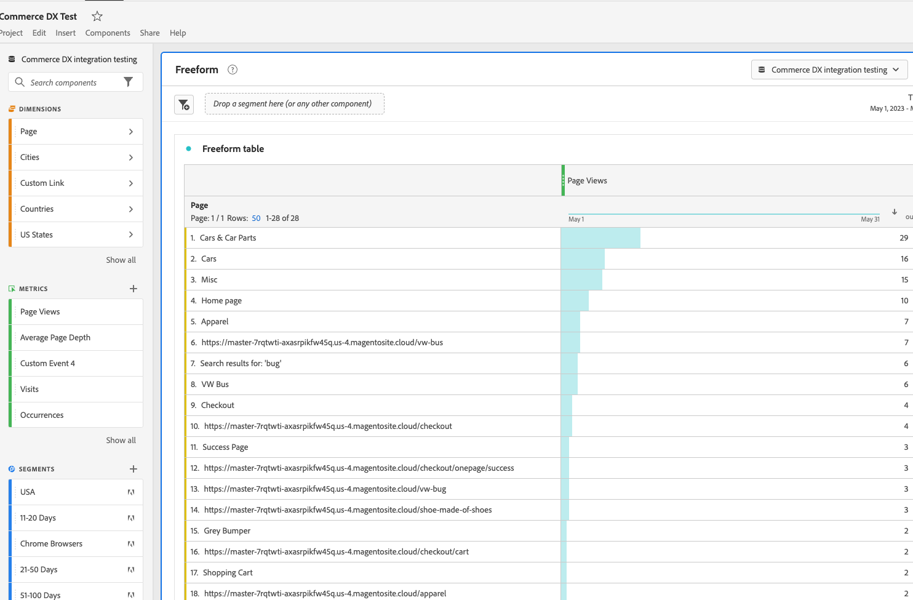

# Integración de Analytics con Commerce

* Compruebe que la cuenta tiene acceso a Adobe Analytics.

* Cree un proyecto en Adobe Analytics.

* Cree un esquema.
   * Necesita esto para seleccionar entre las opciones de pasos posteriores. Para crear un esquema, busque en la columna izquierda, bajo &quot;Administración de datos&quot;, y busque Esquemas. Ahora, en la parte superior izquierda, haga clic en &quot;Crear esquema&quot;. Seleccione ExperienceEvent de XDM.
   * A la izquierda, busque Grupos de campos, haga clic en Agregar
      * En la búsqueda, puede filtrar introduciendo `ExperienceEvent Commerce`
      * Buscar: `Adobe Analytics ExperienceEvent Commerce` y marque la casilla
      * Asegúrese de hacer clic en `Add field groups` en la parte superior derecha para guardar y continuar
* Cree un conjunto de datos, lo necesita cuando configure el &quot;DataStream&quot; a continuación.
   * El conjunto de datos se encuentra en la columna izquierda &quot;Administración de datos&quot; y busca &quot;Conjuntos de datos&quot;.
   * A continuación, haga clic en &quot;Crear conjunto de datos&quot; en la parte superior derecha. El conjunto de datos se crea a partir del esquema.
   * busque y utilice el esquema que creó anteriormente
* Crear flujo de datos. Puede acceder a él utilizando la &quot;Recopilación de datos en la columna izquierda&quot; y buscando &quot;Flujos de datos&quot;.
* Cree tablas con paneles y segmentos. Esta es una forma de complicarse para este tutorial; necesita la ayuda de una persona con experiencia en Analytics.

Por último, para ver el informe, vaya a experience.adobe.com, busque el proyecto de Workspace, haga clic en el vínculo del proyecto que desee ver y debería ver algo parecido a esta imagen

