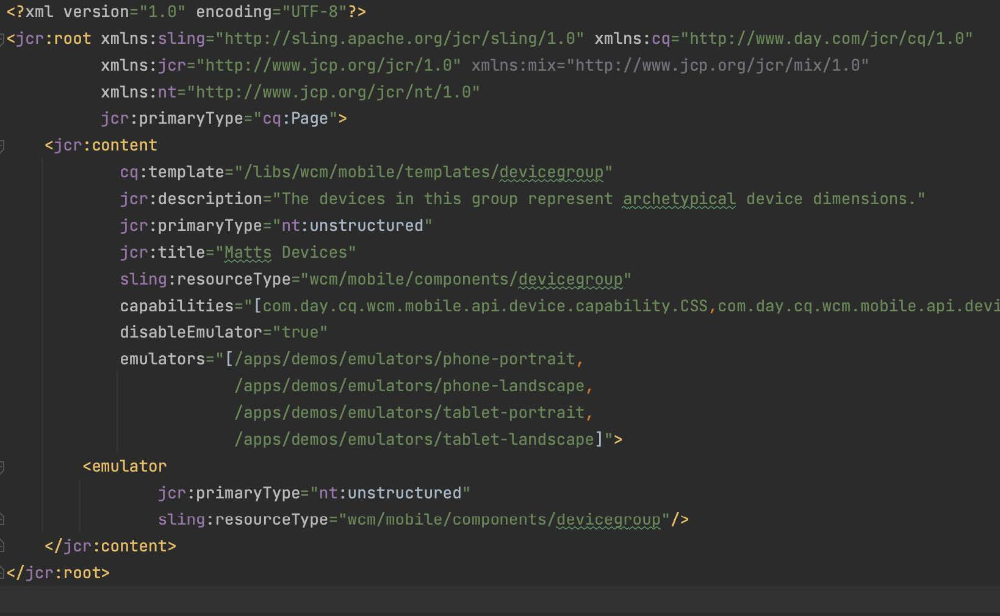

# Puntos de interrupción interactivos

AEM Aprenda a configurar nuevos puntos de interrupción adaptables para el editor de páginas adaptable de la interfaz de usuario de.

## Crear puntos de interrupción CSS

AEM AEM En primer lugar, cree puntos de interrupción de medios en el CSS de cuadrícula adaptable a la que se adhiere el sitio de la cuadrícula adaptable

En el archivo `/ui.apps/src/main/content/jcr_root/apps/[app name]/clientlibs/clientlib-grid/less/grid.less`, cree los puntos de interrupción para usarlos junto con el emulador móvil. AEM Tome nota de `max-width` para cada punto de interrupción, ya que asigna los puntos de interrupción CSS a los puntos de interrupción adaptables del Editor de páginas.

## Personalizar los puntos de interrupción de la plantilla

Abra el archivo `ui.content/src/main/content/jcr_root/conf/<app name>/settings/wcm/templates/page-content/structure/.content.xml` y actualice `cq:responsive/breakpoints` con las nuevas definiciones de nodo de punto de interrupción. Cada [punto de interrupción CSS](#create-new-css-breakpoints) debe tener un nodo correspondiente en `breakpoints` con su propiedad `width` establecida en `max-width` del punto de interrupción CSS.

## Creación de emuladores

AEM Se deben definir emuladores de página que permitan a los autores seleccionar la vista adaptable para editarla en el Editor de páginas.

Crear nodos de emuladores en `/ui.apps/src/main/content/jcr_root/apps/<app name>/emulators`

Por ejemplo, `/ui.apps/src/main/content/jcr_root/apps/wknd-examples/emulators/phone-landscape`. Copie un nodo de emulador de referencia de `/libs/wcm/mobile/components/emulators` en el CRXDE Lite a y actualice la copia para acelerar la definición del nodo.

## Crear grupo de dispositivos

AEM Agrupe los emuladores para [ponerlos a disposición en el Editor de páginas de la página de la página de la página de la página de](#update-the-templates-device-group).

Crear la estructura de nodos `/apps/settings/mobile/groups/<name of device group>` en `/ui.apps/src/main/content/jcr_root`.

Crear un archivo de `.content.xml` en `/apps/settings/mobile/groups/<device group name>` y definir
los nuevos emuladores utilizan un código similar al siguiente:

## Actualizar el grupo de dispositivos de la plantilla

Por último, vuelva a asignar el grupo de dispositivos a la plantilla de página para que los emuladores estén disponibles en el Editor de páginas para las páginas creadas a partir de esta plantilla.

Abra el archivo `ui.content/src/main/content/jcr_root/conf/[app name]/settings/wcm/templates/page-content/structure/.content.xml` y actualice la propiedad `cq:deviceGroups` para que haga referencia al nuevo grupo móvil (por ejemplo, `cq:deviceGroups="[mobile/groups/customdevices]"`)
