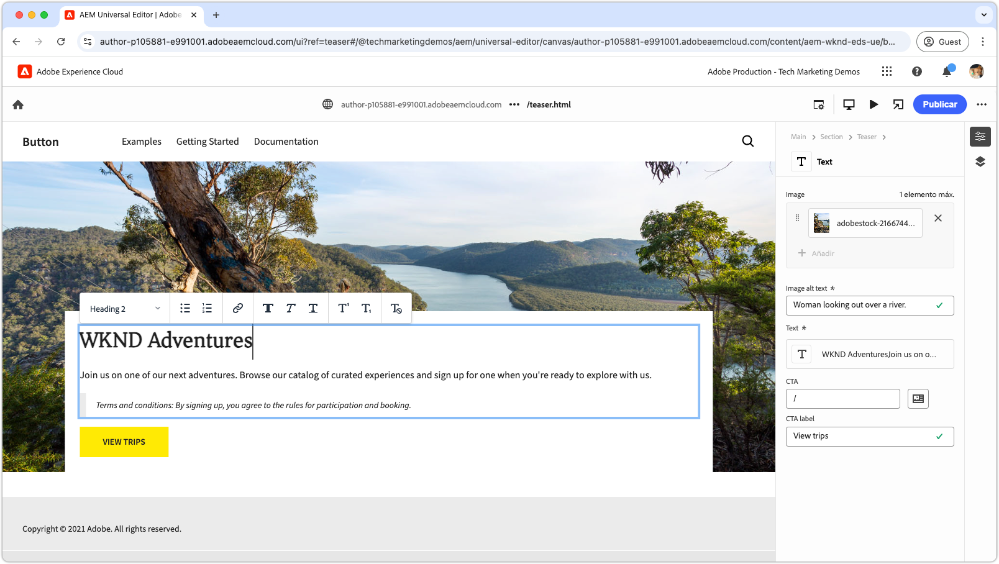

# Tutorial para desarrolladores de Edge Delivery Services y Universal Editor

AEM En este tutorial, aprenderá los aspectos básicos de la creación de un sitio web de que combine la creación potente con el editor universal y una entrega rápida con Edge Delivery Services. Al final, tendrá una comprensión básica de cómo crear un nuevo proyecto, configurar un entorno de desarrollo local y crear un nuevo bloque.

## Configuración del proyecto

Obtenga información sobre cómo crear un proyecto de código y configurar un nuevo sitio en AEM as a Cloud Service. Esta configuración permite un desarrollo sin problemas con el editor universal para la creación de contenido y la entrega de contenido rápida a través de Edge Delivery Services.

<!-- CARDS 

* ./1-new-code-project.md
  {}
* ./2-new-aem-site.md

-->
<!-- START CARDS HTML - DO NOT MODIFY BY HAND -->

    

        

            

                <figure class="image x-is-16by9">
                    
                </figure>
            

            

                

                    

                        <a href="./1-new-code-project.md" target="_blank" rel="referrer" title="Creación de un nuevo proyecto">Crear un nuevo proyecto</a>
                    

                    
Crear un nuevo proyecto para Edge Delivery Services para el editor universal

                

                <a href="./1-new-code-project.md" target="_blank" rel="referrer" class="spectrum-Button spectrum-Button--outline spectrum-Button--primary spectrum-Button--sizeM" style="align-self: flex-start; margin-top: 1rem;">
                    Más información
                </a>
            

        

    

    

        

            

                <figure class="image x-is-16by9">
                    
                </figure>
            

            

                

                    

                        <a href="./2-new-aem-site.md" target="_blank" rel="referrer" title="Crear un nuevo sitio">Crear un nuevo sitio</a>
                    

                    
Crear un nuevo sitio en AEM Sites para Edge Delivery Services para el editor universal

                

                <a href="./2-new-aem-site.md" target="_blank" rel="referrer" class="spectrum-Button spectrum-Button--outline spectrum-Button--primary spectrum-Button--sizeM" style="align-self: flex-start; margin-top: 1rem;">
                    Más información
                </a>
            

        

    

<!-- END CARDS HTML - DO NOT MODIFY BY HAND -->

## Configuración de desarrollo

Aprenda a configurar su entorno de desarrollo local para permitir un desarrollo rápido de sitios web. Esta configuración permite crear sitios sin problemas con el editor universal y entregar contenido de forma eficaz a través de los Edge Delivery Services, lo que garantiza un flujo de trabajo de desarrollo fluido y optimizado.
<!-- CARDS 

* ./3-local-development-environment.md
* ./4-website-branding.md

-->
<!-- START CARDS HTML - DO NOT MODIFY BY HAND -->

    

        

            

                <figure class="image x-is-16by9">
                    
                </figure>
            

            

                

                    

                        <a href="./3-local-development-environment.md" target="_blank" rel="referrer" title="Configuración de un entorno de desarrollo local">Configurar un entorno de desarrollo local</a>
                    

                    
Crear un nuevo proyecto para Edge Delivery Services para el editor universal

                

                <a href="./3-local-development-environment.md" target="_blank" rel="referrer" class="spectrum-Button spectrum-Button--outline spectrum-Button--primary spectrum-Button--sizeM" style="align-self: flex-start; margin-top: 1rem;">
                    Más información
                </a>
            

        

    

    

        

            

                <figure class="image x-is-16by9">
                    
                </figure>
            

            

                

                    

                        <a href="./4-website-branding.md" target="_blank" rel="referrer" title="Marca del sitio web">Promoción de marca en el sitio web</a>
                    

                    
Configure CSS global, variables CSS y fuentes web.

                

                <a href="./4-website-branding.md" target="_blank" rel="referrer" class="spectrum-Button spectrum-Button--outline spectrum-Button--primary spectrum-Button--sizeM" style="align-self: flex-start; margin-top: 1rem;">
                    Más información
                </a>
            

        

    

<!-- END CARDS HTML - DO NOT MODIFY BY HAND -->

## Bloquear desarrollo

Aprenda a crear un nuevo bloque definiendo su modelo de contenido y configurando contenido de muestra para pruebas y desarrollo. AEM Explore dos métodos para procesar el bloque y comprenda cómo estructurarlo para obtener un rendimiento y una flexibilidad óptimos en los Edge Delivery Services de y.

<!-- CARDS 

* ./5-new-block.md
* ./6-author-block.md
* ./7a-block-css.md
* ./7b-block-js-css.md

-->
<!-- START CARDS HTML - DO NOT MODIFY BY HAND -->

    

        

            

                <figure class="image x-is-16by9">
                    
                </figure>
            

            

                

                    

                        <a href="./5-new-block.md" target="_blank" rel="referrer" title="Crear un nuevo bloque para el editor universal">Crear un nuevo bloque para el editor universal</a>
                    

                    
Cree un nuevo bloque.

                

                <a href="./5-new-block.md" target="_blank" rel="referrer" class="spectrum-Button spectrum-Button--outline spectrum-Button--primary spectrum-Button--sizeM" style="align-self: flex-start; margin-top: 1rem;">
                    Más información
                </a>
            

        

    

    

        

            

                <figure class="image x-is-16by9">
                    
                </figure>
            

            

                

                    

                        <a href="./6-author-block.md" target="_blank" rel="referrer" title="Crear el bloque">Crear el bloque</a>
                    

                    
Cree el nuevo bloque para que se pueda desarrollar en su contra.

                

                <a href="./6-author-block.md" target="_blank" rel="referrer" class="spectrum-Button spectrum-Button--outline spectrum-Button--primary spectrum-Button--sizeM" style="align-self: flex-start; margin-top: 1rem;">
                    Más información
                </a>
            

        

    

    

        

            

                <figure class="image x-is-16by9">
                    
                </figure>
            

            

                

                    

                        <a href="./7a-block-css.md" target="_blank" rel="referrer" title="Bloquear desarrollo con CSS">Bloquear desarrollo con CSS</a>
                    

                    
Cree el bloque utilizando solo CSS.

                

                <a href="./7a-block-css.md" target="_blank" rel="referrer" class="spectrum-Button spectrum-Button--outline spectrum-Button--primary spectrum-Button--sizeM" style="align-self: flex-start; margin-top: 1rem;">
                    Más información
                </a>
            

        

    

    

        

            

                <figure class="image x-is-16by9">
                    
                </figure>
            

            

                

                    

                        <a href="./7b-block-js-css.md" target="_blank" rel="referrer" title="Bloquear el desarrollo con CSS y JS">Bloquear desarrollo con CSS y JS</a>
                    

                    
Cree un bloque con CSS y JS.

                

                <a href="./7b-block-js-css.md" target="_blank" rel="referrer" class="spectrum-Button spectrum-Button--outline spectrum-Button--primary spectrum-Button--sizeM" style="align-self: flex-start; margin-top: 1rem;">
                    Más información
                </a>
            

        

    

<!-- END CARDS HTML - DO NOT MODIFY BY HAND -->
