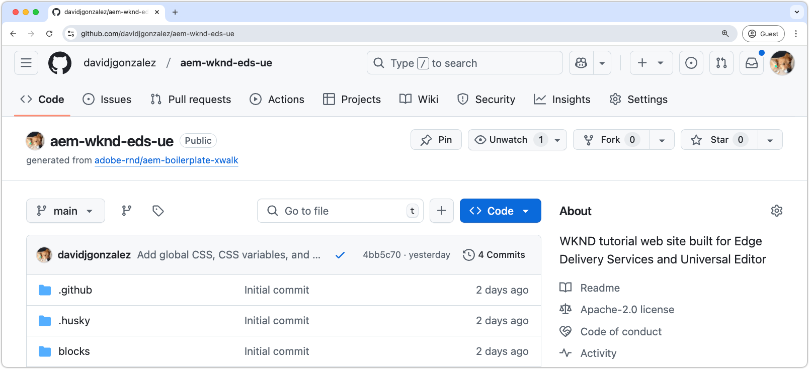
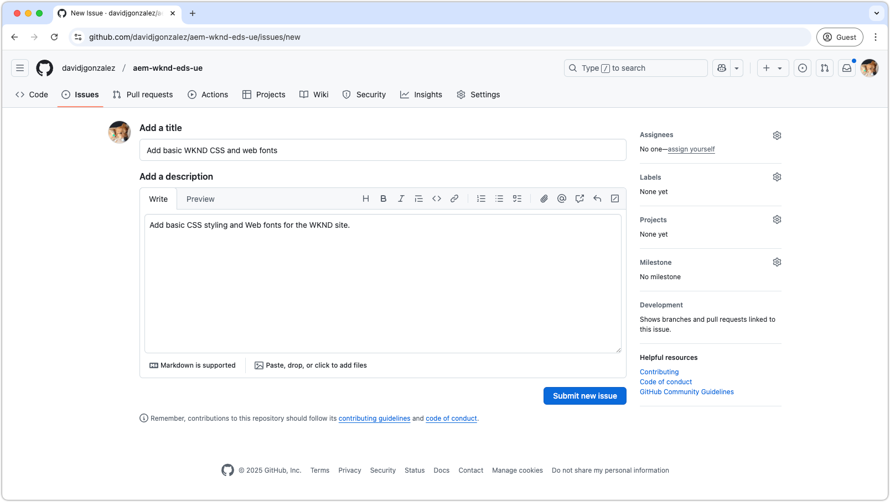

# Tutorial para desarrolladores de Edge Delivery Services y Universal Editor

En este tutorial, aprenderá los aspectos básicos de la creación de un sitio web de AEM que combine la creación avanzada con Universal Editor y una entrega rápida con Edge Delivery Services. Al final, tendrá una comprensión básica de cómo crear un nuevo proyecto, configurar un entorno de desarrollo local y crear un nuevo bloque.

## Configuración del proyecto

Obtenga información sobre cómo crear un proyecto de código y configurar un nuevo sitio en AEM as a Cloud Service. Esta configuración permite un desarrollo sin problemas con el editor universal para la creación de contenido y la entrega de contenido rápida a través de Edge Delivery Services.

<!-- CARDS 

* ./1-new-code-project.md
* ./2-new-aem-site.md

-->
<!-- START CARDS HTML - DO NOT MODIFY BY HAND -->

    

        

            

                <figure class="image x-is-16by9">
                    
                </figure>
            

            

                

                    

                        <a href="./1-new-code-project.md" target="_blank" rel="referrer" title="Creación de un proyecto de código">Crear un proyecto de código</a>
                    

                    
Cree un proyecto de código para Edge Delivery Services, editable con el editor universal.

                

                <a href="./1-new-code-project.md" target="_blank" rel="referrer" class="spectrum-Button spectrum-Button--outline spectrum-Button--primary spectrum-Button--sizeM" style="align-self: flex-start; margin-top: 1rem;">
                    Más información
                </a>
            

        

    

    

        

            

                <figure class="image x-is-16by9">
                    
                </figure>
            

            

                

                    

                        <a href="./2-new-aem-site.md" target="_blank" rel="referrer" title="Creación de un sitio de AEM">Crear un sitio de AEM</a>
                    

                    
Cree un sitio en AEM Sites para Edge Delivery Services editable con el editor universal.

                

                <a href="./2-new-aem-site.md" target="_blank" rel="referrer" class="spectrum-Button spectrum-Button--outline spectrum-Button--primary spectrum-Button--sizeM" style="align-self: flex-start; margin-top: 1rem;">
                    Más información
                </a>
            

        

    

<!-- END CARDS HTML - DO NOT MODIFY BY HAND -->

## Configuración de desarrollo

Aprenda a configurar su entorno de desarrollo local para permitir un desarrollo rápido de sitios web. Esta configuración permite crear sitios sin problemas con el editor universal y entregar contenido de forma eficaz a través de Edge Delivery Services, lo que garantiza un flujo de trabajo de desarrollo fluido y optimizado.
<!-- CARDS 

* ./3-local-development-environment.md
* ./4-website-branding.md

-->
<!-- START CARDS HTML - DO NOT MODIFY BY HAND -->

    

        

            

                <figure class="image x-is-16by9">
                    
                </figure>
            

            

                

                    

                        <a href="./3-local-development-environment.md" target="_blank" rel="referrer" title="Configuración de un entorno de desarrollo local">Configurar un entorno de desarrollo local</a>
                    

                    
Configure un entorno de desarrollo local para los sitios entregados con Edge Delivery Services y editables con el editor universal.

                

                <a href="./3-local-development-environment.md" target="_blank" rel="referrer" class="spectrum-Button spectrum-Button--outline spectrum-Button--primary spectrum-Button--sizeM" style="align-self: flex-start; margin-top: 1rem;">
                    Más información
                </a>
            

        

    

    

        

            

                <figure class="image x-is-16by9">
                    
                </figure>
            

            

                

                    

                        <a href="./4-website-branding.md" target="_blank" rel="referrer" title="Agregar marca del sitio web">Agregar marca de sitio web</a>
                    

                    
Defina CSS global, variables CSS y fuentes web para un sitio de Edge Delivery Services.

                

                <a href="./4-website-branding.md" target="_blank" rel="referrer" class="spectrum-Button spectrum-Button--outline spectrum-Button--primary spectrum-Button--sizeM" style="align-self: flex-start; margin-top: 1rem;">
                    Más información
                </a>
            

        

    

<!-- END CARDS HTML - DO NOT MODIFY BY HAND -->

## Bloquear desarrollo

Aprenda a crear un nuevo bloque definiendo su modelo de contenido y configurando contenido de muestra para pruebas y desarrollo. Explore dos métodos para procesar el bloque y comprenda cómo estructurarlo para obtener un rendimiento y una flexibilidad óptimos en AEM y Edge Delivery Services.

<!-- CARDS 

* ./5-new-block.md {image = ./assets/5-new-block/card.png}
* ./6-author-block.md {image = ./assets/6-author-block/card.png}
* ./7a-block-css.md {image = ./assets/7a-block-css/card.png}
* ./7b-block-js-css.md {image = ./assets/7b-block-js-css/card.png}

-->
<!-- START CARDS HTML - DO NOT MODIFY BY HAND -->

    

        

            

                <figure class="image x-is-16by9">
                    
                </figure>
            

            

                

                    

                        <a href="./5-new-block.md" target="_blank" rel="referrer" title="Crear un bloque">Crear un bloque</a>
                    

                    
Cree un bloque para un sitio web de Edge Delivery Services que se pueda editar con el editor universal.

                

                <a href="./5-new-block.md" target="_blank" rel="referrer" class="spectrum-Button spectrum-Button--outline spectrum-Button--primary spectrum-Button--sizeM" style="align-self: flex-start; margin-top: 1rem;">
                    Más información
                </a>
            

        

    

    

        

            

                <figure class="image x-is-16by9">
                    
                </figure>
            

            

                

                    

                        <a href="./6-author-block.md" target="_blank" rel="referrer" title="Crear un bloque">Crear un bloque</a>
                    

                    
Cree un bloque de Edge Delivery Services con el editor universal.

                

                <a href="./6-author-block.md" target="_blank" rel="referrer" class="spectrum-Button spectrum-Button--outline spectrum-Button--primary spectrum-Button--sizeM" style="align-self: flex-start; margin-top: 1rem;">
                    Más información
                </a>
            

        

    

    

        

            

                <figure class="image x-is-16by9">
                    
                </figure>
            

            

                

                    

                        <a href="./7a-block-css.md" target="_blank" rel="referrer" title="Desarrollo de un bloque con CSS">Desarrollar un bloque con CSS</a>
                    

                    
Desarrolle un bloque con CSS para Edge Delivery Services, editable con el editor universal.

                

                <a href="./7a-block-css.md" target="_blank" rel="referrer" class="spectrum-Button spectrum-Button--outline spectrum-Button--primary spectrum-Button--sizeM" style="align-self: flex-start; margin-top: 1rem;">
                    Más información
                </a>
            

        

    

    

        

            

                <figure class="image x-is-16by9">
                    
                </figure>
            

            

                

                    

                        <a href="./7b-block-js-css.md" target="_blank" rel="referrer" title="Desarrollo de un bloque con CSS y JS">Desarrollar un bloque con CSS y JS</a>
                    

                    
Desarrolle un bloque con CSS y JavaScript para Edge Delivery Services, editable con el editor universal.

                

                <a href="./7b-block-js-css.md" target="_blank" rel="referrer" class="spectrum-Button spectrum-Button--outline spectrum-Button--primary spectrum-Button--sizeM" style="align-self: flex-start; margin-top: 1rem;">
                    Más información
                </a>
            

        

    

<!-- END CARDS HTML - DO NOT MODIFY BY HAND -->

## Pasos siguientes

Ahora que ha completado este tutorial, aproveche lo que ha aprendido con estos tutoriales centrados. Estas guías amplían el código y los conceptos que se tratan aquí y exploran casos de uso específicos de funciones, técnicas avanzadas y sugerencias adicionales para mejorar las habilidades de desarrollo de Edge Delivery Services y el editor universal.

<!-- CARDS 

* ./how-to/block-options.md

-->
<!-- START CARDS HTML - DO NOT MODIFY BY HAND -->

    

        

            

                <figure class="image x-is-16by9">
                    
                </figure>
            

            

                

                    

                        <a href="./how-to/block-options.md" target="_blank" rel="referrer" title="Bloquear opciones">Bloquear opciones</a>
                    

                    
Aprenda a crear un bloque con varias opciones de visualización.

                

                <a href="./how-to/block-options.md" target="_blank" rel="referrer" class="spectrum-Button spectrum-Button--outline spectrum-Button--primary spectrum-Button--sizeM" style="align-self: flex-start; margin-top: 1rem;">
                    Más información
                </a>
            

        

    

<!-- END CARDS HTML - DO NOT MODIFY BY HAND -->
