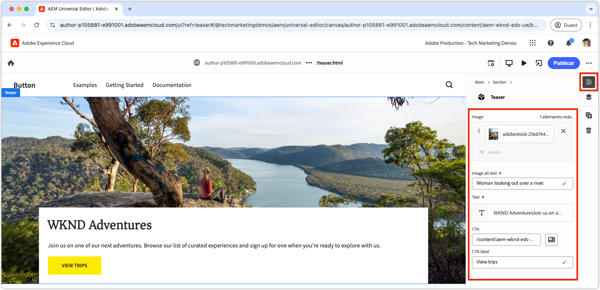
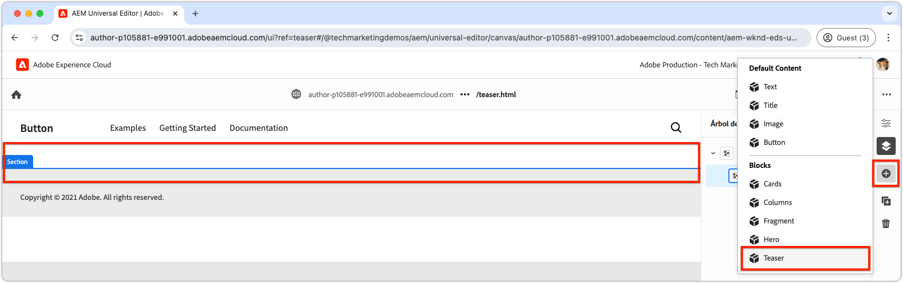

# Crear un bloque nuevo

Este capítulo cubre el proceso de creación de un nuevo bloque de teaser editable para un sitio web de Edge Delivery Services con el editor universal.


El bloque, denominado `teaser`, muestra los siguientes elementos:

- **Imagen**: Una imagen visualmente atractiva.
- **Contenido de texto**:
   - **Título**: Un titular atractivo para llamar la atención.
   - **Texto principal**: contenido descriptivo que proporciona contexto o detalles, incluidos términos y condiciones opcionales.
   - **Botón de llamada a la acción (CTA)**: vínculo diseñado para solicitar la interacción del usuario y guiarlo para que participe en mayor medida.

El contenido del bloque `teaser` se puede editar en el editor universal, lo que garantiza la facilidad de uso y la reutilización en todo el sitio web.

Tenga en cuenta que el bloque `teaser` es similar al bloque `hero` de la plantilla; por lo tanto, el bloque `teaser` solo sirve como ejemplo sencillo para ilustrar conceptos de desarrollo.

## Crear una nueva rama de Git

Para mantener un flujo de trabajo limpio y organizado, cree una nueva rama para cada tarea de desarrollo específica. Esto ayuda a evitar problemas con la implementación de código incompleto o no probado en la producción.

1. **Empiece desde la rama principal**: Trabajar desde el código de producción más actualizado garantiza una base sólida.
2. **Recuperar cambios remotos**: La recuperación de las actualizaciones más recientes desde GitHub garantiza que el código más actual esté disponible antes de iniciar el desarrollo.
   - Ejemplo: después de combinar los cambios de la rama `wknd-styles` en `main`, obtenga las actualizaciones más recientes.
3. **Crear una nueva rama**:

```bash
# ~/Code/aem-wknd-eds-ue

$ git fetch origin  
$ git checkout -b teaser origin/main  
```

Una vez creada la rama `teaser`, estará listo para comenzar a desarrollar el bloque de teaser.

## Bloquear carpeta

Cree una nueva carpeta denominada `teaser` en el directorio `blocks` del proyecto. Esta carpeta contiene los archivos JSON, CSS y JavaScript del bloque, y organiza los archivos del bloque en una ubicación:

```
# ~/Code/aem-wknd-eds-ue

/blocks/teaser
```

El nombre de la carpeta del bloque actúa como ID del bloque y se utiliza para hacer referencia al bloque durante todo su desarrollo.

## Bloquear JSON

El bloque JSON define tres aspectos clave del bloque:

- **Definición**: Registra el bloque como un componente editable en el Editor universal y lo vincula a un modelo de bloque y, opcionalmente, a un filtro.
- **Modelo**: Especifica los campos de creación del bloque y cómo se representan estos campos como Edge Delivery Services HTML semántico.
- **Filtro**: configura reglas de filtrado para restringir los contenedores a los que se puede agregar el bloque mediante el Editor universal. La mayoría de los bloques no son contenedores, sino que sus ID se añaden a los filtros de otros bloques de contenedores.

Cree un nuevo archivo en `/blocks/teaser/_teaser.json` con la siguiente estructura inicial, en el orden exacto. Si las claves están desordenadas, es posible que no se creen correctamente.

[!BADGE /blocks/teaser/_teaser.json]{type=Neutral tooltip="Nombre de archivo del ejemplo de código siguiente."}

```json
{
    "definitions": [],
    "models": [],
    "filters": []
}
```

### Modelo de bloque

El modelo de bloque es una parte fundamental de la configuración del bloque, ya que define lo siguiente:

1. La experiencia de creación define los campos disponibles para editar.

   

2. Cómo se representan los valores del campo en Edge Delivery Services HTML.

A los modelos se les asigna un `id` que corresponde a la definición del bloque [block](#block-definition) e incluyen una matriz `fields` para especificar los campos editables.

Cada campo de la matriz `fields` tiene un objeto JSON que incluye las siguientes propiedades necesarias:

| Propiedad JSON | Descripción |
|---------------|-----------------------------------------------------------------------------------------------------------------------|
| `component` | El [tipo de campo](https://experienceleague.adobe.com/es/docs/experience-manager-cloud-service/content/implementing/developing/universal-editor/field-types#component-types), como `text`, `reference` o `aem-content`. |
| `name` | Nombre del campo, que se asigna a la propiedad JCR donde el valor se almacena en AEM. |
| `label` | La etiqueta que se muestra a los autores en el editor universal. |

Para obtener una lista completa de propiedades, incluidas las opcionales, revise la [documentación sobre los campos del editor universal](https://experienceleague.adobe.com/es/docs/experience-manager-cloud-service/content/implementing/developing/universal-editor/field-types#fields).

#### Diseño de bloque


El bloque de teaser incluye los siguientes elementos editables:

1. **Imagen**: representa el contenido visual del teaser.
2. **Contenido de texto**: incluye el título, el texto principal y el botón de llamada a la acción, y se encuentra en un rectángulo blanco.
   - El **título** y **texto independiente** se pueden crear con el mismo editor de texto enriquecido.
   - **CTA** se puede crear a través de un campo `text` para **label** y `aem-content` para **link**.

El diseño del bloque de teaser se divide en estos dos componentes lógicos (contenido de imagen y texto), lo que garantiza una experiencia de creación estructurada e intuitiva para los usuarios.

### Bloquear campos

Defina los campos necesarios para el bloque: imagen, texto alternativo de imagen, texto, etiqueta de CTA y vínculo de CTA.

>[!BEGINTABS]

>[!TAB Correcto]

**Esta pestaña ilustra la manera correcta de modelar el bloque de teaser.**

El teaser consta de dos áreas lógicas: imagen y texto. Para simplificar el código necesario para mostrar Edge Delivery Services HTML como la experiencia web deseada, el modelo de bloques debe reflejar esta estructura.

- Agrupe la **imagen** y el **texto alternativo de la imagen** mediante [contracción del campo](https://experienceleague.adobe.com/es/docs/experience-manager-cloud-service/content/edge-delivery/wysiwyg-authoring/content-modeling#field-collapse).
- Agrupe los campos de contenido de texto mediante [agrupación de elementos](https://experienceleague.adobe.com/es/docs/experience-manager-cloud-service/content/edge-delivery/wysiwyg-authoring/content-modeling#element-grouping) y [contracción de campos para CTA](https://experienceleague.adobe.com/es/docs/experience-manager-cloud-service/content/edge-delivery/wysiwyg-authoring/content-modeling#field-collapse).

Si no está familiarizado con la [contracción de campos](https://experienceleague.adobe.com/es/docs/experience-manager-cloud-service/content/edge-delivery/wysiwyg-authoring/content-modeling#field-collapse), la [agrupación de elementos](https://experienceleague.adobe.com/es/docs/experience-manager-cloud-service/content/edge-delivery/wysiwyg-authoring/content-modeling#element-grouping) o la [inferencia de tipos](https://experienceleague.adobe.com/es/docs/experience-manager-cloud-service/content/edge-delivery/wysiwyg-authoring/content-modeling#type-inference), revise la documentación vinculada antes de continuar, ya que son esenciales para crear un modelo de bloques bien estructurado.

En el siguiente ejemplo:

- [Inferencia de tipo](https://experienceleague.adobe.com/es/docs/experience-manager-cloud-service/content/edge-delivery/wysiwyg-authoring/content-modeling#type-inference) se usa para crear automáticamente un elemento HTML `` a partir del campo `image`. La contracción de campos se usa con los campos `image` y `imageAlt` para crear un elemento HTML ``. El atributo `src` se establece en el valor del campo `image`, mientras que el atributo `alt` se establece en el valor del campo `imageAlt`.
- `textContent` es un nombre de grupo que se usa para categorizar campos. Debería ser semántico, pero puede ser cualquier cosa exclusiva de este bloque. Esto indica al editor universal que procese todos los campos con este prefijo dentro del mismo elemento `<div>` en la salida final de HTML.
- El colapso de campos también se aplica dentro del grupo `textContent` para la llamada a la acción (CTA). El CTA se creó como `<a>` mediante [inferencia de tipo](https://experienceleague.adobe.com/es/docs/experience-manager-cloud-service/content/edge-delivery/wysiwyg-authoring/content-modeling#type-inference). El campo `cta` se usa para establecer el atributo `href` del elemento `<a>`, y el campo `ctaText` proporciona el contenido de texto para el vínculo dentro de las etiquetas `<a ...>`.

[!BADGE /blocks/teaser/_teaser.json]{type=Neutral tooltip="Nombre de archivo del ejemplo de código siguiente."}

```json
{
    "definitions": [],
    "models": [
        {
            "id": "teaser", 
            "fields": [
                {
                    "component": "reference",
                    "valueType": "string",
                    "name": "image",
                    "label": "Image",
                    "multi": false
                },
                {
                    "component": "text",
                    "valueType": "string",
                    "name": "imageAlt",
                    "label": "Image alt text",
                    "required": true
                },
                {
                    "component": "richtext",
                    "name": "textContent_text",
                    "label": "Text",
                    "valueType": "string",
                    "required": true
                },
                {
                    "component": "aem-content",
                    "name": "textContent_cta",
                    "label": "CTA",
                    "valueType": "string"
                },
                {
                    "component": "text",
                    "name": "textContent_ctaText",
                    "label": "CTA label",
                    "valueType": "string"
                }
            ]
        }
    ],
    "filters": []
}
```

Este modelo define las entradas de creación en el editor universal para el bloque.

El Edge Delivery Services HTML resultante para este bloque coloca la imagen en el primer div y los campos del grupo de elementos `textContent` en el segundo div.

```html
<div>
    <div>
        <!-- This div contains the field-collapsed image fields  -->
        <picture>
            ...
            <source .../>            
            
        </picture>
    </div>
    <div>
        <!-- This div, via element grouping contains the textContent fields -->
        <h2>The authored title</h2>
        <p>The authored body text</p>
        <a href="/authored/cta/link">The authored CTA label</a>
    </div>
</div>        
```

Como se muestra [en el siguiente capítulo](./7a-block-css.md), esta estructura de HTML simplifica el estilo del bloque como una unidad cohesiva.

Para comprender las consecuencias de no usar la contracción de campos y la agrupación de elementos, vea la ficha **De forma incorrecta** que se muestra arriba.

>[!TAB Dirección incorrecta]

**Esta pestaña ilustra una manera subóptima de modelar el bloque de teaser y es solo una yuxtaposición a la manera correcta.**

Definir cada campo como un campo independiente en el modelo de bloque sin usar [contraer el campo](https://experienceleague.adobe.com/es/docs/experience-manager-cloud-service/content/edge-delivery/wysiwyg-authoring/content-modeling#field-collapse) y [agrupar elementos](https://experienceleague.adobe.com/es/docs/experience-manager-cloud-service/content/edge-delivery/wysiwyg-authoring/content-modeling#element-grouping) puede parecer tentador. Sin embargo, esta omisión complica el diseño del bloque como una unidad cohesiva.

Por ejemplo, el modelo de teaser se podría definir **sin contraer el campo** o agrupar elementos de la siguiente manera:

[!BADGE /blocks/teaser/_teaser.json]{type=Neutral tooltip="Nombre de archivo del ejemplo de código siguiente."}

```json
{
    "definitions": [],
    "models": [
        {
            "id": "teaser", 
            "fields": [
                {
                    "component": "reference",
                    "valueType": "string",
                    "name": "image",
                    "label": "Image",
                    "multi": false
                },
                {
                    "component": "text",
                    "valueType": "string",
                    "name": "alt",
                    "label": "Image alt text",
                    "required": true
                },
                {
                    "component": "richtext",
                    "name": "text",
                    "label": "Text",
                    "valueType": "string",
                    "required": true
                },
                {
                    "component": "aem-content",
                    "name": "link",
                    "label": "CTA",
                    "valueType": "string"
                },
                {
                    "component": "text",
                    "name": "label",
                    "label": "CTA label",
                    "valueType": "string"
                }
            ]
        }
    ],
    "filters": []
}
```

El HTML de Edge Delivery Services para el bloque procesa el valor de cada campo en un(a) `div` independiente, lo que complica la comprensión del contenido, la aplicación de estilo y los ajustes de estructura de HTML para lograr el diseño deseado.

```html
<div>
    <div>
        <!-- This div contains the field-collapsed image  -->
        <picture>
            ...
            <source .../>            
            
        </picture>
    </div>
    <div>
        <p>The authored alt text</p>
    </div>
    <div>
        <h2>The authored title</h2>
        <p>The authored body text</p>
    </div>
    <div>
        <a href="/authored/cta/link">/authored/cta/link</a>
    </div>
    <div>
        The authored CTA label
    </div>
</div>        
```

Cada campo está aislado en su propio `div`, lo que dificulta aplicar estilo a la imagen y al contenido del texto como unidades coherentes. Lograr el diseño deseado con esfuerzo y creatividad es posible, pero el uso de [agrupación de elementos](https://experienceleague.adobe.com/es/docs/experience-manager-cloud-service/content/edge-delivery/wysiwyg-authoring/content-modeling#element-grouping) para agrupar campos de contenido de texto y [contracción de campos](https://experienceleague.adobe.com/es/docs/experience-manager-cloud-service/content/edge-delivery/wysiwyg-authoring/content-modeling#field-collapse) para agregar valores creados como atributos de elementos es más sencillo, sencillo y semánticamente correcto.

Consulte **La ficha Forma de escritura** anterior para ver cómo modelar mejor el bloque de teaser.

>[!ENDTABS]


### Definición de bloque

La definición del bloque registra el bloque en el editor universal. Este es un desglose de las propiedades JSON utilizadas en la definición del bloque:

| Propiedad JSON | Descripción |
|---------------|-------------|
| `definition.title` | El título del bloque tal como se muestra en los bloques **Add** del editor universal. |
| `definition.id` | Identificador único del bloque, usado para controlar su uso en `filters`. |
| `definition.plugins.xwalk.page.resourceType` | Define el tipo de recurso de Sling para procesar el componente en el editor universal. Usar siempre un tipo de recurso `core/franklin/components/block/v#/block`. |
| `definition.plugins.xwalk.page.template.name` | El nombre del bloque. Debe escribirse en minúsculas y con guiones que coincidan con el nombre de la carpeta del bloque. Este valor también se utiliza para etiquetar la instancia del bloque en el editor universal. |
| `definition.plugins.xwalk.page.template.model` | Vincula esta definición a su definición `model`, que controla los campos de creación mostrados para el bloque en el Editor universal. El valor aquí debe coincidir con un valor `model.id`. |
| `definition.plugins.xwalk.page.template.classes` | Propiedad opcional, cuyo valor se agrega al atributo `class` del elemento de bloque HTML. Esto permite usar variantes del mismo bloque. El valor `classes` se puede hacer editable al [agregar un campo de clases](https://experienceleague.adobe.com/es/docs/experience-manager-cloud-service/content/edge-delivery/wysiwyg-authoring/create-block#block-options) al [modelo](#block-model) del bloque. |


Este es un ejemplo de JSON para la definición del bloque:

[!BADGE /blocks/teaser/_teaser.json]{type=Neutral tooltip="Nombre de archivo del ejemplo de código siguiente."}

```json
{
    "definitions": [{
      "title": "Teaser",
      "id": "teaser",
      "plugins": {
        "xwalk": {
          "page": {
            "resourceType": "core/franklin/components/block/v1/block",
            "template": {
              "name": "Teaser",
              "model": "teaser",
              "textContent_text": "<h2>Enter a title</h2><p>...and body text here!</p>",
              "textContent_cta": "/",
              "textContent_ctaText": "Click me!"
            }
          }
        }
      }
    }],
    "models": [... from previous section ...],
    "filters": []
}
```

En este ejemplo:

- El bloque se denomina Teaser y utiliza el modelo `teaser`, que determina qué campos están disponibles para su edición en el editor universal.
- El bloque incluye contenido predeterminado para el campo `textContent_text`, que es un área de texto enriquecido para el título y el texto principal, y `textContent_cta` y `textContent_ctaText` para el vínculo y la etiqueta de CTA (llamada a la acción). Los nombres de campo de la plantilla que contienen contenido inicial coinciden con los nombres de campo definidos en la [matriz de campos del modelo de contenido](#block-model);

Esta estructura garantiza que el bloque esté configurado en el editor universal con los campos, el modelo de contenido y el tipo de recurso adecuados para el procesamiento.

### Bloquear filtros

La matriz `filters` del bloque define, para [bloques de contenedor](https://experienceleague.adobe.com/es/docs/experience-manager-cloud-service/content/edge-delivery/wysiwyg-authoring/content-modeling#container), qué otros bloques se pueden agregar al contenedor. Los filtros definen una lista de identificadores de bloque (`model.id`) que se pueden agregar al contenedor.

[!BADGE /blocks/teaser/_teaser.json]{type=Neutral tooltip="Nombre de archivo del ejemplo de código siguiente."}

```json
{
  "definitions": [... populated from previous section ...],
  "models": [... populated from previous section ...],
  "filters": []
}
```

El componente teaser no es un [bloque contenedor](https://experienceleague.adobe.com/es/docs/experience-manager-cloud-service/content/edge-delivery/wysiwyg-authoring/content-modeling#container), lo que significa que no puede agregarle otros bloques. Como resultado, su matriz `filters` se deja vacía. En su lugar, añada el ID del teaser a la lista de filtros del bloque de sección para que el teaser se pueda añadir a una sección.



Los bloques proporcionados por Adobe, como el bloque de sección, almacenan filtros en la carpeta `models` del proyecto. Para ajustarlo, busque el archivo JSON para el bloque proporcionado por Adobe (por ejemplo, `/models/_section.json`) y agregue el identificador del teaser (`teaser`) a la lista de filtros. La configuración indica al editor universal que el componente teaser se puede agregar al bloque contenedor de sección.

[!BADGE /models/_section.json]{type=Neutral tooltip="Nombre de archivo del ejemplo de código siguiente."}

```json
{
  "definitions": [],
  "models": [],
  "filters": [
    {
      "id": "section",
      "components": [
        "text",
        "image",
        "button",
        "title",
        "hero",
        "cards",
        "columns",
        "fragment",
        "teaser"
      ]
    }
  ]
}
```

El identificador de definición de bloque de teaser de `teaser` se agrega a la matriz `components`.

## Vincular los archivos JSON

Asegúrese de [pelar con frecuencia](./3-local-development-environment.md#linting) los cambios para asegurarse de que estén limpios y sean coherentes. La vinculación suele ayudar a detectar los problemas de forma temprana y reduce el tiempo de desarrollo general. El comando `npm run lint:js` también filtra los archivos JSON y detecta los errores de sintaxis.

```bash
# ~/Code/aem-wknd-eds-ue

$ npm run lint:js
```

## Creación del proyecto JSON

Después de configurar los archivos JSON de bloque (por ejemplo, `blocks/teaser/_teaser.json`, `models/_section.json`), se compilan automáticamente en los archivos `component-models.json`, `component-definitions.json` y `component-filters.json` del proyecto. Esta compilación se administra automáticamente mediante un vínculo previo a la confirmación de [Husky](https://typicode.github.io/husky/) incluido en la [plantilla del proyecto XWalk de plantillas de AEM](https://github.com/adobe-rnd/aem-boilerplate-xwalk).

Las compilaciones también se pueden activar manualmente o mediante programación con los scripts NPM [build JSON](./3-local-development-environment.md#build-json-fragments) del proyecto.

## Implementar el bloque JSON

Para que el bloque esté disponible en el editor universal, el proyecto debe confirmarse e insertarse en la rama de un repositorio de GitHub, en este caso la rama `teaser`.

El nombre exacto de la rama que utiliza el editor universal se puede ajustar, por usuario, mediante la dirección URL del editor universal.

```bash
# ~/Code/aem-wknd-eds-ue

$ git add .
$ git commit -m "Add teaser block JSON files so it is available in Universal Editor"
# JSON files are compiled automatically and added to the commit via a husky precommit hook
$ git push origin teaser
```

Cuando se abre el Editor universal con el parámetro de consulta `?ref=teaser`, el nuevo bloque `teaser` aparece en la paleta de bloques. Tenga en cuenta que el bloque no tiene estilo; procesa los campos del bloque como HTML semántico, con estilo solo a través de [CSS global](./4-website-branding.md#global-css).
