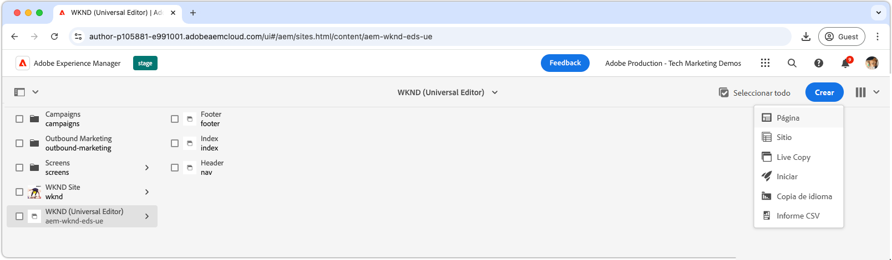
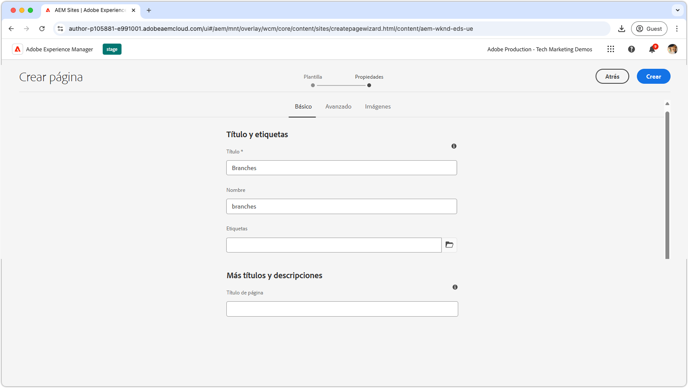
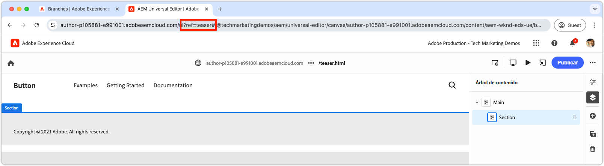
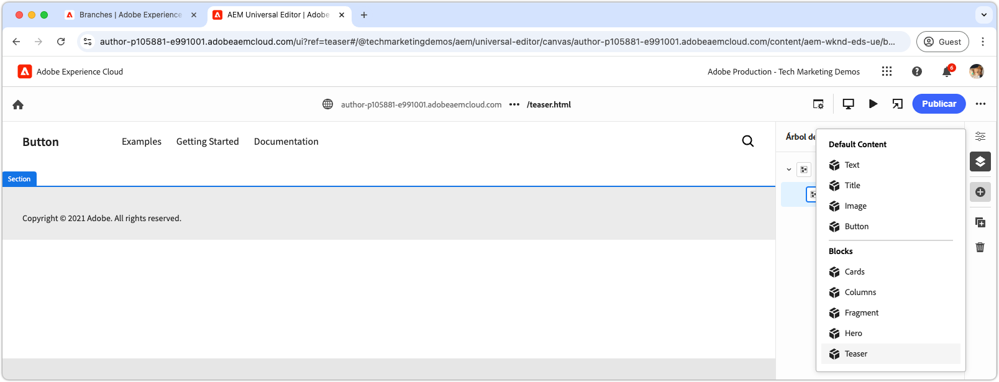
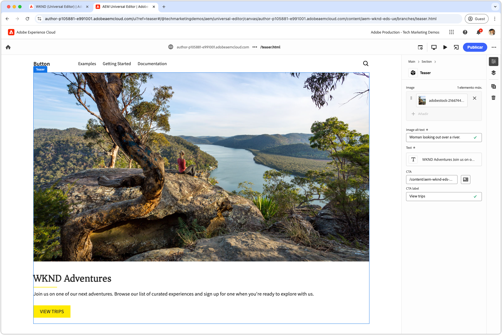
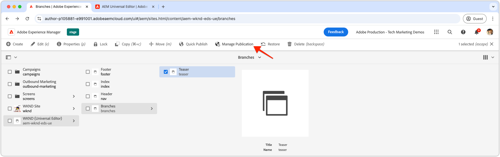

# Crear un bloque

AEM Después de insertar el JSON](./5-new-block.md) del bloque de teaser [en la rama `teaser`, el bloque se vuelve editable en el Editor universal de la.

Crear un bloque en desarrollo es importante por varias razones:

1. Comprueba que la definición y el modelo del bloque son precisos.
1. Permite a los desarrolladores revisar el HTML semántico del bloque, que sirve de base para el desarrollo.
1. Permite la implementación del HTML semántico y de contenido en el entorno de vista previa, lo que permite un desarrollo de bloques más rápido.

## Abra el Editor universal utilizando código de la rama `teaser`

1. AEM Inicie sesión en el autor de la.
2. Vaya a **Sitios** y seleccione el sitio (WKND (Editor universal)) creado en el [capítulo anterior](./2-new-aem-site.md).

   

3. Cree o edite una página para añadir el nuevo bloque, asegurándose de que el contexto esté disponible para apoyar el desarrollo local. Aunque las páginas se pueden crear en cualquier lugar del sitio, a menudo es mejor crear páginas discretas para cada nuevo cuerpo de trabajo. Cree una nueva página de &quot;carpeta&quot; llamada **ramas**. Cada subpágina se utiliza para apoyar el desarrollo de la rama Git con el mismo nombre.

   

4. En la página **Ramas**, cree una nueva página con el título **Teaser**, que coincida con el nombre de la rama de desarrollo, y haga clic en **Abrir** para editar la página.

   

5. Actualice el Editor universal para cargar el código de la rama `teaser` agregando `?ref=teaser` a la dirección URL. Asegúrese de agregar el parámetro de consulta **BEFORE** al símbolo `#`.

   

6. Seleccione la primera sección debajo de **Principal**, haga clic en el botón **agregar** y elija el bloque **Teaser**.

   

7. En el lienzo, seleccione el teaser recién agregado y cree los campos a la derecha o a través de la capacidad de edición en línea.

   

8. Después de completar la creación, cambie a la pestaña del explorador anterior (Administrador de AEM Sites), seleccione la página Teaser, haga clic en **Administrar publicaciones**, elija **Vista previa** y publique los cambios en el entorno de vista previa. Los cambios se publican en el dominio `aem.page` del sitio web.
   

9. http://localhost:3000/branches/teaser AEM Espere a que se publiquen los cambios para obtener una vista previa y, a continuación, abra la página web mediante la [CLI](./3-local-development-environment.md#install-the-aem-cli) de .

   

Ahora, el contenido y el HTML AEM semántico del bloque de teaser creado están disponibles en el sitio web de vista previa, listos para su desarrollo mediante la CLI de la en el entorno de desarrollo local.
