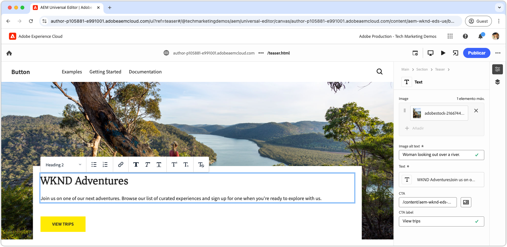

# Desarrollo de un bloque con CSS

Los bloques de los Edge Delivery Services tienen un estilo CSS. El archivo CSS de un bloque se almacena en el directorio del bloque y tiene el mismo nombre que el bloque. Por ejemplo, el archivo CSS de un bloque denominado `teaser` se encuentra en `blocks/teaser/teaser.css`.

Lo ideal es que un bloque solo necesite CSS para el estilo, sin depender de JavaScript para modificar el DOM o agregar clases CSS. La necesidad de JavaScript depende del [modelado de contenido](./5-new-block.md#block-model) del bloque y de su complejidad. Si es necesario, se puede agregar [bloquear JavaScript](./7b-block-js-css.md).

Con un enfoque solo CSS, los elementos semánticos HTML (en su mayoría) vacíos del bloque están dirigidos y diseñados.

## Bloquear HTML

Para comprender cómo aplicar estilo a un bloque, primero revise el DOM expuesto por los Edge Delivery Services, ya que es lo que está disponible para aplicar estilo. AEM El DOM se puede encontrar inspeccionando el bloque servido por el entorno de desarrollo local de la CLI de la. Evite utilizar el DOM del editor universal, ya que difiere ligeramente.

>[!BEGINTABS]

>[!TAB DOM al estilo]

El siguiente es el DOM del bloque de teaser que es el destino para el estilo.

Observe `<p class="button-container">...`, que se [aumenta automáticamente](./4-website-branding.md#inferred-elements) como un elemento deducido por Edge Delivery Services JavaScript.

```html
...
<body>
    <header/>
    <main>
        <div>
            <!-- Start block HTML -->
            <div class="teaser block" data-block-name="teaser" data-block-status="loaded">
                <div>
                    <div>
                        <picture>
                            <source type="image/webp" srcset="./media_15ba2b455e29aca38c1ca653d24c40acaec8a008f.jpeg?width=2000&amp;format=webply&amp;optimize=medium" media="(min-width: 600px)">
                            <source type="image/webp" srcset="./media_15ba2b455e29aca38c1ca653d24c40acaec8a008f.jpeg?width=750&amp;format=webply&amp;optimize=medium">
                            <source type="image/jpeg" srcset="./media_15ba2b455e29aca38c1ca653d24c40acaec8a008f.jpeg?width=2000&amp;format=jpeg&amp;optimize=medium" media="(min-width: 600px)">
                            
                        </picture>
                    </div>
                </div>
                <div>
                    <div>
                        <h2 id="wknd-adventures">WKND Adventures</h2>
                        <p>Join us on one of our next adventures. Browse our list of curated experiences and sign up for one when you're ready to explore with us.</p>
                        <p class="button-container"><a href="/" title="View trips" class="button">View trips</a></p>
                    </div>
                </div>
            </div>     
            <!-- End block HTML -->
        </div>
    </main>
    <footer/>
</body>
...
```

>[!TAB Cómo encontrar el DOM]

Para buscar el DOM al que aplicar estilo, abra la página con el bloque sin estilo en el entorno de desarrollo local, seleccione el bloque e inspeccione el DOM.


>[!ENDTABS]

## Bloquear CSS

Cree un nuevo archivo CSS en la carpeta del bloque, utilizando el nombre del bloque como nombre de archivo. Por ejemplo, para el bloque **teaser**, el archivo se encuentra en `/blocks/teaser/teaser.css`.

Este archivo CSS se carga automáticamente cuando Edge Delivery Services JavaScript detecta un elemento DOM en la página que representa un bloque de teaser.

[!BADGE /blocks/teaser/teaser.css]{type=Neutral tooltip="Nombre de archivo del ejemplo de código siguiente."}

```css
/* /blocks/teaser/teaser.css */

/* Scope each selector in the block with `.block.teaser` to avoid accidental conflicts outside the block */
.block.teaser {
    animation: teaser-fade-in .6s;
    position: relative;
    width: 1600px;
    max-width: 100vw;
    left: 50%; 
    transform: translateX(-50%);
    height: 500px;
}

/* The image is rendered to the first div in the block */
.block.teaser picture {
    position: absolute;
    z-index: -1;
    inset: 0;
    box-sizing: border-box;
}

.block.teaser picture img {
    object-fit: cover;
    object-position: center;
    width: 100%;
    height: 100%;
}

/** 
The teaser's text is rendered to the second (also the last) div in the block.

These styles are scoped to the second (also the last) div in the block (.block.teaser > div:last-child).

This div order can be used to target different styles to the same semantic elements in the block. 
For example, if the block has two images, we could target the first image with `.block.teaser > div:first-child img`, 
and the second image with `.block.teaser > div:nth-child(2) img`.
**/
.block.teaser > div:last-child {
    position: absolute;
    bottom: 0;
    left: 50%;
    transform: translateX(-50%);
    background: var(--background-color);
    padding: 1.5rem 1.5rem 1rem;
    width: 80vw;
    max-width: 1200px;
}

/** 
The following elements reside within `.block.teaser > div:last-child` and could be scoped as such, for example:

 .block.teaser > div:last-child p { .. }

However since these element can only appear in the second/last div per our block's model, it's unnecessary to add this additional scope.
**/

/* Regardless of the authored heading level, we only want one style the heading */
.block.teaser h1,
.block.teaser h2,
.block.teaser h3,
.block.teaser h4,
.block.teaser h5,
.block.teaser h6 {
    font-size: var(--heading-font-size-xl);
    margin: 0;
}

.block.teaser h1::after,
.block.teaser h2::after,
.block.teaser h3::after,
.block.teaser h4::after,
.block.teaser h5::after,
.block.teaser h6::after {
    border-bottom: 0;
}

.block.teaser p {
    font-size: var(--body-font-size-s);
    margin-bottom: 1rem;
}

/* Add underlines to links in the text */
.block.teaser a:hover {
    text-decoration: underline;
}

/* Add specific spacing to buttons. These button CSS classes are automatically added by Edge Delivery Services. */
.block.teaser .button-container {
    margin: 0;
    padding: 0;
}

.block.teaser .button {
    background-color: var(--primary-color);
    border-radius: 0;
    color: var(--dark-color);
    font-size: var(--body-font-size-xs);
    font-weight: bold;
    padding: 1em 2.5em;
    margin: 0;
    text-transform: uppercase;
}

/** Animations 
    Scope the @keyframes to the block (teaser) to avoid accidental conflicts outside the block

    Global @keyframes can defines in styles/styles.css and used in this file.
**/

@keyframes teaser-fade-in {
    from {
        opacity: 0;
    }

    to {
        opacity: 1;
    }
}
```

## Previsualización de desarrollo

AEM A medida que el CSS se escribe en el proyecto de código, la recarga en caliente de la CLI es la que realiza los cambios, lo que facilita y agiliza la comprensión de cómo el CSS afecta al bloque.


## Vincular el código

Asegúrate de [pelar con frecuencia](./3-local-development-environment.md#linting) los cambios de tu código para asegurarte de que esté limpio y sea consistente. La vinculación ayuda a detectar los problemas de forma temprana y reduce el tiempo de desarrollo general. Recuerde, no puede combinar su trabajo de desarrollo con `main` hasta que se resuelvan todos los problemas de vinculación.

```bash
# ~/Code/aem-wknd-eds-ue

$ npm run lint:css
```

## Vista previa en el editor universal

AEM Para ver los cambios en el Editor universal de Git de la aplicación, agregue, confirme e inserte los cambios en la rama del repositorio de Git utilizada por el Editor universal. Este paso ayuda a garantizar que la implementación de bloques no interrumpa la experiencia de creación.

```bash
# ~/Code/aem-wknd-eds-ue

$ git add .
$ git commit -m "Add CSS-only implementation for teaser block"
$ git push origin teaser
```

Ahora puede obtener una vista previa de los cambios en el Editor universal al agregar el parámetro de consulta `?ref=teaser`.



