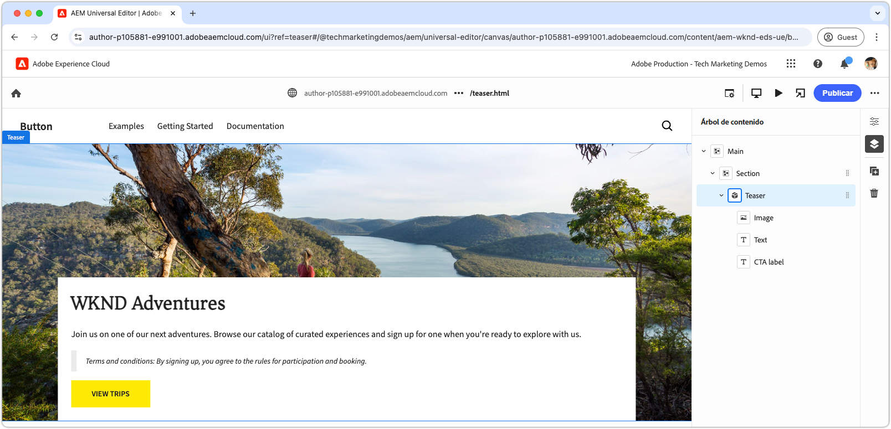

# Desarrollo de un bloque con CSS y JavaScript

En el [capítulo anterior](./7b-block-js-css.md), se abordó cómo aplicar estilos a un bloque utilizando únicamente CSS. Ahora, el enfoque cambia al desarrollo de un bloque con JavaScript y CSS.

En este ejemplo se muestra cómo mejorar un bloque de tres formas:

1. Añadiendo clases CSS personalizadas.
1. Usando detectores de eventos para añadir movimiento.
1. Manejando términos y condiciones que se pueden incluir opcionalmente en el texto del teaser.

## Casos de uso comunes

Este enfoque es especialmente útil en los siguientes casos:

- **Administración de CSS externa:** cuando el CSS del bloque se administra fuera de Edge Delivery Services y no se alinea con su estructura HTML.
- **Atributos adicionales:** cuando se requieren atributos adicionales, como [ARIA](https://developer.mozilla.org/es-ES/docs/Web/Accessibility/ARIA) para la accesibilidad o los [microdatos](https://developer.mozilla.org/en-US/docs/Web/HTML/Microdata).
- **Mejoras de JavaScript:** cuando se necesitan características interactivas, como detectores de eventos.

Este método se basa en la manipulación DOM de JavaScript nativa del explorador, pero requiere actuar con precaución al modificar el DOM, especialmente al mover elementos. Estos cambios pueden interrumpir la experiencia de creación del editor universal. Lo ideal es que el [modelo de contenido](./5-new-block.md#block-model) del bloque se diseñara cuidadosamente para minimizar la necesidad de realizar modificaciones extensas en el DOM.

## Bloquear HTML

Para abordar el desarrollo de bloques, comience por revisar el DOM expuesto por Edge Delivery Services. La estructura se ha mejorado con JavaScript y se diseña con CSS.

>[!BEGINTABS]

>[!TAB DOM para decorar]

A continuación, se muestra el DOM del bloque de teaser, que es el objetivo a decorar con JavaScript y CSS.

```html
...
<body>
    <header/>
    <main>
        <div>
            <!-- Start block HTML -->
            <div class="teaser block" data-block-name="teaser" data-block-status="loaded">
                <div>
                    <div>
                    <picture>
                        <source type="image/webp" srcset="./media_15ba2b455e29aca38c1ca653d24c40acaec8a008f.jpeg?width=2000&amp;format=webply&amp;optimize=medium" media="(min-width: 600px)">
                        <source type="image/webp" srcset="./media_15ba2b455e29aca38c1ca653d24c40acaec8a008f.jpeg?width=750&amp;format=webply&amp;optimize=medium">
                        <source type="image/jpeg" srcset="./media_15ba2b455e29aca38c1ca653d24c40acaec8a008f.jpeg?width=2000&amp;format=jpeg&amp;optimize=medium" media="(min-width: 600px)">
                        
                    </picture>
                    </div>
                </div>
                <div>
                    <div>
                    <h2 id="wknd-adventures">WKND Adventures</h2>
                    <p>Join us on one of our next adventures. Browse our list of curated experiences and sign up for one when you're ready to explore with us.</p>
                    <p class="button-container"><a href="/" title="View trips" class="button">View trips</a></p>
                    </div>
                </div>
            </div>     
            <!-- End block HTML -->
        </div>
    </main>
    <footer/>
</body>
...
```

>[!TAB Cómo encontrar el DOM]

Para encontrar el DOM para decorar, abra la página con el bloque sin decorar en su entorno de desarrollo local, seleccione el bloque e inspeccione el DOM.


>[!ENDTABS]


## Bloquear JavaScript

Para añadir la funcionalidad de JavaScript a un bloque, cree un archivo JavaScript en el directorio del bloque con el mismo nombre que el bloque, por ejemplo, `/blocks/teaser/teaser.js`.

El archivo JavaScript debe exportar una función predeterminada:

```javascript
export default function decorate(block) { ... }
```

La función predeterminada toma el elemento o árbol del DOM que representa el bloque en Edge Delivery Services HTML y contiene el JavaScript personalizado que se ejecuta cuando se procesa el bloque.

Este ejemplo de JavaScript realiza tres acciones principales:

1. Añade un detector de eventos al botón de CTA, ampliando la imagen al pasar el ratón por encima.
1. Añade clases CSS semánticas a los elementos del bloque, lo que resulta útil al integrar sistemas de diseño CSS existentes.
1. Añade una clase CSS especial a los párrafos que comienzan por `Terms and conditions:`.

[!BADGE /blocks/teaser/teaser.js]{type=Neutral tooltip="Nombre de archivo del ejemplo de código siguiente."}

```javascript
/* /blocks/teaser/teaser.js */

/**
 * Adds a zoom effect to image using event listeners.
 *
 * When the CTA button is hovered over, the image zooms in.
 *
 * @param {HTMLElement} block represents the block's' DOM tree
 */
function addEventListeners(block) {
  block.querySelector('.button').addEventListener('mouseover', () => {
    block.querySelector('.image').classList.add('zoom');
  });

  block.querySelector('.button').addEventListener('mouseout', () => {
    block.querySelector('.image').classList.remove('zoom');
  });
}

/**
   * Entry point to block's JavaScript.
   * Must be exported as default and accept a block's DOM element.
   * This function is called by the project's style.js, and passed the block's element.
   *
   * @param {HTMLElement} block represents the block's' DOM element/tree
   */
export default function decorate(block) {
  /* This JavaScript makes minor adjustments to the block's DOM */

  // Dress the DOM elements with semantic CSS classes so it's obvious what they are.
  // If needed we could also add ARIA roles and attributes, or add/remove/move DOM elements.

  // Add a class to the first picture element to target it with CSS
  block.querySelector('picture').classList.add('image-wrapper');

  // Use previously applied classes to target new elements
  block.querySelector('.image-wrapper img').classList.add('image');

  // Mark the second/last div as the content area (white, bottom aligned box w/ text and cta)
  block.querySelector(':scope > div:last-child').classList.add('content');

  // Mark the first H1-H6 as a title
  block.querySelector('h1,h2,h3,h4,h5,h6').classList.add('title');

  // Process each paragraph and mark it as text or terms-and-conditions
  block.querySelectorAll('p').forEach((p) => {
    const innerHTML = p.innerHTML?.trim();

    // If the paragraph starts with Terms and conditions: then style it as such
    if (innerHTML?.startsWith("Terms and conditions:")) {
      /* If a paragraph starts with '*', add a special CSS class. */
      p.classList.add('terms-and-conditions');
    }
  });

  // Add event listeners to the block
  addEventListeners(block);
}
```

## Bloquear CSS

Si creó un `teaser.css` en el [capítulo anterior](./7a-block-css.md), elimínelo o renómbrelo a `teaser.css.bak`, ya que este capítulo implementa CSS diferente para el bloque de teaser.

Cree un archivo `teaser.css` dentro de la carpeta del bloque. Este archivo contiene el código CSS que aplica el estilo al bloque. Este código CSS se dirige a los elementos del bloque y a las clases CSS semánticas específicas añadidas por JavaScript en `teaser.js`.

Los elementos básicos se pueden seguir diseñando directamente o con las clases CSS aplicadas personalizadas. En el caso de bloques más complejos, la aplicación de clases CSS semánticas puede ayudar a que el CSS sea más comprensible y mantenible, especialmente cuando se trabaja con equipos más grandes durante períodos de tiempo más largos.

[Al igual que antes de ](./7a-block-css.md#develop-a-block-with-css), limite el ámbito de CSS a `.block.teaser` mediante el [anidamiento de CSS](https://developer.mozilla.org/es-ES/docs/Web/CSS/CSS_nesting) para evitar conflictos con otros bloques.

[!BADGE /blocks/teaser/teaser.css]{type=Neutral tooltip="Nombre de archivo del ejemplo de código siguiente."}

```css
/* /blocks/teaser/teaser.css */

/* Scope each selector in the block with `.block.teaser` to avoid accidental conflicts outside the block */
.block.teaser {
    animation: teaser-fade-in 1s;
    position: relative;
    width: 1600px;
    max-width: 100vw;
    left: 50%; 
    transform: translateX(-50%);
    height: 500px;
    overflow: hidden; 

    /* The teaser image */
    .image-wrapper {
        position: absolute;
        z-index: -1;
        inset: 0;
        box-sizing: border-box;
        overflow: hidden; 

        .image {
            object-fit: cover;
            object-position: center;
            width: 100%;
            height: 100%;
            transform: scale(1); 
            transition: transform 0.6s ease-in-out;

            .zoom {
                transform: scale(1.1);
            }            
        }
    }

    /* The teaser text content */
    .content {
        position: absolute;
        bottom: 0;
        left: 50%;
        transform: translateX(-50%);
        background: var(--background-color);
        padding: 1.5rem 1.5rem 1rem;
        width: 80vw;
        max-width: 1200px;
  
        .title {
            font-size: var(--heading-font-size-xl);
            margin: 0;
        }

        .title::after {
            border-bottom: 0;
        }

        p {
            font-size: var(--body-font-size-s);
            margin-bottom: 1rem;
            animation: teaser-fade-in .6s;
        
            &.terms-and-conditions {
                font-size: var(--body-font-size-xs);
                color: var(--secondary-color);
                padding: .5rem 1rem;
                font-style: italic;
                border: solid var(--light-color);
                border-width: 0 0 0 10px;
            }
        }

        /* Add underlines to links in the text */
        a:hover {
            text-decoration: underline;
        }

        /* Add specific spacing to buttons. These button CSS classes are automatically added by Edge Delivery Services. */
        .button-container {
            margin: 0;
            padding: 0;
        
            .button {   
                background-color: var(--primary-color);
                border-radius: 0;
                color: var(--dark-color);
                font-size: var(--body-font-size-xs);
                font-weight: bold;
                padding: 1em 2.5em;
                margin: 0;
                text-transform: uppercase;
            }
        }
    }
}

/** Animations 
    Scope the @keyframes to the block (teaser) to avoid accidental conflicts outside the block

    Global @keyframes can defines in styles/styles.css and used in this file.
**/
@keyframes teaser-fade-in {
    from {
        opacity: 0;
    }

    to {
        opacity: 1;
    }
}
```

## Añadir términos y condiciones

La implementación anterior añade compatibilidad con párrafos con un estilo especial que comienzan con el texto `Terms and conditions:`. Para validar esta funcionalidad, en el editor universal, actualice el contenido de texto del bloque de teaser para incluir términos y condiciones.

Siga los pasos del [autor de un bloque](./6-author-block.md) y edite el texto para incluir un párrafo de **términos y condiciones** al final:

```
WKND Adventures

Join us on one of our next adventures. Browse our list of curated experiences and sign up for one when you're ready to explore with us.

Terms and conditions: By signing up, you agree to the rules for participation and booking.
```

Compruebe que el párrafo se representa con el estilo de los términos y condiciones en el entorno de desarrollo local. Recuerde, estos cambios de código no se reflejan en el editor universal hasta que se [insertan en una rama de GitHub](#preview-in-universal-editor) que el editor universal ha configurado para su uso.

## Previsualización de desarrollo

A medida que se añaden CSS y JavaScript, el entorno de desarrollo local de la CLI de AEM vuelve a cargar los cambios, lo que permite una visualización rápida y sencilla del impacto del código en el bloque. Pase el ratón sobre el CTA y compruebe que la imagen del teaser se amplía y reduce.


## Limpie su código

Asegúrese de [limpiar con frecuencia](./3-local-development-environment.md#linting) los cambios del código para mantenerlo limpio y consistente. La limpieza regular ayuda a detectar los problemas de forma temprana, lo que reduce el tiempo de desarrollo general. Recuerde, no puede combinar su trabajo de desarrollo en la rama `main` hasta que se resuelvan todos los problemas de limpieza.

```bash
# ~/Code/aem-wknd-eds-ue

$ npm run lint
```

## Vista previa en el Editor universal

Para ver los cambios en el editor universal de AEM, añádalos, confírmelos y envíelos a la rama del repositorio de Git utilizada por el editor universal. De esta manera se garantiza que la implementación de bloques no interrumpa la experiencia de creación.

```bash
# ~/Code/aem-wknd-eds-ue

$ git add .
$ git commit -m "CSS and JavaScript implementation for teaser block"
$ git push origin teaser
```

Ahora puede obtener una vista previa de los cambios en el editor universal al añadir el parámetro de consulta `?ref=teaser`.


