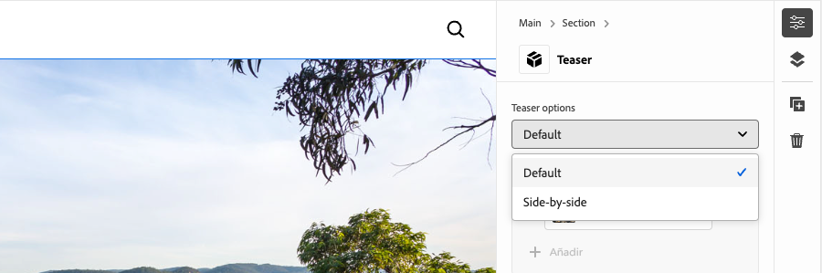
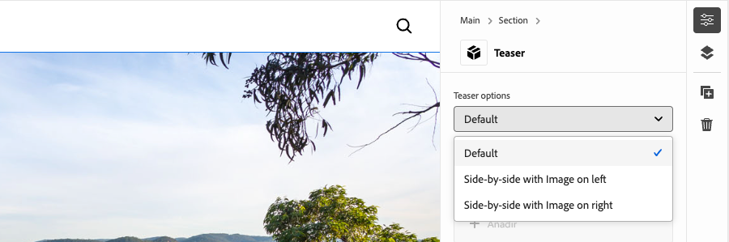
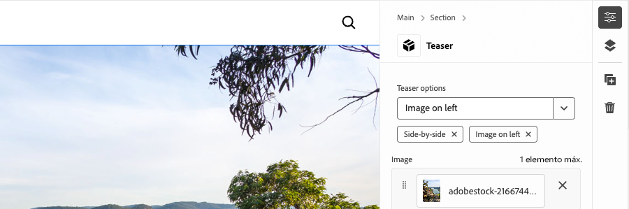
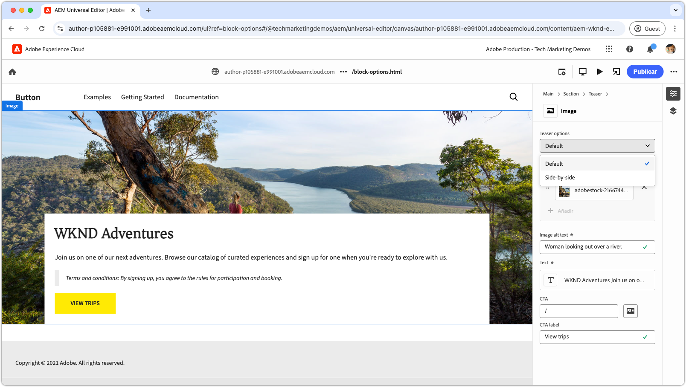
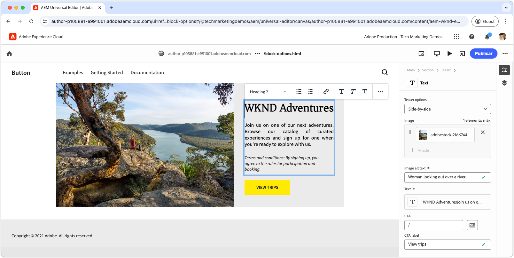

# Desarrollo de un bloque con opciones

Este tutorial se basa en el tutorial de Edge Delivery Services y editor universal que le guía a través del proceso de añadir opciones de bloque a un bloque. Al definir las opciones de bloque, puede personalizar el aspecto y la funcionalidad de un bloque, lo que permite diferentes variaciones para adaptarlas a diversas necesidades de contenido. Esto permite una mayor flexibilidad y reutilización dentro del sistema de diseño del sitio.

{align="center"}

En este tutorial, agregará opciones de bloque al bloque Teaser, lo que permite a los autores elegir entre dos opciones de visualización: **Predeterminado** y **En paralelo**. La opción **Default** muestra la imagen encima y detrás del texto, mientras que la opción **Side-by-side** muestra la imagen y el texto uno al lado del otro.

## Casos de uso comunes

Los casos de uso comunes para usar **Opciones de bloque** en el desarrollo de **Edge Delivery Services** y **Editor universal** incluyen, entre otros:

1. **Variaciones de diseño:** Cambiar fácilmente entre diseños. Por ejemplo, horizontal vs. vertical o cuadrícula vs. lista.
2. **Variaciones de estilo:** Cambie fácilmente entre temas o tratamientos visuales. Por ejemplo, modo claro u oscuro, o texto grande frente a texto pequeño.
3. **Control de visualización de contenido:** alternar visibilidad de elementos o cambiar entre estilos de contenido (compacto vs. detallado).

Estas opciones ofrecen flexibilidad y eficiencia para crear bloques dinámicos y adaptables.

Este tutorial muestra el caso de uso de las variaciones de diseño, en el que el bloque Teaser se puede mostrar en dos diseños diferentes: **Default** y **Side-by-side**.

## Modelo de bloque

Para agregar opciones de bloque al bloque Teaser, abra su fragmento JSON en `/block/teaser/_teaser.json` y agregue un nuevo campo a la definición del modelo. Este campo establece su propiedad `name` en `classes`, que es un campo protegido utilizado por AEM para almacenar opciones de bloque, que se aplican al HTML de Edge Delivery Services del bloque.

### Configuraciones de campo

Las pestañas siguientes ilustran varias formas de configurar las opciones de bloque en el modelo de bloques, incluida la selección única con una sola clase CSS, la selección única con varias clases CSS y la selección múltiple con varias clases CSS. Este tutorial [implementa el método más sencillo](#field-configuration-for-this-tutorial) utilizado en **seleccionar con una sola clase CSS**.

>[!BEGINTABS]

>[!TAB Seleccionar con una sola clase CSS]

Este tutorial muestra cómo utilizar un tipo de entrada `select` (desplegable) para permitir que los autores elijan una sola opción de bloque, que luego se aplica como una sola clase CSS correspondiente.

{align="center"}

#### Modelo de bloque

La opción **Default** está representada por una cadena vacía (`""`), mientras que la opción **Side-by-Side** usa `"side-by-side"`. **name** y **value** de la opción no tienen por qué ser iguales, pero **value** determina las clases CSS aplicadas al HTML del bloque. Por ejemplo, el valor de la opción **lado a lado** podría ser `layout-10` en lugar de `side-by-side`. Sin embargo, es mejor utilizar nombres semánticamente significativos para las clases CSS, lo que garantiza la claridad y coherencia en los valores de las opciones.

[!BADGE /blocks/teaser/_teaser.json]{type=Neutral tooltip="Nombre de archivo del ejemplo de código siguiente."}

```json{highlight="4,8,9-18"}
...
"fields": [
    {
        "component": "select",
        "name": "classes",
        "value": "",
        "label": "Teaser options",
        "valueType": "string",
        "options": [
            {
                "name": "Default",
                "value": ""
            },
            {
                "name": "Side-by-side",
                "value": "side-by-side"
            }
        ]
    }
]
...
```

#### Bloquear HTML

Cuando el autor selecciona una opción, el valor correspondiente se agrega como clase CSS a la HTML del bloque:

- Si se selecciona **Predeterminado**:

  ```html
  <div class="block teaser">
      <!-- Block content here -->
  </div>
  ```

- Si se selecciona **en paralelo**:

  ```html
  <div class="block teaser side-by-side">
      <!-- Block content here -->
  </div>
  ```

Esto permite aplicar diferentes estilos y JavaScript condicional según la apertura elegida.


>[!TAB Seleccionar con varias clases CSS]

**Este método no se usa en este tutorial, pero ilustra un método alternativo y opciones de bloque avanzadas.**

El tipo de entrada `select` permite a los autores elegir una sola opción de bloque, que puede asignarse opcionalmente a varias clases CSS. Para conseguirlo, enumere las clases CSS como valores delimitados por espacios.

{align="center"}

#### Modelo de bloque

Por ejemplo, la opción **en paralelo** puede admitir variaciones en las que la imagen aparece a la izquierda (`side-by-side left`) o a la derecha (`side-by-side right`).

[!BADGE /blocks/teaser/_teaser.json]{type=Neutral tooltip="Nombre de archivo del ejemplo de código siguiente."}

```json{highlight="4,8,9-21"}
...
"fields": [
    {
        "component": "select",
        "name": "classes",
        "value": "",
        "label": "Teaser options",
        "valueType": "string",
        "options": [
            {
                "name": "Default",
                "value": ""
            },
            {
                "name": "Side-by-side with Image on left",
                "value": "side-by-side left"
            },
            {
                "name": "Side-by-side with Image on right",
                "value": "side-by-side right"
            }
        ]
    }
]
...
```

#### Bloquear HTML

Cuando el autor selecciona una opción, el valor correspondiente se aplica como un conjunto de clases CSS separadas por espacios en la HTML del bloque:

- Si se selecciona **Predeterminado**:

  ```html
  <div class="block teaser">
      <!-- Block content here -->
  </div>
  ```

- Si **está seleccionado en paralelo con la imagen a la izquierda**:

  ```html
  <div class="block teaser side-by-side left">
      <!-- Block content here -->
  </div>
  ```

- Si **está seleccionado en paralelo con la imagen a la derecha**:

  ```html
  <div class="block teaser side-by-side right">
      <!-- Block content here -->
  </div>
  ```

Esto permite aplicar diferentes estilos y JavaScript condicional según la opción elegida.


>[!TAB Selección múltiple con varias clases CSS]

**Este método no se usa en este tutorial, pero ilustra un método alternativo y opciones de bloque avanzadas.**

El tipo de entrada de `"component": "multiselect"` permite al autor seleccionar varias opciones simultáneamente. Esto permite permutaciones complejas del aspecto del bloque al combinar varias opciones de diseño.

{align="center"}

### Modelo de bloque

Por ejemplo, **en paralelo**, **Imagen a la izquierda** e **Imagen a la derecha** pueden admitir variaciones en las que la imagen se coloque a la izquierda (`side-by-side left`) o a la derecha (`side-by-side right`).

[!BADGE /blocks/teaser/_teaser.json]{type=Neutral tooltip="Nombre de archivo del ejemplo de código siguiente."}

```json{highlight="4,6,8,10-21"}
...
"fields": [
    {
        "component": "multiselect",
        "name": "classes",
        "value": [],
        "label": "Teaser options",
        "valueType": "array",
        "options": [
            {
                "name": "Side-by-side",
                "value": "side-by-side"
            },
            {
                "name": "Image on left",
                "value": "left"
            },
            {
                "name": "Image on right",
                "value": "right"
            }
        ]
    }
]
...
```

#### Bloquear HTML

Cuando el autor selecciona varias opciones, los valores correspondientes se aplican como clases CSS separadas por espacios en la HTML del bloque:

- Si se seleccionan **uno al lado del otro** y **Imagen a la izquierda**:

  ```html{highlight="1"}
  <div class="block teaser side-by-side left">
      <!-- Block content here -->
  </div>
  ```

- Si se seleccionan **una al lado de la otra** y **Imagen a la derecha**:

  ```html{highlight="1"}
  <div class="block teaser side-by-side right">
      <!-- Block content here -->
  </div>
  ```

Aunque la selección múltiple ofrece flexibilidad, introduce complejidad en la administración de permutaciones de diseño. Sin restricciones, las selecciones conflictivas pueden provocar experiencias rotas o fuera de la marca.

Por ejemplo:

- **Imagen a la izquierda** o **Imagen a la derecha** sin seleccionar **Lado a lado** los aplica implícitamente a **Predeterminado**, que siempre establece la imagen como fondo, por lo que la alineación izquierda y derecha son irrelevantes.
- Seleccionar **Imagen a la izquierda** e **Imagen a la derecha es** contradictorio.
- Seleccionar **uno al lado del otro** sin **Imagen a la izquierda** o **Imagen a la derecha** puede considerarse ambiguo, ya que la posición de la imagen no está especificada.

Para evitar problemas y confusión de autores al utilizar la selección múltiple, asegúrese de que las opciones estén bien planificadas y que todas las permutaciones se hayan probado. La selección múltiple funciona mejor para mejoras sencillas y sin conflictos, como &quot;grande&quot; o &quot;resaltado&quot;, en lugar de para opciones que modifican el diseño.


>[!TAB Opción predeterminada]

**Este método no se usa en este tutorial, pero ilustra un método alternativo y opciones de bloque avanzadas.**

Las opciones de bloque se pueden establecer como predeterminadas al agregar una nueva instancia de bloque a una página en el Editor universal. Esto se hace estableciendo el valor predeterminado de la propiedad `classes` en la definición del bloque [block](../5-new-block.md#block-definition).

#### Definición de bloque

En el ejemplo siguiente, la opción predeterminada se establece en **En paralelo** al asignar la propiedad `value` del campo `classes` a `side-by-side`. La entrada de la opción de bloque correspondiente en el modelo de bloque es opcional.

También puede definir varias entradas para el mismo bloque, cada una con un nombre y una clase diferentes. Esto permite al editor universal mostrar distintas entradas de bloque, cada una preconfigurada con una opción de bloque específica. Aunque estos aparecen como bloques independientes en el editor, la base de código contiene un solo bloque que se procesa dinámicamente en función de la opción seleccionada.

[!BADGE /blocks/teaser/_teaser.json]{type=Neutral tooltip="Nombre de archivo del ejemplo de código siguiente."}

```json{highlight="12"}
{
    "definitions": [{
      "title": "Teaser",
      "id": "teaser",
      "plugins": {
        "xwalk": {
          "page": {
            "resourceType": "core/franklin/components/block/v1/block",
            "template": {
              "name": "Teaser",
              "model": "teaser",
              "classes": "side-by-side",
              "textContent_text": "<h2>Enter a title</h2><p>...and body text here!</p>",
              "textContent_cta": "/",
              "textContent_ctaText": "Click me!"
            }
          }
        }
      }
    }],
    "models": [... from previous section ...],
    "filters": []
}
```

>[!ENDTABS]


### Configuración de campo para este tutorial


En este tutorial, usaremos el enfoque de seleccionar con una sola clase CSS descrito arriba en la primera pestaña, que permite dos opciones de bloque discreto: **Predeterminado** y **En paralelo**.

En la definición del modelo dentro del fragmento JSON del bloque, añada un solo campo de selección para las opciones del bloque. Este campo permite a los autores elegir entre el diseño predeterminado y un diseño en paralelo.

[!BADGE /blocks/teaser/_teaser.json]{type=Neutral tooltip="Nombre de archivo del ejemplo de código siguiente."}

```json{highlight="7-24"}
{
    "definitions": [...],
    "models": [
        {
            "id": "teaser", 
            "fields": [
                {
                    "component": "select",
                    "name": "classes",
                    "value": "",
                    "label": "Teaser options",
                    "description": "",
                    "valueType": "string",
                    "options": [
                        {
                            "name": "Default",
                            "value": ""
                        },
                        {
                            "name": "Side-by-side",
                            "value": "side-by-side"
                        }
                    ]
                },
                {
                    "component": "reference",
                    "valueType": "string",
                    "name": "image",
                    "label": "Image",
                    "multi": false
                },
                {
                    "component": "text",
                    "valueType": "string",
                    "name": "imageAlt",
                    "label": "Image alt text",
                    "required": true
                },
                {
                    "component": "richtext",
                    "name": "textContent_text",
                    "label": "Text",
                    "valueType": "string",
                    "required": true
                },
                {
                    "component": "aem-content",
                    "name": "textContent_cta",
                    "label": "CTA",
                    "valueType": "string"
                },
                {
                    "component": "text",
                    "name": "textContent_ctaText",
                    "label": "CTA label",
                    "valueType": "string"
                }
            ]
        }
    ],
    "filters": []
}
```

## Actualizar bloque en el editor universal

Para que la entrada de opciones de bloque actualizadas esté disponible en el Editor universal, implemente los cambios de código JSON en GitHub, cree una nueva página, agregue y cree el bloque Teaser con la opción **Side-by-Side** y, a continuación, publique la página para previsualizarla. Una vez publicada, cargue la página en el entorno de desarrollo local para codificarla.

### Insertar cambios en GitHub

Para que la entrada de opciones de bloque actualizadas esté disponible en el Editor universal para establecer opciones de bloque y desarrollar con la HTML resultante, el proyecto debe estar vinculado y los cambios deben insertarse en una rama de GitHub, en este caso, la rama `block-options`.

```bash
# ~/Code/aem-wknd-eds-ue

# Lint the changes to catch any syntax errors
$ npm run lint 

$ git add .
$ git commit -m "Add Teaser block option to JSON file so it is available in Universal Editor"
$ git push origin teaser
```

### Creación de una página de prueba

En el servicio de AEM Author, cree una nueva página para agregar el bloque Teaser para desarrollo. Siguiendo la convención del capítulo [Crear un bloque](../6-author-block.md) del tutorial para desarrolladores de [Edge Delivery Services y Universal Editor](../0-overview.md), cree una página de prueba en una página `branches`, poniéndole el nombre de la rama Git en la que esté trabajando (en este caso, `block-options`).

### Crear el bloque

Edite la nueva página **Opciones de bloque** en el editor universal y agregue el bloque **Teaser**. Asegúrese de agregar el parámetro de consulta `?ref=block-options` a la dirección URL para cargar la página con el código de la rama de GitHub `block-options`,

El cuadro de diálogo de bloque ahora incluye una lista desplegable de **Opciones de teaser** con **Opciones predeterminadas** y **selecciones en paralelo**. Elija **en paralelo** y complete el resto de la creación de contenido.

{align="center"}

Opcionalmente, agregue dos bloques de **Teaser**: uno establecido en **Predeterminado** y el otro en **En paralelo**. Esto le permite obtener una vista previa de ambas opciones en paralelo durante el desarrollo y garantiza que la implementación de **Side-by-Side** no afecte a la opción **Default**.

### Publicar para previsualización

Una vez agregado el bloque Teaser a la página, [publique la página para obtener una vista previa](../6-author-block.md) con **Administrar publicaciones** y el administrador del sitio del autor de AEM.

## Bloquear HTML

Para comenzar el desarrollo del bloque, comience por revisar la estructura DOM expuesta en la vista previa de Edge Delivery Services. El DOM se mejora con JavaScript y se diseña con CSS, lo que proporciona la base para crear y personalizar el bloque.

>[!BEGINTABS]

>[!TAB DOM para decorar]

El siguiente es el DOM del bloque Teaser, con la opción de bloque **Side-by-side** seleccionada, que es el destino a decorar usando JavaScript y CSS.

```html{highlight="7"}
...
<body>
    <header/>
    <main>
        <div>
            <!-- Start block HTML -->
            <div class="teaser block side-by-side" data-block-name="teaser" data-block-status="loaded">
                <div>
                    <div>
                    <picture>
                        <source type="image/webp" srcset="./media_15ba2b455e29aca38c1ca653d24c40acaec8a008f.jpeg?width=2000&amp;format=webply&amp;optimize=medium" media="(min-width: 600px)">
                        <source type="image/webp" srcset="./media_15ba2b455e29aca38c1ca653d24c40acaec8a008f.jpeg?width=750&amp;format=webply&amp;optimize=medium">
                        <source type="image/jpeg" srcset="./media_15ba2b455e29aca38c1ca653d24c40acaec8a008f.jpeg?width=2000&amp;format=jpeg&amp;optimize=medium" media="(min-width: 600px)">
                        
                    </picture>
                    </div>
                </div>
                <div>
                    <div>
                    <h2 id="wknd-adventures">WKND Adventures</h2>
                    <p>Join us on one of our next adventures. Browse our list of curated experiences and sign up for one when you're ready to explore with us.</p>
                    <p>Terms and conditions: By signing up, you agree to the rules for participation and booking.</p>
                    <p class="button-container"><a href="/" title="View trips" class="button">View trips</a></p>
                    </div>
                </div>
            </div>     
            <!-- End block HTML -->
        </div>
    </main>
    <footer/>
</body>
...
```

>[!TAB Cómo encontrar el DOM]

Para encontrar el DOM que decorar, abra la página con el bloque en su entorno de desarrollo local, seleccione el bloque con las herramientas para desarrolladores del explorador web e inspeccione el DOM. Esto le permitirá identificar los elementos relevantes para decorar.

{align="center"}

>[!ENDTABS]

## Bloquear CSS

Edite `blocks/teaser/teaser.css` para agregar estilos CSS específicos para la opción **En paralelo**. Este archivo contiene el CSS predeterminado para el bloque.

Para modificar los estilos de la opción **Side-by-Side**, agregue una nueva regla CSS de ámbito en el archivo `teaser.css` que identifica los bloques de teaser configurados con la clase `side-by-side`.

```css
.block.teaser.side-by-side { ... }
```

También puede utilizar el anidamiento CSS para una versión más concisa:

```css
.block.teaser {
    ... Default teaser block styles ...

    &.side-by-side {
        ... Side-by-side teaser block styles ...
    }
}
```

En la regla `&.side-by-side`, agregue las propiedades CSS necesarias para aplicar estilo al bloque cuando se aplique la clase `side-by-side`.

Un enfoque común es restablecer los estilos predeterminados aplicando `all: initial` a los selectores compartidos y, a continuación, agregando los estilos necesarios para la variante `side-by-side`. Si la mayoría de los estilos se comparten entre opciones, puede que sea más fácil anular propiedades específicas. Sin embargo, si varios selectores necesitan cambios, restablecer todos los estilos y volver a aplicar solo los necesarios puede hacer que el código sea más claro y fácil de mantener.
[!BADGE /blocks/teaser/teaser.css]{type=Neutral tooltip="Nombre de archivo del ejemplo de código siguiente."}

```css
/* /blocks/teaser/teaser.css */

/* Scope each selector in the block with `.block.teaser` to avoid accidental conflicts outside the block */
.block.teaser {
    animation: teaser-fade-in 1s;
    position: relative;
    width: 1600px;
    max-width: 100vw;
    left: 50%; 
    transform: translateX(-50%);
    height: 500px;
    overflow: hidden; 


    /* The teaser image */
    .image-wrapper {
        position: absolute;
        z-index: -1;
        inset: 0;
        box-sizing: border-box;
        overflow: hidden; 

        .image {
            object-fit: cover;
            object-position: center;
            width: 100%;
            height: 100%;
            transform: scale(1); 
            transition: transform 0.6s ease-in-out;

            .zoom {
                transform: scale(1.1);
            }            
        }
    }

    /* The teaser text content */
    .content {
        position: absolute;
        bottom: 0;
        left: 50%;
        transform: translateX(-50%);
        background: var(--background-color);
        padding: 1.5rem 1.5rem 1rem;
        width: 80vw;
        max-width: 1200px;
  
        .title {
            font-size: var(--heading-font-size-xl);
            margin: 0;
        }

        .title::after {
            border-bottom: 0;
        }

        p {
            font-size: var(--body-font-size-s);
            margin-bottom: 1rem;
            animation: teaser-fade-in .6s;
        }

        p.terms-and-conditions {
            font-size: var(--body-font-size-xs);
            color: var(--secondary-color);
            padding: .5rem 1rem;
            font-style: italic;
            border: solid var(--light-color);
            border-width: 0 0 0 10px;
        }

        /* Add underlines to links in the text */
        a:hover {
            text-decoration: underline;
        }

        /* Add specific spacing to buttons. These button CSS classes are automatically added by Edge Delivery Services. */
        .button-container {
            margin: 0;
            padding: 0;        

            .button {   
                background-color: var(--primary-color);
                border-radius: 0;
                color: var(--dark-color);
                font-size: var(--body-font-size-xs);
                font-weight: bold;
                padding: 1em 2.5em;
                margin: 0;
                text-transform: uppercase;
            }
        }
    }

    /**
    *  Add styling for the side-by-side variant 
    **/

    /* This evaluates to .block.teaser.side-by-side */
    &.side-by-side {    
        /* Since this default teaser option doesn't have a style (such as `.default`), we use `all: initial` to reset styles rather than overriding individual styles. */
        all: initial;
        display: flex;
        margin: auto;
        max-width: 900px;

        .image-wrapper {
            all: initial;
            flex: 2;
            overflow: hidden;                 
            
            * {
                height: 100%;
            }        

            .image {
                object-fit: cover;
                object-position: center;
                width: 100%;
                height: 100%;
                transform: scale(1); 
                transition: transform 0.6s ease-in-out;                

                &.zoom {
                    /* This option has a different zoom level than the default */
                    transform: scale(1.5);
                }
            }
        }

        .content {
            all: initial;
            flex: 1;
            background-color: var(--light-color);
            padding: 3.5em 2em 2em;
            font-size: var(--body-font-size-s);
            font-family: var(--body-font-family);
            text-align: justify;
            text-justify: newspaper;
            hyphens: auto;

            p.terms-and-conditions {
                border: solid var(--text-color);
                border-width: 0;
                padding-left: 0;
                text-align: left;
            }
        }

        /* Media query for mobile devices */
        @media (width <= 900px) {
            flex-direction: column; /* Stack elements vertically on mobile */
        }
    }
}

/** Animations 
    Scope the @keyframes to the block (teaser) to avoid accidental conflicts outside the block

    Global @keyframes can defines in styles/styles.css and used in this file.
**/
@keyframes teaser-fade-in {
    from {
        opacity: 0;
    }

    to {
        opacity: 1;
    }
}
```


## Bloquear JavaScript

La identificación de las opciones activas para el bloque es sencilla mediante la comprobación de las clases aplicadas al elemento de bloque. En este ejemplo, necesitamos ajustar dónde se aplican los estilos `.image-wrapper` en función de la opción activa.

La función `getOptions` devuelve una matriz de clases aplicadas al bloque, excluyendo `block` y `teaser` (ya que todos los bloques tienen la clase `block` y todos los bloques Teaser tienen la clase `teaser`). El resto de las clases de la matriz indican las opciones activas. Si la matriz está vacía, se aplica la opción predeterminada.

```javascript
function getOptions(block) {
  // Get the block's classes, excluding 'block' and 'teaser'; anything remaining is a block option.
  return [...block.classList].filter((c) => !['block', 'teaser'].includes(c));
}
```

Esta lista de opciones se puede utilizar para ejecutar de forma condicional la lógica personalizada en el JavaScript del bloque:

```javascript
if (getOptions(block).includes('side-by-side')) {
  /* For side-by-side teaser, add the image-wrapper to a higher-level div to support CSS */
  block.querySelector(':scope > div:first-child').classList.add('image-wrapper');
} else if (!getOptions(block)) {
  /* For the default option, add the image-wrapper to the picture element to support CSS */
  block.querySelector('picture').classList.add('image-wrapper');
}
```

El archivo JavaScript completo actualizado para el bloque de teaser con las opciones Predeterminada y Simultáneo es el siguiente:

[!BADGE /blocks/teaser/teaser.js]{type=Neutral tooltip="Nombre de archivo del ejemplo de código siguiente."}

```javascript
/* /blocks/teaser/teaser.js */

/**
 * Block options are applied as classes to the block's DOM element
 * alongside the `block` and `<block-name>` classes.
 *
 * @param {HTMLElement} block represents the block's DOM element/tree
 */
function getOptions(block) {
  // Get the block's classes, excluding 'block' and 'teaser'.
  return [...block.classList].filter((c) => !['block', 'teaser'].includes(c));
}

/**
 * Adds a zoom effect to the image using event listeners.
 *
 * When the CTA button is hovered over, the image zooms in.
 *
 * @param {HTMLElement} block represents the block's DOM tree
 */
function addEventListeners(block) {
  block.querySelector('.button').addEventListener('mouseover', () => {
    block.querySelector('.image').classList.add('zoom');
  });

  block.querySelector('.button').addEventListener('mouseout', () => {
    block.querySelector('.image').classList.remove('zoom');
  });
}

/**
 * Entry point to the block's JavaScript.
 * Must be exported as default and accept a block's DOM element.
 * This function is called by the project's style.js, passing the block's element.
 *
 * @param {HTMLElement} block represents the block's DOM element/tree
 */
export default function decorate(block) {
  /* Common treatments for all options */
  block.querySelector(':scope > div:last-child').classList.add('content');
  block.querySelector('h1,h2,h3,h4,h5,h6').classList.add('title');
  block.querySelector('img').classList.add('image');

  // Process each paragraph and mark it as text or terms-and-conditions
  block.querySelectorAll('p').forEach((p) => {
    const innerHTML = p.innerHTML?.trim();
    if (innerHTML?.startsWith('Terms and conditions:')) {
      p.classList.add('terms-and-conditions');
    }
  });

  /* Conditional treatments for specific options */
  if (getOptions(block).includes('side-by-side')) {
    /* For side-by-side teaser, add the image-wrapper to a higher-level div to support CSS */
    block.querySelector(':scope > div:first-child').classList.add('image-wrapper');
  } else if (!getOptions(block)) {
    /* For the default option, add the image-wrapper to the picture element to support CSS */
    block.querySelector('picture').classList.add('image-wrapper');
  }

  addEventListeners(block);
}
```

## Previsualización de desarrollo

A medida que se agregan CSS y JavaScript, el entorno de desarrollo local de la CLI de AEM vuelve a cargar los cambios, lo que permite una visualización rápida y sencilla del impacto del código en el bloque. Pase el ratón sobre CTA y compruebe que la imagen del teaser se amplía y reduce.


## Vincular el código

Asegúrate de [pelar con frecuencia](../3-local-development-environment.md#linting) los cambios de tu código para mantenerlo limpio y consistente. La identificación regular ayuda a detectar los problemas de forma temprana, lo que reduce el tiempo de desarrollo general. Recuerde, no puede combinar su trabajo de desarrollo en la rama `main` hasta que se resuelvan todos los problemas de vinculación.

```bash
# ~/Code/aem-wknd-eds-ue

$ npm run lint
```

## Vista previa en el editor universal

Para ver los cambios en el editor universal de AEM, añádalos, confírmelos y envíelos a la rama del repositorio de Git utilizada por el editor universal. Al hacerlo, se garantiza que la implementación de bloques no interrumpa la experiencia de creación.

```bash
# ~/Code/aem-wknd-eds-ue

$ git add .
$ git commit -m "CSS and JavaScript implementation for Teaser block option Side-by-side"
# JSON files are compiled automatically and added to the commit via a Husky pre-commit hook
$ git push origin block-options
```

Ahora, los cambios están visibles en el Editor universal al usar el parámetro de consulta `?ref=block-options`.

{align="center"}


## Enhorabuena.

Ahora ha explorado las opciones de bloques en Edge Delivery Services y el editor universal, lo que le ofrece las herramientas para personalizar y optimizar la edición de contenido con una mayor flexibilidad. Empiece a aplicar estas opciones en sus proyectos para mejorar la eficacia y mantener la coherencia.

Para obtener más prácticas recomendadas y técnicas avanzadas, consulte la [documentación del editor universal](https://experienceleague.adobe.com/en/docs/experience-manager-cloud-service/content/edge-delivery/wysiwyg-authoring/create-block#block-options).
