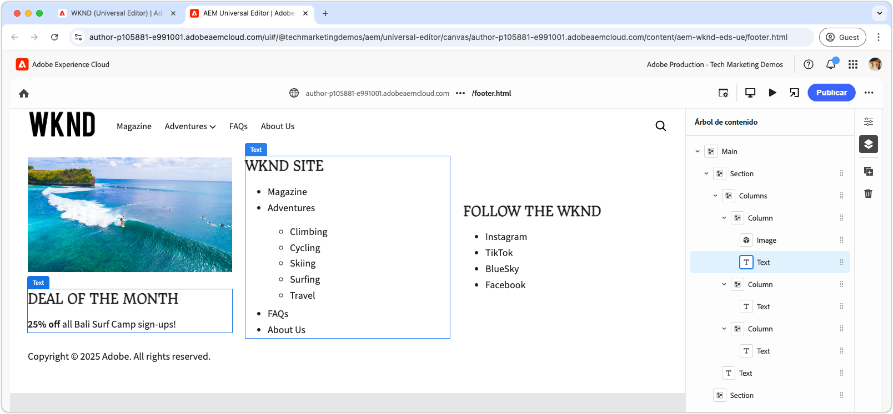

# Desarrollar un encabezado y un pie de página

{align="center"}

Los encabezados y pies de página desempeñan un papel único en Edge Delivery Services (EDS), ya que están enlazados directamente a los elementos `<header>` y `<footer>` de HTML. A diferencia del contenido de la página normal, se administran por separado y se pueden actualizar de forma independiente sin necesidad de purgar toda la caché de la página. Aunque su implementación se encuentra en el proyecto de código como bloques en `blocks/header` y `blocks/footer`, los autores pueden editar su contenido a través de páginas de AEM dedicadas que pueden contener cualquier combinación de bloques.

## Bloque de encabezado

{align="center"}

El encabezado es un bloque especial enlazado al elemento Edge Delivery Services HTML `<header>`.
El elemento `<header>` se entrega vacío y se rellena mediante XHR (AJAX) en una página de AEM independiente.
Esto permite administrar el encabezado de forma independiente del contenido de la página y actualizarlo sin requerir una depuración de caché completa de todas las páginas.

El bloque de encabezado es responsable de solicitar el fragmento de página de AEM que contiene el contenido del encabezado y procesarlo en el elemento `<header>`.

[!BADGE /blocks/header/header.js]{type=Neutral tooltip="Nombre de archivo del ejemplo de código siguiente."}

```javascript
import { getMetadata } from '../../scripts/aem.js';
import { loadFragment } from '../fragment/fragment.js';

...

export default async function decorate(block) {
  // load nav as fragment

  // Get the path to the AEM page fragment that defines the header content from the <meta name="nav"> tag. This is set via the site's Metadata file.
  const navMeta = getMetadata('nav');

  // If the navMeta is not defined, use the default path `/nav`.
  const navPath = navMeta ? new URL(navMeta, window.location).pathname : '/nav';

  // Make an XHR (AJAX) call to request the AEM page fragment and serialize it to a HTML DOM tree.
  const fragment = await loadFragment(navPath);
  
  // Add the content from the fragment HTML to the block and decorate it as needed
  ...
}
```

La función `loadFragment()` realiza una solicitud XHR (AJAX) a `${navPath}.plain.html` que devuelve una representación EDS HTML del HTML de la página AEM que existe en la etiqueta `<main>` de la página, procesa su contenido con los bloques que pueda contener y devuelve el árbol DOM actualizado.

## Crear la página de encabezado

Antes de desarrollar el bloque de encabezado, cree primero su contenido en el editor universal para desarrollar con él.

El contenido del encabezado se encuentra en una página de AEM `nav`.

{align="center"}

Para crear el encabezado:

1. Abrir la página `nav` en el editor universal
1. Reemplace el botón predeterminado por un **bloque de imagen** que contenga el logotipo de WKND
1. Actualizar el menú de navegación en **Bloque de texto** mediante:
   - Adición de los vínculos de navegación deseados
   - Creación de elementos de subnavegación donde sea necesario
   - Estableciendo todos los vínculos a la página principal (`/`) por ahora

{align="center"}

### Publicar para previsualización

Con la página Encabezado actualizada, [publique la página para obtener una vista previa](../6-author-block.md).

Dado que el contenido del encabezado se encuentra en su propia página (la página `nav`), debe publicar esa página específicamente para que los cambios del encabezado surtan efecto. La publicación de otras páginas que utilicen el encabezado no actualizará el contenido del encabezado en Edge Delivery Services.

## Bloquear HTML

Para comenzar el desarrollo del bloque, comience por revisar la estructura DOM expuesta en la vista previa de Edge Delivery Services. El DOM se mejora con JavaScript y se diseña con CSS, lo que proporciona la base para crear y personalizar el bloque.

Dado que el encabezado se carga como un fragmento, es necesario examinar la HTML devuelta por la solicitud XHR después de insertarla en el DOM y decorarla mediante `loadFragment()`. Esto se puede hacer inspeccionando el DOM en las herramientas para desarrolladores del explorador.


>[!BEGINTABS]

>[!TAB DOM para decorar]

El siguiente es el HTML de la página de encabezado después de que se haya cargado con el `header.js` proporcionado y se haya insertado en el DOM:

```html
<header class="header-wrapper">
  <div class="header block" data-block-name="header" data-block-status="loaded">
    <div class="nav-wrapper">
      <nav id="nav" aria-expanded="true">
        <div class="nav-hamburger">
          <button type="button" aria-controls="nav" aria-label="Close navigation">
            <span class="nav-hamburger-icon"></span>
          </button>
        </div>
        <div class="section nav-brand" data-section-status="loaded" style="">
          <div class="default-content-wrapper">
            <p class="">
              <a href="#" title="Button" class="">Button</a>
            </p>
          </div>
        </div>
        <div class="section nav-sections" data-section-status="loaded" style="">
          <div class="default-content-wrapper">
            <ul>
              <li aria-expanded="false">Examples</li>
              <li aria-expanded="false">Getting Started</li>
              <li aria-expanded="false">Documentation</li>
            </ul>
          </div>
        </div>
        <div class="section nav-tools" data-section-status="loaded" style="">
          <div class="default-content-wrapper">
            <p>
              <span class="icon icon-search">
                
              </span>
            </p>
          </div>
        </div>
      </nav>
    </div>
  </div>
</header>
```

>[!TAB Cómo encontrar el DOM]

Para buscar e inspeccionar el elemento `<header>` de la página en las herramientas para desarrolladores del explorador web.

{align="center"}

>[!ENDTABS]


## Bloquear JavaScript

El archivo `/blocks/header/header.js` de la [plantilla de proyecto XWalk de plantillas de AEM](https://github.com/adobe-rnd/aem-boilerplate-xwalk) proporciona JavaScript para la navegación, incluidos menús desplegables y una vista móvil adaptable.

Aunque el script `header.js` se suele personalizar en gran medida para que coincida con el diseño de un sitio, es esencial conservar las primeras líneas de `decorate()`, que recuperan y procesan el fragmento de página de encabezado.

[!BADGE /blocks/header/header.js]{type=Neutral tooltip="Nombre de archivo del ejemplo de código siguiente."}

```javascript
export default async function decorate(block) {
  // load nav as fragment
  const navMeta = getMetadata('nav');
  const navPath = navMeta ? new URL(navMeta, window.location).pathname : '/nav';
  const fragment = await loadFragment(navPath);
  ...
```

El código restante se puede modificar para adaptarlo a las necesidades del proyecto.

En función de los requisitos del encabezado, se puede ajustar o eliminar el código de las plantillas. En este tutorial, utilizaremos el código proporcionado y lo mejoraremos añadiendo un hipervínculo alrededor de la primera imagen creada, vinculándolo a la página principal del sitio.

El código de la plantilla procesa el fragmento de página de encabezado, suponiendo que consta de tres secciones en el siguiente orden:

1. **Sección de marca**: contiene el logotipo y tiene un estilo con la clase `.nav-brand`.
2. **Sección de secciones**: define el menú principal del sitio y está diseñado con `.nav-sections`.
3. **Sección de herramientas**: incluye elementos como búsqueda, inicio de sesión/cierre de sesión y perfil, con estilo `.nav-tools`.

Para enlazar la imagen del logotipo a la página principal, actualizamos el bloque JavaScript de la siguiente manera:

>[!BEGINTABS]

>[!TAB Se actualizó JavaScript]

A continuación se muestra el código actualizado que envuelve la imagen del logotipo con un vínculo a la página principal del sitio (`/`):

[!BADGE /blocks/header/header.js]{type=Neutral tooltip="Nombre de archivo del ejemplo de código siguiente."}

```javascript
export default async function decorate(block) {

  ...
  const navBrand = nav.querySelector('.nav-brand');
  
  // WKND: Turn the picture (image) into a linked site logo
  const logo = navBrand.querySelector('picture');
  
  if (logo) {
    // Replace the first section's contents with the authored image wrapped with a link to '/' 
    navBrand.innerHTML = `<a href="/" aria-label="Home" title="Home" class="home">${logo.outerHTML}</a>`;
    // Make sure the logo is not lazy loaded as it's above the fold and can affect page load speed
    navBrand.querySelector('img').settAttribute('loading', 'eager');
  }

  const navSections = nav.querySelector('.nav-sections');
  if (navSections) {
    // WKND: Remove Edge Delivery Services button containers and buttons from the nav sections links
    navSections.querySelectorAll('.button-container, .button').forEach((button) => {
      button.classList = '';
    });

    ...
  }
  ...
}
```

>[!TAB JavaScript original]

A continuación se muestra el(la) `header.js` original generado(a) a partir de la plantilla:

[!BADGE /blocks/header/header.js]{type=Neutral tooltip="Nombre de archivo del ejemplo de código siguiente."}

```javascript
export default async function decorate(block) {
  ...
  const navBrand = nav.querySelector('.nav-brand');
  const brandLink = navBrand.querySelector('.button');
  if (brandLink) {
    brandLink.className = '';
    brandLink.closest('.button-container').className = '';
  }

  const navSections = nav.querySelector('.nav-sections');
  if (navSections) {
    navSections.querySelectorAll(':scope .default-content-wrapper > ul > li').forEach((navSection) => {
      if (navSection.querySelector('ul')) navSection.classList.add('nav-drop');
      navSection.addEventListener('click', () => {
        if (isDesktop.matches) {
          const expanded = navSection.getAttribute('aria-expanded') === 'true';
          toggleAllNavSections(navSections);
          navSection.setAttribute('aria-expanded', expanded ? 'false' : 'true');
        }
      });
    });
  }
  ...
}
```

>[!ENDTABS]


## Bloquear CSS

Actualice `/blocks/header/header.css` para aplicar estilo de acuerdo con la marca de WKND.

Agregaremos el CSS personalizado al final de `header.css` para que los cambios en el tutorial sean más fáciles de ver y comprender. Aunque estos estilos se pueden integrar directamente en las reglas CSS de la plantilla, mantenerlos separados ayuda a ilustrar lo que se modificó.

Dado que estamos agregando nuestras nuevas reglas después del conjunto original, las ajustaremos con un selector CSS `header .header.block nav` para asegurarnos de que tengan prioridad sobre las reglas de plantilla.

[!BADGE /blocks/header/header.css]{type=Neutral tooltip="Nombre de archivo del ejemplo de código siguiente."}

```css
/* /blocks/header/header.css */

... Existing CSS generated by the template ...

/* Add the following CSS to the end of the header.css */

/** 
* WKND customizations to the header 
* 
* These overrides can be incorporated into the provided CSS,
* however they are included discretely in thus tutorial for clarity and ease of addition.
* 
* Because these are added discretely
* - They are added to the bottom to override previous styles.
* - They are wrapped in a header .header.block nav selector to ensure they have more specificity than the provided CSS.
* 
**/

header .header.block nav {
  /* Set the height of the logo image.
     Chrome natively sets the width based on the images aspect ratio */
  .nav-brand img {
    height: calc(var(--nav-height) * .75);
    width: auto;
    margin-top: 5px;
  }
  
  .nav-sections {
    /* Update menu items display properties */
    a {
      text-transform: uppercase;
      background-color: transparent;
      color: var(--text-color);
      font-weight: 500;
      font-size: var(--body-font-size-s);
    
      &:hover {
        background-color: auto;
      }
    }

    /* Adjust some spacing and positioning of the dropdown nav */
    .nav-drop {
      &::after {
        transform: translateY(-50%) rotate(135deg);
      }
      
      &[aria-expanded='true']::after {
        transform: translateY(50%) rotate(-45deg);
      }

      & > ul {
        top: 2rem;
        left: -1rem;      
       }
    }
  }
```

## Previsualización de desarrollo

A medida que se desarrollan CSS y JavaScript, el entorno de desarrollo local de la CLI de AEM vuelve a cargar los cambios, lo que permite una visualización rápida y sencilla del impacto del código en el bloque. Pase el ratón sobre CTA y compruebe que la imagen del teaser se amplía y reduce.

{align="center"}

## Vincular el código

Asegúrate de [pelar con frecuencia](../3-local-development-environment.md#linting) los cambios de tu código para mantenerlo limpio y consistente. La identificación regular ayuda a detectar los problemas de forma temprana, lo que reduce el tiempo de desarrollo general. Recuerde, no puede combinar su trabajo de desarrollo en la rama `main` hasta que se resuelvan todos los problemas de vinculación.

```bash
# ~/Code/aem-wknd-eds-ue

$ npm run lint
```

## Vista previa en el editor universal

Para ver los cambios en el editor universal de AEM, añádalos, confírmelos y envíelos a la rama del repositorio de Git utilizada por el editor universal. Al hacerlo, se garantiza que la implementación de bloques no interrumpa la experiencia de creación.

```bash
# ~/Code/aem-wknd-eds-ue

$ git add .
$ git commit -m "CSS and JavaScript implementation for Header block"
# JSON files are compiled automatically and added to the commit via a Husky pre-commit hook
$ git push origin header-and-footer
```

Ahora, los cambios están visibles en el Editor universal al usar el parámetro de consulta `?ref=header-and-footer`.

{align="center"}

## Pie de página

Al igual que el encabezado, el contenido del pie de página se crea en una página de AEM específica; en este caso, la página Pie de página (`footer`). El pie de página sigue el mismo patrón de cargarse como fragmento y decorarse con CSS y JavaScript.

>[!BEGINTABS]

>[!TAB Pie de página]

El pie de página debe implementarse con un diseño de tres columnas que contenga:

- Una columna izquierda con una promoción (imagen y texto)
- Una columna central con vínculos de navegación
- Una columna derecha con vínculos a las redes sociales
- Una fila en la parte inferior que abarca las tres columnas con copyright

{align="center"}

>[!TAB Contenido de pie de página]

Utilice el bloque de columnas de la página Pie de página para crear el efecto de tres columnas.

| Columna 1 | Columna 2 | Columna 3 |
| ---------|----------------|---------------|
| Imagen | Encabezado 3 | Encabezado 3 |
| Texto | Lista de vínculos | Lista de vínculos |

{align="center"}

>[!TAB Código de pie de página]

La CSS siguiente aplica estilo al bloque de pie de página con un diseño de tres columnas, espaciado coherente y tipografía. La implementación de pie de página solo utiliza el JavaScript proporcionado por la plantilla.

[!BADGE /blocks/footer/footer.css]{type=Neutral tooltip="Nombre de archivo del ejemplo de código siguiente."}

```css
/* /blocks/footer/footer.css */

footer {
  background-color: var(--light-color);

  .block.footer {
    border-top: solid 1px var(--dark-color);
    font-size: var(--body-font-size-s);

    a { 
      all: unset;
      
      &:hover {
        text-decoration: underline;
        cursor: pointer;
      }
    }

    img {
      width: 100%;
      height: 100%;
      object-fit: cover;
      border: solid 1px white;
    }

    p {
      margin: 0;
    }

    ul {
      list-style: none;
      padding: 0;
      margin: 0;

      li {
        padding-left: .5rem;
      }
    }

    & > div {
      margin: auto;
      max-width: 1200px;
    }

    .columns > div {
      gap: 5rem;
      align-items: flex-start;

      & > div:first-child {
        flex: 2;
      }
    }

    .default-content-wrapper {
      padding-top: 2rem;
      margin-top: 2rem;
      font-style: italic;
      text-align: right;
    }
  }
}

@media (width >= 900px) {
  footer .block.footer > div {
    padding: 40px 32px 24px;
  }
}
```


>[!ENDTABS]

## Enhorabuena.

Ahora ha explorado cómo se administran y desarrollan los encabezados y pies de página en Edge Delivery Services y el Editor universal. Ha aprendido cómo son:

- Se crean en páginas de AEM dedicadas separadas del contenido principal
- Se carga asincrónicamente como fragmentos para habilitar las actualizaciones independientes
- Decorado con JavaScript y CSS para crear experiencias de navegación adaptables
- Se integra a la perfección con el editor universal para facilitar la gestión de contenidos

Este patrón proporciona un enfoque flexible y mantenible para implementar componentes de navegación de todo el sitio.

Para obtener más prácticas recomendadas y técnicas avanzadas, consulte la [documentación del editor universal](https://experienceleague.adobe.com/en/docs/experience-manager-cloud-service/content/edge-delivery/wysiwyg-authoring/create-block#block-options).
